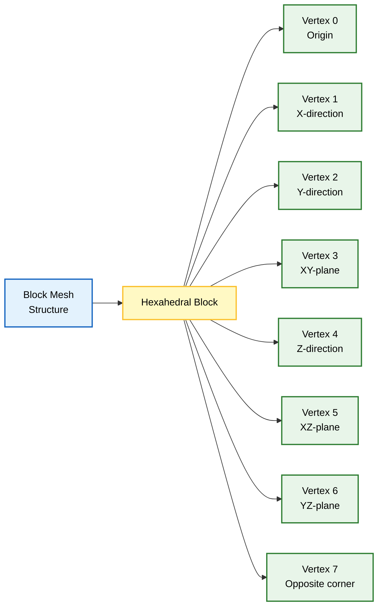
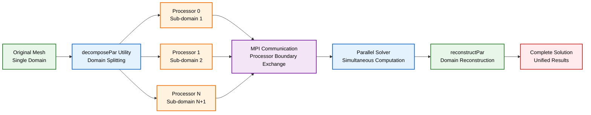
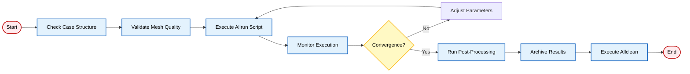

# 2.3 คำสั่งพื้นฐานของ OpenFOAM

OpenFOAM มีชุดเครื่องมือ **command-line** ที่ครอบคลุม ซึ่งเป็นรากฐานของเวิร์กโฟลว์ CFD ใดๆ

คำสั่งเหล่านี้มีความสำคัญสำหรับ:
- **การจัดการ Case**
- **การสร้าง Mesh** 
- **การรัน Simulation**
- **การ Post-processing**

```mermaid
graph LR
    A["Pre-Processing"] --> B["Mesh Generation"]
    B --> C["Boundary Conditions"]
    C --> D["Solver Setup"]
    D --> E["Simulation"]
    E --> F["Post-Processing"]
    
    subgraph PreProcessing["Pre-Processing"]
        A1["Geometry Creation"]
        A2["Domain Definition"]
    end
    
    subgraph MeshGen["Mesh Generation"]
        B1["blockMesh"]
        B2["snappyHexMesh"]
        B3["refineMesh"]
    end
    
    subgraph Boundary["Boundary Conditions"]
        C1["0/ Directory Setup"]
        C2["Initial Conditions"]
        C3["Physics Models"]
    end
    
    subgraph Solver["Solver Setup"]
        D1["controlDict"]
        D2["fvSchemes"]
        D3["fvSolution"]
    end
    
    subgraph Sim["Simulation"]
        E1["Solver Execution"]
        E2["Convergence Check"]
        E3["Time Stepping"]
    end
    
    subgraph PostProcessing["Post-Processing"]
        F1["paraFoam"]
        F2["foamToVTK"]
        F3["Data Analysis"]
    end
    
    A --> PreProcessing
    B --> MeshGen
    C --> Boundary
    D --> Solver
    E --> Sim
    F --> PostProcessing
    
    classDef process fill:#e3f2fd,stroke:#1565c0,stroke-width:2px,color:#000;
    classDef decision fill:#fff9c4,stroke:#fbc02d,stroke-width:2px,color:#000;
    classDef terminator fill:#ffebee,stroke:#c62828,stroke-width:2px,color:#000;
    classDef storage fill:#e8f5e9,stroke:#2e7d32,stroke-width:2px,color:#000;
    
    class A,B,C,D,E,F process;
    class A1,A2,B1,B2,B3,C1,C2,C3,D1,D2,D3,E1,E2,E3,F1,F2,F3 storage;
```





---

## ⚙️ คำสั่งสำหรับการตั้งค่า Environment

ก่อนใช้คำสั่ง OpenFOAM ต้อง **source environment** เพื่อตั้งค่า path และ library:

```bash
# Source OpenFOAM environment (bash shell)
source etc/bashrc

# สำหรับผู้ใช้ csh shell
source etc/cshrc

# ตรวจสอบการติดตั้ง OpenFOAM
echo $WM_PROJECT_VERSION
```

### 📍 ตัวแปร Environment ที่สำคัญ

| ตัวแปร | ความหมาย | การใช้งาน |
|---------|-----------|------------|
| `$WM_PROJECT_DIR` | ไดเรกทอรีการติดตั้ง OpenFOAM | การเข้าถึงไฟล์ระบบ |
| `$WM_PROJECT_VERSION` | เวอร์ชัน OpenFOAM ปัจจุบัน | การตรวจสอบความเข้ากันได้ |
| `$FOAM_RUN` | ไดเรกทอรีของผู้ใช้สำหรับรัน Case | การจัดเก็บผลงาน |
| `$FOAM_APPBIN` | ไดเรกทอรีสำหรับ Application ที่คอมไพล์แล้ว | การเรียกใช้โปรแกรม |
| `$FOAM_LIBBIN` | ไดเรกทอรีสำหรับ Library ที่คอมไพล์แล้ว | การลิงค์โปรแกรม |

---

## 📁 คำสั่งสำหรับการจัดการ Case

### 🔷 การสร้าง Block Mesh

ยูทิลิตี้ `blockMesh` ใช้สร้าง **computational mesh** เริ่มต้นจาก block definition ในไฟล์ `system/blockMeshDict`:

```bash
# สร้าง mesh จาก blockMeshDict
blockMesh

# สร้าง mesh โดยระบุไดเรกทอรี case
blockMesh -case /path/to/case

# สร้าง mesh พร้อมแสดงผลแบบละเอียด (verbose output)
blockMesh -case /path/to/case -debug
```

**หลักการทำงาน:**
- กำหนด **computational domain** โดยใช้ blocks, edges และ boundary conditions
- แต่ละ block ถูกกำหนดด้วย **8 vertices**
- ใช้วิธีการสร้าง **structured hexahedral mesh**





### 🔍 การตรวจสอบคุณภาพ Mesh

หลังการสร้าง mesh สิ่งสำคัญคือการตรวจสอบคุณภาพ mesh โดยใช้ `checkMesh`:

```bash
# ตรวจสอบคุณภาพ mesh เบื้องต้น
checkMesh

# วิเคราะห์คุณภาพ mesh อย่างละเอียด
checkMesh -allGeometry -allTopology

# ตรวจสอบ mesh สำหรับการประมวลผลแบบขนาน
checkMesh -parallel
```

**`checkMesh` ให้ข้อมูลสำคัญเกี่ยวกับ:**
- **Non-orthogonality** ของ mesh faces
- **Skewness** ของ cells  
- **Aspect ratios**
- **สถิติของ Mesh** (cells, faces, points)

### ⚡ การแบ่ง Mesh สำหรับ Parallel Processing

สำหรับการรัน **parallel simulations** ให้แบ่ง mesh โดยใช้ `decomposePar`:

```bash
# แบ่ง mesh สำหรับการรันแบบขนาน
decomposePar

# แบ่งโดยใช้วิธีการแบ่งเฉพาะ
decomposePar -decomposeParDict system/decomposeParDict

# แบ่งสำหรับ parallel execution ด้วย 4 processors
mpirun -np 4 decomposePar
```

**การกำหนด `decomposeParDict`:**
- `method`: **hierarchical, metis, manual, หรือ simple**
- `numberOfSubdomains`: จำนวน processor domains
- `coeffs`: ค่าสัมประสิทธิ์เฉพาะของ method





---

## 🚀 คำสั่งสำหรับการรัน Solver

### 📊 การรัน Serial Simulations

รัน OpenFOAM solvers โดยตรงจาก command line:

```bash
# รัน simpleFoam บน case ปัจจุบัน
simpleFoam

# รันโดยระบุไดเรกทอรี case
simpleFoam -case /path/to/case

# รันโดยปรับเปลี่ยน time step
simpleFoam -case /path/to/case -adjustTimeStep no
```

### 🔗 การรัน Parallel Simulations

สำหรับการรันแบบขนานโดยใช้ **MPI**:

```bash
# รัน solver บน 4 processors
mpirun -np 4 simpleFoam

# รันโดยใช้ hostfile และระบุ processor
mpirun -np 8 -hostfile hosts simpleFoam -parallel

# รันโดยใช้ machine file เฉพาะ
mpirun -machinefile machineFile -np 16 pimpleFoam -parallel
```

### 🔄 การรวมผลลัพธ์ Parallel

หลังจาก parallel simulation เสร็จสมบูรณ์ ให้รวมผลลัพธ์โดยใช้ `reconstructPar`:

```bash
# รวมผลลัพธ์ parallel
reconstructPar

# รวมไดเรกทอรีเวลาที่ระบุ
reconstructPar -time 0,10,20,30

# รวมเฉพาะ fields ที่ระบุ
reconstructPar -fields '(U,p,T)'
```

---

## 📈 คำสั่งสำหรับการ Post-Processing

### 📐 การประมวลผล Field Data

ประมวลผลผลลัพธ์ simulation โดยใช้ `postProcess`:

```bash
# คำนวณขนาดของ vorticity
postProcess -func "mag(vorticity)"

# คำนวณ wall shear stress
postProcess -func wallShearStress

# ทำการหาค่าเฉลี่ย field
postProcess -func fieldAverage -func 'U,p,T'
```

**Vorticity Calculation:**
$$\boldsymbol{\omega} = \nabla \times \mathbf{u}$$

โดยที่:
- $\boldsymbol{\omega}$ = **vorticity vector**
- $\mathbf{u}$ = **velocity field**
- $\nabla \times$ = **curl operator**

### 📊 การ Sample Field Data

ดึงข้อมูลตามเส้นหรือพื้นผิวโดยใช้ `sample`:

```bash
# Sample fields ตามเส้น
sample -case /path/to/case -dict system/sampleDict

# Sample fields ณ ตำแหน่งที่ระบุ
sample -case /path/to/case -surfaceFormat vtk
```

### 👁️ การแสดงผล Flow Field

สร้างข้อมูลสำหรับการแสดงผล (visualization data) สำหรับ ParaView:

```bash
# แปลงข้อมูล OpenFOAM เป็นรูปแบบ VTK
foamToVTK

# แปลงโดยระบุช่วงเวลา
foamToVTK -time 0:100

# แปลงเป็นรูปแบบ ParaView
paraFoam
```

---

## 🛠️ คำสั่ง Utility สำหรับการจัดการ Case

### 🆕 การเริ่มต้น Case

ตั้งค่าไดเรกทอรี case ใหม่:

```bash
# คัดลอก template case
cp -r $FOAM_TUTORIALS/incompressible/simpleFoam/pitzDaily myCase

# ดึง mesh จาก surface geometry
surfaceFeatureExtract -case /path/to/case

# สร้าง mesh จากไฟล์ STL
snappyHexMesh -overwrite
```

### ⏰ การจัดการเวลา

จัดการไดเรกทอรีเวลา:

```bash
# ลบไดเรกทอรีเวลาที่ระบุ
foamListTimes -rm -time 0:10:0.5

# แสดงรายการไดเรกทอรีเวลาที่มีอยู่
foamListTimes

# เปลี่ยนชื่อไดเรกทอรีเวลา
foamListTimes -rename 0:init
```

### 📊 การจัดการ Field

จัดการและประมวลผลไฟล์ field:

```bash
# รวมไดเรกทอรีเวลา
mergeTimeDirs 0 0.1

# ปรับขนาดค่า field
foamCalc scale U 2.0

# คำนวณสถิติ field
foamCalc mag U
```

---

## 🎯 ตัวเลือกคำสั่งขั้นสูง

### 🐛 การ Debugging และ Development

สำหรับการพัฒนา solver และการ debugging:

```bash
# รันพร้อมข้อมูล debug
solverName -debug

# รันพร้อม debug switches ที่ระบุ
solverName -debugSwitch turbulenceModel=1

# คอมไพล์พร้อม debug symbols
wmake -debug
```

### 🤖 การทำให้เป็นอัตโนมัติและการ Scripting

สร้างเวิร์กโฟลว์อัตโนมัติ:

```bash
# รันสคริปต์ Allrun
./Allrun

# รันสคริปต์ Allclean
./Allclean

# รันใน background พร้อมการเปลี่ยนเส้นทาง output
simpleFoam > log.simpleFoam 2>&1 &
```





---

## ✅ แนวปฏิบัติที่ดีที่สุด

### 🎯 หลักการสำคัญ

1. **ตรวจสอบโครงสร้าง case เสมอ** ก่อนรัน solvers
2. **ใช้ absolute paths** ในสคริปต์เพื่อหลีกเลี่ยงปัญหาการแก้ไข path
3. **ติดตาม output ของ solver** ผ่านไฟล์ log เพื่อตรวจสอบ **convergence**
4. **ทำให้งานที่ทำซ้ำๆ เป็นอัตโนมัติ** โดยใช้ shell scripts

### 📋 ระเบียบการทำงานแนะนำ

| ขั้นตอน | คำสั่ง | วัตถุประสงค์ |
|----------|---------|--------------|
| 1. Setup | `source etc/bashrc` | ตั้งค่า environment |
| 2. Mesh | `blockMesh` | สร้าง computational mesh |
| 3. Check | `checkMesh` | ตรวจสอบคุณภาพ mesh |
| 4. Decompose | `decomposePar` | เตรียมสำหรับ parallel |
| 5. Solve | `mpirun -np N solver` | รัน simulation |
| 6. Reconstruct | `reconstructPar` | รวมผลลัพธ์ parallel |
| 7. Post-process | `postProcess` | วิเคราะห์ผลลัพธ์ |
