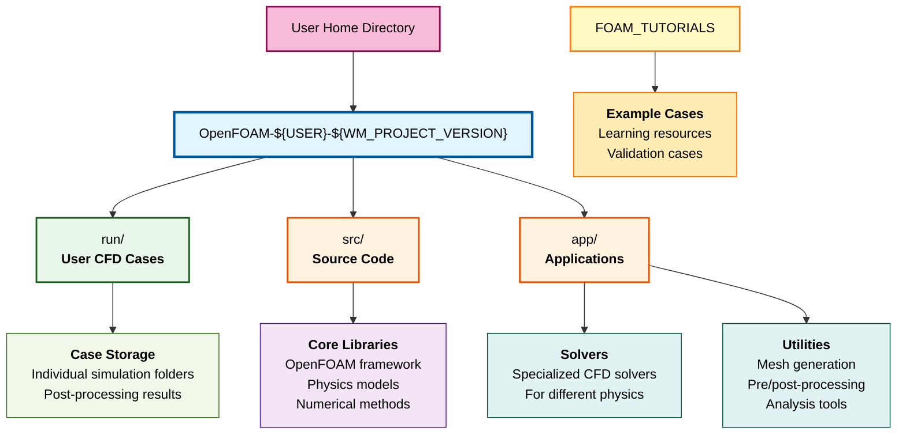
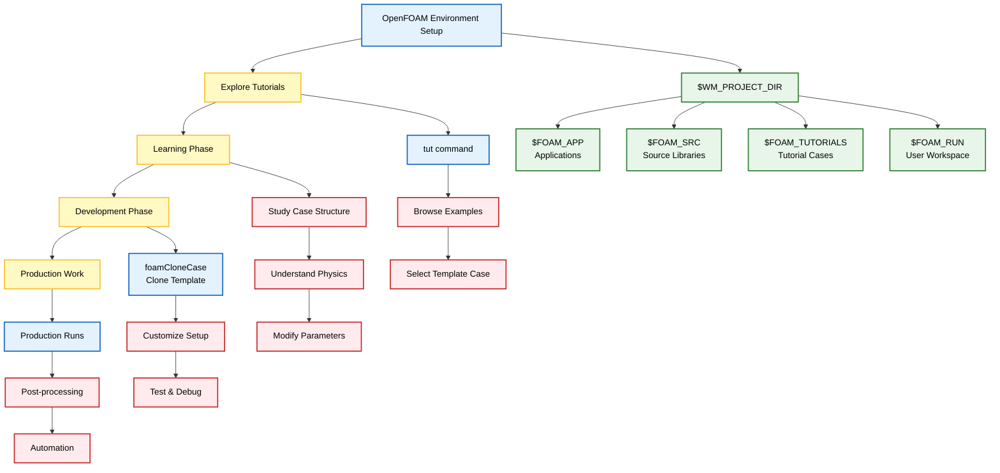

## 1. การตั้งค่าและการนำทาง

### คำสั่งนำทาง OpenFOAM ที่จำเป็น

**OpenFOAM** มีคำสั่ง alias ในตัวหลายคำสั่งที่ช่วยให้การนำทางผ่านโครงสร้าง directory ที่ซับซ้อนของสภาพแวดล้อม **CFD** เป็นไปอย่างราบรื่น คำสั่งเหล่านี้มีความสำคัญต่อการจัดการ **workflow** และการจัดการ case อย่างมีประสิทธิภาพ

#### การนำทาง Directory

| คำสั่ง | หน้าที่ | Path ปลายทาง | คำอธิบาย |
|--------|----------|---------------|-----------|
| `run` | ไปยัง user run directory | `$HOME/OpenFOAM/${USER}-${WM_PROJECT_VERSION}/run` | **ที่เก็บ CFD cases ส่วนตัว** และผลการจำลอง |
| `tut` | ไปยัง tutorials directory | `$FOAM_TUTORIALS` | **ตัวอย่าง case ครอบคลุม** ตั้งแต่ laminar ไปจนถึง multiphase |
| `app` | ไปยัง applications directory | `$FOAM_APP` | **Solvers, utilities และ test programs** ทั้งหมด |
| `src` | ไปยัง source code directory | `$FOAM_SRC` | **Core libraries, frameworks** และ source code |





#### การจัดการ Case

**`foamCloneCase`**
คัดลอก case folder โดย **ไม่รวมไฟล์ผลลัพธ์ขนาดใหญ่** (time directories, solution files และ post-processing data) ซึ่งมีประโยชน์อย่างยิ่งสำหรับ:

- การสร้าง **template cases**
- การแบ่งปัน **setups** โดยไม่มีภาระด้าน computational
- การทำซ้ำ **configurations** หลายๆ โปรเจค

```bash
foamCloneCase cavity myCase
```

#### ขั้นตอนการใช้งานจริง

1. **ไปยัง tutorials**: `tut`
2. **เข้าสู่ตัวอย่าง CFD พื้นฐาน**: `cd incompressible/icoFoam/cavity`
3. **Clone เพื่อทดลอง**: `foamCloneCase cavity myModifiedCavity`
4. **ทำงานใน run directory**: `run` และไปยัง case ใหม่ของคุณ

#### โครงสร้าง Directory Hierarchy

**Key Environment Variables:**

- **`$WM_PROJECT_DIR`**: Root OpenFOAM installation directory
- **`$FOAM_APP`**: Applications (solvers และ utilities)
- **`$FOAM_SRC`**: Source code libraries  
- **`$FOAM_TUTORIALS`**: Tutorial cases และตัวอย่าง
- **`$FOAM_RUN`**: User workspace สำหรับ CFD cases





#### การบูรณาการ Workflow

คำสั่งนำทางเหล่านี้มักใช้ตามลำดับ:

1. **การสำรวจ**: `tut` → สำรวจ example cases
2. **การเรียนรู้**: `src` → ตรวจสอบ solver implementations  
3. **การพัฒนา**: `app` → เข้าถึง utilities และ tools
4. **การทำงาน**: `run` → จัดการ personal projects
5. **การแบ่งปัน**: `foamCloneCase` → แจกจ่าย case setups

#### การตั้งค่า Environment

การตั้งค่า environment variables ที่จำเป็น:

```bash
source etc/bashrc  # Sets up all OpenFOAM environment variables
```

**ตัวแปรสำคัญ:**
- `WM_PROJECT_VERSION`: OpenFOAM version
- `FOAM_INST_DIR`: Installation directory  
- `FOAM_RUN`: User workspace directory
- `FOAM_APPBIN`: Compiled applications directory
- `FOAM_SOLVERS`: Solver source directory
