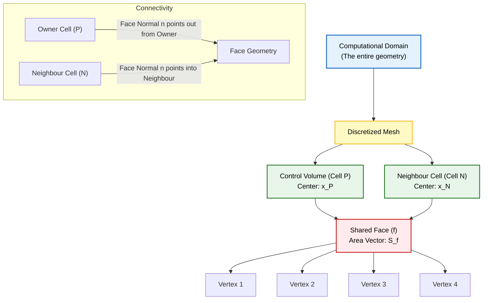

## 2. การสร้าง Mesh

### 🏗️ พื้นฐาน Mesh Generation

ขั้นตอนแรกของการจำลองทางฟิสิกส์ใดๆ คือการสร้าง **computational mesh** ซึ่งจะทำการแบ่งโดเมนการคำนวณออกเป็นปริมาตรควบคุม (control volumes) จำนวนจำกัด



> **Prompt:** Technical 3D isometric schematic of computational mesh with polyhedral cell connectivity. Primary: Velocity field (u) as blue streamlines. Annotations: Sharp professional arrowheads (n = Red, u = Blue). Clear labels in sans-serif font using single letters or LaTeX. Ray-traced studio lighting on semi-transparent materials. Style: Engineering illustration, high-contrast, white background, 8k resolution.


OpenFOAM มี **mesh utilities** หลายตัวที่ปรับให้เข้ากับความซับซ้อนทางเรขาคณิตและข้อกำหนดทางวิศวกรรมที่แตกต่างกัน

---

### 🧱 `blockMesh` - Mesh แบบ Structured

#### **การใช้งาน**
- **เหมาะสำหรับ**: รูปทรงเรขาคณิตแบบง่าย มีโครงสร้างเป็นบล็อก
- **ข้อดี**: **Structured meshes** ให้ความแม่นยำเชิงตัวเลขที่เหนือกว่า
- **ตัวอย่าง**: ช่องสี่เหลี่ยม ท่อ และการกำหนดค่าอย่างง่าย

#### **อินพุตหลัก**
ไฟล์ dictionary `system/blockMeshDict` ประกอบด้วย:

- **การกำหนด Block**: แต่ละ Block ต้องมี 8 vertices ที่กำหนดพื้นที่ลูกบาศก์เชิงโทโพโลยี
- **การไล่ระดับ Edge**: ควบคุมความหนาแน่นของ Mesh ผ่านอัตราส่วนการขยายทางเรขาคณิต
- **Boundary patches**: กำหนด inlet, outlet, walls และ Boundary Condition อื่นๆ
- **การตั้งค่าความหนาแน่นของ Mesh**: ควบคุมจำนวน cells ในแต่ละทิศทาง

#### **คำสั่ง**
```bash
blockMesh
```

utility นี้จะสร้าง directory `polyMesh` ซึ่งประกอบด้วย:
- `points`: พิกัด vertex ของ Mesh
- `faces`: การเชื่อมต่อ face ของ Mesh
- `cells`: การกำหนด cell ของ Mesh
- `boundary`: การกำหนด Boundary patch

#### **พื้นฐานทางคณิตศาสตร์**
คุณภาพของ Mesh ส่งผลโดยตรงต่อข้อผิดพลาดในการ discretization เชิงตัวเลข

สำหรับ **structured hexahedral meshes** ข้อผิดพลาดในการตัดทอน (truncation error) $\tau_h$ จะลดลงเหลือน้อยที่สุดเมื่อองค์ประกอบของ Mesh มีลักษณะใกล้เคียงกับ orthogonal และมี aspect ratios ใกล้เคียงกับหนึ่ง

#### **OpenFOAM Code Implementation**
```cpp
convertToMeters 0.1;  // Scale factor

vertices
(
    (0 0 0)           // Vertex 0
    (1 0 0)           // Vertex 1
    (1 1 0)           // Vertex 2
    (0 1 0)           // Vertex 3
    (0 0 0.5)         // Vertex 4
    // ... remaining vertices
);

blocks
(
    hex (0 1 2 3 4 5 6 7) (10 10 5) simpleGrading (1 1 1)
);

boundary
(
    inlet
    {
        type patch;
        faces ((0 4 7 3));
    }
    // ... other boundaries
);
```

---

### 🎯 `snappyHexMesh` - Mesh แบบ Unstructured

#### **การใช้งาน**
- **เหมาะสำหรับ**: รูปทรงเรขาคณิตที่ซับซ้อนและไม่มีโครงสร้าง
- **ตัวอย่าง**: รถยนต์, อากาศพลศาสตร์, การไหลทางชีวภาพ
- **หลักการ**: Snap background hexahedral mesh เข้ากับ triangulated surface geometry (`.stl`)

#### **ขั้นตอนการทำงาน**

```mermaid
graph LR
    A["Background Hexahedral Mesh<br/>Initial uniform grid"] --> B["Castellation<br/>Refine cells at geometry intersections<br/>🔭 Mesh refinement at surface"]
    B --> C["Snapping<br/>Project vertices onto surface<br/>📐 Align mesh with geometry"]
    C --> D["Layer Addition<br/>Add boundary layer cells<br/>🌠 Near-wall refinement"]
    D --> E["Final Unstructured Mesh<br/>Quality checks<br/>✅ Ready for CFD simulation"]

    style A fill:#f5f5f5,stroke:#333,stroke-width:2px,color:#000
    style B fill:#e3f2fd,stroke:#1565c0,stroke-width:2px,color:#000
    style C fill:#fff3e0,stroke:#f57c00,stroke-width:2px,color:#000
    style D fill:#e8f5e9,stroke:#2e7d32,stroke-width:2px,color:#000
    style E fill:#f3e5f5,stroke:#7b1fa2,stroke-width:2px,color:#000

    %% Styling Definitions
    classDef process fill:#e3f2fd,stroke:#1565c0,stroke-width:2px,color:#000
    classDef decision fill:#fff9c4,stroke:#fbc02d,stroke-width:2px,color:#000
    classDef terminator fill:#ffebee,stroke:#c62828,stroke-width:2px,color:#000
    classDef storage fill:#e8f5e9,stroke:#2e7d32,stroke-width:2px,color:#000
```




**Algorithm Flow**:
1. **Castellation**: แยก Mesh เริ่มต้นตามจุดตัดของพื้นผิว
2. **Snapping**: ฉาย vertex ของ Mesh ไปยัง surface geometry  
3. **Layer addition**: แทรก Boundary layer cells สำหรับการไหลที่ถูกจำกัดด้วยผนัง

#### **คำสั่ง**
```bash
snappyHexMesh -overwrite
```

#### **อินพุตหลัก**
`system/snappyHexMeshDict` ประกอบด้วยการควบคุม Meshing ที่ครอบคลุม:

- **การกำหนด Geometry**: การนำเข้าไฟล์พื้นผิว STL/OBJ
- **Feature edges**: การดึง edge โดยอัตโนมัติหรือด้วยตนเอง
- **ระดับการ Refinement**: การ Refinement แบบปรับตัวตามระยะห่างจากพื้นผิว
- **การแทรก Layer**: การสร้าง Boundary layer mesh เพื่อฟิสิกส์ใกล้ผนังที่แม่นยำ
- **การควบคุมคุณภาพ**: ขีดจำกัดของ Skewness, non-orthogonality และ aspect ratio

#### **พื้นฐานทางคณิตศาสตร์**
ตัวชี้วัดคุณภาพของ Mesh ถูกควบคุมโดย:

$$\cos\theta = \frac{\mathbf{n}_f \cdot \mathbf{d}_{PN}}{|\mathbf{n}_f||\mathbf{d}_{PN}|}$$

โดยที่:
- $\theta$ = มุมระหว่าง face normal และ cell center line
- $\mathbf{n}_f$ = face normal vector  
- $\mathbf{d}_{PN}$ = vector ระหว่าง cell centers ของ P และ N

$$S_f = 1 - \frac{2|\mathbf{d}_{PN} \cdot \mathbf{d}_{NP}|}{|\mathbf{d}_{PN} + \mathbf{d}_{NP}|^2}$$

สำหรับ cell $P$ และ neighbor $N$ โดยที่:
- $S_f$ = Skewness factor
- $\mathbf{d}_{PN}$ = vector จาก cell P ถึง N
- $\mathbf{d}_{NP}$ = vector จาก cell N ถึง P

$$AR = \frac{\text{max cell dimension}}{\text{min cell dimension}}$$

โดยที่:
- $AR$ = Aspect Ratio ของ cell

#### **OpenFOAM Code Implementation**
```cpp
castellatedMeshControls
{
    maxLocalCells 1000000;
    maxGlobalCells 2000000;
    minRefinementCells 0;
    nCellsBetweenLevels 2;
    features
    (
        {
            file "surface.eMesh";
            level 2;
        }
    );
}

snapControls
{
    nSmoothPatch 3;
    tolerance 2.0;
    nSolveIter 30;
    nRelaxIter 5;
}

addLayersControls
{
    relativeSizes true;
    layers
    {
        surface
        {
            nSurfaceLayers 5;
            expansionRatio 1.3;
        }
    }
}
```

---

### 📏 มาตรฐานคุณภาพ Mesh

| **พารามิเตอร์** | **ค่าที่แนะนำ** | **ผลกระทบ** | **การยอมรับได้** |
|------------------|------------------|---------------|-----------------|
| **Non-orthogonality** | < 70° | ความเสถียรของการคำนวณ | สูงสุด 85° (พร้อม stabilized numerics) |
| **Skewness** | < 4 | ความแม่นยำของผลลัพธ์ | < 6 สำหรับ first-order schemes |
| **Aspect Ratio** | < 10 | ความเร็วในการลู่เข้า | < 20 สำหรับ structured meshes |
| **Boundary layer y+** | 1-30 | ความแม่นยำของ turbulence modeling | < 1 สำหรับ resolved turbulence |
| **Expansion Ratio** | < 1.3 | ความเรียบของการเปลี่ยนผ่าน | < 1.5 สำหรับ far-field regions |

---

### 🔍 การประเมินคุณภาพหลัง Mesh

#### **คำสั่งตรวจสอบ**
```bash
checkMesh -constant
```

#### **ผลลัพธ์ที่ตรวจสอบ**
- **Geometry statistics**: จำนวน cells, faces, vertices
- **Mesh quality metrics**: Non-orthogonality, skewness, aspect ratios  
- **Boundary consistency**: การเชื่อมต่อของ boundary patches
- **Connectivity issues**: Dangling faces, unused points

#### **การแก้ไขปัญหาทั่วไป**
1. **High non-orthogonality**: ปรับ mesh quality หรือใช้ limited schemes
2. **High skewness**: สร้าง mesh ใหม่หรือใช้ Laplacian smoothing  
3. **Poor boundary layer**: ปรับ expansion ratio หรือ layer thickness
4. **Connectivity problems**: ตรวจสอบ surface geometry และ tolerances

---

### 📋 เปรียบเทียบ Mesh Utilities

| **Utility** | **ประเภท Geometry** | **Complexity** | **Control Level** | **Best Use Case** |
|------------|---------------------|----------------|------------------|------------------|
| **blockMesh** | Simple, blocky | 🟢 ต่ำ | 🔴 สูงมาก | Benchmark cases, structured domains |
| **snappyHexMesh** | Complex STL/OBJ | 🟡 กลาง | 🟡 ปานกลาง | Engineering applications, external flow |
| **cfMesh** | Industrial CAD | 🟡 กลาง | 🟡 ปานกลาง | Production workflow, automated meshing |
| **Hexpress** | CAD assemblies | 🔴 สูง | 🟢 ต่ำ | Rapid prototyping, complex geometries |
