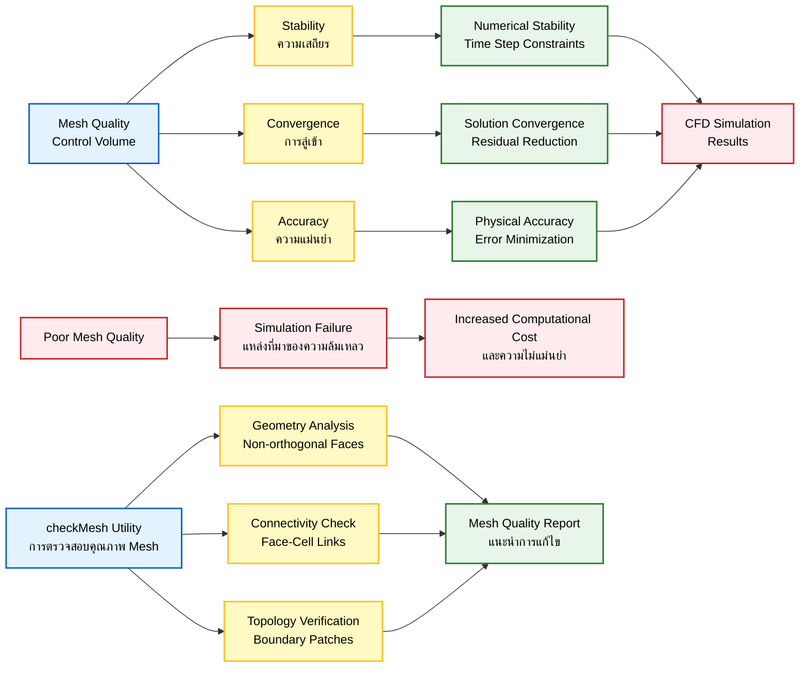
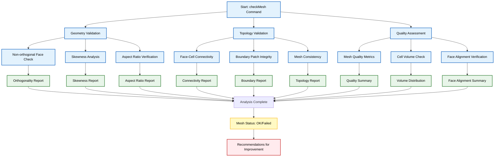
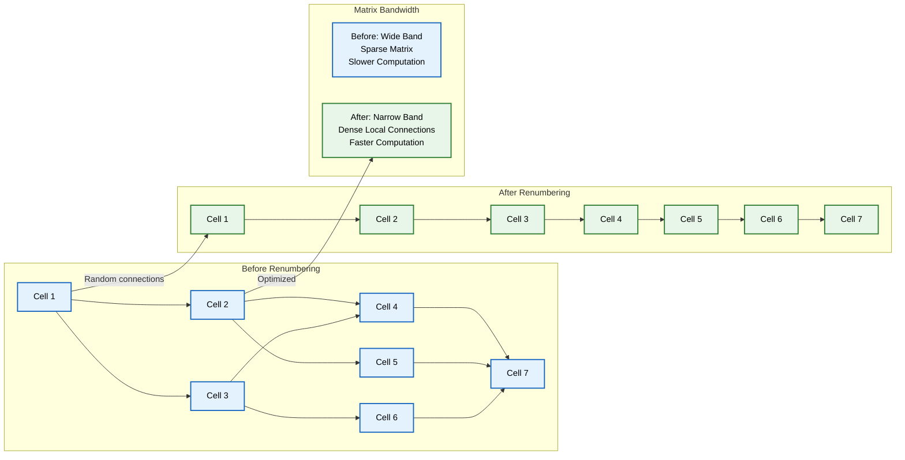
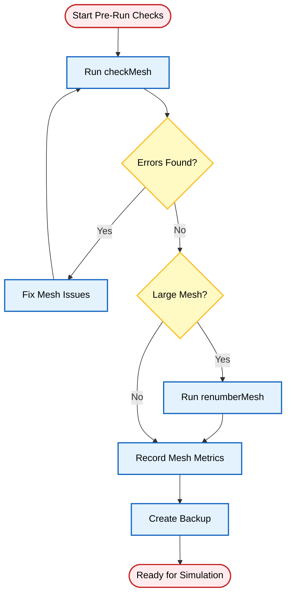

## 3. การตรวจสอบและการจัดการ Mesh

**ควร**ตรวจสอบ Mesh ของคุณเสมอ ก่อนที่จะรัน Solver คุณภาพของ Mesh ส่งผลโดยตรงต่อ:
- **ความเสถียร (stability)**
- **การลู่เข้า (convergence)**
- **ความแม่นยำ (accuracy)**

คุณภาพ Mesh ที่ไม่ดีเป็นหนึ่งในสาเหตุที่พบบ่อยที่สุดของความล้มเหลวในการจำลอง CFD





### `checkMesh`

คำสั่งที่สำคัญที่สุด ใช้ตรวจสอบความถูกต้องของ **Geometry**, **Topology** และคุณภาพของ Mesh





Utility `checkMesh` ทำการวิเคราะห์ Mesh อย่างครอบคลุม:

- **การเชื่อมต่อ (Connectivity)**: ตรวจสอบการเชื่อมต่อระหว่าง Face และ Cell ที่ถูกต้อง
- **Geometry**: ตรวจสอบ Non-orthogonal faces และ Skewness
- **Boundary Conditions**: ตรวจสอบความถูกต้องของการกำหนด Boundary patch
- **Topology**: ตรวจสอบให้แน่ใจว่า Mesh มี Topology ที่ถูกต้อง

```bash
checkMesh
```

#### การตีความผลลัพธ์ที่สำคัญ

| ผลลัพธ์ | ความหมาย | การดำเนินการ |
|---------|---------|-------------|
| **"Mesh OK"** | Mesh ของคุณพร้อมสำหรับการคำนวณ | สามารถดำเนินการต่อได้ |
| **"Failed"** | ปัญหาสำคัญที่อาจทำให้ Solver หยุดทำงาน | ต้องแก้ไขก่อนรัน |
| **"Skewness faces"** | Cell คุณภาพต่ำที่อาจส่งผลต่อความแม่นยำ | พิจารณาปรับปรุง Mesh |
| **"Non-orthogonal faces"** | อาจต้องใช้ Numerical scheme พิเศษ | ตรวจสอบ scheme settings |
| **"Zero area faces"** | Faces ที่ผิดรูปและต้องถูกลบออก | ต้องแก้ไขทันที |

#### เมตริกคุณภาพที่สำคัญ

| เมตริก | ค่าที่แนะนำ | ผลกระทบ |
|---------|-------------|----------|
| **Max non-orthogonality** | < 70° | ความเสถียรของ Solver |
| **Max skewness** | < 0.8 (ดีที่สุด < 0.5) | ความแม่นยำของผลลัพธ์ |
| **Aspect ratio** | ค่าที่สูง = คุณภาพต่ำ | ความเร็วในการลู่เข้า |
| **Determinant** | ใกล้ 1 = ดี | ความถูกต้องของ Geometry |

### `renumberMesh`

ปรับปรุง Mesh ให้คำนวณได้เร็วขึ้น (ลด **Bandwidth** ของ Matrix)





Utility นี้จะจัดเรียงลำดับการนับ Cell และ Face ใหม่ เพื่อเพิ่มประสิทธิภาพในการคำนวณ:

- ลด Bandwidth ของ Matrix เพื่อประสิทธิภาพ Linear Solver ที่เร็วขึ้น
- ปรับปรุงประสิทธิภาพ Cache ระหว่างการดำเนินการ Matrix
- ลดความต้องการ Bandwidth ของหน่วยความจำ

```bash
renumberMesh -overwrite
```

#### ประโยชน์ของ renumberMesh

| ประโยชน์ | คำอธิบาย |
|----------|----------|
| **การลู่เข้าที่เร็วขึ้น** | ลดจำนวน Iteration สำหรับ Linear Solver |
| **การใช้หน่วยความจำที่ต่ำลง** | การจัดเก็บ Matrix ที่กระชับขึ้น |
| **ประสิทธิภาพการประมวลผลแบบขนานที่ดีขึ้น** | การกระจายโหลดที่ดีขึ้นในการแบ่ง Domain |

### Utility สำหรับ Mesh เพิ่มเติม

| Utility | ฟังก์ชันหลัก | กรณีใช้งาน |
|---------|--------------|-------------|
| **transformPoints** | ปรับขนาด, หมุน, หรือเลื่อน Geometry | การปรับตำแหน่งหรือขนาดโดเมน |
| **mergeMeshes** | รวม Mesh หลายส่วนเข้าด้วยกัน | การสร้างโดเมนที่ซับซ้อนจากหลายส่วน |
| **refineMesh** | ปรับความละเอียดของ Mesh | การเพิ่มความละเอียดในบริเวณสนใจ |
| **addLayersCellZone** | เพิ่ม Cell zone สำหรับ Boundary layer | การจัดการ flow near walls |
| **createBaffles** | แยก Internal face สำหรับบริเวณผนังบาง | การจำลอง porous media หรือ thin walls |

### รายการตรวจสอบที่จำเป็นก่อนการรัน



**Step-by-Step Pre-Run Checklist:**

1. **ควรเรียกใช้ `checkMesh` เสมอ** 
   - หลังจากการแก้ไข Mesh ใดๆ
   - หลังจากการแก้ไขข้อผิดพลาด

2. **แก้ไขข้อความ "Failed" ทั้งหมด** 
   - ก่อนที่จะพยายามคำนวณ
   - ตรวจสอบสาเหตุของความล้มเหลว

3. **พิจารณาใช้ `renumberMesh`** 
   - สำหรับ Mesh ขนาดใหญ่
   - เพื่อการเพิ่มประสิทธิภาพ

4. **บันทึกเมตริกคุณภาพของ Mesh** 
   - สำหรับการตรวจสอบความถูกต้อง
   - สำหรับการเปรียบเทียบระหว่าง cases

5. **สร้าง Mesh backup** 
   - ก่อนการแก้ไขที่สำคัญ
   - เพื่อความปลอดภัยของข้อมูล
