# 4. การรัน Simulation (Solving)

## 4.1 Basic Solver Commands

OpenFOAM มี Solver เฉพาะทางสำหรับฟิสิกส์การไหลที่แตกต่างกัน แต่ละ Solver จะใช้ Numerical Algorithm เฉพาะที่ปรับให้เหมาะกับ Flow Regime นั้นๆ:

### **icoFoam**: Incompressible, Laminar, Transient

- **ใช้ PISO Algorithm** สำหรับ Transient Incompressible Flow
- **เหมาะสำหรับ**: การไหลที่ Viscosity มีบทบาทสำคัญ
- **สมการควบคุม**:
  $$
  \frac{\partial \mathbf{u}}{\partial t} + (\mathbf{u} \cdot \nabla) \mathbf{u} = -\frac{1}{\rho} \nabla p + \nu \nabla^2 \mathbf{u}
  $$
  $$
  \nabla \cdot \mathbf{u} = 0
  $$

- **ความหมายตัวแปร**:
  - $\mathbf{u}$ = ความเร็วของไหล (m/s)
  - $p$ = ความดัน (Pa)
  - $\rho$ = ความหนาแน่น (kg/m³)
  - $\nu$ = ความหนืด (m²/s)

```mermaid
graph TD
    Start(["Start Time Step"]) --> ReadFields["Read Fields<br/>u, p, phi"]
    ReadFields --> MomentumPredictor["Momentum Predictor<br/>Solve U equation<br/>implicit"]
    MomentumPredictor --> Turbulence["Turbulence Model<br/>Update turbulence<br/>properties"]
    Turbulence --> PressureLoopStart{"Start Pressure<br/>Correction Loop"}
    PressureLoopStart --> PredictU["Predict U*<br/>using pressure<br/>gradient"]
    PredictU --> Assemble["Assemble Pressure<br/>Poisson Equation"]
    Assemble --> SolveP["Solve Pressure<br/>Equation<br/>∇²p = ∇⋅U*/Δt"]
    SolveP --> CorrectU["Correct Velocity<br/>U = U* - Δt∇p"]
    CorrectU --> CorrectPhi["Correct Flux<br/>φ = φ* - Δt∇p"]
    CorrectPhi --> CheckConvergence{"Converged?<br/>or nCorr reached"}
    CheckConvergence -->|No| PressureLoopStart
    CheckConvergence -->|Yes| TransportEqs["Solve Transport<br/>Equations<br/>(species, energy)"]
    TransportEqs --> ConvergenceCheck{"Overall<br/>Converged?"}
    ConvergenceCheck -->|No| UpdateTime["Update Time<br/>t = t + Δt"]
    UpdateTime --> EndStep["Write Output<br/>if needed"]
    EndStep --> Continue{"Continue<br/>Simulation?"}
    Continue -->|Yes| ReadFields
    Continue -->|No| Final["Finish Simulation"]
    ConvergenceCheck -->|Yes| Final

    %% Styling Definitions
    classDef process fill:#e3f2fd,stroke:#1565c0,stroke-width:2px,color:#000;
    classDef decision fill:#fff9c4,stroke:#fbc02d,stroke-width:2px,color:#000;
    classDef terminator fill:#ffebee,stroke:#c62828,stroke-width:2px,color:#000;
    classDef storage fill:#e8f5e9,stroke:#2e7d32,stroke-width:2px,color:#000;

    class Start,Final terminator;
    class ReadFields,MomentumPredictor,Turbulence,PredictU,Assemble,SolveP,CorrectU,CorrectPhi,TransportEqs,UpdateTime,EndStep process;
    class PressureLoopStart,CheckConvergence,ConvergenceCheck,Continue decision;
    class storage storage;
```





### **simpleFoam**: Incompressible, Turbulent, Steady-state

- **ใช้ SIMPLE Algorithm** สำหรับ Steady-state Incompressible Flow
- **เหมาะสำหรับ**: การไหลที่มีการจำลอง Turbulence
- **สมการ Reynolds-averaged Navier-Stokes (RANS)**:
  $$
  \frac{\partial}{\partial x_j}(\rho \bar{u}_i \bar{u}_j) = -\frac{\partial \bar{p}}{\partial x_i} + \frac{\partial}{\partial x_j}(\mu \frac{\partial \bar{u}_i}{\partial x_j} - \rho \overline{u'_i u'_j})
  $$

- **ความหมายตัวแปร**:
  - $\bar{u}_i$ = ค่าเฉลี่ยความเร็วตามทิศทาง i
  - $\bar{p}$ = ค่าเฉลี่ยความดัน
  - $\mu$ = ความหนืดพลศาสตร์
  - $\overline{u'_i u'_j}$ = Reynolds stress tensor

### **pimpleFoam**: Incompressible, Turbulent, Transient

- **ใช้ PIMPLE Algorithm** (PISO + SIMPLE)
- **ประโยชน์**: ความเสถียรของ SIMPLE + ความแม่นยำของ PISO
- **เหมาะสำหรับ**: Transient Turbulent Flow ที่ต้องการ Time Step ที่ใหญ่ขึ้น
- **ข้อดี**: รักษา Convergence ในขณะที่ใช้ Time Step ที่ใหญ่ขึ้นได้

```mermaid
graph LR
    A["Initialize t = t0<br/>Load Fields"] --> B["Momentum Equation<br/>Predict Velocity"]
    B --> C["Pressure Correction<br/>PISO Loop"]
    C --> D{"Converged?<br/>(PISO criteria)"}
    D -->|No| C
    D -->|Yes| E["Update Fields<br/>Velocity & Pressure"]
    E --> F{"SIMPLE Correction?<br/>(Under-relaxation)"}
    F -->|Yes| G["Apply Under-relaxation<br/>to Fields"]
    G --> H["Check Overall<br/>Convergence"]
    F -->|No| H
    H --> I{"Time Step<br/>Converged?"}
    I -->|No| B
    I -->|Yes| J["Advance Time<br/>t = t + Δt"]
    J --> K{"Final Time<br/>Reached?"}
    K -->|No| B
    K -->|Yes| L["End Simulation"]
    
    M["PIMPLE Algorithm<br/>Hybrid PISO+SIMPLE"] --> A
    
    style M fill:#ff9800,stroke:#f57c00,stroke-width:3px,color:#fff;
    
    classDef process fill:#e3f2fd,stroke:#1565c0,stroke-width:2px,color:#000;
    classDef decision fill:#fff9c4,stroke:#fbc02d,stroke-width:2px,color:#000;
    classDef terminator fill:#ffebee,stroke:#c62828,stroke-width:2px,color:#000;
    classDef storage fill:#e8f5e9,stroke:#2e7d32,stroke-width:2px,color:#000;
    
    class A,B,E,G,J process;
    class C,F,H,I,K decision;
    class D,L terminator;
    class M storage;
```





### **interFoam**: Multiphase (VOF), Immiscible Fluids

- **ใช้ Volume of Fluid (VOF) Method**
- **เหมาะสำหรับ**: การติดตาม Interface ระหว่างของไหลสองชนิดที่ไม่ผสมกัน
- **สมการ Volume Fraction**:
  $$
  \frac{\partial \alpha}{\partial t} + \nabla \cdot (\alpha \mathbf{u}) + \nabla \cdot (\alpha (1-\alpha) \mathbf{u}_r) = 0
  $$

- **ความหมายตัวแปร**:
  - $\alpha$ = Volume fraction ของ phase หลัก
  - $\mathbf{u}_r$ = ความเร็วสัมพัทธ์ระหว่าง phase
  - $\mathbf{u}$ = ความเร็วเฉลี่ยของ phase mixture

## 4.2 Solver Selection Guidelines

### **เกณฑ์การเลือก Solver**

| ลักษณะการไหล | Solver ที่แนะนำ | ความแม่นยำ | ประสิทธิภาพ | กรณีที่เหมาะสม |
|---------------|-----------------|-------------|-------------|------------------|
| **เลข Reynolds ต่ำ, Transient** | `icoFoam` | สูง | ปานกลาง | Laminar flow, การไหลในท่อขนาดเล็ก |
| **เลข Reynolds สูง, Steady** | `simpleFoam` | ปานกลาง | สูง | การไหลสถานีภาพพร้อม turbulence |
| **Turbulence แบบ Transient** | `pimpleFoam` | สูง | ปานกลาง | การไหลไม่สถานีภาพพร้อม turbulence |
| **หลาย Phase, Immiscible** | `interFoam` | สูง | ต่ำ-ปานกลาง | Free surface flow, การไหล 2 phase |
| **การไหลแบบ Free Surface** | `interFoam` | สูง | ต่ำ | การไหลของของเหลวมีผิวหน้าเปิด |

## 4.3 Solver Control Parameters

### **การตั้งค่าใน `system/controlDict`**

```cpp
application     simpleFoam;           // เลือก Solver
startFrom       startTime;             // เริ่มจากเวลาที่กำหนด
startTime       0;                     // เวลาเริ่มต้น
stopAt          endTime;               // หยุดเมื่อถึงเวลา
endTime         1000;                  // เวลาสิ้นสุด
deltaT          1;                     // ขนาด Time Step
adjustTimeStep  no;                    // ปรับ Time Step อัตโนมัติ
maxCo           1.0;                   // Courant Number สูงสุด
nCorrectors     2;                     // Pressure Correctors
nNonOrthogonalCorrectors 0;           // Non-orthogonal Correctors  
nAlphaCorr      1;                     // VOF Interface Correctors
```

**คำอธิบาย Parameters:**

- **`maxCo`**: Courant Number สูงสุดสำหรับความเสถียร
- **`nCorrectors`**: จำนวนรอบ Pressure-velocity coupling
- **`nNonOrthogonalCorrectors`**: แก้ไขปัญหา mesh ที่ไม่ ortho
- **`nAlphaCorr`**: จำนวนรอบ VOF interface correction

## 4.4 Running in Background

### **วิธีการรัน Simulation แบบ Background**

```bash
# รันแบบ background พร้อม log
simpleFoam > log.simpleFoam &

# ตรวจสอบความคืบหน้าแบบ real-time
tail -f log.simpleFoam

# หยุด process
killall simpleFoam
```

### **การใช้ `nohup` สำหรับ Job ระยะยาว**

```bash
nohup simpleFoam > log.simpleFoam 2>&1 &
```

**ประโยชน์:**
- **ไม่บล็อก Terminal**: ทำงานต่อได้ขณะ simulation รัน
- **Log ที่สมบูรณ์**: บันทึกผลลัพธ์ทั้งหมด
- **Real-time monitoring**: ตรวจสอบ convergence แบบ real-time
- **Job control**: ควบคุม process ได้
- **Persistent job**: ทำงานต่อแม้ log out แล้ว

## 4.5 Convergence Monitoring

### **ตัวชี้วัด Convergence**

1. **Residual Plots**
   - Continuity residuals ต่ำกว่า target tolerance
   - Momentum residuals ลดลงอย่างสม่ำเสมอ

2. **Field Consistency**
   - Bounded fields (k, ε, ω) อยู่ในขอบเขตทางฟิสิกส์
   - ไม่มีค่า negative หรือ unphysical

3. **Force Convergence**
   - Drag/Lift coefficients คงที่
   - ค่าต่างๆ มีความคลาดเคลื่อนน้อย

4. **Time Step Statistics**
   - Courant number คงที่และ < 1
   - Solver iterations ลดลง

### **ตัวอย่าง Log Output**

```
Time = 1000
smoothSolver:  Solving for Ux, Initial residual = 1.23e-05, Final residual = 8.45e-06, No Iterations 3
smoothSolver:  Solving for Uy, Initial residual = 2.34e-05, Final residual = 1.67e-05, No Iterations 3
GAMG:  Solving for p, Initial residual = 4.56e-06, Final residual = 2.34e-07, No Iterations 2
time step continuity errors : sum local = 3.45e-09, global = 1.23e-10, cumulative = 5.67e-09
ExecutionTime = 1234.56 s  ClockTime = 2345.67 s
```

**การตีความ:**
- **Initial residual**: ความคลาดเคลื่อนเริ่มต้น
- **Final residual**: ความคลาดเคลื่อนสุดท้าย (target: < 1e-5)
- **No Iterations**: จำนวนรอบที่ใช้ในการแก้สมการ

## 4.6 Common Solver Issues and Solutions

### **🚨 ปัญหา Divergence**

**สาเหตุที่พบบ่อย:**
- Time step ใหญ่เกินไป
- Mesh quality ต่ำ
- Initial conditions ไม่เหมาะสม

**วิธีแก้ไข:**

1. **ลด Relaxation Factors** ใน `fvSolution`:
```cpp
relaxationFactors
{
    fields
    {
        p               0.3;
    }
    equations
    {
        U               0.7;
        k               0.7;
        epsilon         0.7;
    }
}
```

2. **ตรวจสอบ Mesh Quality**
```bash
checkMesh -allGeometry -allTopology
```

3. **ลด Time Step** (สำหรับ transient solvers)
4. **ปรับ Turbulence Model Initialization**

### **⏱️ Convergence ช้า**

**กลยุทธ์เพิ่มความเร็ว:**

1. **ใช้ Initial Conditions ที่ดีขึ้น**
2. **ใช้ Multigrid Solvers** (GAMG):
```cpp
solvers
{
    p
    {
        solver          GAMG;
        tolerance       1e-06;
        relTol          0.01;
    }
}
```

3. **ปรับ Solver Tolerances** ให้เหมาะสม
4. **พิจารณา Steady-state Approach** ถ้าเหมาะสม

### **💾 ปัญหาหน่วยความจำ**

**การจัดการ Memory:**

1. **Parallel Processing**:
```bash
decomposePar
mpirun -np 4 simpleFoam -parallel
reconstructPar
```

2. **ลด Mesh Resolution** หรือใช้ Adaptive Meshing
3. **ตรวจสอบ Memory Leaks** ใน custom source terms

### **🔧 Diagnostic Tools**

**คำสั่งตรวจสอบ:**
```bash
# ตรวจสอบ mesh
checkMesh

# ตรวจสอบ field bounds
foamToVTK

# ตรวจสอบ memory usage
top -p $(pgrep simpleFoam)
```
