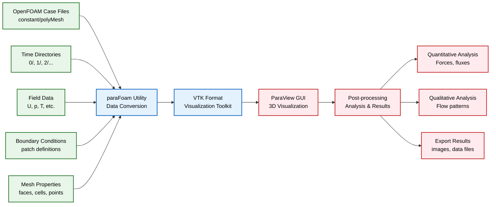
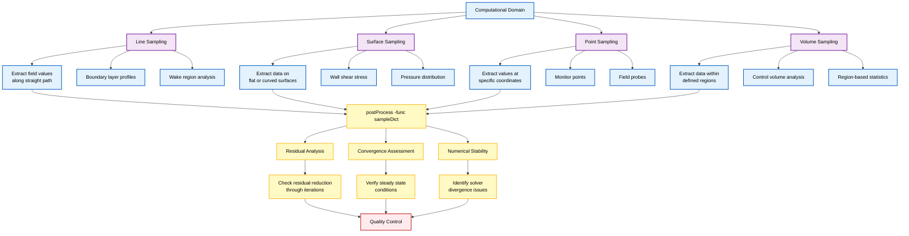

# 5. Post-Processing

**Post-processing เป็นขั้นตอนสำคัญยิ่งใน workflow ของ CFD** ซึ่งผลการจำลองจะถูกวิเคราะห์, แสดงผลด้วยภาพ, และตีความเพื่อดึงข้อมูลเชิงลึกทางกายภาพที่มีความหมาย

OpenFOAM มีชุดเครื่องมือที่ครอบคลุมซึ่งออกแบบมาสำหรับ:
- **การดึงข้อมูล** (Data extraction)
- **การแสดงผลด้วยภาพ** (Visualization)
- **การวิเคราะห์เชิงปริมาณ** (Quantitative analysis)

## `paraFoam`

**ยูทิลิตี้หลักสำหรับการแสดงผลด้วยภาพของ OpenFOAM** ทำหน้าที่เป็นตัวห่อหุ้ม (wrapper) สำหรับ ParaView ซึ่งเป็นแอปพลิเคชันแสดงผลด้วยภาพแบบโอเพนซอร์สที่ทรงพลัง





### Basic Usage

```bash
paraFoam
```

เมื่อรันคำสั่ง `paraFoam` จะเปิด ParaView พร้อมโหลดข้อมูลเคสของ OpenFOAM โดยอัตโนมัติ:
- อ่าน Mesh จาก `constant/polyMesh`
- อ่านข้อมูล Time Step ล่าสุดจากไดเรกทอรีเวลา
- แปลงข้อมูลเป็นรูปแบบ VTK (Visualization Toolkit)

### Advanced Usage Options

สำหรับสภาพแวดล้อมการประมวลผลประสิทธิภาพสูง:

```bash
paraFoam -touch
```

แฟล็ก `-touch` จะสร้างไฟล์ `.OpenFOAM` เปล่าโดยไม่ต้องเปิด ParaView GUI ซึ่งมีประโยชน์สำหรับ:

1. **Remote Processing**: รันบน Compute Nodes ที่ไม่มีความสามารถด้านกราฟิก
2. **Deferred Visualization**: ทำ Post-processing ภายหลังบน Visualization Workstations
3. **Batch Workflows**: รวมเข้ากับไปป์ไลน์การจำลองอัตโนมัติ
4. **Resource Efficiency**: ลดความจำเป็นในการใช้ X11 forwarding หรือ VNC

## `postProcess`

**ยูทิลิตี้ "มีดพับสวิส" สำหรับการดึงข้อมูลและการวิเคราะห์** ทำงานได้ทั้งหลังการจำลองเสร็จสิ้นและระหว่างการรันเพื่อการตรวจสอบ

### Residual Analysis

```bash
postProcess -func residuals
```

**การคำนวณ Residuals มีความสำคัญสำหรับ:**
- **Convergence Assessment**: ตรวจสอบการลดลงของ Residuals ตลอดการวนซ้ำ
- **Numerical Stability**: ระบุปัญหาเชิงตัวเลขหรือ Solver ที่ลู่ออก
- **Quality Control**: ตรวจสอบว่าการจำลองได้ถึงสภาวะคงที่ที่มีความหมายทางกายภาพ

Residuals จะถูกคำนวณสำหรับแต่ละสมการ (โมเมนตัม, ความดัน, ความปั่นป่วน, ฯลฯ) และให้ข้อมูลเชิงลึกเกี่ยวกับความแม่นยำเชิงตัวเลข

**ประโยชน์:**
- การปรับการตั้งค่า Tolerance ของ Solver
- การระบุบริเวณที่มีปัญหาใน Computational Domain
- การตรวจสอบ Convergence Criteria

### Field Sampling and Line Probes

```bash
postProcess -func sampleDict
```

**ฟังก์ชันการ Sampling สำหรับการดึงข้อมูลเชิงปริมาณ:**

- **Line Sampling**: ดึงค่า Field ตามแนวเส้นตรงหรือเส้นโค้ง
- **Surface Sampling**: Sampling บนพื้นผิวระนาบหรือพื้นผิวโค้ง
- **Point Sampling**: ดึงค่า ณ ตำแหน่งพิกัดที่ระบุ
- **Volume Sampling**: Sampling ภายในบริเวณหรือปริมาตรที่กำหนด





#### OpenFOAM Code Implementation: sampleDict

ไฟล์ `sampleDict` (โดยทั่วไปอยู่ใน `system/`):

```cpp
interpolationScheme cellPoint;

sets
(
    line1
    {
        type        uniform;
        axis        distance;
        start       (0 0 0);
        end         (1 0 0);
        nPoints     100;
        fields      (U p k epsilon);
    }
);

surfaces
(
    plane1
    {
        type        plane;
        plane       pointAndNormalDict;
        point       (0.5 0.5 0);
        normal      (0 0 1);
        interpolate true;
        fields      (U p);
    }
);
```

### Wall Y+ Calculation

```bash
simpleFoam -postProcess -func yPlus
```

**การคำนวณ y+ (y-plus) มีความสำคัญอย่างยิ่งสำหรับ:**
- **Wall Function Assessment**: ตรวจสอบว่าความละเอียดของ Mesh ใกล้ผนังเหมาะสมกับ Turbulence Model
- **Mesh Quality Evaluation**: ตรวจสอบระยะห่างของ Mesh ใกล้ผนังสำหรับ Boundary Layer ที่แม่นยำ
- **Model Validation**: ยืนยันข้อสมมติฐานของ Wall Function (โดยทั่วไป 30 < y+ < 300 สำหรับ Standard Wall Functions)

**สมการ y+:**
$$y^+ = \frac{\rho u_{\tau} y}{\mu} = \frac{u_{\tau} y}{\nu}$$

**ตัวแปร:**
- $u_{\tau} = \sqrt{\frac{\tau_w}{\rho}}$ = Friction Velocity
- $y$ = ระยะห่างจากผนังที่ใกล้ที่สุด
- $\nu$ = Kinematic Viscosity

### Additional postProcess Functions

**กรอบการทำงางาน `postProcess` มีฟังก์ชันอื่น ๆ อีกมากมาย:**

| หมวดหมู่ | ฟังก์ชัน | คำสั่ง | การประยุกต์ใช้ |
|------------|------------|---------|----------------|
| **Force & Moment** | Force calculations | `postProcess -func forces` | การวิเคราะห์ทางอากาศพลศาสตร์ |
| | Force coefficients | `postProcess -func forceCoeffs` | ค่าสัมประสิทธิ์แรงยก/แรงต้าน |
| **Statistics** | Field statistics | `postProcess -func fieldStatistics` | ค่าต่ำสุด/สูงสุด/เฉลี่ย |
| | Volume field values | `postProcess -func volFieldValue` | สถิติในบริเวณที่กำหนด |
| **Derivatives** | Velocity gradients | `postProcess -func grad(U)` | การวิเคราะห์ Shear |
| | Divergence | `postProcess -func div(U)` | การตรวจสอบ Conservation |
| | Vorticity | `postProcess -func curl(U)` | การวิเคราะห์ Vortices |
| **Averaging** | Time averaging | `postProcess -func fieldAverage` | สถิติ Transient |
| | Region averaging | `postProcess -func regionAverage` | ค่าเฉลี่ยในบริเวณ |

### Runtime Post-Processing

**การ Post-processing ระหว่างรันไทม์** ผ่านรายการ `functions` ในไฟล์ `controlDict`:

#### OpenFOAM Code Implementation: Runtime Functions

```cpp
functions
{
    residuals
    {
        type            residuals;
        functionObjectLibs ("libutilityFunctionObjects.so");
        fields          (U p);
        writeResiduals  yes;
    }
    
    wallYplus
    {
        type            wallYPlus;
        functionObjectLibs ("libutilityFunctionObjects.so");
        write           yes;
    }
    
    surfaceSample
    {
        type            surfaces;
        functionObjectLibs ("libsampling.so");
        outputControl   timeStep;
        outputInterval  100;
        surfaces
        {
            plane
            {
                type            plane;
                basePoint       (0 0 0);
                normalVector    (0 0 1);
                interpolate     true;
            }
        }
        fields          (U p k epsilon);
    }
}
```

**ข้อดีของ Runtime Post-processing:**
- **Continuous Monitoring**: ตรวจสอบพารามิเตอร์สำคัญได้อย่างต่อเนื่อง
- **Immediate Feedback**: ข้อมูลป้อนกลับทันทีเกี่ยวกับความคืบหน้าของ Solution
- **Early Termination**: สามารถยุติการทำงานได้ตั้งแต่เนิ่น ๆ หากเกิดปัญหา

```mermaid
graph LR
    A["Start Simulation"] --> B["Initialize Mesh & Fields"]
    B --> C["Time Step Loop"]
    C --> D["Solve Governing Equations"]
    D --> E["Update Physics Models"]
    E --> F["Execute Function Objects"]
    F --> G["Write Residual Data"]
    G --> H["Calculate Wall Y+"]
    H --> I["Sample Surface Data"]
    I --> J["Check Convergence"]
    J --> K{"Converged?"}
    K -->|No| C
    K -->|Yes| L["Write Final Results"]
    L --> M["Generate Report"]
    M --> N["End Simulation"]
    
    %% Styling Definitions
    classDef process fill:#e3f2fd,stroke:#1565c0,stroke-width:2px,color:#000;
    classDef decision fill:#fff9c4,stroke:#fbc02d,stroke-width:2px,color:#000;
    classDef terminator fill:#ffebee,stroke:#c62828,stroke-width:2px,color:#000;
    classDef storage fill:#e8f5e9,stroke:#2e7d32,stroke-width:2px,color:#000;
    
    class A,N terminator;
    class B,C,D,E,F,G,H,I,J,M process;
    class K decision;
    class L storage
```





---

## สรุปกรอบการทำงาน Post-processing ใน OpenFOAM

**การผสานรวมระหว่างความสามารถ:**
- **ParaView**: การแสดงผลด้วยภาพขั้นสูง
- **postProcess**: เครื่องมือวิเคราะห์เชิงตัวเลขที่แข็งแกร่ง
- **Runtime Functions**: การตรวจสอบแบบ Real-time

**ผลลัพธ์**: ช่วยให้นักวิจัยและวิศวกรสามารถดึงคุณค่าสูงสุดจากข้อมูลการจำลองผ่านทั้งเทคนิคการแสดงผลด้วยภาพเชิงคุณภาพและการวิเคราะห์เชิงปริมาณ
