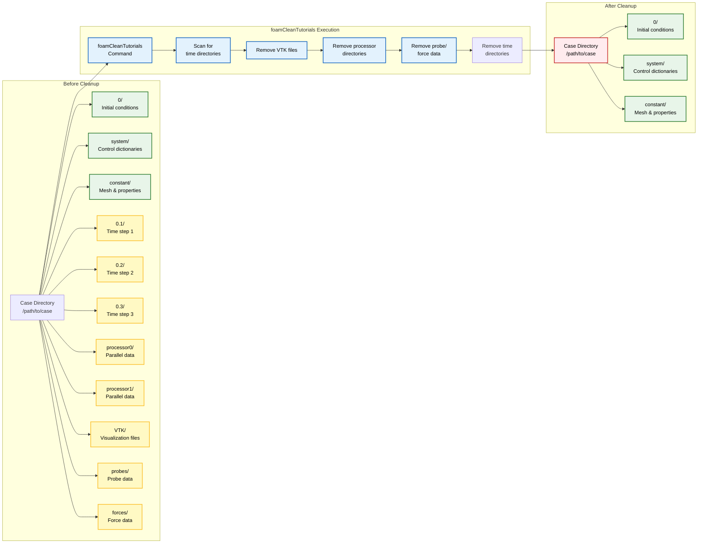
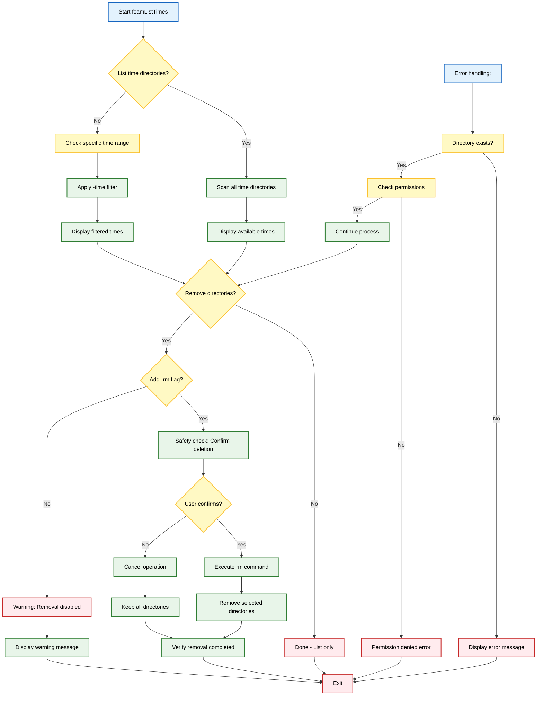

# 8.6 การบำรุงรักษา

## foamCleanTutorials

ยูทิลิตี้ `foamCleanTutorials` เป็นเครื่องมือบำรุงรักษาที่จำเป็น ซึ่งจะรีเซ็ตกรณีศึกษา (case) ให้กลับสู่สถานะเริ่มต้นโดยการลบไฟล์ที่สร้างขึ้นระหว่างการจำลอง

ยูทิลิตี้นี้จะลบผลลัพธ์การคำนวณทั้งหมดอย่างเป็นระบบ ในขณะที่ยังคงรักษารูปแบบการตั้งค่า (configuration) ของกรณีศึกษาเดิมไว้

### ฟังก์ชันการทำงานหลัก

เมื่อรันภายในไดเรกทอรีของกรณีศึกษา (case directory) `foamCleanTutorials` จะดำเนินการล้างข้อมูลอย่างครอบคลุม:

| ประเภทการล้างข้อมูล | สิ่งที่ถูกลบ | ตำแหน่งที่ตั้ง |
|---|---|---|
| **การลบ Mesh** | ไฟล์ Mesh ทั้งหมด | `constant/polyMesh` |
| **การลบไดเรกทอรีเวลา** | ไดเรกทอรีเวลาทั้งหมด (0/, 0.1/, 0.2/, ...) | รากของ case directory |
| **การล้างข้อมูลหลังการประมวลผล** | ไฟล์ผลลัพธ์ (*.vtk, *.foam) | ทั่วทั้ง case directory |
| **การประมวลผลแบบขนาน** | ไดเรกทอรี `processor*` | จากการรันแบบขนาน |
| **การล้างข้อมูลเพิ่มเติม** | ข้อมูล probes, forces, surfaces | จากการจำลองอื่นๆ |

### การใช้งานและข้อควรพิจารณาด้านความปลอดภัย

ยูทิลิตี้ทำงานผ่านโครงสร้างคำสั่งที่เรียบง่าย:

```bash
# Navigate to case directory
cd /path/to/case

# Execute cleanup
foamCleanTutorials
```

**⚠️ คำเตือนที่สำคัญ**: การดำเนินการนี้เป็นการทำลายข้อมูลอย่างสมบูรณ์และไม่สามารถกู้คืนได้

**การตรวจสอบก่อนดำเนินการ**:
- ✅ ผลลัพธ์ที่สำคัญได้รับการสำรองข้อมูลไว้แล้ว
- ✅ ไดเรกทอรีของกรณีศึกษามีกรณีศึกษาเป้าหมายที่ต้องการ
- ✅ มีพื้นที่ดิสก์เพียงพอสำหรับการสร้าง Mesh/ผลลัพธ์ใหม่

### ตัวเลือกการล้างข้อมูลแบบเลือก

ยูทิลิตี้รองรับการล้างข้อมูลแบบกำหนดเป้าหมายผ่านแฟล็กเพิ่มเติม:

```bash
# Clean only specific components
foamCleanTutorials -case <casePath>     # ระบุเส้นทางของกรณีศึกษา
foamCleanTutorials -latest              # ลบเฉพาะไดเรกทอรีเวลาล่าสุด
```





---

## foamListTimes

ยูทิลิตี้ `foamListTimes` ให้การจัดการไดเรกทอรีเวลา (time directory) ที่ครอบคลุมสำหรับการตรวจสอบและบำรุงรักษาความคืบหน้าของการจำลอง

เครื่องมือนี้มีประโยชน์อย่างยิ่งสำหรับ:
- **ติดตามความก้าวหน้าของการจำลอง**
- **การจัดการประสิทธิภาพการจัดเก็บข้อมูล**
- **การตรวจสอบความสมบูรณ์ของข้อมูล**

### การตรวจสอบไดเรกทอรีเวลา

ยูทิลิตี้จะแสดงรายการไดเรกทอรีเวลาที่มีอยู่ทั้งหมดตามลำดับจากน้อยไปมาก:

```bash
# Basic usage - list all time directories
foamListTimes

# Output example:
# 0
# 0.05
# 0.1
# 0.15
# 0.2
```

### รูปแบบการใช้งานขั้นสูง

**การเลือกช่วงเวลา**:
```bash
# List times within specific range
foamListTimes -time 0.1:0.5    # ตั้งแต่ 0.1 ถึง 0.5
foamListTimes -time 0.2:       # ตั้งแต่ 0.2 ถึงล่าสุด
foamListTimes -time :0.3       # ตั้งแต่แรกสุดถึง 0.3
```

**การกรองช่วงเวลา (Time Step)**:
```bash
# List with specific time step interval
foamListTimes -time 0:1:0.2    # ตั้งแต่ 0 ถึง 1 โดยมีช่วงห่าง 0.2
foamListTimes -latestTime      # แสดงเฉพาะไดเรกทอรีเวลาล่าสุด
foamListTimes -startTime       # แสดงเฉพาะไดเรกทอรีเวลาแรกสุด
```

### การดำเนินการที่ทำลายข้อมูล

**⚠️ คำเตือน: การดำเนินการเหล่านี้ไม่สามารถย้อนกลับได้**

```bash
# List and remove specified time directories
foamListTimes -rm              # ลบไดเรกทอรีเวลาทั้งหมด
foamListTimes -time 0.1:0.5 -rm # ลบไดเรกทอรีเวลาในช่วงที่กำหนด

# ใช้ด้วยความระมัดระวังอย่างยิ่งและตรวจสอบให้แน่ใจว่าได้สำรองข้อมูลแล้ว
```

### การบูรณาการกับการทำงาน

**การตรวจสอบความคืบหน้าของการจำลองแบบ Real-time**:
```bash
# Real-time monitoring in simulation scripts
while foamListTimes -latestTime | grep -q -v "0"; do
    latest_time=$(foamListTimes -latestTime)
    echo "เวลาจำลองปัจจุบัน: $latest_time"
    sleep 30
done
```

**การจัดการพื้นที่จัดเก็บแบบอัตโนมัติ**:
```bash
# Selective removal for storage optimization
keep_recent="foamListTimes -time $(foamListTimes -latestTime | tail -n 1)-0.5:"
remove_old="foamListTimes -time 0:$(foamListTimes -latestTime | tail -n 1)-0.5 -rm"

echo "เก็บเวลาล่าสุด: $keep_recent"
echo "ลบเวลาเก่า: $remove_old"
```

### การจัดการข้อผิดพลาดและการตรวจสอบความถูกต้อง

ยูทิลิตี้มีการจัดการข้อผิดพลาดที่มีประสิทธิภาพ:

```bash
# ตรวจสอบว่ามีไดเรกทอรีเวลาอยู่หรือไม่
if foamListTimes >/dev/null 2>&1; then
    echo "✅ พบไดเรกทอรีเวลา"
else
    echo "❌ ไม่มีไดเรกทอรีเวลาในกรณีศึกษาปัจจุบัน"
fi

# ตรวจสอบความถูกต้องของโครงสร้างไดเรกทอรีเวลา
for time_dir in $(foamListTimes); do
    if [ -d "$time_dir" ]; then
        echo "✅ ไดเรกทอรีเวลา $time_dir: ถูกต้อง"
    else
        echo "❌ ไดเรกทอรีเวลา $time_dir: หายไปหรือเสียหาย"
    fi
done
```

### ขั้นตอนการใช้งานที่แนะนำ

1. **การตรวจสอบเบื้องต้น**: ใช้ `foamListTimes` เพื่อดูไดเรกทอรีเวลาทั้งหมด
2. **การเลือกช่วงเวลา**: ใช้ `-time` flag เพื่อกรองช่วงเวลาที่ต้องการ
3. **การตรวจสอบก่อนลบ**: ตรวจสอบรายการที่จะลบก่อนใช้ `-rm` flag
4. **การสำรองข้อมูล**: สำรองข้อมูลสำคัญก่อนการดำเนินการทำลายข้อมูล
5. **การตรวจสอบผลลัพธ์**: ยืนยันว่าไดเรกทอรีที่ไม่ต้องการถูกลบแล้ว





---

**สรุป**: ยูทิลิตี้การบำรุงรักษาเหล่านี้เป็นส่วนสำคัญของเวิร์กโฟลว์ OpenFOAM ซึ่งช่วยให้การจัดการกรณีศึกษา (case management) การเพิ่มประสิทธิภาพการจัดเก็บข้อมูล และการตรวจสอบการจำลองเป็นไปอย่างมีประสิทธิภาพ พร้อมทั้งมีมาตรการป้องกันการสูญหายของข้อมูลโดยไม่ตั้งใจผ่านระบบเตือนภัยที่ชัดเจน
