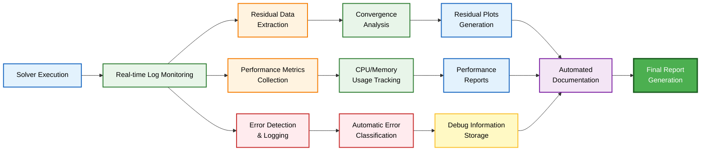
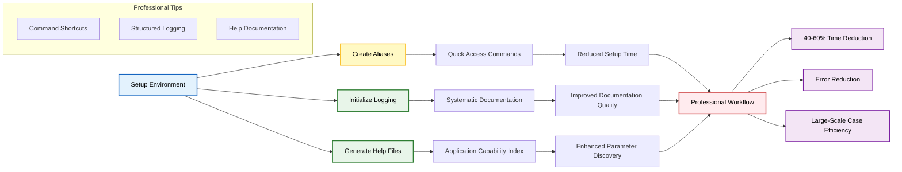

## เคล็ดลับมืออาชีพ

### 1. Command Aliases: ตัวช่วยเพิ่มประสิทธิภาพการทำงาน

การสร้าง shell aliases สำหรับคำสั่ง OpenFOAM ที่ใช้งานบ่อย สามารถช่วยลดเวลาในการพิมพ์และเพิ่มประสิทธิภาพของ Workflow ได้อย่างมาก

**ประโยชน์ของการใช้ aliases:**
- **ลดเวลาพิมพ์**: ประหยัด 30-40 ครั้งต่อกรณีศึกษา
- **เพิ่มประสิทธิภาพ**: เหมาะสำหรับการศึกษาพารามิเตอร์
- **ลดข้อผิดพลาด**: พิมพ์คำสั่งสั้นลดความเสี่ยง

#### 1.1 Aliases พื้นฐานสำหรับการใช้งานประจำวัน

```bash
# Aliases สำหรับการนำทางหลัก
alias run='cd $FOAM_RUN'           # ไปยังไดเรกทอรี run ของผู้ใช้
alias tut='cd $FOAM_TUTORIALS'     # เข้าถึงกรณีตัวอย่าง (tutorial cases) ได้อย่างรวดเร็ว
alias src='cd $WM_PROJECT_DIR'     # ไปยังไดเรกทอรี source ของ OpenFOAM

# Aliases สำหรับการเรียกใช้งาน Application
alias bm='blockMesh'               # โปรแกรมสร้าง Mesh
alias cp='checkMesh'               # ตรวจสอบคุณภาพของ Mesh
alias dp='decomposePar'            # การแบ่งงานแบบขนาน (Parallel decomposition)
alias rp='reconstructPar'          # การรวมงานแบบขนาน (Parallel reconstruction)
alias para='paraFoam'              # เปิด ParaView post-processor
```

#### 1.2 Aliases ขั้นสูงสำหรับ Workflow ที่ซับซ้อน

```bash
# Aliases สำหรับกระบวนการหลายขั้นตอน
alias cleanCase='rm -rf 0/* processor* postProcessing* logs*'
alias meshAll='blockMesh && snappyHexMesh -overwrite'
alias runParallel='mpirun -np $(nproc)'

# Aliases สำหรับการคอมไพล์
alias wlib='wmake libso'           # คอมไพล์เป็น shared library
alias wcleanAll='wclean all && wcleanLnIncludeAll'
```

#### 1.3 การนำไปใช้ใน `.bashrc`

```bash
# เพิ่มลงในการตั้งค่า shell ของคุณ
echo "alias run='cd \$FOAM_RUN'" >> ~/.bashrc
echo "alias tut='cd \$FOAM_TUTORIALS'" >> ~/.bashrc
source ~/.bashrc
```

### 2. Log Files: การจัดการ Output อย่างครอบคลุม

**ประโยชน์ของการจัดการ Log Files:**
- **การพล็อต Residual**: ดึงข้อมูลการลู่เข้า (convergence data) เพื่อการแสดงผล
- **การวินิจฉัยข้อผิดพลาด**: ตรวจสอบประวัติการทำงานทั้งหมด
- **การจัดทำเอกสาร**: เก็บรักษาบันทึกของพารามิเตอร์การจำลองและผลลัพธ์
- **ระบบอัตโนมัติ**: แยกวิเคราะห์ Log เพื่อการรายงานอัตโนมัติ





#### 2.1 กลยุทธ์การสร้าง Log File

**การบันทึก Log พื้นฐาน:**
```bash
# เขียนทับไฟล์เดิม
simpleFoam > log.simpleFoam

# เพิ่มต่อท้าย Log เดิม (มีประโยชน์สำหรับการศึกษาพารามิเตอร์)
simpleFoam >> log.parameterStudy

# การรันในพื้นหลังพร้อมการบันทึก Log
simpleFoam > log.simpleFoam 2>&1 &
```

**เทคนิคการบันทึก Log ขั้นสูง:**
```bash
# Log ที่มี Timestamp สำหรับการควบคุมเวอร์ชัน
logFile="log.simpleFoam.$(date +%Y%m%d_%H%M%S)"
simpleFoam > $logFile

# แยก stdout และ stderr สำหรับการวิเคราะห์ที่แตกต่างกัน
simpleFoam > stdout.log 2> stderr.log

# การตรวจสอบแบบเรียลไทม์พร้อมการบันทึก Log
simpleFoam | tee log.simpleFoam
```

#### 2.2 คำสั่งวิเคราะห์ Log File

```bash
# ตรวจสอบการลู่เข้าของ residual
tail -f log.simpleFoam | grep "Solving for"

# ดึงค่า residual สุดท้าย
grep "Final residual" log.simpleFoam | tail -10

# ตรวจสอบการทำงานของ Solver เสร็จสมบูรณ์
grep "End" log.simpleFoam

# วิเคราะห์เวลาการทำงาน
grep "ExecutionTime" log.simpleFoam
```

#### 2.3 การ Post-processing ข้อมูล Log ด้วย Python

```python
import re
import matplotlib.pyplot as plt

def extract_residuals(log_file):
    residuals = {'U_x': [], 'U_y': [], 'U_z': [], 'p': []}
    
    with open(log_file, 'r') as f:
        for line in f:
            if 'Solving for Ux' in line:
                residual = float(re.search(r'Final residual = ([\d.e-]+)', line).group(1))
                residuals['U_x'].append(residual)
            elif 'Solving for p' in line:
                residual = float(re.search(r'Final residual = ([\d.e-]+)', line).group(1))
                residuals['p'].append(residual)
    
    return residuals

# พล็อตประวัติการลู่เข้า
residuals = extract_residuals('log.simpleFoam')
plt.semilogy(residuals['p'])
plt.xlabel('รอบการคำนวณ')
plt.ylabel('Residual ของความดัน')
plt.title('ประวัติการลู่เข้า')
plt.grid(True)
plt.show()
```

### 3. Application Help: การค้นหา Option อย่างครอบคลุม

**ประโยชน์ของการใช้ `-help` flag:**
- **Command-line options และ flags**
- **Required arguments และรูปแบบไฟล์**
- **ค่าพารามิเตอร์เริ่มต้น**
- **ตัวอย่างการใช้งานและ Syntax**
- **ข้อมูลเฉพาะเวอร์ชัน**

#### 3.1 การใช้งาน Help พื้นฐาน

```bash
# Help ทั่วไปของ Application
blockMesh -help
simpleFoam -help
decomposePar -help

# Help สำหรับ Option เฉพาะ
blockMesh -help | grep "case"
simpleFoam -help | grep "parallel"
```

#### 3.2 เทคนิคการสำรวจ Help ขั้นสูง

```bash
# Help อย่างครอบคลุมด้วย pager
blockMesh -help | less

# ค้นหาฟังก์ชันการทำงานเฉพาะ
blockMesh -help | grep -i "grading"
simpleFoam -help | grep -i "turbulence"

# บันทึก Help สำหรับอ้างอิง
blockMesh -help > blockMesh_help.txt
```

#### 3.3 Option Help ตามประเภท Application

| ประเภท Application | คำสั่งตัวอย่าง | ข้อมูลที่ได้รับ |
|---|---|---|
| **เครื่องมือสร้าง Mesh** | `blockMesh -help` | Block topology, Grading options, Geometry parameters |
| **Solver Applications** | `simpleFoam -help` | Parallel options, Time step control, Convergence criteria |
| **Post-processing** | `sample -help` | Field selection, Output formats, Filtering parameters |

**ตัวอย่าง Output ของ blockMesh -help:**
```
Usage: blockMesh [OPTIONS]
Options:
  -case <dir>       ระบุไดเรกทอรี case
  -region <name>    ระบุ region ของ Mesh
  -dict <file>      ไฟล์ dictionary ทางเลือก
  -overwrite        เขียนทับ Mesh ที่มีอยู่
```

#### 3.4 กลยุทธ์การจัดระเบียบไฟล์ Help

```bash
# สร้างไดเรกทอรีเอกสาร Help ที่จัดระเบียบแล้ว
mkdir -p $HOME/OpenFOAM/help-docs

# สร้างเอกสาร Help ที่ครอบคลุม
cd $WM_PROJECT_DIR/applications
find . -name "*" -type f -executable -exec sh -c '
    if [ -x "$1" ]; then
        app_name=$(basename "$1")
        help_file="$HOME/OpenFOAM/help-docs/${app_name}_help.txt"
        "$1" -help > "$help_file" 2>&1
        echo "สร้าง Help สำหรับ $app_name"
    fi
' sh {} \;
```

#### 3.5 การดึงข้อมูลและการค้นหา Help

```bash
# ค้นหาไฟล์ Help สำหรับฟังก์ชันการทำงานเฉพาะ
grep -r "turbulence" $HOME/OpenFOAM/help-docs/

# ค้นหา Application ที่มีความสามารถเฉพาะ
grep -l "parallel.*decomposition" $HOME/OpenFOAM/help-docs/*

# สร้างดัชนีความสามารถของ Application
cd $HOME/OpenFOAM/help-docs/
for file in *_help.txt; do
    echo "=== $(basename $file _help.txt) ==="
    grep -E "^Usage:|Options:" "$file" | head -5
    echo ""
done > application_index.txt
```

### 4. สรุปประสิทธิภาพของเคล็ดลับมืออาชีพ

เคล็ดลับมืออาชีพเหล่านี้เป็นรากฐานสำหรับการจัดการ Workflow ของ OpenFOAM ที่มีประสิทธิภาพ

**ผลลัพธ์ที่คาดหวัง:**
- **ลดเวลาตั้งค่า**: 40-60%
- **ปรับปรุงคุณภาพเอกสาร**: การบันทึกแบบมีระบบ
- **ลดข้อผิดพลาด**: คำสั่งสั้นและสะดวก
- **เพิ่มประสิทธิภาพ**: สำหรับกรณีศึกษาขนานใหญ่และการตรวจสอบพารามิเตอร์ที่ซับซ้อน




