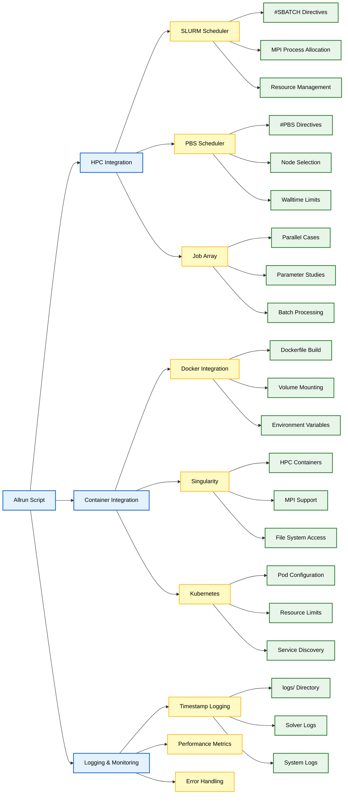

# 2.4 Workflow Automation: The Allrun Script

`Allrun` Script เป็น **องค์ประกอบพื้นฐาน** ของการทำงานอัตโนมัติของ Workflow ใน OpenFOAM ที่ทำให้การรันการจำลอง CFD เป็นไปอย่างราบรื่น ตั้งแต่การสร้าง Mesh ไปจนถึงการประมวลผลหลังการจำลอง (post-processing)

Shell Script นี้ทำหน้าที่เป็น **ตัวควบคุมหลัก** จัดลำดับการทำงานที่จำเป็นในการรันเคส CFD ที่สมบูรณ์โดยมีการแทรกแซงจากผู้ใช้น้อยที่สุด

## วัตถุประสงค์และฟังก์ชันการทำงาน

วัตถุประสงค์หลักของ `Allrun` Script คือการทำให้ Workflow ของ CFD ทั้งหมดเป็นไปโดยอัตโนมัติ

**ประโยชน์หลัก:**
- **ลดความจำเป็น** ในการรันแต่ละคำสั่งด้วยตนเอง
- **รับประกันความสอดคล้อง** ของกระบวนการ
- **ลดข้อผิดพลาดจากมนุษย์** (Human Error)
- **ช่วยให้การจำลองสามารถทำซ้ำได้** (Reproducible)
- **สามารถแชร์และทำซ้ำได้ง่าย** ในสภาพแวดล้อมที่แตกต่างกัน

### ลำดับการทำงานหลัก

**Workflow หลักของ Allrun Script:**

1. **การสร้าง Mesh**: รันยูทิลิตี้การสร้าง Mesh เช่น `blockMesh`, `snappyHexMesh`, หรือ `decomposePar`
2. **การตั้งค่า Case**: คัดลอก Initial Conditions, Boundary Conditions, และ Physical Properties
3. **การรัน Solver**: เรียกใช้ CFD Solver ที่เหมาะสมพร้อมพารามิเตอร์ที่ระบุ
4. **การประมวลผลหลังการจำลอง**: รันยูทิลิตี้ Post-Processing และสร้างไฟล์ผลลัพธ์
5. **การล้างข้อมูล**: ลบไฟล์ชั่วคราวและจัดระเบียบข้อมูลผลลัพธ์


## โครงสร้างและส่วนประกอบของ Script

`Allrun` Script โดยทั่วไปจะใช้ **โครงสร้างแบบโมดูลาร์**:

```bash
#!/bin/bash
cd ${0%/*} || exit 1    # Run from this directory

# Source tutorial run functions
. $WM_PROJECT_DIR/bin/tools/RunFunctions    # Important: include OpenFOAM functions

# Application-specific setup
caseName="tutorialCase"
solverName="simpleFoam"

# Mesh generation
runApplication blockMesh
runApplication decomposePar

# Solver execution
runParallel $solverName 4

# Post-processing
runApplication reconstructPar
runApplication paraFoam
```

### องค์ประกอบสำคัญ

| องค์ประกอบ | คำอธิบาย | บทบาท |
|------------|----------|--------|
| **Shebang Line** | `#!/bin/bash` | ระบุ Shell Interpreter |
| **การนำทางไดเรกทอรี** | `cd ${0%/*}` | รับประกันการรันจากไดเรกทอรีของ Script |
| **RunFunctions** | `$WM_PROJECT_DIR/bin/tools/RunFunctions` | เรียกใช้ฟังก์ชันยูทิลิตี้ในตัวของ OpenFOAM |
| **runApplication()** | OpenFOAM function | รันยูทิลิตี้ของ OpenFOAM พร้อมการตรวจสอบข้อผิดพลาด |
| **runParallel()** | OpenFOAM function | จัดการการรันแบบขนานโดยใช้ MPI |

## คุณสมบัติขั้นสูง

### การจัดการข้อผิดพลาดและการบันทึก (Logging)

`Allrun` Script ระดับมืออาชีพจะรวม **การจัดการข้อผิดพลาดที่แข็งแกร่ง**:

```bash
# Error handling function
runFunction() {
    local cmd="$1"
    echo "Running: $cmd"
    if ! $cmd; then
        echo "Error: $cmd failed"
        exit 1
    fi
}

# Usage with error checking
runFunction "blockMesh"
runFunction "simpleFoam > log.simpleFoam 2>&1"
```

### การควบคุมการรันแบบขนาน

สำหรับสภาพแวดล้อม HPC, Script จะจัดการ **การประมวลผลแบบขนาน**:

```bash
# Determine number of processors
if [ -z "$NPROCS" ]; then
    NPROCS=$(nproc)
fi

# Parallel execution
mpirun -np $NPROCS $solverName -case $PWD > log.$solverName 2>&1
```

### การรันแบบมีเงื่อนไข

Script ที่ชาญฉลาดจะ **ปรับให้เข้ากับสถานการณ์ที่แตกต่างกัน**:

```bash
# Check if mesh exists
if [ ! -f "constant/polyMesh/points" ]; then
    echo "Generating mesh..."
    runApplication blockMesh
fi

# Check for existing solution
if [ -f "latestTime" ]; then
    echo "Restarting from latest time..."
    restartTime=$(cat latestTime)
    runApplication $solverName -latestTime
else
    echo "Starting new simulation..."
    runApplication $solverName
fi
```

## ฟังก์ชันมาตรฐานของ OpenFOAM

OpenFOAM มีฟังก์ชันมาตรฐานให้ใน `$WM_PROJECT_DIR/bin/tools/RunFunctions`:

| ฟังก์ชัน | วัตถุประสงค์ | ตัวอย่างการใช้งาน |
|-----------|--------------|-----------------|
| **runApplication()** | รัน Application แบบ Single-Processor | `runApplication blockMesh` |
| **runParallel()** | รัน Application แบบขนานพร้อมการ Decompose อัตโนมัติ | `runParallel simpleFoam 4` |
| **cpFiles()** | คัดลอกไฟล์พร้อมการตรวจสอบข้อผิดพลาด | `cpFiles 0.orig 0` |
| **getApplication()** | ระบุชื่อ Application | `getApplication simpleFoam` |
| **runBlockMesh()** | การรัน `blockMesh` แบบพิเศษพร้อมการจัดการข้อผิดพลาด | `runBlockMesh` |

## แนวปฏิบัติที่ดีที่สุด

### การจัดระเบียบ Script

**หลักการสำคัญ:**

1. **เอกสารประกอบที่ชัดเจน**: ใส่ Comment เพื่ออธิบายแต่ละขั้นตอน
2. **การตั้งชื่อตัวแปร**: ใช้ชื่อที่สื่อความหมายสำหรับพารามิเตอร์เฉพาะ Case
3. **ความเป็นโมดูลาร์**: แบ่ง Workflow ที่ซับซ้อนออกเป็นฟังก์ชันที่นำกลับมาใช้ใหม่ได้
4. **การจัดการข้อผิดพลาด**: ใช้การตรวจสอบข้อผิดพลาดและการกู้คืนที่แข็งแกร่ง

### ความเป็นอิสระของสภาพแวดล้อม

ทำให้ Script **สามารถพกพาได้** ในระบบที่แตกต่างกัน:

```bash
# Use OpenFOAM variables
WM_PROJECT_DIR=${WM_PROJECT_DIR:-$FOAM_INST_DIR/OpenFOAM-$WM_PROJECT_VERSION}

# Handle different platforms
case "$(uname)" in
    Linux*)     MACHINE=Linux;;
    Darwin*)    MACHINE=MacOSX;;
    *)          MACHINE="UNKNOWN"
esac
```

### การจัดการ Output

**ควบคุมการบันทึก (Logging) และไฟล์ Output:**

```bash
# Create logs directory
mkdir -p logs

# Redirect output with timestamps
runApplication $solverName > logs/${solverName}.$(date +%Y%m%d_%H%M%S).log 2>&1
```

## การผสานรวมกับระบบ Workflow

### HPC Job Schedulers

สำหรับสภาพแวดล้อม Cluster, `Allrun` Script จะ **ผสานรวมกับ Job Schedulers**:

```bash
#!/bin/bash
#SBATCH --job-name=openfoam_case
#SBATCH --nodes=2
#SBATCH --ntasks-per-node=16
#SBATCH --time=48:00:00

# Load OpenFOAM environment
source $FOAM_INST_DIR/OpenFOAM-$WM_PROJECT_VERSION/etc/bashrc

# Run simulation
mpirun -np $SLURM_NTASKS $solverName -case $PWD
```

### Docker และ Containerization

สำหรับ Workflow แบบ Container:

```dockerfile
# Dockerfile
FROM openfoam/openfoam10-paraview

COPY Allrun /opt/openfoam/case/
WORKDIR /opt/openfoam/case
RUN chmod +x Allrun

CMD ["./Allrun"]
```





## การแก้ไขปัญหาและการดีบัก

### ปัญหาทั่วไป

| ปัญหา | สาเหตุ | การแก้ไข |
|--------|---------|------------|
| **ปัญหาการอนุญาต (Permission)** | Script ไม่มีสิทธิ์รัน | `chmod +x Allrun` |
| **ปัญหา Path** | ใช้ Relative/Absolute Path ไม่ถูกต้อง | ตรวจสอบ Path ให้ถูกต้อง |
| **Environment Variables** | ไม่ได้ Source OpenFOAM Environment | `source $WM_PROJECT_DIR/etc/bashrc` |
| **ความขัดแย้งของ Dependency** | Module/Software Version ขัดแย้งกัน | ตรวจสอบ Module Versions |

### เทคนิคการดีบัก

เพิ่ม **Output สำหรับการดีบัก** เพื่อระบุปัญหา:

```bash
# Debug mode
if [ "$DEBUG" = "true" ]; then
    set -x  # Enable command tracing
    echo "Current directory: $(pwd)"
    echo "OpenFOAM version: $WM_PROJECT_VERSION"
fi
```

## การปรับแต่งและการขยาย

### พารามิเตอร์เฉพาะ Case

สร้าง **Script แบบมีพารามิเตอร์** สำหรับสถานการณ์ที่แตกต่างกัน:

```bash
# Configuration section
MESH_QUALITY="high"
SOLVER_TOLERANCE="1e-6"
PARALLEL_PROCS="8"

# Conditional execution based on parameters
if [ "$MESH_QUALITY" = "high" ]; then
    runApplication snappyHexMesh -overwrite
else
    runApplication blockMesh
fi
```

### การผสานรวมกับเครื่องมือภายนอก

ขยาย Script **เพื่อทำงานร่วมกับซอฟต์แวร์อื่น**:

```bash
# Integration with Python scripts
python3 preprocess_mesh.py

# Integration with post-processing tools
runApplication paraFoam -batch
python3 extract_results.py
```

`Allrun` Script แสดงถึง **ปรัชญาของ OpenFOAM** ในเรื่อง Workflow ที่สามารถทำซ้ำได้และเป็นอัตโนมัติ

ด้วยการสร้างและปรับแต่ง Script อย่างเชี่ยวชาญ ผู้ปฏิบัติงาน CFD สามารถ:
- **ปรับปรุงประสิทธิภาพการทำงาน** ได้อย่างมาก
- **รับประกันความสอดคล้อง** ของการจำลอง
- **รับประกันความน่าเชื่อถือ** ในสภาพแวดล้อมการประมวลผลที่แตกต่างกัน
