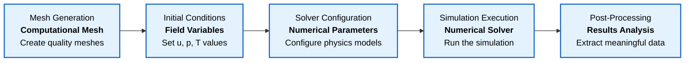
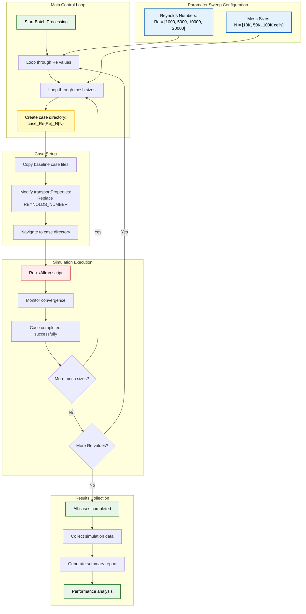
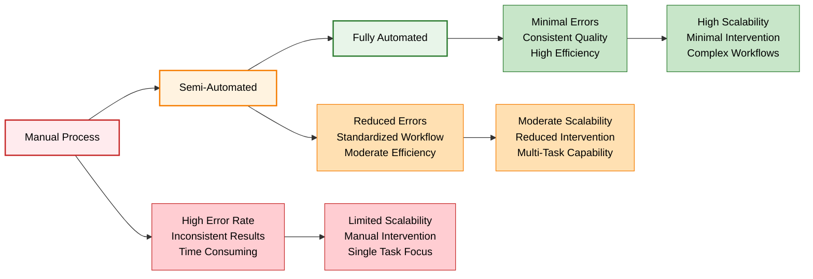

# บทนำ

ในบทที่ 1.4 คุณได้ทำการรันการจำลองทีละขั้นตอนด้วยตนเอง ในงาน CFD ระดับการผลิต เราไม่ค่อยทำงานในลักษณะนี้ เราทำให้กระบวนการทั้งหมดเป็นอัตโนมัติโดยใช้ **shell scripts** ซึ่งช่วยให้มั่นใจถึงความสามารถในการทำซ้ำ: หากคุณสามารถรันสคริปต์ได้ คุณก็สามารถสร้างผลลัพธ์เดิมซ้ำได้

## เหตุใดการทำให้เป็นอัตโนมัติจึงมีความสำคัญใน CFD

Computational Fluid Dynamics (CFD) เกี่ยวข้องกับเวิร์กโฟลว์ที่ซับซ้อนซึ่งมีหลายขั้นตอนต่อเนื่องกัน:





1.  **การสร้าง Mesh**: การสร้าง computational meshes ที่มีคุณภาพ
2.  **เงื่อนไขเริ่มต้น (Initial Conditions)**: การตั้งค่าตัวแปรฟิลด์ ($\mathbf{u}$, $p$, $T$, เป็นต้น)
3.  **การกำหนดค่า Solver**: การกำหนดพารามิเตอร์เชิงตัวเลขและโมเดลทางฟิสิกส์
4.  **การดำเนินการจำลอง**: การรัน numerical solver
5.  **การประมวลผลภายหลัง (Post-Processing)**: การวิเคราะห์ผลลัพธ์และการดึงข้อมูลที่มีความหมาย

แต่ละขั้นตอนอาจเกี่ยวข้องกับหลายคำสั่ง การปรับเปลี่ยนพารามิเตอร์ และการดำเนินการกับไฟล์ การดำเนินการด้วยตนเองจะทำได้ยากสำหรับ:

-   **การศึกษาพารามิเตอร์ (Parameter Studies)**: การรันกรณีศึกษาที่คล้ายกันหลายสิบ/หลายร้อยกรณี
-   **เวิร์กโฟลว์การเพิ่มประสิทธิภาพ (Optimization Workflows)**: การปรับปรุงการออกแบบซ้ำๆ
-   **การจำลองขนาดใหญ่ (Large-Scale Simulations)**: สภาพแวดล้อมการผลิตที่ต้องการการดำเนินการที่สอดคล้องกัน
-   **การทำงานร่วมกัน (Collaborative Work)**: งาน CFD แบบทีมที่ต้องการขั้นตอนที่เป็นมาตรฐาน

## ปรัชญาการเขียนสคริปต์

ปรัชญาการทำให้เป็นอัตโนมัติใน CFD สอดคล้องกับแนวปฏิบัติที่ดีที่สุดในการคำนวณ:

### หลักการทำซ้ำได้ (Reproducibility Principle)

การจำลองทุกครั้งควรสามารถทำซ้ำได้อย่างสมบูรณ์จากไฟล์ต้นฉบับ:

```bash
# One command to reproduce entire workflow
./Allrun
```

### การรวม Version Control

Scripts ช่วยให้สามารถควบคุมเวอร์ชันของพารามิเตอร์การจำลองได้อย่างเหมาะสม:

```bash
# Track changes in simulation setup
git diff system/controlDict
git commit -m "Modified relaxation factors for better convergence"
```

### เอกสารผ่านโค้ด (Documentation Through Code)

Shell scripts ทำหน้าที่เป็นเอกสารที่สามารถรันได้:

```bash
#!/bin/bash
# Case: Backward Facing Step - Re=10,000
# Mesh: 50k cells, refined near wall
# Solver: simpleFoam, k-omega SST
echo "Setting up turbulence parameters..."
# ... specific commands ...
```

## เวิร์กโฟลว์ CFD ระดับการผลิต

ในสภาพแวดล้อม CFD ระดับอุตสาหกรรม เวิร์กโฟลว์อัตโนมัติทั่วไปประกอบด้วย:

### การกำหนดมาตรฐานโครงสร้างกรณีศึกษา (Case Structure Standardization)

```
project/
├── cases/
│   ├── case01_baseline/
│   │   ├── Allrun      # สคริปต์สำหรับรัน
│   │   ├── Allclean    # สคริปต์สำหรับล้างข้อมูล
│   │   ├── geometry/   # ไฟล์ CAD
│   │   ├── system/     # การตั้งค่า Solver
│   │   └── post/       # สคริปต์สำหรับ Post-processing
│   └── case02_parameter_variation/
│       └── ...
├── mesh_templates/     # การกำหนดค่า Mesh ที่นำกลับมาใช้ใหม่ได้
├── solver_configs/     # การตั้งค่า Solver ที่เป็นมาตรฐาน
└── validation_cases/   # การเปรียบเทียบกับ Benchmark
```

### การประกันคุณภาพอัตโนมัติ (Automated Quality Assurance)

```bash
#!/bin/bash
# การตรวจสอบคุณภาพก่อนการจำลอง
echo "กำลังรันการตรวจสอบคุณภาพ Mesh..."
checkMesh -allGeometry -allTopology > meshQuality.log
if [ $? -ne 0 ]; then
    echo "ตรวจพบปัญหาคุณภาพ Mesh!"
    exit 1
fi

echo "กำลังรัน Solver พร้อมการตรวจสอบ Convergence..."
simpleFoam > log.simpleFoam 2>&1 &
solver_pid=$!

# ตรวจสอบ Convergence แบบเรียลไทม์
tail -f log.simpleFoam | grep "Time ="
```

### ความสามารถในการประมวลผลแบบ Batch (Batch Processing Capabilities)

```bash
#!/bin/bash
# ตัวอย่างการทำ Parameter sweep
Re_values=(1000 5000 10000 20000)
mesh_sizes=(10000 50000 100000)

for Re in "${Re_values[@]}"; do
    for N in "${mesh_sizes[@]}"; do
        echo "กำลังรันกรณีศึกษา: Re=$Re, N=$N cells"
        
        # สร้างไดเรกทอรีเฉพาะสำหรับกรณีศึกษา
        case_dir="case_Re${Re}_N${N}"
        mkdir -p "$case_dir"
        
        # คัดลอกกรณีศึกษาพื้นฐานและแก้ไขพารามิเตอร์
        cp -r baseline_case/* "$case_dir/"
        sed -i "s/REYNOLDS_NUMBER/$Re/" "$case_dir/constant/transportProperties"
        
        # รันการจำลอง
        cd "$case_dir"
        ./Allrun
        cd ..
        
        echo "ดำเนินการกรณีศึกษาเสร็จสิ้น: $case_dir"
    done
done
```





## ประโยชน์ที่นอกเหนือจากความสามารถในการทำซ้ำ

การทำให้เป็นอัตโนมัติให้ประโยชน์เพิ่มเติมดังนี้:

### การลดข้อผิดพลาด (Error Reduction)

-   การลดข้อผิดพลาดของมนุษย์ในงานที่ทำซ้ำๆ
-   การใช้พารามิเตอร์ที่สอดคล้องกันในทุกกรณีศึกษา
-   การตรวจสอบความถูกต้องอัตโนมัติ

### ประสิทธิภาพด้านเวลา (Time Efficiency)

-   การจำลองที่สามารถรันข้ามคืนและช่วงสุดสัปดาห์
-   การประมวลผลแบบขนานบน HPC clusters
-   ลดเวลาการแทรกแซงด้วยตนเอง

### ความสามารถในการปรับขนาด (Scalability)

-   ตั้งแต่กรณีศึกษาเดียวไปจนถึงการศึกษาพารามิเตอร์
-   ตั้งแต่เวิร์กสเตชันเดสก์ท็อปไปจนถึงซูเปอร์คอมพิวเตอร์
-   ตั้งแต่รูปทรงเรขาคณิตที่เรียบง่ายไปจนถึงปัญหาทางอุตสาหกรรมที่ซับซ้อน

### การเพิ่มประสิทธิภาพการทำงานร่วมกัน (Collaboration Enhancement)

-   เวิร์กโฟลว์ที่เป็นมาตรฐานในทีมต่างๆ
-   การแบ่งปันขั้นตอนการจำลองที่ง่ายดาย
-   ลดภาระการฝึกอบรมสำหรับผู้ใช้ใหม่





## เครื่องมือการทำให้ CFD เป็นอัตโนมัติที่ทันสมัย

นอกเหนือจาก shell scripts แล้ว การทำให้ CFD เป็นอัตโนมัติในยุคใหม่ยังรวมถึง:

| เครื่องมือ | คำอธิบาย | กรณีการใช้งาน |
|-----------|------------|----------------|
| **Workflow Managers** | Apache Airflow, Nextflow | ไปป์ไลน์ที่ซับซ้อน |
| **การรวม Python** | PyFoam, openFOAM+ | การทำให้เป็นอัตโนมัติขั้นสูง |
| **Containerization** | Docker, Singularity | ความสามารถในการทำซ้ำของสภาพแวดล้อม |
| **การรวมระบบคลาวด์** | AWS, Azure | ทรัพยากรการคำนวณที่ปรับขนาดได้ |

หลักการพื้นฐานยังคงอยู่: **หากคุณสามารถเขียนสคริปต์ได้ คุณก็สามารถทำซ้ำ ขยายขนาด และแบ่งปันได้อย่างมีประสิทธิภาพ**
