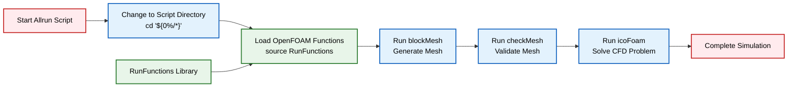
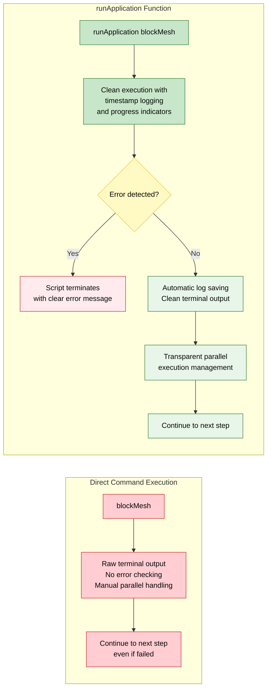

# แนวคิด `Allrun`

บทเรียน OpenFOAM ส่วนใหญ่มาพร้อมกับสคริปต์ `Allrun` เป็นสคริปต์ Bash ที่เชื่อมโยงคำสั่งต่างๆ ที่เราได้เรียนรู้ในส่วนก่อนหน้าเข้าด้วยกัน

## โครงสร้างของ `Allrun` ที่แข็งแกร่ง

```bash
#!/bin/sh
cd "${0%/*}" || exit                                # 1. ย้ายไปยังไดเรกทอรีของสคริปต์
. ${WM_PROJECT_DIR:?}/bin/tools/RunFunctions        # 2. โหลดฟังก์ชัน OpenFOAM

# 3. ขั้นตอนการทำงาน
runApplication blockMesh                            # สร้าง Mesh
runApplication checkMesh                            # ตรวจสอบ
runApplication icoFoam                              # แก้ปัญหา
```





### รายละเอียดส่วนประกอบ

- **บรรทัดแรก**: `#!/bin/sh`
  - ระบุตัวแปลคำสั่งของเชลล์ (shell interpreter)
  - ให้มั่นใจว่าสคริปต์จะทำงานได้อย่างสอดคล้องกันในระบบต่างๆ

- **บรรทัดที่สอง**: ใช้การขยายพารามิเตอร์ของเชลล์
  - `${0%/*}` ดึงเส้นทางไดเรกทอรีจากเส้นทางเต็มของสคริปต์
  - ทำให้สคริปต์สามารถทำงานได้จากทุกที่ในขณะที่ยังคงรักษาเส้นทางสัมพัทธ์ไปยังไฟล์เคสได้

- **ไฟล์ `RunFunctions`**: มีเครื่องมือ OpenFOAM ที่จำเป็น
  - ช่วยให้การดำเนินการเคสเป็นมาตรฐาน
  - ฟังก์ชันหลักที่รวมอยู่:
    - `runApplication`
    - `runParallel` 
    - `runBatch`

ฟังก์ชันเหล่านี้จัดการการตรวจสอบข้อผิดพลาด, การบันทึก และการควบคุมการทำงานได้อย่างสอดคล้องกันในบทเรียน OpenFOAM ทั้งหมด

## ทำไมต้องใช้ `runApplication`?

คุณ *อาจ* เขียนเพียงแค่ `blockMesh` แต่ `runApplication` มีข้อดีดังนี้:

### 1. **การบันทึก (Logging)**
- เปลี่ยนเส้นทางการส่งออกไปยัง `log.blockMesh` โดยอัตโนมัติ
- สร้างบันทึกถาวรของกระบวนการสร้าง Mesh ซึ่งมีคุณค่าสำหรับ:
  - การแก้ไขปัญหาการสร้าง Mesh
  - การตรวจสอบว่า Mesh ถูกสร้างขึ้นอย่างถูกต้อง
  - การประทับเวลา, ผลลัพธ์ของคำสั่ง และข้อความแสดงข้อผิดพลาด

### 2. **การตรวจสอบ (Checking)**
- ตรวจสอบว่าคำสั่งล้มเหลวหรือไม่:
  - หาก `blockMesh` พบข้อผิดพลาด (เช่น การกำหนดรูปทรงเรขาคณิตที่ไม่ถูกต้อง หรือปัญหาคุณภาพของ Mesh)
  - `runApplication` จะตรวจจับรหัสออกที่ไม่ใช่ศูนย์และยุติสคริปต์พร้อมข้อความแสดงข้อผิดพลาด
  - ป้องกันไม่ให้คำสั่งที่ตามมาทำงานในเคสที่ล้มเหลว ซึ่งอาจทำให้สิ้นเปลืองทรัพยากรการคำนวณ

### 3. **ความเรียบร้อย (Cleanliness)**
- ทำให้ผลลัพธ์ที่แสดงในเทอร์มินัลของคุณเป็นระเบียบ:
  - แทนที่จะแสดงผลลัพธ์การสร้าง Mesh ที่ละเอียดมากจนล้นเทอร์มินัล
  - `runApplication` จะบันทึกไว้ในไฟล์บันทึกและแสดงเฉพาะข้อมูลความคืบหน้าที่จำเป็นเท่านั้น
  - ทำให้ง่ายต่อการตรวจสอบการจำลองที่ใช้เวลานาน

### 4. **การทำงานแบบขนาน (Parallel Execution)**
- ฟังก์ชัน `runApplication` จัดการการทำงานแบบขนานได้อย่างโปร่งใส:
  - เมื่อทำงานบนโปรเซสเซอร์หลายตัว
  - จัดการการแยกส่วน, การดำเนินการ และการสร้างใหม่โดยอัตโนมัติ
  - มั่นใจถึงพฤติกรรมที่สอดคล้องกันโดยไม่คำนึงถึงสภาพแวดล้อมการคำนวณ





## คุณสมบัติ `Allrun` ขั้นสูง

สคริปต์ `Allrun` ที่ซับซ้อนมากขึ้นมักจะมีฟังก์ชันการทำงานเพิ่มเติมดังนี้:

```bash
#!/bin/sh
cd "${0%/*}" || exit
. ${WM_PROJECT_DIR:?}/bin/tools/RunFunctions

# ล้างผลลัพธ์ก่อนหน้า
runApplication -s rm $caseName
rm -rf 0
cp -r 0.org 0

# ระดับการปรับ Mesh ให้ละเอียด
for level in 0 1 2
do
    echo "Refining mesh to level $level"
    runApplication refineMesh "level$level"
    runApplication icoFoam
done

# การทำงานแบบขนาน
runApplication decomposePar
runParallel renumberMesh -overwrite
runParallel icoFoam
runApplication reconstructPar
```

### คำอธิบายฟีเจอร์ขั้นสูง

- **การศึกษาการปรับ Mesh ให้ละเอียด (Mesh Refinement Studies)**:
  - ตัวอย่างขั้นสูงแสดงการศึกษาการปรับ Mesh ให้ละเอียด
  - เคสเดียวกันจะถูกรันด้วยความละเอียดของ Mesh หลายระดับเพื่อประเมินการลู่เข้าของกริด

- **การจัดการ MPI อัตโนมัติ**:
  - ฟังก์ชัน `runParallel` จัดการการทำงานของ MPI โดยอัตโนมัติ
  - พิจารณาจำนวนโปรเซสเซอร์ที่เหมาะสมตามการกำหนดค่า `decomposeParDict`

```mermaid
graph LR
    subgraph "Phase 1: Cleanup"
        A["Start"] --> B["Change Directory"]
        B --> C["Remove Previous Results"]
        C --> D["Reset Initial Conditions"]
    end
    
    subgraph "Phase 2: Mesh Refinement"
        D --> E["Level 0 Mesh"]
        E --> F["Run icoFoam"]
        F --> G["Level 1 Mesh"]
        G --> H["Run icoFoam"]
        H --> I["Level 2 Mesh"]
        I --> J["Run icoFoam"]
    end
    
    subgraph "Phase 3: Parallel Processing"
        J --> K["Decompose Domain"]
        K --> L["Renumber Mesh"]
        L --> M["Parallel icoFoam"]
        M --> N["Reconstruct Results"]
    end
    
    N --> O["Complete"]
    
    %% Styling Definitions
    classDef process fill:#e3f2fd,stroke:#1565c0,stroke-width:2px,color:#000;
    classDef decision fill:#fff9c4,stroke:#fbc02d,stroke-width:2px,color:#000;
    classDef terminator fill:#ffebee,stroke:#c62828,stroke-width:2px,color:#000;
    classDef storage fill:#e8f5e9,stroke:#2e7d32,stroke-width:2px,color:#000;
    
    class A,O terminator;
    class B,C,E,G,I,K,L,N process;
    class F,H,M storage;
```





## สรุปแนวคิด `Allrun`

แนวคิด `Allrun` เป็นตัวอย่างที่ชัดเจนของปรัชญาของ OpenFOAM ในเรื่อง **เวิร์กโฟลว์ CFD ที่สามารถทำซ้ำได้และเป็นอัตโนมัติ (reproducible, automated CFD workflows)**

ด้วยการกำหนดรูปแบบการดำเนินการให้เป็นมาตรฐานในบทเรียนและเคสทั้งหมด:

- **ผู้ใช้สามารถมุ่งเน้นไปที่ฟิสิกส์และวิศวกรรมศาสตร์**
- **แทนที่จะต้องจดจำลำดับคำสั่งเฉพาะหรือขั้นตอนการตั้งค่าด้วยตนเอง**
- **ทำให้การทำงานเป็นระบบและลดข้อผิดพลาดจากการดำเนินการด้วยมือ**
