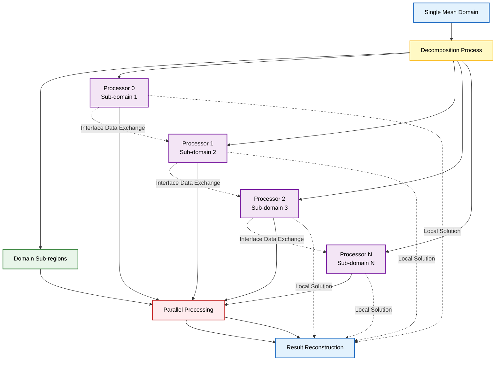
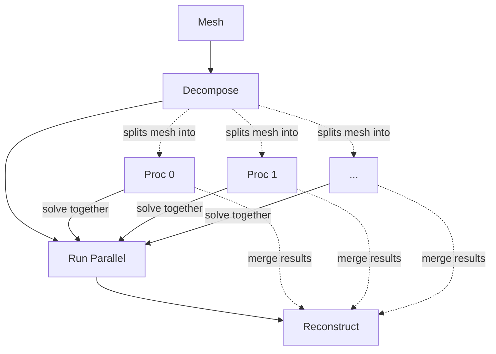

# การประมวลผลแบบขนาน (Parallel Execution)

การจำลอง CFD จริงใน OpenFOAM จะดึงศักยภาพในการคำนวณออกมาได้อย่างเต็มที่ผ่าน **การประมวลผลแบบขนาน (parallel execution)** ซึ่งช่วยกระจายภาระการคำนวณจำนวนมหาศาลไปยังคอร์ประมวลผลหลายคอร์

สคริปต์ `Allrun` ทำหน้าที่เป็นผู้ประสานงานที่จัดการความซับซ้อนของ:
- **การแบ่งโดเมน (domain decomposition)**
- **การประมวลผลแบบขนาน (parallel execution)**
- **การสร้างผลลัพธ์ใหม่ (result reconstruction)**

## ขั้นตอนการทำงานแบบขนาน (The Parallel Workflow)

กระบวนการประมวลผลแบบขนาน (parallel execution) เป็นไปตามขั้นตอนการทำงานที่เป็นระบบ ซึ่งจะเปลี่ยนโดเมนการคำนวณเดียวให้เป็นโดเมนย่อยหลายโดเมนที่สามารถประมวลผลพร้อมกันได้:







### ขั้นตอนที่ 1: เตรียมโดเมนการคำนวณ
กระบวนการเริ่มต้นด้วย **Mesh ที่สมบูรณ์** ซึ่งแสดงถึงโดเมนการคำนวณทั้งหมด

### ขั้นตอนที่ 2: การแบ่งโดเมน (Domain Decomposition)
ในระหว่างการแบ่งโดเมน (decomposition) Mesh นี้จะถูกแบ่งออกเป็นโดเมนย่อยหลายโดเมน โดยแต่ละโดเมนย่อยจะถูกกำหนดให้กับคอร์ประมวลผลเฉพาะ

**กลยุทธ์การแบ่งโดเมน (decomposition strategy) มีเป้าหมายเพื่อ:**
- สร้างสมดุลของภาระการคำนวณ (load balancing)
- ลดการสื่อสารระหว่างอินเทอร์เฟซระหว่าง Processor ให้เหลือน้อยที่สุด

### ขั้นตอนที่ 3: การแก้สมการแบบขนาน
เมื่อถูกแบ่งโดเมนแล้ว **Processor แต่ละตัวจะแก้สมการควบคุม (governing equations)** ในส่วนที่ได้รับมอบหมายพร้อมกัน

**การสื่อสารระหว่าง Processor:**
- แลกเปลี่ยนข้อมูลที่อินเทอร์เฟซระหว่างโดเมนย่อยผ่าน **MPI (Message Passing Interface)**
- ทำการประสานเวลา (synchronization) เพื่อให้การคำนวณสอดคล้องกัน

### ขั้นตอนที่ 4: การสร้างผลลัพธ์ใหม่
หลังจากที่การหาผลเฉลยแบบขนาน (parallel solution) เสร็จสมบูรณ์ **ผลลัพธ์ของแต่ละ Processor จะถูกสร้างใหม่ให้เป็น Solution field เดียวที่รวมกัน** ซึ่งสามารถแสดงผลและวิเคราะห์ได้

## ตัวอย่างสคริปต์การประมวลผลแบบขนาน (Example Parallel Script)

สคริปต์การประมวลผลแบบขนาน (parallel execution) ทั่วไปจะแสดงขั้นตอนการทำงานตามลำดับและใช้ประโยชน์จากฟังก์ชันในตัวของ OpenFOAM เพื่อการประมวลผลที่มีประสิทธิภาพ:

```bash
#!/bin/sh
cd "${0%/*}" || exit
. ${WM_PROJECT_DIR:?}/bin/tools/RunFunctions

# 1. Serial Meshing
runApplication blockMesh

# 2. Decompose Domain
# Needs system/decomposeParDict configured!
runApplication decomposePar

# 3. Run Parallel Solver
# The 'runParallel' function handles mpirun -np X
runParallel icoFoam

# 4. Reconstruct Results
runApplication reconstructPar
```

### คำอธิบายฟังก์ชันสำคัญ
- **`runApplication`**: ดำเนินการคำสั่งพร้อมการจัดการข้อผิดพลาดและการบันทึกที่เหมาะสม
- **`runParallel`**: จัดการการประมวลผล MPI โดยอัตโนมัติด้วยจำนวนคอร์ประมวลผลที่เหมาะสม

## การกำหนดค่าการแบ่งโดเมน (Domain Decomposition Configuration)

กระบวนการแบ่งโดเมน (decomposition) ต้องมีการกำหนดค่าอย่างรอบคอบผ่านไฟล์ `system/decomposeParDict`:

```cpp
// system/decomposeParDict
numberOfSubdomains 4;

method          hierarchical;  // Can be: simple, hierarchical, metis, scotch

hierarchicalCoeffs
{
    n               (2 2 1);    // 2×2×1 = 4 processors
    delta           0.001;      // Cell skewness tolerance
}
```

### วิธีการแบ่งโดเมน (Decomposition Methods)

| วิธีการ | คำอธิบาย | ข้อดี | ข้อเสีย | กรณีที่เหมาะสม |
|----------|------------|--------|--------|----------------|
| **simple** | การแบ่งทางเรขาคณิตตรงไปตรงมาตามแกนพิกัด | ง่ายต่อการตั้งค่า | ไม่สามารถจัดการกับเรขาคณิตซับซ้อนได้ | เรขาคณิตสี่เหลี่ยมธรรมดา |
| **hierarchical** | การแบ่งทางเรขาคณิตหลายระดับพร้อมลำดับชั้น | ควบคุมได้ดีกับเรขาคณิตที่ซับซ้อน | ต้องตั้งค่าลำดับชั้น | โดเมนที่มีโครงสร้างลำดับชั้น |
| **metis** | การแบ่งพาร์ติชันแบบกราฟเพื่อการกระจายโหลดที่เหมาะสมที่สุด | กระจายโหลดได้ดีที่สุด | ต้องการ library เพิ่มเติม | ปัญหาที่ต้องการการกระจายโหลดสมดุล |
| **scotch** | อัลกอริทึมการแบ่งพาร์ติชันกราฟขั้นสูง | ประสิทธิภาพสูงสำหรับโดเมนใหญ่ | ซับซ้อนในการตั้งค่า | โดเมนขนาดใหญ่ที่ซับซ้อน |
| **manual** | การกระจาย Cell ที่ผู้ใช้กำหนด | ควบคุมได้อย่างสมบูรณ์ | ต้องการความรู้เฉพาะทางสูง | การทดสอบและการวิจัย |

## การประมวลผล MPI และการกระจายโหลด (Load Balancing)

การประมวลผลแบบขนาน (parallel execution) ใช้ประโยชน์จาก **MPI (Message Passing Interface)** สำหรับการสื่อสารระหว่าง Process:

```bash
# Equivalent manual command for 4 processors:
mpirun -np 4 icoFoam -case . -parallel
```

### การกระจายโหลด (Load Balancing)

การกระจายโหลดมีความสำคัญอย่างยิ่งต่อประสิทธิภาพของการประมวลผลแบบขนาน (parallel execution)

**หลักการที่สำคัญ:**
- การแบ่งโดเมนควรมั่นใจว่าแต่ละ Processor ได้รับจำนวน Cell การคำนวณใกล้เคียงกัน
- **การกระจายที่ไม่เท่ากันจะนำไปสู่ความไม่สมดุลของโหลด (load imbalance)**
- Processor บางตัวทำงานเสร็จก่อนในขณะที่ตัวอื่นยังคงทำงานอยู่
- ลดประสิทธิภาพโดยรวมอย่างมาก

## การสื่อสารระหว่าง Processor

ในระหว่างการประมวลผลแบบขนาน (parallel execution) Processor ต้องสื่อสารข้อมูล Boundary ที่อินเทอร์เฟซระหว่างโดเมนย่อย:

### ประเภทของการสื่อสาร

1. **Ghost cells**
   - ชั้น Cell ที่ทับซ้อนกันที่ขอบเขตของ Processor
   - ใช้สำหรับการคำนวณที่ต้องการข้อมูลจาก Processor ข้างเคียง

2. **การแลกเปลี่ยนข้อมูล**
   - ค่าที่หน้า Cell ที่ใช้ร่วมกันและ Boundary Condition
   - ส่งผ่านข้อมูลระหว่าง Processor ที่ติดกัน

3. **Global reductions**
   - การดำเนินการ เช่น การคำนวณ Global residual, ค่าต่ำสุด, ค่าสูงสุด
   - รวบรวมข้อมูลจากทุก Processor เพื่อการคำนวณค่ารวม

4. **Synchronization**
   - การรับรอง Time stepping ที่สอดคล้องกันในทุก Processor
   - ทำให้การคำนวณทั้งระบบเคลื่อนที่ไปพร้อมกัน

**Overhead การสื่อสารจะเพิ่มขึ้นตามจำนวนอินเทอร์เฟซของ Processor** ทำให้กลยุทธ์การแบ่งโดเมน (decomposition strategy) มีความสำคัญต่อประสิทธิภาพแบบขนาน (parallel efficiency)

## การสร้างผลลัพธ์ใหม่ (Result Reconstruction)

หลังจากเสร็จสิ้นการประมวลผลแบบขนาน (parallel execution) ผลลัพธ์ของแต่ละ Processor จะต้องถูกรวมเข้าเป็น Solution field เดียวที่รวมกัน:

```bash
# Reconstruct all time directories
runApplication reconstructPar

# Reconstruct only latest time
runApplication reconstructPar -latestTime

# Reconstruct specific fields only
runApplication reconstructPar -fields "(U p)"
```

### กระบวนการทำงานของ reconstructPar

1. **อ่านไดเรกทอรีย่อยของ Processor** (โดยทั่วไปจะชื่อ `processor0`, `processor1` เป็นต้น)
2. **สร้างชุด Solution เดียวที่รวมกัน**
3. **เตรียมไฟล์สำหรับการแสดงผล** ด้วยเครื่องมือเช่น paraFoam หรือวิเคราะห์ด้วยยูทิลิตี้ Post-processing อื่นๆ

## ข้อควรพิจารณาด้านประสิทธิภาพ (Performance Considerations)

ปัจจัยหลายอย่างมีอิทธิพลต่อประสิทธิภาพการประมวลผลแบบขนาน (parallel execution):

### ปัจจัยหลักที่ส่งผลต่อประสิทธิภาพ

1. **Scalability**
   - ความเร็วที่เพิ่มขึ้นจากการเพิ่ม Processor
   - เป้าหมายคือการเพิ่มประสิทธิภาพตามสัดส่วนจำนวน Processor

2. **Communication overhead**
   - เวลาที่ใช้ในการแลกเปลี่ยนข้อมูลระหว่าง Processor
   - ยิ่งมี Processor มาก ยิ่งเพิ่ม overhead ของการสื่อสาร

3. **Memory bandwidth**
   - ปัญหาคอขวดที่อาจเกิดขึ้นในรูปแบบการเข้าถึงหน่วยความจำ
   - การแข่งขันระหว่าง Processor เพื่อเข้าถึงหน่วยความจำร่วมกัน

4. **I/O operations**
   - ประสิทธิภาพของระบบไฟล์สำหรับการอ่าน/เขียนข้อมูลที่ถูกแบ่งโดเมน
   - การจัดการไฟล์ขนาดใหญ่จากหลาย Processor

### ประเภทของ Scaling

**Strong scaling** หมายถึงการแก้ปัญหาขนาดเดิมด้วยจำนวน Processor ที่เพิ่มขึ้น

**Weak scaling** เกี่ยวข้องกับการเพิ่มขนาดปัญหาตามสัดส่วนของจำนวน Processor

**OpenFOAM โดยทั่วไปจะทำ Scalability ได้ดีถึงคอร์ประมวลผลนับพัน** สำหรับ Mesh ที่ถูกแบ่งโดเมน (decomposed) อย่างดี

## คุณสมบัติการประมวลผลแบบขนานขั้นสูง (Advanced Parallel Features)

OpenFOAM รองรับความสามารถในการประมวลผลแบบขนาน (parallel execution) เพิ่มเติม:

```bash
# Parallel execution with specific time steps
mpirun -np 8 icoFoam -case . -parallel -timeStep 0.001

# Parallel reconstruction with specific fields
reconstructPar -region region0 -fields "(U k epsilon)"

# Decomposition with preservation of boundaries
decomposePar -region region0 -preservePatches "(wall inlet)"
```

**คุณสมบัติขั้นสูงเหล่านี้ให้:**
- การควบคุมการประมวลผลแบบขนาน (parallel execution) อย่างละเอียด
- การปรับแต่งให้เหมาะสมกับข้อกำหนดการจำลองเฉพาะ
- การจัดการกับฮาร์ดแวร์และระบบต่างๆ อย่างยืดหยุ่น

## การแก้ไขปัญหาการประมวลผลแบบขนาน (Troubleshooting Parallel Execution)

ปัญหาการประมวลผลแบบขนาน (parallel execution) ทั่วไป:

### ปัญหาที่พบบ่อยและวิธีแก้ไข

| ปัญหา | สาเหตุ | วิธีแก้ไข |
|--------|---------|-------------|
| **Decomposition failures** | การแบ่งโดเมน (domain partitioning) ที่ไม่ถูกต้อง | ตรวจสอบค่าใน `decomposeParDict` และคุณภาพ mesh |
| **Load imbalance** | การกระจายภาระการคำนวณที่ไม่สม่ำเสมอ | ใช้วิธีการแบ่งที่ดีขึ้น (metis, scotch) |
| **Communication bottlenecks** | การแลกเปลี่ยนข้อมูลระหว่าง Processor ที่มากเกินไป | ลดจำนวนอินเทอร์เฟซโดยการปรับ decomposition |
| **Memory limitations** | หน่วยความจำไม่เพียงพอต่อ Processor | เพิ่มจำนวนหน่วยความจำหรือลดจำนวน Processor |
| **I/O constraints** | ข้อจำกัดด้านประสิทธิภาพของระบบไฟล์ | ใช้ระบบไฟล์ที่เร็วขึ้นหรือปรับ I/O pattern |

### เครื่องมือช่วยในการตรวจสอบ

เครื่องมือตรวจสอบเช่น:
- **`top`, `htop`** - ตรวจสอบการใช้ CPU และหน่วยความจำ
- **MPI profiler** - วิเคราะห์การสื่อสารระหว่าง Processor
- **OpenFOAM profiling tools** - ตรวจสอบประสิทธิภาพการคำนวณ

เครื่องมือเหล่านี้ช่วยระบุปัญหาคอขวดด้านประสิทธิภาพและปรับแต่งพารามิเตอร์การประมวลผลแบบขนาน (parallel execution) ได้อย่างมีประสิทธิภาพ
