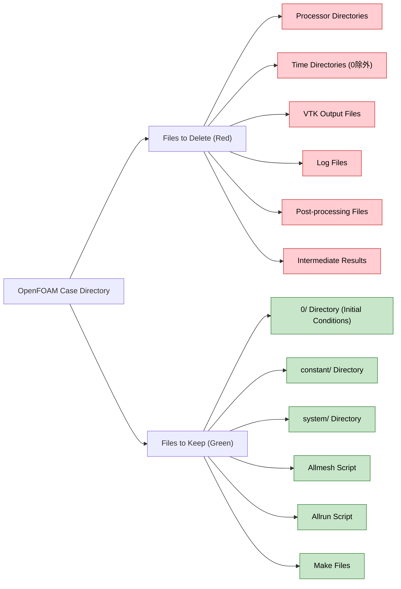

# สคริปต์ `Allclean`: การล้างข้อมูล Case โดยอัตโนมัติใน OpenFOAM

สคริปต์ `Allclean` มีฟังก์ชันการทำงานสำหรับการล้างข้อมูล OpenFOAM Case โดยอัตโนมัติ โดยจะลบผลการจำลองในขณะที่ยังคงรักษาไฟล์การตั้งค่าไว้ สคริปต์นี้จำเป็นสำหรับการจัดระเบียบไดเรกทอรี Case และเตรียม Case สำหรับการรันใหม่

## การใช้งานสคริปต์

```bash
#!/bin/sh
cd "${0%/*}" || exit
. ${WM_PROJECT_DIR:?}/bin/tools/CleanFunctions

cleanCase
```

## ส่วนประกอบของสคริปต์

### 1. การนำทางไดเรกทอรี
```bash
cd "${0%/*}" || exit
```
- `${0%/*}` ดึงพาธไดเรกทอรีจากตัวแปร `$0`
- คำสั่งนี้จะเปลี่ยนไปยังไดเรกทอรีที่มีสคริปต์อยู่
- จะออกจากสคริปต์หากการเปลี่ยนไดเรกทอรีล้มเหลว

### 2. การเรียกใช้สภาพแวดล้อม
```bash
. ${WM_PROJECT_DIR:?}/bin/tools/CleanFunctions
```
- เรียกใช้ฟังก์ชันการล้างข้อมูลของ OpenFOAM จากไดเรกทอรีการติดตั้งมาตรฐาน
- `:?` ช่วยให้มั่นใจว่าสคริปต์จะล้มเหลวหาก `WM_PROJECT_DIR` ไม่ได้ถูกกำหนดไว้

### 3. การล้างข้อมูล Case
```bash
cleanCase
```
รันฟังก์ชันการล้างข้อมูลหลักที่ลบไฟล์ที่เกิดจากการจำลอง





## พฤติกรรมของฟังก์ชัน `cleanCase`

ฟังก์ชัน `cleanCase` จะลบไฟล์ที่สร้างขึ้นจากการจำลองอย่างชาญฉลาด ในขณะที่ยังคงรักษาการตั้งค่าที่จำเป็นไว้

### **ไฟล์ที่ถูกลบ:**
- **ไดเรกทอรี Time**: ไดเรกทอรี time step ที่เป็นตัวเลขทั้งหมด (เช่น `0.1/`, `0.2/`, `1/`, `2/`)
- **ไฟล์ Log**: ไฟล์ log ของ Solver (เช่น `simpleFoam.log`, `pimpleFoam.log`)
- **ไดเรกทอรี Processor**: ผลลัพธ์ของการแบ่งส่วนแบบขนาน (เช่น `processor0/`, `processor1/`)
- **ไฟล์ Post-processing**: ไฟล์ VTK, ข้อมูลตัวอย่าง, ผลลัพธ์ของ probe
- **ไฟล์ชั่วคราว**: Core dumps, lock files, ไฟล์ OpenFOAM ชั่วคราว

### **ไฟล์ที่ถูกเก็บรักษาไว้:**
- **ไดเรกทอรี `0/`**: เงื่อนไขสนามเริ่มต้น (initial field conditions)
- **ไดเรกทอรี `constant/`**: Mesh, คุณสมบัติทางกายภาพ (physical properties), โมเดลการขนส่ง (transport models)
- **ไดเรกทอรี `system/`**: การควบคุม Solver (Solver control), รูปแบบเชิงตัวเลข (numerical schemes), เงื่อนไขขอบเขต (boundary conditions)

## สถานการณ์การใช้งาน

### 1. การรีเซ็ตทั้งหมด
เตรียม Case สำหรับการจำลองใหม่:

```bash
# ลบผลลัพธ์ก่อนหน้าทั้งหมด
./Allclean

# รันการจำลองใหม่
./Allrun
```

### 2. การทดสอบความหลากหลาย
ล้างข้อมูลระหว่างการเปลี่ยนแปลงพารามิเตอร์:

```bash
# ทดสอบ turbulence models ที่แตกต่างกัน
./Allclean
# แก้ไข system/turbulenceProperties
./Allrun

# ล้างข้อมูลสำหรับการทดสอบถัดไป
./Allclean
# แก้ไข system/controlDict
./Allrun
```

### 3. การเพิ่มประสิทธิภาพการจัดเก็บ
ลบไฟล์ผลลัพธ์ขนาดใหญ่เพื่อประหยัดพื้นที่ดิสก์:

```bash
# ลบไดเรกทอรี time (ซึ่งมักจะมีข้อมูลสนามขนาดใหญ่)
./Allclean
# ขนาด Case ลดลงจาก GB เป็น MB
```

## การบูรณาการกับขั้นตอนการทำงานของ OpenFOAM

สคริปต์ `Allclean` เป็นส่วนหนึ่งของชุดเครื่องมืออัตโนมัติมาตรฐานสามตัวสำหรับ OpenFOAM Case:


```mermaid
graph LR
    %% Case Structure
    A["Case Directory"] --> B["constant/"]
    A --> C["system/"]
    A --> D["0/"]
    A --> E["Scripts/"]
    
    B --> B1["Mesh Files"]
    B --> B2["Physical Properties"]
    B --> B3["Transport Models"]
    
    C --> C1["Solver Control"]
    C --> C2["Numerical Schemes"]
    C --> C3["Boundary Conditions"]
    
    %% Automation Scripts
    E --> F["Allrun"]
    E --> G["Allclean"]
    E --> H["Allmesh"]
    
    %% Main Workflow
    I["Setup Case"] --> J["Mesh Generation"]
    J --> K["Solver Execution"]
    K --> L["Convergence?"]
    L -->|Yes| M["Post-Processing"]
    L -->|No| K
    
    %% Allclean Role
    G --> N["Remove Time Directories"]
    G --> O["Remove processor* Files"]
    G --> P["Remove Post-Processing"]
    G --> Q["Preserve Configuration"]
    
    Q --> B
    Q --> C
    
    %% Parameter Testing Loop
    R["Modify Parameters"] --> G
    G --> I
    
    %% Connections
    F --> J
    H --> J
    M --> S["Analysis & Results"]
    S --> T["Parameter Optimization"]
    T --> R
    
    %% Styling
    classDef case fill:#e3f2fd,stroke:#1565c0,stroke-width:2px,color:#000;
    classDef script fill:#e8f5e9,stroke:#2e7d32,stroke-width:2px,color:#000;
    classDef process fill:#fff3e0,stroke:#ef6c00,stroke-width:2px,color:#000;
    classDef clean fill:#ffebee,stroke:#c62828,stroke-width:2px,color:#000;
    
    class A,B,C,D,B1,B2,B3,C1,C2,C3 case;
    class F,G,H script;
    class I,J,K,L,M,S,T process;
    class N,O,P,Q clean;
}
```


1. **`Allrun`**: รันสคริปต์การจำลอง
2. **`Allclean`**: ลบผลลัพธ์การจำลอง
3. **`Allmesh`**: สร้าง Mesh ใหม่ (เมื่อมี)

ระบบอัตโนมัตินี้ช่วยให้มั่นใจได้ถึงการจัดการ Case ที่สอดคล้องกัน และลดการดำเนินการไฟล์ด้วยตนเอง

## ฟังก์ชันการล้างข้อมูลเพิ่มเติม

สำหรับความต้องการการล้างข้อมูลบางส่วน OpenFOAM มีฟังก์ชันเพิ่มเติมให้:

| ฟังก์ชัน | คำอธิบาย | กรณีใช้งาน |
|------------|------------|---------------|
| `cleanCase` | ลบไฟล์จำลองทั้งหมด | การรีเซ็ต case ทั้งหมด |
| `cleanTimeDirectories` | ลบเฉพาะไดเรกทอรี time | การเก็บรักษาข้อมูลอื่น |
| `cleanProcessorDirectories` | ลบเฉพาะไดเรกทอรี processor | การทำงานแบบอนุกรม |
| `foamListTimes -rm` | ลบช่วงเวลาที่กำหนด | การลบข้อมูลบางส่วน |

## แนวทางปฏิบัติที่ดีที่สุด

### **การใช้งานเป็นประจำ:**
- ✅ รัน `Allclean` ก่อนการแก้ไข Case ครั้งใหญ่
- ✅ ใช้หลังจากจำลองสำเร็จเพื่อเก็บรักษาเฉพาะการตั้งค่า
- ✅ ใช้เมื่อจัดเก็บ Case เพื่อลดความต้องการพื้นที่จัดเก็บ

### **ข้อควรพิจารณาด้านความปลอดภัย:**
- ⚠️ สำรองข้อมูลผลลัพธ์ที่สำคัญเสมอก่อนการล้างข้อมูล
- ⚠️ ตรวจสอบให้แน่ใจว่าไดเรกทอรี `0/`, `constant/` และ `system/` ยังคงอยู่ครบถ้วนหลังการล้างข้อมูล
- ⚠️ ใช้ version control เพื่อติดตามการเปลี่ยนแปลงการตั้งค่า Case

## สคริปต์การล้างข้อมูลแบบกำหนดเอง

สำหรับความต้องการการล้างข้อมูลเฉพาะทาง สคริปต์แบบกำหนดเองสามารถขยายฟังก์ชันพื้นฐานได้:

```bash
#!/bin/sh
cd "${0%/*}" || exit
. ${WM_PROJECT_DIR:?}/bin/tools/CleanFunctions

# การล้างข้อมูลมาตรฐาน
cleanCase

# การล้างข้อมูลแบบกำหนดเองเพิ่มเติม
rm -rf postProcessing/
rm -f forces.dat
rm -f probes/*
```

แนวทางแบบโมดูลาร์นี้ช่วยรักษามาตรฐานของ OpenFOAM ในขณะที่รองรับความต้องการเฉพาะของ Case
