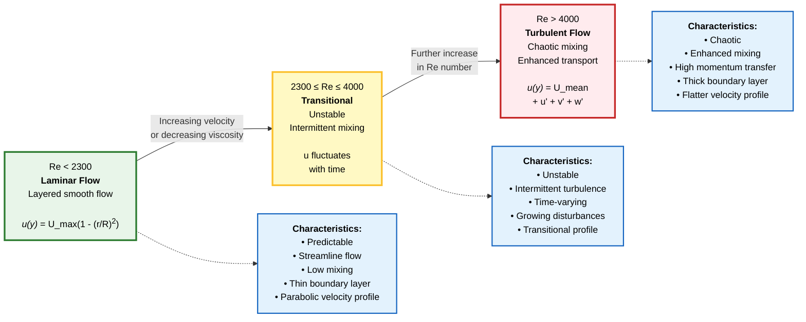
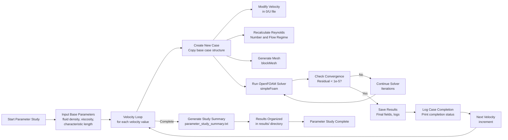
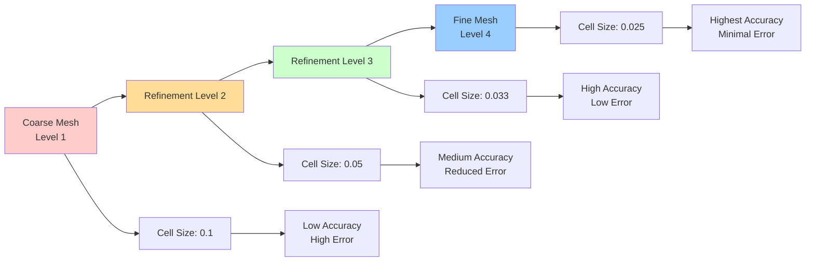

# การเขียนสคริปต์ขั้นสูง: การศึกษาพารามิเตอร์ใน OpenFOAM

การศึกษาพารามิเตอร์ (Parameter studies) เป็นเครื่องมือสำคัญในการทำความเข้าใจพฤติกรรมการไหลเมื่อสภาวะอินพุตเปลี่ยนแปลงไป ใน OpenFOAM คุณสามารถทำการศึกษาเหล่านี้โดยอัตโนมัติโดยใช้เทคนิคการเขียนเชลล์สคริปต์ (shell scripting)

## การศึกษา Reynolds Number

### ทฤษฎีพื้นฐาน

**Reynolds Number** เป็นพารามิเตอร์ที่สำคัญที่สุดในการตรวจสอบการเปลี่ยนผ่านของระบอบการไหล จากการไหลแบบราบเรียบ (laminar) ไปสู่การไหลแบบปั่นป่วน (turbulent)

$$\text{Re} = \frac{\rho U L}{\mu}$$

โดยที่:
- **$\rho$** = ความหนาแน่น (density)
- **$U$** = ความเร็วจำเพาะ (characteristic velocity)  
- **$L$** = ความยาวจำเพาะ (characteristic length)
- **$\mu$** = ความหนืดจลน์ (dynamic viscosity)





### ช่วง Reynolds Number สำหรับการไหลในท่อ

| ช่วง Reynolds Number | ลักษณะการไหล | ลักษณะเฉพาะ |
|----------------------|---------------|----------------|
| Re < 2300 | **Laminar Flow** | การไหลเป็นชั้น ๆ มีรูปแบบคาดการณ์ได้ |
| 2300 ≤ Re ≤ 4000 | **Transitional** | ช่วงเปลี่ยนผ่าน ไม่เสถียร |
| Re > 4000 | **Turbulent Flow** | การไหลปั่นป่วน มีการผสมกันอย่างรุนแรง |

### สคริปต์ศึกษาพารามิเตอร์ความเร็ว

```bash
#!/bin/bash

# สคริปต์การศึกษาพารามิเตอร์ขั้นสูง
# ดำเนินการเปลี่ยนแปลงความเร็วขาเข้าอย่างเป็นระบบสำหรับการวิเคราะห์ Reynolds Number

# พารามิเตอร์การตั้งค่า
base_case="baseCase"
velocities=(1 5 10 20 50 100)  # อาร์เรย์ของความเร็วที่จะทดสอบ
fluid_density=1.0              # กก./ลบ.ม.
fluid_viscosity=1e-3           # ปาสคาล-วินาที
characteristic_length=0.1      # เมตร

echo "กำลังเริ่มการศึกษาพารามิเตอร์ด้วยความเร็ว: ${velocities[*]}"
echo "คุณสมบัติของของไหล: ρ=$fluid_density กก./ลบ.ม., μ=$fluid_viscosity ปาสคาล-วินาที"
echo "ความยาวจำเพาะ: L=$characteristic_length เมตร"
echo "=================================================="

for velocity in "${velocities[@]}"
do
    # คำนวณ Reynolds Number สำหรับความเร็วนี้
    reynolds=$(echo "scale=2; $fluid_density * $velocity * $characteristic_length / $fluid_viscosity" | bc -l)
    
    echo "กำลังประมวลผล Case: U=$velocity m/s (Re=$reynolds)"
    
    # 1. สร้างไดเรกทอรี Case ใหม่จาก Base Case
    case_name="case_U${velocity}_Re${reynolds}"
    if [ -d "$case_name" ]; then
        echo "  กำลังลบไดเรกทอรี Case ที่มีอยู่..."
        rm -rf "$case_name"
    fi
    
    echo "  กำลังโคลน Base Case ไปยัง $case_name..."
    foamCloneCase "$base_case" "$case_name"
    
    # 2. แก้ไข Boundary Condition ในหลายไฟล์
    echo "  กำลังอัปเดต Boundary Condition..."
    
    # อัปเดตฟิลด์ความเร็วใน 0/U
    sed -i "s/internalField   uniform (1 0 0);/internalField   uniform ($velocity 0 0);/" "$case_name/0/U"
    sed -i "s/internalField   uniform 1;/internalField   uniform $velocity;/" "$case_name/0/U"
    
    # อัปเดตพารามิเตอร์ความปั่นป่วนหากใช้ k-omega SST
    if [ -f "$case_name/0/k" ]; then
        # คำนวณความเข้มของการปั่นป่วนตาม Reynolds Number
        if (( $(echo "$reynolds < 2300" | bc -l) )); then
            turb_intensity=0.01  # 1% สำหรับ laminar/Re ต่ำ
        elif (( $(echo "$reynolds < 10000" | bc -l) )); then
            turb_intensity=0.05  # 5% สำหรับช่วงเปลี่ยนผ่าน
        else
            turb_intensity=0.10  # 10% สำหรับ turbulent เต็มรูปแบบ
        fi
        
        # อัปเดตพลังงานจลน์ของการปั่นป่วน
        k_value=$(echo "scale=6; 1.5 * ($turb_intensity * $velocity)^2" | bc -l)
        sed -i "s/internalField   uniform 0.375;/internalField   uniform $k_value;/" "$case_name/0/k"
        
        # อัปเดตอัตราการสลายตัวจำเพาะ
        omega_value=$(echo "scale=6; $k_value / (0.09 * $characteristic_length^2 / 225)" | bc -l)
        sed -i "s/internalField   uniform 1.78;/internalField   uniform $omega_value;/" "$case_name/0/omega"
    fi
    
    # 3. อัปเดตพารามิเตอร์ควบคุมตามระบอบการไหล
    echo "  กำลังกำหนดค่า Solver..."
    if (( $(echo "$reynolds < 2300" | bc -l) )); then
        # ใช้โมเดล laminar สำหรับ Reynolds Number ต่ำ
        sed -i 's/simulationType  RASModel;/simulationType  laminar;/' "$case_name/constant/turbulenceProperties"
    else
        # ใช้โมเดล RAS สำหรับ Reynolds Number สูง
        sed -i 's/simulationType  laminar;/simulationType  RASModel;/' "$case_name/constant/turbulenceProperties"
    fi
    
    # ปรับค่าความคลาดเคลื่อนของ Solver ตาม Reynolds Number
    if (( $(echo "$reynolds > 10000" | bc -l) )); then
        # ค่าความคลาดเคลื่อนที่เข้มงวดขึ้นสำหรับ Case แบบ turbulent
        sed -i 's/tolerance           1e-05;/tolerance           1e-06;/' "$case_name/system/fvSolution"
    fi
    
    # 4. สร้างโครงสร้างไดเรกทอรีเอาต์พุตแบบกำหนดเอง
    output_dir="results/velocity_${velocity}_reynolds_${reynolds}"
    mkdir -p "$output_dir"
    
    # 5. รันการจำลอง
    echo "  กำลังเริ่มการจำลอง..."
    cd "$case_name"
    
    # ตรวจสอบว่าเป็น Case แบบ Steady-state หรือ Transient
    if grep -q "steadyState" system/controlDict; then
        echo "    ตรวจพบ Solver แบบ Steady-state"
        ./Allrun > "../$output_dir/solver_log.txt" 2>&1
    else
        echo "    ตรวจพบ Solver แบบ Transient"
        ./Allrun > "../$output_dir/solver_log.txt" 2>&1
    fi
    
    # ตรวจสอบว่าการจำลองเสร็จสมบูรณ์หรือไม่
    if [ $? -eq 0 ]; then
        echo "    ✓ การจำลองเสร็จสมบูรณ์"
        
        # คัดลอกผลลัพธ์สำคัญไปยังไดเรกทอรีเอาต์พุต
        cp -r 0/* "../$output_dir/" 2>/dev/null
        cp -r postProcessing/* "../$output_dir/" 2>/dev/null
        
        # สร้างสรุปอย่างรวดเร็ว
        echo "Case: $case_name" > "../$output_dir/case_summary.txt"
        echo "Velocity: $velocity m/s" >> "../$output_dir/case_summary.txt"
        echo "Reynolds number: $reynolds" >> "../$output_dir/case_summary.txt"
        echo "Flow regime: $([ $reynolds -lt 2300 ] && echo 'Laminar' || echo 'Turbulent')" >> "../$output_dir/case_summary.txt"
        
    else
        echo "    ✗ การจำลองล้มเหลว - ตรวจสอบ $output_dir/solver_log.txt"
    fi
    
    cd ..
    
    # 6. ล้างไฟล์ชั่วคราวเพื่อประหยัดพื้นที่
    if [ $? -eq 0 ]; then
        echo "  กำลังล้างไดเรกทอรี Processor..."
        rm -rf "$case_name/processor*"
        rm -rf "$case_name/postProcessing"
    fi
    
    echo "  เสร็จสิ้น Case $case_name"
    echo ""
done

echo "=================================================="
echo "การศึกษาพารามิเตอร์เสร็จสมบูรณ์!"
echo "ผลลัพธ์ถูกจัดระเบียบในไดเรกทอรี 'results/'"
echo "แต่ละโฟลเดอร์ Case มีบันทึก Solver และฟิลด์สุดท้าย"
echo ""

# สร้างสรุปการศึกษาพารามิเตอร์
echo "กำลังสร้างสรุปการศึกษาพารามิเตอร์..."
cat > "results/parameter_study_summary.txt" << EOF
สรุปการศึกษาพารามิเตอร์ OpenFOAM
===============================
วันที่: $(date)
Base Case: $base_case
ความเร็วที่ทดสอบ: ${velocities[*]}

Case ที่สร้าง:
$(ls -1d results/velocity_* 2>/dev/null | sed 's/results\//  /')

การวิเคราะห์ระบอบการไหล:
$(for vel in "${velocities[@]}"; do
    re=$(echo "scale=2; $fluid_density * $vel * $characteristic_length / $fluid_viscosity" | bc -l)
    regime=$([ $(echo "$re < 2300" | bc -l) -eq 1 ] && echo "Laminar" || echo "Turbulent")
    echo "  U=$vel m/s: Re=$re ($regime)"
done)

EOF

echo "สรุปบันทึกไว้ที่: results/parameter_study_summary.txt"
```





## การเปลี่ยนแปลงพารามิเตอร์ขั้นสูง

### การศึกษาหลายพารามิเตอร์

```bash
#!/bin/bash

# การศึกษาหลายพารามิเตอร์: ความเร็วและเส้นผ่านศูนย์กลางท่อ
velocities=(1 5 10 20)
diameters=(0.05 0.1 0.2)  # เมตร

base_case="pipeFlow_base"

for vel in "${velocities[@]}"; do
    for diam in "${diameters[@]}"; do
        # คำนวณ Reynolds Number
        re=$(echo "scale=2; 1000 * $vel * $diam / 0.001" | bc -l)
        
        case_name="case_U${vel}_D${diam}_Re${re}"
        echo "กำลังประมวลผล: $case_name"
        
        # โคลนและแก้ไข Case
        foamCloneCase "$base_case" "$case_name"
        
        # อัปเดตความเร็ว
        sed -i "s/internalField   uniform 1;/internalField   uniform $vel;/" "$case_name/0/U"
        
        # อัปเดตเส้นผ่านศูนย์กลาง Mesh (หากใช้ blockMesh)
        sed -i "s/diameter 0.1;/diameter $diam;/" "$case_name/system/blockMeshDict"
        
        # รันการจำลอง
        cd "$case_name"
        blockMesh
        simpleFoam > "../results/${case_name}.log" 2>&1
        cd ..
    done
done
```

### การศึกษาความเป็นอิสระของ Grid

```bash
#!/bin/bash

# การศึกษาการปรับละเอียด Mesh
refinements=(1 2 3 4)  # ระดับการปรับละเอียด
base_case="mesh_refinement_base"

for level in "${refinements[@]}"; do
    case_name="mesh_level_$level"
    echo "กำลังประมวลผลระดับการปรับละเอียด Mesh: $level"
    
    foamCloneCase "$base_case" "$case_name"
    
    # อัปเดตระดับการปรับละเอียดใน snappyHexMeshDict
    sed -i "s/refinementLevels 2;/refinementLevels $level;/" "$case_name/system/snappyHexMeshDict"
    
    # อัปเดตขนาดเซลล์สำหรับ blockMesh
    cell_size=$(echo "scale=4; 0.1 / $level" | bc -l)
    sed -i "s/cells (100 10 10);/cells $(echo "scale=0; 100 * $level / 1" | bc) $(echo "scale=0; 10 * $level / 1" | bc) $(echo "scale=0; 10 * $level / 1" | bc);/" "$case_name/system/blockMeshDict"
    
    cd "$case_name"
    blockMesh
    snappyHexMesh -overwrite
    simpleFoam
    cd ..
done
```





## การทำงานอัตโนมัติหลังการประมวลผล

### การดึงผลลัพธ์สำคัญ

```bash
#!/bin/bash

# ดึงค่าสัมประสิทธิ์แรงต้าน (drag coefficients) และความดันลด (pressure drops) จากการจำลองที่เสร็จสมบูรณ์
results_dir="results"

for case_dir in "$results_dir"/*; do
    if [ -d "$case_dir" ]; then
        case_name=$(basename "$case_dir")
        echo "กำลังประมวลผลผลลัพธ์สำหรับ: $case_name"
        
        # ดึงค่า Residual สุดท้าย
        if [ -f "$case_dir/solver_log.txt" ]; then
            echo "ค่า Residual สุดท้ายของ Solver:" >> "$case_dir/performance_metrics.txt"
            grep "Final residual" "$case_dir/solver_log.txt" | tail -5 >> "$case_dir/performance_metrics.txt"
        fi
        
        # คำนวณค่าสัมประสิทธิ์แรงต้านหากมีข้อมูลแรง
        if [ -f "$case_dir/forces.dat" ]; then
            drag_force=$(tail -1 "$case_dir/forces.dat" | awk '{print $2}')
            echo "แรงต้าน: $drag_force N" >> "$case_dir/performance_metrics.txt"
        fi
        
        # ดึงค่าความดันลด
        if [ -f "$case_dir/0/p" ]; then
            inlet_pressure=$(grep "inlet" "$case_dir/0/p" -A 10 | grep "uniform" | awk '{print $2}' | head -1)
            outlet_pressure=$(grep "outlet" "$case_dir/0/p" -A 10 | grep "uniform" | awk '{print $2}' | head -1)
            pressure_drop=$(echo "$inlet_pressure - $outlet_pressure" | bc -l)
            echo "ความดันลด: $pressure_drop Pa" >> "$case_dir/performance_metrics.txt"
        fi
    fi
done
```

## แนวทางปฏิบัติที่ดีที่สุด

### หลักการสำคัญสำหรับการศึกษาพารามิเตอร์

| หลักการ | คำอธิบาย | เครื่องมือที่แนะนำ |
|-----------|-------------|-----------------|
| **การจัดระเบียบอย่างเป็นระบบ** | ใช้รูปแบบการตั้งชื่อที่สื่อความหมายซึ่งรวมถึงค่าพารามิเตอร์ | foamCloneCase, โครงสร้างไดเรกทอรีแบบลำดับชั้น |
| **การจัดการทรัพยากร** | ตรวจสอบพื้นที่ดิสก์และล้างไฟล์ชั่วคราว | rm -rf, wclean, การตรวจสอบขนาดไดเรกทอรี |
| **การจัดการข้อผิดพลาด** | ตรวจสอบสถานะการเสร็จสิ้นของการจำลองก่อนประมวลผลผลลัพธ์ | การตรวจสอบ exit codes, log file analysis |
| **การรันแบบขนาน** | สำหรับชุดพารามิเตอร์ขนาดใหญ่ ให้พิจารณาใช้ GNU Parallel หรือ Job Array | GNU parallel, mpirun, slurm arrays |
| **เอกสารประกอบ** | เก็บบันทึกรายละเอียดของค่าพารามิเตอร์และผลลัพธ์ที่เกี่ยวข้อง | echo output, text summaries, metadata files |

### ตัวอย่างการรันแบบขนาน

```bash
#!/bin/bash

# การศึกษาพารามิเตอร์แบบขนานโดยใช้ GNU parallel
velocities=(1 5 10 20 50 100)

run_case() {
    local velocity=$1
    local case_name="case_U$velocity"
    
    foamCloneCase baseCase "$case_name"
    sed -i "s/internalField   uniform 1;/internalField   uniform $velocity;/" "$case_name/0/U"
    
    cd "$case_name"
    ./Allrun
    cd ..
}

export -f run_case

# รันสูงสุด 4 Case พร้อมกัน
parallel -j 4 run_case ::: "${velocities[@]}"
```

### ขั้นตอนการทำงานอัตโนมัติ

**Algorithm: การศึกษาพารามิเตอร์แบบอัตโนมัติ**

```
BEGIN Parameter Study Algorithm
    1. กำหนดช่วงพารามิเตอร์ที่ต้องการศึกษา
    2. สร้าง Base Case ที่มีโครงสร้างครบถ้วน
    3. FOR each parameter combination DO
        a. คัดลอก Base Case ไปยัง Case ใหม่
        b. แก้ไขไฟล์คอนฟิกูเรชัน:
            - Boundary conditions (0/*)
            - Solver settings (system/*)
            - Mesh parameters (constant/*)
        c. รันการจำลอง:
            - Mesh generation (blockMesh, snappyHexMesh)
            - Solver execution (simpleFoam, pimpleFoam, etc.)
            - Monitor convergence
        d. ประมวลผลผลลัพธ์:
            - คัดลอกไฟล์สุดท้าย
            - ดึงค่า performance metrics
            - สร้างสรุป Case
        e. ล้างไฟล์ชั่วคราว
    4. END FOR
    5. สร้างสรุปการศึกษาพารามิเตอร์โดยรวม
    6. วิเคราะห์และสรุปผลลัพธ์
END Algorithm
```

แนวทางที่เป็นระบบสำหรับการศึกษาพารามิเตอร์นี้ช่วยให้สามารถสำรวจ Design Space ได้อย่างครอบคลุม และให้ข้อมูลเชิงลึกที่มีคุณค่าเกี่ยวกับพฤติกรรมการไหลภายใต้สภาวะการทำงานที่แตกต่างกัน
