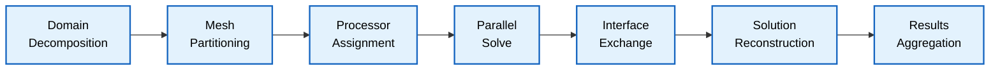

## สรุป

### 1. การทำให้ทุกอย่างเป็นอัตโนมัติ

**หลักการพื้นฐาน**ของการเพิ่มประสิทธิภาพ Workflow ของ OpenFOAM คือระบบอัตโนมัติ ลำดับคำสั่งใดๆ ที่คุณดำเนินการมากกว่าหนึ่งครั้ง ควรถูกบันทึกไว้อย่างเป็นระบบใน Script

**ประโยชน์ของการทำให้เป็นอัตโนมัติ:**
- **ลดข้อผิดพลาดจากมนุษย์**
- **รับประกันความสามารถในการทำซ้ำ**
- **ลดเวลาในการตั้งค่าสำหรับกรณีศึกษาที่ซับซ้อนลงอย่างมาก**


```mermaid
graph LR
    A["Manual Process"] --> B["Scripted Process"]
    C["Automated System"]
    B --> C
    
    subgraph "Manual Process"
        A1["User executes<br/>individual commands"]
        A2["Manual error checking"]
        A3["Time-consuming setup"]
    end
    
    subgraph "Scripted Process"
        B1["Batch scripts<br/>for common tasks"]
        B2["Basic error handling"]
        B3["Reduced user input"]
    end
    
    subgraph "Automated System"
        C1["Complete workflow<br/>automation"]
        C2["Advanced error recovery"]
        C3["Zero-touch execution"]
    end
    
    A --> A1
    A --> A2
    A --> A3
    B --> B1
    B --> B2
    B --> B3
    C --> C1
    C --> C2
    C --> C3
    
    classDef process fill:#e3f2fd,stroke:#1565c0,stroke-width:2px,color:#000;
    classDef subgraph fill:#f3f9ff,stroke:#1976d2,stroke-width:1px,color:#000;
    class A,B,C process;
    class A1,A2,A3,B1,B2,B3,C1,C2,C3 process;
```


#### ตัวอย่าง Script อัตโนมัติ:

```bash
#!/bin/bash
# Example automation script (Allrun)
casePath="$(dirname "$0")"
cd "$casePath"

# Mesh generation
blockMesh
snappyHexMesh -overwrite

# Decomposition for parallel processing
decomposePar

# Solver execution with automatic recovery
mpirun -np 4 solver -case . > log 2>&1 || {
    echo "Solver failed, checking for recovery files..."
    ls -la processor*
    exit 1
}

# Post-processing automation
reconstructPar
paraFoam -batch
```

**ส่วนประกอบที่สำคัญใน Script อัตโนมัติ:**
- **การจัดการข้อผิดพลาด**
- **การบันทึก Log**
- **กลไกการกู้คืน**
- **ความเสถียรในสภาพแวดล้อมการคำนวณที่แตกต่างกัน**

---

### 2. ใช้ฟังก์ชันมาตรฐาน

OpenFOAM มีไฟล์ `$WM_PROJECT_DIR/etc/cshrc` และ `$WM_PROJECT_DIR/etc/bashrc` พร้อมฟังก์ชันที่ได้มาตรฐาน ซึ่งควรนำมาใช้ให้เกิดประโยชน์สูงสุด

#### ฟังก์ชันมาตรฐานใน RunFunctions:

```bash
# Standard RunFunctions
source $WM_PROJECT_DIR/etc/cshrc

# Pre-defined functions
runApplication()     # Execute with error checking
runParallel()        # Parallel execution wrapper
getApplication()      # Solver discovery utility
getNumberOfProcessors() # Automatic processor count
```

#### ข้อดีของการใช้ฟังก์ชันมาตรฐาน:

| คุณสมบัติ | รายละเอียด |
|------------|-------------|
| **การจัดการข้อผิดพลาด** | การตรวจจับความล้มเหลวในการดำเนินการโดยอัตโนมัติ |
| **การบันทึก Log** | การจัดการไฟล์ Log ที่สอดคล้องกัน (`log.<application>`) |
| **ความเป็นอิสระของสภาพแวดล้อม** | Script สามารถทำงานได้ใน OpenFOAM Installation ที่แตกต่างกัน |
| **ความสามารถในการบำรุงรักษา** | Syntax และพฤติกรรมที่เป็นมาตรฐาน |

#### ตัวอย่างการนำไปใช้งาน:

```bash
# Using standard RunFunctions
runApplication blockMesh
runApplication snappyHexMesh -overwrite
runParallel $(getApplication) 4
```

---

### 3. การออกแบบที่พร้อมสำหรับการประมวลผลแบบขนาน

**การจำลอง CFD สมัยใหม่**เกือบทั้งหมดต้องใช้การประมวลผลแบบขนาน การออกแบบ Script ให้มีการประมวลผลแบบขนานตั้งแต่เริ่มต้นช่วยป้องกันปัญหาคอขวดใน Workflow





#### กลยุทธ์การแบ่งส่วน:

```bash
# Automatic decomposition based on available cores
nProcs=$(getNumberOfProcessors)
if [ "$nProcs" -gt 1 ]; then
    echo "Decomposing case for $nProcs processors"
    decomposePar
fi
```

#### Wrapper สำหรับการประมวลผลแบบขนาน:

```bash
# Generic parallel solver execution
runParallelSolver() {
    local solver=$1
    local nProcs=${2:-$(getNumberOfProcessors)}
    
    if [ "$nProcs" -gt 1 ]; then
        runParallel $solver $nProcs
    else
        runApplication $solver
    fi
}
```

#### การบูรณาการ Post-Processing:

```bash
# Automatic reconstruction for visualization
if [ -d "processor0" ]; then
    echo "Reconstructing parallel case"
    reconstructPar
fi
```

#### การจัดการทรัพยากร:

```bash
# Memory-aware processor allocation
estimateMemoryRequirement() {
    local cells=$(foamToVTK -case . -noZero 2>&1 | grep "Cells:" | awk '{print $2}')
    local memoryPerCell=100  # bytes per cell estimate
    local availableMemory=$(free -g | awk '/^Mem:/{print $7}')
    
    echo $(( availableMemory * 1024 * 1024 * 1024 / (cells * memoryPerCell) ))
}
```

---

### ผลลัพธ์จากการใช้หลักการทั้งสาม

ด้วยการนำหลักการทั้งสามนี้ไปใช้อย่างเป็นระบบ ผู้ใช้ OpenFOAM จะได้รับ:

| ประสิทธิภาพ | รายละเอียด |
|-------------|-------------|
| **ความสามารถในการทำซ้ำ** | ผลลัพธ์ที่เหมือนกันในสภาพแวดล้อมที่แตกต่างกัน |
| **ความสามารถในการปรับขนาด** | การเปลี่ยนผ่านจาก Laptop ไปยัง Cluster ได้อย่างราบรื่น |
| **ประสิทธิภาพ** | การแทรกแซงด้วยตนเองน้อยที่สุดและระบบอัตโนมัติสูงสุด |
| **ความน่าเชื่อถือ** | การจัดการข้อผิดพลาดและกลไกการกู้คืนที่แข็งแกร่ง |

**การลงทุนในการสร้าง Script ระบบอัตโนมัติ**ที่ซับซ้อนให้ผลตอบแทนตลอด Workflow CFD ทั้งหมด ตั้งแต่การสร้าง Mesh เริ่มต้นไปจนถึงการวิเคราะห์ Post-Processing ขั้นสุดท้าย
