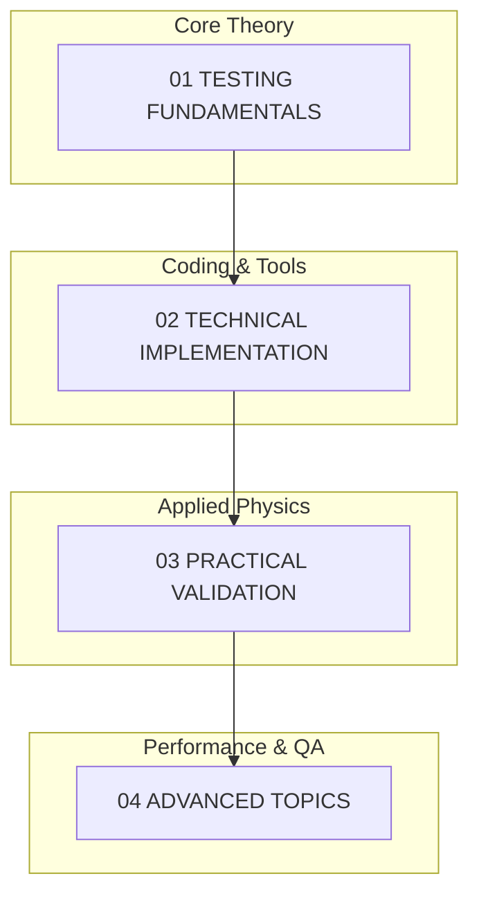

# 🧪 Module 08: การทดสอบและการตรวจสอบความถูกต้อง (Testing and Validation)

## รายละเอียดโมดูล (Module Overview)

โมดูลนี้มุ่งเน้นที่การสร้างความเชื่อถือได้ (Reliability) และความแม่นยำ (Accuracy) ให้กับแบบจำลอง CFD ใน OpenFOAM ผ่านกระบวนการทดสอบเชิงระบบ (Systematic Testing) และการตรวจสอบความถูกต้อง (Validation) ซึ่งเป็นทักษะสำคัญสำหรับทั้งนักวิจัยและวิศวกรที่ต้องการพัฒนา Solver หรือใช้งาน OpenFOAM ในระดับมืออาชีพ

### วัตถุประสงค์การเรียนรู้ (Learning Objectives)

- **ครอบครองกลยุทธ์การทดสอบแบบครบวงจร**: ตั้งแต่ Unit Testing ไปจนถึง Integration Testing และ Regression Testing
- **เชี่ยวชาญระเบียบวิธีการตรวจสอบความถูกต้อง**: การเปรียบเทียบผลลัพธ์เชิงตัวเลขกับผลเฉลยวิเคราะห์ (Analytical Solutions) และข้อมูลทดลอง (Experimental Data)
- **สร้างมาตรฐานการประกันคุณภาพ (QA)**: การเขียนโค้ดตามมาตรฐาน, การทำ Code Review และการจัดทำเอกสารการทดสอบ
- **การนำ CI/CD มาใช้ในงาน CFD**: การสร้าง Automated Testing Pipelines เพื่อติดตามคุณภาพโค้ดอย่างต่อเนื่อง

---

## 🎓 ข้อกำหนดเบื้องต้น (Prerequisites)

เพื่อให้ได้รับประโยชน์สูงสุดจากโมดูลนี้ ผู้เรียนควรมีพื้นฐานดังนี้:

### 1. ความรู้ด้าน OpenFOAM พื้นฐาน
- เข้าใจโครงสร้าง Source Code ของ OpenFOAM และระบบการ Build ด้วย `wmake`
- มีประสบการณ์ในการพัฒนา Solver พื้นฐาน (Module 04) และการเขียนโปรแกรม C++ สำหรับ OpenFOAM
- เข้าใจการจัดการหน่วยความจำ (`autoPtr`, `tmp`) และพีชคณิตของฟิลด์

### 2. ทักษะทางเทคนิค (Technical Skills)
- **C++ Testing Frameworks**: คุ้นเคยกับแนวคิดของ Google Test หรือ Catch2
- **Software Engineering**: หลักการ SOLID และ Design Patterns เบื้องต้น
- **CI/CD Concepts**: เข้าใจแนวคิดของ GitHub Actions หรือ Jenkins (จะมีการขยายความในโมดูลนี้)
- **Numerical Methods**: เข้าใจความแตกต่างระหว่าง Verification (การตรวจสอบโค้ด) และ Validation (การตรวจสอบความถูกต้องทางฟิสิกส์)

---

## 🎯 ผลการเรียนรู้ (Learning Outcomes)

เมื่อสำเร็จการศึกษาในโมดูลนี้ คุณจะมีความสามารถดังนี้:

1. **การพัฒนาเฟรมเวิร์กการทดสอบ**: ออกแบบและนำ Unit Test ไปใช้กับ Solver และ Library ของ OpenFOAM ได้อย่างมีประสิทธิภาพ
2. **วิธีการ Validation**: สามารถทำ Grid Convergence Study (GCI), Richardson Extrapolation และ MMS (Method of Manufactured Solutions) ได้
3. **การประกันคุณภาพ**: นำกระบวนการ Code Review และ Performance Profiling มาใช้เพื่อเพิ่มประสิทธิภาพของโค้ด
4. **การทำงานอัตโนมัติ**: สร้าง Pipeline สำหรับการทดสอบอัตโนมัติ (Automated Regression Testing) เพื่อป้องกันข้อผิดพลาดที่อาจเกิดขึ้นจากการแก้ไขโค้ดในอนาคต

---

## 🗺️ แผนผังการเรียนรู้ (Module Roadmap)

![[v_model_cfd_validation.png]]
`A 2.5D 'V-Model' diagram for CFD Verification and Validation. The left side of the 'V' descends from 'Physical Reality' to 'Mathematical Model' to 'Discretized Code'. The right side ascends from 'Numerical Results' to 'Verification' (code check) to 'Validation' (physics check). Clear arrows show the flow and horizontal dashed lines connect corresponding stages (e.g., Comparing Results to Reality). Scientific textbook diagram, clean vector line art, white background, high definition, flat design, educational infographic --ar 16:9`

1.  **01_TESTING_FUNDAMENTALS**: พื้นฐาน แนวคิด และสถาปัตยกรรมระบบทดสอบของ OpenFOAM
2.  **02_TECHNICAL_IMPLEMENTATION**: เจาะลึกการเขียนโค้ดสำหรับ Unit Testing และ Validation Framework
3.  **03_PRACTICAL_VALIDATION**: แนวทางปฏิบัติที่ดีที่สุด (Best Practices) ในการตรวจสอบความถูกต้องของ Mesh และ Boundary Conditions
4.  **04_ADVANCED_TOPICS**: การวิเคราะห์ประสิทธิภาพ (Profiling), การทดสอบ Regression และการดีบักขั้นสูง