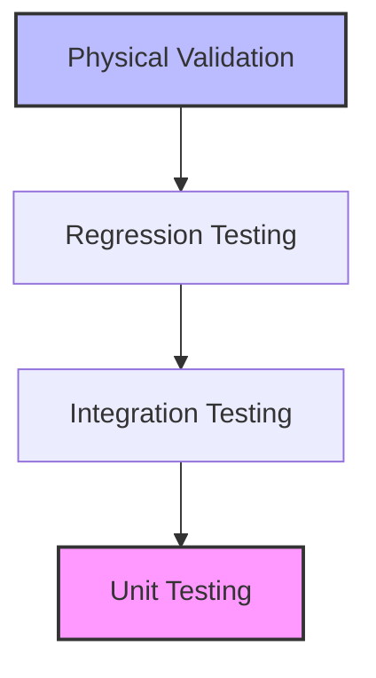
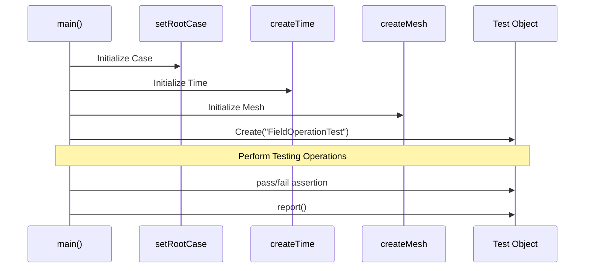

# 01 บทนำสู่การทดสอบและการตรวจสอบความถูกต้องใน OpenFOAM

การทดสอบและการตรวจสอบความถูกต้อง (Testing and Validation) เป็นกระบวนการที่แยกไม่ออกจากวัฏจักรการพัฒนาซอฟต์แวร์ CFD ใน OpenFOAM เพื่อให้มั่นใจว่าผลลัพธ์ที่ได้จากการจำลองมีความน่าเชื่อถือและสามารถทำซ้ำได้

## 1.1 ปรัชญาการทดสอบ (Testing Philosophy)

OpenFOAM ใช้แนวทางการทดสอบหลายชั้น (Multi-layered testing approach) เพื่อครอบคลุมความเสี่ยงในทุกระดับ:



-   **การทดสอบหน่วย (Unit Testing)**: มุ่งเน้นการตรวจสอบคอมโพเนนต์ที่เล็กที่สุด เช่น ฟังก์ชันทางคณิตศาสตร์, คลาสพื้นฐาน หรือการดำเนินการกับฟิลด์ (Field Operations)
-   **การทดสอบการผสมผสาน (Integration Testing)**: ตรวจสอบความถูกต้องเมื่อนำคอมโพเนนต์หลายอย่างมาทำงานร่วมกัน เช่น การเชื่อมโยงระหว่าง Solver กับ Turbulence Model
-   **การทดสอบถอยหลัง (Regression Testing)**: การรันชุดการทดสอบซ้ำทุกครั้งที่มีการแก้ไขโค้ด เพื่อให้มั่นใจว่าฟีเจอร์เดิมยังทำงานถูกต้องและไม่มีบั๊กใหม่เกิดขึ้น
-   **การตรวจสอบความถูกต้องทางกายภาพ (Physical Validation)**: การเปรียบเทียบผลลัพธ์กับข้อมูลจริง เพื่อยืนยันว่าโมเดลทางคณิตศาสตร์สะท้อนฟิสิกส์ได้อย่างถูกต้อง

> **สูตรความเชื่อถือได้**:
> $$\text{ความแม่นยำทางตัวเลข} + \text{ความถูกต้องของโค้ด} + \text{ความสอดคล้องทางกายภาพ} = \text{CFD ที่เชื่อถือได้}$$

![[cfd_reliability_foundation.png]]
`A 2.5D conceptual diagram showing three solid pillars (Numerical Accuracy, Code Correctness, Physical Consistency) supporting a heavy slab labeled 'Reliable CFD'. Each pillar has technical annotations and LaTeX symbols like \nabla and \int embedded. Scientific textbook diagram, clean vector line art, white background, high definition, flat design, educational infographic --ar 16:9`

---

## 1.2 โครงสร้างชุดการทดสอบของ OpenFOAM

ชุดการทดสอบมาตรฐานของ OpenFOAM ถูกจัดเก็บไว้อย่างเป็นระบบในไดเรกทอรี `applications/test/` ซึ่งประกอบด้วยหมวดหมู่ดังนี้:

```text
applications/test/
├── Basic/                    # การดำเนินการพื้นฐานของ OpenFOAM
├── Matrix/                  # การดำเนินการเมทริกซ์และ Linear Solver
├── Mesh/                    # การสร้างและจัดการ Mesh
├── FiniteVolume/            # การ Discretization และการดำเนินการของ FVM
├── Parallel/                # การทดสอบการประมวลผลแบบขนาน
└── Utilities/               # การทดสอบฟังก์ชัน Utility
```

### เทมเพลตกรณีศึกษาการทดสอบ (Test Template) 

โค้ดการทดสอบใน OpenFOAM มักเขียนในรูปแบบ C++ ที่เรียกใช้ไลบรารีพื้นฐานของ OpenFOAM:



```cpp
#include "fvCFD.H"
#include "Test.H"

int main(int argc, char *argv[])
{
    #include "setRootCase.H"
    #include "createTime.H"
    #include "createMesh.H"

    // เริ่มต้นการทดสอบ
    Test test = Test("FieldOperationTest");

    // ตัวอย่างการสร้างฟิลด์เพื่อทดสอบ
    volScalarField T
    (
        IOobject("T", runTime.timeName(), mesh, IOobject::NO_READ),
        mesh,
        dimensionedScalar("T", dimTemperature, 300.0)
    );

    // ตรวจสอบความถูกต้อง
    test.pass("Field T created with correct dimensions and value");

    // รายงานผล
    test.report();

    return 0;
}
```

---

## 1.3 ประเภทของการยืนยันผล (Validation Mechanisms)

ในการทดสอบ OpenFOAM เรามักใช้กลไกการตรวจสอบ 3 รูปแบบหลัก:

1.  **การตรวจสอบโดยตรง (Direct Check)**: เปรียบเทียบค่าที่ได้กับค่าคงที่หรือผลเฉลยเชิงวิเคราะห์
    ```cpp
    scalar error = mag(computedValue - analyticalSolution);
    test.check(error < 1e-10, "Accuracy check");
    ```
2.  **การตรวจสอบการอนุรักษ์ (Conservation Check)**: ยืนยันว่ากฎการอนุรักษ์ (มวล, พลังงาน) ยังคงเป็นจริง

![[mass_conservation_control_volume.png]]
`A 2.5D diagram of a single cubic control volume with fluid entering from the left and exiting from the right and top faces. Blue arrows represent velocity vectors 'U'. Text annotations show the summation of mass fluxes (rho * U * A) at each face. A balance equation sum(m_dot) = 0 is displayed next to the cube. Scientific textbook diagram, clean vector line art, white background, high definition, flat design, educational infographic --ar 16:9`

    ```cpp
    scalar massError = mag(massIn - massOut) / mag(massIn);
    test.check(massError < 1e-12, "Mass conservation check");
    ```
3.  **การตรวจสอบการลู่เข้า (Convergence Check)**: ติดตามค่า Residual ของ Matrix Solver
    ```cpp
    test.check(residual < convergenceLimit, "Solution convergence check");
    ```