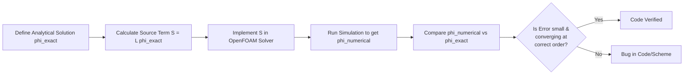

# 02 วิธีการตรวจสอบทางตัวเลข (Numerical Verification Methods)

การตรวจสอบทางตัวเลข (Numerical Verification) มีวัตถุประสงค์เพื่อยืนยันว่าอัลกอริทึมและรูปแบบเชิงตัวเลข (Numerical Schemes) ถูกนำไปใช้อย่างถูกต้องในโค้ด และให้ความแม่นยำตามที่ทฤษฎีระบุไว้

## 2.1 วิธีการผลิตผลเฉลย (Method of Manufactured Solutions - MMS)

MMS เป็นวิธีที่ทรงพลังที่สุดในการตรวจสอบว่าโค้ดมีการคำนวณที่ถูกต้องหรือไม่ โดยเฉพาะเมื่อเราไม่มีผลเฉลยเชิงวิเคราะห์สำหรับปัญหาจริง



### ขั้นตอนการทำ MMS:
1.  **กำหนดผลเฉลยสมมติ ($\\phi_{exact}$)**: เลือกฟังก์ชันคณิตศาสตร์ที่ต่อเนื่องและหาอนุพันธ์ได้ เช่น $\\phi = \\sin(x)\\\cos(y)$
2.  **คำนวณ Source Term ($S$)**: นำ $\\phi_{exact}$ ไปแทนในสมการเชิงอนุพันธ์เพื่อหา Source Term ที่ทำให้สมการเป็นจริง
3.  **รันการจำลอง**: แก้สมการใน OpenFOAM โดยเพิ่ม Source Term $S$ เข้าไป
4.  **เปรียบเทียบ**: ตรวจสอบว่า $\\phi_{numerical}$ ที่ได้จากการจำลองตรงกับ $\\phi_{exact}$ ที่เราตั้งไว้หรือไม่

### ตัวอย่างโค้ด MMS ใน OpenFOAM:
```cpp
// กำหนดฟังก์ชันเชิงวิเคราะห์
forAll(mesh.C(), celli)
{
    scalar x = mesh.C()[celli].x();
    phiExact[celli] = Foam::sin(x);
}

// คำนวณ Source Term ที่ต้องเติมในสมการ
volScalarField S = -D * fvc::laplacian(phiExact); 

// แก้สมการด้วย Source Term
solve(fvm::laplacian(D, phi) == S);
```

---

## 2.2 การศึกษาการลู่เข้าของกริด (Grid Convergence Study)

การศึกษาการลู่เข้าของกริดใช้เพื่อประเมิน **ลำดับของความแม่นยำ (Order of Accuracy)** และยืนยันว่าผลลัพธ์ไม่ขึ้นกับความละเอียดของเมช (Mesh Independence)

![[grid_refinement_levels.png]]
`A side-by-side comparison of three computational meshes for the same airfoil geometry: Coarse (large cells), Medium, and Fine (dense cells). Red arrows indicate the direction of refinement. Below the meshes, a grid convergence plot shows a physical quantity (e.g., Drag Coefficient) approaching an asymptotic value as mesh density increases. Scientific textbook diagram, clean vector line art, white background, high definition, flat design, educational infographic --ar 16:9`

### 2.2.1 การสกัดพิสัยของ Richardson (Richardson Extrapolation)
ใช้เพื่อประมาณผลเฉลยที่แม่นยำที่สุด ($f_{exact}$) จากเมชที่มีความละเอียดต่างกัน:

$$f_{exact} \\approx f_h + \\frac{f_h - f_{2h}}{r^p - 1} $$

โดยที่:
- $f_h$: ผลเฉลยบนเมชละเอียด
- $f_{2h}$: ผลเฉลยบนเมชหยาบ ($2 \\times$ coarser)
- $r$: อัตราส่วนการปรับเมช (Refinement Ratio, $h_{coarse}/h_{fine}$)
- $p$: ลำดับของความแม่นยำ (Order of Accuracy)

### 2.2.2 ดัชนีการลู่เข้าของกริด (Grid Convergence Index - GCI)
GCI เป็นตัวชี้วัดความไม่แน่นอนเนื่องจากการ Discretization ที่ได้รับการยอมรับในระดับสากล (ASME):

$$GCI_{12} = \\frac{1.25 |\\varepsilon_{12}|}{r^p - 1} $$

โดยที่ $\\varepsilon_{12}$ คือความคลาดเคลื่อนสัมพัทธ์ระหว่างเมชละเอียดและเมชกลาง

---

## 2.3 การตรวจสอบรหัสต่อรหัส (Code-to-Code Verification)

ในกรณีที่ไม่มีข้อมูลการทดลอง เราสามารถใช้การเปรียบเทียบกับซอฟต์แวร์ CFD อื่นๆ ที่ได้รับการยอมรับแล้ว (เช่น Ansys Fluent, STAR-CCM+) เพื่อยืนยันความถูกต้อง

### กรณีศึกษามาตรฐาน (Benchmarks):

![[cfd_benchmarks_overview.png]]
`A multi-panel diagram showing four classic CFD benchmark cases: 1) Lid-Driven Cavity (square with a rotating top), 2) Backward-Facing Step (expansion flow), 3) Flow past a cylinder (vortex shedding), and 4) T-junction mixing. Each panel includes streamline visualizations and labels for key physics being verified. Scientific textbook diagram, clean vector line art, white background, high definition, flat design, educational infographic --ar 16:9`

-   **Lid-Driven Cavity**: ใช้ตรวจสอบสมการ Navier-Stokes ในโดเมนปิด
-   **Backward-Facing Step**: ใช้ตรวจสอบการแยกตัวของไหล (Flow Separation)
-   **Flow Past Cylinder**: ใช้ตรวจสอบแรงลาก (Drag) และแรงยก (Lift) รวมถึงการหลุดออกของ Vortex (Vortex Shedding)

```