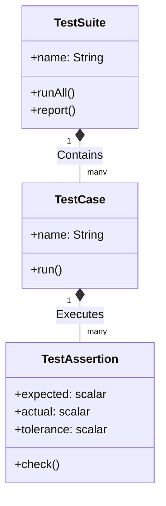
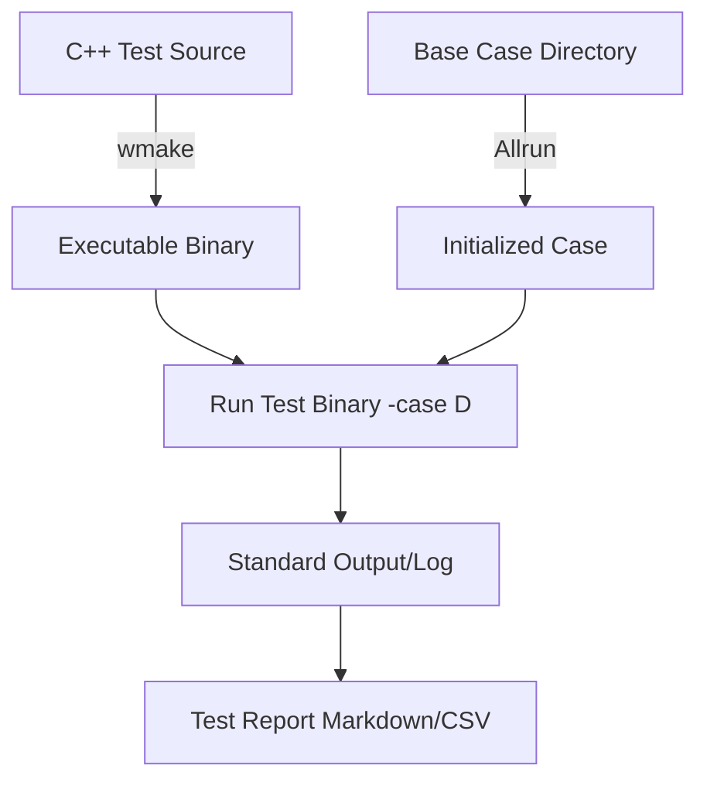

# 03 สถาปัตยกรรมระบบทดสอบของ OpenFOAM (Test System Architecture)

การทำความเข้าใจโครงสร้างพื้นฐานของระบบทดสอบจะช่วยให้นักพัฒนาสามารถเขียนการทดสอบที่ทำงานร่วมกับไลบรารีของ OpenFOAM ได้อย่างมีประสิทธิภาพ

## 3.1 องค์ประกอบหลักของระบบทดสอบ

ระบบการทดสอบใน OpenFOAM มักประกอบด้วยโครงสร้าง 3 ระดับที่ซ้อนกัน:



1.  **TestAssertion**: หน่วยที่เล็กที่สุด ทำหน้าที่ตรวจสอบเงื่อนไขเฉพาะ (เช่น ค่า A เท่ากับ B หรือไม่) และเก็บข้อมูลความคลาดเคลื่อน (Tolerance)
2.  **TestCase**: กลุ่มของ Assertions ที่รวมกันเพื่อทดสอบฟีเจอร์หรือสถานการณ์หนึ่งๆ (เช่น การทดสอบ Boundary Condition แบบผนัง)
3.  **TestSuite**: คอลเลกชันของ Test Cases ทั้งหมดในโมดูลนั้นๆ ทำหน้าที่บริหารจัดการลำดับการทำงานและสรุปผลรายงาน

---

## 3.2 ไดเรกทอรีและโครงสร้างไฟล์

เมื่อเราสร้างชุดการทดสอบใหม่ ควรจัดระเบียบไฟล์ตามมาตรฐานของ OpenFOAM:

![[openfoam_test_directory_structure.png]]
`A clean folder hierarchy diagram for an OpenFOAM test suite. The root folder 'MySolverTest' branches into 'Make' (containing build files), 'tests' (containing C++ source files like fieldTest.C), and shell scripts 'Allwmake' and 'Allrun'. Icons represent different file types (code, script, folder). Scientific textbook diagram, clean vector line art, white background, high definition, flat design, educational infographic --ar 16:9`

```text
MySolverTest/
├── Make/                     # คำสั่งการคอมไพล์ (files, options)
├── Allwmake                  # สคริปต์คอมไพล์อัตโนมัติ
├── Allrun                    # สคริปต์รันการทดสอบ
├── tests/                    # โค้ด C++ สำหรับการทดสอบแต่ละกรณี
│   ├── fieldTest.C
│   ├── matrixTest.C
│   └── boundaryTest.C
└── TestSuite.C               # ไฟล์หลักที่เรียกใช้การทดสอบทั้งหมด
```

---

## 3.3 กระบวนการรันการทดสอบ (Execution Workflow)

กระบวนการจากโค้ดต้นฉบับไปสู่รายงานผลการทดสอบมีขั้นตอนดังนี้:



1.  **Compilation**: ใช้ `wmake` เพื่อเปลี่ยนโค้ด C++ ของการทดสอบให้เป็นไฟล์ปฏิบัติการ (Executable)
2.  **Setup**: เตรียมกรณีศึกษา (Case Directory) ที่มีเมชและฟิลด์เริ่มต้นสำหรับทดสอบ
3.  **Run**: รันไฟล์ Executable โดยระบุ Case (เช่น `./myTest -case validationCase`)
4.  **Reporting**: ระบบจะแสดงผลลัพธ์ว่ากรณีใด PASS หรือ FAIL ลงในไฟล์ Log หรือรายงาน Markdown

### ตัวอย่างการรันชุดการทดสอบมาตรฐาน
```bash
cd $WM_PROJECT_DIR/applications/test
./Alltest
```
สคริปต์ `Alltest` จะวนลูปผ่านทุกไดเรกทอรีใน `applications/test` เพื่อคอมไพล์และรันการทดสอบทั้งหมดของ OpenFOAM
