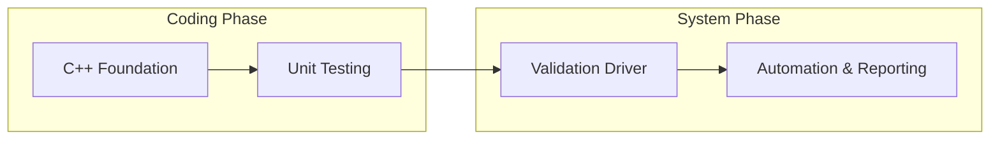

# 💻 การนำไปใช้งานทางเทคนิค (Technical Implementation)

โมดูลย่อยนี้มุ่งเน้นไปที่การนำความรู้เชิงทฤษฎีมาปรับใช้ในรูปแบบของโค้ด C++ เพื่อสร้างระบบการทดสอบที่ใช้งานได้จริงใน OpenFOAM

## วัตถุประสงค์ (Objectives)

- **ทำความเข้าใจ Framework การทดสอบ**: ศึกษาคลาสพื้นฐานและการออกแบบระบบ Assertion ใน OpenFOAM
- **พัฒนาการทดสอบหน่วย (Unit Testing)**: ฝึกเขียนโค้ดเพื่อตรวจสอบความถูกต้องของการดำเนินการกับฟิลด์ (Field Operations) และคณิตศาสตร์เชิงเวกเตอร์
- **การจัดการความคลาดเคลื่อน (Numerical Tolerance)**: เรียนรู้วิธีการเปรียบเทียบค่า Floating-point ในงาน CFD อย่างถูกต้อง
- **การทำงานอัตโนมัติ**: การสร้างระบบรันการทดสอบและสรุปรายงานผลแบบอัตโนมัติ

## หัวข้อที่ครอบคลุม (Topics)

1.  **01_Unit_Testing_Framework**: เจาะลึกโครงสร้าง C++ ของระบบ Assertion และ Test Cases
2.  **02_Validation_Framework_Coding**: การเขียนโปรแกรมเพื่อตรวจสอบความถูกต้องของ Solver และโมเดลทางฟิสิกส์
3.  **03_Automated_Execution**: เวิร์กโฟลว์การคอมไพล์และรันชุดการทดสอบขนาดใหญ่

---

## ผลลัพธ์ที่คาดหวัง (Expected Outcomes)

ผู้เรียนจะสามารถเขียนโค้ด C++ เพื่อสร้างชุดการทดสอบที่แข็งแกร่ง (Robust Test Suites) สำหรับ Solver ที่พัฒนาขึ้นเอง และสามารถระบุตำแหน่งของข้อผิดพลาดในโค้ดผ่านระบบรายงานผลการทดสอบที่ละเอียด
