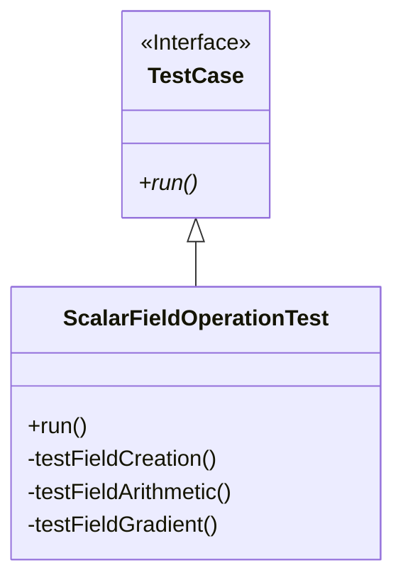

# 01 เฟรมเวิร์กการทดสอบหน่วย (Unit Testing Framework)

ในส่วนนี้เราจะเจาะลึกการนำระบบ Assertion ไปใช้งานในภาษา C++ เพื่อรองรับความต้องการเฉพาะของงาน CFD เช่น การจัดการความละเอียดเชิงตัวเลข (Numerical Precision)

## 1.1 ระบบ Assertion สำหรับ CFD

การเปรียบเทียบค่าในงาน CFD ไม่สามารถใช้ `==` ได้โดยตรงสำหรับค่า Floating-point เนื่องจากข้อจำกัดของคอมพิวเตอร์ ดังนั้นเราจึงต้องใช้ระบบ Assertion ที่รองรับ **Tolerance**

![[numerical_tolerance_concept.png]]
`A conceptual graph explaining Numerical Tolerance. It shows an 'Expected Value' as a central point, surrounded by a green 'Absolute Tolerance' band and a blue 'Relative Tolerance' band that scales with the value's magnitude. Points outside the bands are marked with a red 'X' (FAIL), and points inside are marked with a green checkmark (PASS). Scientific textbook diagram, clean vector line art, white background, high definition, flat design, educational infographic --ar 16:9`

### ประเภทของ Assertions ที่สำคัญ:
-   **EQUAL**: สำหรับค่า Integer หรือ Boolean
-   **CLOSE**: ตรวจสอบว่าค่าสองค่าใกล้เคียงกันภายในช่วง Absolute Tolerance ($|A - B| < \epsilon_{abs}$)
-   **CLOSE_RELATIVE**: ตรวจสอบโดยใช้ทั้ง Absolute และ Relative Tolerance ($|A - B| < \max(\epsilon_{abs}, \epsilon_{rel} \cdot |A|)$)

### ตัวอย่างการนำไปใช้งาน (C++ Implementation):
```cpp
void assertClose
(
    const std::string& name,
    const scalar& expected,
    const scalar& actual,
    double relativeTolerance = 1e-6,
    double absoluteTolerance = 1e-12
)
{
    scalar absDiff = Foam::mag(expected - actual);
    scalar relDiff = 0.0;

    if (Foam::mag(expected) > absoluteTolerance)
    {
        relDiff = absDiff / Foam::mag(expected);
    }

    bool passed = (absDiff <= absoluteTolerance) && (relDiff <= relativeTolerance);
    
    if (!passed)
    {
        Info<< "FAIL: " << name << " | Expected: " << expected 
            << " Actual: " << actual << " Error: " << absDiff << endl;
    }
}
```

---

## 1.2 การทดสอบการดำเนินการกับฟิลด์ (Field Operations)

หัวใจสำคัญของ OpenFOAM คือการดำเนินการกับ `volScalarField` และ `volVectorField` การเขียน Unit Test จะช่วยยืนยันว่าการคำนวณพื้นฐานยังถูกต้อง

![[gradient_test_verification.png]]
`A 2.5D diagram of a cubic computational domain. Inside, a scalar field 'T' is visualized as a smooth color gradient from blue (left) to red (right), representing T = 300 + 10x. Uniform black arrows (vectors) point steadily from left to right, labeled 'grad(T) = [10, 0, 0]'. A circular callout shows a single cell with the calculated vector components. Scientific textbook diagram, clean vector line art, white background, high definition, flat design, educational infographic --ar 16:9`

### ตัวอย่าง: การทดสอบความถูกต้องของ Gradient
เราสามารถสร้าง Linear Distribution ที่เราทราบค่า Gradient ที่แน่นอน เพื่อนำมาตรวจสอบ:

```cpp
void testFieldGradient()
{
    // 1. สร้าง Linear Field: T = 300 + 10x
    forAll(T, cellI)
    {
        const vector& cellC = mesh.C()[cellI];
        T[cellI] = 300.0 + 10.0 * cellC.x();
    }

    // 2. คำนวณ Gradient ด้วย fvc::grad
    volVectorField gradT = fvc::grad(T);

    // 3. ตรวจสอบว่าผลลัพธ์เป็น [10, 0, 0] หรือไม่
    assertClose("gradT_x", 10.0, gradT[0].x());
    assertClose("gradT_y", 0.0, gradT[0].y());
    assertClose("gradT_z", 0.0, gradT[0].z());
}
```

---

## 1.3 การจัดระเบียบ Test Case

การรวม Assertions เข้าด้วยกันในรูปแบบคลาสจะช่วยให้การจัดการการทดสอบทำได้ง่ายขึ้น:



```cpp
class ScalarFieldOperationTest : public TestCase
{
public:
    virtual void run() override
    {
        testFieldCreation();
        testFieldArithmetic();
        testFieldGradient();
    }
};
```

### แนวทางปฏิบัติที่ดี (Best Practices):
1.  **Isolation**: แต่ละการทดสอบควรเป็นอิสระต่อกัน ไม่ใช้ข้อมูลร่วมกันที่อาจทำให้เกิดผลกระทบข้างเคียง
2.  **Meaningful Names**: ตั้งชื่อ Assertion ให้สื่อความหมายเพื่อให้รู้ทันทีว่าส่วนไหนผิดเมื่อการทดสอบ FAIL
3.  **Appropriate Tolerance**: เลือกค่า Tolerance ที่เหมาะสมกับความละเอียดของงาน (เช่น $10^{-6}$ สำหรับความถูกต้องทั่วไป และ $10^{-12}$ สำหรับฟังก์ชันคณิตศาสตร์พื้นฐาน)