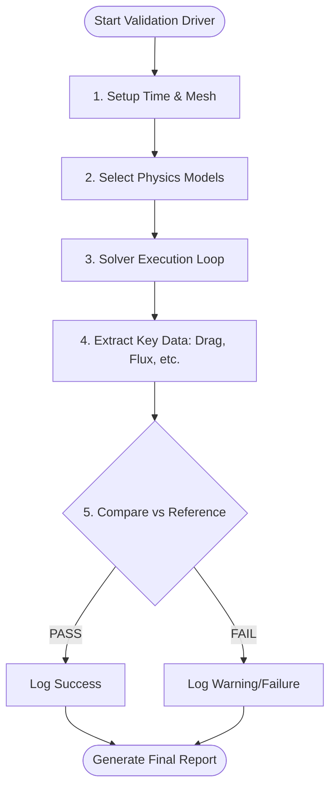

# 02 การเขียนโปรแกรมสำหรับเฟรมเวิร์กการตรวจสอบความถูกต้อง (Validation Framework Coding)

การตรวจสอบความถูกต้อง (Validation) ในระดับระบบต้องการโครงสร้างที่ซับซ้อนกว่าการทดสอบหน่วย เนื่องจากต้องมีการจัดการกับรันไทม์ (Runtime), เมช (Mesh) และไฟล์กรณีศึกษา (Case Files)

## 2.1 สถาปัตยกรรมของ Validation Solver

ในการตรวจสอบความถูกต้องของ Solver เรามักจะเขียนเครื่องมือเฉพาะ (Validation Driver) เพื่อรัน Solver ในสถานการณ์ที่ควบคุมได้



### องค์ประกอบหลักในโค้ด Validation:
1.  **Environment Setup**: การเตรียมอ็อบเจกต์ `Time` และ `fvMesh`
2.  **Model Selection**: การเลือก Turbulence Model หรือ Thermophysical Model ที่จะทดสอบ
3.  **Solver Execution**: การเรียกใช้ลูปการคำนวณ (Iterative Loop)
4.  **Data Extraction**: การสกัดข้อมูลสำคัญ เช่น Drag Coefficient หรือ Average Velocity
5.  **Comparison Logic**: การเปรียบเทียบข้อมูลที่สกัดได้กับค่าอ้างอิง

### ตัวอย่าง: Validation Driver สำหรับความร้อน (Heat Transfer)
```cpp
// การตรวจสอบการอนุรักษ์พลังงาน (Energy Balance)
scalar massFluxIn = ...;
scalar massFluxOut = ...;
scalar heatIn = ...;
scalar heatOut = ...;

scalar energyError = mag(heatIn - heatOut) / mag(heatIn);

// บันทึกผลการตรวจสอบลงในรายงาน
test.check(energyError < 0.01, "Global energy balance (within 1%)");
```

---

## 2.2 การจัดการกรณีศึกษาการทดสอบ (Handling Test Cases)

เพื่อให้การตรวจสอบความถูกต้องทำได้ซ้ำได้ (Reproducible) เราต้องมีการจัดการไฟล์กรณีศึกษาอย่างเป็นระบบ:

![[automated_case_modification.png]]
`A diagram showing an 'Automation Script' interacting with OpenFOAM case files. The script is seen modifying the 'U' boundary condition in the '0/U' file and changing 'viscosity' in 'transportProperties'. Clear arrows show the flow from a Master Template to multiple derived test cases with different parameters. Scientific textbook diagram, clean vector line art, white background, high definition, flat design, educational infographic --ar 16:9`

-   **Base Case**: ไดเรกทอรี `0/`, `constant/`, `system/` ที่เป็นมาตรฐาน
-   **Automated Modification**: การใช้สคริปต์หรือฟังก์ชันใน C++ เพื่อปรับเปลี่ยนพารามิเตอร์ (เช่น เปลี่ยน Velocity ที่ Inlet) ก่อนรันการทดสอบ

### การเข้าถึงพารามิเตอร์จาก Dictionary:
```cpp
dictionary validationDict(IFstream("validationDict")());
scalar expectedDrag = validationDict.lookupOrDefault<scalar>("expectedDrag", 1.2);
```

---

## 2.3 การสร้างรายงานผลการทดสอบอัตโนมัติ

เฟรมเวิร์กที่ดีควรสร้างรายงานในรูปแบบที่มนุษย์อ่านได้ง่าย เช่น Markdown หรือ CSV เพื่อใช้ในการวิเคราะห์เชิงลึก

### ตัวอย่างการเขียนรายงานลงไฟล์:
```cpp
void generateReport(const std::string& filename)
{
    std::ofstream reportFile(filename);
    reportFile << "# Validation Report: Solver Stability" << endl;
    reportFile << "| Case | Result | Execution Time (ms) |" << endl;
    reportFile << "|------|--------|---------------------|" << endl;
    
    for (const auto& result : results_)
    {
        reportFile << "| " << result.caseName << " | " 
                   << (result.passed ? "PASS" : "FAIL") << " | "
                   << result.time << " |" << endl;
    }
}
```

การเขียนโปรแกรมในลักษณะนี้จะช่วยให้ทีมพัฒนาสามารถรันการตรวจสอบความถูกต้องนับร้อยกรณีได้โดยอัตโนมัติ ทุกครั้งที่มีการอัปเดตเวอร์ชันของซอฟต์แวร์