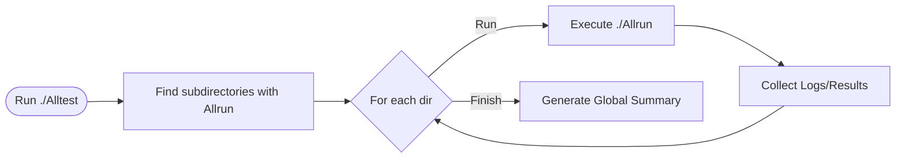
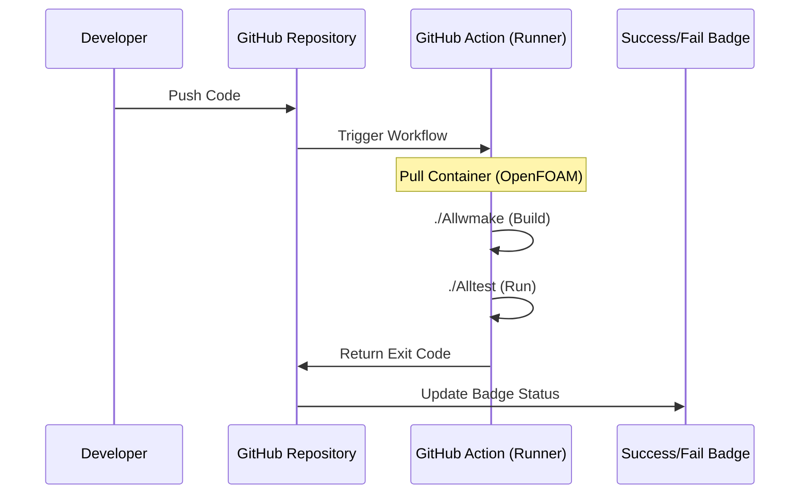

# 03 การดำเนินการทดสอบแบบอัตโนมัติ (Automated Execution)

เมื่อจำนวนการทดสอบเพิ่มขึ้น การรันด้วยมือจะไม่มีประสิทธิภาพและเสี่ยงต่อความผิดพลาด ดังนั้นเราจึงต้องใช้ระบบการทำงานอัตโนมัติ (Automation)

## 3.1 สคริปต์ควบคุมการทดสอบ (The `Alltest` Pattern)

OpenFOAM ใช้รูปแบบของสคริปต์ `Alltest` เพื่อรวบรวมและรันการทดสอบทั้งหมดในไดเรกทอรีเดียว



### ตัวอย่างโครงสร้างสคริปต์ `Alltest`:
```bash
#!/bin/bash
# 1. ค้นหาไดเรกทอรีย่อยทั้งหมดที่มี Allrun
testDirs=$(find . -maxdepth 2 -name "Allrun" -printf '%h\n')

# 2. วนลูปเพื่อรันการทดสอบ
for dir in $testDirs; do
    echo "Running test in $dir..."
    ( cd "$dir" && ./Allrun )
done

# 3. รวบรวมผลลัพธ์
./collectResults.sh
```

---

## 3.2 การบูรณาการกับระบบ CI/CD (GitHub Actions)

เราสามารถใช้ GitHub Actions เพื่อรันการทดสอบโดยอัตโนมัติทุกครั้งที่มีการ `push` โค้ดใหม่ขึ้นไปยัง repository



### ตัวอย่างไฟล์ Workflow (`.github/workflows/test.yml`):
```yaml
name: OpenFOAM CI

on: [push]

jobs:
  test:
    runs-on: ubuntu-latest
    container: openfoam/openfoam10-ubuntu20.04
    steps:
      - uses: actions/checkout@v2
      - name: Build
        run: ./Allwmake
      - name: Run Tests
        run: |
          source /usr/lib/openfoam/openfoam10/etc/bashrc
          ./Alltest
```

---

## 3.3 การจัดการชุดข้อมูลการทดสอบ (Test Data Management)

การทดสอบที่มีประสิทธิภาพต้องการการจัดการข้อมูลที่มีความเสถียร:

![[test_data_lifecycle.png]]
`A diagram showing the lifecycle of test data: 1) Pre-generated mesh loading, 2) Reference value comparison, 3) Automated cleanup of transient time directories. Icons for 'Database', 'Checkmark', and 'Trash Bin' are used to represent these stages. Scientific textbook diagram, clean vector line art, white background, high definition, flat design, educational infographic --ar 16:9`

1.  **Standardized Meshes**: ใช้เมชที่สร้างไว้ล่วงหน้า (Pre-generated) เพื่อลดเวลาและตัวแปรในการทดสอบ
2.  **Reference Values**: เก็บค่าอ้างอิงไว้ในไฟล์แยกต่างหาก (เช่น `validationData.json` หรือ `dictionary`) เพื่อใช้ในการเปรียบเทียบ
3.  **Cleanup**: สคริปต์ควรทำความสะอาดไฟล์ชั่วคราว (Temporary Files) หลังจากทดสอบเสร็จสิ้นเพื่อประหยัดพื้นที่ดิสก์

### การตรวจสอบความสำเร็จ (Pass/Fail Criteria):
ระบบอัตโนมัติควรสรุปผลเป็น Exit Code:
-   **Exit 0**: การทดสอบทั้งหมดผ่าน
-   **Exit 1**: มีการทดสอบอย่างน้อยหนึ่งรายการล้มเหลว

สิ่งนี้จะช่วยให้ระบบ CI/CD สามารถตัดสินใจได้ว่าจะยอมรับ (Merge) โค้ดใหม่หรือไม่

