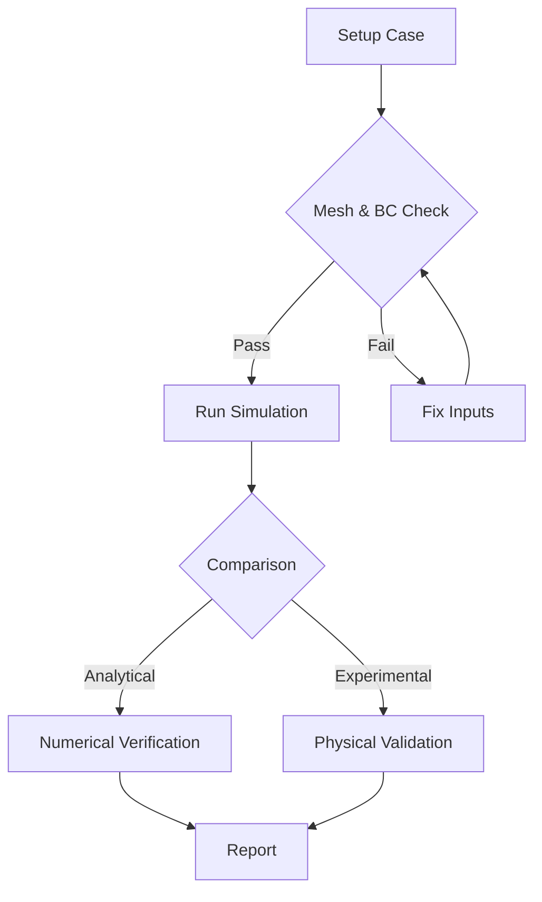

# 🧪 แนวทางปฏิบัติในการตรวจสอบความถูกต้อง (Practical Validation Practices)

ส่วนนี้มุ่งเน้นไปที่การนำระเบียบวิธีการตรวจสอบความถูกต้องมาใช้กับปัญหาในโลกแห่งความเป็นจริง โดยครอบคลุมถึงแนวทางปฏิบัติที่ดีที่สุดเพื่อให้ได้ผลลัพธ์ที่น่าเชื่อถือ

## วัตถุประสงค์ (Objectives)

- **เรียนรู้แนวทางปฏิบัติที่ดีที่สุด (Best Practices)**: ศึกษาหลักการออกแบบการทดสอบ CFD ที่มีประสิทธิภาพ
- **การตรวจสอบเมชและเงื่อนไขขอบเขต**: เน้นการทดสอบองค์ประกอบพื้นฐานที่ส่งผลต่อคุณภาพของโซลูชัน
- **การเปรียบเทียบกับข้อมูลจริง**: วิธีการจับคู่พารามิเตอร์การจำลองกับข้อมูลจากการทดลองหรือทฤษฎี
- **ความสามารถในการทำซ้ำ (Reproducibility)**: สร้างมาตรฐานเพื่อให้การทดสอบให้ผลลัพธ์เดิมทุกครั้ง

## หัวข้อที่ครอบคลุม (Topics)

1.  **01_Physical_Validation_Methods**: การเปรียบเทียบกับผลเฉลยเชิงวิเคราะห์และข้อมูลการทดลอง
2.  **02_Best_Practices_for_CFD_Tests**: หลักการออกแบบการทดสอบ เช่น Isolation และ Reproducibility
3.  **03_Mesh_and_BC_Testing**: การตรวจสอบคุณภาพเมชและความสอดคล้องของเงื่อนไขขอบเขต

---

## ผลลัพธ์ที่คาดหวัง (Expected Outcomes)

ผู้เรียนจะสามารถออกแบบและดำเนินการตรวจสอบความถูกต้องของแบบจำลอง CFD ได้อย่างเป็นระบบ ลดความไม่แน่นอนในผลลัพธ์ และสามารถพิสูจน์ความถูกต้องของงานวิจัยหรือโครงการวิศวกรรมต่อสาธารณะหรือผู้ตรวจประเมินได้
