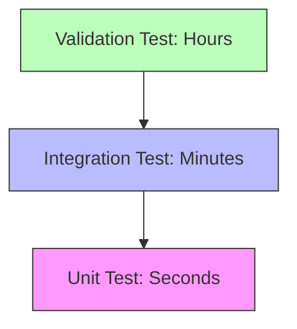

# 02 แนวทางปฏิบัติที่ดีที่สุดสำหรับการทดสอบ CFD (Best Practices)

เพื่อให้การทดสอบ CFD มีประสิทธิภาพและเชื่อถือได้ เราควรยึดถือหลักการออกแบบซอฟต์แวร์ควบคู่ไปกับหลักการทางฟิสิกส์

## 2.1 หลักการออกแบบการทดสอบ (Design Principles)

### 1. การแยกส่วน (Isolation)
แต่ละการทดสอบควรเป็นอิสระต่อกันโดยสมบูรณ์

![[test_isolation_clean_slate.png]]
`A diagram illustrating the 'Clean Slate' principle. On the left, multiple tests are shown trying to access a shared, messy database (FAIL). On the right, each test has its own isolated, pure-white box containing only the necessary mesh and parameters, ensuring no cross-contamination of results. Scientific textbook diagram, clean vector line art, white background, high definition, flat design, educational infographic --ar 16:9`

-   **No Shared State**: หลีกเลี่ยงการใช้ตัวแปร Global ที่อาจถูกแก้ไขโดยการทดสอบอื่น
-   **Clean Slate**: สร้างอ็อบเจกต์ใหม่สำหรับทุกกรณีทดสอบ และลบไฟล์ชั่วคราวทิ้งเสมอหลังจากทดสอบเสร็จ

### 2. ความสามารถในการผลิตซ้ำ (Reproducibility)
การทดสอบต้องให้ผลลัพธ์เดิมทุกครั้งที่รัน
-   **Fixed Random Seeds**: หากใช้อัลกอริทึมที่ต้องมีการสุ่ม ให้ระบุค่า Seed ตายตัว
-   **Deterministic Algorithms**: หลีกเลี่ยงฟังก์ชันที่มีพฤติกรรมไม่แน่นอน (Non-deterministic)

### 3. ความครอบคลุม (Comprehensive Coverage)
การทดสอบควรครอบคลุมสถานการณ์ต่างๆ อย่างทั่วถึง:

![[cfd_test_coverage_scenarios.png]]
`A three-part diagram showing different test scenarios: 1) Normal Case (smooth flow over a cylinder), 2) Edge Case (extremely high Reynolds number with turbulent eddies), 3) Error Condition (highly distorted mesh with overlapping cells). Each is labeled with a status indicator (Green, Yellow, Red). Scientific textbook diagram, clean vector line art, white background, high definition, flat design, educational infographic --ar 16:9`

-   **Normal Cases**: สภาวะการทำงานปกติ
-   **Edge Cases**: สภาวะสุดขีด (เช่น $Re$ สูงมาก หรือเมชที่มีมุมแหลมจัด)
-   **Error Conditions**: การจัดการกับอินพุตที่ผิดรูปแบบ หรือคุณภาพเมชที่แย่

---

## 2.2 ระดับของการทดสอบ (Testing Levels)

เราควรแบ่งระดับการทดสอบตามความซับซ้อนและเวลาที่ใช้:



| ระดับ | ระยะเวลา | เป้าหมาย |
| :--- | :--- | :--- |
| **Unit Test** | วินาที | ฟังก์ชันย่อย, อัลกอริทึมพื้นฐาน |
| **Integration Test** | นาที | เวิร์กโฟลว์ของ Solver, การเชื่อมต่อโมดูล |
| **Validation Test** | ชั่วโมง | ความถูกต้องทางฟิสิกส์, กรณีศึกษาขนาดเต็ม |

---

## 2.3 การเขียนโค้ดการทดสอบที่แข็งแกร่ง (Robust Test Coding)

ใช้โครงสร้างการจัดการข้อผิดพลาด (Error Handling) เพื่อไม่ให้ระบบล่มเมื่อพบปัญหา:

```cpp
try {
    Info<< "Testing solver convergence..." << endl;
    bool converged = solver.solve();
    
    if (!converged) {
        result.errorMessage = "Solver failed to converge";
        return result;
    }
} catch (const std::exception& e) {
    result.errorMessage = "Exception caught: " + string(e.what());
}
```

### การตั้งค่าความละเอียดเชิงตัวเลข (Numerical Tolerance)
-   ใช้ **Relative Tolerance** สำหรับค่าที่มีขนาดต่างกันมาก (เช่น ความดัน)
-   ใช้ **Absolute Tolerance** สำหรับค่าที่ควรเป็นศูนย์ (เช่น Divergence ของความเร็วในการไหลที่ลู่เข้าแล้ว)

การปฏิบัติตามแนวทางเหล่านี้จะช่วยลด "False Positives" (การทดสอบผ่านทั้งที่มีบั๊ก) และ "False Negatives" (การทดสอบตกทั้งที่โค้ดถูกต้อง) ในระบบของคุณ