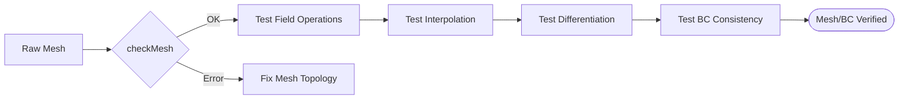

# 03 การตรวจสอบเมชและเงื่อนไขขอบเขต (Mesh and BC Testing)

เมช (Mesh) และเงื่อนไขขอบเขต (Boundary Conditions) คือรากฐานของความเสถียรและความแม่นยำใน CFD การทดสอบทั้งสองส่วนนี้จึงมีความสำคัญอย่างยิ่ง

## 3.1 การตรวจสอบคุณภาพเมช (Mesh Quality Validation)

ก่อนรัน Solver เราต้องมั่นใจว่าเมชมีคุณภาพเพียงพอที่จะไม่ทำให้การคำนวณแยกตัว (Diverge)

![[mesh_quality_metrics_visual.png]]
`A diagram illustrating three key mesh quality metrics: 1) Non-orthogonality (angle between cell center vector and face normal), 2) Skewness (distance between face intersection and face center), 3) Aspect Ratio (length vs width of a cell). Each metric is shown with a clear 'Good' vs 'Bad' example. Scientific textbook diagram, clean vector line art, white background, high definition, flat design, educational infographic --ar 16:9`

### ตัวชี้วัดคุณภาพที่ต้องตรวจสอบ:
1.  **Non-orthogonality**: ความไม่ตั้งฉากของหน้าเซลล์ (ควร < 70 องศา)
2.  **Skewness**: ความเบ้ของเซลล์
3.  **Aspect Ratio**: อัตราส่วนความยาวต่อความกว้าง (ไม่ควรสูงเกินไปในบริเวณที่มี Gradient สูง)
4.  **Negative Volumes**: ตรวจสอบว่าไม่มีเซลล์ที่มีปริมาตรติดลบ

### โค้ดตรวจสอบอัตโนมัติ:
```cpp
bool validateMeshQuality(const fvMesh& mesh)
{
    if (!mesh.checkMesh(true)) {
        Info<< "FAIL: Basic mesh validation failed" << endl;
        return false;
    }

    const volScalarField& cellVolumes = mesh.V();
    if (min(cellVolumes).value() <= 0) {
        Info<< "FAIL: Negative cell volume detected" << endl;
        return false;
    }
    
    return true;
}
```

---

## 3.2 การตรวจสอบเงื่อนไขขอบเขต (Boundary Condition Validation)

เราต้องยืนยันว่าเงื่อนไขขอบเขตที่นำมาใช้ทำงานได้ตามฟิสิกส์ที่กำหนด

![[bc_consistency_types.png]]
`A comparative diagram of Boundary Conditions. Left panel: 'Fixed Value' shows a constant value at the boundary face. Right panel: 'Zero Gradient' shows the boundary face value mirroring the internal cell value. Arrows indicate the 'reflection' of the internal value to the boundary. Scientific textbook diagram, clean vector line art, white background, high definition, flat design, educational infographic --ar 16:9`

### วิธีการตรวจสอบ BC:
-   **Value Consistency**: สำหรับ `fixedValue` ตรวจสอบว่าค่าที่ขอบเขตตรงกับที่ตั้งไว้ตลอดเวลาหรือไม่
-   **Gradient Consistency**: สำหรับ `zeroGradient` ตรวจสอบว่าค่าที่หน้าขอบเขตเท่ากับค่าในเซลล์ข้างเคียงหรือไม่
-   **Physical Coupling**: สำหรับขอบเขตที่ผนัง (Wall) ความเร็วควรเป็นศูนย์ (No-slip) และอุณหภูมิควรสอดคล้องกับโมเดลความร้อน

### ตัวอย่างการตรวจสอบ ZeroGradient:
```cpp
scalar maxDiff = 0;
forAll(patchValues, facei) {
    scalar diff = mag(patchValues[facei] - internalField[faceCells[facei]]);
    maxDiff = max(maxDiff, diff);
}

if (maxDiff > 1e-10) {
    Info<< "FAIL: ZeroGradient BC inconsistency" << endl;
}
```

---

## 3.3 การทดสอบการดำเนินการของเมช (Mesh Operations)

นอกจากคุณภาพแล้ว เรายังต้องทดสอบว่าการคำนวณพื้นฐานบนเมชทำงานถูกต้อง:



-   **Interpolation**: การส่งผ่านข้อมูลจากจุดศูนย์กลางเซลล์ (Cell Centre) ไปยังหน้าเซลล์ (Face)
-   **Differentiation**: การหาค่า Gradient ($\nabla$) และ Laplacian ($\nabla^2$) บนเมชที่กำหนด

การมีชุดการทดสอบสำหรับ Mesh และ BC จะช่วยให้เราแยกแยะปัญหาได้ง่ายขึ้นว่า ความผิดพลาดเกิดจาก "ตัว Solver" หรือเกิดจาก "ข้อมูลอินพุต (Mesh/BC)"

```