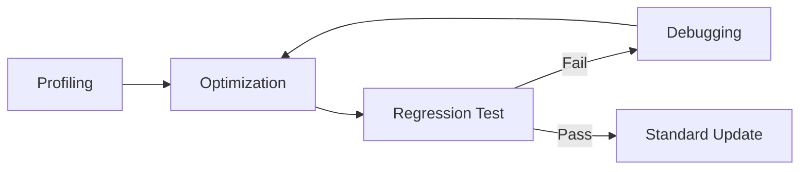

# 🚀 หัวข้อขั้นสูง (Advanced Topics)

โมดูลสุดท้ายนี้ครอบคลุมเทคนิคระดับสูงที่จะช่วยยกระดับการพัฒนา OpenFOAM ไปสู่มาตรฐานสากล ทั้งในด้านประสิทธิภาพและการจัดการระบบขนาดใหญ่

## วัตถุประสงค์ (Objectives)

- **วิเคราะห์ประสิทธิภาพ (Performance Analysis)**: เรียนรู้วิธีการวัดความเร็วและการใช้ทรัพยากรของโค้ด
- **การทดสอบถอยหลัง (Regression Testing)**: การสร้างระบบตรวจสอบการเปลี่ยนแปลงของผลลัพธ์เมื่อมีการอัปเดตโค้ด
- **การดีบักเชิงลึก (Deep Debugging)**: เทคนิคการหาสาเหตุของปัญหาการแยกตัว (Divergence) และข้อผิดพลาดการอนุรักษ์
- **แนวโน้มในอนาคต**: ศึกษาการทดสอบบนคลาวด์และการใช้ Machine Learning เข้ามาช่วยในงาน V&V

## หัวข้อที่ครอบคลุม (Topics)

1.  **01_Performance_Analysis**: การวัด Scaling (Strong/Weak) และการ Profiling หน่วยความจำ
2.  **02_Regression_Testing**: กรอบการทำงานสำหรับการทดสอบความเสถียรของผลลัพธ์ในระยะยาว
3.  **03_Debugging_and_Troubleshooting**: วิธีการแก้ปัญหาทั่วไปที่พบในการทดสอบและตรวจสอบความถูกต้อง

---

## ผลลัพธ์ที่คาดหวัง (Expected Outcomes)

ผู้เรียนจะมีความเข้าใจในวงจรการประกันคุณภาพ (Quality Assurance) อย่างครบถ้วน สามารถเพิ่มประสิทธิภาพการคำนวณของ Solver และสร้างระบบที่รองรับการพัฒนาอย่างต่อเนื่อง (Continuous Development) ได้อย่างมั่นคง
