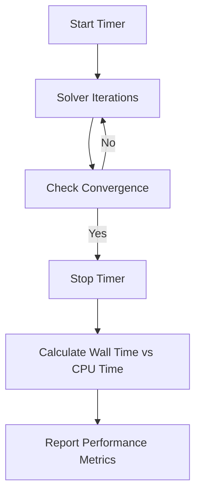

# 01 การวิเคราะห์ประสิทธิภาพการคำนวณ (Performance Analysis)

ในงาน CFD ระดับอุตสาหกรรม "ความถูกต้อง" เพียงอย่างเดียวไม่พอ "ความเร็ว" และ "การใช้ทรัพยากร" ก็มีความสำคัญอย่างยิ่ง

## 1.1 เมตริกประสิทธิภาพหลัก (Performance Metrics)

-   **Execution Time (Wall Time)**: เวลาที่ใช้จริงในการคำนวณจนเสร็จสิ้น
-   **CPU Time**: ผลรวมของเวลาที่ CPU ทุกตัวใช้ (มีประโยชน์ในการวัดต้นทุนการคำนวณ)
-   **Memory Usage**: การใช้ RAM สูงสุดระหว่างการรัน (Peak Memory)



### การบันทึกเวลาในโค้ด:
```cpp
cpuTime timer;
// ... ส่วนที่ต้องการวัดประสิทธิภาพ ...
Info<< "Execution time: " << timer.elapsedCpuTime() << " s" << endl;
```

---

## 1.2 การวิเคราะห์การปรับขนาด (Scaling Analysis)

เมื่อเรานำการจำลองไปรันบนระบบ Supercomputer หรือ Cluster เราต้องวัดว่าโค้ดของเราใช้ประสิทธิภาพของขนานได้ดีเพียงใด

![[strong_vs_weak_scaling_graphs.png]]
`A dual-graph diagram comparing Scaling types. Left Graph: 'Strong Scaling' shows speedup increasing then leveling off as more processors are added to a fixed-size problem (Amdahl's Law). Right Graph: 'Weak Scaling' shows a flat line representing constant execution time as both problem size and processor count increase proportionally. Scientific textbook diagram, clean vector line art, white background, high definition, flat design, educational infographic --ar 16:9`

### 1.2.1 การปรับขนาดแบบแข็ง (Strong Scaling)
วัดความเร็วที่เพิ่มขึ้นเมื่อเพิ่มจำนวนโปรเซสเซอร์สำหรับ **ปัญหาขนาดเท่าเดิม**
-   **Speedup** = $T_1 / T_n$
-   **Efficiency** = $(T_1 / (n \cdot T_n)) \times 100%$

### 1.2.2 การปรับขนาดแบบอ่อน (Weak Scaling)
วัดประสิทธิภาพเมื่อเพิ่มจำนวนโปรเซสเซอร์ไปพร้อมกับ **เพิ่มขนาดปัญหาตามสัดส่วน** (เช่น 100,000 เซลล์ต่อ 1 CPU)

---

## 1.3 การสร้างโปรไฟล์หน่วยความจำ (Memory Profiling)

การตรวจสอบว่าโค้ดมีการใช้หน่วยความจำเกินความจำเป็นหรือมี Memory Leak หรือไม่

![[memory_lifecycle_smart_pointers.png]]
`A technical diagram showing the lifecycle of a large volVectorField object. It illustrates 'autoPtr' and 'tmp' wrappers. Arrows show the object being created, used in a calculation, and then automatically cleared from RAM when no longer needed, preventing a 'Memory Leak' (shown as a red warning icon on the side). Scientific textbook diagram, clean vector line art, white background, high definition, flat design, educational infographic --ar 16:9`

### กลยุทธ์การจัดการหน่วยความจำ:
-   **Smart Pointers**: ใช้ `autoPtr` และ `tmp` เพื่อจัดการวงจรชีวิตของอ็อบเจกต์ฟิลด์ขนาดใหญ่
-   **Reuse Objects**: นำอ็อบเจกต์ชั่วคราวกลับมาใช้ใหม่แทนการสร้างใหม่ในทุกลูปเวลา

### โค้ดติดตามหน่วยความจำพื้นฐาน:
```cpp
Info<< "Memory Usage Analysis:" << nl
    << "  Field Memory: " << U.size() * sizeof(vector) << " bytes" << nl
    << "  Matrix Memory: " << matrix.memoryUsage() << " bytes" << endl;
```

การทำ Performance Analysis จะช่วยให้เราตัดสินใจได้ว่า ควรเพิ่มจำนวน CPU ในการรันเท่าใดถึงจะคุ้มค่าที่สุด (Diminishing Returns)