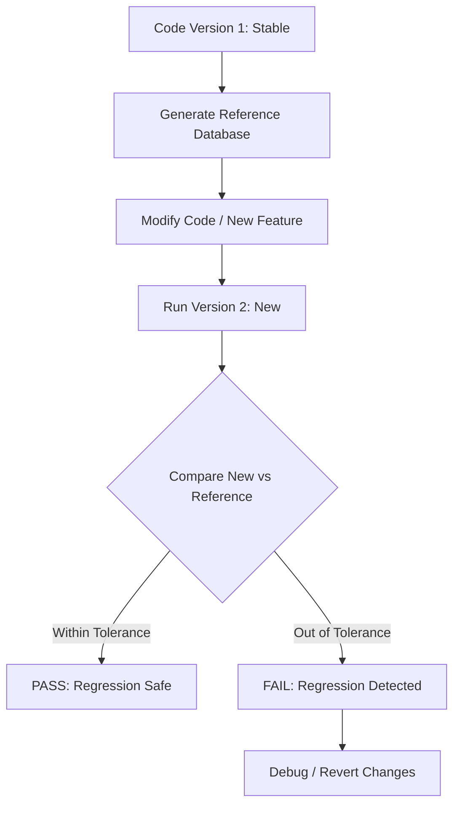
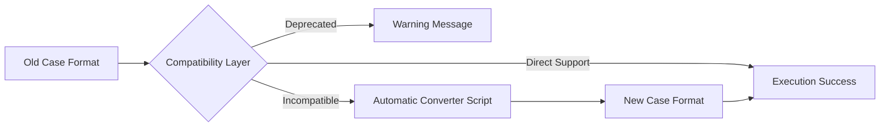

# 02 การทดสอบถอยหลัง (Regression Testing)

การทดสอบถอยหลัง (Regression Testing) คือกระบวนการยืนยันว่าการแก้ไขโค้ดใหม่ (เช่น การเพิ่มฟีเจอร์หรือการเพิ่มประสิทธิภาพ) ไม่ได้ไปทำลายความถูกต้องเดิมที่มีอยู่

## 2.1 ทำไมต้องทำ Regression Test?

ในซอฟต์แวร์ขนาดใหญ่แบบ OpenFOAM การเปลี่ยนโค้ดในไลบรารีส่วนกลางอาจส่งผลกระทบต่อ Solver หลายตัวที่เราคาดไม่ถึง Regression Test จะช่วยตรวจจับความผิดปกตินี้ได้ทันที

![[regression_testing_exact_vs_statistical.png]]
`A diagram explaining two types of match in regression testing. 'Exact Match' shows two identical bit-level patterns (1010... == 1010...). 'Statistical Match' shows two overlapping probability distribution curves (Bell curves), where the new result falls within the acceptable standard deviation of the reference. Scientific textbook diagram, clean vector line art, white background, high definition, flat design, educational infographic --ar 16:9`

### ความแตกต่างของผลลัพธ์:
-   **Exact Match**: ผลลัพธ์ต้องตรงกันทุกบิต (มักทำได้ยากเมื่อเปลี่ยนคอมพิวเตอร์หรือเวอร์ชันคอมไพเลอร์)
-   **Statistical Match**: ผลลัพธ์ยังคงอยู่ในช่วงความคลาดเคลื่อนที่ยอมรับได้ (Tolerance)

---

## 2.2 เฟรมเวิร์กการทดสอบ Regression

เราควรมีการเก็บค่าอ้างอิง (Reference Results) จากเวอร์ชันที่มั่นใจแล้วไว้ในฐานข้อมูล



### ขั้นตอนการทำงาน:
1.  **Run Stable Version**: รัน Solver และเก็บค่าสำคัญ (เช่น Final Residuals, Integral Values)
2.  **Modify Code**: ทำการแก้ไขหรืออัปเกรดโค้ด
3.  **Run New Version**: รันด้วยกรณีศึกษาเดิม
4.  **Compare**: ตรวจสอบความแตกต่างระหว่างเวอร์ชันใหม่และค่าอ้างอิง

### ตัวอย่างคลาสตรวจสอบ Regression (C++):
```cpp
class RegressionTest
{
public:
    bool runTest(const word& name, scalar currentValue)
    {
        scalar referenceValue = getReference(name);
        scalar error = mag(currentValue - referenceValue);
        
        return error < tolerance_;
    }
};
```

---

## 2.3 การทดสอบความเข้ากันได้ย้อนหลัง (Backward Compatibility)

นอกจากการตรวจสอบค่าตัวเลขแล้ว เรายังต้องตรวจสอบว่า Dictionary หรือ Input Format ใหม่ยังสามารถทำงานกับไฟล์เก่าได้หรือไม่



-   **Deprecation Warnings**: แจ้งเตือนผู้ใช้เมื่อมีการเปลี่ยน Keyword ใน `controlDict` หรือ `fvSchemes`
-   **Automatic Conversion**: มีเครื่องมือช่วยแปลงไฟล์เวอร์ชันเก่าให้เป็นเวอร์ชันใหม่

การรัน Regression Test อย่างสม่ำเสมอ (เช่น ทุกสัปดาห์ หรือทุกครั้งที่ส่งงาน) จะช่วยรักษาความแข็งแกร่งของซอฟต์แวร์ที่เราพัฒนาขึ้น