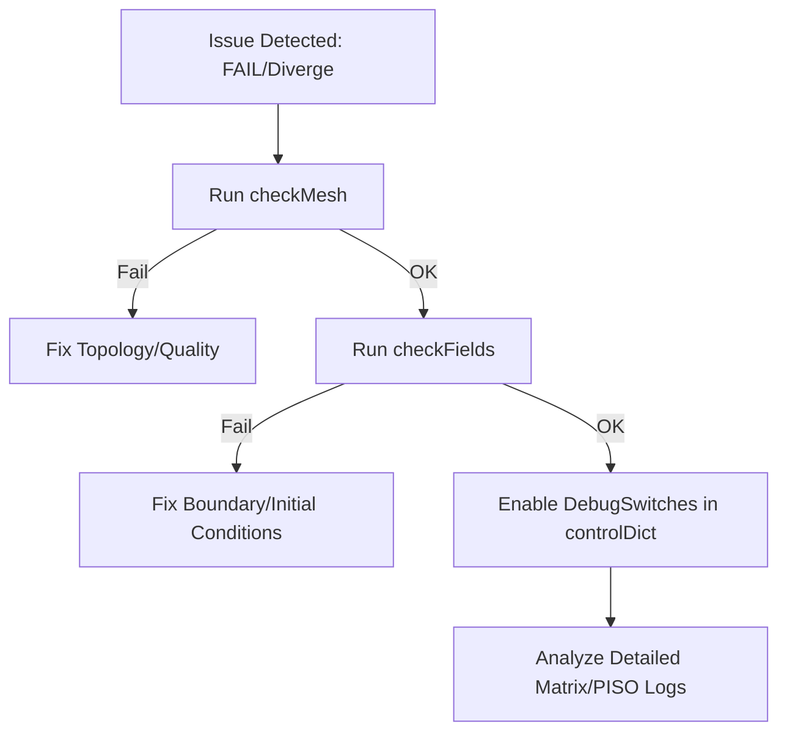

# 03 การดีบักและการแก้ไขปัญหา (Debugging and Troubleshooting)

เมื่อการทดสอบ FAIL เราต้องมีวิธีการที่เป็นระบบในการระบุสาเหตุและแก้ไขปัญหา

## 3.1 ปัญหาการทดสอบทั่วไปและวิธีแก้ไข

### 1. ปัญหาการแยกตัว (Divergence Issues)

![[cfd_divergence_residual_plot.png]]
`A dual-panel graph showing Solver Convergence. Panel A: 'Convergence' shows residuals dropping steadily over iterations. Panel B: 'Divergence' shows residuals dropping and then suddenly spiking upwards to infinity, marked with a red warning 'NaN detected'. Above the graphs, a small diagram shows a Courant Number (Co) calculation as a potential culprit. Scientific textbook diagram, clean vector line art, white background, high definition, flat design, educational infographic --ar 16:9`

หากการจำลองระเบิด (Blow up) หรือมีค่า NaN (Not a Number) เกิดขึ้น:
-   **Check Time Step**: ลดค่า Courant Number ($Co$)
-   **Check Numerical Schemes**: เปลี่ยนไปใช้ Upwind Scheme เพื่อเพิ่มความเสถียร (เสมือนการเติม Numerical Diffusion)
-   **Check Mesh Quality**: ตรวจสอบหาเซลล์ที่เบ้จัด (Highly Skewed) ด้วย `checkMesh`

### 2. ข้อผิดพลาดการอนุรักษ์ (Conservation Errors)
หากมวลหรือพลังงานไม่คงที่:
-   **Inlet/Outlet Balance**: ตรวจสอบ Flux ที่ทางเข้าและทางออก
-   **Solver Tolerance**: เพิ่มความละเอียดของ Matrix Solver (ลดค่า `tolerance` ใน `fvSolution`)
-   **Consistency**: ตรวจสอบว่าเงื่อนไขขอบเขตที่เลือกสอดคล้องกับสมการทางฟิสิกส์หรือไม่

---

## 3.2 เครื่องมือสำหรับการดีบักใน OpenFOAM

OpenFOAM ให้ Utilities ที่เป็นประโยชน์ในการ "ส่อง" ดูสิ่งที่เกิดขึ้นในโค้ด:



-   **checkMesh**: ตรวจสอบคุณภาพและโทโพโลยีของเมชอย่างละเอียด
-   **checkFields**: ตรวจสอบความถูกต้องของการเริ่มต้นฟิลด์และเงื่อนไขขอบเขต
-   **writeCellCentres**: ส่งออกพิกัดศูนย์กลางเซลล์เพื่อช่วยในการตรวจสอบใน Paraview
-   **DebugSwitches**: เปิดใช้งานข้อมูลการดีบักเพิ่มเติมใน `controlDict` หรือ `~/.openfoam/controlDict`
    ```text
    DebugSwitches
    {
        fvVectorMatrix 1;
        PISO 1;
    }
    ```

---

## 3.3 รายการตรวจสอบก่อนการทดสอบ (Pre-test Checklist)

เพื่อลดโอกาสที่การทดสอบจะล้มเหลวโดยไม่จำเป็น ควรตรวจสอบสิ่งเหล่านี้เสมอ:

![[pre_test_checklist_visual.png]]
`A checklist infographic with icons. 1) Dimensions (meter, kg, second icons), 2) Boundary Types (patch, wall, empty icons), 3) Numerical Stability (Co < 1 icon). Each item has a magnifying glass icon inspecting it. Scientific textbook diagram, clean vector line art, white background, high definition, flat design, educational infographic --ar 16:9`

1.  **Dimensions**: มิติของฟิลด์ทั้งหมดถูกต้องและสอดคล้องกันหรือไม่
2.  **Boundary Types**: ประเภทของ Patch (เช่น wall, patch, empty) สอดคล้องกับเมชหรือไม่
3.  **Numerical Stability**: ค่าเริ่มต้น (Initial Conditions) อยู่ในพารามิเตอร์ที่สมเหตุสมผลหรือไม่

การดีบักอย่างเป็นระบบไม่เพียงแต่ช่วยแก้ปัญหา แต่ยังช่วยให้เราเข้าใจ "พฤติกรรม" ของ Solver ของเราได้อย่างลึกซึ้งยิ่งขึ้น