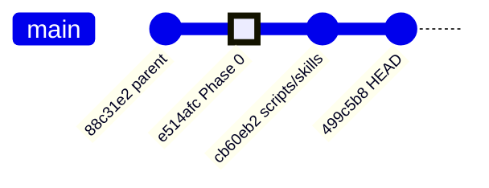

# Git Commit Report: `e514afc` → `499c5b8` (HEAD)

**Repository:** `Build My CFD/.claude/worktrees/upbeat-banach`
**Date:** 2026-03-01
**Branch:** `claude/upbeat-banach`

---

## 📊 Overview

| Item | Details |
|------|---------|
| **Base (Parent)** | `88c31e2` — `chore: remove redundant skills` |
| **Start Commit** | `e514afc` — `feat: Complete Phase 0 tooling (9/9 tasks)` |
| **Intermediate** | `cb60eb2` — `chore: Add remaining .claude scripts, skills, and utilities` |
| **Current HEAD** | `499c5b8` — `chore: Fix .gitignore and remove tracked __pycache__ files` |



**Total change from parent (`88c31e2`) to HEAD (`499c5b8`):**
- **43 files** changed in `e514afc`
- **21 files** added in `cb60eb2`
- **10 files** changed in `499c5b8` (`.gitignore` fix + `__pycache__` removal)
- **~12,400 insertions, ~2,700 deletions** in total

---

## Commit 1: `e514afc` — `feat: Complete Phase 0 tooling (9/9 tasks)`

> **The biggest commit.** This is the core curriculum refactoring — transforming the project from an **R410A CFD Engine Development** curriculum into a **C++ & Software Engineering learning** curriculum using OpenFOAM.

### 🔑 Key Changes (by category)

#### 1. Project Identity & Documentation

| File | Change | Summary |
|------|--------|---------|
| [CLAUDE.md](file:///Users/woramet/Documents/Build%20My%20CFD/.claude/worktrees/upbeat-banach/CLAUDE.md) | Modified | Title: "CFD Engine Development" → "C++ & Software Engineering Through OpenFOAM". Target: "R410A evaporator simulation" → "Master C++ by studying production code (84 sessions, 5 phases)". Updated directory tree to reflect new phase names. |
| [PLAN.md](file:///Users/woramet/Documents/Build%20My%20CFD/.claude/worktrees/upbeat-banach/PLAN.md) | **New** (176 lines) | Complete 17-task refactoring roadmap. Documents Phase 0 as complete (9/9 tasks). Tracks progress: 10/17 tasks = 59%. |
| [roadmap.md](file:///Users/woramet/Documents/Build%20My%20CFD/.claude/worktrees/upbeat-banach/roadmap.md) | **Rewritten** (+595 / −771) | Completely rewritten from "90-Day CFD Engine Roadmap" to "84-Session C++ & Software Engineering Roadmap". 5 new phases instead of 6, focused on C++ learning through OpenFOAM. |

#### 2. R410A Archival

All R410A-specific files were moved to `.claude/archive/r410a/`:

| Original Location | New Location |
|--------------------|-------------|
| `.claude/tasks/r410a_implementation.yaml` | `.claude/archive/r410a/r410a_implementation.yaml` |
| `.claude/templates/foundation_with_r410a.json` | `.claude/archive/r410a/templates/foundation_with_r410a.json` |
| `.claude/templates/geometry_with_r410a.json` | `.claude/archive/r410a/templates/geometry_with_r410a.json` |
| `.claude/templates/r410a_implementation.json` | `.claude/archive/r410a/templates/r410a_implementation.json` |
| `.claude/templates/r410a_integration_blueprint.json` | `.claude/archive/r410a/templates/r410a_integration_blueprint.json` |
| `.claude/templates/solver_with_r410a.json` | `.claude/archive/r410a/templates/solver_with_r410a.json` |

New archival files created:
- `.claude/archive/r410a/roadmap.md` (1,051 lines — copy of old roadmap)
- `.claude/archive/r410a/config/project_context.yaml` (247 lines)
- `.claude/archive/r410a/tasks/r410a_implementation.yaml` (424 lines)

#### 3. New Configuration Files

| File | Lines | Purpose |
|------|-------|---------|
| `.claude/config/phase_mapping.yaml` | 144 | Single source of truth for session→phase mapping |
| `.claude/config/topics.json` | 525 | Maps all 84 sessions to topics, short names, templates, and source files |
| `.claude/tasks/curriculum_tasks.yaml` | 158 | Replaces R410A task tracking with curriculum refactoring tasks (17 tasks, 7 layers) |

#### 4. Refactored Scripts

| File | Change | Summary |
|------|--------|---------|
| `.claude/scripts/phase_utils.py` | **New** (204 lines) | Shared helper module for phase/session lookups |
| `.claude/scripts/generate_blueprint.py` | Simplified (−100+ lines) | Refactored to use `phase_utils.py` |
| `.claude/scripts/load_project_context.py` | Refactored (−104 / +108) | Refactored to use `phase_utils.py` |
| `.claude/scripts/run_content_workflow.sh` | Enhanced (+68) | Updated for new curriculum structure |

#### 5. Refactored Skills

| Skill | Change Summary |
|-------|----------------|
| `content-creation/SKILL.md` | Drastically simplified (−589 lines, +~100 lines). References extracted to sub-files. |
| `content-creation/references/deepseek-api.md` | **New** (166 lines) — Extracted DeepSeek API reference |
| `content-creation/references/workflow.md` | **New** (198 lines) — Extracted workflow reference |
| `create-module/SKILL.md` | Refactored (−151 / +122) — Removed R410A hardcoding |
| `create-module/create_module_skill.py` | Simplified (−230 lines) |
| `walkthrough/SKILL.md` | Simplified (−155 lines) — Removed R410A references |
| `walkthrough/references/verification-gates.md` | **New** (181 lines) — Extracted verification gates |
| `qa/SKILL.md` | Simplified (−178 lines) |
| `qa/interactive_mode.py` | Enhanced (+141) |
| `qa/qa_manager.py` | Enhanced (+85) |
| `qa/references/examples.md` | **New** (144 lines) |
| `qa/references/integration.md` | **New** (167 lines) |
| `cpp_pro/SKILL.md` | Updated (−55 lines) |
| `source-first/SKILL.md` | Simplified (−222 lines) |
| `scientific_skills/SKILL.md` | Updated (+43) |
| `mermaid_expert/SKILL.md` | Updated (+58) |
| `git-operations/SKILL.md` | Updated (+46) |
| `systematic_debugging/SKILL.md` | Minor fix (+3) |

#### 6. Updated Agents & Config

| File | Change |
|------|--------|
| `.claude/agents/qc-agent.md` | Major expansion (+403 lines) |
| `.claude/agents/mermaid-validator.md` | **New** (207 lines) |
| `.claude/agents/deepseek-chat-mcp.md` | Minor fix (+2) |
| `.claude/config/project_context.yaml` | Heavily simplified (−297) — R410A content removed |
| `.claude/templates/structural_blueprints.json` | Massive expansion (+774 lines) — 4 new content templates |

---

## Commit 2: `cb60eb2` — `chore: Add remaining .claude scripts, skills, and utilities`

> **Bulk addition of supporting scripts, skills, and documentation.** 21 files, all additions (5,678 insertions).

### New Scripts (11 files, ~3,400 lines)

| Script | Lines | Purpose |
|--------|-------|---------|
| `detect_lab_type.py` | 314 | Automatically detects lab type from content |
| `detect_natural_cpp_dsa.py` | 410 | Detects natural C++/DSA content in files |
| `enhanced_obsidian_qc.py` | 712 | Enhanced Obsidian quality control checker |
| `generate_lab_blueprint.py` | 283 | Generates lab session blueprints |
| `heal_seams.py` | 216 | Repairs content seams from split generation |
| `mermaid_ai_validator.py` | 431 | AI-powered Mermaid diagram validator |
| `repair_syntax.py` | 253 | Repairs Obsidian syntax issues |
| `split_content_generation.py` | 366 | Splits large content generation into chunks |
| `split_content_workflow.sh` | 120 | Shell wrapper for split content workflow |
| `verify_module_content.py` | 281 | Verifies module content completeness |
| `verify_obsidian_syntax.sh` | 109 | Verifies Obsidian syntax correctness |

### New Documentation (2 files)

| File | Lines | Purpose |
|------|-------|---------|
| `obsidian_syntax_prevention.md` | 287 | Guide for preventing common Obsidian syntax errors |
| `MONITORING_GUIDE.md` | 330 | Configuration and monitoring guide |

### New Skills (3 skills)

| Skill | Lines | Purpose |
|-------|-------|---------|
| `content-verification/SKILL.md` | 8 | Content verification skill definition |
| `create-lab/SKILL.md` | 89 | Lab creation skill |
| `create-lab/SKILL.md.backup` | 684 | Backup of original create-lab skill |
| `create-lab/references/implementation.md` | 242 | Lab implementation reference |
| `source-first/references/verification-gates.md` | 181 | Verification gates reference |

### Other Updates

| File | Change |
|------|--------|
| `.claude/rules/cfd-standards.md` | +15 lines |
| `.claude/scripts/deepseek_content.py` | +79 lines — enhanced DeepSeek content generation |
| `.claude/test_cases/INTEGRATION_TEST_PLAN.md` | **New** (271 lines) — integration test plan |

---

## Commit 3: `499c5b8` — `chore: Fix .gitignore and remove tracked __pycache__ files`

> **Housekeeping commit.** Fixes a malformed `.gitignore` pattern and removes 9 tracked `.pyc` files.

### .gitignore Fix

```diff
-*.pyc/__pycache__/
+*.pyc
+__pycache__/
+*.backup
 .DS_Store
```

### Removed Tracked Files (9 `.pyc` binary files)

| Removed File |
|-------------|
| `.claude/skills/integration/__pycache__/__init__.cpython-314.pyc` |
| `.claude/skills/integration/__pycache__/agent_bridge.cpython-314.pyc` |
| `.claude/skills/integration/__pycache__/hook_triggers.cpython-314.pyc` |
| `.claude/skills/integration/__pycache__/script_api.cpython-314.pyc` |
| `.claude/skills/integration/__pycache__/verification_assistant.cpython-314.pyc` |
| `.claude/skills/orchestrator/__pycache__/__init__.cpython-314.pyc` |
| `.claude/skills/orchestrator/__pycache__/skill_chain.cpython-314.pyc` |
| `.claude/skills/orchestrator/__pycache__/skill_executor.cpython-314.pyc` |
| `.claude/skills/orchestrator/__pycache__/skill_registry.cpython-314.pyc` |

---

## 📈 Summary: What Changed vs Parent (`88c31e2`)

### High-Level Transformation

```
BEFORE (88c31e2):                          AFTER (499c5b8):
─────────────────                          ────────────────
90-Day CFD Engine Development              84-Session C++ Learning Curriculum
R410A evaporator simulation                OpenFOAM as case study
6 phases (FVM → Integration)               5 phases (C++ → Mini Solver)
R410A-hardcoded scripts & skills           Generic, modular tooling
Minimal script library                     14+ utility scripts
Few quality tools                          Enhanced QC, validators, syntax repair
No tracking plan                           PLAN.md with 17-task roadmap
```

### By the Numbers

| Metric | Value |
|--------|-------|
| Commits | 3 |
| Files changed | ~65 (unique) |
| New files created | ~40 |
| Files archived/moved | 7 (R410A → archive) |
| Binary files removed | 9 (`.pyc`) |
| Total insertions | ~12,400 |
| Total deletions | ~2,700 |
| Net lines added | ~9,700 |

> [!IMPORTANT]
> The core theme across all 3 commits is the **curriculum pivot** — from building an R410A CFD engine to learning C++ through OpenFOAM. Commit `e514afc` does the heavy lifting (refactoring), `cb60eb2` backfills missing tooling, and `499c5b8` cleans up `.gitignore` issues.
