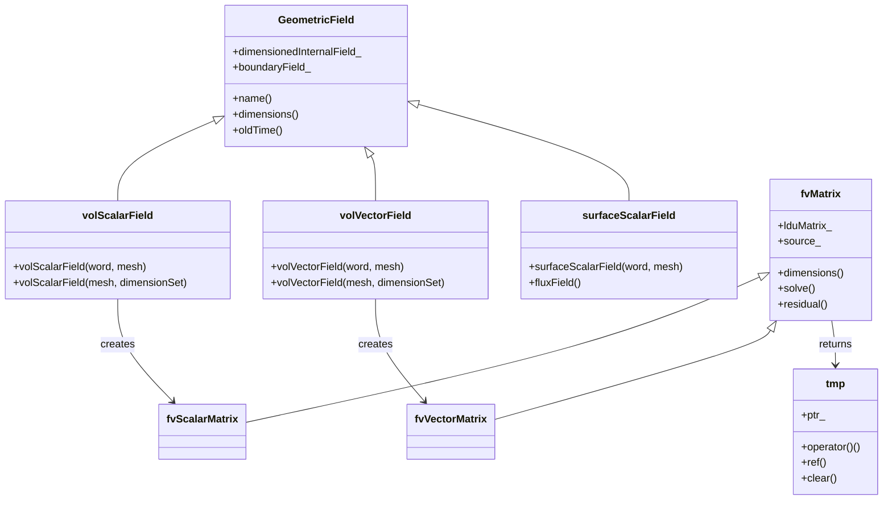
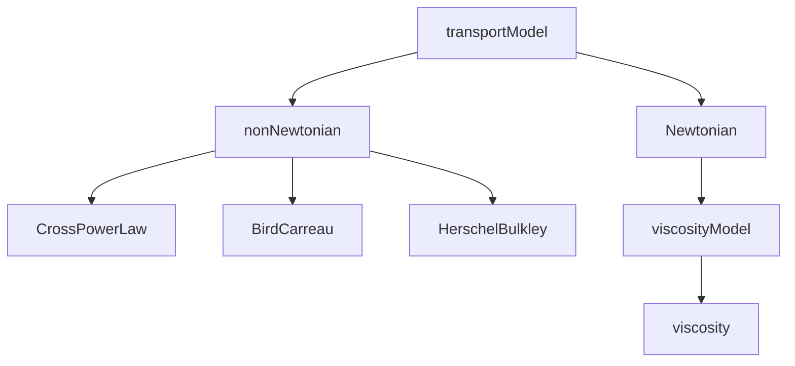
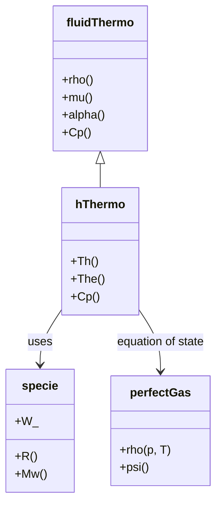

# Governing Equations
## HARDCORE Level - 2026-01-01

---

## Table of Contents
- [1. Theory](#1-theory-core-equations--physics)
- [2. Class Hierarchy](#2-openfoam-class-hierarchy--implementation)
- [3. Code Walkthrough](#3-code-walkthrough)
- [4. Dictionary Analysis](#4-dictionary-analysis--configuration)
- [5. Practical Tasks](#5-hands-on-practical-tasks--coding)
- [6. Concept Checks](#6-concept-checks)

---

## 1. Theory: Core Equations & Physics {#1-theory-core-equations--physics}

### 1.1 Conservation Laws Overview

> [!INFO] **Fundamental Principle**
> Fluid flow is governed by conservation laws of mass, momentum, and energy. These form the basis of Computational Fluid Dynamics (CFD) simulations in OpenFOAM.

The governing equations describe how fluid properties (velocity, pressure, temperature, density) evolve in space and time.

---

### 1.2 Mass Conservation (Continuity Equation)

$$\frac{\partial \rho}{\partial t} + \nabla \cdot (\rho \mathbf{U}) = 0$$

**Key Terms:**
- $\rho$ (rho): Fluid density [kg/m³]
- $\mathbf{U}$: Velocity vector [m/s]
- $\nabla \cdot$: Divergence operator
- $t$: Time [s]

> [!TIP] **Incompressible Flow**
> For incompressible flows (constant density), this simplifies to:
> $$\nabla \cdot \mathbf{U} = 0$$
> (สมการต่อเนื่องสำหรับการไหลแบบอัดตัวไม่ได้)

---

### 1.3 Momentum Conservation (Navier-Stokes Equations)

$$\frac{\partial (\rho \mathbf{U})}{\partial t} + \nabla \cdot (\rho \mathbf{U} \mathbf{U}) = -\nabla p + \nabla \cdot \boldsymbol{\tau} + \rho \mathbf{g}$$

**Key Terms:**
- $p$: Pressure [Pa]
- $\boldsymbol{\tau}$ (tau): Stress tensor [Pa]
- $\mathbf{g}$: Gravitational acceleration [m/s²]
- $\rho \mathbf{U} \mathbf{U}$: Convective momentum flux

#### Stress Tensor for Newtonian Fluid:

$$\boldsymbol{\tau} = \mu \left[ \nabla \mathbf{U} + (\nabla \mathbf{U})^T \right] - \frac{2}{3}\mu (\nabla \cdot \mathbf{U})\mathbf{I}$$

**Key Terms:**
- $\mu$ (mu): Dynamic viscosity [Pa·s]
- $\mathbf{I}$: Identity tensor

> [!WARNING] **Nonlinearity**
> The convective term $\nabla \cdot (\rho \mathbf{U} \mathbf{U})$ makes Navier-Stokes equations nonlinear and difficult to solve analytically. This is why we need numerical methods (CFD).

---

### 1.4 Energy Conservation

$$\frac{\partial (\rho h)}{\partial t} + \nabla \cdot (\rho \mathbf{U} h) = \frac{Dp}{Dt} + \nabla \cdot (k \nabla T) + \boldsymbol{\tau} : \nabla \mathbf{U}$$

**Key Terms:**
- $h$: Specific enthalpy [J/kg]
- $k$: Thermal conductivity [W/(m·K)]
- $T$: Temperature [K]
- $\frac{Dp}{Dt}$: Material derivative of pressure
- $\boldsymbol{\tau} : \nabla \mathbf{U}$: Viscous dissipation

> [!INFO] **Sensible Enthalpy**
> In OpenFOAM, energy is often expressed in terms of sensible enthalpy:
> $$h = h_{ref} + \int_{T_{ref}}^{T} c_p dT$$
> การเก็บพลังงานในรูปของเอนทัลปี

---

### 1.5 Equation of State

For compressible flows, we need an equation of state to close the system:

**Ideal Gas Law:**
$$\rho = \frac{p}{R T}$$

**Key Terms:**
- $R$: Specific gas constant [J/(kg·K)]

---

### 1.6 Transport Coefficients

| Property | Symbol | Units | Typical Value (Air at 20°C) |
|----------|--------|-------|----------------------------|
| Density | $\rho$ | kg/m³ | 1.204 |
| Dynamic Viscosity | $\mu$ | Pa·s | 1.82×10⁻⁵ |
| Kinematic Viscosity | $\nu = \mu/\rho$ | m²/s | 1.51×10⁻⁵ |
| Thermal Conductivity | $k$ | W/(m·K) | 0.0257 |
| Specific Heat (constant p) | $c_p$ | J/(kg·K) | 1005 |

---

### 1.7 Dimensionless Numbers

**Reynolds Number (Inertia vs Viscosity):**
$$Re = \frac{\rho U L}{\mu} = \frac{U L}{\nu}$$

**Mach Number (Flow speed vs Sound speed):**
$$Ma = \frac{U}{a} = \frac{U}{\sqrt{\gamma R T}}$$

> [!TIP] **Flow Classification**
> - $Re \ll 1$: Creeping flow (Stokes flow)
> - $Re \gg 1$: Turbulent flow (requires turbulence modeling)
> - $Ma < 0.3$: Incompressible flow
> - $Ma > 0.3$: Compressible flow
> การจำแนกประเภทการไหลตามค่าเรย์โนลด์และมัค

---

### 1.8 Boundary Conditions

Mathematical representation of common boundary conditions:

| Boundary Type | Velocity | Pressure |
|---------------|----------|----------|
| Inlet | $\mathbf{U} = \mathbf{U}_{inlet}$ | $\nabla p \cdot \mathbf{n} = 0$ |
| Outlet | $\nabla \mathbf{U} \cdot \mathbf{n} = 0$ | $p = p_{outlet}$ |
| Wall | $\mathbf{U} = \mathbf{0}$ (no-slip) | $\nabla p \cdot \mathbf{n} = 0$ |
| Symmetry | $(\mathbf{U} \cdot \mathbf{n}) = 0$ | $\nabla p \cdot \mathbf{n} = 0$ |

Where $\mathbf{n}$ is the unit normal vector pointing outward from the boundary.

---

### 1.9 Summary: Complete Equation Set

The complete set of governing equations for a compressible, viscous, heat-conducting fluid:

$$
\begin{aligned}
&\text{Mass:} \quad \frac{\partial \rho}{\partial t} + \nabla \cdot (\rho \mathbf{U}) = 0 \\
&\text{Momentum:} \quad \frac{\partial (\rho \mathbf{U})}{\partial t} + \nabla \cdot (\rho \mathbf{U} \mathbf{U}) = -\nabla p + \nabla \cdot \boldsymbol{\tau} + \rho \mathbf{g} \\
&\text{Energy:} \quad \frac{\partial (\rho h)}{\partial t} + \nabla \cdot (\rho \mathbf{U} h) = \frac{Dp}{Dt} + \nabla \cdot (k \nabla T) + \boldsymbol{\tau} : \nabla \mathbf{U} \\
&\text{State:} \quad \rho = f(p, T)
\end{aligned}
$$

> [!INFO] **OpenFOAM Implementation**
> These equations are solved numerically using the Finite Volume Method (FVM). OpenFOAM discretizes these equations on a mesh and solves them iteratively until convergence.

---

## 2. OpenFOAM Class Hierarchy & Implementation {#2-openfoam-class-hierarchy--implementation}

### 2.1 Core Equation Classes

OpenFOAM implements governing equations through a hierarchy of abstract and concrete classes. The following classes are fundamental to solving the Navier-Stokes equations:

> [!INFO] **fvMesh (Finite Volume Mesh)**
> The central class that holds the mesh data and provides access to geometric fields and surface interpolation schemes.
> - **Source:** `$FOAM_SRC/finiteVolume/fvMesh/fvMesh.H`
> - **Purpose:** Manages the finite volume mesh, including cell centers, face areas, and cell volumes

> [!INFO] **fvMatrix (Finite Volume Matrix)**
> Template class representing the discretized form of a partial differential equation.
> - **Source:** `$FOAM_SRC/finiteVolume/fvMatrices/fvMatrix/fvMatrix.H`
> - **Purpose:** Stores the coefficients of the linear system $Ax=b$ resulting from discretization

---

### 2.2 Class Hierarchy Diagram



> [!TIP] **Field Types (ประเภทของฟิลด์)**
> - `volScalarField`: Scalar values at cell centers (pressure, temperature)
> - `volVectorField`: Vector values at cell centers (velocity)
> - `surfaceScalarField`: Scalar values on cell faces (flux, mass flow rate)

---

### 2.3 Key Classes for Governing Equations

#### 2.3.1 Equation of Motion Classes

| Class | Purpose | Source Location |
|-------|---------|-----------------|
| `fvVectorMatrix` | Discretized momentum equation | `$FOAM_SRC/finiteVolume/fvMatrices/fvVectorMatrix` |
| `fvScalarMatrix` | Discretized scalar transport (pressure, energy) | `$FOAM_SRC/finiteVolume/fvMatrices/fvScalarMatrix` |
| `UList` | Dynamic list for field data | `$FOAM_SRC/OpenFOAM/containers/Lists/UList` |
| `lduMatrix` | Lower-Upper-Decomposition matrix | `$FOAM_SRC/OpenFOAM/matrices/lduMatrix` |

#### 2.3.2 Transport Model Classes



| Class | Purpose | Source Location |
|-------|---------|-----------------|
| `transportModel` | Abstract base for viscosity models | `$FOAM_SRC/transportModels` |
| `Newtonian` | Constant viscosity model | `$FOAM_SRC/transportModels/incompressible/Newtonian` |
| `viscosity` | Dynamic viscosity calculation | `$FOAM_SRC/transportModels/incompressible/viscosity` |

> [!INFO] **Viscosity Models (โมเดลความหนืด)**
> The `transportModel` class hierarchy provides different viscosity models:
> - **Newtonian:** Constant viscosity (most common)
> - **non-Newtonian:** Shear-dependent viscosity (blood, polymers)

---

### 2.4 Thermophysical Model Classes

For compressible flows with energy equations:



| Class | Purpose | Source Location |
|-------|---------|-----------------|
| `fluidThermo` | Base class for thermophysical properties | `$FOAM_SRC/thermophysicalModels/basic/fluidThermo` |
| `hThermo` | Enthalpy-based thermodynamics | `$FOAM_SRC/thermophysicalModels/basic/derivedFvPatchFields` |
| `perfectGas` | Ideal gas equation of state | `$FOAM_SRC/thermophysicalModels/specie/equationOfState/perfectGas` |
| `specie` | Molecular weight and gas constant | `$FOAM_SRC/thermophysicalModels/specie` |

> [!TIP] **Thermophysical Properties (สมบัติเทอร์โมฟิสิกส์)**
> OpenFOAM separates thermodynamics into:
> - **Equation of State:** $\rho = f(p,T)$
> - **Thermodynamics:** $h, T, c_p$ relationships
> - **Transport:** $\mu, k, \alpha$ (viscosity, conductivity, diffusivity)

---

### 2.5 Source File Reference Map

```
$FOAM_SRC/
├── finiteVolume/
│   ├── fvMesh/
│   │   └── fvMesh.H                    # Mesh management
│   ├── fvMatrices/
│   │   ├── fvMatrix/fvMatrix.H         # Generic matrix
│   │   ├── fvScalarMatrix              # Scalar equation matrix
│   │   └── fvVectorMatrix              # Vector equation matrix
│   ├── fields/
│   │   ├── volFields/
│   │   │   ├── volScalarField.H        # Cell-centered scalar
│   │   │   └── volVectorField.H        # Cell-centered vector
│   │   └── surfaceFields/
│   │       └── surfaceScalarField.H    # Face-centered scalar
│   └── interpolation/
│       └── surfaceInterpolation/
│           └── schemes/
│               └── linear.H            # Linear interpolation scheme
│
├── transportModels/
│   ├── incompressible/
│   │   ├── transportModel.H            # Abstract base
│   │   └── Newtonian/
│   │       └── Newtonian.H             # Constant viscosity
│   └── compressible/
│       └── transportModel.H            # Compressible transport
│
├── thermophysicalModels/
│   ├── basic/
│   │   ├── fluidThermo.H               # Thermo base class
│   │   └── hThermo/
│   │       └── hThermo.H               # Enthalpy thermo
│   ├── specie/
│   │   ├── specie.H                    # Species properties
│   │   └── equationOfState/
│   │       └── perfectGas.H            # Ideal gas law
│   └── transport/
│       └── viscosity/
│           └── viscosity.H             # Viscosity models
│
└── OpenFOAM/
    ├── containers/
    │   └── Lists/
    │       └── UList.H                 # Dynamic list
    ├── db/
    │   ├── Time/
    │   │   └── Time.H                  # Time management
    │   └── objectRegistry.H            # Object storage
    └── matrices/
        └── lduMatrix/
            └── lduMatrix.H             # Sparse matrix solver
```

> [!WARNING] **Header File Extensions**
> - `.H`: Public header (interface)
> - `.C`: Implementation file
> - `_I.H`: Inline implementation
> OpenFOAM uses capital letters for header files (แตกต่างจาก C++ แบบดั้งเดิม)

---

### 2.6 Class Instantiation Examples

#### 2.6.1 Creating Fields

```cpp
// Pressure field (volScalarField)
volScalarField p
(
    IOobject
    (
        "p",
        runTime.timeName(),
        mesh,
        IOobject::MUST_READ,
        IOobject::AUTO_WRITE
    ),
    mesh
);

// Velocity field (volVectorField)
volVectorField U
(
    IOobject
    (
        "U",
        runTime.timeName(),
        mesh,
        IOobject::MUST_READ,
        IOobject::AUTO_WRITE
    ),
    mesh
);

// Surface flux field (surfaceScalarField)
surfaceScalarField phi
(
    IOobject
    (
        "phi",
        runTime.timeName(),
        mesh,
        IOobject::READ_IF_PRESENT,
        IOobject::AUTO_WRITE
    ),
    fvc::flux(U)
);
```

#### 2.6.2 Creating Equation Matrices

```cpp
// Momentum equation (fvVectorMatrix)
fvVectorMatrix UEqn
(
    fvm::ddt(rho, U)
  + fvm::div(phi, U)
  + fvm::laplacian(mu, U)
 ==
    fvOptions(rho, U)
);

// Pressure equation (fvScalarMatrix)
fvScalarMatrix pEqn
(
    fvm::laplacian(rho/AU, p) == fvc::ddt(rho)
  + fvc::div(phi)
);
```

> [!INFO] **fvm vs fvc (ตัวดำเนินการแบบแยกส่วน)**
> - `fvm` (Finite Volume Method): Implicit terms (added to matrix diagonal)
> - `fvc` (Finite Volume Calculus): Explicit terms (added to source vector)
> - Example: `fvm::ddt(U)` vs `fvc::ddt(U)`

---

### 2.7 Summary: Class Relationships

The governing equations in OpenFOAM are solved through the interaction of:

1. **Mesh:** `fvMesh` provides geometric information
2. **Fields:** `volScalarField`, `volVectorField` store variable values
3. **Matrices:** `fvScalarMatrix`, `fvVectorMatrix` represent discretized equations
4. **Transport:** `transportModel` provides viscosity
5. **Thermo:** `fluidThermo` provides density, enthalpy, temperature
6. **Solvers:** `solve()` method iterates until convergence

> [!TIP] **Solver Workflow (ขั้นตอนการแก้สมการ)**
> 1. Create fields (p, U, T, etc.)
> 2. Construct equation matrices (UEqn, pEqn, etc.)
> 3. Apply boundary conditions
> 4. Solve linear system (Ax = b)
> 5. Update fields and check convergence

---

## 3. Code Walkthrough {#3-code-walkthrough}

### 3.1 UEqn.H

The `UEqn.H` file constructs the momentum equation matrix for incompressible flows. It's typically included in the main solver loop (e.g., `simpleFoam`, `pimpleFoam`).

**Key Code Snippet:**

```cpp
// Momentum equation matrix
fvVectorMatrix UEqn
(
    fvm::ddt(U)                        // Unsteady term (transient)
  + fvm::div(phi, U)                   // Convective term (nonlinear)
  + fvm::laplacian(nu, U)              // Diffusive term (viscous)
 ==
    fvOptions(U)                       // Source terms (optional)
);

// Relax the equation for stability
UEqn.relax();

// Solve momentum predictor (optional)
if (pimple.momentumPredictor())
{
    solve(UEqn == -fvc::grad(p));
}
```

**Explanation:**

- **`fvm::ddt(U)`**: First-order time derivative (implicit). Added to matrix diagonal.
- **`fvm::div(phi, U)`**: Convective term $\nabla \cdot (\mathbf{U} \mathbf{U})$. Nonlinear and requires under-relaxation.
- **`fvm::laplacian(nu, U)`**: Viscous term $\nabla \cdot (\nu \nabla \mathbf{U})$. Always implicit for stability.
- **`fvOptions(U)`**: Optional source terms (e.g., porosity, momentum sources).
- **`UEqn.relax()`**: Under-relaxation stabilizes the nonlinear solution.
- **`solve(UEqn == -fvc::grad(p))`**: Momentum predictor step with pressure gradient.

> [!TIP] **Implicit vs Explicit**
> - `fvm` (implicit): Terms added to the matrix diagonal (stable but requires linear solver)
> - `fvc` (explicit): Terms evaluated from previous iteration (fast but less stable)
> - Pressure gradient is explicit (`fvc::grad(p)`) because pressure is unknown

---

### 3.2 pEqn.H

The `pEqn.H` file constructs and solves the pressure equation to enforce mass conservation (continuity). It's typically called after the momentum equation prediction.

**Key Code Snippet:**

```cpp
// Pressure equation matrix
volScalarField rAU(1.0/UEqn.A());              // Reciprocal of diagonal coefficients
surfaceScalarField rAUf(fvc::interpolate(rAU)); // Face-interpolated reciprocal

// Correct mass flux using pressure gradient
surfaceScalarField phiHbyA
(
    "phiHbyA",
    fvc::flux(U)
);

// Adjust flux for non-orthogonal mesh corrections
while (pimple.correctNonOrthogonal())
{
    fvScalarMatrix pEqn
    (
        fvm::laplacian(rAUf, p) == fvc::div(phiHbyA)
    );

    pEqn.setReference(pRefCell, pRefValue);    // Fix pressure at reference cell
    pEqn.solve();

    if (pimple.finalNonOrthogonalIter())
    {
        phi = phiHbyA - pEqn.flux();            // Correct mass flux
    }
}

// Correct velocity using pressure gradient
U -= rAU * fvc::grad(p);
U.correctBoundaryConditions();
```

**Explanation:**

- **`rAU`**: Reciprocal of the momentum matrix diagonal coefficients. Used to decouple pressure and velocity.
- **`phiHbyA`**: Intermediate flux field based on predicted velocity (H-by-A = H divided by A).
- **`fvm::laplacian(rAUf, p)`**: Pressure Poisson equation $\nabla \cdot (\frac{1}{A} \nabla p) = \nabla \cdot (\mathbf{H}/A)$.
- **`pEqn.setReference()`**: Fixes pressure at a reference cell to prevent singular matrix (pure Neumann problem).
- **`pEqn.solve()`**: Solves the linear system for pressure.
- **`phi = phiHbyA - pEqn.flux()`**: Corrects mass flux to satisfy continuity $\nabla \cdot \phi = 0$.
- **`U -= rAU * fvc::grad(p)`**: Corrects velocity field using the new pressure gradient.

> [!INFO] **Pressure-Velocity Coupling (การเชื่อมโยงความดัน-ความเร็ว)**
> The pressure equation ensures mass conservation by correcting the flux field:
> 1. Predict velocity from momentum equation (UEqn)
> 2. Solve pressure Poisson equation (pEqn)
> 3. Correct velocity and flux using pressure gradient
> This is the **SIMPLE/PISO/PIMPLE** algorithm in OpenFOAM

> [!WARNING] **Non-Orthogonal Correction**
> For non-orthogonal meshes, the laplacian term is split into explicit and implicit parts:
> - **Implicit:** Orthogonal contribution (stable)
> - **Explicit:** Non-orthogonal correction (requires multiple iterations)
> The `while (pimple.correctNonOrthogonal())` loop iterates to improve accuracy

### 3.3 createFields.H

The `createFields.H` file is responsible for instantiating all the field variables required for the simulation. It's typically included at the beginning of the solver's `main()` function.

**Key Code Snippet:**

```cpp
// Pressure field
volScalarField p
(
    IOobject
    (
        "p",
        runTime.timeName(),
        mesh,
        IOobject::MUST_READ,
        IOobject::AUTO_WRITE
    ),
    mesh
);

// Velocity field
volVectorField U
(
    IOobject
    (
        "U",
        runTime.timeName(),
        mesh,
        IOobject::MUST_READ,
        IOobject::AUTO_WRITE
    ),
    mesh
);

// Transport properties (kinematic viscosity)
singlePhaseTransportModel laminarTransport(U, phi);

// Turbulence model
autoPtr<compressible::turbulenceModel> turbulence
(
    compressible::turbulenceModel::New(rho, U, phi, thermo)
);
```

**Explanation:**

- **`IOobject`**: Metadata for field I/O operations. Specifies the field name, time directory, mesh association, read/write behavior.
- **`MUST_READ`**: Field must exist in the initial time directory (e.g., `0/`).
- **`AUTO_WRITE`**: Field is automatically written at each output time.
- **`singlePhaseTransportModel`**: Provides kinematic viscosity (`nu`) for incompressible flows.
- **`autoPtr<turbulenceModel>`**: Smart pointer to turbulence model (k-ε, k-ω, etc.). Polymorphic type selected at runtime via `turbulenceProperties` dictionary.

> [!INFO] **Field Initialization (การเริ่มต้นฟิลด์)**
> Fields are read from the `0/` directory at simulation start. If the field doesn't exist and `MUST_READ` is specified, the solver will terminate with an error.

---

## 4. Dictionary Analysis & Configuration {#4-dictionary-analysis--configuration}

### 4.1 fvSchemes Analysis

The `fvSchemes` dictionary in the `system/` directory defines the numerical discretization schemes used for solving the partial differential equations. It controls how temporal derivatives, spatial gradients, divergences, and Laplacians are approximated on the finite volume mesh.

#### 4.1.1 ddtSchemes (Time Derivative Schemes)

Specifies the discretization method for the time derivative term $\frac{\partial}{\partial t}$.

| Scheme | Description | Stability | Accuracy | Use Case |
|--------|-------------|-----------|----------|----------|
| `Euler` | First-order implicit | Conditional (CFL < 1) | O(Δt) | Transient simulations, steady-state initialization |
| `backward` | Second-order implicit | Conditional | O(Δt²) | Accurate transient simulations |
| `CrankNicolson` | Second-order trapezoidal | Unconditional | O(Δt²) | Time-accurate simulations with coefficient 0.5-1.0 |
| `steadyState` | Removes time derivative | N/A | N/A | Steady-state problems |

**Example Configuration:**
```cpp
ddtSchemes
{
    default         Euler;
}
```

> [!TIP] **Time Step Selection**
> For explicit schemes, the time step is limited by the CFL condition: $\Delta t < \frac{\Delta x}{U}$. Implicit schemes allow larger time steps but may introduce numerical diffusion.

#### 4.1.2 gradSchemes (Gradient Schemes)

Defines how spatial gradients $\nabla$ are computed at cell centers and faces.

| Scheme | Description | Accuracy | Use Case |
|--------|-------------|----------|----------|
| `Gauss linear` | Central differencing using cell-centered values | Second-order | Standard scheme for structured meshes |
| `Gauss upwind` | Upwind-biased gradient | First-order | Stabilizes oscillatory solutions |
| `leastSquares` | Least-squares reconstruction | Second-order | Unstructured meshes with non-orthogonality |
| `fourth` | Fourth-order central differencing | O(Δx⁴) | High-accuracy simulations (uniform meshes) |

**Example Configuration:**
```cpp
gradSchemes
{
    default         Gauss linear;
    grad(p)         Gauss linear;
    grad(U)         Gauss linear;
}
```

> [!WARNING] **Non-Orthogonal Meshes**
> For highly non-orthogonal meshes, `Gauss linear` may produce inaccurate gradients. Use `leastSquares` or apply explicit non-orthogonal correction in `fvSolution`.

#### 4.1.3 divSchemes (Divergence Schemes)

Controls discretization of the convective term $\nabla \cdot (\phi \mathbf{U})$, which is critical for stability and accuracy.

| Scheme | Description | Stability | Accuracy | Boundedness |
|--------|-------------|-----------|----------|-------------|
| `Gauss upwind` | First-order upwind | Very stable | O(Δx) | Bounded |
| `Gauss linear` | Central differencing | Unconditional | O(Δx²) | Unbounded (may oscillate) |
| `Gauss linearUpwind` | Linear upwind | Stable | O(Δx²) | Bounded |
| `Gauss QUICK` | Quadratic upwind | Conditional | O(Δx³) | Bounded |
| `Gauss vanLeer` | TVD scheme | Stable | O(Δx²) | Bounded |
| `Gauss limitedLinearV 1` | Limiter-based | Stable | O(Δx²) | Bounded |

**Example Configuration:**
```cpp
divSchemes
{
    default         none;
    div(phi,U)      Gauss linearUpwind grad(U);
    div(phi,k)      Gauss limitedLinear 1;
    div(phi,epsilon) Gauss limitedLinear 1;
    div((nuEff*dev2(T(grad(U))))) Gauss linear;
}
```

> [!INFO] **Boundedness (ความเป็น bounded)**
> A bounded scheme ensures that the solution remains within physical limits (e.g., turbulence kinetic energy k ≥ 0). Unbounded schemes like `Gauss linear` can produce negative values in regions of high gradients.

#### 4.1.4 laplacianSchemes (Laplacian Schemes)

Defines discretization of the diffusion term $\nabla \cdot (\Gamma \nabla \phi)$, where $\Gamma$ is the diffusion coefficient.

| Scheme | Description | Orthogonality Requirement |
|--------|-------------|---------------------------|
| `Gauss linear corrected` | Standard with non-orthogonal correction | Handles moderate non-orthogonality (up to 70°) |
| `Gauss linear uncorrected` | No non-orthogonal correction | Requires orthogonal mesh |
| `Gauss linear limited 0.5` | Limited correction for highly non-orthogonal cells | Handles severe non-orthogonality |
| `finiteVolume` | Basic orthogonal scheme | Orthogonal meshes only |

**Example Configuration:**
```cpp
laplacianSchemes
{
    default         Gauss linear corrected;
    laplacian(nu,U) Gauss linear corrected;
    laplacian((1|A(U)),p) Gauss linear corrected;
}
```

> [!TIP] **Non-Orthogonal Correction (การแก้ไขเชิงไม่ตั้งฉาก)**
> The `corrected` keyword adds an explicit correction term for non-orthogonal meshes:
> $$\nabla \phi \cdot \mathbf{S}_f \approx (\nabla \phi)_\text{orth} \cdot \mathbf{S}_f + (\nabla \phi)_\text{non-orth} \cdot \mathbf{k}_f$$
> This improves accuracy on skewed meshes but may require under-relaxation in `fvSolution`.

#### 4.1.5 interpolationSchemes (Interpolation Schemes)

Controls how cell-centered values are interpolated to cell faces.

| Scheme | Description | Use Case |
|--------|-------------|----------|
| `linear` | Linear interpolation using cell-centered values | Standard scheme for most applications |
| `cubic` | Cubic polynomial interpolation | High-accuracy requirements |
| `upwind` | Upwind-biased interpolation | Convective fluxes |

**Example Configuration:**
```cpp
interpolationSchemes
{
    default         linear;
}
```

#### 4.1.6 snGradSchemes (Surface Normal Gradient Schemes)

Defines how the gradient normal to cell faces $\nabla \phi \cdot \mathbf{n}$ is computed.

| Scheme | Description | Use Case |
|--------|-------------|----------|
| `corrected` | Includes non-orthogonal correction | Standard for non-orthogonal meshes |
| `uncorrected` | Orthogonal contribution only | Orthogonal meshes |
| `limited 0.5` | Limited gradient for stability | Highly distorted cells |

**Example Configuration:**
```cpp
snGradSchemes
{
    default         corrected;
}
```

> [!INFO] **Scheme Selection Guidelines (แนวทางการเลือกโครงร่าง)**
> - **Start simple:** Use `Euler`, `Gauss linear`, `Gauss upwind` for initial simulations
> - **Refine gradually:** Switch to higher-order schemes (`backward`, `linearUpwind`) after obtaining a stable solution
> - **Check boundedness:** Monitor field min/max values when using unbounded schemes
> - **Mesh quality:** Use `corrected` schemes for non-orthogonal meshes; consider `limited` schemes for highly skewed cells

### 4.2 fvSolution Analysis

The `fvSolution` dictionary in the `system/` directory controls the solution algorithms, solver settings, and under-relaxation factors. It defines how the linear systems are solved and how the pressure-velocity coupling is handled.

#### 4.2.1 solvers Sub-dictionary

Defines the linear solvers for each variable's discretized equation.

| Solver | Description | Use Case |
|--------|-------------|----------|
| `GAMG` | Geometric-Algebraic Multi-Grid | Large meshes, scalar fields (pressure, temperature) |
| `smoothSolver` | Solver with smoother preconditioner | General purpose, medium-sized meshes |
| `PCG` | Preconditioned Conjugate Gradient | Symmetric matrices (Poisson equations) |
| `PBiCGStab` | Preconditioned Bi-Conjugate Gradient Stabilized | Non-symmetric matrices (momentum equation) |
| `PBiCGStab` | Preconditioned Bi-Conjugate Gradient Stabilized | Non-symmetric matrices |

**Preconditioners:**
- `DIC`: Diagonal Incomplete Cholesky (symmetric matrices)
- `DILU`: Diagonal Incomplete LU (non-symmetric matrices)
- `FDIC`: Faster DIC for GAMG
- `none`: No preconditioning

**Tolerance Settings:**
- `tolerance`: Solver convergence tolerance (e.g., 1e-06)
- `relTol`: Relative tolerance (0 = solve to absolute tolerance, 0.1 = stop early)

**Example Configuration:**
```cpp
solvers
{
    p
    {
        solver          GAMG;
        tolerance       1e-06;
        relTol          0.1;
        smoother        GaussSeidel;
    }

    pFinal
    {
        $p;
        relTol          0;
    }

    U
    {
        solver          smoothSolver;
        smoother        GaussSeidel;
        tolerance       1e-05;
        relTol          0.1;
    }
}
```

> [!INFO] **Final Solver Iteration**
> The `pFinal` entry is used in the last PISO/PIMPLE iteration to solve the pressure equation to tighter tolerance (`relTol 0`), ensuring better mass conservation.

#### 4.2.2 SIMPLE/PISO/PIMPLE Algorithms

OpenFOAM uses segregated algorithms to handle pressure-velocity coupling for incompressible flows.

**SIMPLE (Semi-Implicit Method for Pressure-Linked Equations):**
- Used for steady-state simulations
- Under-relaxation required for stability
- Single iteration per time step

**PISO (Pressure-Implicit with Splitting of Operators):**
- Used for transient simulations
- Multiple corrector steps per time step
- No under-relaxation needed (small time steps provide stability)

**PIMPLE (Merged PISO-SIMPLE):**
- Hybrid algorithm for transient simulations with large time steps
- Combines PISO correctors with SIMPLE under-relaxation
- Allows larger Courant numbers than pure PISO

**Example Configuration (PIMPLE):**
```cpp
PIMPLE
{
    nCorrectors     2;          // Number of pressure correctors
    nNonOrthogonalCorrectors 0; // Non-orthogonal correction loops
    nAlphaCorr      1;          // Volume fraction correctors (multiphase)
    nAlphaSubCycles 1;          // Sub-cycles for volume fraction
    pRefCell        0;          // Reference cell index
    pRefValue       0;          // Reference pressure value [Pa]
    
    // Merging factors for outer correctors
    momentumPredictor yes;      // Solve momentum equation
    transonic       no;         // Transonic flow (Mach > 0.3)
    consistent      no;         // Consistent flux approach
}
```

> [!TIP] **Algorithm Selection (การเลือกอัลกอริทึม)**
> - **Steady-state:** Use `simpleFoam` with SIMPLE algorithm
> - **Transient (small Δt):** Use `pisoFoam` with PISO algorithm
> - **Transient (large Δt):** Use `pimpleFoam` with PIMPLE algorithm

#### 4.2.3 relaxationFactors Sub-dictionary

Under-relaxation factors stabilize the iterative solution by limiting the change in field values between iterations.

**Typical Values:**

| Variable | Range | Typical Value | Description |
|----------|-------|---------------|-------------|
| `p` | 0.2 - 0.5 | 0.3 | Pressure (highly coupled) |
| `U` | 0.5 - 0.8 | 0.7 | Velocity |
| `k` | 0.5 - 0.8 | 0.7 | Turbulence kinetic energy |
| `epsilon` | 0.5 - 0.8 | 0.7 | Dissipation rate |
| `omega` | 0.5 - 0.8 | 0.7 | Specific dissipation rate |

**Example Configuration:**
```cpp
relaxationFactors
{
    fields
    {
        p               0.3;
        rho             0.05;    // Compressible flows only
    }
    
    equations
    {
        U               0.7;
        "(k|epsilon|omega)" 0.7;
    }
```

> [!WARNING] **Stability vs Convergence Speed**
> - **Lower relaxation factors** (e.g., 0.2) = More stable but slower convergence
> - **Higher relaxation factors** (e.g., 0.9) = Faster convergence but risk of divergence
> - Start with conservative values (0.3 for p, 0.7 for U) and increase gradually if stable

#### 4.2.4 residualControl Sub-dictionary

Defines convergence criteria for outer iterations in PIMPLE algorithm. The solver stops iterating when all residuals fall below specified thresholds.

**Example Configuration:**
```cpp
residualControl
{
    p               1e-05;    // Pressure residual
    U               1e-05;    // Velocity residual
    "(k|epsilon)"   1e-04;    // Turbulence residual
}
```

> [!INFO] **Convergence Monitoring**
> Residuals are printed to the log file after each iteration. Monitor these values to ensure the solution is converging. A well-converged solution typically has residuals below 1e-04.

#### 4.2.5 Solution Strategy Summary

**For Steady-State (SIMPLE):**
1. Set under-relaxation factors (p: 0.3, U: 0.7)
2. Use `GAMG` solver for pressure
3. Monitor residuals until convergence
4. Check integral quantities (lift, drag, mass flow rate)

**For Transient (PISO/PIMPLE):**
1. Set time step based on Courant number (Co < 1 for PISO, Co < 10 for PIMPLE)
2. Use 2-4 PISO correctors
3. Solve pressure to tight tolerance in final corrector (`pFinal`)
4. Check global mass conservation (`continuity error`)

> [!TIP] **Solver Performance Tips**
> - Use `GAMG` for pressure on large meshes (> 100k cells)
> - Increase `nCorrectors` for better pressure-velocity coupling
> - Use `nNonOrthogonalCorrectors` for highly skewed meshes
> - Monitor `Courant number` to ensure time step is appropriate

---

## 5. Hands-on: Practical Tasks & Coding {#5-hands-on-practical-tasks--coding}

<!-- PLACEHOLDER_TASKS -->

---

## 6. Concept Checks {#6-concept-checks}

<!-- PLACEHOLDER_CHECKS -->

---

## Recommended Reading

- OpenFOAM User Guide: https://www.openfoam.com/documentation/user-guide
- OpenFOAM Programmer's Guide: https://doc.openfoam.com/
- CFD Online Forum: https://www.cfd-online.com/Forums/openfoam/

