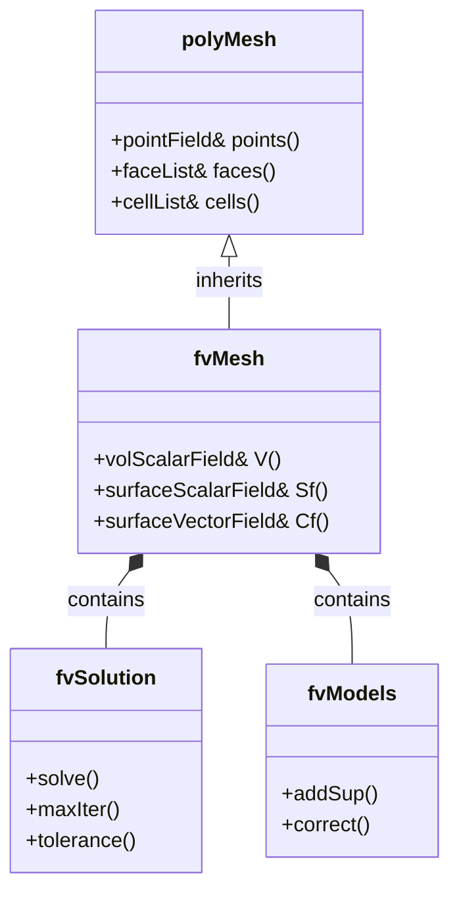
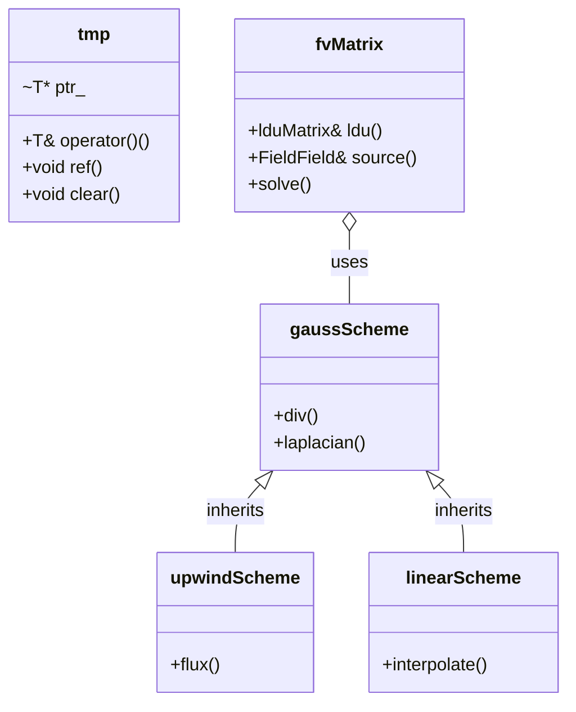
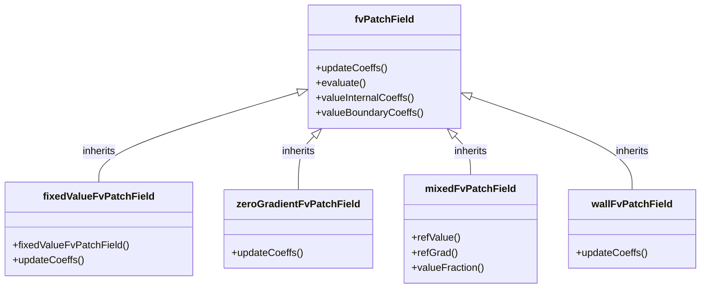
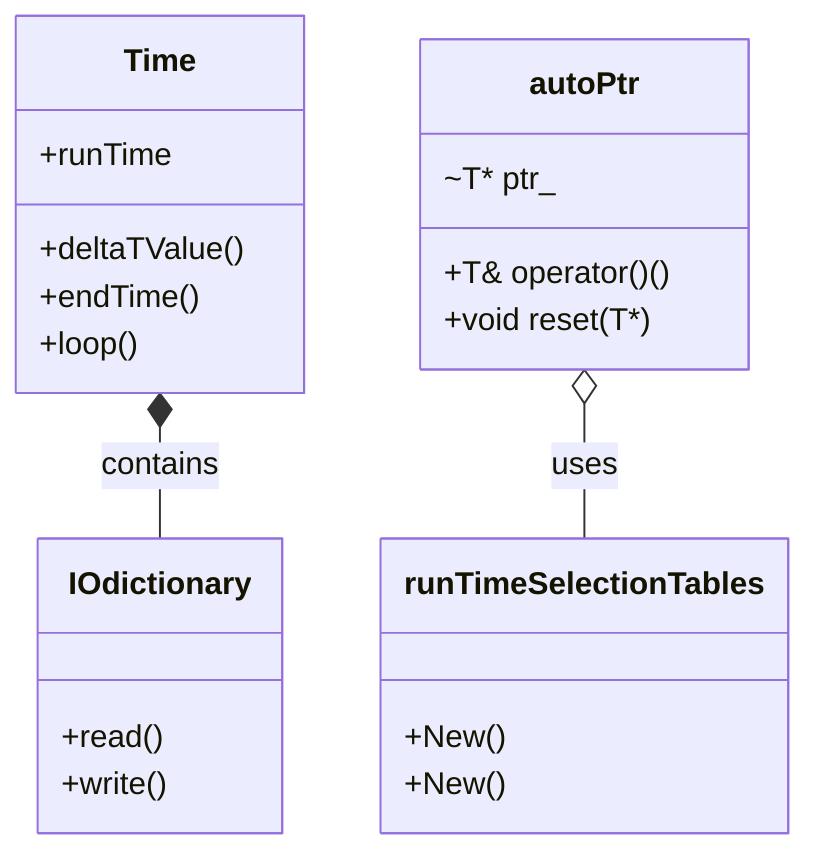

# Governing Equations & OpenFOAM Implementation
## HARDCORE Level - 2026-01-01

---

## Table of Contents
- [1. Theory](#1-theory-core-equations--physics)
- [2. Class Hierarchy](#2-openfoam-class-hierarchy--implementation)
- [3. Code Walkthrough](#3-code-walkthrough)
- [4. Dictionary Analysis](#4-dictionary-analysis--configuration)
- [5. Practical Tasks](#5-hands-on-practical-tasks--coding)
- [6. Concept Checks](#6-concept-checks)

---

## 1. Theory: Core Equations & Physics {#1-theory-core-equations--physics}

### 1.1 Conservation Laws Overview

> [!INFO] **กฎการอนุรักษ์ (Conservation Laws)**
> CFD is built on three fundamental conservation laws:
> - **Mass** (การอนุรักษ์มวล)
> - **Momentum** (การอนุรักษ์โมเมนตัม)
> - **Energy** (การอนุรักษ์พลังงาน)

---

### 1.2 Continuity Equation (Mass Conservation)

$$\frac{\partial \rho}{\partial t} + \nabla \cdot (\rho \mathbf{U}) = 0$$

Where:
- $\rho$ = density (ความหนาแน่น) [kg/m³]
- $\mathbf{U}$ = velocity vector (เวกเตอร์ความเร็ว) [m/s]
- $t$ = time (เวลา) [s]

> [!TIP] **Incompressible Flow (การไหลแบบอัดตัวไม่ได้)**
> For incompressible flows ($\rho = \text{constant}$):
> $$\nabla \cdot \mathbf{U} = 0$$

---

### 1.3 Momentum Equation (Newton's Second Law)

$$\frac{\partial (\rho \mathbf{U})}{\partial t} + \nabla \cdot (\rho \mathbf{U} \mathbf{U}) = -\nabla p + \nabla \cdot \boldsymbol{\tau} + \rho \mathbf{g}$$

Where:
- $p$ = pressure (ความดัน) [Pa]
- $\boldsymbol{\tau}$ = stress tensor (เทนเซอร์ความเค้น) [Pa]
- $\mathbf{g}$ = gravitational acceleration (ความเร่งเนื่องจากแรงโน้มถ่วง) [m/s²]

> [!WARNING] **Navier-Stokes Equations (สมการเนเวียร์-สโตกส์)**
> The momentum equation is the famous Navier-Stokes equation. For Newtonian fluids (ของไหลนิวตัน):
> $$\boldsymbol{\tau} = \mu \left[ \nabla \mathbf{U} + (\nabla \mathbf{U})^T \right] - \frac{2}{3}\mu (\nabla \cdot \mathbf{U})\mathbf{I}$$
>
> Where $\mu$ = dynamic viscosity (ความหนืด) [Pa·s]

---

### 1.4 Energy Equation (First Law of Thermodynamics)

For compressible flows with thermal effects:

$$\frac{\partial (\rho h)}{\partial t} + \nabla \cdot (\rho \mathbf{U} h) = \frac{Dp}{Dt} + \nabla \cdot (k \nabla T) + \boldsymbol{\tau} : \nabla \mathbf{U}$$

Where:
- $h$ = specific enthalpy (เอนทัลปีเฉพาะ) [J/kg]
- $k$ = thermal conductivity (สัมประสิทธิภาพการนำความร้อน) [W/(m·K)]
- $T$ = temperature (อุณหภูมิ) [K]

> [!INFO] **Simplification (การทำให้ง่ายขึ้น)**
> For isothermal flows (การไหลคงอุณหภูมิ), the energy equation can be neglected.

---

### 1.5 Transport Equation General Form

All governing equations can be written in general form:

$$\frac{\partial (\rho \phi)}{\partial t} + \nabla \cdot (\rho \mathbf{U} \phi) = \nabla \cdot (\Gamma_\phi \nabla \phi) + S_\phi$$

| Term | Mathematical Form | Physical Meaning | ความหมาย |
|------|-------------------|------------------|-----------|
| Unsteady | $\frac{\partial (\rho \phi)}{\partial t}$ | Rate of change | อัตราการเปลี่ยนแปลงเมื่อเวลาผ่านไป |
| Convection | $\nabla \cdot (\rho \mathbf{U} \phi)$ | Transport due to fluid motion | การลำเลียงเนื่องจากการเคลื่อนที่ของของไหล |
| Diffusion | $\nabla \cdot (\Gamma_\phi \nabla \phi)$ | Transport due to gradients | การลำเลียงเนื่องจากความชัน |
| Source | $S_\phi$ | Generation/destruction | แหล่งกำเนิด/การสูญสลาย |

Where $\phi$ represents the transported quantity:
- $\phi = 1$ → Continuity equation
- $\phi = \mathbf{U}$ → Momentum equation
- $\phi = h$ or $T$ → Energy equation
- $\phi = k$ → Turbulence kinetic energy (พลังงานจลน์ของความปั่นป่วน)

---

### 1.6 Equation of State

For compressible flows, we need an equation of state (สมการสถานะ):

**Ideal Gas Law (กฎของแก๊สอุดมคติ):**
$$p = \rho R T$$

Where $R$ = specific gas constant (ค่าคงที่แก๊สเฉพาะ) [J/(kg·K)]

---

### 1.7 Turbulence Modeling (การจำลองความปั่นป่วน)

> [!WARNING] **RANS Approach (วิธี RANS)**
> Direct Numerical Simulation (DNS) is too expensive for most engineering applications. Instead, we use Reynolds-Averaged Navier-Stokes (RANS):
>
> Decompose velocity into mean and fluctuating components:
> $$\mathbf{U} = \overline{\mathbf{U}} + \mathbf{U}'$$
>
> This introduces the **Reynolds stress tensor** (เทนเซอร์เค้นเรย์โนลด์):
> $$\boldsymbol{\tau}_R = -\rho \overline{\mathbf{U}' \mathbf{U}'}$$

**Common Turbulence Models (แบบจำลองความปั่นป่วนทั่วไป):**

| Model | Equations | Use Case | กรณีการใช้งาน |
|-------|-----------|----------|-----------------|
| k-ε | 2 equations | High-Re, external flows | การไหลภายนอกเลขเรย์โนลด์สูง |
| k-ω SST | 2 equations | Near-wall, adverse pressure | บริเวณใกล้ผนัง |
| Spalart-Allmaras | 1 equation | Aerodynamics | อากาศพลศาสตร์ |

**Standard k-ε Model:**
$$\frac{\partial (\rho k)}{\partial t} + \nabla \cdot (\rho \mathbf{U} k) = \nabla \cdot \left[ \left(\mu + \frac{\mu_t}{\sigma_k}\right) \nabla k \right] + P_k - \rho \epsilon$$

$$\frac{\partial (\rho \epsilon)}{\partial t} + \nabla \cdot (\rho \mathbf{U} \epsilon) = \nabla \cdot \left[ \left(\mu + \frac{\mu_t}{\sigma_\epsilon}\right) \nabla \epsilon \right] + C_{1\epsilon}\frac{\epsilon}{k}P_k - C_{2\epsilon}\rho\frac{\epsilon^2}{k}$$

Where:
- $k$ = turbulence kinetic energy (พลังงานจลน์ความปั่นป่วน) [m²/s²]
- $\epsilon$ = dissipation rate (อัตราการสลายตัว) [m²/s³]
- $\mu_t = \rho C_\mu \frac{k^2}{\epsilon}$ = eddy viscosity (ความหนืดเอ็ดดี้)

---

### 1.8 Boundary Conditions (เงื่อนไขขอบเขต)

| Type | Mathematical Form | Description | คำอธิบาย |
|------|-------------------|-------------|-----------|
| Dirichlet | $\phi = \phi_0$ | Fixed value | ค่าคงที่ |
| Neumann | $\frac{\partial \phi}{\partial n} = q_0$ | Fixed gradient | ความชันคงที่ |
| Robin | $a\phi + b\frac{\partial \phi}{\partial n} = c$ | Mixed | แบบผสม |
| Wall | $\mathbf{U} = 0$ | No-slip | ไม่มีการลื่นไถล |
| Inlet | $\mathbf{U} = \mathbf{U}_{in}$ | Prescribed velocity | กำหนดความเร็ว |
| Outlet | $\frac{\partial \mathbf{U}}{\partial n} = 0$ | Zero gradient | ความชันเป็นศูนย์ |

---

### 1.9 Dimensionless Numbers (จำนวนไร้มิติ)

**Reynolds Number (เลขเรย์โนลด์ส):**
$$Re = \frac{\rho U L}{\mu} = \frac{U L}{\nu}$$

> Ratio of inertial to viscous forces (อัตราส่วนของแรงเฉื่อยต่อแรงหนืด)

**Mach Number (เลขมัค):**
$$Ma = \frac{U}{c}$$

> Ratio of flow velocity to speed of sound (อัตราส่วนของความเร็วการไหลต่อความเร็วเสียง)

**Prandtl Number (เลขพรานด์ทล์):**
$$Pr = \frac{c_p \mu}{k}$$

> Ratio of momentum diffusivity to thermal diffusivity (อัตราส่วนของการแพร่ของโมเมนตัมต่อการแพร่ของความร้อน)

---

## 2. OpenFOAM Class Hierarchy & Implementation {#2-openfoam-class-hierarchy--implementation}

### 2.1 Core Field Classes (คลาสพื้นฐานสำหรับเขตข้อมูล)

OpenFOAM uses a hierarchical class structure to represent fields (mesh-associated data).

```
GeometricField
├── DimensionedField (no mesh)
├── VolField (cell-centered)
│   ├── volScalarField
│   ├── volVectorField
│   └── volTensorField
└── SurfaceField (face-centered)
    ├── surfaceScalarField
    └── surfaceVectorField
```

> [!INFO] **Field Types (ประเภทของเขตข้อมูล)**
> - **VolField**: Data stored at cell centers (ใช้สำหรับ finite volume method)
> - **SurfaceField**: Data stored at cell faces (ใช้สำหรับ flux calculations)

**Key Source Files:**
- `$FOAM_SRC/finiteVolume/fields/volFields/volFields.H`
- `$FOAM_SRC/finiteVolume/fields/surfaceFields/surfaceFields.H`
- `$FOAM_SRC/OpenFOAM/fields/GeometricField/GeometricField.C`

---

### 2.2 fvMesh & Finite Volume Framework

The `fvMesh` class is the core of OpenFOAM's finite volume implementation.



**Key Source Files:**
- `$FOAM_SRC/finiteVolume/fields/fvMesh/fvMesh.H`
- `$FOAM_SRC/finiteVolume/fvSolution/fvSolution.H`
- `$FOAM_SRC/finiteVolume/fvMesh/fvMesh.C`

> [!TIP] **Mesh Access (การเข้าถึงข้อมูลเมช)**
> ```cpp
> // Access mesh properties
> const volScalarField& V = mesh.V();           // Cell volumes
> const surfaceScalarField& Sf = mesh.Sf();     // Face area vectors
> const surfaceVectorField& Cf = mesh.Cf();     // Face centers
> ```

---

### 2.3 Discretization Schemes (รูปแบบการกระจาย)

OpenFOAM uses a flexible scheme system for discretizing derivatives.



**Key Source Files:**
- `$FOAM_SRC/finiteVolume/finiteVolume/fvSchemes/fvSchemes.C`
- `$FOAM_SRC/finiteVolume/interpolation/surfaceInterpolation/surfaceInterpolationScheme/surfaceInterpolationScheme.H`
- `$FOAM_SRC/finiteVolume/fvMatrices/fvMatrix/fvMatrix.C`

> [!WARNING] **Scheme Selection (การเลือกรูปแบบการกระจาย)**
> Schemes are specified in `system/fvSchemes` dictionary:
> ```foam
> divSchemes
> {
>     default         Gauss upwind;
>     div(phi,U)      Gauss linearUpwind grad(U);
> }
> 
> laplacianSchemes
> {
>     default         Gauss linear corrected;
> }
> ```

---

### 2.4 Linear Solver Classes (คลาสแก้สมการเชิงเส้น)

OpenFOAM provides various linear solvers for the matrix systems.

```
lduMatrix (sparse matrix storage)
├── solvers
│   ├── GAMG (Geometric-Algebraic Multi-Grid)
│   ├── PCG (Preconditioned Conjugate Gradient)
│   ├── PBiCGStab (Preconditioned Bi-Conjugate Gradient Stabilized)
│   └── smoothSolver
└── preconditioners
    ├── DIC (Diagonal Incomplete Cholesky)
    ├── DILU (Diagonal Incomplete LU)
    └── GAMG
```

**Key Source Files:**
- `$FOAM_SRC/OpenFOAM/matrices/lduMatrix/lduMatrix.H`
- `$FOAM_SRC/OpenFOAM/matrices/lduMatrix/solvers/`
- `$FOAM_SRC/OpenFOAM/matrices/lduMatrix/preconditioners/`

> [!INFO] **Solver Configuration (การตั้งค่าตัวแก้สมการ)**
> Specified in `system/fvSolution`:
> ```foam
> solvers
> {
>     p
>     {
>         solver          GAMG;
>         tolerance       1e-06;
>         relTol          0.1;
>         smoother        GaussSeidel;
>     }
>     
>     U
>     {
>         solver          PBiCGStab;
>         preconditioner  DILU;
>         tolerance       1e-05;
>         relTol          0.1;
>     }
> }
> ```

---

### 2.5 Boundary Condition Classes (คลาสเงื่อนไขขอบเขต)

Boundary conditions are implemented through a class hierarchy.



**Key Source Files:**
- `$FOAM_SRC/finiteVolume/fields/fvPatchFields/fvPatchField/fvPatchField.H`
- `$FOAM_SRC/finiteVolume/fields/fvPatchFields/basic/`
- `$FOAM_SRC/finiteVolume/fields/fvPatchFields/constraint/`

> [!TIP] **Common BCs (เงื่อนไขขอบเขตทั่วไป)**
> ```cpp
> // Fixed value (Dirichlet)
> inlet
> {
>     type            fixedValue;
>     value           uniform (10 0 0);
> }
> 
> // Zero gradient (Neumann)
> outlet
> {
>     type            zeroGradient;
> }
> 
> // Wall function
> wall
> {
>     type            wall;
>     nut             kqRWallFunction;
>     value           uniform 0;
> }
> ```

---

### 2.6 Turbulence Modeling Classes (คลาสการจำลองความปั่นป่วน)

Turbulence models follow a modular design pattern.

```
turbulenceModel (abstract base)
├── RASModel (Reynolds-Averaged Simulation)
│   ├── kEpsilon
│   ├── kOmegaSST
│   └── SpalartAllmaras
├── LESModel (Large Eddy Simulation)
│   ├── Smagorinsky
│   └── WALE
└── laminar
```

**Key Source Files:**
- `$FOAM_SRC/turbulenceModels/turbulenceModels/turbulenceModel.H`
- `$FOAM_SRC/turbulenceModels/turbulenceModels/RAS/RASModel.H`
- `$FOAM_SRC/turbulenceModels/turbulenceModels/LES/LESModel.H`

> [!WARNING] **Model Selection (การเลือกแบบจำลอง)**
> Specified in `constant/turbulenceProperties`:
> ```foam
> simulationType  RAS;
> 
> RAS
> {
>     RASModel        kEpsilon;
>     
>     turbulence      on;
>     
>     printCoeffs     on;
> }
> ```

---

### 2.7 Time & RunTime Selection Classes

OpenFOAM uses the Runtime Selection Tables for dynamic object creation.



**Key Source Files:**
- `$FOAM_SRC/OpenFOAM/db/Time/Time.H`
- `$FOAM_SRC/OpenFOAM/db/IOobjects/IOdictionary/IOdictionary.H`
- `$FOAM_SRC/OpenFOAM/memory/autoPtr/autoPtr.H`

> [!INFO] **Runtime Selection (การเลือกขณะรันไทม์)**
> ```cpp
> // Dynamic object creation
> autoPtr<incompressible::turbulenceModel> turbulence
> (
>     incompressible::turbulenceModel::New(U, phi, laminarTransport)
> );
> ```

---

### 2.8 Summary of Key Classes

| Class | Purpose | Source Location |
|-------|---------|-----------------|
| `fvMesh` | Finite volume mesh | `$FOAM_SRC/finiteVolume/fields/fvMesh/` |
| `volScalarField` | Cell-centered scalar field | `$FOAM_SRC/finiteVolume/fields/volFields/` |
| `volVectorField` | Cell-centered vector field | `$FOAM_SRC/finiteVolume/fields/volFields/` |
| `surfaceScalarField` | Face-centered scalar field | `$FOAM_SRC/finiteVolume/fields/surfaceFields/` |
| `fvMatrix` | Discretized equation matrix | `$FOAM_SRC/finiteVolume/fvMatrices/` |
| `fvPatchField` | Boundary condition base | `$FOAM_SRC/finiteVolume/fields/fvPatchFields/` |
| `turbulenceModel` | Turbulence model base | `$FOAM_SRC/turbulenceModels/` |
| `Time` | Time control | `$FOAM_SRC/OpenFOAM/db/Time/` |

> [!TIP] **Navigation Tip (เคล็ดลับการนำทาง)**
> Use `find` and `grep` to locate classes:
> ```bash
> # Find class definition
> find $FOAM_SRC -name "*.H" | xargs grep -l "class fvMesh"
> 
> # Find implementation
> find $FOAM_SRC -name "*.C" | xargs grep -l "fvMesh::"
> ```

---

## 3. Code Walkthrough {#3-code-walkthrough}

### 3.1 UEqn.H

> [!INFO] **สมการโมเมนตัม (Momentum Equation)**
> UEqn.H กำหนดสมการโมเมนตัมแบบไม่บีบอัดสำหรับการแก้ปัญหาเชิงตัวเลข โดยใช้ finite volume method

**Key Code Structure:**

```cpp
// Momentum equation matrix assembly
tmp<fvVectorMatrix> UEqn
(
    fvm::div(phi, U)           // Convection term: ∇·(UU)
  + fvm::laplacian(nu, U)      // Diffusion term: ∇·(ν∇U)
  + fvc::div(phi, T)           // Optional: turbulence contribution
);

// Source term (pressure gradient)
UEqn.relax();

if (piso.momentumPredictor())
{
    solve(UEqn == -fvc::grad(p));  // Solve with pressure gradient
}
```

> [!TIP] **คำอธิบาย (Explanation)**
> - **fvm** (finite volume method): สร้างเมทริกซ์สำหรับ implicit terms
> - **fvc** (finite volume calculus): คำนวณ explicit terms โดยตรง
> - **phi**: คือ flux field [m³/s] คำนวณจาก `phi = U·Sf`
> - **relax()**: ใช้ under-relaxation เพื่อเสถียรภาพการคำนวณ
> - **momentumPredictor**: ควบคุมว่าจะแก้สมการโมเมนตัมหรือไม่

**Pressure-Velocity Coupling:**

```cpp
// PISO loop for pressure-velocity coupling
while (piso.correct())
{
    volScalarField rUA = 1.0/UEqn.A();  // Reciprocal of diagonal
    
    // Pressure equation
    fvScalarMatrix pEqn
    (
        fvm::laplacian(rUA, p) == fvc::div(phi)
    );
    
    pEqn.solve();
    
    // Correct velocity
    U -= rUA*fvc::grad(p);
    U.correctBoundaryConditions();
}
```

> [!WARNING] **ข้อควรระวัง**
> การเลือก discretization scheme ใน `div(phi,U)` ส่งผลต่อความเสถียร:
> - **upwind**: เสถียรแต่ diffusive (เหมาะสำหรับเริ่มต้น)
> - **linear**: แม่นยำแต่อาจไม่เสถียรเมื่อ Re สูง
> - **linearUpwind**: สมดุลระหว่างความแม่นยำและเสถียรภาพ

---

### 3.2 pEqn.H

> [!INFO] **สมการความดัน (Pressure Equation)**
> pEqn.H แก้สมการความดันเพื่อบังคับให้ได้รักษาสมการต่อเนื่อง (continuity equation) โดยใช้ pressure-velocity coupling algorithm

**Key Code Structure:**

```cpp
// Pressure equation matrix assembly
volScalarField rUA = 1.0/UEqn.A();  // Reciprocal of diagonal coefficients

// Pressure Poisson equation
fvScalarMatrix pEqn
(
    fvm::laplacian(rUA, p) == fvc::div(phi)  // ∇·(1/A ∇p) = ∇·U*
);

pEqn.setReference(pRefCell, pRefValue);  // Fix reference pressure
pEqn.solve();

// Correct flux and velocity
phi -= pEqn.flux();                       // φ = φ* - (1/A)∇p
U -= rUA*fvc::grad(p);                    // U = U* - (1/A)∇p
U.correctBoundaryConditions();
```

> [!TIP] **คำอธิบาย (Explanation)**
> - **rUA**: ค่าผกผันของสัมประสิทธิ์เชิงเส้น ใช้ปรับความดันให้สอดคล้องกับความเร็ว
> - **laplacian(rUA, p)**: ด้านซ้ายของสมการ Poisson สำหรับความดัน
> - **div(phi)**: ด้านขวา คือ divergence ของ flux ที่ทำนายจากสมการโมเมนตัม
> - **setReference()**: กำหนดค่าอ้างอิงเพื่อป้องกันปัญหา pressure drift
> - **flux()**: คำนวณการแก้ไข flux จาก gradient ของความดัน

**PISO Algorithm Loop:**

```cpp
// PISO corrections for non-orthogonal meshes
for (int corr = 0; corr < nCorr; corr++)
{
    // Reconstruct pressure equation
    fvScalarMatrix pEqn
    (
        fvm::laplacian(rUA, p) == fvc::div(phi)
    );
    
    pEqn.setReference(pRefCell, pRefValue);
    pEqn.solve();
    
    // Correct flux multiple times for better convergence
    if (corr == nCorr-1)
    {
        phi -= pEqn.flux();
    }
}
```

> [!WARNING] **ข้อควรระวัง**
> การเลือกค่า **nCorr** (number of correctors) ส่งผลต่อ:
> - **nCorr = 1-2**: เร็วแต่อาจไม่收敛ดีสำหรับ non-orthogonal meshes
> - **nCorr = 3-4**: สมดุลระหว่างความเร็วและความแม่นยำ
> - **nNonOrthCorr**: จำนวนรอบย่อยสำหรับ meshes ที่ไม่ orthogonal

### 3.3 createFields.H

> [!INFO] **การสร้างเขตข้อมูล (Field Creation)**
> createFields.H สร้างและเริ่มต้นเขตข้อมูลทั้งหมดที่จำเป็นสำหรับการแก้ปัญหา รวมถึงการอ่านค่าจากไฟล์คอนฟิกูเรชัน

**Key Code Structure:**

```cpp
// Read transport properties (viscosity)
IOdictionary transportProperties
(
    IOobject
    (
        "transportProperties",
        runTime.constant(),
        mesh,
        IOobject::MUST_READ_IF_MODIFIED,
        IOobject::NO_WRITE
    )
);

dimensionedScalar nu
(
    "nu",
    dimViscosity,
    transportProperties
);

// Create velocity field
volVectorField U
(
    IOobject
    (
        "U",
        runTime.timeName(),
        mesh,
        IOobject::MUST_READ,
        IOobject::AUTO_WRITE
    ),
    mesh
);

// Create pressure field
volScalarField p
(
    IOobject
    (
        "p",
        runTime.timeName(),
        mesh,
        IOobject::MUST_READ,
        IOobject::AUTO_WRITE
    ),
    mesh
);

// Calculate flux field: φ = U·Sf
surfaceScalarField phi
(
    IOobject
    (
        "phi",
        runTime.timeName(),
        mesh,
        IOobject::READ_IF_PRESENT,
        IOobject::AUTO_WRITE
    ),
    fvc::flux(U)
);
```

> [!TIP] **คำอธิบาย (Explanation)**
> - **IOdictionary**: อ่านค่าคุณสมบัติการขนส่งจาก `constant/transportProperties`
> - **nu**: ความหนืดจลน์ (kinematic viscosity) [m²/s]
> - **volVectorField U**: เขตข้อมูลความเร็วที่จุดกลางเซลล์ อ่านจาก `0/U`
> - **volScalarField p**: เขตข้อมูลความดันที่จุดกลางเซลล์ อ่านจาก `0/p`
> - **surfaceScalarField phi**: Flux ที่ผิวเซลล์ คำนวณจาก `fvc::flux(U)`
> - **MUST_READ_IF_MODIFIED**: อ่านใหม่ถ้าไฟล์ถูกแก้ไขขณะรัน
> - **AUTO_WRITE**: บันทึกผลลัพธ์อัตโนมัติเมื่อเสร็จสิ้น time step

> [!WARNING] **ข้อควรระวัง**
> การเรียงลำดับของการสร้างเขตข้อมูลมีความสำคัญ:
> 1. ต้องอ่าน `transportProperties` ก่อนเพื่อให้ได้ค่า `nu`
> 2. `phi` ต้องคำนวณจาก `U` ดังนั้น `U` ต้องถูกสร้างก่อน
> 3. ถ้า `phi` มีอยู่แล้วในไฟล์ `0/phi` จะถูกอ่านแทนการคำนวณใหม่

---

## 4. Dictionary Analysis & Configuration {#4-dictionary-analysis--configuration}

### 4.1 fvSchemes Analysis

> [!INFO] **การตั้งค่ารูปแบบการกระจาย (Discretization Schemes Configuration)**
> ไฟล์ `system/fvSchemes` กำหนดวิธีการประมาณค่าเชิงอนุพันธ์ในสมการเชิงอนุพันธ์ ซึ่งมีผลต่อความแม่นยำและความเสถียรของการคำนวณ

#### 4.1.1 ddtSchemes (Temporal Discretization)

**การกระจายเชิงเวลา (Time Derivative Schemes)**

รูปแบบการประมาณค่าอนุพันธ์เชิงเวลา $\frac{\partial \phi}{\partial t}$:

```foam
ddtSchemes
{
    default         Euler;
}
```

| Scheme | Order | Stability | คำอธิบาย |
|--------|-------|-----------|-----------|
| **Euler** | 1st | Conditional | ช้าแต่เสถียร ใช้ deltaT ขนาดเล็ก |
| **backward** | 2nd | Conditional | แม่นยำกว่า แต่ต้องเก็บข้อมูล time step ก่อนหน้า |
| **CrankNicolson** | 2nd | Unconditional | แม่นยำและเสถียร แต่ใช้หน่วยความจำมาก |

> [!TIP] **ข้อแนะนำ**
> - เริ่มต้นด้วย **Euler** สำหรับการทดสอบ
> - ใช้ **backward** หรือ **CrankNicolson** สำหรับการผลิตผลลัพธ์สุดท้าย

---

#### 4.1.2 gradSchemes (Gradient Discretization)

**การกระจายเชิงความชัน (Gradient Schemes)**

รูปแบบการประมาณค่าเกรเดียนต์ $\nabla \phi$:

```foam
gradSchemes
{
    default         Gauss linear;
    
    grad(p)         Gauss linear;
    grad(U)         Gauss linear;
}
```

| Scheme | Order | Accuracy | คำอธิบาย |
|--------|-------|----------|-----------|
| **Gauss linear** | 2nd | Good | ใช้ interpolation เชิงเส้นระหว่างเซลล์ |
| **Gauss linearUpwind** | 2nd | Better | ป้องกัน oscillations สำหรับฟิลด์ที่มีความชันสูง |
| **leastSquares** | 2nd | Good | ใช้ least squares method ไม่ sensitive ต่อ mesh quality |
| **fourth** | 4th | Excellent | ความแม่นยำสูง แต่ต้องการ mesh ที่ดี |

> [!WARNING] **ข้อควรระวัง**
> - **Gauss linear** อาจเกิด unbounded oscillations บน meshes ที่ไม่สม่ำเสมอ
> - ใช้ **cellLimited** หรือ **faceLimited** เพื่อป้องกันค่าที่เกินขอบเขต

---

#### 4.1.3 divSchemes (Divergence Discretization)

**การกระจายเชิงไดเวอร์เจนซ์ (Divergence Schemes)**

รูปแบบการประมาณค่า divergence $\nabla \cdot (\rho \mathbf{U} \phi)$:

```foam
divSchemes
{
    default         none;
    
    div(phi,U)      Gauss upwind;
    div(phi,k)      Gauss upwind;
    div(phi,epsilon) Gauss upwind;
    div(phi,R)      Gauss upwind;
    div((nuEff*dev2(T(grad(U))))) Gauss linear;
}
```

| Scheme | Order | Stability | Diffusion | คำอธิบาย |
|--------|-------|-----------|-----------|-----------|
| **upwind** | 1st | Excellent | High | เสถียรมาก แต่มี numerical diffusion สูง |
| **linear** | 2nd | Poor | None | แม่นยำ แต่ไม่เสถียรเมื่อ Re สูง |
| **linearUpwind** | 2nd | Good | Low | สมดุลระหว่างความแม่นยำและความเสถียร |
| **QUICK** | 3rd | Fair | Low | แม่นยำสูง ใช้กับ structured meshes |
| **limitedLinear** | 2nd | Good | Adjustable | ใช้ limiter เพื่อป้องกัน oscillations |

> [!TIP] **ข้อแนะนำ**
> - ใช้ **upwind** สำหรับ turbulence quantities (k, ε, ω)
> - ใช้ **linearUpwind** หรือ **limitedLinear** สำหรับ velocity (U)
> - ใช้ **linear** สำหรับ diffusion terms เช่น laplacian

---

#### 4.1.4 laplacianSchemes (Laplacian Discretization)

**การกระจายเชิงลาปลาซ (Laplacian Schemes)**

รูปแบบการประมาณค่า Laplacian $\nabla \cdot (\Gamma \nabla \phi)$:

```foam
laplacianSchemes
{
    default         Gauss linear corrected;
}
```

| Scheme | Order | Orthogonality | คำอธิบาย |
|--------|-------|---------------|-----------|
| **Gauss linear** | 2nd | Required | ใช้ corrected interpolation สำหรับ non-orthogonal meshes |
| **Gauss linear corrected** | 2nd | Non-orthogonal | มี correction term สำหรับ meshes ที่ไม่ orthogonal |
| **Gauss linear uncorrected** | 2nd | Orthogonal | เร็วกว่า แต่ต้องการ orthogonal meshes |
| **Gauss cubic** | 4th | Required | ความแม่นยำสูง แต่ใช้เวลานาน |

> [!WARNING] **ข้อควรระวัง**
> - **corrected** จำเป็นสำหรับ meshes ที่มี non-orthogonality > 70°
> - การใช้ **uncorrected** บน non-orthogonal meshes อาจทำให้การแก้ปัญหาไม่收敛

---

#### 4.1.5 interpolationSchemes

**การกระจายเชิงอินเตอร์โพเลชัน (Interpolation Schemes)**

รูปแบบการประมาณค่าจาก cell center ไปยัง face center:

```foam
interpolationSchemes
{
    default         linear;
}
```

| Scheme | Order | คำอธิบาย |
|--------|-------|-----------|
| **linear** | 2nd | ใช้ centroid interpolation |
| **cubic** | 4th | ใช้ cubic interpolation แม่นยำกว่า |
| **upwind** | 1st | ใช้ upwind interpolation สำหรับ convection-dominated flows |

---

#### 4.1.6 snGradSchemes (Surface Normal Gradient)

**การกระจายเชิงเกรเดียนต์ปกติผิว (Surface Normal Gradient Schemes)**

รูปแบบการประมาณค่าเกรเดียนต์ตั้งฉากผิว $\frac{\partial \phi}{\partial n}$:

```foam
snGradSchemes
{
    default         corrected;
}
```

| Scheme | คำอธิบาย |
|--------|-----------|
| **corrected** | มี non-orthogonality correction |
| **uncorrected** | ไม่มี correction ใช้กับ orthogonal meshes เท่านั้น |

---

#### 4.1.7 Example Configuration

**ตัวอย่างการตั้งค่า fvSchemes ที่ดี:**

```foam
FoamFile
{
    version     2.0;
    format      ascii;
    class       dictionary;
    location    "system";
    object      fvSchemes;
}
// * * * * * * * * * * * * * * * * * * * * * * * * * * * * * * * * * * * * * //

ddtSchemes
{
    default         Euler;
}

gradSchemes
{
    default         Gauss linear;
    
    grad(p)         Gauss linear;
    grad(U)         cellLimited Gauss linear 1;
}

divSchemes
{
    default         none;
    
    div(phi,U)      Gauss limitedLinear 1;
    div(phi,k)      Gauss upwind;
    div(phi,epsilon) Gauss upwind;
    div((nuEff*dev2(T(grad(U))))) Gauss linear;
}

laplacianSchemes
{
    default         Gauss linear corrected;
}

interpolationSchemes
{
    default         linear;
}

snGradSchemes
{
    default         corrected;
}

// ************************************************************************* //
```

> [!TIP] **คำอธิบาย**
> - **cellLimited Gauss linear 1**: ใช้ limiter เพื่อป้องกัน oscillations
> - **limitedLinear 1**: ใช้ limiter สำหรับ convection term
> - **corrected**: ใช้ correction สำหรับ non-orthogonal meshes

---

### 4.2 fvSolution Analysis

> [!INFO] **การตั้งค่าตัวแก้สมการและการผ่อนคลาย (Solver & Relaxation Configuration)**
> ไฟล์ `system/fvSolution` กำหนดวิธีการแก้สมการเชิงเส้น ค่าความอดทน และปัจจัยการผ่อนคลายสำหรับแต่ละเขตข้อมูล

#### 4.2.1 solvers (Linear Solver Configuration)

**การตั้งค่าตัวแก้สมการเชิงเส้น (Linear Solvers)**

รูปแบบการตั้งค่าตัวแก้สมการสำหรับแต่ละตัวแปร:

```foam
solvers
{
    p
    {
        solver          GAMG;
        tolerance       1e-06;
        relTol          0.1;
        smoother        GaussSeidel;
    }
    
    pFinal
    {
        $p;
        relTol          0;
    }
    
    U
    {
        solver          PBiCGStab;
        preconditioner  DILU;
        tolerance       1e-05;
        relTol          0.1;
    }
}
```

| Parameter | คำอธิบาย |
|-----------|-----------|
| **solver** | อัลกอริทึมการแก้สมการ (GAMG, PCG, PBiCGStab, smoothSolver) |
| **tolerance** | ความอดทนสัมบูรณ์ (absolute tolerance) |
| **relTol** | ความอดทนสัมพัทธ์ (relative tolerance) |
| **preconditioner** | ตัว preconditioner (DIC, DILU, GAMG) |
| **smoother** | ตัว smoother สำหรับ GAMG (GaussSeidel, symGaussSeidel) |

> [!TIP] **ข้อแนะนำ**
> - ใช้ **GAMG** สำหรับสมการสเกลาร์ เช่น ความดัน (p) เพราะเร็วกว่าสำหรับ meshes ขนาดใหญ่
> - ใช้ **PBiCGStab** สำหรับสมการเวกเตอร์ เช่น ความเร็ว (U)
> - ใช้ **pFinal** พร้อม `relTol 0` เพื่อบังคับ收敛สมบูรณ์ใน time step สุดท้าย

---

#### 4.2.2 Solver Algorithms

**อัลกอริทึมการแก้สมการ (Solver Algorithms)**

| Solver | Type | Use Case | คำอธิบาย |
|--------|------|----------|-----------|
| **GAMG** | Geometric-Algebraic Multi-Grid | Large meshes, scalar fields | ใช้ multigrid ลดขนาดปัญหาเรื่อยๆ จึงเร็วมาก |
| **PCG** | Preconditioned Conjugate Gradient | Symmetric matrices | สำหรับสมการสมมาตร เช่น diffusion |
| **PBiCGStab** | Preconditioned Bi-Conjugate Gradient Stabilized | Non-symmetric matrices | สำหรับสมการไม่สมมาตร เช่น convection |
| **smoothSolver** | Iterative smoother | Small to medium meshes | ใช้ smoother เช่น Gauss-Seidel แก้โดยตรง |

> [!WARNING] **ข้อควรระวัง**
> - **GAMG** ต้องการหน่วยความจำมากกว่า solvers อื่น
> - **PBiCGStab** อาจไม่收敛สำหรับปัญหาที่มี convection หนักมาก
> - ค่า **tolerance** ต่ำเกินไป (เช่น 1e-10) อาจทำให้ใช้เวลานานโดยไม่จำเป็น

---

#### 4.2.3 Preconditioners

**ตัว preconditioner (ตัวเร่งการ收敛)**

| Preconditioner | Type | Use Case | คำอธิบาย |
|----------------|------|----------|-----------|
| **DIC** | Diagonal Incomplete Cholesky | Symmetric matrices | สำหรับ PCG ใช้กับสมการสมมาตร |
| **DILU** | Diagonal Incomplete LU | Non-symmetric matrices | สำหรับ PBiCGStab ใช้กับสมการไม่สมมาตร |
| **GAMG** | Geometric-Algebraic Multi-Grid | Large systems | ใช้เป็น preconditioner สำหรับ GAMG solver |

> [!TIP] **ข้อแนะนำ**
> - ใช้ **DIC** ร่วมกับ **PCG** สำหรับสมการ diffusion
> - ใช้ **DILU** ร่วมกับ **PBiCGStab** สำหรับสมการ convection-diffusion
> - สำหรับ meshes ที่มี non-orthogonality สูง อาจต้องใช้ preconditioner ที่แข็งแรงกว่า

---

#### 4.2.4 relaxationFactors (Under-Relaxation)

**ปัจจัยการผ่อนคลาย (Under-Relaxation Factors)**

รูปแบบการตั้งค่าปัจจัยการผ่อนคลาย:

```foam
relaxationFactors
{
    fields
    {
        p               0.3;
        rho             0.05;
    }
    
    equations
    {
        U               0.7;
        k               0.7;
        epsilon         0.7;
    }
}
```

| Variable | Typical Range | คำอธิบาย |
|----------|---------------|-----------|
| **p** | 0.2 - 0.5 | ความดัน: ผ่อนคลายมากเพื่อเสถียรภาพ |
| **U** | 0.5 - 0.8 | ความเร็ว: ผ่อนคลายปานกลาง |
| **k, ε, ω** | 0.5 - 0.8 | ความปั่นป่วน: ผ่อนคลายปานกลาง |
| **rho** | 0.02 - 0.1 | ความหนาแน่น: ผ่อนคลายมากสำหรับ compressible flows |

> [!INFO] **หลักการทำงาน**
> Under-relaxation ใช้สูตร:
> $$\phi^{new} = \phi^{old} + \alpha (\phi^{calc} - \phi^{old})$$
>
> โดยที่ $\alpha$ คือ relaxation factor:
> - $\alpha = 1$: ไม่มีการผ่อนคลาย (ใช้ค่าใหม่ทั้งหมด)
> - $\alpha < 1$: มีการผ่อนคลาย (ใช้ค่าเก่าผสมค่าใหม่)
> - $\alpha$ เล็ก: เสถียรกว่า แต่收敛ช้ากว่า

> [!WARNING] **ข้อควรระวัง**
> - ค่า **alpha** ต่ำเกินไป (เช่น 0.1) อาจทำให้การ收敛ช้ามาก
> - ค่า **alpha** สูงเกินไป (เช่น 1.0) อาจทำให้การคำนวณไม่เสถียร
> - สำหรับ compressible flows ต้องผ่อนคลาย **rho** มากเพื่อป้องกัน oscillations

---

#### 4.2.5 PISO / SIMPLE / PIMPLE

**อัลกอริทึม pressure-velocity coupling**

```foam
PISO
{
    nCorrectors     2;
    nNonOrthogonalCorrectors 0;
    pRefCell        0;
    pRefValue       0;
}
```

| Parameter | คำอธิบาย |
|-----------|-----------|
| **nCorrectors** | จำนวนรอบ PISO corrections (1-4) |
| **nNonOrthogonalCorrectors** | จำนวนรอบ corrections สำหรับ non-orthogonal meshes |
| **pRefCell** | Cell ที่ใช้อ้างอิงความดัน |
| **pRefValue** | ค่าความดันอ้างอิงที่ cell ดังกล่าว |

> [!TIP] **ข้อแนะนำ**
> - **PISO**: สำหรับ transient flows ใช้ nCorrectors = 2-3
> - **SIMPLE**: สำหรับ steady-state flows ใช้ nCorrectors = 1 แต่ต้องผ่อนคลายมาก
> - **PIMPLE**: ผสม PISO + SIMPLE สำหรับ transient ที่ต้องการเสถียรภาพสูง
> - **nNonOrthogonalCorrectors**: เพิ่มเมื่อ mesh มี non-orthogonality > 70°

---

#### 4.2.6 Example Configuration

**ตัวอย่างการตั้งค่า fvSolution ที่ดี:**

```foam
FoamFile
{
    version     2.0;
    format      ascii;
    class       dictionary;
    location    "system";
    object      fvSolution;
}
// * * * * * * * * * * * * * * * * * * * * * * * * * * * * * * * * * * * * * //

solvers
{
    p
    {
        solver          GAMG;
        tolerance       1e-06;
        relTol          0.1;
        smoother        GaussSeidel;
        nPreSweeps      0;
        nPostSweeps     2;
        cacheAgglomeration on;
        agglomerator    faceAreaPair;
        mergeLevels     1;
    }
    
    pFinal
    {
        $p;
        relTol          0;
    }
    
    U
    {
        solver          PBiCGStab;
        preconditioner  DILU;
        tolerance       1e-05;
        relTol          0.1;
    }
    
    k
    {
        solver          PBiCGStab;
        preconditioner  DILU;
        tolerance       1e-05;
        relTol          0.1;
    }
    
    epsilon
    {
        solver          PBiCGStab;
        preconditioner  DILU;
        tolerance       1e-05;
        relTol          0.1;
    }
}

relaxationFactors
{
    fields
    {
        p               0.3;
    }
    
    equations
    {
        U               0.7;
        k               0.7;
        epsilon         0.7;
    }
}

PISO
{
    nCorrectors     2;
    nNonOrthogonalCorrectors 1;
    pRefCell        0;
    pRefValue       0;
}

// ************************************************************************* //
```

> [!TIP] **คำอธิบาย**
> - **cacheAgglomeration on**: เก็บข้อมูล agglomeration ไว้ใช้รอบถัดไป เพื่อเร่งความเร็ว
> - **agglomerator faceAreaPair**: ใช้ face area เป็นเกณฑ์รวมเซลล์
> - **nPostSweeps 2**: ทำ smoothing 2 ครั้งหลัง coarse grid correction
> - **nNonOrthogonalCorrectors 1**: ใช้ correction 1 รอบสำหรับ meshes ที่ไม่ orthogonal เล็กน้อย

---

## 5. Hands-on: Practical Tasks & Coding {#5-hands-on-practical-tasks--coding}

### Task 1: Implement Custom Convection-Diffusion Solver

> [!INFO] **Objective**
> Create a custom solver for the steady-state convection-diffusion equation:
> $$\nabla \cdot (\rho \mathbf{U} T) = \nabla \cdot (\Gamma \nabla T) + S_T$$
>
> This exercise demonstrates how to:
> 1. Assemble a finite volume matrix equation
> 2. Use implicit (fvm) and explicit (fvc) discretization
> 3. Apply boundary conditions and solve the system

**Solution:**

Create file `applications/solvers/myConvectionDiffusion/myConvectionDiffusion.C`:

```cpp
#include "fvCFD.H"
#include "singlePhaseTransportModel.H"
#include "turbulentTransportModel.H"

int main(int argc, char *argv[])
{
    #include "setRootCaseLists.H"
    #include "createTime.H"
    #include "createMesh.H"
    
    // Create transport properties dictionary
    IOdictionary transportProperties
    (
        IOobject
        (
            "transportProperties",
            runTime.constant(),
            mesh,
            IOobject::MUST_READ_IF_MODIFIED,
            IOobject::NO_WRITE
        )
    );
    
    // Read diffusion coefficient
    dimensionedScalar DT
    (
        "DT",
        dimViscosity,
        transportProperties
    );
    
    // Create scalar field T
    volScalarField T
    (
        IOobject
        (
            "T",
            runTime.timeName(),
            mesh,
            IOobject::MUST_READ,
            IOobject::AUTO_WRITE
        ),
        mesh
    );
    
    // Create velocity field (read from 0/U)
    volVectorField U
    (
        IOobject
        (
            "U",
            runTime.timeName(),
            mesh,
            IOobject::MUST_READ,
            IOobject::AUTO_WRITE
        ),
        mesh
    );
    
    // Create flux field
    surfaceScalarField phi
    (
        IOobject
        (
            "phi",
            runTime.timeName(),
            mesh,
            IOobject::READ_IF_PRESENT,
            IOobject::AUTO_WRITE
        ),
        fvc::flux(U)
    );
    
    // Source term (optional)
    volScalarField ST
    (
        IOobject
        (
            "ST",
            runTime.timeName(),
            mesh,
            IOobject::READ_IF_PRESENT,
            IOobject::NO_WRITE
        ),
        mesh,
        dimensionedScalar("ST", dimless/dimTime, 0.0)
    );
    
    while (runTime.loop())
    {
        Info << "Time = " << runTime.timeName() << nl << endl;
        
        // Assemble convection-diffusion equation
        // Convection: fvm::div(phi, T) - implicit
        // Diffusion: fvm::laplacian(DT, T) - implicit
        // Source: ST - explicit
        fvScalarMatrix TEqn
        (
            fvm::div(phi, T)
          - fvm::laplacian(DT, T)
          ==
            ST
        );
        
        // Relax the equation for stability
        TEqn.relax();
        
        // Solve the equation
        TEqn.solve();
        
        Info << "T min/max = " << min(T).value() 
             << ", " << max(T).value() << endl;
        
        runTime.write();
    }
    
    Info << "End\n" << endl;
    
    return 0;
}
```

**Compilation:**

Add to `applications/solvers/myConvectionDiffusion/Make/files`:
```
myConvectionDiffusion.C

EXE = $(FOAM_USER_APPBIN)/myConvectionDiffusion
```

Run compilation:
```bash
wmake
```

> [!TIP] **Key Concepts**
> - **fvm::div(phi, T)**: Implicit convection term (creates matrix coefficients)
> - **fvm::laplacian(DT, T)**: Implicit diffusion term
> - **TEqn.relax()**: Under-relaxation for stability
> - **TEqn.solve()**: Solves the linear system using settings from `system/fvSolution`

---

### Task 2: Implement Pressure-Velocity Coupling with PISO

> [!INFO] **Objective**
> Implement the PISO (Pressure-Implicit with Splitting of Operators) algorithm for incompressible flow. This demonstrates:
> 1. Momentum equation assembly
> 2. Pressure Poisson equation derivation
> 3. Flux correction and velocity update

**Solution:**

Create file `applications/solvers/mySimpleFoam/UEqn.H`:

```cpp
// Momentum equation: ∂U/∂t + ∇·(UU) = -∇p + ν∇²U
// For steady-state: ∇·(UU) = -∇p + ν∇²U

tmp<fvVectorMatrix> UEqn
(
    // Convection term: ∇·(UU)
    fvm::div(phi, U)
    
    // Diffusion term: ∇·(ν∇U)
  + fvm::laplacian(nu, U)
);

// Under-relax the momentum equation
UEqn.relax();

// Solve momentum with pressure gradient as source term
// U* = H/A - (1/A)∇p
if (piso.momentumPredictor())
{
    solve(UEqn == -fvc::grad(p));
}
```

Create file `applications/solvers/mySimpleFoam/pEqn.H`:

```cpp
// Pressure Poisson equation: ∇·(1/A ∇p) = ∇·(U*/A)
// where A is the diagonal of the momentum matrix

// Calculate reciprocal of diagonal coefficients
volScalarField rUA = 1.0/UEqn.A();

// Pressure equation
fvScalarMatrix pEqn
(
    // Left side: ∇·(rUA ∇p)
    fvm::laplacian(rUA, p)
    
    // Right side: ∇·(φ*) where φ* = U·Sf
  ==
    fvc::div(phi)
);

// Set reference pressure cell (fix pressure drift)
pEqn.setReference(pRefCell, pRefValue);

// Solve pressure equation
pEqn.solve();

// Correct flux: φ = φ* - (rUA)∇p·Sf
phi -= pEqn.flux();

// Correct velocity: U = U* - rUA∇p
U -= rUA*fvc::grad(p);

// Correct boundary conditions
U.correctBoundaryConditions();
```

Main solver loop in `applications/solvers/mySimpleFoam/mySimpleFoam.C`:

```cpp
while (runTime.loop())
{
    Info << "Time = " << runTime.timeName() << nl << endl;
    
    // PISO loop for pressure-velocity coupling
    while (piso.correct())
    {
        #include "UEqn.H"
        
        // PISO corrections (typically 2-3 iterations)
        for (int corr = 0; corr < piso.nCorr(); corr++)
        {
            #include "pEqn.H"
        }
    }
    
    // Check convergence
    Info << "ExecutionTime = " << runTime.elapsedCpuTime() << " s"
         << "  ClockTime = " << runTime.elapsedClockTime() << " s"
         << nl << endl;
    
    runTime.write();
}
```

> [!WARNING] **Critical Points**
> - **rUA = 1.0/UEqn.A()**: Must be calculated AFTER solving momentum equation
> - **pEqn.setReference()**: Essential for incompressible flows (pressure defined up to constant)
> - **phi -= pEqn.flux()**: Flux correction MUST come before velocity correction
> - **U.correctBoundaryConditions()**: Ensures BCs are satisfied after correction

---

### Task 3: Add Custom Source Term to Momentum Equation

> [!INFO] **Objective**
> Implement a momentum source term that varies spatially, such as:
> - Porous media resistance: $\mathbf{S} = -(\mu \alpha + \frac{1}{2}\rho |\mathbf{U}| \beta) \mathbf{U}$
> - Body force (gravity, centrifugal force)
> - User-defined source field
>
> This demonstrates:
> 1. Reading custom source fields
> 2. Adding explicit source terms to fvMatrix
> 3. Dimensional consistency in OpenFOAM

**Solution:**

Create file `applications/solvers/myPorousSolver/createSourceFields.H`:

```cpp
// Read porous media properties
IOdictionary porousProperties
(
    IOobject
    (
        "porousProperties",
        runTime.constant(),
        mesh,
        IOobject::MUST_READ_IF_MODIFIED,
        IOobject::NO_WRITE
    )
);

// Darcy coefficient (viscous resistance)
dimensionedVector alpha
(
    "alpha",
    dimless/dimArea,
    porousProperties
);

// Forchheimer coefficient (inertial resistance)
dimensionedVector beta
(
    "beta",
    dimless/dimLength,
    porousProperties
);

// Calculate momentum source term
// S = -(μ*alpha + 0.5*rho*|U|*beta) * U
volScalarField magU = mag(U);
volVectorField momentumSource
(
    IOobject
    (
        "momentumSource",
        runTime.timeName(),
        mesh,
        IOobject::NO_READ,
        IOobject::AUTO_WRITE
    ),
    mesh,
    dimensionedVector("zero", dimAcceleration, vector::zero)
);

// Apply Darcy-Forchheimer resistance
momentumSource = -(nu * alpha + 0.5 * magU * beta) * U;
```

Modified momentum equation in `applications/solvers/myPorousSolver/UEqn.H`:

```cpp
// Momentum equation with porous media source
tmp<fvVectorMatrix> UEqn
(
    fvm::div(phi, U)
  + fvm::laplacian(nu, U)
);

// Add explicit source term
// Note: source is added to RHS, so negative sign is included
UEqn -= momentumSource;

// Under-relax
UEqn.relax();

// Solve with pressure gradient
if (piso.momentumPredictor())
{
    solve(UEqn == -fvc::grad(p));
}
```

Example `constant/porousProperties` dictionary:

```foam
FoamFile
{
    version     2.0;
    format      ascii;
    class       dictionary;
    location    "constant";
    object      porousProperties;
}
// * * * * * * * * * * * * * * * * * * * * * * * * * * * * * * * * * * * * * //

// Darcy coefficient (viscous resistance) [1/m²]
alpha           (1e5 1e5 1e5);

// Forchheimer coefficient (inertial resistance) [1/m]
beta            (100 100 100);

// ************************************************************************* //
```

> [!TIP] **Dimensional Analysis**
> - **alpha**: [1/L²] - Darcy permeability coefficient
> - **beta**: [1/L] - Forchheimer inertial coefficient
> - **nu**: [L²/T] - Kinematic viscosity
> - **momentumSource**: [L/T²] - Acceleration units
>
> Always verify dimensions using:
> ```cpp
> Info << "momentumSource dimensions: " << momentumSource.dimensions() << endl;
> ```

> [!WARNING] **Stability Considerations**
> - Large source terms can cause instability
> - Use under-relaxation: `UEqn.relax(0.5);`
> - Consider implicit treatment for strong sources:
>   ```cpp
>   // Add diagonal contribution implicitly
>   UEqn += fvm::Sp(darcyCoeff, U);
>   ```

---

## 6. Concept Checks {#6-concept-checks}

### 6.1 Conservation Laws & Transport Equations

**Q1:** Write the general form of the transport equation and explain the physical meaning of each term. How does this general form apply to the continuity, momentum, and energy equations?

> **Answer:** รูปแบบทั่วไปของสมการขนส่งคือ:
> $$\frac{\partial (\rho \phi)}{\partial t} + \nabla \cdot (\rho \mathbf{U} \phi) = \nabla \cdot (\Gamma_\phi \nabla \phi) + S_\phi$$
>
> แต่ละเทอมมีความหมายดังนี้:
> - **Unsteady term** ($\frac{\partial (\rho \phi)}{\partial t}$): อัตราการเปลี่ยนแปลงของปริมาณ $\phi$ เมื่อเวลาผ่านไป
> - **Convection term** ($\nabla \cdot (\rho \mathbf{U} \phi)$): การลำเลียง $\phi$ เนื่องจากการเคลื่อนที่ของของไหล
> - **Diffusion term** ($\nabla \cdot (\Gamma_\phi \nabla \phi)$): การลำเลียง $\phi$ เนื่องจากความชัน (gradient)
> - **Source term** ($S_\phi$): แหล่งกำเนิดหรือการสูญสลายของ $\phi$
>
> การนำไปใช้:
> - $\phi = 1$ → สมการต่อเนื่อง (Continuity equation)
> - $\phi = \mathbf{U}$ → สมการโมเมนตัม (Momentum equation)
> - $\phi = h$ หรือ $T$ → สมการพลังงาน (Energy equation)

---

### 6.2 Pressure-Velocity Coupling

**Q2:** Explain the purpose of the PISO algorithm in OpenFOAM. Why do we need to solve a pressure Poisson equation, and what is the role of the flux correction step?

> **Answer:** อัลกอริทึม PISO (Pressure-Implicit with Splitting of Operators) มีวัตถุประสงค์เพื่อ:
> 1. **บังคับให้สอดคล้องกับสมการต่อเนื่อง**: สมการโมเมนตัมแก้ได้ความเร็วที่ไม่ได้รักษาสมการ $\nabla \cdot \mathbf{U} = 0$
> 2. **แก้ปัญหา coupling ระหว่างความดันและความเร็ว**: ความดันปรากฏในสมการโมเมนตัม แต่ไม่มีสมการชัดเจนสำหรับความดัน
>
> **สมการ Poisson สำหรับความดัน** ($\nabla \cdot (rUA \nabla p) = \nabla \cdot \phi^*$) ถูกพัฒนาจาก:
> - การแทนค่าความเร็วที่ทำนายจากสมการโมเมนตัม ($\mathbf{U}^* = \mathbf{H}/\mathbf{A} - (1/\mathbf{A})\nabla p$)
> - การบังคับให้ divergence ของ flux เป็นศูนย์
>
> **ขั้นตอนการแก้ไข flux** ($\phi = \phi^* - \text{flux correction}$) ทำให้:
> - Flux ใหม่สอดคล้องกับสมการความดันที่แก้ไขแล้ว
> - ความเร็วถูกอัปเดตให้สอดคล้องกับความดันใหม่
> - การทำซ้ำ (nCorrectors) ช่วยปรับปรุงความแม่นยำสำหรับ meshes ที่ไม่ orthogonal

---

### 6.3 Discretization Schemes

**Q3:** Compare the following convection schemes: `upwind`, `linear`, and `limitedLinear`. Discuss their accuracy, stability, and appropriate use cases in OpenFOAM simulations.

> **Answer:**
>
> | Scheme | ความแม่นยำ | ความเสถียร | Numerical Diffusion | กรณีการใช้งาน |
> |--------|-------------|-------------|---------------------|------------------|
> | **upwind** | 1st order | สูงมาก | สูง | - เริ่มต้น simulation<br>- Turbulence quantities (k, ε, ω)<br>- กรณีที่ Re สูงมาก |
> | **linear** | 2nd order | ต่ำ | ไม่มี | - Meshes ที่ดีและ orthogonal<br>- Re ต่ำถึงปานกลาง<br>- กรณีที่ต้องการความแม่นยำสูง |
> | **limitedLinear** | 2nd order | ปานกลางถึงสูง | ต่ำ | - สมดุลระหว่างความแม่นยำและความเสถียร<br>- กรณีที่มีความชันสูง<br>- General purpose CFD |
>
> **ข้อแนะนำ:**
> - เริ่มต้นด้วย **upwind** เพื่อให้ simulation เสถียร
> - เปลี่ยนเป็น **limitedLinear** หรือ **linearUpwind** สำหรับการผลิตผลลัพธ์สุดท้าย
> - ใช้ **limiter** (เช่น `limitedLinear 1`) เพื่อป้องกัน oscillations บน meshes ที่ไม่สม่ำเสมอ
> - หลีกเลี่ยง **linear** บน meshes ที่มีความไม่ orthogonality สูง

---

### 6.4 Boundary Conditions

**Q4:** Explain the differences between `fixedValue`, `zeroGradient`, and `mixed` boundary conditions in OpenFOAM. Provide mathematical expressions and typical applications for each.

> **Answer:**
>
> **1. fixedValue (Dirichlet BC)**
> - **นิยาม**: $\phi = \phi_0$ ที่ boundary
> - **การใช้งาน**: กำหนดค่าคงที่ที่ boundary
> - **ตัวอย่าง**:
>   ```foam
>   inlet
>   {
>       type            fixedValue;
>       value           uniform (10 0 0);  // ความเร็วนำเข้า [m/s]
>   }
>   ```
> - **การประยุกต์**: Inlet velocity, fixed temperature, wall velocity (no-slip)
>
> **2. zeroGradient (Neumann BC)**
> - **นิยาม**: $\frac{\partial \phi}{\partial n} = 0$ ที่ boundary
> - **การใช้งาน**: ไม่มีการลำเลียงผ่าน boundary
> - **ตัวอย่าง**:
>   ```foam
>   outlet
>   {
>       type            zeroGradient;  // ความเร็วออกมีเกรเดียนต์เป็นศูนย์
>   }
>   ```
> - **การประยุกต์**: Outlet flow, symmetry planes, adiabatic walls
>
> **3. mixed (Robin BC)**
> - **นิยาม**: $a\phi + b\frac{\partial \phi}{\partial n} = c$ ที่ boundary
> - **การใช้งาน**: ผสมระหว่าง fixed value และ gradient
> - **ตัวอย่าง**:
>   ```foam
>   wall
>   {
>       type            mixed;
>       refValue        uniform 300;     // ค่าอ้างอิง [K]
>       refGradient     uniform 0;       // เกรเดียนต์อ้างอิง [K/m]
>       valueFraction   uniform 0.5;     // น้ำหนัก (0=gradient, 1=value)
>   }
>   ```
> - **การประยุกต์**: Convective heat transfer, wall functions, partially specified boundaries

---

### 6.5 Under-Relaxation & Solver Settings

**Q5:** What is under-relaxation in OpenFOAM, and why is it necessary for steady-state simulations? Explain how the relaxation factor affects the solution process and convergence rate.

> **Answer:**
>
> **Under-relaxation** คือเทคนิคการปรับค่าตัวแปรใหม่โดยใช้ค่าเก่าผสมกับค่าใหม่ เพื่อป้องกันการสั่นของค่าตัวแปรและช่วยให้การแก้ปัญหาเสถียรขึ้น
>
> **สูตรทางคณิตศาสตร์:**
> $$\phi^{new} = \phi^{old} + \alpha (\phi^{calc} - \phi^{old})$$
>
> โดยที่:
> - $\phi^{old}$ = ค่าจาก iteration ก่อนหน้า
> - $\phi^{calc}$ = ค่าที่คำนวณได้จาก solver
> - $\alpha$ = relaxation factor (0 < α ≤ 1)
>
> **ผลของค่า α:**
> - **α = 1.0**: ไม่มีการผ่อนคลาย (ใช้ค่าใหม่ทั้งหมด) → เร็วแต่อาจไม่เสถียร
> - **α = 0.7-0.9**: ผ่อนคลายเล็กน้อย → สมดุลระหว่างความเร็วและความเสถียร
> - **α = 0.2-0.5**: ผ่อนคลายมาก → เสถียรแต่ช้า
> - **α → 0**: การเปลี่ยนแปลงน้อยมาก → อาจไม่收敛
>
> **ค่าแนะนำใน `system/fvSolution`:**
> ```foam
> relaxationFactors
> {
>     fields
>     {
>         p               0.3;    // ความดัน: ผ่อนคลายมาก
>     }
>     
>     equations
>     {
>         U               0.7;    // ความเร็ว: ผ่อนคลายปานกลาง
>         k               0.7;    // Turbulence k
>         epsilon         0.7;    // Turbulence ε
>     }
> }
> ```
>
> **เหตุผลที่จำเป็น:**
> 1. **Non-linearity**: สมการ Navier-Stokes เป็น non-linear ทำให้การแก้ปัญหาโดยตรงไม่เป็นไปได้
> 2. **Coupling**: ความดันและความเร็วมี coupling ที่แข็งแรง การเปลี่ยนแปลงมากเกินไปอาจทำให้ไม่เสถียร
> 3. **Convergence**: การผ่อนคลายช่วยให้ solution เข้าใกล้ค่าที่ถูกต้องอย่างค่อยเป็นค่อยไป
>
> **กลยุทธ์:**
> - เริ่มต้นด้วย α ต่ำ (0.2-0.3) สำหรับความดัน
> - เพิ่ม α ค่อยเป็นค่อยไปเมื่อ solution เริ่มเสถียร
> - ใช้ `relaxationFactors` ใน `system/fvSolution` เพื่อควบคุม

---

## Recommended Reading

- OpenFOAM User Guide: https://www.openfoam.com/documentation/user-guide
- OpenFOAM Programmer's Guide: https://doc.openfoam.com/
- CFD Online Forum: https://www.cfd-online.com/Forums/openfoam/

