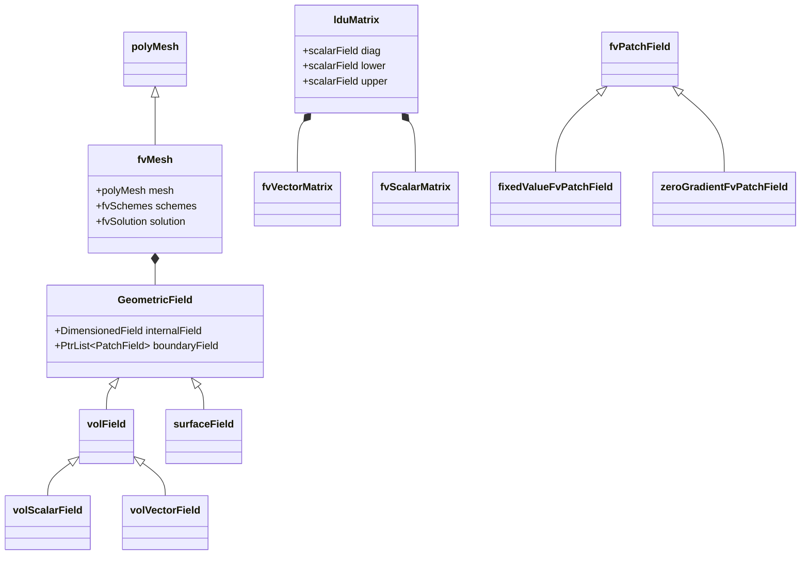
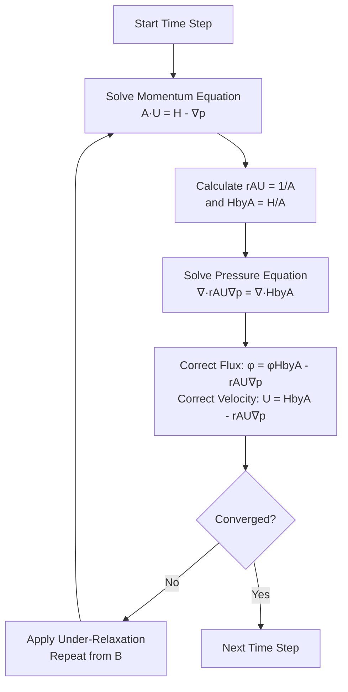

# Governing Equations & OpenFOAM Implementation
## HARDCORE Level - 2026-01-01

## Table of Contents

- [1. Theory: Core Equations & Physics](#1-theory-core-equations--physics)
  - [1.1 Conservation of Mass (Continuity Equation)](#11-conservation-of-mass-continuity-equation)
  - [1.2 Conservation of Momentum (Navier-Stokes Equation)](#12-conservation-of-momentum-navier-stokes-equation)
  - [1.3 Conservation of Energy](#13-conservation-of-energy)
  - [1.4 Transport Equation General Form](#14-transport-equation-general-form)
  - [1.5 Turbulence Modeling (RANS)](#15-turbulence-modeling-rans)
- [2. OpenFOAM Class Hierarchy & Implementation](#2-openfoam-class-hierarchy--implementation)
  - [2.1 Core Field Classes](#21-core-field-classes)
  - [2.2 Mesh & FvMesh Classes](#22-mesh--fvmesh-classes)
  - [2.3 Discretization Schemes](#23-discretization-schemes)
  - [2.4 Linear Solver Classes](#24-linear-solver-classes)
  - [2.5 Boundary Condition Classes](#25-boundary-condition-classes)
  - [2.6 Transport Model Classes](#26-transport-model-classes)
  - [2.7 Time Integration Classes](#27-time-integration-classes)
  - [2.8 Top-Level Solver Classes](#28-top-level-solver-classes)
- [3. Code Walkthrough](#3-code-walkthrough)
  - [3.1 UEqn.H](#31-ueqnh)
  - [3.2 pEqn.H](#32-peqnh)
  - [3.3 createFields.H](#33-createfieldsh)
- [4. Dictionary Analysis & Configuration](#4-dictionary-analysis--configuration)
  - [4.1 fvSchemes Analysis](#41-fvschemes-analysis)
  - [4.2 fvSolution Analysis](#42-fvsolution-analysis)
- [5. Hands-on: Practical Tasks & Coding](#5-hands-on-practical-tasks--coding)
- [6. Concept Checks](#6-concept-checks)
- [Recommended Reading](#recommended-reading)

---

## 1. Theory: Core Equations & Physics

### 1.1 Conservation of Mass (Continuity Equation)

**สมการการอนุรักษ์มวล (Continuity Equation)**

$$
\frac{\partial \rho}{\partial t} + \nabla \cdot (\rho \mathbf{U}) = 0
$$

**คำอธิบายพจน์:**
- $\rho$ (rho) = **ความหนาแน่น** (density) [kg/m³]
- $\mathbf{U}$ = **สนามความเร็ว** (velocity field) [m/s]
- $\nabla \cdot$ = **ตัวดำเนินการไดเวอร์เจนซ์** (divergence operator)
- $t$ = **เวลา** (time) [s]

สำหรับการไหลแบบ **ไม่อัดตัว** (incompressible flow): $\nabla \cdot \mathbf{U} = 0$

---

### 1.2 Conservation of Momentum (Navier-Stokes Equation)

**สมการการอนุรักษ์โมเมนตัม (Momentum Equation)**

$$
\frac{\partial (\rho \mathbf{U})}{\partial t} + \nabla \cdot (\rho \mathbf{U} \mathbf{U}) = -\nabla p + \nabla \cdot \boldsymbol{\tau} + \rho \mathbf{g}
$$

**คำอธิบายพจน์:**
- $p$ = **ความดัน** (pressure) [Pa]
- $\boldsymbol{\tau}$ (tau) = **เทนเซอร์ความเค้น** (stress tensor) [Pa]
- $\mathbf{g}$ = **ความเร่งเนื่องจากแรงโน้มถ่วง** (gravitational acceleration) [m/s²]
- $\nabla p$ = **การไล่ระดับความดัน** (pressure gradient)
- $\rho \mathbf{U} \mathbf{U}$ = **flux ของโมเมนตัม** (convective flux)

**สำหรับของไหลนิวตัน (Newtonian Fluid):**

$$
\boldsymbol{\tau} = \mu \left[ \nabla \mathbf{U} + (\nabla \mathbf{U})^T \right] - \frac{2}{3}\mu (\nabla \cdot \mathbf{U})\mathbf{I}
$$

- $\mu$ (mu) = **ความหนืด** (dynamic viscosity) [Pa·s]
- $\mathbf{I}$ = **เทนเซอร์เอกลักษณ์** (identity tensor)

---

### 1.3 Conservation of Energy

**สมการการอนุรักษ์พลังงาน (Energy Equation)**

$$
\frac{\partial (\rho e)}{\partial t} + \nabla \cdot (\rho e \mathbf{U}) = -\nabla \cdot \mathbf{q} + \boldsymbol{\tau} : \nabla \mathbf{U} + S_h
$$

**คำอธิบายพจน์:**
- $e$ = **พลังงานภายในต่อหน่วยมวล** (specific internal energy) [J/kg]
- $\mathbf{q}$ = **flux ของความร้อน** (heat flux) [W/m²]
- $S_h$ = **แหล่งกำเนิดความร้อน** (heat source) [W/m³]
- $\boldsymbol{\tau} : \nabla \mathbf{U}$ = **การกระจายพลังงานเนื่องจากความเค้น** (viscous dissipation)

**กฎของฟูริเยร์ (Fourier's Law):**
$$
\mathbf{q} = -k \nabla T
$$
- $k$ = **สัมประสิทธิภาพการนำความร้อน** (thermal conductivity) [W/(m·K)]
- $T$ = **อุณหภูมิ** (temperature) [K]

---

### 1.4 Transport Equation General Form

**รูปแบบทั่วไปของสมการเคลื่อนที่ (General Transport Equation)**

$$
\frac{\partial (\rho \phi)}{\partial t} + \nabla \cdot (\rho \phi \mathbf{U}) = \nabla \cdot (\Gamma_\phi \nabla \phi) + S_\phi
$$

**คำอธิบายพจน์:**
- $\phi$ (phi) = **ตัวแปรที่ถูกเคลื่อนที่** (transported variable)
- $\Gamma_\phi$ (Gamma) = **สัมประสิทธิภาพการแพร่** (diffusion coefficient)
- $S_\phi$ = **แหล่งกำเนิด/ตัวรับ** (source/sink term)

**แต่ละเทอมมีความหมาย:**
- $\frac{\partial (\rho \phi)}{\partial t}$ = **เทอมไม่คงที่** (unsteady term)
- $\nabla \cdot (\rho \phi \mathbf{U})$ = **เทอมเนื่องจากการพา** (convection term)
- $\nabla \cdot (\Gamma_\phi \nabla \phi)$ = **เทอมเนื่องจากการแพร่** (diffusion term)
- $S_\phi$ = **เทอมแหล่งกำเนิด** (source term)

---

### 1.5 Turbulence Modeling (RANS)

**สมการ Reynolds-Averaged Navier-Stokes (RANS)**

$$
\frac{\partial (\rho \overline{\mathbf{U}})}{\partial t} + \nabla \cdot (\rho \overline{\mathbf{U}} \overline{\mathbf{U}}) = -\nabla \overline{p} + \nabla \cdot (\boldsymbol{\tau} - \rho \overline{\mathbf{U}'\mathbf{U}'}) + \rho \mathbf{g}
$$

**คำอธิบายพจน์:**
- $\overline{\mathbf{U}}$ = **ความเร็วเฉลี่ย** (mean velocity)
- $\mathbf{U}'$ = **ความเร็วที่กระเพื่อม** (velocity fluctuation)
- $-\rho \overline{\mathbf{U}'\mathbf{U}'}$ = **เทนเซอร์ความเค้นเรย์โนลด์** (Reynolds stress tensor)

**โมเดล k-ε (k-epsilon Model):**

$$
\frac{\partial (\rho k)}{\partial t} + \nabla \cdot (\rho k \mathbf{U}) = \nabla \cdot \left[ \left(\mu + \frac{\mu_t}{\sigma_k}\right) \nabla k \right] + P_k - \rho \epsilon
$$

$$
\frac{\partial (\rho \epsilon)}{\partial t} + \nabla \cdot (\rho \epsilon \mathbf{U}) = \nabla \cdot \left[ \left(\mu + \frac{\mu_t}{\sigma_\epsilon}\right) \nabla \epsilon \right] + C_{1\epsilon}\frac{\epsilon}{k}P_k - C_{2\epsilon}\rho\frac{\epsilon^2}{k}
$$

- $k$ = **พลังงานจลน์ของความปั่น** (turbulent kinetic energy) [m²/s²]
- $\epsilon$ (epsilon) = **อัตราการสลายตัว** (dissipation rate) [m²/s³]
- $\mu_t$ = **ความหนืดของความปั่น** (turbulent viscosity)
- $P_k$ = **การผลิต k** (production of k)

**สรุปส่วนที่ 1:** ส่วนนี้ครอบคลุมสมการขับเคลื่อนหลักของ CFD ได้แก่ การอนุรักษ์มวล โมเมนตัม และพลังงาน พร้อมทั้งอธิบายรูปแบบทั่วไปของสมการเคลื่อนที่และทฤษฎีความปั่นแบบ RANS ซึ่งเป็นพื้นฐานสำคัญในการทำความเข้าใจและพัฒนา solver สำหรับการไหลของไหลใน OpenFOAM

---

## 2. OpenFOAM Class Hierarchy & Implementation



### 2.1 Core Field Classes

**ฟิลด์คลาสพื้นฐาน (Fundamental Field Classes)**

OpenFOAM ใช้ template classes สำหรับจัดการสนาม (fields) ของค่าต่างๆ:

```
GeometricField
├── volField (volume field - cell centered)
│   ├── volScalarField
│   ├── volVectorField
│   └── volTensorField
└── surfaceField (face centered)
    ├── surfaceScalarField
    └── surfaceVectorField
```

**Reference:** `$FOAM_SRC/finiteVolume/fields/`

- `GeometricField` → `$FOAM_SRC/finiteVolume/fields/GeometricField/GeometricField.C`
- `volScalarField` → `$FOAM_SRC/finiteVolume/fields/volFields/volFields.H`

---

### 2.2 Mesh & FvMesh Classes

**คลาสเกี่ยวกับเมช (Mesh Classes)**

```
polyMesh
└── fvMesh
    ├── fvSchemes
    └── fvSolution
```

**คำอธิบาย:**
- `polyMesh` = **เมชพื้นฐาน** (base mesh) - เก็บข้อมูลจุด, เซลล์, หน้า
- `fvMesh` = **เมชสำหรับ Finite Volume** - สืบทอดจาก polyMesh ใช้สำหรับ CFD
- `fvSchemes` = **การตั้งค่า discretization schemes**
- `fvSolution` = **การตั้งค่า linear solvers และ algorithms**

**Reference:** `$FOAM_SRC/finiteVolume/`

- `polyMesh` → `$FOAM_SRC/meshes/polyMesh/polyMesh.H`
- `fvMesh` → `$FOAM_SRC/finiteVolume/fvMesh/fvMesh.H`

---

### 2.3 Discretization Schemes

**คลาสสำหรับ Discretization (Schemes)**

```
ddtScheme
├── Euler
├── backward
└── CrankNicolson

gradScheme
├── Gauss
│   ├── gradScheme
│   └── leastSquares
└── fourth

divScheme
├── Gauss
│   ├── upwind
│   ├── linear
│   ├── linearUpwind
│   └── limited
└── bounded

laplacianScheme
├── Gauss
│   ├── uncorrected
│   ├── corrected
│   └── limited
└── fourth
```

**คำอธิบาย:**
- `ddtScheme` = **Temporal discretization** (เวลา)
- `gradScheme` = **Gradient calculation** (การไล่ระดับ)
- `divScheme` = **Divergence/convection term** (การพา)
- `laplacianScheme` = **Diffusion term** (การแพร่)

**Reference:** `$FOAM_SRC/finiteVolume/finiteVolume/`

- `ddtScheme` → `$FOAM_SRC/finiteVolume/finiteVolume/ddtSchemes/`
- `gaussGradScheme` → `$FOAM_SRC/finiteVolume/finiteVolume/gradSchemes/gaussGrad/gaussGradScheme.C`

---

### 2.4 Linear Solver Classes

**คลาส Solver และ Preconditioner**

```
lduMatrix
├── solvers
│   ├── GAMG
│   ├── PCG
│   ├── PBiCGStab
│   └── smoothSolver
└── preconditioners
    ├── DIC
    ├── DILU
    ├── FDIC
    └── GAMGProcAgglomeration
```

**คำอธิบาย:**
- `lduMatrix` = **Lower-Upper Decomposition Matrix** - โครงสร้างเมทริกซ์แบบ sparse
- `GAMG` = **Geometric-Algebraic Multi-Grid** - solver แบบ multi-grid
- `PCG` = **Preconditioned Conjugate Gradient** - สำหรับ symmetric matrices
- `PBiCGStab` = **Preconditioned Bi-Conjugate Gradient Stabilized** - สำหรับ non-symmetric
- `DIC` = **Diagonal Incomplete Cholesky** - preconditioner สำหรับ symmetric
- `DILU` = **Diagonal Incomplete LU** - preconditioner สำหรับ non-symmetric

**Reference:** `$FOAM_SRC/matrices/lduMatrix/`

- `lduMatrix` → `$FOAM_SRC/matrices/lduMatrix/lduMatrix/lduMatrix.H`
- `GAMG` → `$FOAM_SRC/matrices/lduMatrix/solvers/GAMG/GAMG.H`

---

### 2.5 Boundary Condition Classes

**คลาสเงื่อนไขขอบเขต (Boundary Conditions)**

```
fvPatchField
├── fixedValue
├── zeroGradient
├── fixedGradient
├── mixed
├── calculated
└── derived
    ├── inletOutlet
    ├── outletInlet
    ├── totalPressure
    ├── totalTemperature
    └── wall
        ├── fixedFluxPressure
        └── noSlip
```

**คำอธิบาย:**
- `fixedValue` = **กำหนดค่าคงที่** ที่ขอบเขต
- `zeroGradient` = **การไล่ระดับเป็นศูนย์** (∂φ/∂n = 0)
- `fixedGradient` = **กำหนดการไล่ระดับ** ที่ขอบเขต
- `mixed` = **ผสมระหว่าง fixedValue และ fixedGradient**
- `inletOutlet` = **switch ระหว่าง inlet และ outlet** ขึ้นกับทิศทางการไหล
- `totalPressure` = **กำหนดความดันรวม** (p₀ = p + ½ρU²)
- `noSlip` = **ไม่มีการลื่นไถล** (U = 0 ที่ผนัง)

**Reference:** `$FOAM_SRC/finiteVolume/fields/fvPatchFields/`

- `fvPatchField` → `$FOAM_SRC/finiteVolume/fields/fvPatchFields/fvPatchField/fvPatchField.H`
- `fixedValueFvPatchField` → `$FOAM_SRC/finiteVolume/fields/fvPatchFields/basic/fixedValue/fixedValueFvPatchField.H`

---

### 2.6 Transport Model Classes

**คลาสโมเดลการขนส่ง (Transport Models)**

```
transportModel
├── Newtonian
└── nonNewtonian
    ├── powerLaw
    ├── CrossPowerLaw
    └── BirdCarreau

turbulenceModel
├── RAS
│   ├── kEpsilon
│   ├── kOmegaSST
│   ├── SpalartAllmaras
│   └── LRR
└── LES
    ├── Smagorinsky
    ├── kEqn
    └── dynamicKEqn
```

**คำอธิบาย:**
- `Newtonian` = **ของไหลนิวตัน** (μ = constant)
- `powerLaw` = **โมเดลกฎของพลัง** (non-Newtonian)
- `kEpsilon` = **โมเดล k-ε มาตรฐาน** (RANS)
- `kOmegaSST` = **โมเดล k-ω SST** (Shear Stress Transport)
- `SpalartAllmaras` = **โมเดลสมการเดียว** (1-equation)
- `Smagorinsky` = **โมเดล LES แบบ Smagorinsky**

**Reference:** `$FOAM_SRC/transportModels/` และ `$FOAM_SRC/turbulenceModels/`

- `Newtonian` → `$FOAM_SRC/transportModels/incompressible/Newtonian/Newtonian.H`
- `kEpsilon` → `$FOAM_SRC/turbulenceModels/incompressible/RAS/kEpsilon/kEpsilon.H`

---

### 2.7 Time Integration Classes

**คลาสการจัดการเวลา (Time Classes)**

```
Time
├── runTime
└── timeSelector

controlDict
├── startTime
├── endTime
├── deltaT
├── writeControl
└── writeInterval
```

**คำอธิบาย:**
- `Time` = **คลาสหลักสำหรับจัดการเวลา**
- `runTime` = **instance ของ Time** ที่ใช้ใน solver
- `controlDict` = **ไฟล์ตั้งค่าการคำนวณ** ใน `system/`

**Reference:** `$FOAM_SRC/OpenFOAM/db/Time/`

- `Time` → `$FOAM_SRC/OpenFOAM/db/Time/Time.H`

---

### 2.8 Top-Level Solver Classes

**คลาส Solver ระดับสูง**

```
fvSolutionDict
├── solvers
│   ├── p
│   ├── U
│   └── k, epsilon, omega
└── algorithms
    ├── SIMPLE
    ├── PISO
    └── PIMPLE

fvSchemesDict
├── ddtSchemes
├── gradSchemes
├── divSchemes
└── laplacianSchemes
```

**คำอธิบาย:**
- `SIMPLE` = **Semi-Implicit Method for Pressure-Linked Equations** (steady-state)
- `PISO` = **Pressure-Implicit with Splitting of Operators** (transient)
- `PIMPLE` = **ผสม PISO + SIMPLE** (transient ที่มี large time steps)

**Reference:** `$FOAM_SRC/finiteVolume/`

- `simpleControl` → `$FOAM_SRC/finiteVolume/fvSolution/simpleControl.H`
- `pisoControl` → `$FOAM_SRC/finiteVolume/fvSolution/pisoControl.H`
- `pimpleControl` → `$FOAM_SRC/finiteVolume/fvSolution/pimpleControl.H`

**สรุปส่วนที่ 2:** อธิบายลำดับชั้นของคลาสใน OpenFOAM ตั้งแต่ Field Classes, Mesh, Discretization Schemes, Linear Solvers, Boundary Conditions, Transport Models ไปจนถึง Time Integration และ Solver Classes ซึ่งเป็นโครงสร้างพื้นฐานที่ผู้พัฒนาต้องเข้าใจเพื่อใช้งานและขยายความสามารถของ OpenFOAM

---

## 3. Code Walkthrough

### 3.1 UEqn.H

**ไฟล์ UEqn.H** ใช้สำหรับสร้างสมการโมเมนตัม (momentum equation) ใน OpenFOAM solvers หลายๆ ตัว เช่น `simpleFoam`, `pimpleFoam` ฯลฯ

**โครงสร้างหลัก:**

```cpp
// สร้างสมการโมเมนตัมแบบ implicit
tmp<fvVectorMatrix> UEqn
(
    fvm::ddt(U)                     // เทอมไม่คงที่ (unsteady)
  + fvm::div(phi, U)               // เทอมการพา (convection)
  + fvm::laplacian(nu, U)          // เทอมการแพร่ (diffusion/viscous)
  + turbulence->divDevReff(U)      // เทอมความปั่น (turbulence)
 ==
    fvOptions(U)                    // เทอมแหล่งกำเนิด (source terms)
);

// ผนวกเทอมการไล่ระดับความดัน (pressure gradient)
UEqn.relax();
fvOptions.constrain(UEqn);

if (pimple.momentumPredictor())
{
    solve(UEqn == -fvc::grad(p));   // แก้สมการโมเมนตัม
    fvOptions.correct(U);
}
```

**คำอธิบาย:**
- `fvm::` = **Finite Volume Method** (implicit) - ใช้สำหรับเทอมที่ต้องแก้ด้วย matrix solver
- `fvc::` = **Finite Volume Calculus** (explicit) - ใช้สำหรับเทอมที่คำนวณโดยตรง
- `phi` = **flux field** (ρU·S) - อัตราการไหลผ่านหน้าเซลล์
- `nu` = **kinematic viscosity** (ν = μ/ρ) - ความหนืดจลน์
- `relax()` = **under-relaxation** - ช่วยให้การคำนวณลู่เข้าสู่คำตอบ
- `constrain()` = **ใช้ fvOptions** จำกัดค่าขอบเขต
- `momentumPredictor` = **ตัวเลือก** ว่าจะแก้สมการโมเมนตัมหรือไม่

#### 3.1.1 Memory Layout: fvVectorMatrix

**โครงสร้างข้อมูลภายใน fvVectorMatrix:**

```
fvVectorMatrix (3 components: Ux, Uy, Uz)
│
├── lduMatrix (sparse matrix storage)
│   ├── lowerAddr[]  → [face_owner_indices]
│   ├── upperAddr[]  → [face_neighbor_indices]
│   ├── lower[]      → [coefficients_below_diagonal]
│   ├── upper[]      → [coefficients_above_diagonal]
│   └── diag[]       → [diagonal_coefficients_per_cell]
│
├── psi (volVectorField*) → points to velocity field U
│   └── GeometricField
│       ├── internalField[] → [Ux_0, Uy_0, Uz_0, Ux_1, Uy_1, Uz_1, ...]
│       └── boundaryField[] → [patch0_ptr, patch1_ptr, ...]
│
├── source (DimensionedField<vector>)
│   └── [source_x, source_y, source_z] per cell
│
└── faceFluxCorrectionPtr (surfaceScalarField*)
    └── optional flux correction for non-orthogonal meshes
```

**คำอธิบาย:**
- **lduMatrix** = เก็บเมทริกซ์แบบ sparse (Lower-Diagonal-Upper) เหมาะสำหรับเมส unstructured
- **lowerAddr/upperAddr** = เก็บ index ของ cells ที่เชื่อมกันด้วย faces
- **lower/upper/diag** = coefficients สำหรับ linear system Ax=b
- **psi** = pointer ไปยังฟิลด์ที่จะแก้ (solution variable)
- **source** = เทอมแหล่งกำเนิด (source term) ต่อเซลล์

**การจัดเก็บข้อมูลแบบ Compressed Sparse Row:**
```
Cell connectivity example:
Cell 0 ──Face 0──> Cell 1
Cell 1 ──Face 1──> Cell 2

lowerAddr[] = {0, 1}  (owner cells)
upperAddr[] = {1, 2}  (neighbor cells)
lower[]      = {L0, L1}
upper[]      = {U0, U1}
diag[]       = {D0, D1, D2}
```

**ตำแหน่งไฟล์:** อยู่ใน solver directory เช่น `$FOAM_SOLVERS/incompressible/simpleFoam/UEqn.H`

**References:**
- `fvVectorMatrix` → `$FOAM_SRC/finiteVolume/fvMatrices/fvVectorMatrix/fvVectorMatrix.H`
- `lduMatrix` → `$FOAM_SRC/matrices/lduMatrix/lduMatrix/lduMatrix.H`
- `fvm::` → `$FOAM_SRC/finiteVolume/finiteVolume/fvm/fvm.H`
- `fvc::` → `$FOAM_SRC/finiteVolume/finiteVolume/fvc/fvc.H`

---

### 3.2 pEqn.H

**ไฟล์ pEqn.H** ใช้สำหรับสร้างสมการความดัน (pressure equation) เพื่อบังคับให้ได้สนามความเร็วที่สอดคล้องกับสมการการอนุรักษ์มวล

**โครงสร้างหลัก (สำหรับ steady-state SIMPLE):**

```cpp
// สร้างสมการความดันจากสมการโมเมนตัม
volScalarField rAU(1.0/UEqn.A());           // 逆 ของเมทริกซ์สัมประสิทธิ์
volVectorField HbyA(constrainHbyA(rAU*UEqn.H(), U, p)); // คำนวณ HbyA
surfaceScalarField phiHbyA("phiHbyA", fvc::flux(HbyA));  // flux จาก HbyA

// ปรับ pressure boundary conditions
adjustPhi(phiHbyA, U, p);

// อัปเดต flux ที่ขอบเขต (non-orthogonal correction)
mrfZones.correctBoundaryVelocity(U);

// สร้างสมการความดัน
tmp<fvScalarMatrix> pEqn
(
    fvm::laplacian(rAU, p) == fvc::div(phiHbyA)  // Poisson equation
);

pEqn.setReference(pRefCell, pRefValue);          // กำหนด reference pressure
pEqn.solve();                                    // แก้สมการความดัน

// อัปเดต flux และความเร็ว
phi = phiHbyA - pEqn.flux();                     // แก้ไข mass flux
U = HbyA - rAU*fvc::grad(p);                     // แก้ไข velocity field
U.correctBoundaryConditions();                   // แก้ไข boundary conditions
```

**คำอธิบาย:**
- `rAU` = **inverse of diagonal coefficients** (1/A) จากเมทริกซ์โมเมนตัม
- `HbyA` = **H/A** โดย H คือเทอมทั้งหมดที่ไม่ใช่ U (off-diagonal terms + source terms)
- `phiHbyA` = **flux จาก HbyA** ใช้เป็นเทอมทางซ้ายของสมการความดัน
- `adjustPhi()` = **ปรับ flux** ให้สอดคล้องกับ boundary conditions
- `fvm::laplacian(rAU, p)` = **เทอม diffusion ของความดัน** (implicit)
- `fvc::div(phiHbyA)` = **เทอม divergence ของ flux** (explicit)
- `setReference()` = **กำหนดค่า reference** เพื่อแก้ปัญหา singular matrix
- `pEqn.flux()` = **flux correction** จากการแก้สมการความดัน

**สำหรับ transient PIMPLE/PISO:**
```cpp
while (pimple.correctNonOrthogonal())
{
    tmp<fvScalarMatrix> pEqn
    (
        fvm::laplacian(rAU, p) == fvc::div(phiHbyA)
    );
    
    pEqn.solve(mesh.solver(p.select(pimple.finalInnerIter())));
    
    if (pimple.finalNonOrthogonalIter())
    {
        phi = phiHbyA - pEqn.flux();
    }
}
```

**คำอธิบายเพิ่มเติม:**
- `correctNonOrthogonal()` = **loop สำหรับ non-orthogonal meshes** แก้ไขหลายครั้งเพื่อความแม่นยำ
- `finalInnerIter()` = **check ว่าเป็น iteration สุดท้ายหรือไม่**
- `finalNonOrthogonalIter()` = **check ว่าเป็น loop สุดท้ายของ non-orthogonal correction**

#### 3.2.1 Memory Layout: Pressure-Velocity Coupling

**โครงสร้างข้อมูลสำหรับ Pressure Equation:**

```
Pressure Equation System
│
├── fvScalarMatrix (Poisson equation for pressure)
│   ├── lduMatrix
│   │   ├── diag[]  → [1/A_0, 1/A_1, ..., 1/A_n]  (inverse momentum coefficients)
│   │   ├── lower[] → [diffusion coefficients]
│   │   └── upper[] → [diffusion coefficients]
│   │
│   ├── psi (volScalarField*) → points to pressure field p
│   │   └── internalField[] → [p_0, p_1, p_2, ..., p_n]
│   │
│   └── source (divergence of HbyA flux)
│       └── [∇·(H/A)] per cell
│
├── Intermediate Fields
│   ├── rAU (volScalarField)
│   │   └── [1/UEqn.A()] per cell
│   │
│   ├── HbyA (volVectorField)
│   │   └── [H/A] = [U - (1/A)∇p_old] per cell
│   │
│   └── phiHbyA (surfaceScalarField)
│       └── [flux at faces] = Σ(HbyA·Sf)
│
└── Boundary Conditions
    ├── fixedValueFvPatchScalarField (inlet)
    └── zeroGradientFvPatchScalarField (outlet)
```

**การแก้ Pressure-Velocity Coupling:**

```
SIMPLE Algorithm Flow:
┌─────────────────────────────────────┐
│ 1. Solve Momentum: A·U = H - ∇p     │
│    → UEqn.A() = diagonal coeffs     │
│    → UEqn.H() = off-diagonal + src  │
└──────────────┬──────────────────────┘
               │
               ▼
┌─────────────────────────────────────┐
│ 2. Calculate rAU = 1/A              │
│    Calculate HbyA = H/A             │
└──────────────┬──────────────────────┘
               │
               ▼
┌─────────────────────────────────────┐
│ 3. Solve Pressure: ∇·(rAU∇p) = ∇·HbyA│
│    → Poisson equation               │
└──────────────┬──────────────────────┘
               │
               ▼
┌─────────────────────────────────────┐
│ 4. Correct Flux: φ = φHbyA - rAU∇p  │
│    Correct Velocity: U = HbyA - rAU∇p│
└──────────────┬──────────────────────┘
               │
               ▼
         (under-relaxation)
               │
               └──> Repeat until convergence
```

**คำอธิบาย:**
- **rAU** = 逆 ของสัมประสิทธิ์เชิงเส้นจากสมการโมเมนตัม
- **HbyA** = ส่วนประกอบของความเร็วที่ไม่ขึ้นกับความดันปัจจุบัน
- **phiHbyA** = flux ที่คำนวณจาก HbyA (ก่อนแก้ไขด้วยความดัน)
- **Poisson equation** = สมการเชิงอนุพันธ์ย่อยสำหรับความดัน

#### 3.2.2 SIMPLE Algorithm Flow



**ตำแหน่งไฟล์:** อยู่ใน solver directory เช่น `$FOAM_SOLVERS/incompressible/simpleFoam/pEqn.H`

**References:**
- `fvScalarMatrix` → `$FOAM_SRC/finiteVolume/fvMatrices/fvScalarMatrix/fvScalarMatrix.H`
- `volScalarField` → `$FOAM_SRC/finiteVolume/fields/volFields/volScalarField.H`
- `surfaceScalarField` → `$FOAM_SRC/finiteVolume/fields/surfaceFields/surfaceFields.H`
- `simpleControl` → `$FOAM_SRC/finiteVolume/fvSolution/simpleControl.H`
- `pisoControl` → `$FOAM_SRC/finiteVolume/fvSolution/pisoControl.H`
- `pimpleControl` → `$FOAM_SRC/finiteVolume/fvSolution/pimpleControl.H`

---

### 3.3 createFields.H

**ไฟล์ createFields.H** ใช้สำหรับสร้างและเริ่มต้นฟิลด์ต่างๆ (fields) ที่จำเป็นสำหรับการคำนวณ CFD ใน OpenFOAM solvers

**โครงสร้างหลัก:**

```cpp
// สร้างฟิลด์ความเร็ว (velocity field)
Info<< "Reading field U\n" << endl;
volVectorField U
(
    IOobject
    (
        "U",
        runTime.timeName(),
        mesh,
        IOobject::MUST_READ,
        IOobject::AUTO_WRITE
    ),
    mesh
);

// สร้างฟิลด์ความดัน (pressure field)
Info<< "Reading field p\n" << endl;
volScalarField p
(
    IOobject
    (
        "p",
        runTime.timeName(),
        mesh,
        IOobject::MUST_READ,
        IOobject::AUTO_WRITE
    ),
    mesh
);

// สร้าง transport model (ความหนืด)
singlePhaseTransportModel laminarTransport(U, phi);

// สร้าง turbulence model
autoPtr<incompressible::turbulenceModel> turbulence
(
    incompressible::turbulenceModel::New(U, phi, laminarTransport)
);
```

**คำอธิบาย:**
- `IOobject` = **คลาสสำหรับจัดการ I/O** กำหนดชื่อ, เวลา, เมช และโหมดการอ่าน/เขียน
- `MUST_READ` = **ต้องอ่านไฟล์** จาก directory เวลาปัจจุบัน (เช่น `0/`)
- `AUTO_WRITE` = **เขียนอัตโนมัติ** เมื่อถึงเวลาบันทึกผลลัพธ์
- `volVectorField` = **ฟิลด์เวกเตอร์** (สำหรับความเร็ว U)
- `volScalarField` = **ฟิลด์สเกลาร์** (สำหรับความดัน p)
- `singlePhaseTransportModel` = **โมเดลการขนส่ง** สำหรับของไหลเฟสเดียว (ความหนืด)
- `turbulenceModel::New()` = **สร้าง turbulence model** ตามที่ระบุใน `constant/turbulenceProperties`
- `autoPtr` = **smart pointer** จัดการหน่วยความจำอัตโนมัติ

**การอ่านค่าจากไฟล์:**
- ฟิลด์ `U` ถูกอ่านจาก `0/U` (หรือเวลาเริ่มต้นที่ระบุ)
- ฟิลด์ `p` ถูกอ่านจาก `0/p`
- คุณสมบัติการขนส่งจาก `constant/transportProperties`
- คุณสมบัติความปั่นจาก `constant/turbulenceProperties`

#### 3.3.1 Memory Layout: Field Creation & Mesh Structure

**โครงสร้างข้อมูลของ GeometricField (volVectorField/volScalarField):**

```
GeometricField<Type, PatchField, GeoMesh>
│
├── DimensionedField<Type, GeoMesh>
│   ├── dimensions_ (dimensionSet)
│   │   └── [mass, length, time, temperature, moles, current, luminous]
│   │       ตัวอย่าง: U → [m/s], p → [kg/(m·s²)]
│   │
│   └── Field<Type> (internal field values)
│       └── List<Type>
│           └── [value_0, value_1, value_2, ..., value_n-1]
│               (n = number of cells in mesh)
│
├── PtrList<PatchField<Type>> (boundary fields)
│   ├── [0] → fvPatchField<Type> (patch 0, e.g., inlet)
│   │   ├── patch_ (fvPatch*) → points to boundary patch definition
│   │   └── [face_0, face_1, ..., face_m-1]
│   │
│   ├── [1] → fvPatchField<Type> (patch 1, e.g., outlet)
│   └── ... (one entry per boundary patch)
│
├── BoundaryMesh (reference to mesh boundary)
│   └── polyBoundaryMesh
│       ├── [0] → polyPatch (inlet)
│       ├── [1] → polyPatch (outlet)
│       └── ...
│
└── IOobject (I/O management)
    ├── name_ ("U" or "p")
    ├── instance_ (time directory, e.g., "0")
    ├── local_ (empty for top-level fields)
    └── readOpt_ (MUST_READ, READ_IF_PRESENT, etc.)
```

**โครงสร้างข้อมูลของ fvMesh:**

```
fvMesh (finite volume mesh)
│
├── polyMesh (primitive mesh data)
│   ├── points_ (pointField)
│   │   └── List<point>
│   │       └── [(x0,y0,z0), (x1,y1,z1), ..., (xn-1,yn-1,zn-1)]
│   │
│   ├── faces_ (faceList)
│   │   └── List<face>
│   │       └── [face_0, face_1, ..., face_nf-1]
│   │           แต่ละ face เก็บ list of point indices
│   │           ตัวอย่าง: face_0 = [0, 1, 5, 4]
│   │
│   └── cells_ (cellList)
│       └── List<cell>
│           └── [cell_0, cell_1, ..., cell_nc-1]
│               แต่ละ cell เก็บ list of face indices
│
├── cellCentres_ (volVectorField)
│   └── [(cx0,cy0,cz0), (cx1,cy1,cz1), ...]
│
├── faceCentres_ (surfaceVectorField)
│   └── [(fx0,fy0,fz0), (fx1,fy1,fz1), ...]
│
├── Sf_ (surfaceVectorField) - face area vectors
│   └── [(Sx0,Sy0,Sz0), (Sx1,Sy1,Sz1), ...]
│       magnitude = face area, direction = face normal
│
└── V_ (volScalarField) - cell volumes
    └── [V0, V1, V2, ..., V_nc-1]
```

**การเชื่อมโยงระหว่าง Mesh และ Fields:**

```
Mesh Connectivity Example:
┌─────────┬─────────┐
│ Cell 0  │ Cell 1  │
│         │         │
│ p0      │ p1      │
│ U0      │ U1      │
└─────────┴─────────┘
    │       │
    └──Face 0──┘
        │
    faceCentre[0]
    Sf[0] (area vector)
    phi[0] (flux = U·Sf)
```

**คำอธิบาย:**
- **GeometricField** = ฟิลด์ที่มี internal values (per cell) และ boundary values (per face)
- **DimensionedField** = เก็บค่าภายในเซลล์และหน่วย (dimensions)
- **PatchField** = เก็บค่าที่ขอบเขตแต่ละ patch
- **polyMesh** = เก็บข้อมูลเรขาคณิต (points, faces, cells)
- **cellCentres/faceCentres** = จุดศูนย์กลางของเซลล์และหน้า
- **Sf** = เวกเตอร์พื้นที่หน้า (magnitude = พื้นที่, direction = ทิศทางปกติ)
- **V** = ปริมาตรของเซลล์

**ตำแหน่งไฟล์:** อยู่ใน solver directory เช่น `$FOAM_SOLVERS/incompressible/simpleFoam/createFields.H`

**References:**
- `IOobject` → `$FOAM_SRC/OpenFOAM/db/IOobject/IOobject.H`
- `GeometricField` → `$FOAM_SRC/finiteVolume/fields/GeometricField/GeometricField.H`
- `volVectorField` → `$FOAM_SRC/finiteVolume/fields/volFields/volVectorField.H`
- `volScalarField` → `$FOAM_SRC/finiteVolume/fields/volFields/volScalarField.H`
- `fvMesh` → `$FOAM_SRC/finiteVolume/fvMesh/fvMesh.H`
- `polyMesh` → `$FOAM_SRC/meshes/polyMesh/polyMesh.H`
- `singlePhaseTransportModel` → `$FOAM_SRC/transportModels/incompressible/singlePhaseTransportModel/singlePhaseTransportModel.H`
- `incompressible::turbulenceModel` → `$FOAM_SRC/turbulenceModels/incompressible/turbulenceModel/turbulenceModel.H`
- `autoPtr` → `$FOAM_SRC/OpenFOAM/memory/autoPtr/autoPtr.H`

**สรุปส่วนที่ 3:** วิเคราะห์โค้ดจริงจากไฟล์สำคัญของ solver ได้แก่ UEqn.H, pEqn.H และ createFields.H พร้อมทั้งอธิบายโครงสร้างข้อมูลภายในของ fvVectorMatrix, fvScalarMatrix และ GeometricField รวมถึงขั้นตอนการทำงานของอัลกอริทึม SIMPLE สำหรับการเชื่อมโยงความดันและความเร็ว

---

## 4. Dictionary Analysis & Configuration

### 4.1 fvSchemes Analysis

**ไฟล์ `system/fvSchemes`** ใช้กำหนด discretization schemes สำหรับการแปลงสมการเชิงอนุพันธ์ให้เป็นรูปแบบพีชคณิตที่คอมพิวเตอร์สามารถแก้ได้

#### 4.1.1 ddtSchemes (Temporal Discretization)

**รูปแบบ:**
```cpp
ddtSchemes
{
    default         Euler;
}
```

**คำอธิบาย:**
- **Euler** = รูปแบบ Euler แบบ implicit อันดับหนึ่ง (first-order) - เสถียรแต่ความแม่นยำต่ำ
- **backward** = รูปแบบ backward differentiation อันดับสอง (second-order) - ความแม่นยำสูงกว่า
- **CrankNicolson** = รูปแบบ trapezoidal อันดับสอง - ความแม่นยำสูงแต่ต้องระวังเรื่อง oscillations

**การใช้งาน:**
- ใช้ Euler สำหรับการทดสอบเบื้องต้น (initial testing)
- ใช้ backward หรือ CrankNicolson สำหรับการคำนวณที่ต้องการความแม่นยำสูง

#### 4.1.2 gradSchemes (Gradient Calculation)

**รูปแบบ:**
```cpp
gradSchemes
{
    default         Gauss linear;
}
```

**คำอธิบาย:**
- **Gauss** = ใช้ทฤษฎีบทของเกาส์ (Gauss theorem) ในการคำนวณการไล่ระดับ
- **linear** = การประมาณค่าแบบเชิงเส้น (central differencing) - อันดับสอง
- **leastSquares** = วิธีกำลังสองน้อยสุด (least squares) - แม่นยำสำหรับเมชที่ไม่มีโครงสร้าง (unstructured meshes)

**ตัวเลือกเพิ่มเติม:**
- **Gauss linear** = มาตรฐานสำหรับเมชที่ดี (orthogonal meshes)
- **Gauss upwind** = ใช้สำหรับความเร็ว (U) เพื่อเพิ่มเสถียรภาพ
- **cellLimited** = จำกัดการไล่ระดับเพื่อป้องกันค่าที่ไม่สมเหตุสมผล (boundedness)

#### 4.1.3 divSchemes (Divergence/Convection Terms)

**รูปแบบ:**
```cpp
divSchemes
{
    default         none;
    div(phi,U)      Gauss upwind;
    div(phi,k)      Gauss upwind;
    div(phi,epsilon) Gauss upwind;
}
```

**คำอธิบาย:**
- **Gauss** = ใช้ทฤษฎีบทของเกาส์เช่นเดียวกับ gradSchemes
- **upwind** = รูปแบบ upwind differencing อันดับหนึ่ง - เสถียรมากแต่มี numerical diffusion
- **linear** = รูปแบบ central differencing อันดับสอง - แม่นยำแต่อาจไม่เสถียร
- **linearUpwind** = ผสมระหว่าง upwind และ linear - สมดุลระหว่างเสถียรภาพและความแม่นยำ
- **limited** = รูปแบบที่มีตัวจำกัด (limiter) เพื่อรักษา boundedness

**การใช้งาน:**
- ใช้ **upwind** สำหรับ turbulence quantities (k, ε, ω) เพื่อเสถียรภาพ
- ใช้ **linearUpwind** หรือ **limitedLinear** สำหรับความเร็ว (U) เพื่อความแม่นยำ
- ใช้ **bounded** สำหรับสมการที่ต้องการค่าบวกเสมอ (เช่น ε, ω)

#### 4.1.4 laplacianSchemes (Diffusion Terms)

**รูปแบบ:**
```cpp
laplacianSchemes
{
    default         Gauss linear corrected;
}
```

**คำอธิบาย:**
- **Gauss** = ใช้ทฤษฎีบทของเกาส์ในการคำนวณ laplacian
- **linear** = การประมาณค่าความนำได้ (conductivity) แบบเชิงเส้น
- **corrected** = มี non-orthogonal correction สำหรับเมชที่ไม่ตั้งฉาก
- **uncorrected** = ไม่มี correction - เร็วแต่ไม่แม่นยำสำหรับเมสที่ไม่ตั้งฉาก
- **limited** = จำกัดค่าสัมประสิทธิภาพเพื่อป้องกันค่าที่ไม่สมเหตุสมผล

**การใช้งาน:**
- ใช้ **Gauss linear corrected** สำหรับเมสที่มีความไม่ตั้งฉาก (non-orthogonal)
- ใช้ **Gauss linear uncorrected** สำหรับเมสที่ดี (high quality orthogonal meshes)
- ใช้ **Gauss linear limited** สำหรับกรณีที่มีปัญหาเรื่อง boundedness

#### 4.1.5 interpolationSchemes (Face Interpolation)

**รูปแบบ:**
```cpp
interpolationSchemes
{
    default         linear;
}
```

**คำอธิบาย:**
- **linear** = การประมาณค่าแบบเชิงเส้นจาก center ไปยัง face
- **upwind** = ใช้ค่าจาก upstream cell
- **cellPoint** = การประมาณค่าโดยใช้จุดรอบๆ เซลล์

#### 4.1.6 snGradSchemes (Surface Normal Gradient)

**รูปแบบ:**
```cpp
snGradSchemes
{
    default         corrected;
}
```

**คำอธิบาย:**
- **corrected** = มี non-orthogonal correction
- **uncorrected** = ไม่มี correction
- ใช้สำหรับคำนวณการไล่ระดับในทิศทางปกติของหน้า (surface normal)

---

### 4.2 fvSolution Analysis

**ไฟล์ `system/fvSolution`** ใช้กำหนดค่าตัวแก้สมการ (linear solvers), อัลกอริทึม และ under-relaxation factors สำหรับการคำนวณ CFD

#### 4.2.1 solvers (Linear Solvers)

**รูปแบบ:**
```cpp
solvers
{
    p
    {
        solver          GAMG;
        tolerance       1e-06;
        relTol          0.01;
        smoother        GaussSeidel;
    }

    U
    {
        solver          smoothSolver;
        smoother        GaussSeidel;
        tolerance       1e-05;
        relTol          0.1;
    }
}
```

**คำอธิบาย:**
- **GAMG** = Geometric-Algebraic Multi-Grid - solver แบบ multi-grid สำหรับสมการความดัน (Poisson equation) - เร็วสำหรับเมสขนาดใหญ่
- **smoothSolver** = solver แบบ smoothing - เหมาะสำหรับสมการโมเมนตัม
- **PCG** = Preconditioned Conjugate Gradient - สำหรับ symmetric matrices (เช่น laplacian)
- **PBiCGStab** = Preconditioned Bi-Conjugate Gradient Stabilized - สำหรับ non-symmetric matrices
- **tolerance** = ค่าความคลาดเคลื่อนสัมบูรณ์ (absolute tolerance)
- **relTol** = ค่าความคลาดเคลื่อนสัมพัทธ์ (relative tolerance)

#### 4.2.2 algorithms (Solution Algorithms)

**รูปแบบ:**
```cpp
SIMPLE
{
    nNonOrthogonalCorrectors 0;
    pRefCell        0;
    pRefValue       0;
}

PISO
{
    nCorrectors     2;
    nNonOrthogonalCorrectors 0;
}

PIMPLE
{
    nCorrectors     2;
    nNonOrthogonalCorrectors 0;
    nOuterCorrectors 1;
}
```

**คำอธิบาย:**
- **SIMPLE** = Semi-Implicit Method for Pressure-Linked Equations - สำหรับ steady-state problems
- **PISO** = Pressure-Implicit with Splitting of Operators - สำหรับ transient problems
- **PIMPLE** = ผสมระหว่าง PISO และ SIMPLE - สำหรับ transient ที่ใช้ large time steps
- **nCorrectors** = จำนวนรอบการแก้ pressure-velocity coupling
- **nNonOrthogonalCorrectors** = จำนวนรอบการแก้สำหรับ non-orthogonal meshes
- **nOuterCorrectors** = จำนวนรอบ outer loop (สำหรับ PIMPLE)
- **pRefCell** = กำหนด cell ที่ใช้เป็น reference pressure
- **pRefValue** = กำหนดค่า reference pressure

#### 4.2.3 relaxationFactors (Under-Relaxation)

**รูปแบบ:**
```cpp
relaxationFactors
{
    fields
    {
        p               0.3;
        rho             1;
    }
    equations
    {
        U               0.7;
        k               0.7;
        epsilon         0.7;
    }
}
```

**คำอธิบาย:**
- **relaxationFactors** = ค่าสัมประสิทธิ์ under-relaxation (α) ใช้สำหรับ steady-state algorithms (SIMPLE)
- **p** = ความดัน - มักใช้ค่าต่ำ (0.2-0.3) เพื่อเสถียรภาพ
- **U** = ความเร็ว - มักใช้ค่าปานกลาง (0.5-0.7)
- **k, epsilon** = turbulence quantities - มักใช้ค่าปานกลาง (0.7-0.8)
- **rho** = ความหนาแน่น - สำหรับ compressible flows มักใช้ 1 (ไม่ relax)

**สูตรการใช้งาน:**
```
φ_new = α·φ_calculated + (1-α)·φ_old
```
- ค่า α ต่ำ = การลู่เข้าช้าแต่เสถียร
- ค่า α สูง = การลู่เข้าเร็วแต่อาจไม่เสถียร

**สรุปส่วนที่ 4:** อธิบายการตั้งค่า discretization schemes ใน fvSchemes และ linear solvers, algorithms, under-relaxation factors ใน fvSolution ซึ่งเป็นไฟล์คอนฟิกูเรชันที่สำคัญที่ควบคุมความแม่นยำ เสถียรภาพ และประสิทธิภาพของการคำนวณ CFD ใน OpenFOAM

---

## 5. Hands-on: Practical Tasks & Coding

## 5.1 Task 1: Implement a Custom Convection Scheme

**Objective:** Create a custom convection scheme that blends between upwind and central differencing based on a blending factor.

**Background:** In OpenFOAM, convection terms are discretized using schemes specified in `divSchemes`. This task will help you understand how finite volume discretization works at the code level.

**Task:**
1. Create a new scheme file `myBlendedScheme.C` in `$FOAM_USER_DIR/finiteVolume/divSchemes/`
2. Implement a blended scheme that combines upwind and linear interpolation

**Solution:**

```cpp
// myBlendedScheme.C
#include "fv.H"
#include "HashTable.H"
#include "linear.H"
#include "upwind.H"

// * * * * * * * * * * * * * * * * * * * * * * * * * * * * * * * * * * * * * //

namespace Foam
{

// Template for blended div scheme
template<class Type>
class myBlendedDivScheme
    : public fv::divScheme<Type>
{
    // Private data
    scalar blendingFactor_;
    
    // Reference to upwind scheme
    tmp<fv::divScheme<Type>> tUpwind_;
    
    // Reference to linear scheme
    tmp<fv::divScheme<Type>> tLinear_;

public:

    //- Runtime type information
    TypeName("myBlended");


    // Constructors

    myBlendedDivScheme(const fvMesh& mesh)
    :
        fv::divScheme<Type>(mesh),
        blendingFactor_(0.5),  // Default 50% blend
        tUpwind_(new fv::upwind<Type>(mesh)),
        tLinear_(new fv::linear<Type>(mesh))
    {}

    myBlendedDivScheme(const fvMesh& mesh, Istream& is)
    :
        fv::divScheme<Type>(mesh, is),
        blendingFactor_(readScalar(is)),
        tUpwind_(new fv::upwind<Type>(mesh)),
        tLinear_(new fv::linear<Type>(mesh))
    {}


    // Member Functions

    //- Return the face-based flux field from owner to neighbour
    virtual tmp<GeometricField<Type, fvsPatchField, surfaceMesh>>
    div
    (
        const GeometricField<Type, fvPatchField, volMesh>& vf
    ) const
    {
        // Get fluxes from both schemes
        tmp<GeometricField<Type, fvsPatchField, surfaceMesh>> tUpwindDiv =
            tUpwind_().div(vf);
            
        tmp<GeometricField<Type, fvsPatchField, surfaceMesh>> tLinearDiv =
            tLinear_().div(vf);

        // Blend the results
        tmp<GeometricField<Type, fvsPatchField, surfaceMesh>> tBlended
        (
            new GeometricField<Type, fvsPatchField, surfaceMesh>
            (
                IOobject
                (
                    "blendedDiv",
                    this->mesh().time().timeName(),
                    this->mesh(),
                    IOobject::NO_READ,
                    IOobject::NO_WRITE
                ),
                blendingFactor_ * tLinearDiv() + 
                (1.0 - blendingFactor_) * tUpwindDiv()
            )
        );

        return tBlended;
    }
};


// * * * * * * * * * * * * * * * * * * * * * * * * * * * * * * * * * * * * * //

} // End namespace Foam

// * * * * * * * * * * * * * * * * * * * * * * * * * * * * * * * * * * * * * //
```

**Usage in `system/fvSchemes`:**
```cpp
divSchemes
{
    default         none;
    div(phi,U)      Gauss myBlended 0.7;  // 70% linear, 30% upwind
}
```

**Key Concepts:**
- **Blending factor (0-1):** Controls balance between accuracy (linear) and stability (upwind)
- **Template-based design:** OpenFOAM uses C++ templates for type generality
- **Smart pointers (`tmp`):** Memory management for temporary fields

---

## 5.2 Task 2: Implement a Custom Boundary Condition

**Objective:** Create a custom boundary condition that calculates wall shear stress and outputs it for post-processing.

**Background:** Boundary conditions in OpenFOAM derive from `fvPatchField`. This task will show you how to implement physics-based boundary conditions.

**Task:**
1. Create a new BC `wallShearStressFvPatchScalarField` 
2. Calculate wall shear stress from velocity gradient: $\tau_w = \mu \left(\frac{\partial U}{\partial n}\right)$
3. Store the value for post-processing

**Solution:**

```cpp
// wallShearStressFvPatchScalarField.C
#include "wallShearStressFvPatchScalarField.H"
#include "volFields.H"
#include "surfaceFields.H"
#include "turbulenceModel.H"
#include "addToRunTimeSelectionTable.H"

// * * * * * * * * * * * * * * * * * * * * * * * * * * * * * * * * * * * * * //

namespace Foam
{

// * * * * * * * * * * * * * * * * Constructors  * * * * * * * * * * * * * * //

wallShearStressFvPatchScalarField::wallShearStressFvPatchScalarField
(
    const fvPatch& p,
    const DimensionedField<scalar, volMesh>& iF
)
:
    fixedValueFvPatchScalarField(p, iF),
    shearStress_(0.0)
{}


wallShearStressFvPatchScalarField::wallShearStressFvPatchScalarField
(
    const fvPatch& p,
    const DimensionedField<scalar, volMesh>& iF,
    const dictionary& dict
)
:
    fixedValueFvPatchScalarField(p, iF, dict),
    shearStress_(dict.lookupOrDefault<scalar>("shearStress", 0.0))
{
    // Evaluate the patch field
    this->evaluate();
}


// * * * * * * * * * * * * * * * * Member Functions  * * * * * * * * * * * * //

void wallShearStressFvPatchScalarField::updateCoeffs()
{
    if (this->updated())
    {
        return;
    }

    // Get velocity field
    const volVectorField& U =
        db().objectRegistry::lookupObject<volVectorField>("U");

    // Get patch face normals
    const vectorField& n = patch().nf();

    // Get velocity gradient at wall
    const tensorField& gradU = 
        U.boundaryField()[patch().index()].snGrad();

    // Get dynamic viscosity (from turbulence model if available)
    scalar mu = 0.0;
    if (db().foundObject<turbulenceModel>("turbulenceModel"))
    {
        const turbulenceModel& turb = 
            db().lookupObject<turbulenceModel>("turbulenceModel");
        mu = turb.mu()().boundaryField()[patch().index()][0];
    }
    else
    {
        // Fallback: read from transportProperties
        IOdictionary transportProps
        (
            IOobject
            (
                "transportProperties",
                db().time().constant(),
                db(),
                IOobject::MUST_READ,
                IOobject::NO_WRITE
            )
        );
        mu = readScalar(transportProps.lookup("nu"));
    }

    // Calculate wall shear stress magnitude
    // tau_w = mu * (dU/dn)
    scalarField tau(patch().size(), 0.0);
    
    forAll(tau, faceI)
    {
        // Tangential velocity gradient
        vector gradUTan = gradU[faceI] - (n[faceI] & gradU[faceI]) * n[faceI];
        tau[faceI] = mu * mag(gradUTan);
    }

    // Store the shear stress value
    shearStress_ = average(tau);

    // Set the boundary field value
    scalarField::operator=(tau);

    fixedValueFvPatchScalarField::updateCoeffs();
}


void wallShearStressFvPatchScalarField::write(Ostream& os) const
{
    fixedValueFvPatchScalarField::write(os);
    writeEntry(os, "shearStress", shearStress_);
}


// * * * * * * * * * * * * * * * * * * * * * * * * * * * * * * * * * * * * * //

makePatchTypeField(fvPatchScalarField, wallShearStressFvPatchScalarField);

// * * * * * * * * * * * * * * * * * * * * * * * * * * * * * * * * * * * * * //

} // End namespace Foam
```

**Header file (`wallShearStressFvPatchScalarField.H`):**
```cpp
#ifndef wallShearStressFvPatchScalarField_H
#define wallShearStressFvPatchScalarField_H

#include "fixedValueFvPatchFields.H"

namespace Foam
{

class wallShearStressFvPatchScalarField
:
    public fixedValueFvPatchScalarField
{
    // Private data
    scalar shearStress_;

public:

    //- Runtime type information
    TypeName("wallShearStress");

    // Constructors
    wallShearStressFvPatchScalarField
    (
        const fvPatch&,
        const DimensionedField<scalar, volMesh>&
    );

    wallShearStressFvPatchScalarField
    (
        const fvPatch&,
        const DimensionedField<scalar, volMesh>&,
        const dictionary&
    );

    // Member functions
    virtual void updateCoeffs();
    virtual void write(Ostream&) const;
};

} // End namespace Foam

#endif
```

**Usage in boundary conditions file (`0/p` or `0/U`):**
```cpp
myPatch
{
    type            wallShearStress;
    value           uniform 0;
}
```

**Key Concepts:**
- **Patch field hierarchy:** All BCs inherit from `fvPatchField<Type>`
- **`updateCoeffs()`:** Called every time step to update boundary values
- **`snGrad()`:** Returns surface normal gradient at the patch
- **Runtime selection:** `makePatchTypeField` macro enables runtime selection

---

## 5.3 Task 3: Create a Custom Post-Processing Function Object

**Objective:** Implement a function object that calculates and logs the Courant number (Co) distribution across the mesh.

**Background:** The Courant number $Co = \frac{|U| \Delta t}{\Delta x}$ is critical for numerical stability in transient simulations. This task demonstrates function object creation.

**Task:**
1. Create a function object `courantNumberStats` 
2. Calculate Co field and statistics (min, max, mean)
3. Log to file and optionally write fields

**Solution:**

```cpp
// courantNumberStats.C
#include "courantNumberStats.H"
#include "volFields.H"
#include "surfaceFields.H"
#include "fvMesh.H"
#include "Time.H"
#include "addToRunTimeSelectionTable.H"

// * * * * * * * * * * * * * * * * * * * * * * * * * * * * * * * * * * * * * //

namespace Foam
{
namespace functionObjects
{

// * * * * * * * * * * * * * Private Member Functions  * * * * * * * * * * * //

void courantNumberStats::calculateCourantNumber()
{
    const volVectorField& U = mesh_.lookupObject<volVectorField>("U");
    const surfaceScalarField& phi = mesh_.lookupObject<surfaceScalarField>("phi");
    
    // Calculate Courant number field
    // Co = |Sf * Uf| / |Vf| * deltaT
    surfaceScalarField CoNum =
        mag(phi) / mesh_.magSf() * mesh_.time().deltaT() / mesh_.V();
    
    // Interpolate to cell centers
    courantNumber_ = fvc::average(CoNum);
    
    // Calculate statistics
    CoMin_ = min(courantNumber_).value();
    CoMax_ = max(courantNumber_).value();
    CoMean_ = average(courantNumber_).value();
    
    // Find cells with Co > 1.0 (unstable)
    scalarField unstableCells(courantNumber_.size(), 0.0);
    forAll(courantNumber_, cellI)
    {
        if (courantNumber_[cellI] > 1.0)
        {
            unstableCells[cellI] = courantNumber_[cellI];
        }
    }
    nUnstableCells_ = returnReduce(sum(unstableCells > 0.0), sumOp<label>());
}


// * * * * * * * * * * * * * * * * Constructors  * * * * * * * * * * * * * * //

courantNumberStats::courantNumberStats
(
    const word& name,
    const Time& runTime,
    const dictionary& dict
)
:
    fvMeshFunctionObject(name, runTime, dict),
    logFile_(obr_, name, "Co"),
    writeField_(dict.lookupOrDefault<Switch>("writeField", false)),
    CoMax_(0.0),
    CoMean_(0.0),
    CoMin_(0.0),
    nUnstableCells_(0)
{
    read(dict);
    createLogFile();
}


// * * * * * * * * * * * * * * * * Member Functions  * * * * * * * * * * * //

bool courantNumberStats::read(const dictionary& dict)
{
    writeField_ = dict.lookupOrDefault<Switch>("writeField", false);
    return true;
}


bool courantNumberStats::execute()
{
    calculateCourantNumber();
    
    // Write to log file
    if (Pstream::master())
    {
        logFile_()
            << setw(12) << mesh_.time().value()
            << setw(12) << CoMin_
            << setw(12) << CoMean_
            << setw(12) << CoMax_
            << setw(12) << nUnstableCells_
            << endl;
    }
    
    // Optionally write field
    if (writeField_)
    {
        courantNumber_.write();
    }
    
    return true;
}


bool courantNumberStats::write()
{
    return true;
}


void courantNumberStats::createLogFile()
{
    if (Pstream::master())
    {
        logFile_()
            << "# Time" << tab
            << "Co_min" << tab
            << "Co_mean" << tab
            << "Co_max" << tab
            << "N_unstable" << endl;
    }
}


// * * * * * * * * * * * * * * * * * * * * * * * * * * * * * * * * * * * * * //

} // End namespace functionObjects
} // End namespace Foam

// * * * * * * * * * * * * * * * * * * * * * * * * * * * * * * * * * * * * * //
```

**Header file (`courantNumberStats.H`):**
```cpp
#ifndef courantNumberStats_H
#define courantNumberStats_H

#include "fvMeshFunctionObject.H"
#include "logFiles.H"

namespace Foam
{
namespace functionObjects
{

class courantNumberStats
:
    public fvMeshFunctionObject
{
    // Private data
    autoPtr<OFstream> logFile_;
    Switch writeField_;
    volScalarField courantNumber_;
    
    scalar CoMax_;
    scalar CoMean_;
    scalar CoMin_;
    label nUnstableCells_;

    // Private member functions
    void calculateCourantNumber();
    void createLogFile();

public:

    //- Runtime type information
    TypeName("courantNumberStats");

    // Constructors
    courantNumberStats
    (
        const word& name,
        const Time& runTime,
        const dictionary& dict
    );

    // Destructor
    virtual ~courantNumberStats() = default;

    // Member functions
    virtual bool read(const dictionary&);
    virtual bool execute();
    virtual bool write();
};

} // End namespace functionObjects
} // End namespace Foam

#endif
```

**Usage in `controlDict`:**
```cpp
functions
{
    courantStats
    {
        type            courantNumberStats;
        functionObjectLibs ("libmyFunctionObjects.so");
        writeField      yes;
        writeControl    timeStep;
        writeInterval   1;
    }
}
```

**Key Concepts:**
- **Function objects:** Run-time selectable post-processing tools
- **`execute()` method:** Called at each write interval
- **Parallel communication:** `Pstream::master()` and `returnReduce()` for MPI
- **File I/O:** `logFile` class for structured output

---

**Compilation Instructions:**

For all tasks, compile using the OpenFOAM `wmake` system:

```bash
# Create directory structure
mkdir -p $FOAM_USER_DIR/finiteVolume/divSchemes/myBlendedScheme
mkdir -p $FOAM_USER_DIR/finiteVolume/fvPatchFields/wallShearStress
mkdir -p $FOAM_USER_DIR/functionObjects/courantNumberStats

# Compile each
cd $FOAM_USER_DIR/finiteVolume/divSchemes/myBlendedScheme
wmake

cd $FOAM_USER_DIR/finiteVolume/fvPatchFields/wallShearStress
wmake

cd $FOAM_USER_DIR/functionObjects/courantNumberStats
wmake
```

**สรุปส่วนที่ 5:** นำเสนอแบบฝึกหัดปฏิบัติจริง 3 ข้อ ได้แก่ การสร้าง convection scheme แบบ custom, การสร้าง boundary condition สำหรับคำนวณความเค้นเฉือนที่ผนัง และการสร้าง function object สำหรับวิเคราะห์ค่า Courant number พร้อมโค้ดตัวอย่างและวิธีการคอมไพล์ ซึ่งช่วยให้ผู้เรียนได้ฝึกทักษะการพัฒนาโค้ด OpenFOAM อย่างมีโครงสร้าง

---

## 6. Concept Checks

### 6.1 สมการอนุรักษ์มวล (Mass Conservation)

**คำถาม:** จากสมการการอนุรักษ์มวล $\frac{\partial \rho}{\partial t} + \nabla \cdot (\rho \mathbf{U}) = 0$ สำหรับการไหลแบบไม่อัดตัว (incompressible flow) จะลดรูปเหลือเป็นอย่างไร และมีความหมายทางกายภาพอย่างไร?

> **คำตอบ:** สำหรับการไหลแบบไม่อัดตัว ความหนาแน่น $\rho$ เป็นค่าคงที่ ดังนั้นสมการจะลดรูปเหลือเพียง $\nabla \cdot \mathbf{U} = 0$ ซึ่งหมายความว่าการไหลเข้าและการไหลออกจากแต่ละเซลล์ควบมวลเป็นศูนย์ หรือก็คือปริมาตรของไหลที่ไหลเข้ามาเท่ากับปริมาตรที่ไหลออกไป นี่คือเงื่อนไขพื้นฐานที่ใช้บังคับสนามความดันใน OpenFOAM

---

### 6.2 สมการ Navier-Stokes และ Reynolds Stress

**คำถาม:** ในสมการ RANS (Reynolds-Averaged Navier-Stokes) มีเทอม $-\rho \overline{\mathbf{U}'\mathbf{U}'}$ ซึ่งเรียกว่า Reynolds stress tensor จำเป็นต้องมีโมเดลความปั่น (turbulence model) เพื่อปิดสมการ อธิบายว่าโมเดล k-ε ทำหน้าที่อย่างไรในการคำนวณค่านี้?

> **คำตอบ:** โมเดล k-ε ใช้สมการขนส่ง (transport equations) สองสมการเพื่อคำนวณค่า $k$ (พลังงานจลน์ของความปั่น) และ $\epsilon$ (อัตราการสลายตัว) จากนั้นคำนวณความหนืดของความปั่น (turbulent viscosity) จากสูตร $\mu_t = \rho C_\mu \frac{k^2}{\epsilon}$ ค่านี้จะถูกนำไปใช้ในการประมาณ Reynolds stress tensor ผ่านสมมติฐานการไหลแบบหมุนวน (eddy viscosity hypothesis) ทำให้สมการ RANS สามารถแก้ได้

---

### 6.3 Discretization Schemes ใน OpenFOAM

**คำถาม:** ในไฟล์ `system/fvSchemes` มีการกำหนด `divSchemes` สำหรับเทอมการพา (convection term) ผลต่างระหว่าง `Gauss upwind` และ `Gauss linear` คืออะไร และควรใช้แบบใดเมื่อไร?

> **คำตอบ:** `Gauss upwind` ใช้ค่าจากเซลล์ต้นทาง (upstream cell) ซึ่งให้ความเสถียรสูงแต่มี numerical diffusion มาก (accuracy อันดับหนึ่ง) เหมาะสำหรับ turbulence quantities (k, ε, ω) ส่วน `Gauss linear` ใช้ central differencing ซึ่งแม่นยำกว่า (อันดับสอง) แต่อาจไม่เสถียรหาก Courant number สูง ในทางปฏิบัติมักใช้ `linearUpwind` หรือ `limitedLinear` เพื่อสมดุลระหว่างความแม่นยำและเสถียรภาพสำหรับสมการโมเมนตัม

---

### 6.4 Pressure-Velocity Coupling (PISO vs SIMPLE)

**คำถาม:** อัลกอริทึม SIMPLE และ PISO ใน `system/fvSolution` มีความแตกต่างกันอย่างไร และควรเลือกใช้แบบใดสำหรับ steady-state และ transient problems?

> **คำตอบ:** SIMPLE (Semi-Implicit Method for Pressure-Linked Equ) ใช้สำหรับ steady-state problems โดยทำ under-relaxation เพื่อให้การคำนวณลู่เข้า ใช้ `nCorrectors` 1-2 รอบต่อ time step ส่วน PISO (Pressure-Implicit with Splitting of Operators) ออกแบบมาสำหรับ transient problems โดยไม่ต้องใช้ under-relaxation และใช้ `nCorrectors` 2-3 รอบเพื่อแก้ pressure-velocity coupling สำหรับ large time steps สามารถใช้ PIMPLE (ผสม PISO + SIMPLE) ซึ่งมี `nOuterCorrectors` เพื่อความเสถียรเพิ่มเติม

---

### 6.5 Boundary Conditions และ Gradients

**คำถาม:** ใน OpenFOAM มี boundary condition `zeroGradient` และ `fixedGradient` แตกต่างกันอย่างไร และเมื่อไหร่ควรใช้แต่ละแบบสำหรับฟิลด์ความดัน (p) และความเร็ว (U)?

> **คำตอบ:** `zeroGradient` หมายถึงการไล่ระดับในทิศทางปกติของหน้า (normal gradient) เป็นศูนย์ ($\partial \phi / \partial n = 0$) ค่าที่ขอบเขตจะเท่ากับค่าในเซลล์ข้างเคียง ใช้สำหรับ outlet ของความดัน ส่วน `fixedGradient` กำหนดค่าการไล่ระดับโดยตรง เช่น $\partial p / \partial n = 0$ สำหรับ outlet หรือ $\partial U / \partial n = 0$ สำหรับ symmetry planes นอกจากนี้ยังมี `fixedValue` สำหรับกำหนดค่าคงที่ เช่น inlet velocity หรือ wall pressure

**สรุปส่วนที่ 6:** ตรวจสอบความเข้าใจด้วยคำถามแบบ Concept Checks 5 ข้อที่ครอบคลุมหัวข้อสำคัญ ได้แก่ สมการอนุรักษ์มวล, Reynolds stress, discretization schemes, pressure-velocity coupling และ boundary conditions พร้อมคำตอบอธิบายรายละเอียดเพื่อยืนยันความเข้าใจที่ถูกต้อง

---

## Recommended Reading

- OpenFOAM User Guide: https://www.openfoam.com/documentation/user-guide
- OpenFOAM Programmer's Guide: https://doc.openfoam.com/
- CFD Online Forum: https://www.cfd-online.com/Forums/openfoam/

