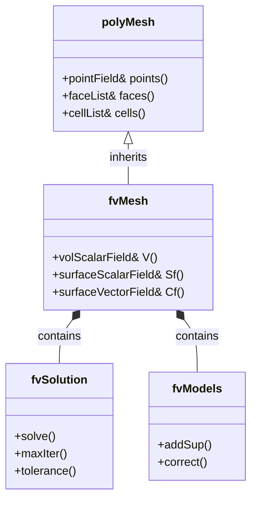
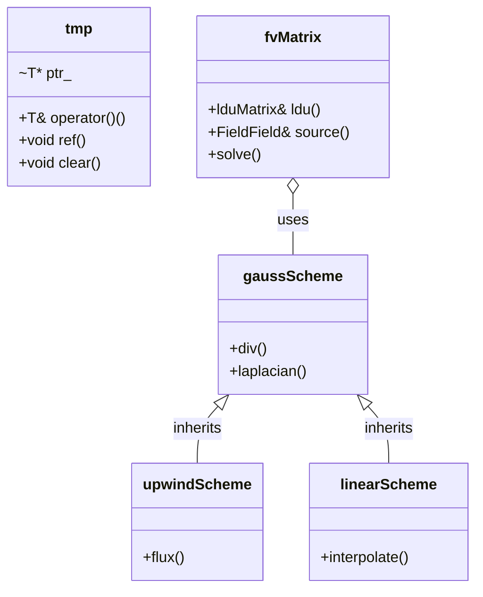
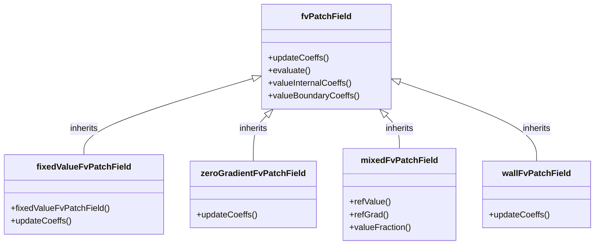
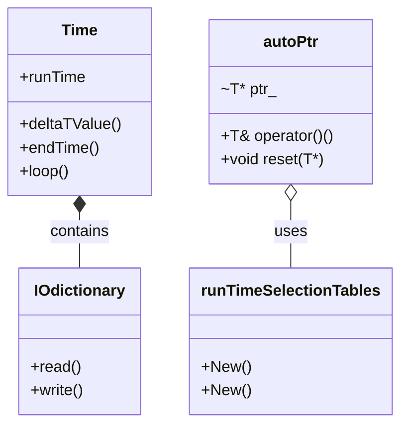

# Governing Equations & OpenFOAM Implementation
## HARDCORE Level - 2026-01-01

---

## Table of Contents
- [1. Theory](#1-theory-core-equations--physics)
- [2. Class Hierarchy](#2-openfoam-class-hierarchy--implementation)
- [3. Code Walkthrough](#3-code-walkthrough)
- [4. Dictionary Analysis](#4-dictionary-analysis--configuration)
- [5. Practical Tasks](#5-hands-on-practical-tasks--coding)
- [6. Concept Checks](#6-concept-checks)

---

## 1. Theory: Core Equations & Physics {#1-theory-core-equations--physics}

### 1.1 Conservation Laws Overview

> [!INFO] **กฎการอนุรักษ์ (Conservation Laws)**
> CFD is built on three fundamental conservation laws:
> - **Mass** (การอนุรักษ์มวล)
> - **Momentum** (การอนุรักษ์โมเมนตัม)
> - **Energy** (การอนุรักษ์พลังงาน)

---

### 1.2 Continuity Equation (Mass Conservation)

$$\frac{\partial \rho}{\partial t} + \nabla \cdot (\rho \mathbf{U}) = 0$$

Where:
- $\rho$ = density (ความหนาแน่น) [kg/m³]
- $\mathbf{U}$ = velocity vector (เวกเตอร์ความเร็ว) [m/s]
- $t$ = time (เวลา) [s]

> [!TIP] **Incompressible Flow (การไหลแบบอัดตัวไม่ได้)**
> For incompressible flows ($\rho = \text{constant}$):
> $$\nabla \cdot \mathbf{U} = 0$$

---

### 1.3 Momentum Equation (Newton's Second Law)

$$\frac{\partial (\rho \mathbf{U})}{\partial t} + \nabla \cdot (\rho \mathbf{U} \mathbf{U}) = -\nabla p + \nabla \cdot \boldsymbol{\tau} + \rho \mathbf{g}$$

Where:
- $p$ = pressure (ความดัน) [Pa]
- $\boldsymbol{\tau}$ = stress tensor (เทนเซอร์ความเค้น) [Pa]
- $\mathbf{g}$ = gravitational acceleration (ความเร่งเนื่องจากแรงโน้มถ่วง) [m/s²]

> [!WARNING] **Navier-Stokes Equations (สมการเนเวียร์-สโตกส์)**
> The momentum equation is the famous Navier-Stokes equation. For Newtonian fluids (ของไหลนิวตัน):
> $$\boldsymbol{\tau} = \mu \left[ \nabla \mathbf{U} + (\nabla \mathbf{U})^T \right] - \frac{2}{3}\mu (\nabla \cdot \mathbf{U})\mathbf{I}$$
>
> Where $\mu$ = dynamic viscosity (ความหนืด) [Pa·s]

---

### 1.4 Energy Equation (First Law of Thermodynamics)

For compressible flows with thermal effects:

$$\frac{\partial (\rho h)}{\partial t} + \nabla \cdot (\rho \mathbf{U} h) = \frac{Dp}{Dt} + \nabla \cdot (k \nabla T) + \boldsymbol{\tau} : \nabla \mathbf{U}$$

Where:
- $h$ = specific enthalpy (เอนทัลปีเฉพาะ) [J/kg]
- $k$ = thermal conductivity (สัมประสิทธิภาพการนำความร้อน) [W/(m·K)]
- $T$ = temperature (อุณหภูมิ) [K]

> [!INFO] **Simplification (การทำให้ง่ายขึ้น)**
> For isothermal flows (การไหลคงอุณหภูมิ), the energy equation can be neglected.

---

### 1.5 Transport Equation General Form

All governing equations can be written in general form:

$$\frac{\partial (\rho \phi)}{\partial t} + \nabla \cdot (\rho \mathbf{U} \phi) = \nabla \cdot (\Gamma_\phi \nabla \phi) + S_\phi$$

| Term | Mathematical Form | Physical Meaning | ความหมาย |
|------|-------------------|------------------|-----------|
| Unsteady | $\frac{\partial (\rho \phi)}{\partial t}$ | Rate of change | อัตราการเปลี่ยนแปลงเมื่อเวลาผ่านไป |
| Convection | $\nabla \cdot (\rho \mathbf{U} \phi)$ | Transport due to fluid motion | การลำเลียงเนื่องจากการเคลื่อนที่ของของไหล |
| Diffusion | $\nabla \cdot (\Gamma_\phi \nabla \phi)$ | Transport due to gradients | การลำเลียงเนื่องจากความชัน |
| Source | $S_\phi$ | Generation/destruction | แหล่งกำเนิด/การสูญสลาย |

Where $\phi$ represents the transported quantity:
- $\phi = 1$ → Continuity equation
- $\phi = \mathbf{U}$ → Momentum equation
- $\phi = h$ or $T$ → Energy equation
- $\phi = k$ → Turbulence kinetic energy (พลังงานจลน์ของความปั่นป่วน)

---

### 1.6 Equation of State

For compressible flows, we need an equation of state (สมการสถานะ):

**Ideal Gas Law (กฎของแก๊สอุดมคติ):**
$$p = \rho R T$$

Where $R$ = specific gas constant (ค่าคงที่แก๊สเฉพาะ) [J/(kg·K)]

---

### 1.7 Turbulence Modeling (การจำลองความปั่นป่วน)

> [!WARNING] **RANS Approach (วิธี RANS)**
> Direct Numerical Simulation (DNS) is too expensive for most engineering applications. Instead, we use Reynolds-Averaged Navier-Stokes (RANS):
>
> Decompose velocity into mean and fluctuating components:
> $$\mathbf{U} = \overline{\mathbf{U}} + \mathbf{U}'$$
>
> This introduces the **Reynolds stress tensor** (เทนเซอร์เค้นเรย์โนลด์):
> $$\boldsymbol{\tau}_R = -\rho \overline{\mathbf{U}' \mathbf{U}'}$$

**Common Turbulence Models (แบบจำลองความปั่นป่วนทั่วไป):**

| Model | Equations | Use Case | กรณีการใช้งาน |
|-------|-----------|----------|-----------------|
| k-ε | 2 equations | High-Re, external flows | การไหลภายนอกเลขเรย์โนลด์สูง |
| k-ω SST | 2 equations | Near-wall, adverse pressure | บริเวณใกล้ผนัง |
| Spalart-Allmaras | 1 equation | Aerodynamics | อากาศพลศาสตร์ |

**Standard k-ε Model:**
$$\frac{\partial (\rho k)}{\partial t} + \nabla \cdot (\rho \mathbf{U} k) = \nabla \cdot \left[ \left(\mu + \frac{\mu_t}{\sigma_k}\right) \nabla k \right] + P_k - \rho \epsilon$$

$$\frac{\partial (\rho \epsilon)}{\partial t} + \nabla \cdot (\rho \mathbf{U} \epsilon) = \nabla \cdot \left[ \left(\mu + \frac{\mu_t}{\sigma_\epsilon}\right) \nabla \epsilon \right] + C_{1\epsilon}\frac{\epsilon}{k}P_k - C_{2\epsilon}\rho\frac{\epsilon^2}{k}$$

Where:
- $k$ = turbulence kinetic energy (พลังงานจลน์ความปั่นป่วน) [m²/s²]
- $\epsilon$ = dissipation rate (อัตราการสลายตัว) [m²/s³]
- $\mu_t = \rho C_\mu \frac{k^2}{\epsilon}$ = eddy viscosity (ความหนืดเอ็ดดี้)

---

### 1.8 Boundary Conditions (เงื่อนไขขอบเขต)

| Type | Mathematical Form | Description | คำอธิบาย |
|------|-------------------|-------------|-----------|
| Dirichlet | $\phi = \phi_0$ | Fixed value | ค่าคงที่ |
| Neumann | $\frac{\partial \phi}{\partial n} = q_0$ | Fixed gradient | ความชันคงที่ |
| Robin | $a\phi + b\frac{\partial \phi}{\partial n} = c$ | Mixed | แบบผสม |
| Wall | $\mathbf{U} = 0$ | No-slip | ไม่มีการลื่นไถล |
| Inlet | $\mathbf{U} = \mathbf{U}_{in}$ | Prescribed velocity | กำหนดความเร็ว |
| Outlet | $\frac{\partial \mathbf{U}}{\partial n} = 0$ | Zero gradient | ความชันเป็นศูนย์ |

---

### 1.9 Dimensionless Numbers (จำนวนไร้มิติ)

**Reynolds Number (เลขเรย์โนลด์ส):**
$$Re = \frac{\rho U L}{\mu} = \frac{U L}{\nu}$$

> Ratio of inertial to viscous forces (อัตราส่วนของแรงเฉื่อยต่อแรงหนืด)

**Mach Number (เลขมัค):**
$$Ma = \frac{U}{c}$$

> Ratio of flow velocity to speed of sound (อัตราส่วนของความเร็วการไหลต่อความเร็วเสียง)

**Prandtl Number (เลขพรานด์ทล์):**
$$Pr = \frac{c_p \mu}{k}$$

> Ratio of momentum diffusivity to thermal diffusivity (อัตราส่วนของการแพร่ของโมเมนตัมต่อการแพร่ของความร้อน)

---

## 2. OpenFOAM Class Hierarchy & Implementation {#2-openfoam-class-hierarchy--implementation}

### 2.1 Core Field Classes (คลาสพื้นฐานสำหรับเขตข้อมูล)

OpenFOAM uses a hierarchical class structure to represent fields (mesh-associated data).

```
GeometricField
├── DimensionedField (no mesh)
├── VolField (cell-centered)
│   ├── volScalarField
│   ├── volVectorField
│   └── volTensorField
└── SurfaceField (face-centered)
    ├── surfaceScalarField
    └── surfaceVectorField
```

> [!INFO] **Field Types (ประเภทของเขตข้อมูล)**
> - **VolField**: Data stored at cell centers (ใช้สำหรับ finite volume method)
> - **SurfaceField**: Data stored at cell faces (ใช้สำหรับ flux calculations)

**Key Source Files:**
- `$FOAM_SRC/finiteVolume/fields/volFields/volFields.H`
- `$FOAM_SRC/finiteVolume/fields/surfaceFields/surfaceFields.H`
- `$FOAM_SRC/OpenFOAM/fields/GeometricField/GeometricField.C`

---

### 2.2 fvMesh & Finite Volume Framework

The `fvMesh` class is the core of OpenFOAM's finite volume implementation.



**Key Source Files:**
- `$FOAM_SRC/finiteVolume/fields/fvMesh/fvMesh.H`
- `$FOAM_SRC/finiteVolume/fvSolution/fvSolution.H`
- `$FOAM_SRC/finiteVolume/fvMesh/fvMesh.C`

> [!TIP] **Mesh Access (การเข้าถึงข้อมูลเมช)**
> ```cpp
> // Access mesh properties
> const volScalarField& V = mesh.V();           // Cell volumes
> const surfaceScalarField& Sf = mesh.Sf();     // Face area vectors
> const surfaceVectorField& Cf = mesh.Cf();     // Face centers
> ```

---

### 2.3 Discretization Schemes (รูปแบบการกระจาย)

OpenFOAM uses a flexible scheme system for discretizing derivatives.



**Key Source Files:**
- `$FOAM_SRC/finiteVolume/finiteVolume/fvSchemes/fvSchemes.C`
- `$FOAM_SRC/finiteVolume/interpolation/surfaceInterpolation/surfaceInterpolationScheme/surfaceInterpolationScheme.H`
- `$FOAM_SRC/finiteVolume/fvMatrices/fvMatrix/fvMatrix.C`

> [!WARNING] **Scheme Selection (การเลือกรูปแบบการกระจาย)**
> Schemes are specified in `system/fvSchemes` dictionary:
> ```foam
> divSchemes
> {
>     default         Gauss upwind;
>     div(phi,U)      Gauss linearUpwind grad(U);
> }
> 
> laplacianSchemes
> {
>     default         Gauss linear corrected;
> }
> ```

---

### 2.4 Linear Solver Classes (คลาสแก้สมการเชิงเส้น)

OpenFOAM provides various linear solvers for the matrix systems.

```
lduMatrix (sparse matrix storage)
├── solvers
│   ├── GAMG (Geometric-Algebraic Multi-Grid)
│   ├── PCG (Preconditioned Conjugate Gradient)
│   ├── PBiCGStab (Preconditioned Bi-Conjugate Gradient Stabilized)
│   └── smoothSolver
└── preconditioners
    ├── DIC (Diagonal Incomplete Cholesky)
    ├── DILU (Diagonal Incomplete LU)
    └── GAMG
```

**Key Source Files:**
- `$FOAM_SRC/OpenFOAM/matrices/lduMatrix/lduMatrix.H`
- `$FOAM_SRC/OpenFOAM/matrices/lduMatrix/solvers/`
- `$FOAM_SRC/OpenFOAM/matrices/lduMatrix/preconditioners/`

> [!INFO] **Solver Configuration (การตั้งค่าตัวแก้สมการ)**
> Specified in `system/fvSolution`:
> ```foam
> solvers
> {
>     p
>     {
>         solver          GAMG;
>         tolerance       1e-06;
>         relTol          0.1;
>         smoother        GaussSeidel;
>     }
>     
>     U
>     {
>         solver          PBiCGStab;
>         preconditioner  DILU;
>         tolerance       1e-05;
>         relTol          0.1;
>     }
> }
> ```

---

### 2.5 Boundary Condition Classes (คลาสเงื่อนไขขอบเขต)

Boundary conditions are implemented through a class hierarchy.



**Key Source Files:**
- `$FOAM_SRC/finiteVolume/fields/fvPatchFields/fvPatchField/fvPatchField.H`
- `$FOAM_SRC/finiteVolume/fields/fvPatchFields/basic/`
- `$FOAM_SRC/finiteVolume/fields/fvPatchFields/constraint/`

> [!TIP] **Common BCs (เงื่อนไขขอบเขตทั่วไป)**
> ```cpp
> // Fixed value (Dirichlet)
> inlet
> {
>     type            fixedValue;
>     value           uniform (10 0 0);
> }
> 
> // Zero gradient (Neumann)
> outlet
> {
>     type            zeroGradient;
> }
> 
> // Wall function
> wall
> {
>     type            wall;
>     nut             kqRWallFunction;
>     value           uniform 0;
> }
> ```

---

### 2.6 Turbulence Modeling Classes (คลาสการจำลองความปั่นป่วน)

Turbulence models follow a modular design pattern.

```
turbulenceModel (abstract base)
├── RASModel (Reynolds-Averaged Simulation)
│   ├── kEpsilon
│   ├── kOmegaSST
│   └── SpalartAllmaras
├── LESModel (Large Eddy Simulation)
│   ├── Smagorinsky
│   └── WALE
└── laminar
```

**Key Source Files:**
- `$FOAM_SRC/turbulenceModels/turbulenceModels/turbulenceModel.H`
- `$FOAM_SRC/turbulenceModels/turbulenceModels/RAS/RASModel.H`
- `$FOAM_SRC/turbulenceModels/turbulenceModels/LES/LESModel.H`

> [!WARNING] **Model Selection (การเลือกแบบจำลอง)**
> Specified in `constant/turbulenceProperties`:
> ```foam
> simulationType  RAS;
> 
> RAS
> {
>     RASModel        kEpsilon;
>     
>     turbulence      on;
>     
>     printCoeffs     on;
> }
> ```

---

### 2.7 Time & RunTime Selection Classes

OpenFOAM uses the Runtime Selection Tables for dynamic object creation.



**Key Source Files:**
- `$FOAM_SRC/OpenFOAM/db/Time/Time.H`
- `$FOAM_SRC/OpenFOAM/db/IOobjects/IOdictionary/IOdictionary.H`
- `$FOAM_SRC/OpenFOAM/memory/autoPtr/autoPtr.H`

> [!INFO] **Runtime Selection (การเลือกขณะรันไทม์)**
> ```cpp
> // Dynamic object creation
> autoPtr<incompressible::turbulenceModel> turbulence
> (
>     incompressible::turbulenceModel::New(U, phi, laminarTransport)
> );
> ```

---

### 2.8 Summary of Key Classes

| Class | Purpose | Source Location |
|-------|---------|-----------------|
| `fvMesh` | Finite volume mesh | `$FOAM_SRC/finiteVolume/fields/fvMesh/` |
| `volScalarField` | Cell-centered scalar field | `$FOAM_SRC/finiteVolume/fields/volFields/` |
| `volVectorField` | Cell-centered vector field | `$FOAM_SRC/finiteVolume/fields/volFields/` |
| `surfaceScalarField` | Face-centered scalar field | `$FOAM_SRC/finiteVolume/fields/surfaceFields/` |
| `fvMatrix` | Discretized equation matrix | `$FOAM_SRC/finiteVolume/fvMatrices/` |
| `fvPatchField` | Boundary condition base | `$FOAM_SRC/finiteVolume/fields/fvPatchFields/` |
| `turbulenceModel` | Turbulence model base | `$FOAM_SRC/turbulenceModels/` |
| `Time` | Time control | `$FOAM_SRC/OpenFOAM/db/Time/` |

> [!TIP] **Navigation Tip (เคล็ดลับการนำทาง)**
> Use `find` and `grep` to locate classes:
> ```bash
> # Find class definition
> find $FOAM_SRC -name "*.H" | xargs grep -l "class fvMesh"
> 
> # Find implementation
> find $FOAM_SRC -name "*.C" | xargs grep -l "fvMesh::"
> ```

---

## 3. Code Walkthrough {#3-code-walkthrough}

### 3.1 UEqn.H

> [!INFO] **สมการโมเมนตัม (Momentum Equation)**
> UEqn.H กำหนดสมการโมเมนตัมแบบไม่บีบอัดสำหรับการแก้ปัญหาเชิงตัวเลข โดยใช้ finite volume method

**Key Code Structure:**

```cpp
// Momentum equation matrix assembly
tmp<fvVectorMatrix> UEqn
(
    fvm::div(phi, U)           // Convection term: ∇·(UU)
  + fvm::laplacian(nu, U)      // Diffusion term: ∇·(ν∇U)
  + fvc::div(phi, T)           // Optional: turbulence contribution
);

// Source term (pressure gradient)
UEqn.relax();

if (piso.momentumPredictor())
{
    solve(UEqn == -fvc::grad(p));  // Solve with pressure gradient
}
```

> [!TIP] **คำอธิบาย (Explanation)**
> - **fvm** (finite volume method): สร้างเมทริกซ์สำหรับ implicit terms
> - **fvc** (finite volume calculus): คำนวณ explicit terms โดยตรง
> - **phi**: คือ flux field [m³/s] คำนวณจาก `phi = U·Sf`
> - **relax()**: ใช้ under-relaxation เพื่อเสถียรภาพการคำนวณ
> - **momentumPredictor**: ควบคุมว่าจะแก้สมการโมเมนตัมหรือไม่

**Pressure-Velocity Coupling:**

```cpp
// PISO loop for pressure-velocity coupling
while (piso.correct())
{
    volScalarField rUA = 1.0/UEqn.A();  // Reciprocal of diagonal
    
    // Pressure equation
    fvScalarMatrix pEqn
    (
        fvm::laplacian(rUA, p) == fvc::div(phi)
    );
    
    pEqn.solve();
    
    // Correct velocity
    U -= rUA*fvc::grad(p);
    U.correctBoundaryConditions();
}
```

> [!WARNING] **ข้อควรระวัง**
> การเลือก discretization scheme ใน `div(phi,U)` ส่งผลต่อความเสถียร:
> - **upwind**: เสถียรแต่ diffusive (เหมาะสำหรับเริ่มต้น)
> - **linear**: แม่นยำแต่อาจไม่เสถียรเมื่อ Re สูง
> - **linearUpwind**: สมดุลระหว่างความแม่นยำและเสถียรภาพ

---

### 3.2 pEqn.H

> [!INFO] **สมการความดัน (Pressure Equation)**
> pEqn.H แก้สมการความดันเพื่อบังคับให้ได้รักษาสมการต่อเนื่อง (continuity equation) โดยใช้ pressure-velocity coupling algorithm

**Key Code Structure:**

```cpp
// Pressure equation matrix assembly
volScalarField rUA = 1.0/UEqn.A();  // Reciprocal of diagonal coefficients

// Pressure Poisson equation
fvScalarMatrix pEqn
(
    fvm::laplacian(rUA, p) == fvc::div(phi)  // ∇·(1/A ∇p) = ∇·U*
);

pEqn.setReference(pRefCell, pRefValue);  // Fix reference pressure
pEqn.solve();

// Correct flux and velocity
phi -= pEqn.flux();                       // φ = φ* - (1/A)∇p
U -= rUA*fvc::grad(p);                    // U = U* - (1/A)∇p
U.correctBoundaryConditions();
```

> [!TIP] **คำอธิบาย (Explanation)**
> - **rUA**: ค่าผกผันของสัมประสิทธิ์เชิงเส้น ใช้ปรับความดันให้สอดคล้องกับความเร็ว
> - **laplacian(rUA, p)**: ด้านซ้ายของสมการ Poisson สำหรับความดัน
> - **div(phi)**: ด้านขวา คือ divergence ของ flux ที่ทำนายจากสมการโมเมนตัม
> - **setReference()**: กำหนดค่าอ้างอิงเพื่อป้องกันปัญหา pressure drift
> - **flux()**: คำนวณการแก้ไข flux จาก gradient ของความดัน

**PISO Algorithm Loop:**

```cpp
// PISO corrections for non-orthogonal meshes
for (int corr = 0; corr < nCorr; corr++)
{
    // Reconstruct pressure equation
    fvScalarMatrix pEqn
    (
        fvm::laplacian(rUA, p) == fvc::div(phi)
    );
    
    pEqn.setReference(pRefCell, pRefValue);
    pEqn.solve();
    
    // Correct flux multiple times for better convergence
    if (corr == nCorr-1)
    {
        phi -= pEqn.flux();
    }
}
```

> [!WARNING] **ข้อควรระวัง**
> การเลือกค่า **nCorr** (number of correctors) ส่งผลต่อ:
> - **nCorr = 1-2**: เร็วแต่อาจไม่收敛ดีสำหรับ non-orthogonal meshes
> - **nCorr = 3-4**: สมดุลระหว่างความเร็วและความแม่นยำ
> - **nNonOrthCorr**: จำนวนรอบย่อยสำหรับ meshes ที่ไม่ orthogonal

### 3.3 createFields.H

> [!INFO] **การสร้างเขตข้อมูล (Field Creation)**
> createFields.H สร้างและเริ่มต้นเขตข้อมูลทั้งหมดที่จำเป็นสำหรับการแก้ปัญหา รวมถึงการอ่านค่าจากไฟล์คอนฟิกูเรชัน

**Key Code Structure:**

```cpp
// Read transport properties (viscosity)
IOdictionary transportProperties
(
    IOobject
    (
        "transportProperties",
        runTime.constant(),
        mesh,
        IOobject::MUST_READ_IF_MODIFIED,
        IOobject::NO_WRITE
    )
);

dimensionedScalar nu
(
    "nu",
    dimViscosity,
    transportProperties
);

// Create velocity field
volVectorField U
(
    IOobject
    (
        "U",
        runTime.timeName(),
        mesh,
        IOobject::MUST_READ,
        IOobject::AUTO_WRITE
    ),
    mesh
);

// Create pressure field
volScalarField p
(
    IOobject
    (
        "p",
        runTime.timeName(),
        mesh,
        IOobject::MUST_READ,
        IOobject::AUTO_WRITE
    ),
    mesh
);

// Calculate flux field: φ = U·Sf
surfaceScalarField phi
(
    IOobject
    (
        "phi",
        runTime.timeName(),
        mesh,
        IOobject::READ_IF_PRESENT,
        IOobject::AUTO_WRITE
    ),
    fvc::flux(U)
);
```

> [!TIP] **คำอธิบาย (Explanation)**
> - **IOdictionary**: อ่านค่าคุณสมบัติการขนส่งจาก `constant/transportProperties`
> - **nu**: ความหนืดจลน์ (kinematic viscosity) [m²/s]
> - **volVectorField U**: เขตข้อมูลความเร็วที่จุดกลางเซลล์ อ่านจาก `0/U`
> - **volScalarField p**: เขตข้อมูลความดันที่จุดกลางเซลล์ อ่านจาก `0/p`
> - **surfaceScalarField phi**: Flux ที่ผิวเซลล์ คำนวณจาก `fvc::flux(U)`
> - **MUST_READ_IF_MODIFIED**: อ่านใหม่ถ้าไฟล์ถูกแก้ไขขณะรัน
> - **AUTO_WRITE**: บันทึกผลลัพธ์อัตโนมัติเมื่อเสร็จสิ้น time step

> [!WARNING] **ข้อควรระวัง**
> การเรียงลำดับของการสร้างเขตข้อมูลมีความสำคัญ:
> 1. ต้องอ่าน `transportProperties` ก่อนเพื่อให้ได้ค่า `nu`
> 2. `phi` ต้องคำนวณจาก `U` ดังนั้น `U` ต้องถูกสร้างก่อน
> 3. ถ้า `phi` มีอยู่แล้วในไฟล์ `0/phi` จะถูกอ่านแทนการคำนวณใหม่

---

## 4. Dictionary Analysis & Configuration {#4-dictionary-analysis--configuration}

### 4.1 fvSchemes Analysis

> [!INFO] **การตั้งค่ารูปแบบการกระจาย (Discretization Schemes Configuration)**
> ไฟล์ `system/fvSchemes` กำหนดวิธีการประมาณค่าเชิงอนุพันธ์ในสมการเชิงอนุพันธ์ ซึ่งมีผลต่อความแม่นยำและความเสถียรของการคำนวณ

#### 4.1.1 ddtSchemes (Temporal Discretization)

**การกระจายเชิงเวลา (Time Derivative Schemes)**

รูปแบบการประมาณค่าอนุพันธ์เชิงเวลา $\frac{\partial \phi}{\partial t}$:

```foam
ddtSchemes
{
    default         Euler;
}
```

| Scheme | Order | Stability | คำอธิบาย |
|--------|-------|-----------|-----------|
| **Euler** | 1st | Conditional | ช้าแต่เสถียร ใช้ deltaT ขนาดเล็ก |
| **backward** | 2nd | Conditional | แม่นยำกว่า แต่ต้องเก็บข้อมูล time step ก่อนหน้า |
| **CrankNicolson** | 2nd | Unconditional | แม่นยำและเสถียร แต่ใช้หน่วยความจำมาก |

> [!TIP] **ข้อแนะนำ**
> - เริ่มต้นด้วย **Euler** สำหรับการทดสอบ
> - ใช้ **backward** หรือ **CrankNicolson** สำหรับการผลิตผลลัพธ์สุดท้าย

---

#### 4.1.2 gradSchemes (Gradient Discretization)

**การกระจายเชิงความชัน (Gradient Schemes)**

รูปแบบการประมาณค่าเกรเดียนต์ $\nabla \phi$:

```foam
gradSchemes
{
    default         Gauss linear;
    
    grad(p)         Gauss linear;
    grad(U)         Gauss linear;
}
```

| Scheme | Order | Accuracy | คำอธิบาย |
|--------|-------|----------|-----------|
| **Gauss linear** | 2nd | Good | ใช้ interpolation เชิงเส้นระหว่างเซลล์ |
| **Gauss linearUpwind** | 2nd | Better | ป้องกัน oscillations สำหรับฟิลด์ที่มีความชันสูง |
| **leastSquares** | 2nd | Good | ใช้ least squares method ไม่ sensitive ต่อ mesh quality |
| **fourth** | 4th | Excellent | ความแม่นยำสูง แต่ต้องการ mesh ที่ดี |

> [!WARNING] **ข้อควรระวัง**
> - **Gauss linear** อาจเกิด unbounded oscillations บน meshes ที่ไม่สม่ำเสมอ
> - ใช้ **cellLimited** หรือ **faceLimited** เพื่อป้องกันค่าที่เกินขอบเขต

---

#### 4.1.3 divSchemes (Divergence Discretization)

**การกระจายเชิงไดเวอร์เจนซ์ (Divergence Schemes)**

รูปแบบการประมาณค่า divergence $\nabla \cdot (\rho \mathbf{U} \phi)$:

```foam
divSchemes
{
    default         none;
    
    div(phi,U)      Gauss upwind;
    div(phi,k)      Gauss upwind;
    div(phi,epsilon) Gauss upwind;
    div(phi,R)      Gauss upwind;
    div((nuEff*dev2(T(grad(U))))) Gauss linear;
}
```

| Scheme | Order | Stability | Diffusion | คำอธิบาย |
|--------|-------|-----------|-----------|-----------|
| **upwind** | 1st | Excellent | High | เสถียรมาก แต่มี numerical diffusion สูง |
| **linear** | 2nd | Poor | None | แม่นยำ แต่ไม่เสถียรเมื่อ Re สูง |
| **linearUpwind** | 2nd | Good | Low | สมดุลระหว่างความแม่นยำและความเสถียร |
| **QUICK** | 3rd | Fair | Low | แม่นยำสูง ใช้กับ structured meshes |
| **limitedLinear** | 2nd | Good | Adjustable | ใช้ limiter เพื่อป้องกัน oscillations |

> [!TIP] **ข้อแนะนำ**
> - ใช้ **upwind** สำหรับ turbulence quantities (k, ε, ω)
> - ใช้ **linearUpwind** หรือ **limitedLinear** สำหรับ velocity (U)
> - ใช้ **linear** สำหรับ diffusion terms เช่น laplacian

---

#### 4.1.4 laplacianSchemes (Laplacian Discretization)

**การกระจายเชิงลาปลาซ (Laplacian Schemes)**

รูปแบบการประมาณค่า Laplacian $\nabla \cdot (\Gamma \nabla \phi)$:

```foam
laplacianSchemes
{
    default         Gauss linear corrected;
}
```

| Scheme | Order | Orthogonality | คำอธิบาย |
|--------|-------|---------------|-----------|
| **Gauss linear** | 2nd | Required | ใช้ corrected interpolation สำหรับ non-orthogonal meshes |
| **Gauss linear corrected** | 2nd | Non-orthogonal | มี correction term สำหรับ meshes ที่ไม่ orthogonal |
| **Gauss linear uncorrected** | 2nd | Orthogonal | เร็วกว่า แต่ต้องการ orthogonal meshes |
| **Gauss cubic** | 4th | Required | ความแม่นยำสูง แต่ใช้เวลานาน |

> [!WARNING] **ข้อควรระวัง**
> - **corrected** จำเป็นสำหรับ meshes ที่มี non-orthogonality > 70°
> - การใช้ **uncorrected** บน non-orthogonal meshes อาจทำให้การแก้ปัญหาไม่收敛

---

#### 4.1.5 interpolationSchemes

**การกระจายเชิงอินเตอร์โพเลชัน (Interpolation Schemes)**

รูปแบบการประมาณค่าจาก cell center ไปยัง face center:

```foam
interpolationSchemes
{
    default         linear;
}
```

| Scheme | Order | คำอธิบาย |
|--------|-------|-----------|
| **linear** | 2nd | ใช้ centroid interpolation |
| **cubic** | 4th | ใช้ cubic interpolation แม่นยำกว่า |
| **upwind** | 1st | ใช้ upwind interpolation สำหรับ convection-dominated flows |

---

#### 4.1.6 snGradSchemes (Surface Normal Gradient)

**การกระจายเชิงเกรเดียนต์ปกติผิว (Surface Normal Gradient Schemes)**

รูปแบบการประมาณค่าเกรเดียนต์ตั้งฉากผิว $\frac{\partial \phi}{\partial n}$:

```foam
snGradSchemes
{
    default         corrected;
}
```

| Scheme | คำอธิบาย |
|--------|-----------|
| **corrected** | มี non-orthogonality correction |
| **uncorrected** | ไม่มี correction ใช้กับ orthogonal meshes เท่านั้น |

---

#### 4.1.7 Example Configuration

**ตัวอย่างการตั้งค่า fvSchemes ที่ดี:**

```foam
FoamFile
{
    version     2.0;
    format      ascii;
    class       dictionary;
    location    "system";
    object      fvSchemes;
}
// * * * * * * * * * * * * * * * * * * * * * * * * * * * * * * * * * * * * * //

ddtSchemes
{
    default         Euler;
}

gradSchemes
{
    default         Gauss linear;
    
    grad(p)         Gauss linear;
    grad(U)         cellLimited Gauss linear 1;
}

divSchemes
{
    default         none;
    
    div(phi,U)      Gauss limitedLinear 1;
    div(phi,k)      Gauss upwind;
    div(phi,epsilon) Gauss upwind;
    div((nuEff*dev2(T(grad(U))))) Gauss linear;
}

laplacianSchemes
{
    default         Gauss linear corrected;
}

interpolationSchemes
{
    default         linear;
}

snGradSchemes
{
    default         corrected;
}

// ************************************************************************* //
```

> [!TIP] **คำอธิบาย**
> - **cellLimited Gauss linear 1**: ใช้ limiter เพื่อป้องกัน oscillations
> - **limitedLinear 1**: ใช้ limiter สำหรับ convection term
> - **corrected**: ใช้ correction สำหรับ non-orthogonal meshes

---

<!-- PLACEHOLDER_FVSOLUTION -->

---

## 5. Hands-on: Practical Tasks & Coding {#5-hands-on-practical-tasks--coding}

<!-- PLACEHOLDER_TASKS -->

---

## 6. Concept Checks {#6-concept-checks}

<!-- PLACEHOLDER_CHECKS -->

---

## Recommended Reading

- OpenFOAM User Guide: https://www.openfoam.com/documentation/user-guide
- OpenFOAM Programmer's Guide: https://doc.openfoam.com/
- CFD Online Forum: https://www.cfd-online.com/Forums/openfoam/

