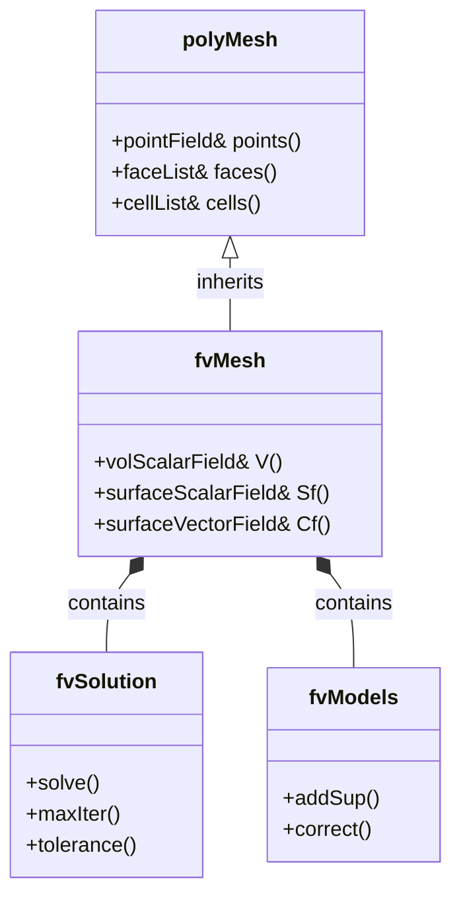
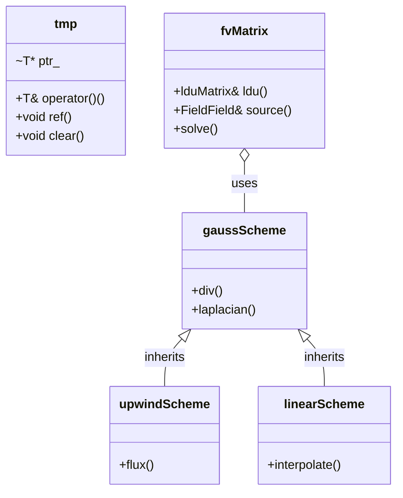
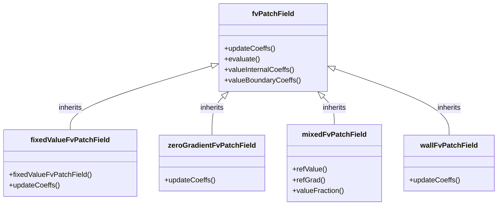
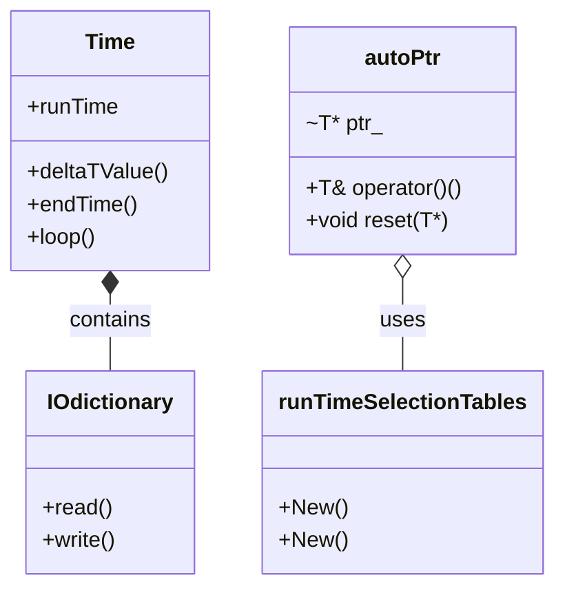

# Governing Equations & OpenFOAM Implementation
## HARDCORE Level - 2026-01-01

---

## Table of Contents
- [1. Theory](#1-theory-core-equations--physics)
- [2. Class Hierarchy](#2-openfoam-class-hierarchy--implementation)
- [3. Code Walkthrough](#3-code-walkthrough)
- [4. Dictionary Analysis](#4-dictionary-analysis--configuration)
- [5. Practical Tasks](#5-hands-on-practical-tasks--coding)
- [6. Concept Checks](#6-concept-checks)

---

## 1. Theory: Core Equations & Physics {#1-theory-core-equations--physics}

### 1.1 Conservation Laws Overview

> [!INFO] **กฎการอนุรักษ์ (Conservation Laws)**
> CFD is built on three fundamental conservation laws:
> - **Mass** (การอนุรักษ์มวล)
> - **Momentum** (การอนุรักษ์โมเมนตัม)
> - **Energy** (การอนุรักษ์พลังงาน)

---

### 1.2 Continuity Equation (Mass Conservation)

$$\frac{\partial \rho}{\partial t} + \nabla \cdot (\rho \mathbf{U}) = 0$$

Where:
- $\rho$ = density (ความหนาแน่น) [kg/m³]
- $\mathbf{U}$ = velocity vector (เวกเตอร์ความเร็ว) [m/s]
- $t$ = time (เวลา) [s]

> [!TIP] **Incompressible Flow (การไหลแบบอัดตัวไม่ได้)**
> For incompressible flows ($\rho = \text{constant}$):
> $$\nabla \cdot \mathbf{U} = 0$$

---

### 1.3 Momentum Equation (Newton's Second Law)

$$\frac{\partial (\rho \mathbf{U})}{\partial t} + \nabla \cdot (\rho \mathbf{U} \mathbf{U}) = -\nabla p + \nabla \cdot \boldsymbol{\tau} + \rho \mathbf{g}$$

Where:
- $p$ = pressure (ความดัน) [Pa]
- $\boldsymbol{\tau}$ = stress tensor (เทนเซอร์ความเค้น) [Pa]
- $\mathbf{g}$ = gravitational acceleration (ความเร่งเนื่องจากแรงโน้มถ่วง) [m/s²]

> [!WARNING] **Navier-Stokes Equations (สมการเนเวียร์-สโตกส์)**
> The momentum equation is the famous Navier-Stokes equation. For Newtonian fluids (ของไหลนิวตัน):
> $$\boldsymbol{\tau} = \mu \left[ \nabla \mathbf{U} + (\nabla \mathbf{U})^T \right] - \frac{2}{3}\mu (\nabla \cdot \mathbf{U})\mathbf{I}$$
>
> Where $\mu$ = dynamic viscosity (ความหนืด) [Pa·s]

---

### 1.4 Energy Equation (First Law of Thermodynamics)

For compressible flows with thermal effects:

$$\frac{\partial (\rho h)}{\partial t} + \nabla \cdot (\rho \mathbf{U} h) = \frac{Dp}{Dt} + \nabla \cdot (k \nabla T) + \boldsymbol{\tau} : \nabla \mathbf{U}$$

Where:
- $h$ = specific enthalpy (เอนทัลปีเฉพาะ) [J/kg]
- $k$ = thermal conductivity (สัมประสิทธิภาพการนำความร้อน) [W/(m·K)]
- $T$ = temperature (อุณหภูมิ) [K]

> [!INFO] **Simplification (การทำให้ง่ายขึ้น)**
> For isothermal flows (การไหลคงอุณหภูมิ), the energy equation can be neglected.

---

### 1.5 Transport Equation General Form

All governing equations can be written in general form:

$$\frac{\partial (\rho \phi)}{\partial t} + \nabla \cdot (\rho \mathbf{U} \phi) = \nabla \cdot (\Gamma_\phi \nabla \phi) + S_\phi$$

| Term | Mathematical Form | Physical Meaning | ความหมาย |
|------|-------------------|------------------|-----------|
| Unsteady | $\frac{\partial (\rho \phi)}{\partial t}$ | Rate of change | อัตราการเปลี่ยนแปลงเมื่อเวลาผ่านไป |
| Convection | $\nabla \cdot (\rho \mathbf{U} \phi)$ | Transport due to fluid motion | การลำเลียงเนื่องจากการเคลื่อนที่ของของไหล |
| Diffusion | $\nabla \cdot (\Gamma_\phi \nabla \phi)$ | Transport due to gradients | การลำเลียงเนื่องจากความชัน |
| Source | $S_\phi$ | Generation/destruction | แหล่งกำเนิด/การสูญสลาย |

Where $\phi$ represents the transported quantity:
- $\phi = 1$ → Continuity equation
- $\phi = \mathbf{U}$ → Momentum equation
- $\phi = h$ or $T$ → Energy equation
- $\phi = k$ → Turbulence kinetic energy (พลังงานจลน์ของความปั่นป่วน)

---

### 1.6 Equation of State

For compressible flows, we need an equation of state (สมการสถานะ):

**Ideal Gas Law (กฎของแก๊สอุดมคติ):**
$$p = \rho R T$$

Where $R$ = specific gas constant (ค่าคงที่แก๊สเฉพาะ) [J/(kg·K)]

---

### 1.7 Turbulence Modeling (การจำลองความปั่นป่วน)

> [!WARNING] **RANS Approach (วิธี RANS)**
> Direct Numerical Simulation (DNS) is too expensive for most engineering applications. Instead, we use Reynolds-Averaged Navier-Stokes (RANS):
>
> Decompose velocity into mean and fluctuating components:
> $$\mathbf{U} = \overline{\mathbf{U}} + \mathbf{U}'$$
>
> This introduces the **Reynolds stress tensor** (เทนเซอร์เค้นเรย์โนลด์):
> $$\boldsymbol{\tau}_R = -\rho \overline{\mathbf{U}' \mathbf{U}'}$$

**Common Turbulence Models (แบบจำลองความปั่นป่วนทั่วไป):**

| Model | Equations | Use Case | กรณีการใช้งาน |
|-------|-----------|----------|-----------------|
| k-ε | 2 equations | High-Re, external flows | การไหลภายนอกเลขเรย์โนลด์สูง |
| k-ω SST | 2 equations | Near-wall, adverse pressure | บริเวณใกล้ผนัง |
| Spalart-Allmaras | 1 equation | Aerodynamics | อากาศพลศาสตร์ |

**Standard k-ε Model:**
$$\frac{\partial (\rho k)}{\partial t} + \nabla \cdot (\rho \mathbf{U} k) = \nabla \cdot \left[ \left(\mu + \frac{\mu_t}{\sigma_k}\right) \nabla k \right] + P_k - \rho \epsilon$$

$$\frac{\partial (\rho \epsilon)}{\partial t} + \nabla \cdot (\rho \mathbf{U} \epsilon) = \nabla \cdot \left[ \left(\mu + \frac{\mu_t}{\sigma_\epsilon}\right) \nabla \epsilon \right] + C_{1\epsilon}\frac{\epsilon}{k}P_k - C_{2\epsilon}\rho\frac{\epsilon^2}{k}$$

Where:
- $k$ = turbulence kinetic energy (พลังงานจลน์ความปั่นป่วน) [m²/s²]
- $\epsilon$ = dissipation rate (อัตราการสลายตัว) [m²/s³]
- $\mu_t = \rho C_\mu \frac{k^2}{\epsilon}$ = eddy viscosity (ความหนืดเอ็ดดี้)

---

### 1.8 Boundary Conditions (เงื่อนไขขอบเขต)

| Type | Mathematical Form | Description | คำอธิบาย |
|------|-------------------|-------------|-----------|
| Dirichlet | $\phi = \phi_0$ | Fixed value | ค่าคงที่ |
| Neumann | $\frac{\partial \phi}{\partial n} = q_0$ | Fixed gradient | ความชันคงที่ |
| Robin | $a\phi + b\frac{\partial \phi}{\partial n} = c$ | Mixed | แบบผสม |
| Wall | $\mathbf{U} = 0$ | No-slip | ไม่มีการลื่นไถล |
| Inlet | $\mathbf{U} = \mathbf{U}_{in}$ | Prescribed velocity | กำหนดความเร็ว |
| Outlet | $\frac{\partial \mathbf{U}}{\partial n} = 0$ | Zero gradient | ความชันเป็นศูนย์ |

---

### 1.9 Dimensionless Numbers (จำนวนไร้มิติ)

**Reynolds Number (เลขเรย์โนลด์ส):**
$$Re = \frac{\rho U L}{\mu} = \frac{U L}{\nu}$$

> Ratio of inertial to viscous forces (อัตราส่วนของแรงเฉื่อยต่อแรงหนืด)

**Mach Number (เลขมัค):**
$$Ma = \frac{U}{c}$$

> Ratio of flow velocity to speed of sound (อัตราส่วนของความเร็วการไหลต่อความเร็วเสียง)

**Prandtl Number (เลขพรานด์ทล์):**
$$Pr = \frac{c_p \mu}{k}$$

> Ratio of momentum diffusivity to thermal diffusivity (อัตราส่วนของการแพร่ของโมเมนตัมต่อการแพร่ของความร้อน)

---

## 2. OpenFOAM Class Hierarchy & Implementation {#2-openfoam-class-hierarchy--implementation}

### 2.1 Core Field Classes (คลาสพื้นฐานสำหรับเขตข้อมูล)

OpenFOAM uses a hierarchical class structure to represent fields (mesh-associated data).

```
GeometricField
├── DimensionedField (no mesh)
├── VolField (cell-centered)
│   ├── volScalarField
│   ├── volVectorField
│   └── volTensorField
└── SurfaceField (face-centered)
    ├── surfaceScalarField
    └── surfaceVectorField
```

> [!INFO] **Field Types (ประเภทของเขตข้อมูล)**
> - **VolField**: Data stored at cell centers (ใช้สำหรับ finite volume method)
> - **SurfaceField**: Data stored at cell faces (ใช้สำหรับ flux calculations)

**Key Source Files:**
- `$FOAM_SRC/finiteVolume/fields/volFields/volFields.H`
- `$FOAM_SRC/finiteVolume/fields/surfaceFields/surfaceFields.H`
- `$FOAM_SRC/OpenFOAM/fields/GeometricField/GeometricField.C`

---

### 2.2 fvMesh & Finite Volume Framework

The `fvMesh` class is the core of OpenFOAM's finite volume implementation.



**Key Source Files:**
- `$FOAM_SRC/finiteVolume/fields/fvMesh/fvMesh.H`
- `$FOAM_SRC/finiteVolume/fvSolution/fvSolution.H`
- `$FOAM_SRC/finiteVolume/fvMesh/fvMesh.C`

> [!TIP] **Mesh Access (การเข้าถึงข้อมูลเมช)**
> ```cpp
> // Access mesh properties
> const volScalarField& V = mesh.V();           // Cell volumes
> const surfaceScalarField& Sf = mesh.Sf();     // Face area vectors
> const surfaceVectorField& Cf = mesh.Cf();     // Face centers
> ```

---

### 2.3 Discretization Schemes (รูปแบบการกระจาย)

OpenFOAM uses a flexible scheme system for discretizing derivatives.



**Key Source Files:**
- `$FOAM_SRC/finiteVolume/finiteVolume/fvSchemes/fvSchemes.C`
- `$FOAM_SRC/finiteVolume/interpolation/surfaceInterpolation/surfaceInterpolationScheme/surfaceInterpolationScheme.H`
- `$FOAM_SRC/finiteVolume/fvMatrices/fvMatrix/fvMatrix.C`

> [!WARNING] **Scheme Selection (การเลือกรูปแบบการกระจาย)**
> Schemes are specified in `system/fvSchemes` dictionary:
> ```foam
> divSchemes
> {
>     default         Gauss upwind;
>     div(phi,U)      Gauss linearUpwind grad(U);
> }
> 
> laplacianSchemes
> {
>     default         Gauss linear corrected;
> }
> ```

---

### 2.4 Linear Solver Classes (คลาสแก้สมการเชิงเส้น)

OpenFOAM provides various linear solvers for the matrix systems.

```
lduMatrix (sparse matrix storage)
├── solvers
│   ├── GAMG (Geometric-Algebraic Multi-Grid)
│   ├── PCG (Preconditioned Conjugate Gradient)
│   ├── PBiCGStab (Preconditioned Bi-Conjugate Gradient Stabilized)
│   └── smoothSolver
└── preconditioners
    ├── DIC (Diagonal Incomplete Cholesky)
    ├── DILU (Diagonal Incomplete LU)
    └── GAMG
```

**Key Source Files:**
- `$FOAM_SRC/OpenFOAM/matrices/lduMatrix/lduMatrix.H`
- `$FOAM_SRC/OpenFOAM/matrices/lduMatrix/solvers/`
- `$FOAM_SRC/OpenFOAM/matrices/lduMatrix/preconditioners/`

> [!INFO] **Solver Configuration (การตั้งค่าตัวแก้สมการ)**
> Specified in `system/fvSolution`:
> ```foam
> solvers
> {
>     p
>     {
>         solver          GAMG;
>         tolerance       1e-06;
>         relTol          0.1;
>         smoother        GaussSeidel;
>     }
>     
>     U
>     {
>         solver          PBiCGStab;
>         preconditioner  DILU;
>         tolerance       1e-05;
>         relTol          0.1;
>     }
> }
> ```

---

### 2.5 Boundary Condition Classes (คลาสเงื่อนไขขอบเขต)

Boundary conditions are implemented through a class hierarchy.



**Key Source Files:**
- `$FOAM_SRC/finiteVolume/fields/fvPatchFields/fvPatchField/fvPatchField.H`
- `$FOAM_SRC/finiteVolume/fields/fvPatchFields/basic/`
- `$FOAM_SRC/finiteVolume/fields/fvPatchFields/constraint/`

> [!TIP] **Common BCs (เงื่อนไขขอบเขตทั่วไป)**
> ```cpp
> // Fixed value (Dirichlet)
> inlet
> {
>     type            fixedValue;
>     value           uniform (10 0 0);
> }
> 
> // Zero gradient (Neumann)
> outlet
> {
>     type            zeroGradient;
> }
> 
> // Wall function
> wall
> {
>     type            wall;
>     nut             kqRWallFunction;
>     value           uniform 0;
> }
> ```

---

### 2.6 Turbulence Modeling Classes (คลาสการจำลองความปั่นป่วน)

Turbulence models follow a modular design pattern.

```
turbulenceModel (abstract base)
├── RASModel (Reynolds-Averaged Simulation)
│   ├── kEpsilon
│   ├── kOmegaSST
│   └── SpalartAllmaras
├── LESModel (Large Eddy Simulation)
│   ├── Smagorinsky
│   └── WALE
└── laminar
```

**Key Source Files:**
- `$FOAM_SRC/turbulenceModels/turbulenceModels/turbulenceModel.H`
- `$FOAM_SRC/turbulenceModels/turbulenceModels/RAS/RASModel.H`
- `$FOAM_SRC/turbulenceModels/turbulenceModels/LES/LESModel.H`

> [!WARNING] **Model Selection (การเลือกแบบจำลอง)**
> Specified in `constant/turbulenceProperties`:
> ```foam
> simulationType  RAS;
> 
> RAS
> {
>     RASModel        kEpsilon;
>     
>     turbulence      on;
>     
>     printCoeffs     on;
> }
> ```

---

### 2.7 Time & RunTime Selection Classes

OpenFOAM uses the Runtime Selection Tables for dynamic object creation.



**Key Source Files:**
- `$FOAM_SRC/OpenFOAM/db/Time/Time.H`
- `$FOAM_SRC/OpenFOAM/db/IOobjects/IOdictionary/IOdictionary.H`
- `$FOAM_SRC/OpenFOAM/memory/autoPtr/autoPtr.H`

> [!INFO] **Runtime Selection (การเลือกขณะรันไทม์)**
> ```cpp
> // Dynamic object creation
> autoPtr<incompressible::turbulenceModel> turbulence
> (
>     incompressible::turbulenceModel::New(U, phi, laminarTransport)
> );
> ```

---

### 2.8 Summary of Key Classes

| Class | Purpose | Source Location |
|-------|---------|-----------------|
| `fvMesh` | Finite volume mesh | `$FOAM_SRC/finiteVolume/fields/fvMesh/` |
| `volScalarField` | Cell-centered scalar field | `$FOAM_SRC/finiteVolume/fields/volFields/` |
| `volVectorField` | Cell-centered vector field | `$FOAM_SRC/finiteVolume/fields/volFields/` |
| `surfaceScalarField` | Face-centered scalar field | `$FOAM_SRC/finiteVolume/fields/surfaceFields/` |
| `fvMatrix` | Discretized equation matrix | `$FOAM_SRC/finiteVolume/fvMatrices/` |
| `fvPatchField` | Boundary condition base | `$FOAM_SRC/finiteVolume/fields/fvPatchFields/` |
| `turbulenceModel` | Turbulence model base | `$FOAM_SRC/turbulenceModels/` |
| `Time` | Time control | `$FOAM_SRC/OpenFOAM/db/Time/` |

> [!TIP] **Navigation Tip (เคล็ดลับการนำทาง)**
> Use `find` and `grep` to locate classes:
> ```bash
> # Find class definition
> find $FOAM_SRC -name "*.H" | xargs grep -l "class fvMesh"
> 
> # Find implementation
> find $FOAM_SRC -name "*.C" | xargs grep -l "fvMesh::"
> ```

---

## 3. Code Walkthrough {#3-code-walkthrough}

### 3.1 UEqn.H

> [!INFO] **สมการโมเมนตัม (Momentum Equation)**
> UEqn.H กำหนดสมการโมเมนตัมแบบไม่บีบอัดสำหรับการแก้ปัญหาเชิงตัวเลข โดยใช้ finite volume method

**Key Code Structure:**

```cpp
// Momentum equation matrix assembly
tmp<fvVectorMatrix> UEqn
(
    fvm::div(phi, U)           // Convection term: ∇·(UU)
  + fvm::laplacian(nu, U)      // Diffusion term: ∇·(ν∇U)
  + fvc::div(phi, T)           // Optional: turbulence contribution
);

// Source term (pressure gradient)
UEqn.relax();

if (piso.momentumPredictor())
{
    solve(UEqn == -fvc::grad(p));  // Solve with pressure gradient
}
```

> [!TIP] **คำอธิบาย (Explanation)**
> - **fvm** (finite volume method): สร้างเมทริกซ์สำหรับ implicit terms
> - **fvc** (finite volume calculus): คำนวณ explicit terms โดยตรง
> - **phi**: คือ flux field [m³/s] คำนวณจาก `phi = U·Sf`
> - **relax()**: ใช้ under-relaxation เพื่อเสถียรภาพการคำนวณ
> - **momentumPredictor**: ควบคุมว่าจะแก้สมการโมเมนตัมหรือไม่

**Pressure-Velocity Coupling:**

```cpp
// PISO loop for pressure-velocity coupling
while (piso.correct())
{
    volScalarField rUA = 1.0/UEqn.A();  // Reciprocal of diagonal
    
    // Pressure equation
    fvScalarMatrix pEqn
    (
        fvm::laplacian(rUA, p) == fvc::div(phi)
    );
    
    pEqn.solve();
    
    // Correct velocity
    U -= rUA*fvc::grad(p);
    U.correctBoundaryConditions();
}
```

> [!WARNING] **ข้อควรระวัง**
> การเลือก discretization scheme ใน `div(phi,U)` ส่งผลต่อความเสถียร:
> - **upwind**: เสถียรแต่ diffusive (เหมาะสำหรับเริ่มต้น)
> - **linear**: แม่นยำแต่อาจไม่เสถียรเมื่อ Re สูง
> - **linearUpwind**: สมดุลระหว่างความแม่นยำและเสถียรภาพ

<!-- PLACEHOLDER_CODE_NEXT -->

---

## 4. Dictionary Analysis & Configuration {#4-dictionary-analysis--configuration}

<!-- PLACEHOLDER_DICT -->

---

## 5. Hands-on: Practical Tasks & Coding {#5-hands-on-practical-tasks--coding}

<!-- PLACEHOLDER_TASKS -->

---

## 6. Concept Checks {#6-concept-checks}

<!-- PLACEHOLDER_CHECKS -->

---

## Recommended Reading

- OpenFOAM User Guide: https://www.openfoam.com/documentation/user-guide
- OpenFOAM Programmer's Guide: https://doc.openfoam.com/
- CFD Online Forum: https://www.cfd-online.com/Forums/openfoam/

