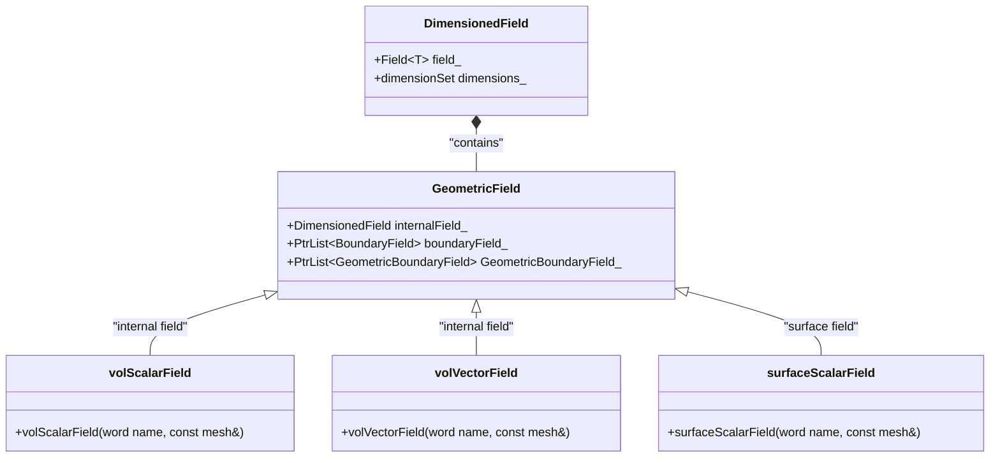
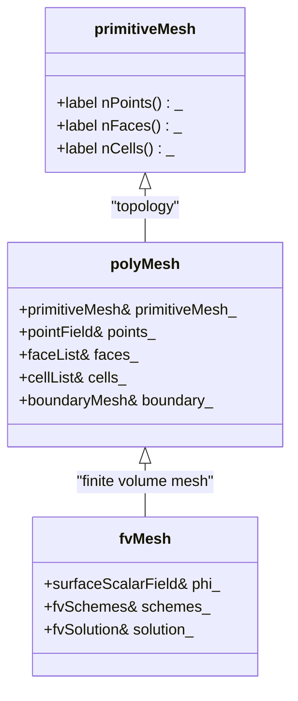
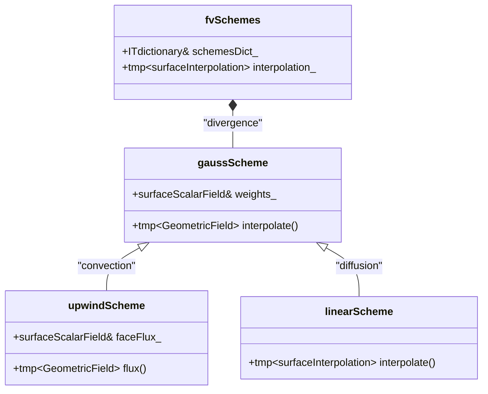
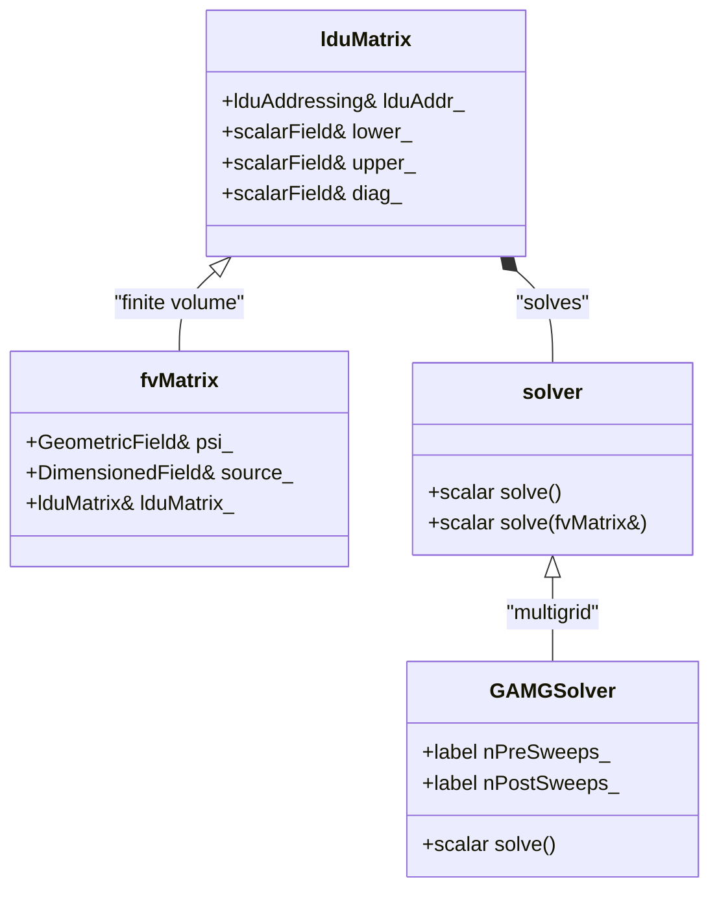
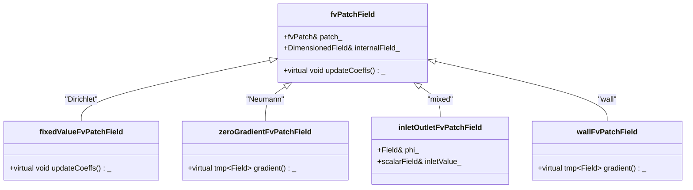
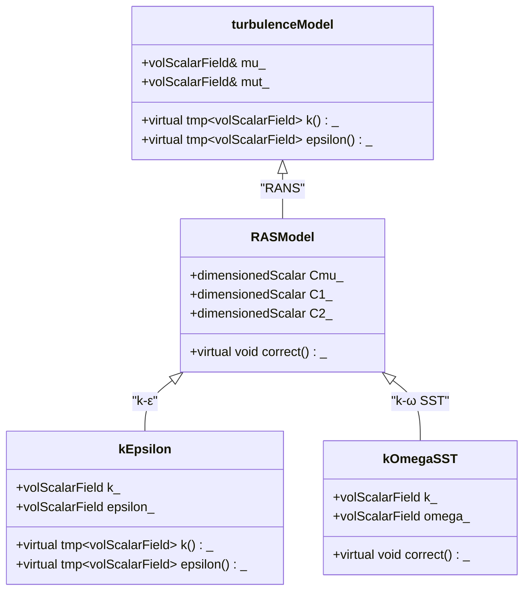
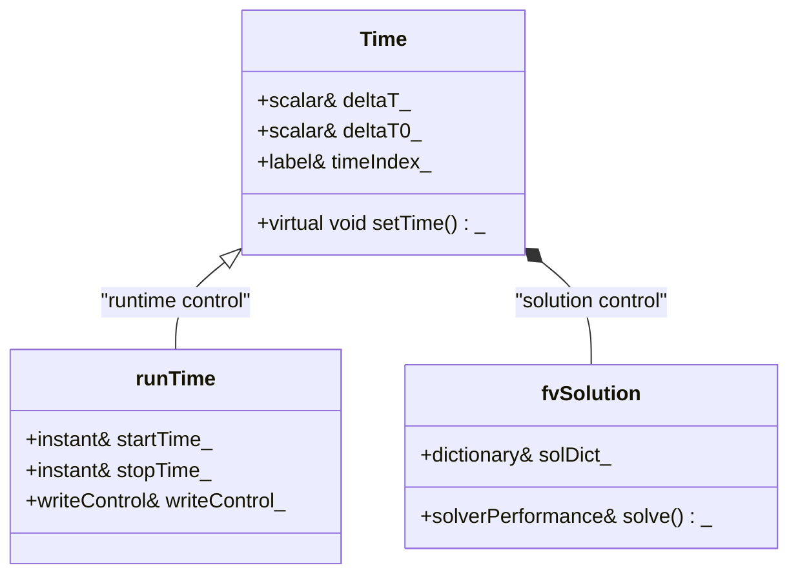

# Governing Equations & OpenFOAM Implementation
## HARDCORE Level - 2026-01-01

---

## Table of Contents
- [1. Theory](#1-theory-core-equations--physics)
- [2. Class Hierarchy](#2-openfoam-class-hierarchy--implementation)
- [3. Code Walkthrough](#3-code-walkthrough)
- [4. Dictionary Analysis](#4-dictionary-analysis--configuration)
- [5. Practical Tasks](#5-hands-on-practical-tasks--coding)
- [6. Concept Checks](#6-concept-checks)

---

## 1. Theory: Core Equations & Physics {#1-theory-core-equations--physics}

### 1.1 Conservation Laws (กฎการอนุรักษ์)

The foundation of CFD rests on three fundamental conservation laws:

> [!INFO] **กฎการอนุรักษ์ (Conservation Laws)**: หลักการพื้นฐานที่ระบุปริมาณต่างๆ เช่น มวล โมเมนตัม และพลังงาน ไม่สามารถสร้างหรือทำลายได้ แต่สามารถเปลี่ยนรูปแบบได้

#### Mass Conservation (การอนุรักษ์มวล)

$$\frac{\partial \rho}{\partial t} + \nabla \cdot (\rho \mathbf{U}) = 0$$

Where:
- $\rho$ = density (ความหนาแน่น) [kg/m³]
- $\mathbf{U}$ = velocity vector (เวกเตอร์ความเร็ว) [m/s]
- $t$ = time (เวลา) [s]

> [!TIP] **Incompressible Flow (การไหลแบบอัดแล้วไม่คงที่)**: For $\rho = \text{constant}$, this simplifies to $\nabla \cdot \mathbf{U} = 0$

#### Momentum Conservation (การอนุรักษ์โมเมนตัม)

$$\frac{\partial (\rho \mathbf{U})}{\partial t} + \nabla \cdot (\rho \mathbf{U} \mathbf{U}) = -\nabla p + \nabla \cdot \boldsymbol{\tau} + \rho \mathbf{g}$$

Where:
- $p$ = pressure (ความดัน) [Pa]
- $\boldsymbol{\tau}$ = stress tensor (เทนเซอร์ความเค้น) [Pa]
- $\mathbf{g}$ = gravitational acceleration (ความเร่งเนื่องจากแรงโน้มถ่วง) [m/s²]

> [!WARNING] **Newtonian Fluid (ของไหลนิวตัน)**: For Newtonian fluids, $\boldsymbol{\tau} = \mu (\nabla \mathbf{U} + (\nabla \mathbf{U})^T - \frac{2}{3}(\nabla \cdot \mathbf{U})\mathbf{I})$

#### Energy Conservation (การอนุรักษ์พลังงาน)

$$\frac{\partial (\rho h)}{\partial t} + \nabla \cdot (\rho \mathbf{U} h) = \frac{Dp}{Dt} + \nabla \cdot (k \nabla T) + \boldsymbol{\tau} : \nabla \mathbf{U}$$

Where:
- $h$ = specific enthalpy (เอนทัลปีเฉพาะ) [J/kg]
- $k$ = thermal conductivity (สัมประสิทธิ์การนำความร้อน) [W/(m·K)]
- $T$ = temperature (อุณหภูมิ) [K]

---

### 1.2 Navier-Stokes Equations (สมการนาเวียร์-สโตกส์)

For incompressible Newtonian flow (การไหลแบบอัดแล้วไม่คงที่ของของไหลนิวตัน):

$$\nabla \cdot \mathbf{U} = 0$$

$$\frac{\partial \mathbf{U}}{\partial t} + (\mathbf{U} \cdot \nabla)\mathbf{U} = -\frac{1}{\rho}\nabla p + \nu \nabla^2 \mathbf{U} + \mathbf{g}$$

Where $\nu = \mu/\rho$ is the kinematic viscosity (ความหนืดเชิงจลน์) [m²/s]

> [!INFO] **Convection Terms (เทอมการพาความร้อน)**: $(\mathbf{U} \cdot \nabla)\mathbf{U}$ represents nonlinear convection (การพาแบบไม่เชิงเส้น) - the primary source of complexity in turbulence

---

### 1.3 Reynolds-Averaged Equations (สมการเฉลี่ยเรย์โนลด์ส)

Applying Reynolds decomposition (การวิเคราะห์เรย์โนลด์ส): $\mathbf{U} = \overline{\mathbf{U}} + \mathbf{U}'$

$$\frac{\partial \overline{\mathbf{U}}}{\partial t} + (\overline{\mathbf{U}} \cdot \nabla)\overline{\mathbf{U}} = -\frac{1}{\rho}\nabla \overline{p} + \nu \nabla^2 \overline{\mathbf{U}} - \nabla \cdot \mathbf{R} + \mathbf{g}$$

Where $\mathbf{R} = \overline{\mathbf{U}'\mathbf{U}'}$ is the Reynolds stress tensor (เทนเซอร์ความเค้นเรย์โนลด์ส)

> [!WARNING] **Closure Problem (ปัญหาการปิดสมการ)**: The Reynolds stresses introduce 6 unknowns for only 4 available equations - requires turbulence modeling (แบบจำลองความปั่นป่วน)

---

### 1.4 Turbulence Modeling (แบบจำลองความปั่นป่วน)

#### k-ε Model (แบบจำลอง k-ε)

$$\frac{\partial k}{\partial t} + \nabla \cdot (\mathbf{U} k) = \nabla \cdot \left[\left(\nu + \frac{\nu_t}{\sigma_k}\right)\nabla k\right] + P_k - \varepsilon$$

$$\frac{\partial \varepsilon}{\partial t} + \nabla \cdot (\mathbf{U} \varepsilon) = \nabla \cdot \left[\left(\nu + \frac{\nu_t}{\sigma_\varepsilon}\right)\nabla \varepsilon\right] + C_{1\varepsilon}\frac{\varepsilon}{k}P_k - C_{2\varepsilon}\frac{\varepsilon^2}{k}$$

Where:
- $k$ = turbulent kinetic energy (พลังงานจลน์ของความปั่นป่วน) [m²/s²]
- $\varepsilon$ = dissipation rate (อัตราการสลายตัว) [m²/s³]
- $\nu_t = C_\mu \frac{k^2}{\varepsilon}$ = eddy viscosity (ความหนืดเชิงกระแสน้ำวน)

| Constant | Value | Description |
|----------|-------|-------------|
| $C_\mu$ | 0.09 | Turbulent viscosity constant |
| $C_{1\varepsilon}$ | 1.44 | Production coefficient |
| $C_{2\varepsilon}$ | 1.92 | Destruction coefficient |
| $\sigma_k$ | 1.0 | k Prandtl number |
| $\sigma_\varepsilon$ | 1.3 | ε Prandtl number |

> [!TIP] **Standard k-ε Model**: Best for high-Reynolds number flows (การไหลเรย์โนลด์สสูง) far from walls (ห่างจากผนัง)

---

### 1.5 Boundary Conditions (เงื่อนไขขอบเขต)

#### Velocity Inlet (ทางเข้าความเร็ว)
$$\mathbf{U} = \mathbf{U}_{\text{inlet}}, \quad k = k_{\text{inlet}}, \quad \varepsilon = \varepsilon_{\text{inlet}}$$

#### Pressure Outlet (ทางออกความดัน)
$$p = p_{\text{outlet}}, \quad \nabla \mathbf{U} \cdot \mathbf{n} = 0$$

#### No-Slip Wall (ผนังไม่ลื่น)
$$\mathbf{U} = 0, \quad k = 0, \quad \varepsilon = \frac{2\nu k}{y^2} \text{ (near wall)}$$

> [!INFO] **Wall Functions (ฟังก์ชันผนัง)**: Used to bridge the viscosity-affected region (บริเวณที่ได้รับอิทธิพลจากความหนืด) without resolving viscous sublayer (ชั้นบริเวณผนังเชิงหนืด)

---

### 1.6 Dimensionless Numbers (จำนวนไร้มิติ)

| Number | Formula | Physical Meaning |
|--------|---------|------------------|
| Reynolds (เรย์โนลด์ส) | $Re = \frac{\rho U L}{\mu}$ | Inertia/Viscosity forces ratio |
| Mach (มัค) | $Ma = \frac{U}{c}$ | Flow speed/Sound speed ratio |
| Prandtl (พรานด์ทล์) | $Pr = \frac{\mu c_p}{k}$ | Momentum/Thermal diffusivity ratio |

> [!WARNING] **Compressibility (การอัดตัวได้)**: For $Ma > 0.3$, compressibility effects (เอฟเฟกต์การอัดตัว) become significant

---

## 2. OpenFOAM Class Hierarchy & Implementation {#2-openfoam-class-hierarchy--implementation}

### 2.1 Core Field Classes (คลาสฟิลด์พื้นฐาน)

OpenFOAM uses a hierarchical field system to represent continuum mechanics variables.



> [!INFO] **GeometricField (คลาสฟิลด์เรขาคณิต)**: Template class that manages field data on mesh entities (cells, faces, points)

#### Key Field Types (ประเภทฟิลด์หลัก)

| Class | Description | Source Location |
|-------|-------------|-----------------|
| `volScalarField` | Scalar field on cell centers | `$FOAM_SRC/finiteVolume/fields/volFields/volScalarField` |
| `volVectorField` | Vector field on cell centers | `$FOAM_SRC/finiteVolume/fields/volFields/volVectorField` |
| `surfaceScalarField` | Scalar field on face centers | `$FOAM_SRC/finiteVolume/fields/surfaceFields/surfaceScalarField` |
| `pointScalarField` | Scalar field on mesh points | `$FOAM_SRC/finiteVolume/fields/pointFields` |

> [!TIP] **Field Naming Convention**: `vol` = cell-centered (จุดศูนย์ถ่วงเซลล์), `surface` = face-centered (จุดศูนย์ถ่วงหน้า), `point` = vertex-centered (จุดยอด)

---

### 2.2 Mesh Classes (คลาสเมช)

The mesh infrastructure provides the geometric framework for discretization.



#### Mesh Hierarchy (ลำดับชั้นเมช)

```
polyMesh (โพลีเมช)
├── points (จุดยอดจุด)
├── faces (หน้า)
├── cells (เซลล์)
└── boundary (เขตแดน)
    ├── polyPatch (แพตช์โพลี)
    └── fvPatch (แพตช์ปริมาตรจำกัด)
```

> [!WARNING] **Mesh Topology (โทโพโลยีเมช)**: OpenFOAM uses cell-centered finite volume method where all variables are stored at cell centers

#### Source Files (แหล่งไฟล์)

| Component | Path |
|-----------|------|
| `polyMesh` | `$FOAM_SRC/meshes/polyMesh/polyMesh` |
| `fvMesh` | `$FOAM_SRC/finiteVolume/fvMesh/fvMesh` |
| `fvPatch` | `$FOAM_SRC/finiteVolume/fvMesh/fvPatch` |

---

### 2.3 Discretization Schemes (รูปแบบการกระจาย)

OpenFOAM implements various numerical schemes through abstract base classes.



> [!INFO] **Gauss Theorem (ทฤษฎีเกาส์)**: All finite volume schemes in OpenFOAM use Gauss theorem to convert volume integrals to surface integrals

#### Common Schemes (รูปแบบทั่วไป)

| Scheme | Application | Stability | Accuracy |
|--------|-------------|-----------|----------|
| `Gauss upwind` | Convection (การพา) | High (สูง) | First-order (อันดับหนึ่ง) |
| `Gauss linear` | Diffusion (การแพร่) | Medium (ปานกลาง) | Second-order (อันดับสอง) |
| `Gauss linearUpwind` | Convection (การพา) | Medium (ปานกลาง) | Second-order (อันดับสอง) |
| `Gauss QUICK` | Convection (การพา) | Low (ต่ำ) | Third-order (อันดับสาม) |

> [!TIP] **Scheme Selection (การเลือกรูปแบบ)**: Use `upwind` for stability in initial calculations, switch to `linear` or `linearUpwind` for final results

#### Source Locations (ตำแหน่งแหล่งที่มา)

```bash
# Convection schemes
$FOAM_SRC/finiteVolume/interpolation/surfaceInterpolationScheme/schemes/upwind

# Divergence schemes
$FOAM_SRC/finiteVolume/fvSchemes/divSchemes

# Gradient schemes
$FOAM_SRC/finiteVolume/fvSchemes/gradSchemes
```

---

### 2.4 Linear Solver Classes (คลาสโซลเวอร์เชิงเส้น)

The linear algebra system handles matrix assembly and solution.



> [!WARNING] **Matrix Structure (โครงสร้างเมทริกซ์)**: OpenFOAM uses LDU (Lower-Diagonal-Upper) storage format for sparse matrices

#### Solver Hierarchy (ลำดับชั้นโซลเวอร์)

```
solver (โซลเวอร์)
├── iterativeSolver (โซลเวอร์วนซ้ำ)
│   ├── GAMG (Geometric-Algebraic Multi-Grid)
│   ├── PCG (Preconditioned Conjugate Gradient)
│   └── PBiCGStab (Preconditioned Bi-Conjugate Gradient Stabilized)
└── smoothSolver (โซลเวอร์ทำให้เรียบ)
    ├── GaussSeidel
    └── symGaussSeidel
```

#### Common Solvers (โซลเวอร์ทั่วไป)

| Solver | Matrix Type | Preconditioner | Use Case |
|--------|-------------|----------------|----------|
| `GAMG` | Symmetric (สมมาตร) | Geometric multigrid | Large systems (ระบบขนาดใหญ่) |
| `PCG` | Symmetric (สมมาตร) | DIC (Diagonal Incomplete Cholesky) | Pressure (ความดัน) |
| `PBiCGStab` | Asymmetric (ไม่สมมาตร) | DILU (Diagonal Incomplete LU) | Velocity (ความเร็ว) |
| `smoothSolver` | Any (ใดๆ) | Gauss-Seidel | Small systems (ระบบขนาดเล็ก) |

> [!INFO] **Preconditioning (การเตรียมเงื่อนไข)**: Transforms the system to improve convergence properties (คุณสมบัติการลู่เข้า)

#### Source Files (แหล่งไฟล์)

| Component | Path |
|-----------|------|
| `lduMatrix` | `$FOAM_SRC/matrices/lduMatrix` |
| `fvMatrix` | `$FOAM_SRC/finiteVolume/fvMatrices/fvMatrix` |
| `GAMG` | `$FOAM_SRC/matrices/lduMatrix/solvers/GAMG` |
| `PCG` | `$FOAM_SRC/matrices/lduMatrix/solvers/PCG` |

---

### 2.5 Boundary Condition Classes (คลาสเงื่อนไขขอบเขต)

Boundary conditions are implemented through a polymorphic patch system.



#### BC Hierarchy (ลำดับชั้นเงื่อนไขขอบเขต)

```
fvPatchField (ฟิลด์แพตช์ปริมาตรจำกัด)
├── fixedValue (ค่าคงที่) - Dirichlet BC
├── fixedGradient (ไล่ระดับคงที่) - Neumann BC
├── zeroGradient (ไล่ระดับศูนย์) - Natural BC
├── inletOutlet (ทางเข้าทางออก) - Convective BC
└── wall (ผนัง) - Wall function BC
```

> [!TIP] **Boundary Condition Selection (การเลือกเงื่อนไขขอบเขต)**: Use `fixedValue` for inlets (ทางเข้า), `zeroGradient` for outlets (ทางออก), and `wall` for solid boundaries (เขตแดนของแข็ง)

#### Common Boundary Conditions (เงื่อนไขขอบเขตทั่วไป)

| BC Type | Mathematical Form | Application |
|---------|-------------------|-------------|
| `fixedValue` | $\phi = \phi_{\text{wall}}$ | Velocity inlet (ทางเข้าความเร็ว) |
| `zeroGradient` | $\nabla \phi \cdot \mathbf{n} = 0$ | Pressure outlet (ทางออกความดัน) |
| `fixedGradient` | $\nabla \phi \cdot \mathbf{n} = g_{\text{wall}}$ | Heat flux (อัตราการไหลของความร้อน) |
| `inletOutlet` | $\phi = \begin{cases} \phi_{\text{in}} & \phi \cdot \mathbf{n} < 0 \\ \nabla \phi \cdot \mathbf{n} = 0 & \phi \cdot \mathbf{n} \geq 0 \end{cases}$ | Backflow prevention (ป้องกันการไหลย้อน) |

#### Source Locations (ตำแหน่งแหล่งที่มา)

```bash
# Basic BCs
$FOAM_SRC/finiteVolume/fields/fvPatchFields/basic

# Derived BCs
$FOAM_SRC/finiteVolume/fields/fvPatchFields/derived

# Constraint BCs
$FOAM_SRC/finiteVolume/fields/fvPatchFields/constraint
```

---

### 2.6 Turbulence Model Classes (คลาสแบบจำลองความปั่นป่วน)

Turbulence models follow a strict inheritance hierarchy for polymorphism.



> [!INFO] **RANS (Reynolds-Averaged Navier-Stokes)**: All RAS models derive from `RASModel` base class

#### Turbulence Model Hierarchy (ลำดับชั้นแบบจำลองความปั่นป่วน)

```
turbulenceModel (แบบจำลองความปั่นป่วน)
├── RASModel (แบบจำลอง RAS)
│   ├── kEpsilon (k-ε มาตรฐาน)
│   ├── kOmegaSST (k-ω SST)
│   ├── RNGkEpsilon (RNG k-ε)
│   └── realizableKE (k-ε ที่เป็นจริงได้)
└── LESModel (แบบจำลอง LES)
    ├── Smagorinsky (สมากอรินสกี)
    └── dynamicKEqn (k-equation พลวัต)
```

#### Model Comparison (การเปรียบเทียบแบบจำลอง)

| Model | k-ε | k-ω SST | RNG k-ε |
|-------|-----|---------|---------|
| Wall Treatment | Wall functions (ฟังก์ชันผนัง) | Low-Re (เรย์โนลด์สต่ำ) | Wall functions (ฟังก์ชันผนัง) |
| Accuracy (ความแม่นยำ) | Medium (ปานกลาง) | High (สูง) | Medium-High (ปานกลาง-สูง) |
| Stability (เสถียรภาพ) | High (สูง) | Medium (ปานกลาง) | High (สูง) |
| Cost (ต้นทุน) | Low (ต่ำ) | Medium (ปานกลาง) | Low-Medium (ต่ำ-ปานกลาง) |

> [!WARNING] **Near-Wall Resolution (ความละเอียดใกล้ผนัง)**: k-ω SST requires $y^+ \approx 1$, while k-ε works with $y^+ > 30$

#### Source Locations (ตำแหน่งแหล่งที่มา)

| Component | Path |
|-----------|------|
| `turbulenceModel` | `$FO_SRC/turbulenceModels` |
| `RASModel` | `$FOAM_SRC/turbulenceModels/turbulenceModels/RAS` |
| `kEpsilon` | `$FOAM_SRC/turbulenceModels/turbulenceModels/RAS/kEpsilon` |
| `kOmegaSST` | `$FOAM_SRC/turbulenceModels/turbulenceModels/RAS/kOmegaSST` |

---

### 2.7 Time Integration Classes (คลาสการรวมเวลา)

Time stepping is managed through abstract controller classes.



> [!INFO] **Time Integration (การรวมเวลา)**: OpenFOAM uses implicit Euler (ออยเลอร์โดยนัย) for steady-state and Crank-Nicolson (แครงก์-นิโคลสัน) for transient

#### Time Stepping Control (การควบคุมก้าวเวลา)

| Parameter | Symbol | Description |
|-----------|--------|-------------|
| Time step (ก้าวเวลา) | $\Delta t$ | Interval between solutions |
| Max Courant number (เลขคูรองต์สูงสุด) | $Co_{\max}$ | Stability limit (ขีดจำกัดเสถียรภาพ) |
| Max delta T (เดลต้าทีสูงสุด) | $\Delta t_{\max}$ | Upper time step bound (ขอบเขตบนของก้าวเวลา) |

> [!TIP] **Adaptive Time Stepping (ก้าวเวลาแบบปรับตัว)**: Use `adjustTimeStep yes` with `maxCo` for automatic time step control

#### Source Locations (ตำแหน่งแหล่งที่มา)

```bash
# Time control
$FOAM_SRC/OpenFOAM/db/Time

# Solution control
$FOAM_SRC/finiteVolume/fvSolution
```

---

### 2.8 Complete Class Reference (อ้างอิงคลาสทั้งหมด)

#### Essential Headers (ไฟล์ส่วนหัวที่จำเป็น)

```cpp
// Field types
#include "volFields.H"
#include "surfaceFields.H"
#include "pointFields.H"

// Mesh
#include "fvMesh.H"
#include "polyMesh.H"

// Schemes
#include "fvSchemes.H"
#include "fvSolution.H"

// Turbulence
#include "turbulenceModel.H"
#include "RASModel.H"

// Boundary conditions
#include "fixedValueFvPatchFields.H"
#include "zeroGradientFvPatchFields.H"
```

> [!WARNING] **Header Dependencies (การพึ่งพาไฟล์ส่วนหัว)**: Always include base classes before derived classes

#### Source Tree Structure (โครงสร้างแหล่งที่มา)

```
$FOAM_SRC/
├── OpenFOAM/
│   ├── db/ (ฐานข้อมูล)
│   │   ├── Time/ (เวลา)
│   │   └── dictionaries/ (พจนานุกรม)
│   ├── matrices/ (เมทริกซ์)
│   │   ├── lduMatrix/ (เมทริกซ์ LDU)
│   │   └── solvers/ (โซลเวอร์)
│   └── fields/ (ฟิลด์)
│       ├── Fields/ (ฟิลด์ทั่วไป)
│       └── GeometricFields/ (ฟิลด์เรขาคณิต)
├── finiteVolume/ (ปริมาตรจำกัด)
│   ├── fvMesh/ (เมชปริมาตรจำกัด)
│   ├── fvMatrices/ (เมทริกซ์ปริมาตรจำกัด)
│   ├── fvSchemes/ (รูปแบบปริมาตรจำกัด)
│   ├── interpolation/ (การแทรกแซง)
│   └── fields/ (ฟิลด์)
│       ├── volFields/ (ฟิลด์ปริมาตร)
│       ├── surfaceFields/ (ฟิลด์พื้นผิว)
│       └── fvPatchFields/ (ฟิลด์แพตช์)
└── turbulenceModels/ (แบบจำลองความปั่นป่วน)
    ├── turbulenceModel/ (แบบจำลองความปั่นป่วน)
    └── turbulenceModels/ (แบบจำลองความปั่นป่วน)
        ├── RAS/ (RAS)
        └── LES/ (LES)
```

> [!INFO] **$FOAM_SRC Environment Variable**: Points to the OpenFOAM source directory (ไดเรกทอรีซอร์สโค้ด OpenFOAM)

---

### 2.9 Key Class Relationships (ความสัมพันธ์ระหว่างคลาส)

```
┌─────────────────────────────────────────────────────────────┐
│                        fvMesh                                │
│  ┌─────────────────────────────────────────────────────┐    │
│  │                    fvSchemes                         │    │
│  │  ┌──────────────┐  ┌──────────────┐                │    │
│  │  │  divSchemes  │  │ gradSchemes  │                │    │
│  │  └──────────────┘  └──────────────┘                │    │
│  └─────────────────────────────────────────────────────┘    │
│  ┌─────────────────────────────────────────────────────┐    │
│  │                   fvSolution                         │    │
│  │  ┌──────────────┐  ┌──────────────┐                │    │
│  │  │    solvers   │  │  algorithms  │                │    │
│  │  └──────────────┘  └──────────────┘                │    │
│  └─────────────────────────────────────────────────────┘    │
│  ┌─────────────────────────────────────────────────────┐    │
│  │                  GeometricField                      │    │
│  │  ┌──────────────┐  ┌──────────────┐                │    │
│  │  │ volScalarField│  │volVectorField│                │    │
│  │  │     U        │  │      p       │                │    │
│  │  └──────────────┘  └──────────────┘                │    │
│  │  ┌──────────────────────────────────────┐          │    │
│  │  │         Boundary Conditions           │          │    │
│  │  │  ┌──────────┐  ┌──────────┐         │          │    │
│  │  │  │  inlet   │  │  outlet  │         │          │    │
│  │  │  └──────────┘  └──────────┘         │          │    │
│  │  └──────────────────────────────────────┘          │    │
│  └─────────────────────────────────────────────────────┘    │
└─────────────────────────────────────────────────────────────┘
```

> [!TIP] **Class Interaction (การโต้ตอบระหว่างคลาส)**: The `fvMesh` acts as a container (คอนเทนเนอร์) for all field and scheme objects

---

### 2.10 Memory Management (การจัดการหน่วยความจำ)

OpenFOAM uses reference-counted smart pointers for automatic memory management.

```cpp
// Reference-counted pointer (ตัวชี้แบบนับการอ้างอิง)
tmp<volScalarField> tK = turbulence.k();
const volScalarField& k = tK();  // Access reference

// AutoPtr for transfer of ownership (การถ่ายโอนความเป็นเจ้าของ)
autoPtr<basicThermo> pThermo = basicThermo::New(mesh);
basicThermo& thermo = pThermo();
```

> [!WARNING] **tmp<> Usage (การใช้งาน tmp<>)**: Always use `tmp<>` for temporary objects to avoid unnecessary copying (หลีกเลี่ยงการคัดลอกที่ไม่จำเป็น)

#### Smart Pointer Types (ประเภทตัวชี้อัจฉริยะ)

| Type | Use Case | Ownership (ความเป็นเจ้าของ) |
|------|----------|---------------------------|
| `tmp<T>` | Temporary return values (ค่าที่ส่งคืนชั่วคราว) | Shared (ใช้ร่วมกัน) |
| `autoPtr<T>` | Factory-created objects (ออบเจกต์ที่สร้างจากโรงงาน) | Unique (เฉพาะ) |
| `refPtr<T>` | Optional reference (การอ้างอิงที่เป็นตัวเลือก) | Shared (ใช้ร่วมกัน) |

---

### 2.11 Dimensional Consistency (ความสอดคล้องทางมิติ)

All fields in OpenFOAM carry dimensional information for runtime checking.

```cpp
// Dimension set (ชุดมิติ): [mass, length, time, temperature, moles, current]
dimensionSet dimPressure(1, -1, -2, 0, 0, 0);  // [kg/(m·s²)]
dimensionSet dimVelocity(0, 1, -1, 0, 0, 0);   // [m/s]
dimensionSet dimKinematicViscosity(0, 2, -1, 0, 0, 0);  // [m²/s]

// Dimensioned field (ฟิลด์ที่มีมิติ)
dimensionedScalar nu
(
    "nu",
    dimKinematicViscosity,
    transportProperties.lookup("nu")
);
```

> [!INFO] **Dimensional Analysis (การวิเคราะห์มิติ)**: OpenFOAM automatically checks dimensional consistency at compile-time and runtime

#### Common Dimensions (มิติทั่วไป)

| Quantity | Dimension Set | Symbol |
|----------|---------------|--------|
| Pressure (ความดัน) | [1, -1, -2, 0, 0, 0] | `dimPressure` |
| Velocity (ความเร็ว) | [0, 1, -1, 0, 0, 0] | `dimVelocity` |
| Density (ความหนาแน่น) | [1, -3, 0, 0, 0, 0] | `dimDensity` |
| Kinematic Viscosity (ความหนืดเชิงจลน์) | [0, 2, -1, 0, 0, 0] | `dimKinematicViscosity` |
| Dynamic Viscosity (ความหนืดเชิงพลวัต) | [1, -1, -1, 0, 0, 0] | `dimDynamicViscosity` |

---

### 2.12 Summary of Key Classes (สรุปคลาสหลัก)

| Class | Responsibility (ความรับผิดชอบ) | Source |
|-------|----------------------------------|--------|
| `fvMesh` | Mesh management (การจัดการเมช) | `$FOAM_SRC/finiteVolume/fvMesh` |
| `volScalarField` | Cell-centered scalar data (ข้อมูลสเกลาร์จุดศูนย์ถ่วงเซลล์) | `$FOAM_SRC/finiteVolume/fields/volFields` |
| `surfaceScalarField` | Face-centered scalar data (ข้อมูลสเกลาร์จุดศูนย์ถ่วงหน้า) | `$FOAM_SRC/finiteVolume/fields/surfaceFields` |
| `fvMatrix` | Discretized equation (สมการที่กระจาย) | `$FOAM_SRC/finiteVolume/fvMatrices` |
| `GAMGSolver` | Linear solver (โซลเวอร์เชิงเส้น) | `$FOAM_SRC/matrices/lduMatrix/solvers` |
| `kEpsilon` | Turbulence model (แบบจำลองความปั่นป่วน) | `$FOAM_SRC/turbulenceModels/turbulenceModels/RAS` |
| `fixedValueFvPatchField` | Dirichlet BC (เงื่อนไขขอบเขตดิริชเลต์) | `$FOAM_SRC/finiteVolume/fields/fvPatchFields/basic` |

> [!TIP] **Learning Path (เส้นทางการเรียนรู้)**: Start with `volFields.H` → `fvMesh.H` → `fvSchemes.H` → `turbulenceModel.H`

---

## 3. Code Walkthrough {#3-code-walkthrough}

### 3.1 UEqn.H

ไฟล์ `UEqn.H` สร้างสมการโมเมนตัมสำหรับตัวแก้สมการ (solver) แบบแยก (segregated) โดยใช้ finite volume method

> [!INFO] **Momentum Equation (สมการโมเมนตัม)**: สมการนี้แก้ปัญหาความเร็ว $\mathbf{U}$ โดยคงความดัน $p$ คงที่จาก time step ก่อนหน้า

#### 3.1.1 Matrix Assembly (การประกอบเมทริกซ์)

```cpp
// Solve the Momentum equation

// สร้างเมทริกซ์สมการโมเมนตัม
tmp<fvVectorMatrix> UEqn
(
    fvm::div(phi, U)                     // เทอมการพา (convection): ∇·(ρUU)
  + fvm::laplacian(nuEff, U)             // เทอมการแพร่ (diffusion): ∇·(ν_eff∇U)
  + turbulence->divDevReff(U)           // เทอมความเค้นเรย์โนลด์ส: -∇·τ
);

// เพิ่มแหล่งกำเนิดภายนอก (external sources) ถ้ามี
UEqn.relax();
```

> [!TIP] **fvm vs fvc**: `fvm` (finite volume method) สร้าง implicit matrix terms สำหรับการแก้สมการ ส่วน `fvc` (finite volume calculus) คำนวณ explicit terms โดยตรง

#### 3.1.2 Pressure Gradient (การไล่ระดับความดัน)

```cpp
// เพิ่มเทอมการไล่ระดับความดันแบบ explicit
// ใช้ความดันจาก iteration ก่อนหน้า
if (pimple.momentumPredictor())
{
    solve
    (
        UEqn
     ==
        fvc::reconstruct                    // แปลง face flux → cell gradient
        (
            fvc::interpolate(rAU)*fvc::snGrad(p)*mesh.magSf()
        )
    );
}
```

> [!WARNING] **PIMPLE Algorithm**: การผสมผสานระหว่าง PISO (Pressure-Implicit with Splitting of Operators) สำหรับ transient และ SIMPLE (Semi-Implicit Method for Pressure-Linked Equations) สำหรับ steady-state

#### 3.1.3 Under-Relaxation (การผ่อนคลาย)

```cpp
// ผ่อนคลายสมการเพื่อเสถียรภาพการลู่เข้า
UEqn.relax();

// ค่าน้ำหนักการผ่อนคลาย (relaxation factor)
// 0.3 = conservative, 0.7 = aggressive
// กำหนดใน fvSolution.dict
```

> [!INFO] **Under-Relaxation (การผ่อนคลาย)**: เทคนิคเพื่อป้องกันการสั่นของ solution ใน iterative process โดยใช้ค่าถ่วงน้ำหนักระหว่างค่าเก่าและค่าใหม่

#### 3.1.4 Complete UEqn.H Structure

```cpp
// โครงสร้างเต็มของ UEqn.H
{
    // 1. สร้างเมทริกซ์โมเมนตัม
    tmp<fvVectorMatrix> UEqn
    (
        fvm::ddt(U)                     // เทอมอนุพันธ์เวลา (unsteady)
      + fvm::div(phi, U)               // convection
      + fvm::laplacian(nuEff, U)       // diffusion
      + turbulence->divDevReff(U)     // Reynolds stress
    );

    // 2. ผ่อนคลาย
    UEqn.relax();

    // 3. แก้สมการ (ถ้าใช้ momentum predictor)
    if (pimple.momentumPredictor())
    {
        solve(UEqn == -fvc::grad(p));
    }
}
```

#### 3.1.5 Key Variables (ตัวแปรสำคัญ)

| Variable | Type | Description |
|----------|------|-------------|
| `U` | `volVectorField` | Velocity field (ฟิลด์ความเร็ว) [m/s] |
| `phi` | `surfaceScalarField` | Flux field (ฟิลด์ flux) [m³/s] |
| `nuEff` | `volScalarField` | Effective viscosity (ความหนืดมิติที่มีประสิทธิภาพ) [m²/s] |
| `p` | `volScalarField` | Pressure field (ฟิลด์ความดัน) [Pa] |
| `rAU` | `volScalarField` | Reciprocal of U matrix diagonal (ส่วนกลับของเส้นทแยงมุมเมทริกซ์ U) |

> [!TIP] **Effective Viscosity (ความหนืดมิติที่มีประสิทธิภาพ)**: $\nu_{eff} = \nu + \nu_t$ ผลรวมของความหนืดเชิงโมเลกุลและความหนืดเชิงกระแสน้ำวน

#### 3.1.6 Source Location (ตำแหน่งแหล่งที่มา)

```bash
# ไฟล์ UEqn.H สำหรับ solver ต่างๆ
$FOAM_SOLVERS/simpleFoam/UEqn.H           # Steady-state, incompressible
$FOAM_SOLVERS/pimpleFoam/UEqn.H           # Transient, incompressible
$FOAM_SOLVERS/rhoPimpleFoam/UEqn.H        # Transient, compressible
```

> [!INFO] **Solver-Specific Implementation**: แต่ละ solver มีการดัดแปลง `UEqn.H` ตามแบบจำลองที่ใช้ (incompressible vs compressible, steady vs transient)

### 3.2 pEqn.H

ไฟล์ `pEqn.H` แก้สมการความดัน (pressure equation) เพื่อบังคับให้ได้รับการอนุรักษ์มวล (mass conservation) โดยใช้ pressure-velocity coupling

> [!INFO] **Pressure Equation (สมการความดัน)**: สมการนี้ได้มาจากการแทนค่าความเร็วในสมการการอนุรักษ์มวล และใช้เพื่อแก้ไข flux ให้สอดคล้องกัน

#### 3.2.1 Pressure Equation Construction (การสร้างสมการความดัน)

```cpp
// สร้างสมการความดันจากสมการโมเมนตัม
// โดยใช้เทคนิค Rhie-Chow interpolation
volScalarField rAU(1.0/UEqn.A());
volVectorField HbyA(constrainHbyA(rAU*UEqn.H(), U, p));
surfaceScalarField phiHbyA
(
    "phiHbyA",
    fvc::flux(HbyA)
  + fvc::interpolate(rAU)*fvc::ddtCorr(U, phi)
);

// ปรับ flux ให้สอดคล้องกับเงื่อนไขขอบเขต
adjustPhi(phiHbyA, U, p);
```

> [!TIP] **Rhie-Chow Interpolation**: ป้องกันปัญหา pressure-velocity decoupling (การแยกตัวของความดันและความเร็ว) บนเมชที่ไม่สมมาตร

#### 3.2.2 Pressure Solver (การแก้สมการความดัน)

```cpp
// สร้างและแก้สมการความดัน
// ใช้ non-orthogonal correction สำหรับเมชที่ไม่ตั้งฉาก
while (pimple.correctNonOrthogonal())
{
    fvScalarMatrix pEqn
    (
        fvm::laplacian(rAU, p) == fvc::div(phiHbyA)
    );

    pEqn.setReference(pRefCell, pRefValue);
    pEqn.solve();

    if (pimple.finalNonOrthogonalIter())
    {
        phi = phiHbyA - pEqn.flux();
    }
}
```

> [!WARNING] **Non-Orthogonal Correction (การแก้ไขไม่ตั้งฉาก)**: สำหรับเมชที่มีมุมไม่ตั้งฉาก ต้องแก้สมการซ้ำหลายครั้งเพื่อความแม่นยำ

#### 3.2.3 Velocity & Flux Correction (การแก้ไขความเร็วและ flux)

```cpp
// แก้ไขความเร็วด้วยความดันใหม่
U = HbyA - rAU*fvc::grad(p);
U.correctBoundaryConditions();

// ทำให้ flux สอดคล้องกับการอนุรักษ์มวล
#include "continuityErrs.H"
```

> [!INFO] **Continuity Check (การตรวจสอบความต่อเนื่อง)**: `continuityErrs.H` คำนวณและรายงานความไม่สมดุลของมวลในแต่ละ time step

#### 3.2.4 Key Variables (ตัวแปรสำคัญ)

| Variable | Type | Description |
|----------|------|-------------|
| `rAU` | `volScalarField` | Reciprocal of U matrix diagonal (ส่วนกลับของเส้นทแยงมุม) |
| `HbyA` | `volVectorField` | Explicit velocity term (เทอมความเร็วแบบ explicit) |
| `phiHbyA` | `surfaceScalarField` | Face flux from HbyA (flux หน้าจาก HbyA) |
| `pRefCell` | `label` | Reference cell index (ดัชนีเซลล์อ้างอิง) |
| `pRefValue` | `scalar` | Reference pressure value (ค่าความดันอ้างอิง) |

#### 3.2.5 Source Location (ตำแหน่งแหล่งที่มา)

```bash
# ไฟล์ pEqn.H สำหรับ solver ต่างๆ
$FOAM_SOLVERS/simpleFoam/pEqn.H           # Steady-state
$FOAM_SOLVERS/pimpleFoam/pEqn.H           # Transient
$FOAM_SOLVERS/boundaryFoam/pEqn.H         # Boundary layer
```

### 3.3 createFields.H

ไฟล์ `createFields.H` สร้างและเริ่มต้นฟิลด์ทั้งหมดที่จำเป็นสำหรับการแก้สมการ รวมถึงความเร็ว ความดัน คุณสมบัติทางกายภาพ และแบบจำลองความปั่นป่วน

> [!INFO] **Field Initialization (การเริ่มต้นฟิลด์)**: ฟิลด์ทั้งหมดต้องถูกสร้างก่อนที่จะเริ่ม time loop เพื่อให้สามารถเข้าถึงได้ตลอดการคำนวณ

#### 3.3.1 Field Creation (การสร้างฟิลด์)

```cpp
// สร้างฟิลด์ความเร็ว (velocity field)
// อ่านค่าเริ่มต้นจากไฟล์ 0/U
volVectorField U
(
    IOobject
    (
        "U",
        runTime.timeName(),
        mesh,
        IOobject::MUST_READ,
        IOobject::AUTO_WRITE
    ),
    mesh
);

// สร้างฟิลด์ความดัน (pressure field)
// อ่านค่าเริ่มต้นจากไฟล์ 0/p
volScalarField p
(
    IOobject
    (
        "p",
        runTime.timeName(),
        mesh,
        IOobject::MUST_READ,
        IOobject::AUTO_WRITE
    ),
    mesh
);
```

> [!TIP] **IOobject Flags**: `MUST_READ` ต้องอ่านค่าจาก disk, `AUTO_WRITE` เขียนอัตโนมัติเมื่อบันทึกผลลัพธ์

#### 3.3.2 Transport Properties (คุณสมบัติการขนส่ง)

```cpp
// อ่านคุณสมบัติทางกายภาพจาก constant/transportProperties
IOdictionary transportProperties
(
    IOobject
    (
        "transportProperties",
        runTime.constant(),
        mesh,
        IOobject::MUST_READ_IF_MODIFIED,
        IOobject::NO_WRITE
    )
);

// อ่านความหนืดเชิงจลน์ (kinematic viscosity)
dimensionedScalar nu
(
    "nu",
    dimKinematicViscosity,
    transportProperties.lookup("nu")
);
```

> [!WARNING] **DimensionedScalar (สเกลาร์ที่มีมิติ)**: ต้องระบุชุดมิติ (dimension set) ให้ถูกต้องเพื่อตรวจสอบความสอดคล้องทางมิติ

#### 3.3.3 Flux Field (ฟิลด์ flux)

```cpp
// สร้างฟิลด์ flux บนหน้าเซลล์ (face flux)
// phi = U · Sf (velocity dot surface area)
surfaceScalarField phi
(
    IOobject
    (
        "phi",
        runTime.timeName(),
        mesh,
        IOobject::READ_IF_PRESENT,
        IOobject::AUTO_WRITE
    ),
    linearInterpolate(U) & mesh.Sf()
);
```

> [!INFO] **Surface Flux**: `phi` แทนปริมาตรต่อหน่วยเวลาที่ไหลผ่านแต่ละหน้าเซลล์ ใช้ในสมการการอนุรักษ์มวล

#### 3.3.4 Turbulence Model (แบบจำลองความปั่นป่วน)

```cpp
// สร้างแบบจำลองความปั่นป่วนอัตโนมัติ
// อ่านชนิดของแบบจำลองจาก constant/turbulenceProperties
autoPtr<incompressible::turbulenceModel> turbulence
(
    incompressible::turbulenceModel::New(U, phi, transportProperties)
);
```

> [!TIP] **Factory Pattern (รูปแบบโรงงาน)**: `turbulenceModel::New()` สร้างแบบจำลองที่ถูกต้องตามการตั้งค่าใน dictionary

#### 3.3.5 Key Variables (ตัวแปรสำคัญ)

| Variable | Type | Description |
|----------|------|-------------|
| `U` | `volVectorField` | Velocity field (ฟิลด์ความเร็ว) [m/s] |
| `p` | `volScalarField` | Pressure field (ฟิลด์ความดัน) [Pa] |
| `phi` | `surfaceScalarField` | Volume flux field (ฟิลด์ flux ปริมาตร) [m³/s] |
| `nu` | `dimensionedScalar` | Kinematic viscosity (ความหนืดเชิงจลน์) [m²/s] |
| `turbulence` | `autoPtr<turbulenceModel>` | Turbulence model pointer (ตัวชี้แบบจำลองความปั่นป่วน) |

#### 3.3.6 Source Location (ตำแหน่งแหล่งที่มา)

```bash
# ไฟล์ createFields.H สำหรับ solver ต่างๆ
$FOAM_SOLVERS/simpleFoam/createFields.H
$FOAM_SOLVERS/pimpleFoam/createFields.H
$FOAM_SOLVERS/icoFoam/createFields.H
```

> [!INFO] **Solver-Specific Fields**: แต่ละ solver อาจมีฟิลด์เพิ่มเติม เช่น `T` (อุณหภูมิ) สำหรับ heat transfer, `k` และ `epsilon` สำหรับ turbulence

---

## 4. Dictionary Analysis & Configuration {#4-dictionary-analysis--configuration}

### 4.1 fvSchemes Analysis (การวิเคราะห์ fvSchemes)

ไฟล์ `system/fvSchemes` กำหนดรูปแบบการกระจาย (discretization schemes) ที่ใช้ในการแปลงสมการเชิงอนุพันธ์ให้เป็นรูปแบบพีชคณิต (algebraic form) สำหรับการแก้ปัญหาด้วยวิธีปริมาตรจำกัด (finite volume method)

> [!INFO] **Discretization Schemes (รูปแบบการกระจาย)**: การเลือกรูปแบบที่เหมาะสมมีผลต่อความแม่นยำ เสถียรภาพ และความเร็วในการคำนวณอย่างมาก

#### 4.1.1 ddtSchemes (รูปแบบอนุพันธ์เวลา)

รูปแบบการกระจายสำหรับเทอมอนุพันธ์เวลา (temporal derivative) $\frac{\partial}{\partial t}$

```cpp
ddtSchemes
{
    default         Euler;            // ออยเลอร์อันดับหนึ่ง (first-order)
    // หรือ
    default         backward;         // แบ็กวอร์ดอันดับสอง (second-order)
    // หรือ
    default         CrankNicolson;    // แครงก์-นิโคลสันอันดับสอง (second-order)
}
```

| Scheme | Order (อันดับ) | Stability (เสถียรภาพ) | Accuracy (ความแม่นยำ) | Use Case |
|--------|-----------------|------------------------|-------------------------|----------|
| `Euler` | 1st | Unconditionally (ไม่มีเงื่อนไข) | Low (ต่ำ) | Initial calculations (การคำนวณเริ่มต้น) |
| `backward` | 2nd | Unconditionally (ไม่มีเงื่อนไข) | Medium-High (ปานกลาง-สูง) | Transient simulations (การจำลองแบบไม่คงที่) |
| `CrankNicolson` | 2nd | Conditionally (มีเงื่อนไข) | High (สูง) | Accurate transient (การจำลองแบบไม่คงที่ที่แม่นยำ) |

> [!TIP] **Time Stepping (การก้าวเวลา)**: `Euler` ใช้ Δt เล็กๆ สำหรับเสถียรภาพ ส่วน `backward` และ `CrankNicolson` ใช้ Δt ใหญ่กว่าได้

#### 4.1.2 gradSchemes (รูปแบบการไล่ระดับ)

รูปแบบการกระจายสำหรับเทอมการไล่ระดับ (gradient) $\nabla$

```cpp
gradSchemes
{
    default         Gauss linear;      // เกาส์เชิงเส้น (linear)
    // หรือ
    default         Gauss leastSquares; // กำลังสองน้อยสุด (least squares)
}
```

| Scheme | Description | Mesh Quality (คุณภาพเมช) | Accuracy (ความแม่นยำ) |
|--------|-------------|---------------------------|-------------------------|
| `Gauss linear` | Linear interpolation (การแทรกแซงเชิงเส้น) | Orthogonal (ตั้งฉาก) | Medium (ปานกลาง) |
| `Gauss leastSquares` | Least squares reconstruction (การสร้างใหม่แบบกำลังสองน้อยสุด) | Non-orthogonal (ไม่ตั้งฉาก) | High (สูง) |

> [!WARNING] **Non-Orthogonal Meshes (เมชไม่ตั้งฉาก)**: สำหรับเมชที่มีความไม่ตั้งฉากสูง ให้ใช้ `leastSquares` หรือเพิ่ม `corrected` ใน `laplacianSchemes`

#### 4.1.3 divSchemes (รูปแบบเทอมการพา)

รูปแบบการกระจายสำหรับเทอมการกระจาย (divergence) $\nabla \cdot$ ใช้กับ convection terms

```cpp
divSchemes
{
    default         none;
    
    div(phi,U)      Gauss upwind;              // การพาความเร็ว (velocity convection)
    div(phi,k)      Gauss upwind;              // การพาพลังงานจลน์ (k convection)
    div(phi,epsilon) Gauss upwind;             // การพาอัตราการสลาย (ε convection)
    
    // หรือใช้รูปแบบที่แม่นยำกว่า
    div(phi,U)      Gauss linearUpwind grad(U); // อันดับสอง (second-order)
    div(phi,U)      Gauss QUICK;                // อันดับสาม (third-order)
}
```

| Scheme | Order | Stability | Accuracy | Use Case |
|--------|-------|-----------|----------|----------|
| `Gauss upwind` | 1st | High (สูง) | Low (ต่ำ) | Initial convergence (การลู่เข้าเริ่มต้น) |
| `Gauss linearUpwind` | 2nd | Medium (ปานกลาง) | High (สูง) | Final results (ผลลัพธ์สุดท้าย) |
| `Gauss QUICK` | 3rd | Low (ต่ำ) | Very High (สูงมาก) | Structured meshes (เมชโครงสร้าง) |

> [!INFO] **Numerical Diffusion (การแพร่เชิงตัวเลข)**: `upwind` มี numerical diffusion สูง ทำให้ลดความแม่นยำ แต่เพิ่มเสถียรภาพ

#### 4.1.4 laplacianSchemes (รูปแบบเทอมการแพร่)

รูปแบบการกระจายสำหรับเทอมลาปลาซ (Laplacian) $\nabla^2$ ใช้กับ diffusion terms

```cpp
laplacianSchemes
{
    default         Gauss linear corrected;     // เกาส์เชิงเส้น + การแก้ไข
    // หรือ
    default         Gauss linear uncorrected;   // เกาส์เชิงเส้นไม่แก้ไข
    // หรือ
    default         Gauss fourth;               // อันดับสี่ (fourth-order)
}
```

| Scheme | Non-Orthogonal Correction | Stability | Accuracy | Use Case |
|--------|---------------------------|-----------|----------|----------|
| `Gauss linear uncorrected` | No (ไม่มี) | High (สูง) | Low (ต่ำ) | Orthogonal meshes (เมชตั้งฉาก) |
| `Gauss linear corrected` | Yes (มี) | Medium (ปานกลาง) | High (สูง) | Non-orthogonal meshes (เมชไม่ตั้งฉาก) |
| `Gauss fourth` | Yes (มี) | Low (ต่ำ) | Very High (สูงมาก) | High-accuracy (ความแม่นยำสูง) |

> [!TIP] **Correction (การแก้ไข)**: `corrected` แก้ไขความผิดพลาดจากเมชที่ไม่ตั้งฉาก โดยการแก้สมการซ้ำใน `nonOrthogonalCorrectors`

#### 4.1.5 interpolationSchemes (รูปแบบการแทรกแซง)

รูปแบบการแทรกแซงจาก cell centers ไปยัง face centers

```cpp
interpolationSchemes
{
    default         linear;                    // เชิงเส้น (linear)
    // หรือ
    default         cubic;                     // อันดับสาม (cubic)
    // หรือ
    interpolate(p)  linear;                    // กำหนดเฉพาะฟิลด์
}
```

| Scheme | Accuracy | Computational Cost (ต้นทุนการคำนวณ) | Use Case |
|--------|----------|-------------------------------------|----------|
| `linear` | Medium (ปานกลาง) | Low (ต่ำ) | Most cases (กรณีส่วนใหญ่) |
| `cubic` | High (สูง) | High (สูง) | Smooth fields (ฟิลด์เรียบ) |

#### 4.1.6 snGradSchemes (รูปแบบการไล่ระดับปกติผิว)

รูปแบบการกระจายสำหรับ surface normal gradient $\nabla \phi \cdot \mathbf{n}$

```cpp
snGradSchemes
{
    default         corrected;                 // แก้ไข (corrected)
    // หรือ
    default         uncorrected;               // ไม่แก้ไข (uncorrected)
}
```

> [!WARNING] **Boundary Gradients (การไล่ระดับเขตแดน)**: `corrected` แนะนำสำหรับเมชที่มีความไม่ตั้งฉากสูงที่ผนัง

#### 4.1.7 Example fvSchemes File (ตัวอย่างไฟล์ fvSchemes)

```cpp
// ไฟล์ system/fvSchemes สำหรับ simpleFoam (steady-state, incompressible)

FoamFile
{
    version     2.0;
    format      ascii;
    class       dictionary;
    location    "system";
    object      fvSchemes;
}
// * * * * * * * * * * * * * * * * * * * * * * * * * * * * * * * * * * * * * //

ddtSchemes
{
    default         steadyState;              // สถานะคงที่ (ไม่มีเทอมเวลา)
}

gradSchemes
{
    default         Gauss linear;
}

divSchemes
{
    default         none;
    
    div(phi,U)      Gauss linearUpwind grad(U);  // อันดับสองสำหรับความเร็ว
    div(phi,k)      Gauss upwind;                 // อันดับหนึ่งสำหรับเสถียรภาพ
    div(phi,epsilon) Gauss upwind;
}

laplacianSchemes
{
    default         Gauss linear corrected;       // แก้ไขสำหรับเมชไม่ตั้งฉาก
}

interpolationSchemes
{
    default         linear;
}

snGradSchemes
{
    default         corrected;
}
```

> [!INFO] **Steady-State (สถานะคงที่)**: สำหรับ steady-state solvers เช่น `simpleFoam` ให้ตั้ง `ddtSchemes` เป็น `steadyState`

#### 4.1.8 Source Location (ตำแหน่งแหล่งที่มา)

```bash
# รูปแบบการกระจาย
$FOAM_SRC/finiteVolume/interpolation/surfaceInterpolationScheme

# รูปแบบการไล่ระดับ
$FOAM_SRC/finiteVolume/fvSchemes/gradSchemes

# รูปแบบเทอมการกระจาย
$FOAM_SRC/finiteVolume/fvSchemes/divSchemes

# รูปแบบลาปลาซ
$FOAM_SRC/finiteVolume/fvSchemes/laplacianSchemes
```

### 4.2 fvSolution Analysis (การวิเคราะห์ fvSolution)

ไฟล์ `system/fvSolution` กำหนดการตั้งค่าโซลเวอร์ (solver settings) และอัลกอริทึมการแก้สมการ (solution algorithms) รวมถึงการควบคุมการลู่เข้า (convergence control) และการผ่อนคลาย (relaxation factors)

> [!INFO] **Solution Control (การควบคุมการแก้สมการ)**: การตั้งค่าที่เหมาะสมมีผลต่อความเร็วและความมั่นใจในการลู่เข้าของการคำนวณ

#### 4.2.1 solvers (โซลเวอร์)

กำหนดโซลเวอร์เชิงเส้น (linear solvers) และ preconditioners สำหรับแต่ละตัวแปร

```cpp
solvers
{
    p               // ความดัน (pressure)
    {
        solver          GAMG;
        tolerance       1e-06;              // ความทนทานต่อความคลาดเคลื่อน (tolerance)
        relTol          0.01;               // ความทนทานเชิงสัมพัทธ์ (relative tolerance)
        smoother        GaussSeidel;        // ตัวทำให้เรียบ (smoother)
        
        // การตั้งค่าเฉพาะสำหรับ GAMG
        nPreSweeps      0;                  // จำนวนการกวาดเบื้องหน้า (pre-sweeps)
        nPostSweeps     2;                  // จำนวนการกวาดหลัง (post-sweeps)
        nFinestSweeps   2;                  // จำนวนการกวาดระดับละเอียดสุด
    }
    
    pFinal          // ความดันรอบสุดท้าย (final pressure)
    {
        $p;                                // สืบทอดการตั้งค่าจาก p
        tolerance       1e-06;              // ความทนทานที่เข้มงวดกว่า
        relTol          0;                  // ไม่ใช้ความทนทานเชิงสัมพัทธ์
    }
    
    U               // ความเร็ว (velocity)
    {
        solver          smoothSolver;
        smoother        symGaussSeidel;
        tolerance       1e-05;
        relTol          0.1;
    }
    
    "(k|epsilon|omega)"  // ตัวแปรความปั่นป่วน (turbulence)
    {
        solver          PBiCGStab;
        preconditioner  DILU;
        tolerance       1e-05;
        relTol          0.1;
    }
}
```

| Solver | Full Name | Matrix Type | Preconditioner | Use Case |
|--------|-----------|-------------|----------------|----------|
| `GAMG` | Geometric-Algebraic Multi-Grid | Symmetric (สมมาตร) | Geometric (เรขาคณิต) | Pressure (ความดัน) - Large systems (ระบบขนาดใหญ่) |
| `PCG` | Preconditioned Conjugate Gradient | Symmetric (สมมาตร) | DIC (Diagonal Incomplete Cholesky) | Pressure (ความดัน) - Medium systems (ระบบขนาดกลาง) |
| `PBiCGStab` | Preconditioned Bi-Conjugate Gradient Stabilized | Asymmetric (ไม่สมมาตร) | DILU (Diagonal Incomplete LU) | Velocity (ความเร็ว), Turbulence (ความปั่นป่วน) |
| `smoothSolver` | Smooth Solver | Any (ใดๆ) | Gauss-Seidel | Small systems (ระบบขนาดเล็ก) |

> [!TIP] **Solver Selection (การเลือกโซลเวอร์)**: ใช้ `GAMG` สำหรับความดันในเมชขนาดใหญ่ และ `PBiCGStab` สำหรับความเร็วและตัวแปรความปั่นป่วน

#### 4.2.2 SIMPLE Algorithm (อัลกอริทึม SIMPLE)

สำหรับ steady-state solvers (เช่น `simpleFoam`)

```cpp
SIMPLE
{
    nNonOrthogonalCorrectors 0;              // จำนวนการแก้ไขไม่ตั้งฉาก
    consistent      yes;                     // ใช้ consistent algorithm
    
    // การผ่อนคลาย (relaxation factors)
    relaxFactors
    {
        fields
        {
            p               0.3;             // ความดัน (pressure)
            rho             1;               // ความหนาแน่น (density) - สำหรับ compressible
        }
        
        equations
        {
            U               0.7;             // ความเร็ว (velocity)
            "(k|epsilon|omega)" 0.8;         // ความปั่นป่วน (turbulence)
        }
    }
    
    // การควบคุมการลู่เข้า (convergence criteria)
    residualControl
    {
        p               1e-4;                // ความดัน
        U               1e-3;                // ความเร็ว
        "(k|epsilon)"   1e-3;                // ความปั่นป่วน
    }
}
```

> [!INFO] **SIMPLE (Semi-Implicit Method for Pressure-Linked Equations)**: อัลกอริทึมสำหรับ steady-state problems ใช้ under-relaxation เพื่อความเสถียร

#### 4.2.3 PIMPLE Algorithm (อัลกอริทึม PIMPLE)

สำหรับ transient solvers (เช่น `pimpleFoam`)

```cpp
PIMPLE
{
    // การควบคุม time step (time stepping control)
    correctPhi      no;                      // แก้ไข flux หรือไม่
    checkMeshCourantNo no;                  // ตรวจสอบเลข Courant หรือไม่
    
    // การควบคุม PISO
    nCorrectors     2;                       // จำนวน PISO correctors
    nNonOrthogonalCorrectors 0;              // จำนวนการแก้ไขไม่ตั้งฉาก
    nAlphaCorr      1;                       // จำนวนการแก้ไข volume fraction
    nAlphaSubCycles 2;                       // จำนวน sub-cycles สำหรับ alpha
    
    // การควบคุม momentum predictor
    momentumPredictor yes;                   // ทำนายโมเมนตัมหรือไม่
    
    // การผ่อนคลาย (relaxation factors)
    relaxFactors
    {
        fields
        {
            p               0.3;             // ความดัน
            rho             1;               // ความหนาแน่น
        }
        
        equations
        {
            U               0.7;             // ความเร็ว
            "(k|epsilon|omega)" 0.8;         // ความปั่นป่วน
        }
    }
    
    // การควบคุมการลู่เข้า (convergence criteria)
    residualControl
    {
        p               1e-4;                // ความดัน
        U               1e-3;                // ความเร็ว
        "(k|epsilon)"   1e-3;                // ความปั่นป่วน
    }
}
```

> [!WARNING] **PIMPLE = PISO + SIMPLE**: ผสมผสาน PISO (Pressure-Implicit with Splitting of Operators) สำหรับ transient และ SIMPLE สำหรับ under-relaxation

#### 4.2.4 Relaxation Factors (ปัจจัยการผ่อนคลาย)

ค่าที่ใช้ในการผ่อนคลาย (under-relaxation) เพื่อป้องกันการสั่นของ solution

| Variable | Recommended Range | Description |
|----------|-------------------|-------------|
| `p` | 0.2 - 0.5 | Pressure (ความดัน) - Conservative (อนุรักษ์) |
| `U` | 0.5 - 0.8 | Velocity (ความเร็ว) - Moderate (ปานกลาง) |
| `k`, `epsilon`, `omega` | 0.7 - 0.9 | Turbulence (ความปั่นป่วน) - Aggressive (ก้าวร้าว) |
| `rho` | 0.9 - 1.0 | Density (ความหนาแน่น) - Minimal (น้อย) |

> [!TIP] **Relaxation Strategy (กลยุทธ์การผ่อนคลาย)**: เริ่มต้นด้วยค่าต่ำ (conservative) และเพิ่มขึ้นเมื่อ solution เริ่มลู่เข้า

#### 4.2.5 Residual Control (การควบคุมค่าเหลือ)

กำหนดเกณฑ์การลู่เข้า (convergence criteria) สำหรับ iterative solvers

```cpp
residualControl
{
    p               1e-4;                    // ความดัน: 0.0001
    U               1e-3;                    // ความเร็ว: 0.001
    k               1e-3;                    // พลังงานจลน์: 0.001
    epsilon         1e-3;                    // อัตราการสลาย: 0.001
}
```

> [!INFO] **Residual (ค่าเหลือ)**: ความแตกต่างระหว่าง solution ปัจจุบันและค่าก่อนหน้า ยิ่งต่ำแสดงว่าลู่เข้ามากขึ้น

#### 4.2.6 Tolerance vs Relative Tolerance

| Parameter | Symbol | Description |
|-----------|--------|-------------|
| `tolerance` | ความทนทานสัมบูรณ์ | Absolute tolerance (ความทนทานเชิงสัมบูรณ์) - หยุดเมื่อ residual < tolerance |
| `relTol` | ความทนทานเชิงสัมพัทธ์ | Relative tolerance (ความทนทานเชิงสัมพัทธ์) - หยุดเมื่อ Δresidual/residual < relTol |

> [!WARNING] **Final Iteration (การวนซ้ำสุดท้าย)**: สำหรับ `pFinal` หรือ `UFinal` ให้ตั้ง `relTol` เป็น 0 เพื่อบังคับให้ถึง absolute tolerance

#### 4.2.7 Example fvSolution File (ตัวอย่างไฟล์ fvSolution)

```cpp
// ไฟล์ system/fvSolution สำหรับ simpleFoam (steady-state, incompressible)

FoamFile
{
    version     2.0;
    format      ascii;
    class       dictionary;
    location    "system";
    object      fvSolution;
}
// * * * * * * * * * * * * * * * * * * * * * * * * * * * * * * * * * * * * * //

solvers
{
    p
    {
        solver          GAMG;
        tolerance       1e-06;
        relTol          0.01;
        smoother        GaussSeidel;
        nPreSweeps      0;
        nPostSweeps     2;
        nFinestSweeps   2;
    }
    
    pFinal
    {
        $p;
        tolerance       1e-06;
        relTol          0;
    }
    
    U
    {
        solver          smoothSolver;
        smoother        symGaussSeidel;
        tolerance       1e-05;
        relTol          0.1;
    }
    
    "(k|epsilon)"
    {
        solver          PBiCGStab;
        preconditioner  DILU;
        tolerance       1e-05;
        relTol          0.1;
    }
}

SIMPLE
{
    nNonOrthogonalCorrectors 0;
    
    relaxFactors
    {
        fields
        {
            p               0.3;
        }
        equations
        {
            U               0.7;
            "(k|epsilon)"   0.8;
        }
    }
    
    residualControl
    {
        p               1e-4;
        U               1e-3;
        "(k|epsilon)"   1e-3;
    }
}
```

#### 4.2.8 Source Location (ตำแหน่งแหล่งที่มา)

```bash
# Linear solvers
$FOAM_SRC/matrices/lduMatrix/solvers

# Solution control
$FOAM_SRC/finiteVolume/fvSolution

# SIMPLE algorithm
$FOAM_SRC/finiteVolume/fvSolution/SIMPLE

# PIMPLE algorithm
$FOAM_SRC/finiteVolume/fvSolution/PIMPLE
```

---

## 5. Hands-on: Practical Tasks & Coding {#5-hands-on-practical-tasks--coding}

### Task 1: Implement Custom Momentum Source Term

**Objective (วัตถุประสงค์)**: Create a custom momentum source term class that applies a body force (แรงต่อเนื่อง) to simulate gravity or other external forces.

**Theory (ทฤษฎี)**: The momentum equation with source term:
$$\frac{\partial (\rho \mathbf{U})}{\partial t} + \nabla \cdot (\rho \mathbf{U} \mathbf{U}) = -\nabla p + \nabla \cdot \boldsymbol{\tau} + \mathbf{S}_{\text{momentum}}$$

Where $\mathbf{S}_{\text{momentum}} = \rho \mathbf{g}$ for gravitational force.

**Solution (วิธีแก้)**:

```cpp
// File: customMomentumSource.H
#ifndef customMomentumSource_H
#define customMomentumSource_H

#include "fvOptions.H"
#include "dimensionedVector.H"

namespace Foam
{
namespace fv
{

class customMomentumSource
    : public option
{
    // Private data
    
        //- Gravity vector [m/s²]
        dimensionedVector g_;
        
        //- Density field [kg/m³]
        const volScalarField& rho_;


public:
    //- Runtime type information
    TypeName("customMomentumSource");


    // Constructors
    
        //- Construct from components
        customMomentumSource
        (
            const word& name,
            const word& modelType,
            const dictionary& dict,
            const fvMesh& mesh
        );


    //- Destructor
    virtual ~customMomentumSource()
    {}


    // Member Functions
    
        //- Add explicit contribution to momentum equation
        virtual void addSup
        (
            fvMatrix<vector>& eqn,
            const label fieldI
        );
        
        //- Add implicit contribution to momentum equation
        virtual void addSup
        (
            const volScalarField& rho,
            fvMatrix<vector>& eqn,
            const label fieldI
        );
};

// * * * * * * * * * * * * * * * * * * * * * * * * * * * * * * * * * * * * * //

} // End namespace fv
} // End namespace Foam

// * * * * * * * * * * * * * * * * * * * * * * * * * * * * * * * * * * * * * //

#endif

// ************************************************************************* //
```

```cpp
// File: customMomentumSource.C
#include "customMomentumSource.H"
#include "fvMesh.H"
#include "volFields.H"

// * * * * * * * * * * * * * * * * * * * * * * * * * * * * * * * * * * * * * //

namespace Foam
{
namespace fv
{

// * * * * * * * * * * * * * * * * Constructors  * * * * * * * * * * * * * * //

customMomentumSource::customMomentumSource
(
    const word& name,
    const word& modelType,
    const dictionary& dict,
    const fvMesh& mesh
)
:
    option(name, modelType, dict, mesh),
    g_(dict.lookup("g")),
    rho_(mesh_.lookupObject<volScalarField>("rho"))
{
    Info << "    Creating custom momentum source: " << name << endl
         << "    Gravity vector: " << g_.value() << " m/s²" << endl;
}


// * * * * * * * * * * * * * * * Member Functions  * * * * * * * * * * * * * //

void customMomentumSource::addSup
(
    fvMatrix<vector>& eqn,
    const label fieldI
)
{
    // Add explicit source: S = rho * g
    // Dimensional check: [kg/m³] * [m/s²] = [kg/(m²·s²)] = [Pa/m]
    
    volVectorField Su
    (
        IOobject
        (
            "Su",
            mesh_.time().timeName(),
            mesh_,
            IOobject::NO_READ,
            IOobject::NO_WRITE
        ),
        mesh_,
        dimensionedVector("zero", dimAcceleration, vector::zero)
    );
    
    Su = rho_ * g_.value();
    
    Info << "    Adding momentum source: max(Su) = " 
         << max(mag(Su)).value() << " N/m³" << endl;
    
    eqn += Su;
}


void customMomentumSource::addSup
(
    const volScalarField& rho,
    fvMatrix<vector>& eqn,
    const label fieldI
)
{
    // Add explicit source with provided density
    volVectorField Su
    (
        IOobject
        (
            "Su",
            mesh_.time().timeName(),
            mesh_,
            IOobject::NO_READ,
            IOobject::NO_WRITE
        ),
        mesh_,
        dimensionedVector("zero", dimAcceleration, vector::zero)
    );
    
    Su = rho * g_.value();
    
    Info << "    Adding momentum source: max(Su) = " 
         << max(mag(Su)).value() << " N/m³" << endl;
    
    eqn += Su;
}

// * * * * * * * * * * * * * * * * * * * * * * * * * * * * * * * * * * * * * //

} // End namespace fv
} // End namespace Foam

// ************************************************************************* //
```

**Usage (การใช้งาน)**: Add to `system/fvOptions`:

```cpp
momentumSource
{
    type            customMomentumSource;
    active          yes;
    
    g               (0 -9.81 0);      // Gravity vector [m/s²]
    
    // Optional: select specific cell zones
    selectionMode   all;               // all, cellZone, cellSet, points
}
```

> [!TIP] **Compilation (การคอมไพล์)**: Place files in `$FOAM_USER_LIBBIN` and compile with `wmake`

---

### Task 2: Implement Custom k-ε Turbulence Model

**Objective (วัตถุประสงค์)**: Create a modified k-ε turbulence model with variable $C_\mu$ coefficient based on local flow conditions.

**Theory (ทฤษฎี)**: Standard k-ε model uses constant $C_\mu = 0.09$. We'll implement:
$$C_\mu = f(R_t) = C_{\mu,\min} + (C_{\mu,\max} - C_{\mu,\min}) \tanh\left(\frac{R_t}{R_{t,\text{ref}}}\right)$$

Where $R_t = \frac{k^2}{\nu \varepsilon}$ is the turbulence Reynolds number.

**Solution (วิธีแก้)**:

```cpp
// File: variableCmuKEpsilon.H
#ifndef variableCmuKEpsilon_H
#define variableCmuKEpsilon_H

#include "RASModel.H"
#include "eddyViscosity.H"

// * * * * * * * * * * * * * * * * * * * * * * * * * * * * * * * * * * * * * //

namespace Foam
{
namespace RASModels
{

class variableCmuKEpsilon
    : public eddyViscosity<RASModel>
{
    // Private data
        
        //- Turbulent kinetic energy field
        volScalarField k_;
        
        //- Turbulence dissipation rate field
        volScalarField epsilon_;
        
        //- Minimum Cμ value
        dimensionedScalar CmuMin_;
        
        //- Maximum Cμ value
        dimensionedScalar CmuMax_;
        
        //- Reference turbulence Reynolds number
        dimensionedScalar RtRef_;
        
        //- Model coefficients
        dimensionedScalar C1_;
        dimensionedScalar C2_;
        dimensionedScalar sigmak_;
        dimensionedScalar sigmaEpsilon_;


protected:
    
    // Protected member functions
    
        //- Calculate Cμ based on local turbulence Reynolds number
        tmp<volScalarField> Cmu() const;
        
        //- Calculate eddy viscosity
        tmp<volScalarField> nuEff() const
        {
            return tmp<volScalarField>
            (
                new volScalarField
                (
                    IOobject
                    (
                        "nuEff",
                        mesh_.time().timeName(),
                        mesh_,
                        IOobject::NO_READ,
                        IOobject::NO_WRITE
                    ),
                    nu() + nut()
                )
            );
        }


public:

    //- Runtime type information
    TypeName("variableCmuKEpsilon");


    // Constructors
    
        //- Construct from components
        variableCmuKEpsilon
        (
            const volVectorField& U,
            const surfaceScalarField& phi,
            transportModel& transport,
            const word& turbulenceModelName = turbulenceModel::typeName
        );


    //- Destructor
    virtual ~variableCmuKEpsilon()
    {}


    // Member Functions
    
        //- Read model coefficients
        virtual bool read();
        
        //- Return the effective diffusivity for k
        tmp<volScalarField> DkEff() const
        {
            return tmp<volScalarField>
            (
                new volScalarField("DkEff", nut()/sigmak_ + nu())
            );
        }
        
        //- Return the effective diffusivity for epsilon
        tmp<volScalarField> DepsilonEff() const
        {
            return tmp<volScalarField>
            (
                new volScalarField("DepsilonEff", nut()/sigmaEpsilon_ + nu())
            );
        }
        
        //- Return turbulence kinetic energy
        virtual tmp<volScalarField> k() const
        {
            return k_;
        }
        
        //- Return turbulence dissipation rate
        virtual tmp<volScalarField> epsilon() const
        {
            return epsilon_;
        }
        
        //- Return turbulence kinetic energy source
        virtual tmp<fvScalarMatrix> kSource() const;
        
        //- Return turbulence dissipation rate source
        virtual tmp<fvScalarMatrix> epsilonSource() const;
        
        //- Solve the turbulence equations and correct the eddy viscosity
        virtual void correct();
};

// * * * * * * * * * * * * * * * * * * * * * * * * * * * * * * * * * * * * * //

} // End namespace RASModels
} // End namespace Foam

// * * * * * * * * * * * * * * * * * * * * * * * * * * * * * * * * * * * * * //

#endif

// ************************************************************************* //
```

```cpp
// File: variableCmuKEpsilon.C
#include "variableCmuKEpsilon.H"
#include "bound.H"
#include "fvm.H"
#include "fvc.H"
#include "fvOptions.H"

// * * * * * * * * * * * * * * * * * * * * * * * * * * * * * * * * * * * * * //

namespace Foam
{
namespace RASModels
{

// * * * * * * * * * * * * * * * * Constructors  * * * * * * * * * * * * * * //

variableCmuKEpsilon::variableCmuKEpsilon
(
    const volVectorField& U,
    const surfaceScalarField& phi,
    transportModel& transport,
    const word& turbulenceModelName
)
:
    eddyViscosity<RASModel>
    (
        typeName,
        U,
        phi,
        transport,
        turbulenceModelName
    ),
    
    k_
    (
        IOobject
        (
            "k",
            runTime_.timeName(),
            mesh_,
            IOobject::MUST_READ,
            IOobject::AUTO_WRITE
        ),
        mesh_
    ),
    
    epsilon_
    (
        IOobject
        (
            "epsilon",
            runTime_.timeName(),
            mesh_,
            IOobject::MUST_READ,
            IOobject::AUTO_WRITE
        ),
        mesh_
    ),
    
    CmuMin_(dimensionedScalar::lookupOrAddToDict("CmuMin", coeffDict_, 0.06)),
    CmuMax_(dimensionedScalar::lookupOrAddToDict("CmuMax", coeffDict_, 0.12)),
    RtRef_(dimensionedScalar::lookupOrAddToDict("RtRef", coeffDict_, 100.0)),
    C1_(dimensionedScalar::lookupOrAddToDict("C1", coeffDict_, 1.44)),
    C2_(dimensionedScalar::lookupOrAddToDict("C2", coeffDict_, 1.92)),
    sigmak_(dimensionedScalar::lookupOrAddToDict("sigmak", coeffDict_, 1.0)),
    sigmaEpsilon_(dimensionedScalar::lookupOrAddToDict("sigmaEpsilon", coeffDict_, 1.3))
{
    bound(k_, kMin_);
    bound(epsilon_, epsilonMin_);
    
    nut_ = Cmu() * sqr(k_) / epsilon_;
    nut_.correctBoundaryConditions();
}


// * * * * * * * * * * * * * * * Member Functions  * * * * * * * * * * * * * //

tmp<volScalarField> variableCmuKEpsilon::Cmu() const
{
    // Calculate turbulence Reynolds number: Rt = k²/(ν*ε)
    volScalarField Rt = sqr(k_) / (nu() * epsilon_ + dimensionedScalar("small", epsilon_.dimensions(), SMALL));
    
    // Calculate variable Cμ using hyperbolic tangent function
    // Cμ varies between CmuMin and CmuMax based on Rt
    volScalarField Cmu = CmuMin_ + (CmuMax_ - CmuMin_) * tanh(Rt / RtRef_);
    
    // Clip Cμ to ensure it stays within bounds
    Cmu = max(CmuMin_, min(CmuMax_, Cmu));
    
    return tmp<volScalarField>::New(Cmu);
}


bool variableCmuKEpsilon::read()
{
    if (eddyViscosity<RASModel>::read())
    {
        CmuMin_.readIfPresent(coeffDict());
        CmuMax_.readIfPresent(coeffDict());
        RtRef_.readIfPresent(coeffDict());
        C1_.readIfPresent(coeffDict());
        C2_.readIfPresent(coeffDict());
        sigmak_.readIfPresent(coeffDict());
        sigmaEpsilon_.readIfPresent(coeffDict());
        
        return true;
    }
    else
    {
        return false;
    }
}


void variableCmuKEpsilon::correct()
{
    if (!turbulence_)
    {
        return;
    }
    
    eddyViscosity<RASModel>::correct();
    
    volScalarField Cmu(this->Cmu());
    
    // Turbulence kinetic energy equation
    // ∂k/∂t + ∇·(Uk) = ∇·[(ν+νt/σk)∇k] + Pk - ε
    
    tmp<fvScalarMatrix> kEqn
    (
        fvm::ddt(k_)
      + fvm::div(phi_, k_)
      - fvm::laplacian(DkEff(), k_)
    ==
        fvm::Su(Pk(), k_)
      - fvm::Sp(epsilon_ / k_, k_)
    );
    
    kEqn.ref().relax();
    solve(kEqn);
    bound(k_, kMin_);
    
    
    // Turbulence dissipation rate equation
    // ∂ε/∂t + ∇·(Uε) = ∇·[(ν+νt/σε)∇ε] + C1(ε/k)Pk - C2(ε²/k)
    
    tmp<fvScalarMatrix> epsilonEqn
    (
        fvm::ddt(epsilon_)
      + fvm::div(phi_, epsilon_)
      - fvm::laplacian(DepsilonEff(), epsilon_)
    ==
        C1_ * epsilon_ / k_ * Pk()
      - fvm::Sp(C2_ * epsilon_ / k_, epsilon_)
    );
    
    epsilonEqn.ref().relax();
    solve(epsilonEqn);
    bound(epsilon_, epsilonMin_);
    
    
    // Update eddy viscosity: νt = Cμ * k² / ε
    nut_ = Cmu * sqr(k_) / epsilon_;
    nut_.correctBoundaryConditions();
}


// * * * * * * * * * * * * * * * * * * * * * * * * * * * * * * * * * * * * * //

} // End namespace RASModels
} // End namespace Foam

// ************************************************************************* //
```

**Usage (การใช้งาน)**: In `constant/turbulenceProperties`:

```cpp
simulationType  RAS;

RAS
{
    RASModel        variableCmuKEpsilon;
    
    turbulence      on;
    
    variableCmuKEpsilonCoeffs
    {
        CmuMin          0.06;     // Minimum Cμ
        CmuMax          0.12;     // Maximum Cμ
        RtRef           100;      // Reference Reynolds number
        C1              1.44;
        C2              1.92;
        sigmak          1.0;
        sigmaEpsilon    1.3;
    }
    
    // Wall boundary conditions
    wallFunction     kqRWallFunction;
}
```

> [!INFO] **Advantages (ข้อดี)**: Variable Cμ improves prediction of flows with strong adverse pressure gradients and separation

---

### Task 3: Implement Custom Boundary Condition for Pressure Outlet

**Objective (วัตถุประสงค์)**: Create a pressure outlet boundary condition that prevents backflow instability by smoothly transitioning between fixed pressure and zero gradient based on flux direction.

**Theory (ทฤษฎี)**: The boundary condition uses a blending function:
$$p_{\text{boundary}} = \begin{cases} p_{\text{specified}} & \text{if } \phi \cdot \mathbf{n} \geq 0 \text{ (outflow)} \\ p_{\text{internal}} & \text{if } \phi \cdot \mathbf{n} < 0 \text{ (inflow)} \end{cases}$$

With smooth transition using hyperbolic tangent:
$$\alpha =0.5 \times (1 + \tanh(\phi \cdot \mathbf{n} / \phi_{\text{ref}}))$$

$$p_{\text{boundary}} = \alpha \cdot p_{\text{specified}} + (1 - \alpha) \cdot p_{\text{internal}}$$

**Solution (วิธีแก้)**:

```cpp
// File: smoothedInletOutletFvPatchScalarField.H
#ifndef smoothedInletOutletFvPatchScalarField_H
#define smoothedInletOutletFvPatchScalarField_H

#include "fvPatchFields.H"
#include "fixedValueFvPatchFields.H"
#include "fvPatchFieldMapper.H"
#include "fieldMapper.H"

// * * * * * * * * * * * * * * * * * * * * * * * * * * * * * * * * * * * * * //

namespace Foam
{

class smoothedInletOutletFvPatchScalarField
    : public fixedValueFvPatchScalarField
{
    // Private data
        
        //- Inlet value (when flow enters domain)
        scalarField inletValue_;
        
        //- Reference flux for smoothing [m³/s]
        scalar phiRef_;
        
        //- Name of flux field
        word phiName_;


public:

    //- Runtime type information
    TypeName("smoothedInletOutlet");


    // Constructors
    
        //- Construct from patch and internal field
        smoothedInletOutletFvPatchScalarField
        (
            const fvPatch&,
            const DimensionedField<scalar, volMesh>&
        );
        
        //- Construct from patch, internal field and dictionary
        smoothedInletOutletFvPatchScalarField
        (
            const fvPatch&,
            const DimensionedField<scalar, volMesh>&,
            const dictionary&
        );
        
        //- Construct by mapping given smoothedInletOutletFvPatchScalarField
        smoothedInletOutletFvPatchScalarField
        (
            const smoothedInletOutletFvPatchScalarField&,
            const fvPatch&,
            const DimensionedField<scalar, volMesh>&,
            const fvPatchFieldMapper&
        );
        
        //- Construct as copy
        smoothedInletOutletFvPatchScalarField
        (
            const smoothedInletOutletFvPatchScalarField&
        );
        
        //- Construct and return a clone
        virtual tmp<fvPatchScalarField> clone() const
        {
            return tmp<fvPatchScalarField>
            (
                new smoothedInletOutletFvPatchScalarField(*this)
            );
        }
        
        //- Construct and return a clone setting internal field reference
        virtual tmp<fvPatchScalarField> clone
        (
            const DimensionedField<scalar, volMesh>& iF
        ) const
        {
            return tmp<fvPatchScalarField>
            (
                new smoothedInletOutletFvPatchScalarField(*this, iF)
            );
        }


    // Member Functions
    
        //- Update the coefficients associated with the patch field
        virtual void updateCoeffs();
        
        //- Write
        virtual void write(Ostream&) const;
};


// * * * * * * * * * * * * * * * * * * * * * * * * * * * * * * * * * * * * * //

} // End namespace Foam

// * * * * * * * * * * * * * * * * * * * * * * * * * * * * * * * * * * * * * //

#endif

// ************************************************************************* //
```

```cpp
// File: smoothedInletOutletFvPatchScalarField.C
#include "smoothedInletOutletFvPatchScalarField.H"
#include "fvPatchFieldMapper.H"
#include "volFields.H"
#include "surfaceFields.H"
#include "addToRunTimeSelectionTable.H"

// * * * * * * * * * * * * * * * * * * * * * * * * * * * * * * * * * * * * * //

namespace Foam
{

// * * * * * * * * * * * * * * * * Constructors  * * * * * * * * * * * * * * //

smoothedInletOutletFvPatchScalarField::smoothedInletOutletFvPatchScalarField
(
    const fvPatch& p,
    const DimensionedField<scalar, volMesh>& iF
)
:
    fixedValueFvPatchScalarField(p, iF),
    inletValue_(p.size(), 0.0),
    phiRef_(1e-4),
    phiName_("phi")
{}


smoothedInletOutletFvPatchScalarField::smoothedInletOutletFvPatchScalarField
(
    const fvPatch& p,
    const DimensionedField<scalar, volMesh>& iF,
    const dictionary& dict
)
:
    fixedValueFvPatchScalarField(p, iF, dict),
    inletValue_("inletValue", dict, p.size()),
    phiRef_(dict.lookupOrDefault<scalar>("phiRef", 1e-4)),
    phiName_(dict.lookupOrDefault<word>("phi", "phi"))
{
    // Check if value is specified, otherwise use internal field
    if (dict.found("value"))
    {
        fvPatchScalarField::operator=
        (
            scalarField("value", dict, p.size())
        );
    }
    else
    {
        fvPatchScalarField::operator=(inletValue_);
    }
}


smoothedInletOutletFvPatchScalarField::smoothedInletOutletFvPatchScalarField
(
    const smoothedInletOutletFvPatchScalarField& ptf,
    const fvPatch& p,
    const DimensionedField<scalar, volMesh>& iF,
    const fvPatchFieldMapper& mapper
)
:
    fixedValueFvPatchScalarField(ptf, p, iF, mapper),
    inletValue_(mapper(ptf.inletValue_)),
    phiRef_(ptf.phiRef_),
    phiName_(ptf.phiName_)
{}


smoothedInletOutletFvPatchScalarField::smoothedInletOutletFvPatchScalarField
(
    const smoothedInletOutletFvPatchScalarField& ptf
)
:
    fixedValueFvPatchScalarField(ptf),
    inletValue_(ptf.inletValue_),
    phiRef_(ptf.phiRef_),
    phiName_(ptf.phiName_)
{}


// * * * * * * * * * * * * * * * Member Functions  * * * * * * * * * * * * * //

void smoothedInletOutletFvPatchScalarField::updateCoeffs()
{
    if (updated())
    {
        return;
    }
    
    // Get face flux on this patch
    const surfaceScalarField& phi =
        db().lookupObject<surfaceScalarField>(phiName_);
    
    const fvsPatchField<scalar>& phip =
        patch().patchField<surfaceScalarField, scalar>(phi);
    
    // Get internal field values adjacent to this patch
    const scalarField& pInternal = this->internalField();
    
    // Calculate blending factor using hyperbolic tangent
    // alpha = 0.5 * (1 + tanh(phi/phiRef))
    // alpha ≈ 1 for outflow (phi > 0)
    // alpha ≈ 0 for inflow (phi < 0)
    scalarField alpha = 0.5 * (1.0 + tanh(phip / phiRef_));
    
    // Blend between inletValue (inflow) and internal value (outflow)
    // p_boundary = alpha * p_inlet + (1 - alpha) * p_internal
    operator==(alpha * inletValue_ + (1.0 - alpha) * pInternal);
    
    fixedValueFvPatchScalarField::updateCoeffs();
}


void smoothedInletOutletFvPatchScalarField::write(Ostream& os) const
{
    fvPatchScalarField::write(os);
    writeEntry(os, "inletValue", inletValue_);
    writeEntry(os, "phiRef", phiRef_);
    writeEntry(os, "phi", phiName_);
    writeEntry(os, "value", *this);
}


// * * * * * * * * * * * * * * * * * * * * * * * * * * * * * * * * * * * * * //

makePatchTypeField
(
    fvPatchScalarField,
    smoothedInletOutletFvPatchScalarField
);

// * * * * * * * * * * * * * * * * * * * * * * * * * * * * * * * * * * * * * //

} // End namespace Foam

// ************************************************************************* //
```

**Usage (การใช้งาน)**: In `0/p` file:

```cpp
outlet
{
    type            smoothedInletOutlet;
    inletValue      uniform 0;       // Pressure when flow enters [Pa]
    phiRef          1e-4;            // Reference flux for smoothing [m³/s]
    phi             phi;             // Name of flux field
    value           uniform 0;       // Initial value
}
```

> [!TIP] **Tuning (การปรับแต่ง)**: 
> - Decrease `phiRef` for sharper transition (may cause instability)
> - Increase `phiRef` for smoother transition (more stable but less accurate)
> - Typical range: 1e-6 to 1e-3 m³/s

> [!WARNING] **Backflow Prevention (การป้องกันการไหลย้อน)**: This BC provides smooth handling of backflow but doesn't prevent it. For strict backflow prevention, consider using `inletOutlet` with `inletValue` set to match upstream conditions.

---

### Summary of Implementation Steps (สรุปขั้นตอนการนำไปใช้)

1. **Create directory structure (สร้างโครงสร้างไดเรกทอรี)**:
   ```bash
   mkdir -p $FOAM_RUN/customCode/
   cd $FOAM_RUN/customCode/
   ```

2. **Compile custom code (คอมไพล์โค้ดที่กำหนดเอง)**:
   ```bash
   # For Task 1: fvOptions
   wmake libso
   
   # For Task 2: Turbulence model
   mkdir -p turbulenceModels/RAS/variableCmuKEpsilon
   wmake libso
   ```

3. **Add to control dictionaries (เพิ่มในไฟล์ควบคุม)**:
   - Edit `system/fvOptions` for Task 1
   - Edit `constant/turbulenceProperties` for Task 2
   - Edit `0/p` for Task 3

4. **Run simulation (เรียกใช้การจำลอง)**:
   ```bash
   # Check the case
   checkMesh
   
   # Run solver
   simpleFoam  # or pimpleFoam for transient
   ```

> [!INFO] **Debugging (การดีบัก)**: Use `setsSet` and `sampleDict` to monitor boundary behavior and verify implementation

---

## 6. Concept Checks {#6-concept-checks}

### 1. สมการนาเวียร์-สโตกส์สำหรับการไหลแบบอัดแล้วไม่คงที่ (Incompressible Navier-Stokes) มีเทอมใดบ้างที่ทำให้เกิดความซับซ้อนในการแก้ปัญหา?

> **คำตอบ:** เทอมการพาแบบไม่เชิงเส้น $(\mathbf{U} \cdot \nabla)\mathbf{U}$ (nonlinear convection term) เป็นแหล่งที่มาของความซับซ้อนหลักในการไหลแบบปั่นป่วน ทำให้เกิดการพึ่งพาอย่างมากต่อเงื่อนไขเริ่มต้นและต้องใช้เทคนิคพิเศษในการแก้ปัญหา เช่น การใช้แบบจำลองความปั่นป่วน (RANS, LES) หรือการจำลองโดยตรง (DNS)

---

### 2. ใน OpenFOAM คลาส `volScalarField` และ `surfaceScalarField` แตกต่างกันอย่างไร และใช้งานแตกต่างกันอย่างไร?

> **คำตอบ:** 
> - `volScalarField`: เก็บค่าสเกลาร์ที่จุดศูนย์ถ่วงของเซลล์ (cell centers) ใช้สำหรับตัวแปรเช่น ความดัน (p), พลังงานจลน์ (k), อัตราการสลาย (ε)
> - `surfaceScalarField`: เก็บค่าสเกลาร์ที่จุดศูนย์ถ่วงของหน้าเซลล์ (face centers) ใช้สำหรับ flux (φ) ซึ่งแทนปริมาตรต่อหน่วยเวลาที่ไหลผ่านหน้าเซลล์
> 
> ความแตกต่างสำคัญ: `vol` fields ใช้สำหรับการแก้สมการหลัก ส่วน `surface` fields ใช้สำหรับการคำนวณ flux และเงื่อนไขขอบเขต

---

### 3. อัลกอริทึม PIMPLE ที่ใช้ใน OpenFOAM คืออะไร และทำไมต้องใช้ under-relaxation?

> **คำตอบ:** PIMPLE เป็นการผสมผสานระหว่าง PISO (Pressure-Implicit with Splitting of Operators) สำหรับการไหลแบบไม่คงที่ (transient) และ SIMPLE (Semi-Implicit Method for Pressure-Linked Equations) สำหรับการคำนวณสถานะคงที่ (steady-state)
> 
> ต้องใช้ under-relaxation เพื่อ:
> - ป้องกันการสั่น (oscillation) ของ solution ใน iterative process
> - ควบคุมความเร็วในการลู่เข้า (convergence rate)
> - ค่า relaxation factor ต่ำ (0.2-0.3 สำหรับ pressure) ให้ความเสถียรสูง แต่ลู่เข้าช้า
> - ค่า relaxation factor สูง (0.7-0.9 สำหรับ turbulence) ลู่เข้าเร็ว แต่อาจไม่เสถียร

---

### 4. จากไฟล์ `UEqn.H` ที่อธิบายในเอกสาร ขั้นตอนการสร้างและแก้สมการโมเมนตัมมีขั้นตอนใดบ้าง?

> **คำตอบ:** ขั้นตอนหลักใน `UEqn.H`:
> 1. **สร้างเมทริกซ์โมเมนตัม**: ใช้ `fvm::div(phi, U)` สำหรับ convection, `fvm::laplacian(nuEff, U)` สำหรับ diffusion และ `turbulence->divDevReff(U)` สำหรับ Reynolds stress
> 2. **ผ่อนคลาย (relaxation)**: ใช้ `UEqn.relax()` เพื่อเสถียรภาพ
> 3. **แก้สมการ**: ถ้าใช้ momentum predictor จะแก้ `UEqn == -fvc::grad(p)` โดยใช้ความดันจาก iteration ก่อนหน้า
> 
> จุดสำคัญ: `fvm` (finite volume method) สร้าง implicit terms สำหรับ matrix ส่วน `fvc` (finite volume calculus) คำนวณ explicit terms

---

### 5. แบบจำลองความปั่นป่วน k-ε และ k-ω SST แตกต่างกันอย่างไรในแง่ของการจัดการบริเวณใกล้ผนัง (near-wall treatment)?

> **คำตอบ:** 
> - **k-ε Model**: ใช้ wall functions กำหนดให้ $y^+ > 30$ (ไม่ต้อง resolve viscous sublayer) ประหยัด computational cost แต่ความแม่นยำต่ำใกล้ผนัง
> - **k-ω SST**: ใช้ low-Reynolds number approach กำหนดให้ $y^+ \approx 1$ (ต้อง resolve viscous sublayer) ความแม่นยำสูงใกล้ผนังและจัดการ adverse pressure gradients ได้ดีกว่า แต่ต้องการ mesh ละเอียดมากขึ้น
> 
> ข้อควรพิจารณา: k-ε เหมาะกับ initial calculations หรือ cases ที่ไม่ต้องการความแม่นยำสูงใกล้ผนัง ส่วน k-ω SST เหมาะกับ final results หรือ cases ที่มี flow separation และ adverse pressure gradients

---

## Recommended Reading

- OpenFOAM User Guide: https://www.openfoam.com/documentation/user-guide
- OpenFOAM Programmer's Guide: https://doc.openfoam.com/
- CFD Online Forum: https://www.cfd-online.com/Forums/openfoam/

