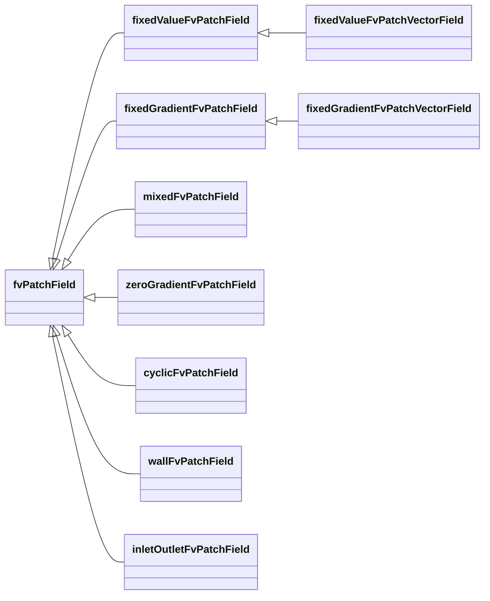
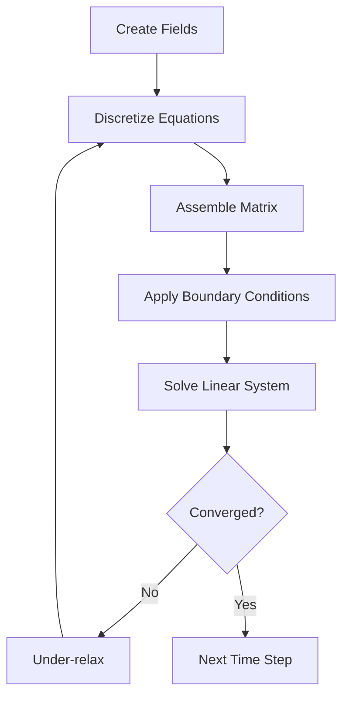
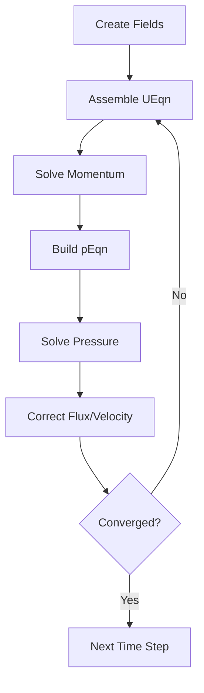

---
tags:
  - openfoam
  - cfd
  - hardcore
  - day-01
date: 2026-01-01
aliases:
  - Governing Equations
difficulty: hardcore
topic: Governing Equations
---

# Governing Equations
## HARDCORE Level - 2026-01-01

---

## Table of Contents
- [[#1. Theory: Core Equations & Physics|1. Theory]]
- [[#2. OpenFOAM Class Hierarchy & Implementation|2. Class Hierarchy]]
- [[#3. Code Walkthrough|3. Code Walkthrough]]
- [[#4. Dictionary Analysis & Configuration|4. Dictionary Analysis]]
- [[#5. Hands-on: Practical Tasks & Coding|5. Practical Tasks]]
- [[#6. Concept Checks|6. Concept Checks]]

---

## 1. Theory: Core Equations & Physics

### 1.1 Conservation Laws Overview

> [!INFO] **หลักการพื้นฐาน (Fundamental Principle)**
> การไหลของของไหลถูกควบคุมโดยกฎการอนุรักษ์มวล โมเมนตัม และพลังงาน กฎเหล่านี้เป็นรากฐานของการจำลองพลศาสตร์ของไหลเชิงคำนวณ (CFD) ใน OpenFOAM

สมการควบคุมอธิบายว่าคุณสมบัติของของไหลเปลี่ยนแปลงไปอย่างไรในอวกาศและเวลา:

| สมการ (Equation) | ปริมาณทางฟิสิกส์ (Physical Quantity) | คุณสมบัติที่อนุรักษ์ (Conserved Property) |
|----------|-------------------|-------------------|
| Continuity | มวล (Mass) | มวลไม่สามารถสร้างขึ้นหรือทำลายได้ |
| Momentum | กฎข้อที่ 2 ของนิวตัน | การเปลี่ยนแปลงโมเมนตัม = แรงลัพธ์ |
| Energy | กฎข้อที่ 1 ของอุณหพลศาสตร์ | การอนุรักษ์พลังงาน |

---

### 1.2 Continuity Equation (Mass Conservation)

$$\frac{\partial \rho}{\partial t} + \nabla \cdot (\rho \mathbf{U}) = 0$$

**คำศัพท์สำคัญ:**

- $\rho$ (rho): ความหนาแน่นของของไหล [kg/m³]
- $\mathbf{U}$: เวกเตอร์ความเร็ว [m/s]
- $t$: เวลา [s]
- $\nabla \cdot$: ตัวดำเนินการ Divergence (การลู่ออก)

> [!TIP] **การไหลแบบอัดตัวไม่ได้ (Incompressible Flow)**
> สำหรับการไหลแบบอัดตัวไม่ได้ (ความหนาแน่นคงที่) สมการจะลดรูปเหลือ:
> $$\nabla \cdot \mathbf{U} = 0$$
> (สมการความต่อเนื่องสำหรับการไหลแบบอัดตัวไม่ได้)

---

### 1.3 Momentum Equation (Newton's Second Law)

$$\frac{\partial (\rho \mathbf{U})}{\partial t} + \nabla \cdot (\rho \mathbf{U} \mathbf{U}) = -\nabla p + \nabla \cdot \boldsymbol{\tau} + \rho \mathbf{g}$$

**คำศัพท์สำคัญ:**

| เทอม (Term) | ความหมายทางฟิสิกส์ (Physical Meaning) | คำอธิบาย (Description) |
|------|------------------|-------------|
| $\frac{\partial (\rho \mathbf{U})}{\partial t}$ | Unsteady term | อัตราการเปลี่ยนแปลงของโมเมนตัมเทียบกับเวลา |
| $\nabla \cdot (\rho \mathbf{U} \mathbf{U})$ | Convection term | การขนส่งโมเมนตัมเนื่องจากการเคลื่อนที่ของของไหล |
| $-\nabla p$ | Pressure gradient | แรงเนื่องจากความแตกต่างของความดัน |
| $\nabla \cdot \boldsymbol{\tau}$ | Viscous stress | แรงเสียดทาน/การแพร่ (Diffusion forces) |
| $\rho \mathbf{g}$ | Body force | แรงโน้มถ่วงหรือแรงภายนอกอื่นๆ |

> [!WARNING] **ความไม่เป็นเชิงเส้น (Nonlinearity)**
> เทอมการพา (Convection term) $\nabla \cdot (\rho \mathbf{U} \mathbf{U})$ ทำให้สมการเป็นแบบไม่เชิงเส้น (Nonlinear) และยากต่อการแก้ด้วยวิธีเชิงตัวเลข นี่คือเหตุผลที่ CFD ต้องใช้วิธีการทำซ้ำ (Iterative methods)

---

### 1.4 Stress Tensor for Newtonian Fluids

สำหรับของไหลแบบนิวโตเนียน (Newtonian fluids) เทนเซอร์ความเค้น $\boldsymbol{\tau}$ คือ:

$$\boldsymbol{\tau} = \mu \left[ \nabla \mathbf{U} + (\nabla \mathbf{U})^T \right] - \frac{2}{3}\mu (\nabla \cdot \mathbf{U})\mathbf{I}$$

**คำศัพท์สำคัญ:**

- $\mu$ (mu): ความหนืดพลวัต (Dynamic viscosity) [Pa·s]
- $\mathbf{I}$: เทนเซอร์เอกลักษณ์ (Identity tensor)
- $\nabla \mathbf{U}$: เทนเซอร์เกรเดียนต์ความเร็ว (Velocity gradient tensor)

> [!INFO] **การลดรูปสำหรับของไหลอัดตัวไม่ได้ (Incompressible Simplification)**
> สำหรับการไหลแบบอัดตัวไม่ได้ ($\nabla \cdot \mathbf{U} = 0$):
> $$\nabla \cdot \boldsymbol{\tau} = \mu \nabla^2 \mathbf{U}$$
> (เทอมความหนืดจะเหลือเพียง Laplacian ของความเร็ว)

---

### 1.5 Energy Equation

$$\frac{\partial (\rho h)}{\partial t} + \nabla \cdot (\rho \mathbf{U} h) = \frac{Dp}{Dt} + \nabla \cdot (k \nabla T) + \boldsymbol{\tau} : \nabla \mathbf{U} + S_h$$

**Key Terms:**

| Symbol | Meaning | Unit |
|--------|---------|------|
| $h$ | Specific enthalpy | [J/kg] |
| $k$ | Thermal conductivity | [W/(m·K)] |
| $T$ | Temperature | [K] |
| $S_h$ | Heat source term | [W/m³] |
| $\frac{Dp}{Dt}$ | Material derivative of pressure | [Pa/s] |

---

### 1.6 Navier-Stokes Equations Summary

Combining mass and momentum conservation for incompressible flow:

$$ \begin{aligned} \nabla \cdot \mathbf{U} &= 0 \\ \frac{\partial \mathbf{U}}{\partial t} + (\mathbf{U} \cdot \nabla)\mathbf{U} &= -\frac{1}{\rho}\nabla p + \nu \nabla^2 \mathbf{U} + \mathbf{g} \end{aligned} $$

Where $\nu = \mu/\rho$ is the kinematic viscosity [m²/s].

> [!TIP] **OpenFOAM Implementation**
> In OpenFOAM, these equations are solved using the finite volume method. The key classes are:
> - `fvVectorMatrix` for momentum
> - `fvScalarMatrix` for pressure and continuity
> - `fvm::ddt`, `fvm::div`, `fvm::laplacian` for discretization

---

### 1.7 Dimensionless Numbers

| Number | สูตร (Formula) | ความสำคัญทางฟิสิกส์ (Physical Significance) |
|--------|---------|----------------------|
| Reynolds | $Re = \frac{\rho U L}{\mu}$ | อัตราส่วนระหว่างแรงเฉื่อยต่อแรงหนืด (Inertia vs Viscous) |
| Mach | $Ma = \frac{U}{c}$ | ความเร็วการไหลต่อความเร็วเสียง (Compressibility) |
| Prandtl | $Pr = \frac{c_p \mu}{k}$ | การแพร่โมเมนตัมต่อการแพร่ความร้อน |

> [!INFO] **การตีความ Reynolds Number**
> - $Re \ll 1$: การไหลแบบคืบคลาน (Stokes flow) - แรงหนืดเด่น
> - $Re \gg 1$: การไหลแบบปั่นป่วน (Turbulent flow) - แรงเฉื่อยเด่น (ต้องใช้ Turbulence Model)
> - (ตัวเลขเรย์โนลด์บ่งบอกระบอบของการไหล)

> **สรุป:** ส่วนนี้ครอบคลุมสมการพื้นฐานที่ใช้ใน OpenFOAM ได้แก่สมการความต่อเนื่อง (Continuity), โมเมนตัม (Momentum), และพลังงาน (Energy) รวมถึงความสัมพันธ์ของเทนเซอร์ความเค้นสำหรับของไหลแบบนิวโตเนียน และตัวเลขไร้มิติที่สำคัญ การเข้าใจสมการเหล่านี้เป็นพื้นฐานสำคัญก่อนเข้าสู่รายละเอียดของการดิสครีไทซ์ในส่วนถัดไป

---

## 2. OpenFOAM Class Hierarchy & Implementation

### 2.1 Core Equation Classes

OpenFOAM ใช้คลาสแม่แบบ (Template Classes) ในการจัดการสมการควบคุม ซึ่งทำหน้าที่ดูแลการดำเนินการกับฟิลด์ (Field operations), การดิสครีไทซ์ (Discretization), และการประกอบเมทริกซ์ (Matrix Assembly)

> [!INFO] **ตำแหน่งซอร์สโค้ด (Source Code Location)**
> คลาสหลักตั้งอยู่ที่ `$FOAM_SRC/finiteVolume/` และ `$FOAM_SRC/fields/`

#### Key Class Hierarchy

```mermaid
classDiagram
    %% เรียงจากซ้ายไปขวา (ช่วยเรื่องพื้นที่แนวนอน)
    direction LR

    class GeometricField {
        +internalField_ : DimensionedField
        +boundaryField_ : FieldField
        +prevIter_ : DimensionedField
        +dimensions()
        +correctBoundaryConditions()
    }

    class volScalarField {
        +volScalarField(name, mesh)
    }

    class volVectorField {
        +volVectorField(name, mesh)
    }

    class surfaceScalarField {
        +surfaceScalarField(name, mesh)
    }

    class fvMatrix {
        +lduMatrix_ : lduMatrix
        +source_ : Field
        +psi_ : GeometricField
        +solve()
        +residual()
    }

    class fvVectorMatrix {
        +fvVectorMatrix(volVectorField)
    }

    class fvScalarMatrix {
        +fvScalarMatrix(volScalarField)
    }

    class tmp {
        +ptr_ : T*
        +operator()()
        +clear()
    }

    class fvMesh {
        +C_ : volVectorField
        +Sf_ : surfaceVectorField
        +V_ : volScalarField
        +C()
        +Sf()
        +V()
    }

    GeometricField <|-- volScalarField
    GeometricField <|-- volVectorField
    GeometricField <|-- surfaceScalarField
    fvMatrix <|-- fvVectorMatrix
    fvMatrix <|-- fvScalarMatrix
    tmp --> GeometricField : manages
    fvMesh --> GeometricField : contains
    fvMatrix --> GeometricField : references
````

---

### 2.2 คลาสฟิลด์ (Field Classes)

#### 2.2.1 GeometricField

คลาสพื้นฐานสำหรับการจัดเก็บและจัดการข้อมูลฟิลด์ (Field data)

**Location:** `$FOAM_SRC/fields/GeometricField/GeometricField.C`

##### Memory Layout

คลาส `GeometricField` จัดเก็บข้อมูลฟิลด์ใน 3 ส่วนหน่วยความจำหลัก:

```
GeometricField<Type, GeoMesh>
│
├── DimensionedField<Type, GeoMesh> (base class)
│   ├── dimensions_          // DimensionSet [kg m s ...]
│   ├── field_               // Internal field values (cell-centered)
│   │   └── List<Type>       // Contiguous array: [val0, val1, ..., valN-1]
│   └── mesh_                // Reference to fvMesh
│
├── FieldField<GeoMesh, Type> (base class)
│   └── boundaryField_       // PtrList of boundary patches
│       ├── [0] -> fvPatchField<Type> (patch 0)
│       │   ├── patch_       // Reference to fvPatch
│       │   └── patchField_  // List<Type> of face values on patch
│       ├── [1] -> fvPatchField<Type> (patch 1)
│       │   └── ...
│       └── [n] -> fvPatchField<Type> (patch n)
│           └── ...
│
└── DimensionedField<Type, GeoMesh> prevIter_  // Previous iteration values
    └── field_           // Copy of internal field for under-relaxation
```

**รูปแบบการเข้าถึงข้อมูล (Memory Access Pattern):**

```
ข้อมูลที่จุดกึ่งกลางเซลล์ (internalField_):
┌─────┬─────┬─────┬─────┬─────┬─────┐
│  0  │  1  │  2  │ ... │ N-2 │ N-1 │  ← Cell indices
└─────┴─────┴─────┴─────┴─────┴─────┘
  ▲     ▲     ▲                 ▲     ▲
  │     │     │                 │     │
  ptr   ptr+1 ptr+2             ptr+N-2 ptr+N-1

ข้อมูลที่ขอบเขต (boundaryField_):
┌─────────────────────────────────────────┐
│ Patch 0 │ Patch 1 │ ... │ Patch N-1    │
│ [n0]    │ [n1]    │     │ [nN-1]       │
└─────────────────────────────────────────┘
   ▲         ▲                    ▲
   │         │                    │
   ptr[0]    ptr[1]              ptr[N-1]
```

> [!INFO] **ความเป็นท้องถิ่นของข้อมูล (Data Locality)**
> - Internal field ใช้หน่วยความจำที่ต่อเนื่องกัน (Cache-friendly)
> - Boundary fields ถูกเก็บแยกตาม Patch
> - แต่ละ Patch มี Array ที่ต่อเนื่องกันเป็นของตัวเอง
> - หน่วยความจำรวม = N_cells × sizeof(Type) + Σ(N_faces_patch × sizeof(Type))

```cpp
// Simplified declaration
template<class Type, class GeoMesh>
class GeometricField
:
    public DimensionedField<Type, GeoMesh>,
    public FieldField<GeoMesh, Type>
{
public:
    // Internal field values
    DimensionedField<Type, GeoMesh> internalField_;

    // Boundary field values
    FieldField<GeoMesh, Type> boundaryField_;

    // Previous iteration (for under-relaxation)
    DimensionedField<Type, GeoMesh> prevIter_;
};
```

> [!TIP] **ประเภทฟิลด์ที่พบบ่อย (Common Field Types)**
> - `volScalarField`: ฟิลด์สเกลาร์ที่จุดกึ่งกลางเซลล์ (ความดัน, อุณหภูมิ)
> - `volVectorField`: ฟิลด์เวกเตอร์ที่จุดกึ่งกลางเซลล์ (ความเร็ว)
> - `surfaceScalarField`: ฟิลด์สเกลาร์ที่หน้าเซลล์ (Flux, phi)
> - `surfaceVectorField`: ฟิลด์เวกเตอร์ที่หน้าเซลล์
#### 2.2.2 Field Creation Example

```cpp
// Create a velocity field
volVectorField U
(
    IOobject
    (
        "U",                    // name
        runTime.timeName(),     // instance
        mesh,                   // registry
        IOobject::MUST_READ,    // read option
        IOobject::AUTO_WRITE    // write option
    ),
    mesh
);

// Create a pressure field
volScalarField p
(
    IOobject
    (
        "p",
        runTime.timeName(),
        mesh,
        IOobject::MUST_READ,
        IOobject::AUTO_WRITE
    ),
    mesh
);
```

---

### 2.3 คลาสเมทริกซ์ปริมาตรจำกัด (Finite Volume Matrix Classes)

#### 2.3.1 fvMatrix

คลาสเมทริกซ์ที่เป็นตัวแทนของสมการที่ถูกดิสครีไทซ์ (Discretized equations)

**Location:** `$FOAM_SRC/finiteVolume/finiteVolume/fvMatrices/fvMatrix/fvMatrix.C`

##### Memory Layout

`fvMatrix` สืบทอดมาจาก `lduMatrix` (Lower-Diagonal-Upper matrix) และจัดเก็บระบบเมทริกซ์แบบเบาบาง (Sparse matrix system):

```
fvMatrix<Type>
│
├── lduMatrix (base class - sparse storage)
│   ├── lduAddr_              // lduAddressing
│   │   ├── lowerAddr_       // List of owner cell indices
│   │   ├── upperAddr_       // List of neighbor cell indices
│   │   ├── losortAddr_      // Lower-to-upper sorting
│   │   └── ownerStart_      // Start index for each owner
│   │
│   ├── lower_               // Lower triangular coefficients
│   │   └── List<scalar>     // [a_10, a_21, a_20, ...]
│   ├── upper_               // Upper triangular coefficients
│   │   └── List<scalar>     // [a_01, a_12, a_02, ...]
│   └── diag_                // Diagonal coefficients
│       └── List<scalar>     // [a_00, a_11, a_22, ...]
│
├── source_                  // Source term vector
│   └── Field<Field<Type>>   // [b_0, b_1, ..., b_N-1]
│
└── psi_                     // Reference to field being solved
    └── GeometricField<Type, fvPatchField, volMesh>& 
```

**โครงสร้างเมทริกซ์แบบเบาบาง (LDU format):**

```
สมการเมทริกซ์: [A] × [x] = [b]

สำหรับ 5 เซลล์ (0-4) ที่มีการเชื่อมต่อหน้าเซลล์:
┌─────┐─────┐─────┐─────┐─────┐
│  0  │  1  │  2  │  3  │  4  │  ← Cell indices
└──┬──┴──┬──┴──┬──┴──┬──┴──┬──┘
   │     │     │     │     │
   └───┬─└───┬─└───┬─└───┘     ← Face connections
       │     │     │
       
เก็บในรูปแบบ LDU:
┌─────────────────────────────────────┐
│ diag_: [d₀, d₁, d₂, d₃, d₄]        │  ← Diagonal (N elements)
├─────────────────────────────────────┤
│ lower_: [l₁₀, l₂₀, l₂₁, l₃₁, ...]  │  ← Lower coefficients (N_faces)
├─────────────────────────────────────┤
│ upper_: [u₀₁, u₀₂, u₁₂, u₁₃, ...]  │  ← Upper coefficients (N_faces)
├─────────────────────────────────────┤
│ lowerAddr_: [1, 2, 2, 3, ...]      │  ← Owner cells
├─────────────────────────────────────┤
│ upperAddr_: [0, 0, 1, 1, ...]      │  ← Neighbor cells
└─────────────────────────────────────┘

Example: Row 2 of matrix
┌────────────────────────────────────────────────┐
│ a₂₀·x₀  +  a₂₁·x₁  +  a₂₂·x₂  +  a₂₃·x₃  =  b₂ │
│  ↑       ↑       ↑       ↑              ↑     │
│ lower   lower   diag   upper        source   │
└────────────────────────────────────────────────┘
```

> [!INFO] **ประสิทธิภาพของ Sparse Matrix**
> - รูปแบบ LDU เก็บเฉพาะสัมประสิทธิ์ที่ไม่เป็นศูนย์
> - หน่วยความจำ: O(N_cells + N_faces) เทียบกับ O(N_cells²) สำหรับ Dense matrix
> - สำหรับ 3D mesh: ~7 faces ต่อ cell → ~7×N_cells coefficients
> - เอื้อต่อการใช้ Iterative solvers (GAMG, PCG, PBiCGStab)

```cpp
template<class Type>
class fvMatrix
:
    public lduMatrix
{
public:
    // Reference to the field being solved
    GeometricField<Type, fvPatchField, volMesh>& psi_;

    // Source term
    Field<Field<Type>> source_;

    // Boundary conditions
    FieldField<fvPatchField, Type>& boundaryCoeffs_;

    // Solve the matrix
    tmp<GeometricField<Type, fvPatchField, volMesh>> solve();
};
```

> [!INFO] **Matrix Types**
> - `fvScalarMatrix`: Matrix for scalar equations (pressure, temperature)
> - `fvVectorMatrix`: Matrix for vector equations (momentum)
#### 2.3.2 Matrix Assembly Example

```cpp
// Momentum equation assembly
tmp<fvVectorMatrix> UEqn
(
    fvm::ddt(U)                     // Time derivative: $\frac{\partial \mathbf{U}}{\partial t}$
  + fvm::div(phi, U)               // Convection: $\nabla \cdot (\rho \mathbf{U} \mathbf{U})$
  + fvm::laplacian(nu, U)          // Diffusion: $\mu \nabla^2 \mathbf{U}$
 ==
    fvOptions(U)                    // Source terms
);

// Solve the equation
UEqn.solve();
```

---

### 2.4 สคีมการดิสครีไทซ์ (Discretization Schemes)

#### 2.4.1 fvm vs fvc

OpenFOAM มีตัวดำเนินการการดิสครีไทซ์ 2 ชุด:

| ตัวดำเนินการ (Operator) | ความหมาย (Meaning) | ผลลัพธ์ (Returns) | การใช้งาน (Usage) |
|----------|---------|---------|------|
| `fvm::` | Finite Volume Method (แบบ Implicit) | `fvMatrix` | สัมประสิทธิ์เมทริกซ์ (LHS) |
| `fvc::` | Finite Volume Calculus (แบบ Explicit) | `GeometricField` | ค่าที่คำนวณได้เลย (RHS) |

**Location:** `$FOAM_SRC/finiteVolume/finiteVolume/fvm/` and `$FOAM_SRC/finiteVolume/finiteVolume/fvc/`

> [!WARNING] **Implicit vs Explicit**
> - `fvm::` เพิ่มเทอมเข้าไปในเมทริกซ์ (Implicit, เสถียรกว่า)
> - `fvc::` คำนวณค่าออกมาเป็นฟิลด์โดยตรง (Explicit, เร็วกว่าแต่เสถียรน้อยกว่า)

#### 2.4.2 Common Operators

```cpp
// Time derivative (unsteady term)
fvm::ddt(U)              // Implicit: $\frac{\partial \mathbf{U}}{\partial t}$
fvc::ddt(U)              // Explicit

// Divergence (convection term)
fvm::div(phi, U)         // Implicit: $\nabla \cdot (\rho \mathbf{U} \mathbf{U})$
fvc::div(phi, U)         // Explicit

// Laplacian (diffusion term)
fvm::laplacian(nu, U)    // Implicit: $\mu \nabla^2 \mathbf{U}$
fvc::laplacian(nu, U)    // Explicit

// Gradient
fvc::grad(p)             // Explicit: $\nabla p$

// SnGrad (surface normal gradient)
fvc::snGrad(p)           // Explicit: $\nabla p \cdot \mathbf{n}$
```

---

### 2.5 คลาสเงื่อนไขขอบเขต (Boundary Condition Classes)

#### 2.5.1 ลำดับชั้น fvPatchField



**Location:** `$FOAM_SRC/finiteVolume/fields/fvPatchFields/`

#### 2.5.2 เงื่อนไขขอบเขตทั่วไป (Common Boundary Conditions)

```cpp
// Fixed value (Dirichlet)
U.boundaryFieldRef().set(0, fixedValueFvPatchVectorField::typeName);
U.boundaryFieldRef()[0] = vector(1, 0, 0);  // Inlet velocity

// Zero gradient (Neumann)
p.boundaryFieldRef().set(1, zeroGradientFvPatchScalarField::typeName);

// Wall (no-slip)
U.boundaryFieldRef().set(2, fixedValueFvPatchVectorField::typeName);
U.boundaryFieldRef()[2] = vector(0, 0, 0);  // No-slip wall

// Cyclic (periodic)
U.boundaryFieldRef().set(3, cyclicFvPatchVectorField::typeName);
```

> [!TIP] **การเลือกเงื่อนไขขอบเขต (Boundary Condition Selection)**
> - **Inlet**: `fixedValue` สำหรับความเร็ว, `zeroGradient` สำหรับความดัน
> - **Outlet**: `zeroGradient` สำหรับความเร็ว, `fixedValue` (ปกติเป็น 0) สำหรับความดัน
> - **Wall**: `fixedValue` (0) สำหรับความเร็ว (No-slip), `zeroGradient` สำหรับความดัน
> - (การเลือก BC ที่ถูกต้องสำคัญมากต่อเสถียรภาพ)

---

### 2.6 คลาสเมช (Mesh Classes)

#### 2.6.1 fvMesh

คลาสเมชแบบปริมาตรจำกัด (Finite Volume Mesh Class)

**Location:** `$FOAM_SRC/finiteVolume/finiteVolume/fvMesh/fvMesh.C`

##### Memory Layout

คลาส `fvMesh` สืบทอดมาจาก `polyMesh` และเพิ่มโครงสร้างข้อมูลเฉพาะสำหรับ FVM:

```
fvMesh
│
├── polyMesh (base class - topology)
│   ├── points_              // pointField (vertex coordinates)
│   │   └── List<point>      // [(x₀,y₀,z₀), (x₁,y₁,z₁), ...]
│   │
│   ├── faces_               // faceList (face definitions)
│   │   └── List<face>       // [face₀, face₁, ...]
│   │       └── face         // [v₀, v₁, v₂, v₃] (vertex indices)
│   │
│   ├── cells_               // cellList (cell-to-faces connectivity)
│   │   └── List<cell>       // [cell₀, cell₁, ...]
│   │       └── cell         // [f₀, f₁, f₂, ...] (face indices)
│   │
│   └── owner_ / neighbour_  // face addressing
│       ├── owner_           // List<label> [c₀, c₁, ...]
│       └── neighbour_       // List<label> [c₁, c₂, ...]
│
└── fvMesh-specific (finite volume data)
    ├── C_                   // volVectorField (cell centers)
    │   └── [(x₀,y₀,z₀), (x₁,y₁,z₁), ...]
    │
    ├── Cf_                  // surfaceVectorField (face centers)
    │   └── [(x₀,y₀,z₀), (x₁,y₁,z₁), ...]
    │
    ├── Sf_                  // surfaceVectorField (face area vectors)
    │   └── [(Sx₀,Sy₀,Sz₀), (Sx₁,Sy₁,Sz₁), ...]
    │
    └── V_                   // volScalarField (cell volumes)
        └── [V₀, V₁, V₂, ...]
```

**การแสดงภาพโทโพโลยีของเมช (Mesh Topology Visualization):**

```
3D Mesh Structure (simplified 2×2×2 cells):

        Points (vertices):
        ┌─────┬─────┬─────┐
        │  0  │  1  │  2  │  ← 8 points per cell (hex)
        ├─────┼─────┼─────┤
        │  3  │  4  │  5  │
        └─────┴─────┴─────┘
        
        Faces (surfaces):
        ┌───f0──┐
        │       │
       f6      f1  ← 6 faces per cell
        │       │
        └───f2──┘
        
        Cells (volumes):
        ┌───────┐
        │ cell0 │ cell1 │
        ├───────┼───────┤
        │ cell2 │ cell3 │
        └───────┴───────┘

Connectivity:
┌────────────────────────────────────────────┐
│ owner_:   [0, 0, 0, 0, 1, 1, 1, 2, ...]   │  ← Owner cell for each face
│ neighbour_: [1, 2, 3, 4, 2, 3, 5, 3, ...]  │  ← Neighbor (internal faces only)
└────────────────────────────────────────────┘

Face 0: owner=0, neighbour=1
Face 1: owner=0, neighbour=2
...
```

**รูปแบบการเข้าถึงข้อมูล (Data Access Pattern):**

```
การเข้าถึงแบบ Cell-centered (C_, V_):
forAll(mesh.C(), cellI)
{
    vector center = mesh.C()[cellI];    // Direct array access
    scalar volume = mesh.V()[cellI];
}

Face-based access (Cf_, Sf_):
forAll(mesh.Sf(), faceI)
{
    vector faceCenter = mesh.Cf()[faceI];
    vector areaVector = mesh.Sf()[faceI];  // Points from owner to neighbor
    scalar area = mag(faceVector);
}

Owner-neighbor iteration:
forAll(mesh.owner(), faceI)
{
    label own = mesh.owner()[faceI];       // Owner cell index
    label nei = mesh.neighbour()[faceI];   // Neighbor cell index
    scalar flux = phi[faceI];              // Face flux (owner → neighbor)
}
```

> [!INFO] **ลำดับชั้นหน่วยความจำ (Memory Hierarchy)**
> - **Points**: N_points × 3 × 8 bytes (double precision)
> - **Faces**: N_faces × avg_vertices × 4 bytes (label)
> - **Cells**: N_cells × avg_faces × 4 bytes (label)
> - **FV fields**: N_cells × sizeof(Type) for cell-centered
> - **Surface fields**: N_faces × sizeof(Type) for face-centered
> 
> Typical 2M cell hex mesh:
> - Points: ~2M × 8 vertices × 24 bytes ≈ 384 MB
> - Faces: ~6M faces × 4 vertices × 4 bytes ≈ 96 MB
> - Cells: ~2M cells × 6 faces × 4 bytes ≈ 48 MB
> - FV data: ~2M × 3 fields × 8 bytes ≈ 48 MB

```cpp
class fvMesh
:
    public polyMesh
{
public:
    // Cell centers
    const volVectorField& C() const;

    // Face centers
    const surfaceVectorField& Cf() const;

    // Face area vectors
    const surfaceVectorField& Sf() const;

    // Cell volumes
    const volScalarField& V() const;

    // Surface magnitudes
    const surfaceScalarField& magSf() const;
};
```

![[fv_mesh_owner_neighbour_1767278470077.png]]
*รูปที่ 2.6.1: แสดงความสัมพันธ์ระหว่างเซลล์ Owner (P), Neighbour (N), เวกเตอร์พื้นที่หน้า (Sf), และเวกเตอร์ระยะทาง (d)*

### 2.6.2 Mesh Access Example

```cpp
// Access mesh data
const fvMesh& mesh = U.mesh();

// Cell centers
const volVectorField& centers = mesh.C();

// Cell volumes
const volScalarField& volumes = mesh.V();

// Face area vectors
const surfaceVectorField& faceAreas = mesh.Sf();

// Loop over cells
forAll(mesh.C(), cellI)
{
    scalar cellVolume = mesh.V()[cellI];
    vector cellCenter = mesh.C()[cellI];
    // ... process cell
}
```

---

### 2.7 คลาส Solver (Solver Classes)

#### 2.7.1 อัลกอริทึมการแก้ปัญหา (Solution Algorithm)



#### 2.7.2 ตัวอย่าง Solver อย่างง่าย (Simple Solver Example)

```cpp
// Simple pressure-velocity coupling
while (simple.loop())
{
    // Momentum equation
    tmp<fvVectorMatrix> UEqn
    (
        fvm::ddt(U)
      + fvm::div(phi, U)
      + fvm::laplacian(nu, U)
    );

    UEqn.solve();

    // Pressure correction
    {
        volScalarField rAU(1.0/UEqn().A());
        volVectorField HbyA(constrainHbyA(rAU*UEqn().H(), U, p));
        surfaceScalarField phiHbyA
        (
            fvc::flux(HbyA)
          + fvc::interpolate(rAU)*fvc::ddtCorr(U, phi)
        );

        // Pressure equation
        fvScalarMatrix pEqn
        (
            fvm::laplacian(rAU, p) == fvc::div(phiHbyA)
        );

        pEqn.solve();

        // Correct flux
        phi = phiHbyA - pEqn.flux();

        // Correct velocity
        U = HbyA - rAU*fvc::grad(p);
        U.correctBoundaryConditions();
    }
}
```

> [!INFO] **การเชื่อมโยงความดัน-ความเร็ว (Pressure-Velocity Coupling)**
> OpenFOAM ใช้อัลกอริทึมแบบแยกส่วน (Segregated algorithms):
> - **SIMPLE**: สภาวะคงที่ (Steady-state), ทำซ้ำ (Iterative)
> - **PISO**: สภาวะไม่คงที่ (Transient), ตัวทำนาย-ตัวแก้ (Predictor-corrector)
> - **PIMPLE**: ผสมระหว่าง SIMPLE-PISO สำหรับสภาวะไม่คงที่ที่ต้องการ Time step ขนาดใหญ่
> - (อัลกอริทึมยอดนิยมสำหรับการหาคำตอบสมการ N-S)

---

### 2.8 สรุปไฟล์อ้างอิง (Reference Files Summary)

| ส่วนประกอบ (Component) | ตำแหน่ง (Source Path) | คำอธิบาย (Description) |
|-----------|-------------|-------------|
| Field classes | `$FOAM_SRC/fields/` | GeometricField, DimensionedField |
| FV matrices | `$FOAM_SRC/finiteVolume/finiteVolume/fvMatrices/` | fvMatrix and specializations |
| Discretization | `$FOAM_SRC/finiteVolume/finiteVolume/fvm/` | Implicit operators |
| Calculus | `$FOAM_SRC/finiteVolume/finiteVolume/fvc/` | Explicit operators |
| Boundary conditions | `$FOAM_SRC/finiteVolume/fields/fvPatchFields/` | All BC types |
| Mesh | `$FOAM_SRC/finiteVolume/finiteVolume/fvMesh/` | fvMesh class |
| Schemes | `$FOAM_SRC/finiteVolume/finiteVolume/fvSchemes/` | Discretization schemes |
| Solution | `$FOAM_SRC/finiteVolume/finiteVolume/fvSolution/` | Solution algorithms |

> [!TIP] **Exploring Source Code**
> Use `find` and `grep` to explore the OpenFOAM source:
> ```bash
> find $FOAM_SRC -name "*.H" | grep -i "geometricField"
> grep -r "class fvMatrix" $FOAM_SRC/finiteVolume
> ```

> **สรุป:** ส่วนนี้เจาะลึกโครงสร้างคลาสหลักของ OpenFOAM ตั้งแต่ `GeometricField` สำหรับเก็บข้อมูล, `fvMatrix` สำหรับระบบสมการเชิงเส้น, และ `fvMesh` สำหรับจัดการเมช การเข้าใจ Memory Layout และความสัมพันธ์ระหว่างคลาสเหล่านี้ช่วยให้เห็นภาพว่า OpenFOAM แปลงสมการฟิสิกส์เป็นโครงสร้างข้อมูลใน C++ อย่างไร

---

## 3. การไล่โค้ด (Code Walkthrough)



### 3.1 UEqn.H

ไฟล์ `UEqn.H` สร้างเมทริกซ์สมการโมเมนตัมสำหรับ Solver ที่ใช้กับของไหลแบบอัดตัวไม่ได้ มันจะประกอบร่าง (Assemble) รูปแบบดิสครีตของสมการโมเมนตัม Navier-Stokes

**ตำแหน่ง:** มักพบในไดเรกทอรีของ solver เช่น `simpleFoam/`, `pisoFoam/`, ฯลฯ

> [!INFO] **อ้างอิงซอร์สโค้ด (Source Reference)**
> - ตัวอย่าง: `$FOAM_SOLVERS/incompressible/simpleFoam/UEqn.H`
> - ตัวอย่าง: `$FOAM_SOLVERS/incompressible/pisoFoam/UEqn.H`

**Key Code Structure:**

```cpp
// Momentum equation assembly
tmp<fvVectorMatrix> UEqn
(
    fvm::ddt(U)                         // Unsteady term: ∂U/∂t
  + fvm::div(phi, U)                   // Convection: ∇·(UU)
  + fvm::laplacian(nu, U)              // Diffusion: ν∇²U
 ==
    fvOptions(U)                        // Source terms (e.g., porous media)
);

// Under-relaxation for steady-state solvers
UEqn.relax();

// Optional: solve momentum predictor
if (piso.momentumPredictor())
{
    solve(UEqn == -fvc::grad(p));
}
```

**คำอธิบาย (Explanation):**

1. **`fvm::ddt(U)`** - อนุพันธ์เทียบเวลาแบบ Implicit (เทอมไม่คงที่) สำหรับ Solver สภาวะคงที่ เทอมนี้จะมีค่าเป็นศูนย์

2. **`fvm::div(phi, U)`** - เทอมการพาแบบ Implicit (Convection term) โดยใช้ฟิลด์ฟลักซ์ `phi` (`surfaceScalarField`) นี่คือเทอมที่ไม่เป็นเชิงเส้นซึ่งต้องใช้วิธีการแก้แบบวนซ้ำ

3. **`fvm::laplacian(nu, U)`** - เทอมการแพร่จากความหนืดแบบ Implicit (Viscous diffusion) โดยที่ `nu` คือความหนืดพลศาสตร์

4. **`fvOptions(U)`** - เฟรมเวิร์กสำหรับเพิ่มเทอมแหล่งกำเนิด (Source terms) เช่น แรงต้านจากรูพรุน หรือแรงลอยตัว

5. **`UEqn.relax()`** - การผ่อนคลายค่า (Under-relaxation) ช่วยให้การลู่เข้ามีเสถียรภาพสำหรับอัลกอริทึมสภาวะคงที่ โดยการผสมค่าเก่าและค่าใหม่

6. **`solve(UEqn == -fvc::grad(p))`** - แก้สมการโมเมนตัมโดยใช้เกรเดียนต์ความดันเป็นเทอมแหล่งกำเนิดแบบ Explicit ในขั้นตอนการทำนาย (Predictor step)

> [!TIP] **การประกอบเมทริกซ์ (Matrix Assembly)**
> ตัวดำเนินการ `fvm::` จะสร้างสัมประสิทธิ์ของเมทริกซ์ (แนวทแยงและนอกแนวทแยง) ในขณะที่ `fvc::grad(p)` จะคำนวณเกรเดียนต์ความดันแบบ Explicit เป็นเทอมแหล่งกำเนิด แนวทางแบบแยกส่วนนี้ต้องการการเชื่อมโยงความดัน-ความเร็ว (SIMPLE/PISO) เพื่อบังคับให้เป็นไปตามกฎการอนุรักษ์มวล

---

### 3.2 pEqn.H

ไฟล์ `pEqn.H` สร้างและแก้สมการความดันเพื่อบังคับให้เป็นไปตามกฎการอนุรักษ์มวล (ความต่อเนื่อง) มันใช้อัลกอริทึมการเชื่อมโยงความดัน-ความเร็ว

**ตำแหน่ง:** พบในไดเรกทอรีของ solver เช่น `simpleFoam/`, `pisoFoam/`, `pimpleFoam/`

> [!INFO] **อ้างอิงซอร์สโค้ด (Source Reference)**
> - ตัวอย่าง: `$FOAM_SOLVERS/incompressible/simpleFoam/pEqn.H`
> - ตัวอย่าง: `$FOAM_SOLVERS/incompressible/pisoFoam/pEqn.H`
> - ตัวอย่าง: `$FOAM_SOLVERS/incompressible/pimpleFoam/pEqn.H`

**Key Code Structure:**

```cpp
// Pressure equation assembly (SIMPLE algorithm)
volScalarField rAU(1.0/UEqn().A());              // Reciprocal of diagonal coefficients
volVectorField HbyA(constrainHbyA(rAU*UEqn().H(), U, p));  // Explicit velocity
surfaceScalarField phiHbyA                       // Flux field
(
    fvc::flux(HbyA)                             // Convective flux
  + fvc::interpolate(rAU)*fvc::ddtCorr(U, phi)  // Transient correction
);

// Pressure Poisson equation
fvScalarMatrix pEqn
(
    fvm::laplacian(rAU, p) == fvc::div(phiHbyA) // ∇·(1/A ∇p) = ∇·(H/A)
);

pEqn.setReference(pRefCell, pRefValue);         // Fix reference pressure
pEqn.solve();                                   // Solve for pressure

// Correct flux and velocity
phi = phiHbyA - pEqn.flux();                    // Mass-conserving flux
U = HbyA - rAU*fvc::grad(p);                    // Correct velocity
U.correctBoundaryConditions();
```

**คำอธิบาย (Explanation):**

1. **`rAU(1.0/UEqn().A())`** - ส่วนกลับของสัมประสิทธิ์แนวทแยงของเมทริกซ์โมเมนตัม ใช้เพื่อแยกความดันออกจากความเร็ว

2. **`HbyA`** - ฟิลด์ความเร็วชั่วคราวที่ไม่รวมเกรเดียนต์ความดัน: $\mathbf{H}/\mathbf{A} = \mathbf{U}^* + \frac{1}{\mathbf{A}}(\text{convection} + \text{diffusion})$

3. **`phiHbyA`** - ฟิลด์ฟลักซ์ที่หน้าเซลล์ คำนวณจากฟิลด์ความเร็ว `HbyA`

4. **Pressure Poisson Equation** - ได้จากการหา Divergence ของสมการโมเมนตัมและบังคับให้ $\nabla \cdot \mathbf{U} = 0$:
   $$\nabla \cdot \left(\frac{1}{\mathbf{A}} \nabla p\right) = \nabla \cdot \left(\frac{\mathbf{H}}{\mathbf{A}}\right)$$

5. **`pEqn.solve()`** - แก้ระบสมการเชิงเส้นเพื่อหาความดันโดยใช้ Iterative solvers (GAMG, PCG ฯลฯ)

6. **Flux Correction** - ปรับแก้ค่าฟลักซ์โดยใช้เกรเดียนต์ความดัน: $\phi = \phi_{HbyA} - \phi_{\nabla p}$

7. **Velocity Correction** - ปรับแก้ความเร็วที่จุดกึ่งกลางเซลล์เพื่อให้สอดคล้องกับสมการโมเมนตัมด้วยความดันค่าใหม่

> [!INFO] **ความแตกต่างของอัลกอริทึม (Algorithm Differences)**
> - **SIMPLE**: ใช้ Under-relaxation กับความดันและความเร็ว สำหรับสภาวะคงที่
> - **PISO**: ใช้ Loop การแก้ไข (Corrector loops) หลายรอบต่อ Time step เพื่อความแม่นยำในสภาวะไม่คงที่
> - **PIMPLE**: ผสมทั้งสองอย่างพร้อม Outer correctors สำหรับ Time step ขนาดใหญ่
> - (อัลกอริทึมต่างกันที่ระดับการผ่อนคลายและจำนวนรอบแก้ไข)

---

### 3.3 createFields.H

ไฟล์ `createFields.H` ทำหน้าที่เริ่มต้นออบเจกต์ฟิลด์ทั้งหมดที่จำเป็นสำหรับการจำลอง โดยอ่านข้อมูลฟิลด์จากดิสก์หรือสร้างขึ้นด้วยค่าเริ่มต้น

**ตำแหน่ง:** พบในไดเรกทอรีของ solver ทุกตัว มักถูก include ไว้ที่จุดเริ่มต้นของ `createFields.H` หรือในไฟล์ `.C` ของ solver โดยตรง

> [!INFO] **Source Reference**
> - Example: `$FOAM_SOLVERS/incompressible/simpleFoam/createFields.H`
> - Example: `$FOAM_SOLVERS/incompressible/pisoFoam/createFields.H`
> - Example: `$FOAM_SOLVERS/basic/potentialFoam/createFields.H`

**Key Code Structure:**

```cpp
// Create velocity field (read from time directory)
volVectorField U
(
    IOobject
    (
        "U",                        // Field name
        runTime.timeName(),         // Time directory
        mesh,                       // Mesh reference
        IOobject::MUST_READ,        // Must exist on disk
        IOobject::AUTO_WRITE        // Write automatically
    ),
    mesh
);

// Create pressure field
volScalarField p
(
    IOobject
    (
        "p",
        runTime.timeName(),
        mesh,
        IOobject::MUST_READ,
        IOobject::AUTO_WRITE
    ),
    mesh
);

// Create flux field (calculated, not read)
surfaceScalarField phi
(
    IOobject
    (
        "phi",
        runTime.timeName(),
        mesh,
        IOobject::READ_IF_PRESENT,  // Optional: read if available
        IOobject::AUTO_WRITE
    ),
    fvc::flux(U)                    // Initialize from velocity
);

// Transport properties (dictionary)
IOdictionary transportProperties
(
    IOobject
    (
        "transportProperties",      // Dictionary name
        runTime.constant(),         // Location: constant/ directory
        mesh,                       // Registry
        IOobject::MUST_READ,
        IOobject::NO_WRITE
    )
);

// Read kinematic viscosity from dictionary
dimensionedScalar nu
(
    "nu",                           // Name
    dimViscosity,                   // Dimensions: [m²/s]
    transportProperties             // Dictionary to read from
);
```

**คำอธิบาย (Explanation):**

1. **`IOobject`** - ออบเจกต์ Metadata ที่ระบุชื่อฟิลด์ ตำแหน่ง และพฤติกรรม I/O (อ่าน/เขียน)

2. **`volVectorField U`** - ฟิลด์เวกเตอร์ความเร็วที่จุดกึ่งกลางเซลล์ `MUST_READ` บังคับว่าต้องมีไฟล์นี้ในไดเรกทอรีเวลาเริ่มต้น (ปกติคือ `0/`)

3. **`volScalarField p`** - ฟิลด์สเกลาร์ความดัน (Pressure)

4. **`surfaceScalarField phi`** - ฟิลด์ฟลักซ์ที่หน้าเซลล์ $\phi = \int \mathbf{U} \cdot d\mathbf{A}$ เริ่มต้นค่าจากความเร็วโดยใช้ `fvc::flux(U)`

5. **`IOdictionary`** - อ่านไฟล์ดิกชันนารี (Key-value pairs) จากไดเรกทอรี `constant/` ใช้สำหรับคุณสมบัติทางกายภาพ

6. **`dimensionedScalar nu`** - ความหนืดพลศาสตร์พร้อมหน่วย (Dimensions) อ่านจาก `transportProperties`

> [!TIP] **การเริ่มต้นฟิลด์ (Field Initialization)**
> - ฟิลด์ที่มี `MUST_READ` ต้องมีอยู่ในไดเรกทอรีเริ่มต้น (`0/`, `0.org/`)
> - ฟิลด์ที่มี `READ_IF_PRESENT` เป็นทางเลือก หากไม่มีจะถูกสร้างขึ้นจากค่าเริ่มต้น
> - Flux `phi` มักคำนวณจากความเร็ว: $\phi = (\mathbf{U} \cdot \mathbf{S}_f)$ โดยที่ $\mathbf{S}_f$ คือเวกเตอร์พื้นที่หน้าเซลล์
> - (การเริ่มต้นฟิลด์ที่ถูกต้องสำคัญมาก หากฟิลด์ขาดการจำลองจะล้มเหลว)

> **สรุป:** ส่วนนี้วิเคราะห์ไฟล์ซอร์สโค้ดหลักของ Solver (`UEqn.H`, `pEqn.H`, `createFields.H`) โดยแสดงให้เห็นการประกอบสมการโมเมนตัมและการแก้สมการความดันเพื่อบังคับกฎการอนุรักษ์มวลผ่านอัลกอริทึม SIMPLE และ PISO การเข้าใจลำดับการทำงานนี้จำเป็นสำหรับการแก้ไขหรือสร้าง Solver ใหม่

---

## 4. Dictionary Analysis & Configuration

### 4.1 การวิเคราะห์ fvSchemes

ดิกชันนารี `fvSchemes` ในไดเรกทอรี `system/` ระบุ สคีมการดิสครีไทซ์ (Discretization schemes) ที่ใช้แปลงสมการอนุพันธ์ย่อยเป็นสมการพีชคณิต นี่คือหัวใจสำคัญของเสถียรภาพ ความแม่นยำ และการลู่เข้าของคำตอบ

> [!INFO] **ตำแหน่งไฟล์ (File Location)**
> `system/fvSchemes` - อ่านตอนเริ่มรัน solver แก้ไขระหว่างรันไม่ได้

#### 4.1.1 ddtSchemes (อนุพันธ์เทียบเวลา)

**วัตถุประสงค์:** การดิสครีไทซ์เทอมไม่คงที่ (Unsteady term) $\frac{\partial}{\partial t}$

**สคีมทั่วไป:**

| Scheme | สูตร (Formula) | เสถียรภาพ (Stability) | การใช้งาน (Use Case) |
|--------|---------|-----------|----------|
| `Euler` | First-order implicit | มีเงื่อนไข (CFL < 1) | สภาวะคงที่, สภาวะไม่คงที่แบบง่าย |
| `backward` | Second-order implicit | มีเงื่อนไข | สภาวะไม่คงที่ทั่วไป, แม่นยำกว่า |
| `CrankNicolson` | Second-order, trapezoidal | ไม่มีเงื่อนไข (Unconditional) | สภาวะไม่คงที่ที่ต้องการความแม่นยำสูง |
| `steadyState` | ตัดเทอมเวลาทิ้ง | N/A | การจำลองสภาวะคงที่ |

**ตัวอย่างการตั้งค่า:**
```cpp
ddtSchemes
{
    default         steadyState;    // สำหรับ Solver สภาวะคงที่
    // หรือ
    default         backward;       // สำหรับ Solver สภาวะไม่คงที่
}
```

> [!TIP] **การเลือกสคีม (Scheme Selection)**
> - ใช้ `steadyState` สำหรับ simpleFoam, simpleReactingFoam ฯลฯ
> - ใช้ `backward` หรือ `Euler` สำหรับ pisoFoam, pimpleFoam
> - `CrankNicolson` แม่นยำที่สุดแต่อาจต้องใช้ Time step ที่เล็กลง
> - (การเลือกสกีมที่เหมาะสมขึ้นกับประเภทของการจำลอง)

#### 4.1.2 gradSchemes (เกรเดียนต์)

**วัตถุประสงค์:** การดิสครีไทซ์ตัวดำเนินการ Gradient $\nabla$

**สคีมทั่วไป:**

| Scheme | คำอธิบาย (Description) | ความแม่นยำ (Accuracy) | การใช้งาน (Use Case) |
|--------|-------------|----------|----------|
| `Gauss linear` | Central differencing, linear interpolation | อันดับสอง (Second-order) | ค่าเริ่มต้นสำหรับกรณีส่วนใหญ่ |
| `Gauss upwind` | Upwind-biased | อันดับหนึ่ง (First-order) | เสถียรแต่มีการแพร่ (Diffusive) |
| `leastSquares` | Least squares reconstruction | อันดับสอง | เมชที่ไม่ตั้งฉาก (Non-orthogonal) |
| `fourthOrder` | ความแม่นยำอันดับสี่ | อันดับสี่ | ต้องการความแม่นยำสูงมาก |

**ตัวอย่างการตั้งค่า:**
```cpp
gradSchemes
{
    default         Gauss linear;
    
    // ตั้งค่าเฉพาะฟิลด์
    grad(p)         Gauss linear;
    grad(U)         Gauss linear;
}
```

> [!WARNING] **เมชที่ไม่ตั้งฉาก (Non-Orthogonal Meshes)**
> สำหรับเมชที่มีความเบี้ยวสูง ควรพิจารณา:
> - `Gauss linear` ร่วมกับ `nOrthogonalCorrectors` ใน fvSolution
> - `leastSquares` เพื่อความแม่นยำที่ดีกว่าบนเซลล์ที่เบี้ยว
> - สคีมแบบ Limited เพื่อป้องกันค่าที่ไม่สมเหตุสมผล (Unbounded)

#### 4.1.3 divSchemes (การลู่ออก/การพา)

**วัตถุประสงค์:** การดิสครีไทซ์ตัวดำเนินการ Divergence $\nabla \cdot$ สำหรับเทอมการพา

**สคีมทั่วไป:**

| Scheme | คำอธิบาย (Description) | เสถียรภาพ (Stability) | ความแม่นยำ (Accuracy) | การใช้งาน (Use Case) |
|--------|-------------|-----------|----------|----------|
| `Gauss upwind` | First-order upwind | เสถียรมาก | ต่ำ (Diffusive) | รันเริ่มต้น, ต้องการเสถียรภาพ |
| `Gauss linear` | Central differencing | มีเงื่อนไข | สูง | Laminar, Re ต่ำ |
| `Gauss linearUpwind` | Linear upwind | เสถียร | ปานกลาง | Turbulent ทั่วไป |
| `Gauss vanLeer` | TVD scheme | เสถียร | ปานกลาง-สูง | การไหลแบบอัดตัวได้ |
| `Gauss limitedLinear` | Flux limiter | เสถียร | ปานกลาง-สูง | ใช้งานทั่วไป |
| `Gauss QUICK` | Quadratic upwind | มีเงื่อนไข | สูงมาก | Structured meshes |

**ตัวอย่างการตั้งค่า:**
```cpp
divSchemes
{
    default         none;
    
    // Convection schemes
    div(phi,U)      Gauss limitedLinear 1;     // Momentum พร้อม limiter
    div(phi,k)      Gauss upwind;              // Turbulence (stable)
    div(phi,epsilon) Gauss upwind;             // Turbulence (stable)
    div(phi,h)      Gauss limitedLinear 1;     // Energy
    
    // เทอมอื่นๆ
    div((nuEff*dev2(T(grad(U)))))  Gauss linear;  // Stress divergence
}
```

> [!TIP] **Flux Limiters**
> ไวยากรณ์ `limitedLinear 1` หมายถึง:
> - `1` คือค่า Limiter (0 = upwind ล้วน, 1 = linear เต็มที่)
> - ค่าระหว่าง 0.5-1.0 ให้สมดุลที่ดีระหว่างเสถียรภาพและความแม่นยำ
> - ใช้ `upwind` สำหรับตัวแปร Turbulence (k, ε, ω) เพื่อป้องกันค่าติดลบ/ไม่สมเหตุสมผล

#### 4.1.4 laplacianSchemes (การแพร่)

**วัตถุประสงค์:** การดิสครีไทซ์ตัวดำเนินการ Laplacian $\nabla \cdot (\Gamma \nabla)$ สำหรับเทอมการแพร่

**สคีมทั่วไป:**

| Scheme | คำอธิบาย (Description) | ความตั้งฉาก (Orthogonality) | การใช้งาน (Use Case) |
|--------|-------------|---------------|----------|
| `Gauss linear corrected` | Linear พร้อมแก้ n-ortho | รับได้ปานกลาง | ค่าเริ่มต้นสำหรับกรณีส่วนใหญ่ |
| `Gauss linear uncorrected` | Linear ล้วน ไม่แก้ | ต้องตั้งฉาก | เมชอย่างง่าย |
| `Gauss linear limited` | แก้แบบจำกัดผล (Limited) | รับได้มาก | เมชที่เบี้ยวมาก |
| `finiteVolume` | Orthogonal mesh only | ต้องตั้งฉากเป๊ะ | กรณีพิเศษ |

**ตัวอย่างการตั้งค่า:**
```cpp
laplacianSchemes
{
    default         Gauss linear corrected;
    
    // Overrides
    laplacian(nu,U)      Gauss linear corrected;
    laplacian((1|A(U)),p) Gauss linear corrected;  // สมการความดัน
    laplacian(Dk,k)      Gauss linear corrected;
    laplacian(Depsilon,epsilon) Gauss linear corrected;
}
```

> [!INFO] **Interpolation Schemes**
> คำว่า `corrected` จะเพิ่มการแก้ไขความไม่ตั้งฉาก (Non-orthogonal correction):
> - **Uncorrected**: $\Gamma_f \approx \frac{1}{2}(\Gamma_P + \Gamma_N)$
> - **Corrected**: เพิ่มเทอมแก้ไขสำหรับหน้าเซลล์ที่ไม่ตั้งฉาก
> - ต้องการ `nOrthogonalCorrectors` ใน fvSolution เพื่อเสถียรภาพ
> - (การแก้ไขสำหรับเมชที่ไม่ตั้งฉากช่วยเพิ่มความแม่นยำ)

#### 4.1.5 interpolationSchemes (การประมาณค่าช่วงที่ผิว)

**วัตถุประสงค์:** การประมาณค่าจากจุดกึ่งกลางเซลล์ไปยังจุดกึ่งกลางหน้า

**สคีมทั่วไป:**

```cpp
interpolationSchemes
{
    default         linear;
    // หรือ
    interpolate(p)  linear;
}
```

| Scheme | คำอธิบาย (Description) | การใช้งาน (Use Case) |
|--------|-------------|----------|
| `linear` | Linear interpolation (central differencing) | Default, แม่นยำ |
| `upwind` | Upwind-biased | เสถียร, Diffusive |
| `cellPoint` | Cell-to-point interpolation | Post-processing |

#### 4.1.6 snGradSchemes (เกรเดียนต์ตั้งฉากกับผิว)

**วัตถุประสงค์:** การคำนวณ $\nabla \phi \cdot \mathbf{n}$ ที่ขอบเขต

**ตัวอย่างการตั้งค่า:**
```cpp
snGradSchemes
{
    default         corrected;  // รวมการแก้ไข non-orthogonal
}
```

> [!TIP] **Complete fvSchemes Example**
> ```cpp
> FoamFile
> {
>     version     2.0;
>     format      ascii;
>     class       dictionary;
>     location    "system";
>     object      fvSchemes;
> }
> // * * * * * * * * * * * * * * * * * * * * * * * * * * * * * * * * * * * * * //
> 
> ddtSchemes
> {
>     default         steadyState;
> }
> 
> gradSchemes
> {
>     default         Gauss linear;
> }
> 
> divSchemes
> {
>     default         none;
>     div(phi,U)      Gauss limitedLinear 1;
>     div(phi,k)      Gauss upwind;
>     div(phi,epsilon) Gauss upwind;
> }
> 
> laplacianSchemes
> {
>     default         Gauss linear corrected;
> }
> 
> interpolationSchemes
> {
>     default         linear;
> }
> 
> snGradSchemes
> {
>     default         corrected;
> }
> ```

### 4.2 การวิเคราะห์ fvSolution (fvSolution Analysis)

ดิกชันนารี `fvSolution` ในไดเรกทอรี `system/` ควบคุมอัลกอริทึมการแก้โจทย์ (Solvers), ตัวแก้สมการเชิงเส้น, และเกณฑ์การลู่เข้า นี่คือสิ่งสำคัญสำหรับเสถียรภาพ ความเร็วในการลู่เข้า และความแม่นยำ

> [!INFO] **ตำแหน่งไฟล์ (File Location)**
> `system/fvSolution` - อ่านตอนเริ่มรัน solver แก้ไขระหว่างรันไม่ได้ (ยกเว้น runtime modification enabled)

#### 4.2.1 solvers Subdictionary

**วัตถุประสงค์:** ระบุ Solvers และ Tolerances สำหรับแต่ละฟิลด์ตัวแปร

**Solvers ทั่วไป:**

| Solver | คำอธิบาย (Description) | ประเภทเมทริกซ์ (Matrix Type) | การใช้งาน (Use Case) |
|--------|-------------|-------------|----------|
| `GAMG` | Geometric-Algebraic Multi-Grid | Symmetric | เมชขนาดใหญ่, สมการความดัน |
| `PCG` | Preconditioned Conjugate Gradient | Symmetric | สเกลาร์ทั่วไป |
| `PBiCGStab` | Preconditioned Bi-Conjugate Gradient Stabilized | Asymmetric (ไม่สมมาตร) | เวกเตอร์, Turbulence |
| `smoothSolver` | Symmetric Gauss-Seidel | Any | ปัญหาขนาดเล็ก, Debugging |

**พารามิเตอร์ Tolerance:**

| Parameter | ความหมาย (Meaning) | ค่าปกติ (Typical Value) |
|-----------|---------|---------------|
| `tolerance` | ความคลาดเคลื่อนสัมบูรณ์ (Absolute tolerance) | 1e-06 ถึง 1e-08 |
| `relTol` | ความคลาดเคลื่อนสัมพัทธ์ (Relative tolerance) | 0.01 ถึง 0.1 |
| `minIter` | จำนวนรอบขั้นต่ำ | 0 หรือ 1 |
| `maxIter` | จำนวนรอบสูงสุด | 100 ถึง 1000 |

**Example Configuration:**
```cpp
solvers
{
    p
    {
        solver          GAMG;
        tolerance       1e-06;
        relTol          0.01;
        smoother        GaussSeidel;
        nPreSweeps      0;
        nPostSweeps     2;
        cacheAgglomeration on;
        agglomerator    faceAreaPair;
        mergeLevels     1;
    }

    pFinal
    {
        $p;             // Inherit from p
        relTol          0;      // Force tight convergence in final iteration
    }

    U
    {
        solver          PBiCGStab;
        preconditioner  DILU;
        tolerance       1e-05;
        relTol          0.1;
    }

    "(k|epsilon|omega)"
    {
        solver          PBiCGStab;
        preconditioner  DILU;
        tolerance       1e-05;
        relTol          0.1;
    }
}
```

> [!TIP] **Solver Selection**
> - **GAMG** is best for pressure (Poisson equation) on large meshes due to O(n) complexity
> - **PBiCGStab** with DILU preconditioning is standard for momentum and turbulence
> - Use `pFinal` with `relTol 0` in PIMPLE to enforce tight convergence at end of time step
> - (การเลือก solver ที่เหมาะสมช่วยลดเวลาคำนวณอย่างมาก)

#### 4.2.2 SIMPLE Algorithm

**วัตถุประสงค์:** อัลกอริทึมเชื่อมโยงความดัน-ความเร็วสำหรับสภาวะคงที่ (Steady-state)

**พารามิเตอร์สำคัญ:**

| Parameter | ความหมาย (Meaning) | ช่วงค่าปกติ | ผลลัพธ์ (Effect) |
|----------|---------|---------------|--------|
| `nNonOrthogonalCorrectors` | รอบแก้ไขความไม่ตั้งฉาก | 0-5 | เพิ่มความแม่นยำบนเมชเบี้ยว |
| `nAlphaCorr` | รอบแก้ไข Volume fraction | 1-2 | สำหรับการไหลหลายเฟส |
| `nAlphaSubCycles` | รอบย่อย Volume fraction | 1-5 | เสถียรภาพสำหรับรอยต่อที่คมชัด |

**Example Configuration:**
```cpp
SIMPLE
{
    nNonOrthogonalCorrectors 0;
    
    consistent      yes;    // Use consistent SIMPLE algorithm
    
    residualControl
    {
        p               1e-05;
        U               1e-05;
        "(k|epsilon)"   1e-04;
    }
}
```

> [!INFO] **เกณฑ์การลู่เข้า (Convergence Criteria)**
> ซับดิกชันนารี `residualControl` กำหนดว่าเมื่อใดจะถือว่าการแก้สภาวะคงที่ลู่เข้าแล้ว:
> - ค่าเป็น Absolute/Initial residual
> - การจำลองจะหยุดเมื่อทุกฟิลด์ต่ำกว่าเกณฑ์ที่กำหนด
> - เกณฑ์ที่ต่ำกว่า = แม่นยำกว่าแต่รันนานกว่า
> - (เกณฑ์การลู่เข้าที่เหมาะสมขึ้นกับความแม่นยำที่ต้องการ)

#### 4.2.3 PIMPLE Algorithm

**วัตถุประสงค์:** รวม SIMPLE-PISO สำหรับสภาวะไม่คงที่ (Transient) ที่มี Time step ใหญ่

**พารามิเตอร์สำคัญ:**

| Parameter | ความหมาย (Meaning) | ช่วงค่าปกติ | ผลลัพธ์ (Effect) |
|----------|---------|---------------|--------|
| `nCorrectors` | รอบแก้ไขความดัน (PISO loops) | 1-10 | ยิ่งมากยิ่งเชื่อมโยงแน่นแฟ้น |
| `nNonOrthogonalCorrectors` | รอบแก้ไขความไม่ตั้งฉาก | 0-5 | จัดการคุณภาพเมช |
| `nOuterCorrectors` | รอบการทำซ้ำภายนอก (Outer loops) | 1-50 | ทำให้ใช้ Time step ใหญ่ได้ |
| `maxCo` | Maximum Courant number | 0.5-10 | ควบคุม Time step |
| `alphaCorr` | รอบแก้ไข Volume fraction | 1-2 | เสถียรภาพของ Multiphase |

**Example Configuration:**
```cpp
PIMPLE
{
    // Outer correctors for large time steps
    nOuterCorrectors    2;      // >1 enables PIMPLE mode
    
    // Pressure-velocity coupling
    nCorrectors         2;      // PISO correctors per outer loop
    
    // Mesh quality handling
    nNonOrthogonalCorrectors 1;
    
    // Time step control
    maxCo               0.5;    // Maximum Courant number
    rDeltaTs            smooth; // Time scale smoothing
    
    // Convergence acceleration
    consistent          yes;    // Consistent PIMPLE
    momentumPredictor   yes;    // Solve momentum predictor
    
    // Residual-based convergence
    residualControl
    {
        p               1e-04;
        pFinal          1e-04;
        U               1e-03;
        "(k|epsilon|omega)" 1e-03;
    }
}
```

> [!WARNING] **PIMPLE vs PISO**
> - **PISO** (`nOuterCorrectors = 1`): Time step เล็ก, แม่นยำทางเวลา
> - **PIMPLE** (`nOuterCorrectors > 1`): Time step ใหญ่, เป็น pseudo-steady ภายใน step
> - `nOuterCorrectors` ที่สูงขึ้นยอมให้ `maxCo` สูงขึ้นได้ แต่เพิ่มต้นทุนต่อ Time step
> - ใช้ `residualControl` เพื่อออกจาก Outer loop ก่อนกำหนดหากลู่เข้าแล้ว

#### 4.2.4 Relaxation Factors

**วัตถุประสงค์:** การผ่อนคลายค่า (Under-relaxation) ช่วยให้การแก้แบบวนซ้ำเสถียรขึ้นโดยการผสมค่าเก่ากับค่าใหม่

**สูตร:**
$$\phi_{new} = \alpha \phi_{calculated} + (1 - \alpha) \phi_{old}$$

**ค่าปกติ:**

| Field | อนุรักษ์นิยม (Conservative) | กล้าหาญ (Aggressive) | คำอธิบาย (Description) |
|-------|--------------|------------|-------------|
| `p` | 0.2 - 0.3 | 0.4 - 0.5 | ความดัน (sensitive ที่สุด) |
| `U` | 0.5 - 0.6 | 0.7 - 0.8 | ความเร็ว |
| `k` | 0.5 - 0.6 | 0.7 - 0.8 | Turbulence kinetic energy |
| `epsilon` | 0.5 - 0.6 | 0.7 - 0.8 | Dissipation rate |
| `omega` | 0.5 - 0.6 | 0.7 - 0.8 | Specific dissipation rate |

**Example Configuration:**
```cpp
relaxationFactors
{
    fields
    {
        p               0.3;
        rho             0.05;   // For compressible flows
    }
    
    equations
    {
        U               0.6;
        "(k|epsilon|omega)" 0.6;
    }
}
```

> [!TIP] **Relaxation Tuning**
> - Start with conservative values (0.2-0.3 for pressure, 0.5-0.6 for others)
> - Increase gradually if simulation is stable but converging slowly
> - Reduce if simulation diverges or oscillates
> - PIMPLE with `nOuterCorrectors > 1` often allows higher relaxation
> - (การปรับค่า relaxation เป็นศาสตร์ที่ต้องใช้ประสบการณ์)

#### 4.2.5 การตั้งค่าเฉพาะแอปพลิเคชัน (Application-Specific Settings)

**PISO (Transient, Small Time Steps):**
```cpp
PISO
{
    nCorrectors             2;
    nNonOrthogonalCorrectors 1;
    nAlphaCorr              1;
}
```

**simpleFoam (Steady-State):**
```cpp
SIMPLE
{
    nNonOrthogonalCorrectors 0;
    consistent              yes;
    
    residualControl
    {
        p               1e-05;
        U               1e-05;
    }
}

relaxationFactors
{
    fields
    {
        p               0.3;
    }
    equations
    {
        U               0.6;
    }
}
```

**interFoam (Multiphase):**
```cpp
PIMPLE
{
    nCorrectors             2;
    nNonOrthogonalCorrectors 1;
    nAlphaCorr              2;
    nAlphaSubCycles         2;
    
    cAlpha                  1;      // Compression factor for interface
}

relaxationFactors
{
    fields
    {
        p               0.3;
        alpha           0.1;    // Very tight for volume fraction
    }
    equations
    {
        U               0.5;
    }
}
```

> **สรุป:** ส่วนนี้อธิบายการตั้งค่าดิกชันนารีสำคัญ `fvSchemes` และ `fvSolution` ซึ่งควบคุมวิธีการดิสครีไทซ์และอัลกอริทึมการแก้สมการ การเลือก Scheme และ Solver ที่เหมาะสมส่งผลโดยตรงต่อความแม่นยำ เสถียรภาพ และความเร็วของการจำลอง

---

## 5. Hands-on: Practical Tasks & Coding

### งานที่ 1: สร้าง Source Term โมเมนตัมแบบกำหนดเอง (Implement Custom Momentum Source Term)

**วัตถุประสงค์:** สร้าง Momentum source term แบบกำหนดเองที่เพิ่มแรงกระทำต่อวัตถุ (Body force) จากการหมุน (เช่น ใบพัดปั๊มเหวี่ยง) เข้าไปในสมการโมเมนตัม

**สถานการณ์:** คุณต้องการจำลองโซนหมุนในโดเมนของไหล โดยที่ของไหลจะได้รับแรงเหวี่ยงจากการหมุน

**แนวทางแก้ไข (Solution):**

```cpp
// File: customMomentumSource.C
#include "fvCFD.H"

// Custom function to add rotational source term
void addRotationalSource
(
    fvVectorMatrix& UEqn,
    const volVectorField& U,
    const dimensionedScalar& omega,
    const vector& axis,
    const volScalarField& mask
)
{
    // Calculate rotational velocity: U_rot = omega x r
    volVectorField U_rot
    (
        IOobject
        (
            "U_rot",
            U.mesh().time().timeName(),
            U.mesh(),
            IOobject::NO_READ,
            IOobject::NO_WRITE
        ),
        U.mesh(),
        dimensionedVector("zero", dimVelocity, vector::zero)
    );

    const vectorField& C = U.mesh().C();
    
    // U_rot = omega x r (cross product)
    // For rotation around z-axis: omega = (0, 0, omega)
    // U_rot = (-omega * y, omega * x, 0)
    forAll(C, cellI)
    {
        vector r = C[cellI];
        U_rot[cellI] = omega.value() * vector(-r.y(), r.x(), 0.0);
    }

    // Add source term: S = rho * (U_rot - U)
    // This drives fluid toward rotational velocity
    dimensionedScalar rho("rho", dimDensity, 1.0);
    volScalarField sourceCoeff = rho * mask;

    UEqn += sourceCoeff * (U_rot - U);
}

// Usage in solver (e.g., in UEqn.H)
/*
tmp<fvVectorMatrix> UEqn
(
    fvm::ddt(U)
  + fvm::div(phi, U)
  + fvm::laplacian(nu, U)
);

// Add rotational source in rotating zone
dimensionedScalar omega("omega", dimless/dimTime, 10.0); // 10 rad/s
vector rotationAxis(0, 0, 1); // z-axis
volScalarField rotatingZone
(
    IOobject
    (
        "rotatingZone",
        runTime.timeName(),
        mesh,
        IOobject::READ_IF_PRESENT,
        IOobject::NO_WRITE
    ),
    mesh,
    dimensionedScalar("one", dimless, 0.0)
);

addRotationalSource(UEqn(), U, omega, rotationAxis, rotatingZone);

UEqn.relax();
solve(UEqn == -fvc::grad(p));
*/
```

**คอนเซปต์สำคัญ (Key Concepts):**
- **Body Force**: $\mathbf{F} = \rho (\mathbf{U}_{rot} - \mathbf{U})$ ขับดันของไหลให้มีความเร็วเท่ากับการหมุน
- **Mask Field**: `rotatingZone` จำกัด Source term ให้เกิดเฉพาะในบริเวณที่กำหนด (ค่า 1.0 ในโซนหมุน, 0.0 นอกโซน)
- **Cross Product**: $\boldsymbol{\omega} \times \mathbf{r}$ ให้ทิศทางความเร็วสัมผัส (Tangential velocity)

> [!TIP] **Testing**
> Create a `setFieldsDict` to initialize `rotatingZone` field:
> ```cpp
> actions
> (
>     {
>         name    rotatingZone;
>         mode    cellZone;
>         source  boxToCell;
>         box     (0.0 0.0 0.0) (0.1 0.1 0.05);
>         fieldValues
>         (
>             volScalarFieldValue 1.0
>         );
>     }
> );
> ```

---

### งานที่ 2: สร้าง Convection Scheme แบบกำหนดเอง (Implement Custom Convection Scheme)

**วัตถุประสงค์:** สร้าง Convection discretization scheme ที่ผสมระหว่าง Upwind และ Central differencing ตามค่า Courant number ในแต่ละเซลล์

**สถานการณ์:** คุณต้องการใช้ Scheme ที่แม่นยำ (Central differencing) ในบริเวณที่เสถียร (Co ต่ำ) และสลับไปใช้ Upwind ที่เสถียรกว่าโดยอัตโนมัติในบริเวณที่มี Courant number สูง เพื่อป้องกับการแกว่ง

**แนวทางแก้ไข (Solution):**

```cpp
// File: blendedConvectionScheme.C
#ifndef blendedConvectionScheme_H
#define blendedConvectionScheme_H

#include "fv.H"
#include "convectionScheme.H"

namespace Foam
{

// Custom blended convection scheme
template<class Type>
class blendedConvectionScheme
:
    public fv::convectionScheme<Type>
{
    // Reference to mesh
    const fvMesh& mesh_;
    
    // Base schemes
    tmp<fv::convectionScheme<Type>> upwindScheme_;
    tmp<fv::convectionScheme<Type>> centralScheme_;
    
    // Blending parameters
    const dimensionedScalar CoMax_;  // Maximum Co for pure central
    const dimensionedScalar CoMin_;  // Minimum Co for pure upwind

public:

    blendedConvectionScheme
    (
        const fvMesh& mesh,
        const surfaceScalarField& faceFlux,
        Istream& is
    )
    :
        fv::convectionScheme<Type>(mesh, faceFlux),
        mesh_(mesh),
        upwindScheme_
        (
            fv::convectionScheme<Type>::New
            (
                mesh,
                faceFlux,
                "Gauss upwind"
            )
        ),
        centralScheme_
        (
            fv::convectionScheme<Type>::New
            (
                mesh,
                faceFlux,
                "Gauss linear"
            )
        ),
        CoMax_(dimensionedScalar::lookupOrDefault("CoMax", is, 0.5)),
        CoMin_(dimensionedScalar::lookupOrDefault("CoMin", is, 1.0))
    {}

    // Calculate local Courant number
    tmp<surfaceScalarField> calculateCo() const
    {
        const surfaceScalarField& phi = 
            this->faceFlux_;
        
        const volScalarField::Internal& rAU = 
            mesh_.lookupObjectRef<volScalarField>("rAU");
        
        // Co = |phi| * |Sf| / |V|
        tmp<surfaceScalarField> tCo
        (
            new surfaceScalarField
            (
                IOobject
                (
                    "Co",
                    mesh_.time().timeName(),
                    mesh_
                ),
                mesh_,
                dimensionedScalar("zero", dimless, 0.0)
            )
        );
        
        surfaceScalarField& Co = tCo.ref();
        
        const surfaceScalarField::Internal& magSf = 
            mesh_.magSf();
        const volScalarField::Internal& V = 
            mesh_.V();
        
        // Interpolate cell volumes to faces
        surfaceScalarField Vf
        (
            fvc::interpolate(V, "interpolate(V)")
        );
        
        Co = mag(phi) * magSf / (Vf + dimensionedScalar("small", dimVolume, SMALL));
        
        return tCo;
    }

    // Calculate blending factor (0 = upwind, 1 = central)
    tmp<surfaceScalarField> calculateBlendFactor
    (
        const surfaceScalarField& Co
    ) const
    {
        tmp<surfaceScalarField> tGamma
        (
            new surfaceScalarField
            (
                IOobject
                (
                    "gamma",
                    mesh_.time().timeName(),
                    mesh_
                ),
                mesh_,
                dimensionedScalar("one", dimless, 1.0)
            )
        );
        
        surfaceScalarField& gamma = tGamma.ref();
        
        // Linear blending: gamma = 1 at Co=0, gamma = 0 at Co=CoMax
        // gamma = max(0, min(1, (CoMax - Co) / (CoMax - CoMin)))
        gamma = max
        (
            dimensionedScalar("zero", dimless, 0.0),
            min
            (
                dimensionedScalar("one", dimless, 1.0),
                (CoMax_ - Co) / max(CoMax_ - CoMin_, dimensionedScalar("small", dimless, SMALL))
            )
        );
        
        return tGamma;
    }

    // Interpolate field to faces using blended scheme
    tmp<GeometricField<Type, fvsPatchField, surfaceMesh>> interpolate
    (
        const surfaceScalarField& faceFlux,
        const GeometricField<Type, fvPatchField, volMesh>& vf
    ) const
    {
        // Calculate local Courant number
        tmp<surfaceScalarField> tCo = calculateCo();
        const surfaceScalarField& Co = tCo();
        
        // Calculate blending factor
        tmp<surfaceScalarField> tGamma = calculateBlendFactor(Co);
        const surfaceScalarField& gamma = tGamma();
        
        // Get upwind and central interpolations
        tmp<GeometricField<Type, fvsPatchField, surfaceMesh>> tUpwind =
            upwindScheme_->interpolate(faceFlux, vf);
        
        tmp<GeometricField<Type, fvsPatchField, surfaceMesh>> tCentral =
            centralScheme_->interpolate(faceFlux, vf);
        
        // Blend: result = gamma * central + (1 - gamma) * upwind
        tmp<GeometricField<Type, fvsPatchField, surfaceMesh>> tResult
        (
            new GeometricField<Type, fvsPatchField, surfaceMesh>
            (
                IOobject
                (
                    "blended(" + vf.name() + ")",
                    mesh_.time().timeName(),
                    mesh_
                ),
                gamma * tCentral() + (dimensionedScalar("one", dimless, 1.0) - gamma) * tUpwind()
            )
        );
        
        return tResult;
    }

    // Add divergence to matrix
    tmp<fvMatrix<Type>> fvmDiv
    (
        const surfaceScalarField& faceFlux,
        const GeometricField<Type, fvPatchField, volMesh>& vf
    ) const
    {
        // For implicit treatment, use upwind for stability
        return upwindScheme_->fvmDiv(faceFlux, vf);
    }

    // Explicit divergence
    tmp<GeometricField<Type, fvsPatchField, surfaceMesh>> fvcDiv
    (
        const surfaceScalarField& faceFlux,
        const GeometricField<Type, fvPatchField, volMesh>& vf
    ) const
    {
        tmp<GeometricField<Type, fvsPatchField, surfaceMesh>> tinterp =
            interpolate(faceFlux, vf);
        
        return fvc::div(faceFlux * tinterp());
    }
};

} // End namespace Foam

#endif
```

**Usage in fvSchemes:**

```cpp
divSchemes
{
    default         none;
    div(phi,U)      blended CoMax 0.5 CoMin 1.0;
}
```

**คอนเซปต์สำคัญ (Key Concepts):**
- **Courant Number**: $Co = \frac{|\mathbf{U}| \Delta t}{\Delta x}$ วัดเสถียรภาพทางตัวเลข
- **Blending**: $\phi_{blended} = \gamma \phi_{central} + (1-\gamma) \phi_{upwind}$
- **Adaptive**: ปรับความแม่นยำอัตโนมัติตามสภาพการไหลในแต่ละจุด
- **Stability**: ใช้ Upwind สำหรับเทอม Implicit (เพื่อ Diagonal dominance) และใช้ Blended สำหรับเทอม Explicit (เพื่อความแม่นยำ)

> [!TIP] **Verification**
> Test the scheme by comparing results against pure upwind and pure central:
> ```bash
> # Run with upwind
> sed -i 's/div(phi,U).*/div(phi,U)      Gauss upwind;/' system/fvSchemes
> simpleFoam > log.upwind
> 
> # Run with blended
> sed -i 's/div(phi,U).*/div(phi,U)      blended CoMax 0.5 CoMin 1.0;/' system/fvSchemes
> simpleFoam > log.blended
> 
> # Compare convergence
> grep "Initial residual" log.upwind | head -20
> grep "Initial residual" log.blended | head -20
> ```

---

### งานที่ 3: เพิ่มเทอม Viscous Dissipation ในสมการพลังงาน (Implement Energy Equation with Viscous Dissipation)

**วัตถุประสงค์:** เพิ่มเทอมการสลายพลังงานเหนียว (Viscous dissipation) ในสมการพลังงานสำหรับการไหลที่มีความหนืดสูง ซึ่งความร้อนจากการเสียดทานมีความสำคัญ

**สถานการณ์:** คุณกำลังจำลองกระบวนการแปรรูปโพลีเมอร์หรือระบบหล่อลื่น ซึ่ง Viscous heating ($\boldsymbol{\tau} : \nabla \mathbf{U}$) ส่งผลกระทบต่ออุณหภูมิอย่างมีนัยสำคัญ

**แนวทางแก้ไข (Solution):**

```cpp
// File: viscousDissipation.C
#include "fvCFD.H"

// Calculate viscous dissipation: Phi_viscous = tau : grad(U)
// For Newtonian fluid: tau = mu * (grad(U) + grad(U)^T)
// Dissipation = mu * (grad(U) + grad(U)^T) : grad(U)
tmp<volScalarField> calculateViscousDissipation
(
    const volScalarField& mu,
    const volVectorField& U
)
{
    const fvMesh& mesh = U.mesh();
    
    // Calculate velocity gradient tensor: grad(U)
    volTensorField gradU(fvc::grad(U));
    
    // Calculate rate-of-strain tensor: S = 0.5 * (grad(U) + grad(U)^T)
    volSymmTensorField S
    (
        0.5 * (gradU + T(gradU))
    );
    
    // Viscous dissipation: Phi = 2 * mu * S : S
    // For incompressible flow: tau : grad(U) = 2 * mu * S : S
    tmp<volScalarField> tPhi
    (
        new volScalarField
        (
            IOobject
            (
                "viscousDissipation",
                mesh.time().timeName(),
                mesh,
                IOobject::NO_READ,
                IOobject::NO_WRITE
            ),
            2.0 * mu * (S && S)  // Double inner product
        )
    );
    
    return tPhi;
}

// Usage in solver (e.g., in TEqn.H for temperature)
/*
// Create temperature field
volScalarField T
(
    IOobject
    (
        "T",
        runTime.timeName(),
        mesh,
        IOobject::MUST_READ,
        IOobject::AUTO_WRITE
    ),
    mesh
);

// Transport properties
dimensionedScalar rho("rho", dimDensity, transportProperties);
dimensionedScalar Cp("Cp", dimSpecificHeatCapacity, transportProperties);
dimensionedScalar k("k", dimThermalConductivity, transportProperties);
dimensionedScalar mu("mu", dimPressure*dimTime, transportProperties);

// Calculate viscous dissipation
tmp<volScalarField> tPhiV = calculateViscousDissipation(mu, U);
const volScalarField& PhiV = tPhiV();

// Energy equation with viscous dissipation
tmp<fvScalarMatrix> TEqn
(
    fvm::ddt(rho, Cp, T)                    // Unsteady: rho*Cp*dT/dt
  + fvm::div(phi, Cp, T)                    // Convection: div(rho*Cp*U*T)
  - fvm::laplacian(k, T)                    // Conduction: div(k*grad(T))
 ==
    PhiV                                     // Source: viscous dissipation
  + fvOptions(T)                            // Additional sources
);

TEqn.relax();
TEqn.solve();

Info<< "Viscous dissipation min/max: " 
    << min(PhiV).value() << " / " 
    << max(PhiV).value() << endl;
*/
```

**พื้นฐานทางคณิตศาสตร์ (Mathematical Background):**

เทอม Viscous dissipation แทนการเปลี่ยนรูปพลังงานกลเป็นพลังงานความร้อนแบบย้อนกลับไม่ได้ เนื่องจากการเสียดทานของความหนืด:

$$\Phi_v = \boldsymbol{\tau} : \nabla \mathbf{U}$$

สำหรับของไหลแบบ Newtonian:

$$\Phi_v = \mu \left[ \nabla \mathbf{U} + (\nabla \mathbf{U})^T \right] : \nabla \mathbf{U}$$

ใช้ Rate-of-strain tensor $\mathbf{S} = \frac{1}{2}[\nabla \mathbf{U} + (\nabla \mathbf{U})^T]$:

$$\Phi_v = 2\mu \mathbf{S} : \mathbf{S}$$

ในรูปแบบ Index notation:

$$\Phi_v = 2\mu S_{ij} S_{ij} = \mu \left( \frac{\partial u_i}{\partial x_j} + \frac{\partial u_j}{\partial x_i} \right) \frac{\partial u_i}{\partial x_j}$$

**คอนเซปต์สำคัญ (Key Concepts):**
- **Viscous Heating**: แรงเสียดทานระหว่างชั้นของไหลสร้างความร้อน
- **Significance**: สำคัญเมื่อ $Br = \frac{\mu U^2}{k \Delta T}$ (Brinkman number) > 0.1
- **Applications**: การประมวลผลโพลีเมอร์, การหล่อลื่น, การไหลของของไหลหนืดสูง
- **Implementation**: คำนวณ Strain rate tensor แล้วหา Double inner product

> [!TIP] **เมื่อไหร่ควรใส่ Viscous Dissipation**
> 
> รวม Viscous dissipation เมื่อ:
> - **ความหนืดสูง**: $\mu > 0.1$ Pa·s (น้ำมัน, โพลีเมอร์, เลือด)
> - **แรงเฉือนสูง**: Gradient ความเร็วสูง (ช่องแคบ, ความเร็วสูง)
> - **การนำความร้อนต่ำ**: ค่า $k$ ต่ำทำให้ความร้อนระบายออกยาก
> 
> เกณฑ์ Brinkman number:
> $$Br = \frac{\mu U^2}{k(T_{wall} - T_{inlet})}$$
> - $Br < 0.01$: Viscous heating น้อยมาก ตัดทิ้งได้
> - $Br > 0.1$: Viscous heating มีนัยสำคัญ ต้องนำมาคิด
> 
> (การสลายพลังงานเหนียวสำคัญในการไหลของโพลีเมอร์และการหล่อลื่น)

> [!WARNING] **ข้อควรระวังเรื่องเสถียรภาพ (Stability Considerations)**
> 
> Viscous dissipation เป็น Source term ที่เป็นบวกเสมอ อาจทำให้เกิด:
> - **Temperature runaway**: อุณหภูมิพุ่งสูงแบบ Exponential ถ้าไม่สมดุล
> - **Property variations**: $\mu(T)$ ลดลงเมื่อร้อนขึ้น สร้าง Feedback loop
> - **Coupling**: การเชื่อมโยงสองทางที่รุนแรงระหว่างสมการโมเมนตัมและพลังงาน
> 
> วิธีบรรเทา:
> ```cpp
> // Under-relax temperature equation
> relaxationFactors
> {
>     fields
>     {
>         T               0.3    // ใช้ Time step เล็กลงสำหรับ Transient
> maxCo           0.3
> 
> // Limit temperature to prevent runaway
> T.min(Tmin);
> T.max(Tmax);
> ```

---

**สรุปงาน (Summary of Tasks):**

| งาน (Task) | จุดเน้น (Focus) | ความยาก (Difficulty) | สิ่งที่ได้เรียนรู้ (Key Learning) |
|------|-------|------------|--------------|
| 1 | Momentum source terms | ปานกลาง | การเพิ่ม Body forces แบบกำหนดเองในสมการโมเมนตัม |
| 2 | Convection schemes | ยาก | การสร้าง Discretization schemes แบบ Adaptive |
| 3 | Energy equation | ปานกลาง | การเขียนเทอม Viscous dissipation |

> [!SUCCESS] **ขั้นตอนถัดไป (Next Steps)**
> 1. คัดลอก Code snippets ไปยังโฟลเดอร์ Solver ของคุณ
> 2. คอมไพล์ด้วย `wmake`
> 3. ทดสอบกับเคสง่ายๆ (เช่น Cavity, Pipe flow)
> 4. ตรวจสอบผลลัพธ์เทียบกับผลเฉลยแม่นตรง (Analytical) หรือเปเปอร์
> 5. ขยายผลไปสู่รูปทรงและฟิสิกส์ที่ซับซ้อนขึ้น

> **สรุป:** ส่วนนี้เน้นการลงมือปฏิบัติจริงผ่านการสร้าง Custom Momentum Source, Adaptive Convection Scheme, และ Viscous Dissipation Term ซึ่งแสดงให้เห็นถึงความยืดหยุ่นของ OpenFOAM ในการปรับแต่งสมการฟิสิกส์และวิธีการคำนวณตามความต้องการ

---

## 6. Concept Checks

### คำถามที่ 1: การลดรูปสมการความต่อเนื่อง (Continuity Equation Simplification)

สำหรับการไหลแบบอัดตัวไม่ได้ (ความหนาแน่นคงที่) สมการความต่อเนื่อง $\frac{\partial \rho}{\partial t} + \nabla \cdot (\rho \mathbf{U}) = 0$ ลดรูปเป็น:

> **คำตอบ:** $\nabla \cdot \mathbf{U} = 0$
> 
> เมื่อความหนาแน่น $\rho$ คงที่ สามารถดึงตัวร่วมออกมานอก Divergence operator ได้ และเนื่องจาก $\frac{\partial \rho}{\partial t} = 0$ (เพราะความหนาแน่นคงที่) และ $\rho \neq 0$ เราจึงหารตลอดด้วย $\rho$ ได้เป็น $\nabla \cdot \mathbf{U} = 0$ สมการนี้ระบุว่า Volumetric flux นั้น Divergence-free หมายความว่าปริมาตรของไหลที่ไหลเข้าเท่ากับไหลออกในทุก Control volume

---

### คำถามที่ 2: ความหมายทางฟิสิกส์ของเทอมในสมการโมเมนตัม

ในสมการโมเมนตัม $\frac{\partial (\rho \mathbf{U})}{\partial t} + \nabla \cdot (\rho \mathbf{U} \mathbf{U}) = -\nabla p + \nabla \cdot \boldsymbol{\tau} + \rho \mathbf{g}$ อะไรทำให้สมการนี้เป็น Nonlinear และยากต่อการแก้เชิงตัวเลข?

> **คำตอบ:** เทอมการพา (Convection term) $\nabla \cdot (\rho \mathbf{U} \mathbf{U})$
> 
> เทอมนี้เป็น Nonlinear เพราะมันเกี่ยวข้องกับผลคูณของความเร็ว (เช่น $u \cdot \frac{\partial u}{\partial x}$) สมการ Nonlinear ไม่สามารถแก้ได้โดยตรงด้วยพีชคณิตเชิงเส้นและต้องใช้วิธี Iterative ใน OpenFOAM ปัญหานี้จัดการโดยใช้ Under-relaxation และอัลกอริทึมแบบ Segregated (SIMPLE/PISO/PIMPLE) ที่เชื่อมโยงสมการโมเมนตัมและความต่อเนื่องเข้าด้วยกันแบบวนซ้ำ

---

### คำถามที่ 3: Stress Tensor สำหรับของไหล Newtonian แบบอัดตัวไม่ได้

สำหรับของไหล Newtonian แบบอัดตัวไม่ได้ เทอม Viscous stress $\nabla \cdot \boldsymbol{\tau}$ ลดรูปลงอย่างไร?

> **คำตอบ:** $\nabla \cdot \boldsymbol{\tau} = \mu \nabla^2 \mathbf{U}$
> 
> สำหรับการไหลแบบอัดตัวไม่ได้ $\nabla \cdot \mathbf{U} = 0$ ซึ่งตัดเทอม Bulk viscosity $-\frac{2}{3}\mu (\nabla \cdot \mathbf{U})\mathbf{I}$ ทิ้งไป Stress tensor จึงลดรูปเหลือ $\boldsymbol{\tau} = \mu [\nabla \mathbf{U} + (\nabla \mathbf{U})^T]$ และ Divergence ของมันกลายเป็น $\mu \nabla^2 \mathbf{U}$ นี่คือ Laplacian ของความเร็ว ซึ่งแทนการแพร่ (Diffusion) ของโมเมนตัมเนื่องจากความหนืด

---

### คำถามที่ 4: Implicit vs Explicit Discretization

ใน OpenFOAM ความแตกต่างสำคัญระหว่าง `fvm::div(phi, U)` และ `fvc::div(phi, U)` คืออะไร และเมื่อไหร่ควรใช้แต่ละตัว?

> **คำตอบ:** `fvm::` สร้างสัมประสิทธิ์เมทริกซ์ Implicit (ฝั่งซ้ายสมการ) ในขณะที่ `fvc::` คำนวณค่า Explicit (ฝั่งขวาสมการ)
> 
> - **`fvm::div(phi, U)`**: เพิ่มเทอม Convection ลงในเมทริกซ์ทั้งแนวทแยงและนอกแนวทแยง เสถียรกว่าแต่ต้องแก้ระบบสมการเชิงเส้น ใช้สำหรับเทอมที่มีตัวแปรที่กำลังถูกแก้ปรากฏอยู่ (เช่น Convection ของ U ในสมการโมเมนตัม)
> - **`fvc::div(phi, U)`**: คำนวณ Divergence แบบ Explicit โดยใช้ค่าจาก Field ปัจจุบัน เร็วกว่าแต่เสถียรน้อยกว่า ใช้สำหรับ Source terms, Explicit corrections, หรือเทอมที่ตัวแปรไม่ได้ถูกแก้ (เช่น Pressure gradient ใน Momentum predictor)
> 
> การเลือกใช้มีผลต่อเสถียรภาพ การลู่เข้า และความแม่นยำของผลลัพธ์เชิงตัวเลข

---

### คำถามที่ 5: การเชื่อมโยงความดัน-ความเร็ว (Pressure-Velocity Coupling)

ทำไม Pressure-velocity coupling ถึงจำเป็นใน Solver แบบอัดตัวไม่ได้ และสมการ Pressure Poisson บังคับกฎอนุรักษ์มวลได้อย่างไร?

> **คำตอบ:** ในการไหลแบบอัดตัวไม่ได้ ความดันไม่ได้ถูกกำหนดโดย Equation of state แต่ต้องถูกปรับเพื่อให้สอดคล้องกับเงื่อนไข $\nabla \cdot \mathbf{U} = 0$
> 
> สมการโมเมนตัมทำนายความเร็ว แต่สนามความเร็วนี้อาจไม่สอดคล้องกับความต่อเนื่อง (Continuity) สมการ Pressure Poisson ถูกสร้างขึ้นจากการหา Divergence ของสมการโมเมนตัม และบังคับให้ $\nabla \cdot \mathbf{U} = 0$:
> 
> $$\nabla \cdot \left(\frac{1}{\mathbf{A}} \nabla p\right) = \nabla \cdot \left(\frac{\mathbf{H}}{\mathbf{A}}\right)$$
> 
> การแก้สมการนี้จะได้สนามความดัน ซึ่งเมื่อนำไปปรับแก้ความเร็ว จะทำให้ได้ความเร็วที่อนุรักษ์มวล (Mass conserving) นี่คือหัวใจของอัลกอริทึม SIMPLE/PISO/PIMPLE ใน OpenFOAM

> **สรุป:** ส่วนนี้ทดสอบความเข้าใจในคอนเซปต์หลักของ CFD และ OpenFOAM ผ่านคำถามเจาะจงเกี่ยวกับการลดรูปสมการ, เทอม Non-linear, Stress tensors, ตัวดำเนินการ Discretization, และการเชื่อมโยงความดัน-ความเร็ว การแม่นยำในพื้นฐานเหล่านี้สำคัญมากสำหรับการใช้และพัฒนา OpenFOAM Solver อย่างมีประสิทธิภาพ

---

## Recommended Reading

- OpenFOAM User Guide: https://www.openfoam.com/documentation/user-guide
- OpenFOAM Programmer's Guide: https://doc.openfoam.com/
- CFD Online Forum: https://www.cfd-online.com/Forums/openfoam/

```