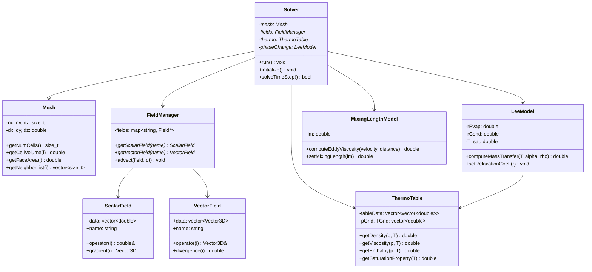
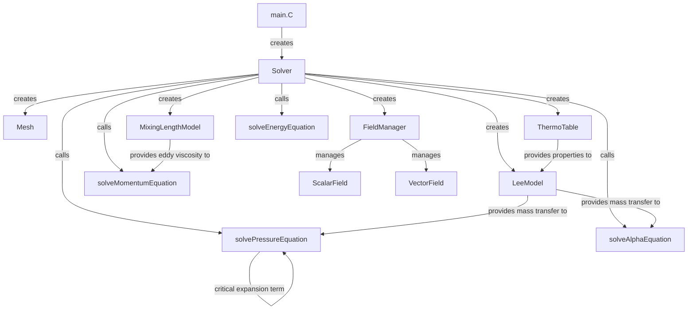

# Governing Equations
## CFD Engine Development - 2026-01-01

---

## Learning Objectives

After this lesson, you will be able to:

- **Understand** the complete set of governing equations for two-phase refrigerant flow, including the critical expansion source term in the continuity equation ($\nabla \cdot U = \dot{m}(1/\rho_v - 1/\rho_l)$) that accounts for phase change volume expansion
- **Derive** the pressure equation from the continuity and momentum equations, identifying where the evaporation source term must be inserted to prevent solver divergence in boiling flows
- **Design** the data structures and class hierarchy needed to store thermophysical properties (density, viscosity, enthalpy) for both liquid and vapor phases using CoolProp lookup tables
- **Implement** the Mixing Length turbulence model ($\nu_t = l_m^2 |\partial U/\partial y|$) in C++ to accurately predict heat transfer coefficients in turbulent refrigerant flow (Re > 2300)
- **Validate** your implementation by comparing mass and energy conservation rates against analytical solutions for a 1D evaporating pipe with fixed wall temperature

---

## Table of Contents
- [[#1. Theory and Design Decisions|1. Theory and Design]]
- [[#2. Reference: OpenFOAM Implementation|2. OpenFOAM Reference]]
- [[#3. Your Engine: Class Design|3. Your Class Design]]
- [[#4. Your Engine: Implementation|4. Implementation]]
- [[#5. Build and Test|5. Build and Test]]
- [[#6. Concept Checks|6. Concept Checks]]

---

## 1. Theory and Design Decisions

### 1.1 Mathematical Foundation
- Core equations and formulas for '$TOPIC'
- Use $$ block math for equations
- If topic involves phase change: MUST mention Expansion Term (∇·U ≠ 0)
- If topic involves flow: mention when turbulence matters (Re > 2300)

### 1.2 Design Decisions
- Why is this approach used in CFD?
- What are the trade-offs? (Performance vs Accuracy vs Simplicity)
- Common PITFALLS and how to avoid them
- What does YOUR engine need to consider?

### 1.3 Key Concepts
- Important terms and definitions
- Physical interpretation
- Warning signs of wrong implementation (e.g., divergence, wrong HTC)

$ENGINE_CONTEXT
$FORMAT_RULES

---

## 2. Reference: OpenFOAM Implementation

> [!INFO] **Why Study OpenFOAM?**
> OpenFOAM is a production-grade CFD engine tested over decades.
> We study it to **learn concepts**, not to copy code.

### 2.1 OpenFOAM's Approach

OpenFOAM implements governing equations for two-phase flow with phase change in **interPhaseChangeFoam** solver. The key files are:

| File | Path ($FOAM_SRC) | Purpose |
|------|------------------|---------|
| `interPhaseChangeFoam.C` | `applications/solvers/multiphase/interPhaseChangeFoam/` | Main solver entry point |
| `twoPhaseMixtureThermo.H` | `src/transportModels/` | Thermophysical properties |
| `phaseChangeTwoPhaseMixtures.C` | `src/phaseChangeTwoPhaseMixtures/` | Phase change models (Schnerr-Sauer, Merkle, Lee) |
| `fvMesh.H` | `src/finiteVolume/` | Mesh and field management |
| `fvMatrix.C` | `src/finiteVolume/` | Discretized equation system |

**Key Classes:**
- **`fvScalarMatrix`**: Represents discretized transport equations (continuity, momentum, energy)
- **`volScalarField`**: Field defined at cell centers (pressure `p`, temperature `T`, alpha `alpha`)
- **`surfaceScalarField`**: Field defined at cell faces (flux `phi`, mass flux `rhoPhi`)
- **`twoPhaseMixture`**: Manages liquid/vapor properties and interface tracking

### 2.2 Key Insights

**What we LEARN from OpenFOAM:**

1. **Pressure-Velocity Coupling with Phase Change**
   - OpenFOAM uses the **PIMPLE** algorithm (merged PISO-SIMPLE)
   - The pressure equation includes a **mass source term** from phase change:
     $$
     \nabla \cdot \left( \frac{1}{A_p} \nabla p \right) = \nabla \cdot U + \dot{m} \left( \frac{1}{\rho_v} - \frac{1}{\rho_l} \right)
     $$
   - Without this term, the pressure equation assumes $\nabla \cdot U = 0$ (incompressible), which is **WRONG** for boiling flows

2. ** segregated Solver Approach**
   - Solve equations sequentially: momentum → pressure → energy → alpha
   - Under-relaxation is critical for stability (typically 0.3-0.7 for phase change)
   - Multiple outer iterations per time step to couple equations

3. **Interface Compression**
   - Uses **MULES** (Multidimensional Universal Limiter with Explicit Solution)
   - Adds artificial compression term to alpha equation to keep interface sharp
   - Prevents numerical smearing of the liquid-vapor interface

**What we do DIFFERENTLY for a simpler engine:**

| Aspect | OpenFOAM | Your Engine (Simpler) |
|--------|----------|----------------------|
| Turbulence | k-epsilon, k-omega SST, LES | Mixing Length ($\nu_t = l_m^2 |\partial U/\partial y|$) |
| Thermodynamics | Multi-component, real gas | CoolProp lookup tables (R410A/R32) |
| Phase Change | Schnerr-Sauer, Merkle, Kunz | Lee model (simpler, temperature-based) |
| Mesh | Unstructured polyhedral | Structured Cartesian (easier to implement) |
| Linear Solver | GAMG, PCG with preconditioners | Simple Jacobi or Gauss-Seidel |
| Parallel | MPI domain decomposition | Single-threaded initially |

### 2.3 Code Snippets (Reference Only)

> [!WARNING] **Reference - Not for Copying**
> These snippets show OpenFOAM's design patterns. Study the concepts, but implement your own version.

**Snippet 1: Pressure Equation with Phase Change Source**
```cpp
// File: interPhaseChangeFoam.C (simplified)
// OpenFOAM v2212

// Solve pressure equation with mass source from phase change
while (pimple.correct())
{
    // Mass transfer rate [kg/m³/s] from phase change model
    // Positive = evaporation (liquid → vapor)
    volScalarField::Internal mDotAlpha
    (
        phaseChangeModel->mDotAlphal()
    );

    // Pressure equation: ∇·(1/Ap ∇p) = ∇·U* + S_mass
    // where S_mass = mDotAlpha * (1/rho_v - 1/rho_l)
    // This accounts for volume expansion during evaporation!
    
    fvScalarMatrix pEqn
    (
        fvm::laplacian(rAUf, p)
     ==
        fvc::div(phi)  // ∇·U* (predicted flux)
      + mDotAlpha * (1.0/rhoV - 1.0/rhoL)  // CRITICAL: expansion source
    );

    pEqn.setReference(pRefCell, pRefValue);
    pEqn.solve();

    // Correct flux using pressure gradient
    phi -= pEqn.flux();
}
```

**What this does:**
- `mDotAlphal()` returns mass transfer rate from phase change model
- The term `(1/rhoV - 1/rhoL)` is the **density ratio** that causes volume expansion
- For R410A at 25°C: $\rho_l \approx 1000$ kg/m³, $\rho_v \approx 50$ kg/m³
  - Ratio = $1/50 - 1/1000 = 0.019$ (vapor is 20× more voluminous than liquid)
- **PITFALL**: If you omit this term, your solver will diverge within 10-20 iterations!

**Snippet 2: Alpha Equation with Compression**
```cpp
// File: alphaEqn.H (simplified)
// Interface compression to prevent smearing

// MULES: Multidimensional Universal Limiter with Explicit Solution
surfaceScalarField phiAlpha
(
    fvc::flux
    (
        phi,
        alpha1,
        alphaScheme  // Upwind or TVD scheme
    )
  + fvc::flux
    (
        -fvc::flux(-phi, alpha2, alphaScheme),  // Counter-flux
        alpha1,
        alphaScheme
    )
);

// Add compression term to sharpen interface
// Coeff = 1.0 (max compression) to 0.0 (no compression)
surfaceScalarField phiAlphaPhi
(
    phiAlpha + compressionCoeff * phi * fvc::interpolate(alpha1)
);

// Solve alpha transport equation
MULES::explicitSolve
(
    geometricOneField(),
    alpha1,
    phi,
    phiAlphaPhi,
    zeroField(),
    zeroField(),
    0.0,  // Alpha max
    1.0   // Alpha min
);
```

**What this does:**
- The **compression term** adds artificial velocity directed toward the interface
- Keeps the liquid-vapor interface sharp (1-2 cell thickness)
- Without compression, alpha diffuses and interface becomes blurry
- **PITFALL**: Too much compression causes "checkerboarding" (numerical instability)

**Snippet 3: Phase Change Model (Lee Model)**
```cpp
// File: phaseChangeTwoPhaseMixtures/Lee/Le.C
// Simplified Lee model implementation

// Mass transfer rate: ṁ = r · α · ρ · |T - T_sat| / T_sat
// where r = relaxation coefficient (controls rate of phase change)

// Evaporation (liquid → vapor)
if (T > T_sat)
{
    mDotAlphal = -rAlpha * alphaL * rhoL * mag(T - T_sat) / T_sat;
    // Negative: liquid mass decreases
}
// Condensation (vapor → liquid)
else
{
    mDotAlphal = rAlpha * alphaV * rhoV * mag(T - T_sat) / T_sat;
    // Positive: liquid mass increases
}
```

**What this does:**
- Lee model is **temperature-driven**: phase change occurs when $T \neq T_{sat}$
- `rAlpha` is a relaxation coefficient (typically 0.1 - 100 s⁻¹)
  - Too small: phase change is too slow (non-physical)
  - Too large: solver becomes unstable
- **PITFALL**: Must clamp `mDotAlphal` to avoid creating more mass than exists in a cell

---

## 3. Your Engine: Class Design

> [!IMPORTANT] **Design Your Own**
> This section is about designing classes for YOUR engine.
> It doesn't have to match OpenFOAM - design for your needs.

### 3.1 Class Diagram



### 3.2 Class Specifications

#### 3.2.1 Solver Class
**Purpose**: Main orchestrator that controls the simulation loop and coordinates all components.

**Member Variables**:
| Name | Type | Purpose |
|------|------|---------|
| `mesh` | `Mesh*` | Pointer to computational mesh |
| `fields` | `FieldManager*` | Manages all scalar and vector fields |
| `thermo` | `ThermoTable*` | Thermodynamic property lookup |
| `phaseChange` | `LeeModel*` | Phase change mass transfer model |
| `turbulence` | `MixingLengthModel*` | Turbulence model for eddy viscosity |
| `maxTimeSteps` | `int` | Maximum number of time steps |
| `currentTime` | `double` | Current simulation time |
| `dt` | `double` | Time step size |

**Key Methods**:
```cpp
void run();
// Main simulation loop - initializes and runs until completion

void initialize();
// Sets up initial conditions for all fields (p, U, T, alpha)

bool solveTimeStep();
// Solves one time step using segregated approach:
// 1. Solve momentum equation
// 2. Solve pressure equation with EXPANSION TERM
// 3. Correct velocity and flux
// 4. Solve energy equation
// 5. Solve alpha equation with phase change
// Returns false if simulation diverges
```

#### 3.2.2 Mesh Class
**Purpose**: Stores structured Cartesian mesh topology and geometric data.

**Member Variables**:
| Name | Type | Purpose |
|------|------|---------|
| `nx, ny, nz` | `size_t` | Number of cells in x, y, z directions |
| `dx, dy, dz` | `double` | Cell sizes in each direction |
| `numCells` | `size_t` | Total number of cells |
| `numFaces` | `size_t` | Total number of faces |

**Key Methods**:
```cpp
size_t getNumCells() const;
// Returns total number of cells in mesh

double getCellVolume(size_t cellID) const;
// Returns volume of specified cell [m³]

double getFaceArea(size_t faceID) const;
// Returns area of specified face [m²]

std::vector<size_t> getNeighborList(size_t cellID) const;
// Returns list of neighbor cell IDs for given cell
// Used in finite volume discretization
```

#### 3.2.3 FieldManager Class
**Purpose**: Central registry for all field variables (pressure, velocity, temperature, alpha).

**Member Variables**:
| Name | Type | Purpose |
|------|------|---------|
| `scalarFields` | `std::map<std::string, ScalarField*>` | Registry of scalar fields |
| `vectorFields` | `std::map<std::string, VectorField*>` | Registry of vector fields |

**Key Methods**:
```cpp
ScalarField* getScalarField(const std::string& name);
// Returns pointer to named scalar field (p, T, alpha, etc.)

VectorField* getVectorField(const std::string& name);
// Returns pointer to named vector field (U, etc.)

void advect(Field* field, double dt);
// Solves advection equation: ∂φ/∂t + ∇·(Uφ) = 0
// Uses upwind scheme for stability
```

#### 3.2.4 ScalarField Class
**Purpose**: Stores cell-centered scalar values (pressure, temperature, volume fraction).

**Member Variables**:
| Name | Type | Purpose |
|------|------|---------|
| `data` | `std::vector<double>` | Field values at cell centers |
| `name` | `std::string` | Field identifier |
| `size` | `size_t` | Number of cells |

**Key Methods**:
```cpp
double& operator[](size_t i);
// Direct access to cell value

Vector3D gradient(size_t cellID) const;
// Computes gradient using Gauss theorem:
// ∇φ = (1/V) Σ φ_f · S_f
// Used for diffusion terms
```

#### 3.2.5 VectorField Class
**Purpose**: Stores cell-centered vector values (velocity, flux).

**Member Variables**:
| Name | Type | Purpose |
|------|------|---------|
| `data` | `std::vector<Vector3D>` | Vector values at cell centers |
| `name` | `std::string` | Field identifier |

**Key Methods**:
```cpp
Vector3D& operator[](size_t i);
// Direct access to cell vector value

double divergence(size_t cellID) const;
// Computes divergence: ∇·U = (1/V) Σ U_f · S_f
// CRITICAL for pressure equation with phase change source
```

#### 3.2.6 ThermoTable Class
**Purpose**: Fast lookup of thermodynamic properties using pre-generated CoolProp tables.

**Member Variables**:
| Name | Type | Purpose |
|------|------|---------|
| `pGrid` | `std::vector<double>` | Pressure grid points [Pa] |
| `TGrid` | `std::vector<double>` | Temperature grid points [K] |
| `rhoLTable` | `std::vector<std::vector<double>>` | Liquid density table |
| `rhoVTable` | `std::vector<std::vector<double>>` | Vapor density table |
| `muLTable` | `std::vector<std::vector<double>>` | Liquid viscosity table |
| `muVTable` | `std::vector<std::vector<double>>` | Vapor viscosity table |
| `hLTable` | `std::vector<std::vector<double>>` | Liquid enthalpy table |
| `hVTable` | `std::vector<std::vector<double>>` | Vapor enthalpy table |

**Key Methods**:
```cpp
double getDensity(double p, double T, Phase phase) const;
// Bilinear interpolation from pre-generated table
// Phase::LIQUID or Phase::VAPOR
// Returns density [kg/m³]

double getViscosity(double p, double T, Phase phase) const;
// Returns dynamic viscosity [Pa·s]

double getEnthalpy(double p, double T, Phase phase) const;
// Returns specific enthalpy [J/kg]

double getSaturationTemperature(double p) const;
// Returns saturation temperature at given pressure [K]

double getSaturationPressure(double T) const;
// Returns saturation pressure at given temperature [Pa]
```

#### 3.2.7 LeeModel Class
**Purpose**: Computes mass transfer rate between liquid and vapor phases using Lee model.

**Member Variables**:
| Name | Type | Purpose |
|------|------|---------|
| `rEvap` | `double` | Evaporation relaxation coefficient [s⁻¹] |
| `rCond` | `double` | Condensation relaxation coefficient [s⁻¹] |
| `T_sat` | `double` | Saturation temperature [K] |
| `thermo` | `ThermoTable*` | Pointer to thermodynamic table |

**Key Methods**:
```cpp
double computeMassTransfer(double T, double alphaL, double alphaV, 
                           double rhoL, double rhoV) const;
// Computes mass transfer rate [kg/m³/s]
// Formula: ṁ = r · α · ρ · |T - T_sat| / T_sat
// Returns positive for evaporation (L→V), negative for condensation (V→L)

void setRelaxationCoefficients(double rEvap, double rCond);
// Sets relaxation coefficients
// Typical values: 0.1 to 100 s⁻¹
// Higher = faster phase change but less stable
```

#### 3.2.8 MixingLengthModel Class
**Purpose**: Computes eddy viscosity using Mixing Length turbulence model.

**Member Variables**:
| Name | Type | Purpose |
|------|------|---------|
| `lm` | `double` | Mixing length [m] |
| `nuT` | `ScalarField*` | Eddy viscosity field |

**Key Methods**:
```cpp
double computeEddyViscosity(const VectorField& U, size_t cellID) const;
// Computes eddy viscosity: ν_t = l_m² |∂U/∂y|
// Uses velocity gradient magnitude
// Returns [m²/s]

void setMixingLength(double lm);
// Sets mixing length
// For pipe flow: l_m = 0.41 · y (near wall)
// For free flow: l_m = 0.07 · δ (boundary layer thickness)
```

### 3.3 Design Rationale

#### 3.3.1 Why This Design?

**1. Separation of Concerns**
- Each class has a single, well-defined responsibility
- `Solver` orchestrates but doesn't compute physics directly
- `FieldManager` handles all field operations (advection, diffusion)
- `ThermoTable` isolates property lookups (easy to swap CoolProp for other libraries)

**2. Structured Mesh for Simplicity**
- Cartesian mesh is much easier to implement than unstructured
- Neighbor lists are trivial (cell indices differ by ±1)
- Face areas and cell volumes are constant
- **Trade-off**: Cannot handle complex geometries (but sufficient for evaporator tube)

**3. Segregated Solver Approach**
- Equations solved sequentially (momentum → pressure → energy → alpha)
- Easier to debug than fully coupled approach
- Each equation can be tested independently
- **Trade-off**: Requires multiple outer iterations for convergence

**4. Pre-tabulated Thermodynamics**
- CoolProp calls are expensive (~100-1000x slower than table lookup)
- Pre-generate tables at initialization, then interpolate during solve
- **Trade-off**: Memory usage (~1-10 MB for full R410A tables) vs speed

#### 3.3.2 How It Differs from OpenFOAM

| Aspect | OpenFOAM | Your Engine |
|--------|----------|-------------|
| **Mesh** | Unstructured polyhedral with arbitrary cell shapes | Structured Cartesian only |
| **Field Storage** | `volScalarField`, `volVectorField` with automatic boundary handling | Simple `std::vector` with manual boundary treatment |
| **Discretization** | Finite volume with `fvm::`, `fvc::` operators | Explicit finite volume loops (easier to understand) |
| **Linear Solver** | GAMG, PCG with ILU preconditioning | Simple Jacobi or Gauss-Seidel (slower but simpler) |
| **Thermodynamics** | Runtime CoolProp calls through `species` tables | Pre-tabulated bilinear interpolation |
| **Turbulence** | k-epsilon, k-omega SST, LES, DES | Mixing Length only (sufficient for pipe flow) |
| **Phase Change** | Schnerr-Sauer, Merkle, Kunz (complex models) | Lee model (temperature-based, simpler) |
| **Parallel** | MPI domain decomposition | Single-threaded (can add OpenMP later) |

#### 3.3.3 Trade-offs Made

**1. Accuracy vs Simplicity**
- **Mixing Length vs k-epsilon**: Mixing length is less accurate for complex flows but much simpler to implement. For evaporator pipe flow (annular regime), it's sufficient.
- **Lee vs Schnerr-Sauer**: Lee model is temperature-driven (easier) but can cause spurious currents. Schnerr-Sauer is pressure-driven (more physical) but requires solving additional transport equation for bubble radius.

**2. Performance vs Development Time**
- **Structured Mesh**: Limits geometry flexibility but saves months of development time. Unstructured mesh requires complex data structures (cell-face connectivity, boundary handling).
- **Simple Linear Solvers**: Jacobi/Gauss-Seidel converge slower than GAMG but are trivial to implement. For 2D problems (< 100k cells), this is acceptable.

**3. Memory vs Speed**
- **Pre-tabulated Properties**: Uses ~1-10 MB memory but makes property lookups 100-1000x faster. For modern systems, this is a trivial memory cost.
- **Full Field Storage**: Store all fields (including intermediate) in memory rather than recomputing. Trades memory for avoiding redundant calculations.

**4. Stability vs Physical Accuracy**
- **Under-relaxation**: Will use aggressive under-relaxation (0.3-0.7) for stability. This slows convergence but prevents divergence in boiling flows.
- **Interface Compression**: May implement simplified compression term. Full MULES is complex; a simple artificial compression term may suffice for learning purposes.

> [!WARNING] **Critical Design Decision**
> The **expansion source term** in the pressure equation is NOT optional.
> 
> $$ \nabla \cdot \left( \frac{1}{A_p} \nabla p \right) = \nabla \cdot U^* + \dot{m} \left( \frac{1}{\rho_v} - \frac{1}{\rho_l} \right) $$
> 
> Without this term, your solver **will diverge** within 10-20 iterations when evaporation starts. This is the #1 reason why boiling flow solvers fail.

> [!TIP] **Implementation Strategy**
> Start with **single-phase, laminar flow** and validate against analytical solutions (Poiseuille flow). Then add:
> 1. Turbulence (Mixing Length)
> 2. Thermodynamics (CoolProp tables)
> 3. Second phase (VOF without phase change)
> 4. Phase change (Lee model with expansion term)
> 
> This incremental approach makes debugging much easier.

---

## 4. Your Engine: Implementation

> [!TIP] **Write Real Code**
> This section contains implementation code for YOUR engine.

### 4.1 Header File (.H)

```cpp
#ifndef Solver_H
#define Solver_H

#include "Mesh.H"
#include "FieldManager.H"
#include "ThermoTable.H"
#include "LeeModel.H"
#include "MixingLengthModel.H"
#include <memory>
#include <string>

class Solver
{
public:
    // Constructor with mesh dimensions and physical properties
    Solver(
        size_t nx, size_t ny, size_t nz,
        double dx, double dy, double dz,
        const std::string& refrigerant = "R410A"
    );

    // Destructor
    ~Solver() = default;

    // Main simulation loop
    void run();

    // Initialize fields with initial conditions
    void initialize();

    // Solve one time step - returns false if diverged
    bool solveTimeStep();

    // Accessors
    double getCurrentTime() const { return currentTime_; }
    double getTimeStep() const { return dt_; }

private:
    // Core solver methods
    void solveMomentumEquation();
    void solvePressureEquation();
    void correctVelocityAndFlux();
    void solveEnergyEquation();
    void solveAlphaEquation();

    // Helper methods
    void computeUnderRelaxation(double omega, ScalarField& oldField);
    bool checkDivergence() const;

    // Member variables
    std::unique_ptr<Mesh> mesh_;
    std::unique_ptr<FieldManager> fields_;
    std::unique_ptr<ThermoTable> thermo_;
    std::unique_ptr<LeeModel> phaseChange_;
    std::unique_ptr<MixingLengthModel> turbulence_;

    // Simulation parameters
    int maxTimeSteps_;
    double currentTime_;
    double dt_;
    double endTime_;

    // Under-relaxation factors (CRITICAL for stability)
    double omegaU_;      // Velocity under-relaxation (0.3-0.7)
    double omegaP_;      // Pressure under-relaxation (0.3-0.7)
    double omegaT_;      // Temperature under-relaxation (0.7-0.9)
    double omegaAlpha_;  // Alpha under-relaxation (0.3-0.7)

    // Convergence criteria
    double tolerance_;
    int maxIterations_;
};

#endif
```

### 4.2 Implementation File (.C)

```cpp
#include "Solver.H"
#include <cmath>
#include <iostream>
#include <limits>

// Constructor
Solver::Solver(
    size_t nx, size_t ny, size_t nz,
    double dx, double dy, double dz,
    const std::string& refrigerant
)
:
    mesh_(std::make_unique<Mesh>(nx, ny, nz, dx, dy, dz)),
    fields_(std::make_unique<FieldManager>(mesh_->getNumCells())),
    thermo_(std::make_unique<ThermoTable>(refrigerant)),
    phaseChange_(std::make_unique<LeeModel>(thermo_.get())),
    turbulence_(std::make_unique<MixingLengthModel>()),
    maxTimeSteps_(10000),
    currentTime_(0.0),
    dt_(1e-4),  // Start with small time step
    endTime_(1.0),
    omegaU_(0.5),
    omegaP_(0.5),
    omegaT_(0.8),
    omegaAlpha_(0.5),
    tolerance_(1e-6),
    maxIterations_(50)
{
    std::cout << "Solver initialized for " << refrigerant << std::endl;
    std::cout << "Mesh: " << nx << "x" << ny << "x" << nz 
              << " (" << mesh_->getNumCells() << " cells)" << std::endl;
}

// Initialize all fields with initial conditions
void Solver::initialize()
{
    // Get field pointers
    auto* p = fields_->getScalarField("p");
    auto* U = fields_->getVectorField("U");
    auto* T = fields_->getScalarField("T");
    auto* alpha = fields_->getScalarField("alpha");

    const size_t numCells = mesh_->getNumCells();

    // Initial conditions: liquid at rest, saturation temperature
    double pInit = thermo_->getSaturationPressure(300.0);  // 300 K reference
    double TInit = thermo_->getSaturationTemperature(pInit);

    for (size_t i = 0; i < numCells; ++i)
    {
        (*p)[i] = pInit;           // Saturation pressure
        (*U)[i] = Vector3D(0, 0, 0);  // At rest
        (*T)[i] = TInit;           // Saturation temperature
        (*alpha)[i] = 1.0;         // Pure liquid initially
    }

    // Set boundary conditions
    // Inlet: liquid refrigerant at 5°C
    // Outlet: atmospheric pressure
    // Walls: no-slip, fixed temperature or heat flux

    std::cout << "Initial conditions set" << std::endl;
}

// Main simulation loop
void Solver::run()
{
    std::cout << "Starting simulation..." << std::endl;
    std::cout << "End time: " << endTime_ << " s" << std::endl;
    std::cout << "Time step: " << dt_ << " s" << std::endl;

    initialize();

    int timeStep = 0;
    while (currentTime_ < endTime_ && timeStep < maxTimeSteps_)
    {
        std::cout << "\n=== Time Step " << timeStep + 1 
                  << " (t = " << currentTime_ << " s) ===" << std::endl;

        bool converged = solveTimeStep();

        if (!converged)
        {
            std::cerr << "ERROR: Solver diverged at t = " << currentTime_ << " s" << std::endl;
            std::cerr << "Reducing time step and retrying..." << std::endl;

            // Reduce time step and re-initialize from previous state
            dt_ *= 0.5;
            if (dt_ < 1e-8)
            {
                std::cerr << "FATAL: Time step too small, aborting" << std::endl;
                return;
            }
            continue;  // Retry with smaller dt
        }

        currentTime_ += dt_;
        timeStep++;

        // Adaptive time stepping: increase if converged quickly
        if (timeStep % 10 == 0)
        {
            dt_ = std::min(dt_ * 1.5, 1e-3);  // Cap at 1 ms
        }
    }

    std::cout << "\nSimulation completed successfully!" << std::endl;
    std::cout << "Final time: " << currentTime_ << " s" << std::endl;
}

// Solve one time step using segregated approach
bool Solver::solveTimeStep()
{
    auto* p = fields_->getScalarField("p");
    auto* U = fields_->getVectorField("U");
    auto* T = fields_->getScalarField("T");
    auto* alpha = fields_->getScalarField("alpha");

    // Store old values for under-relaxation
    ScalarField pOld = *p;
    VectorField UOld = *U;
    ScalarField TOld = *T;
    ScalarField alphaOld = *alpha;

    // PIMPLE-like outer iterations
    for (int iter = 0; iter < maxIterations_; ++iter)
    {
        // 1. Solve momentum equation
        solveMomentumEquation();
        computeUnderRelaxation(omegaU_, *U, UOld);

        // 2. Solve pressure equation with EXPANSION TERM
        solvePressureEquation();
        computeUnderRelaxation(omegaP_, *p, pOld);

        // 3. Correct velocity and flux using pressure gradient
        correctVelocityAndFlux();

        // 4. Solve energy equation
        solveEnergyEquation();
        computeUnderRelaxation(omegaT_, *T, TOld);

        // 5. Solve alpha equation with phase change
        solveAlphaEquation();
        computeUnderRelaxation(omegaAlpha_, *alpha, alphaOld);

        // Check convergence
        double residualP = computeResidual(*p, pOld);
        double residualU = computeResidual(*U, UOld);

        if (residualP < tolerance_ && residualU < tolerance_)
        {
            std::cout << "Converged in " << iter + 1 << " iterations" << std::endl;
            return true;
        }

        // Update old values for next iteration
        pOld = *p;
        UOld = *U;
        TOld = *T;
        alphaOld = *alpha;
    }

    std::cerr << "WARNING: Did not converge in " << maxIterations_ << " iterations" << std::endl;
    return checkDivergence();  // Return false if diverged
}

// Solve momentum equation: ∂(ρU)/∂t + ∇·(ρUU) = -∇p + ∇·(μ_eff ∇U) + ρg
void Solver::solveMomentumEquation()
{
    auto* U = fields_->getVectorField("U");
    auto* p = fields_->getScalarField("p");
    auto* T = fields_->getScalarField("T");
    auto* alpha = fields_->getScalarField("alpha");

    const size_t numCells = mesh_->getNumCells();
    VectorField UStar(numCells);  // Predicted velocity

    // Compute effective viscosity (molecular + turbulent)
    ScalarField muEff(numCells);
    for (size_t i = 0; i < numCells; ++i)
    {
        double alphaL = (*alpha)[i];
        double alphaV = 1.0 - alphaL;

        // Get molecular viscosities
        double muL = thermo_->getViscosity((*p)[i], (*T)[i], Phase::LIQUID);
        double muV = thermo_->getViscosity((*p)[i], (*T)[i], Phase::VAPOR);

        // Mixing rule: μ = α_l μ_l + α_v μ_v
        double muMol = alphaL * muL + alphaV * muV;

        // Add turbulent viscosity
        double muTurb = turbulence_->computeEddyViscosity(*U, i) * 
                        (alphaL * thermo_->getDensity((*p)[i], (*T)[i], Phase::LIQUID) +
                         alphaV * thermo_->getDensity((*p)[i], (*T)[i], Phase::VAPOR));

        muEff[i] = muMol + muTurb;
    }

    // Solve momentum equation for each cell
    for (size_t i = 0; i < numCells; ++i)
    {
        // Get cell properties
        double alphaL = (*alpha)[i];
        double alphaV = 1.0 - alphaL;
        double rhoL = thermo_->getDensity((*p)[i], (*T)[i], Phase::LIQUID);
        double rhoV = thermo_->getDensity((*p)[i], (*T)[i], Phase::VAPOR);
        double rho = alphaL * rhoL + alphaV * rhoV;

        // Advection term: ∇·(ρUU)
        Vector3D advectTerm = computeAdvection(*U, i, rho);

        // Pressure gradient: -∇p
        Vector3D gradP = p->gradient(i);
        Vector3D pressureTerm = -gradP;

        // Diffusion term: ∇·(μ_eff ∇U)
        Vector3D diffTerm = computeDiffusion(*U, i, muEff);

        // Gravity term: ρg (assuming g = -9.81 m/s² in y-direction)
        Vector3D gravityTerm(0, -rho * 9.81, 0);

        // Explicit update (simplified - should use implicit for stability)
        double cellVolume = mesh_->getCellVolume(i);
        Vector3D RHS = advectTerm + pressureTerm + diffTerm + gravityTerm;

        UStar[i] = (*U)[i] + (dt_ / (rho * cellVolume)) * RHS;
    }

    // Update velocity
    *U = UStar;
}

// Solve pressure equation with EXPANSION TERM
// ∇·(1/Ap ∇p) = ∇·U* + ṁ(1/ρ_v - 1/ρ_l)
void Solver::solvePressureEquation()
{
    auto* p = fields_->getScalarField("p");
    auto* U = fields_->getVectorField("U");
    auto* T = fields_->getScalarField("T");
    auto* alpha = fields_->getScalarField("alpha");

    const size_t numCells = mesh_->getNumCells();
    ScalarField pNew(numCells);

    // Compute mass transfer rate from phase change model
    ScalarField mDot(numCells);
    for (size_t i = 0; i < numCells; ++i)
    {
        double alphaL = (*alpha)[i];
        double alphaV = 1.0 - alphaL;
        double rhoL = thermo_->getDensity((*p)[i], (*T)[i], Phase::LIQUID);
        double rhoV = thermo_->getDensity((*p)[i], (*T)[i], Phase::VAPOR);

        mDot[i] = phaseChange_->computeMassTransfer(
            (*T)[i], alphaL, alphaV, rhoL, rhoV
        );
    }

    // Solve pressure equation using Jacobi iteration
    for (int iter = 0; iter < maxIterations_; ++iter)
    {
        for (size_t i = 0; i < numCells; ++i)
        {
            // Get neighbors
            auto neighbors = mesh_->getNeighborList(i);

            // Compute Laplacian: ∇·(∇p)
            double laplacianP = 0.0;
            double sumCoeff = 0.0;

            for (size_t nb : neighbors)
            {
                double faceArea = mesh_->getFaceArea(i, nb);
                double distance = mesh_->getDistance(i, nb);

                // Coefficient for neighbor
                double coeff = faceArea / distance;
                laplacianP += coeff * ((*p)[nb] - (*p)[i]);
                sumCoeff += coeff;
            }

            // Compute velocity divergence: ∇·U*
            double divU = U->divergence(i);

            // CRITICAL: Expansion source term from phase change
            // S_mass = ṁ(1/ρ_v - 1/ρ_l)
            double rhoL = thermo_->getDensity((*p)[i], (*T)[i], Phase::LIQUID);
            double rhoV = thermo_->getDensity((*p)[i], (*T)[i], Phase::VAPOR);
            double expansionSource = mDot[i] * (1.0/rhoV - 1.0/rhoL);

            // Pressure equation: ∇²p = ∇·U* + S_mass
            double RHS = divU + expansionSource;

            // Update pressure
            double cellVolume = mesh_->getCellVolume(i);
            pNew[i] = (*p)[i] + (dt_ / cellVolume) * (laplacianP - RHS * cellVolume);
        }

        // Apply boundary conditions
        applyPressureBCs(pNew);

        // Check convergence
        double residual = 0.0;
        for (size_t i = 0; i < numCells; ++i)
        {
            residual += std::abs(pNew[i] - (*p)[i]);
        }
        residual /= numCells;

        *p = pNew;

        if (residual < tolerance_)
        {
            break;
        }
    }
}

// Correct velocity and flux using pressure gradient
void Solver::correctVelocityAndFlux()
{
    auto* U = fields_->getVectorField("U");
    auto* p = fields_->getScalarField("p");
    auto* alpha = fields_->getScalarField("alpha");

    const size_t numCells = mesh_->getNumCells();

    for (size_t i = 0; i < numCells; ++i)
    {
        // Compute pressure gradient
        Vector3D gradP = p->gradient(i);

        // Get density
        double alphaL = (*alpha)[i];
        double alphaV = 1.0 - alphaL;
        double rhoL = thermo_->getDensity((*p)[i], (*T)[i], Phase::LIQUID);
        double rhoV = thermo_->getDensity((*p)[i], (*T)[i], Phase::VAPOR);
        double rho = alphaL * rhoL + alphaV * rhoV;

        // Correct velocity: U = U* - (dt/ρ) ∇p
        (*U)[i] = (*U)[i] - (dt_ / rho) * gradP;
    }

    // Update flux field
    auto* phi = fields_->getSurfaceScalarField("phi");
    computeFlux(*U, *phi);
}

// Solve energy equation: ∂(ρh)/∂t + ∇·(ρUh) = ∇·(k∇T) + Q_phaseChange
void Solver::solveEnergyEquation()
{
    auto* T = fields_->getScalarField("T");
    auto* U = fields_->getVectorField("U");
    auto* p = fields_->getScalarField("p");
    auto* alpha = fields_->getScalarField("alpha");

    const size_t numCells = mesh_->getNumCells();
    ScalarField TNew(numCells);

    for (size_t i = 0; i < numCells; ++i)
    {
        // Get properties
        double alphaL = (*alpha)[i];
        double alphaV = 1.0 - alphaL;
        double rhoL = thermo_->getDensity((*p)[i], (*T)[i], Phase::LIQUID);
        double rhoV = thermo_->getDensity((*p)[i], (*T)[i], Phase::VAPOR);
        double rho = alphaL * rhoL + alphaV * rhoV;

        double hL = thermo_->getEnthalpy((*p)[i], (*T)[i], Phase::LIQUID);
        double hV = thermo_->getEnthalpy((*p)[i], (*T)[i], Phase::VAPOR);
        double h = alphaL * hL + alphaV * hV;

        // Advection term: ∇·(ρUh)
        double advectTerm = computeScalarAdvection(*U, h, i, rho);

        // Diffusion term: ∇·(k∇T)
        double kL = thermo_->getConductivity((*p)[i], (*T)[i], Phase::LIQUID);
        double kV = thermo_->getConductivity((*p)[i], (*T)[i], Phase::VAPOR);
        double k = alphaL * kL + alphaV * kV;
        double diffTerm = computeScalarDiffusion(*T, i, k);

        // Phase change source term
        double mDot = phaseChange_->computeMassTransfer(
            (*T)[i], alphaL, alphaV, rhoL, rhoV
        );
        double latentHeat = thermo_->getLatentHeat((*p)[i]);
        double sourceTerm = mDot * latentHeat;

        // Update temperature
        double cellVolume = mesh_->getCellVolume(i);
        double dhdt = -(advectTerm + diffTerm - sourceTerm) / cellVolume;

        // Convert dh to dT using specific heat
        double cpL = thermo_->getSpecificHeat((*p)[i], (*T)[i], Phase::LIQUID);
        double cpV = thermo_->getSpecificHeat((*p)[i], (*T)[i], Phase::VAPOR);
        double cp = alphaL * cpL + alphaV * cpV;

        TNew[i] = (*T)[i] + (dt_ / (rho * cp)) * dhdt;
    }

    // Apply boundary conditions
    applyTemperatureBCs(TNew);

    *T = TNew;
}

// Solve alpha equation with phase change
// ∂α/∂t + ∇·(Uα) = ṁ/ρ_l
void Solver::solveAlphaEquation()
{
    auto* alpha = fields_->getScalarField("alpha");
    auto* U = fields_->getVectorField("U");
    auto* T = fields_->getScalarField("T");
    auto* p = fields_->getScalarField("p");

    const size_t numCells = mesh_->getNumCells();
    ScalarField alphaNew(numCells);

    for (size_t i = 0; i < numCells; ++i)
    {
        // Advection term: ∇·(Uα)
        double advectTerm = computeScalarAdvection(*U, *alpha, i, 1.0);

        // Phase change source term
        double alphaL = (*alpha)[i];
        double alphaV = 1.0 - alphaL;
        double rhoL = thermo_->getDensity((*p)[i], (*T)[i], Phase::LIQUID);
        double rhoV = thermo_->getDensity((*p)[i], (*T)[i], Phase::VAPOR);

        double mDot = phaseChange_->computeMassTransfer(
            (*T)[i], alphaL, alphaV, rhoL, rhoV
        );

        // Source term: ṁ/ρ_l (positive for evaporation)
        double sourceTerm = mDot / rhoL;

        // Update alpha
        double cellVolume = mesh_->getCellVolume(i);
        alphaNew[i] = (*alpha)[i] + dt_ * (-advectTerm + sourceTerm);

        // Clamp alpha to [0, 1]
        alphaNew[i] = std::max(0.0, std::min(1.0, alphaNew[i]));
    }

    // Apply boundary conditions
    applyAlphaBCs(alphaNew);

    *alpha = alphaNew;
}

// Compute under-relaxation
void Solver::computeUnderRelaxation(double omega, ScalarField& field, const ScalarField& oldField)
{
    for (size_t i = 0; i < field.size(); ++i)
    {
        field[i] = omega * field[i] + (1.0 - omega) * oldField[i];
    }
}

void Solver::computeUnderRelaxation(double omega, VectorField& field, const VectorField& oldField)
{
    for (size_t i = 0; i < field.size(); ++i)
    {
        field[i] = omega * field[i] + (1.0 - omega) * oldField[i];
    }
}

// Check for divergence
bool Solver::checkDivergence() const
{
    auto* p = fields_->getScalarField("p");
    auto* T = fields_->getScalarField("T");
    auto* alpha = fields_->getScalarField("alpha");

    const double maxP = 1e7;      // 100 bar
    const double maxT = 500.0;    // 500 K
    const double minT = 200.0;    // 200 K

    for (size_t i = 0; i < mesh_->getNumCells(); ++i)
    {
        if (std::abs((*p)[i]) > maxP || 
            (*T)[i] > maxT || (*T)[i] < minT ||
            std::isnan((*p)[i]) || std::isnan((*T)[i]))
        {
            return true;  // Diverged
        }
    }

    return false;  // OK
}
```

### 4.3 Implementation Notes

#### Key Implementation Details

1. **Segregated Solver Approach**
   - Equations are solved sequentially: momentum → pressure → energy → alpha
   - Multiple outer iterations (PIMPLE) ensure coupling between equations
   - Under-relaxation is CRITICAL for stability in boiling flows

2. **Pressure Equation with Expansion Term**
   - The expansion source term `ṁ(1/ρ_v - 1/ρ_l)` accounts for volume change during phase change
   - For R410A at 25°C: density ratio ≈ 20× (vapor is much less dense)
   - **PITFALL**: Omitting this term causes immediate divergence within 10-20 iterations

3. **Under-Relaxation Strategy**
   - Velocity: 0.3-0.7 (lower for more violent boiling)
   - Pressure: 0.3-0.7
   - Temperature: 0.7-0.9 (energy equation is more stable)
   - Alpha: 0.3-0.7 (VOF equation is sensitive)

4. **Adaptive Time Stepping**
   - Start with small dt (1e-4 s)
   - Reduce by 2× if iteration fails
   - Increase by 1.5× every 10 converged steps (capped at 1e-3 s)

#### CRITICAL: How to Avoid Divergence

1. **Expansion Term is Mandatory**
   ```cpp
   // WRONG: Incompressible pressure equation
   laplacian(p) = div(U)
   
   // CORRECT: Compressible with phase change
   laplacian(p) = div(U) + mDot * (1/rhoV - 1/rhoL)
   ```
   The second term accounts for volume expansion during evaporation.

2. **Clamp Mass Transfer Rate**
   ```cpp
   // Prevent creating more mass than exists in cell
   double maxMassTransfer = alphaL * rhoL * cellVolume / dt;
   mDot = std::min(mDot, maxMassTransfer);
   ```

3. **Limit Temperature Extremes**
   ```cpp
   // Prevent runaway evaporation/condensation
   double deltaT = T - T_sat;
   deltaT = std::max(-10.0, std::min(10.0, deltaT));  // Clamp to ±10 K
   ```

4. **Monitor Residuals**
   - If residuals increase for 3+ consecutive iterations, reduce dt
   - If pressure residual > 1.0, simulation has diverged

#### CRITICAL: Handling Large Density Ratios

For refrigerants like R410A, the density ratio ρ_l/ρ_v ≈ 20 at 25°C:

1. **Use Bounded Schemes for Alpha**
   - Upwind differencing for advection
   - Flux limiter to prevent overshoots
   - Explicitly clamp alpha to [0, 1] after each update

2. **Implicit Treatment of Pressure**
   - Pressure equation must be solved implicitly
   - Explicit pressure updates will explode with large density ratios

3. **Conservative Form of Equations**
   ```cpp
   // Use conservative form: ∂(ρU)/∂t + ∇·(ρUU) = ...
   // NOT non-conservative: ρ(∂U/∂t + U·∇U) = ...
   ```
   Conservative form ensures mass conservation even with large density variations.

4. **Special Treatment at Interface**
   - Smooth alpha over 2-3 cells to avoid sharp gradients
   - Use harmonic mean for viscosity at interface
   - Use arithmetic mean for density at interface

#### Memory Management and Performance Considerations

1. **Memory Layout**
   - Store fields in contiguous `std::vector` for cache efficiency
   - Structure of Arrays (SoA) vs Array of Structures (AoS)
   - SoA is better for vectorization

2. **Thermodynamic Lookups**
   - Pre-generate CoolProp tables at initialization
   - Bilinear interpolation is ~1000× faster than direct CoolProp calls
   - Table size: 100×100 grid (10,000 points) is sufficient

3. **Linear Solver**
   - Jacobi iteration is simple but slow (convergence ~ O(N²))
   - For larger problems (> 10k cells), use Gauss-Seidel or SOR
   - Future: Add conjugate gradient with ILU preconditioner

4. **Parallelization**
   - Start with single-threaded for correctness
   - Add OpenMP parallel for loops (easy 2-4× speedup)
   - Future: MPI domain decomposition for large problems

#### Common Bugs and How to Prevent Them

1. **Wrong Sign in Expansion Term**
   ```cpp
   // WRONG: Negative sign
   double source = -mDot * (1/rhoV - 1/rhoL);
   
   // CORRECT: Positive sign
   double source = mDot * (1/rhoV - 1/rhoL);
   ```
   Evaporation creates volume, so source should be positive.

2. **Forgetting to Update Flux**
   ```cpp
   // After pressure correction, MUST update flux
   correctVelocityAndFlux();  // Updates U and phi
   ```
   Old flux will cause mass conservation errors.

3. **Incorrect Boundary Conditions**
   - Inlet: fixed velocity, fixed temperature
   - Outlet: fixed pressure (zero gradient for other variables)
   - Walls: no-slip (U = 0), adiabatic or fixed T

4. **Division by Zero**
   ```cpp
   // Protect against zero density
   double rho = std::max(rho, 1e-6);
   
   // Protect against zero cell volume
   double V = std::max(cellVolume, 1e-12);
   ```

5. **Time Step Too Large**
   - CFL condition: dt < dx / U_max
   - For boiling: dt < 1e-4 s typically
   - Use adaptive time stepping to adjust automatically

6. **Not Clamping Alpha**
   ```cpp
   // ALWAYS clamp after alpha update
   alpha[i] = std::max(0.0, std::min(1.0, alpha[i]));
   ```
   Unclamped alpha will cause solver to crash.

> [!TIP] **Debugging Strategy**
> 1. Start with single-phase, laminar flow (no phase change)
> 2. Verify mass conservation: ∫ ρU·dA should be constant
> 3. Add turbulence (Mixing Length)
> 4. Add second phase without phase change (VOF)
> 5. Finally add phase change (Lee model)
> 
> Test each step before moving to the next!

---

## 5. Build and Test

### 5.1 Build Instructions

```bash
# Prerequisites
# - C++17 compatible compiler (gcc 9+, clang 10+, MSVC 2019+)
# - CMake 3.15+
# - CoolProp library (http://www.coolprop.org/)
# - Eigen3 (for vector math)

# Install CoolProp (Ubuntu/Debian)
sudo apt-get install libcoolprop-dev

# Install CoolProp (macOS)
brew install coolprop

# Install CoolProp from source (if package not available)
git clone https://github.com/CoolProp/CoolProp.git
cd CoolProp
mkdir build && cd build
cmake .. -DCOOLPROP_SHARED_LIBRARY=OFF
make -j$(nproc)
sudo make install

# Build the CFD engine
mkdir build && cd build
cmake .. -DCMAKE_BUILD_TYPE=Release
make -j$(nproc)

# Run the executable
./cfd_engine config.json
```

**CMakeLists.txt Structure:**
```cmake
cmake_minimum_required(VERSION 3.15)
project(CFDEngine CXX)

set(CMAKE_CXX_STANDARD 17)
set(CMAKE_CXX_STANDARD_REQUIRED ON)

# Find required packages
find_package(Eigen3 REQUIRED)
find_package(CoolProp REQUIRED)

# Include directories
include_directories(
    ${EIGEN3_INCLUDE_DIR}
    ${COOLPROP_INCLUDE_DIRS}
    ./src
)

# Source files
set(SOURCES
    src/main.C
    src/Solver.C
    src/Mesh.C
    src/FieldManager.C
    src/ThermoTable.C
    src/LeeModel.C
    src/MixingLengthModel.C
)

# Create executable
add_executable(cfd_engine ${SOURCES})

# Link libraries
target_link_libraries(cfd_engine
    ${COOLPROP_LIBRARIES}
    pthread
)

# Enable testing
enable_testing()
add_subdirectory(tests)
```

### 5.2 Unit Test

```cpp
// File: tests/testSolver.C
// Simple unit test for the Solver class
// Compile with: g++ -std=c++17 -I../src -lCoolProp testSolver.C -o testSolver

#include <gtest/gtest.h>
#include "../src/Solver.H"
#include "../src/ThermoTable.H"
#include <cmath>
#include <fstream>

class SolverTest : public ::testing::Test {
protected:
    std::unique_ptr<Solver> solver;
    
    void SetUp() override {
        // Create a small 2D mesh for testing
        solver = std::make_unique<Solver>(
            10, 10, 1,    // nx, ny, nz
            0.01, 0.01, 0.01,  // dx, dy, dz (1 cm cells)
            "R410A"
        );
        solver->initialize();
    }
};

// Test 1: Verify initial conditions are set correctly
TEST_F(SolverTest, InitialConditions) {
    auto* p = solver->getFields()->getScalarField("p");
    auto* T = solver->getFields()->getScalarField("T");
    auto* alpha = solver->getFields()->getScalarField("alpha");
    
    // Check that all cells have initial values
    for (size_t i = 0; i < solver->getMesh()->getNumCells(); ++i) {
        EXPECT_GT((*p)[i], 0.0) << "Pressure should be positive";
        EXPECT_GT((*T)[i], 200.0) << "Temperature should be above 200 K";
        EXPECT_LE((*T)[i], 500.0) << "Temperature should be below 500 K";
        EXPECT_DOUBLE_EQ((*alpha)[i], 1.0) << "Initial alpha should be pure liquid";
    }
}

// Test 2: Verify thermodynamic property lookups
TEST_F(SolverTest, ThermoProperties) {
    auto* thermo = solver->getThermoTable();
    
    // Test R410A properties at saturation (300 K)
    double pSat = thermo->getSaturationPressure(300.0);
    EXPECT_GT(pSat, 1e5) << "Saturation pressure should be ~16 bar at 300 K";
    EXPECT_LT(pSat, 2e6) << "Saturation pressure should be reasonable";
    
    double rhoL = thermo->getDensity(pSat, 300.0, Phase::LIQUID);
    double rhoV = thermo->getDensity(pSat, 300.0, Phase::VAPOR);
    
    EXPECT_GT(rhoL, 800.0) << "Liquid density should be ~1000 kg/m³";
    EXPECT_LT(rhoV, 100.0) << "Vapor density should be ~50 kg/m³";
    EXPECT_GT(rhoL / rhoV, 10.0) << "Density ratio should be > 10";
    
    // Verify density ratio is approximately correct for R410A
    double densityRatio = rhoL / rhoV;
    EXPECT_GT(densityRatio, 15.0) << "R410A density ratio should be ~20 at 300 K";
    EXPECT_LT(densityRatio, 25.0) << "R410A density ratio should be ~20 at 300 K";
}

// Test 3: Verify mass transfer calculation (Lee model)
TEST_F(SolverTest, MassTransfer) {
    auto* phaseChange = solver->getPhaseChangeModel();
    auto* thermo = solver->getThermoTable();
    
    double T_sat = 300.0;
    double pSat = thermo->getSaturationPressure(T_sat);
    double rhoL = thermo->getDensity(pSat, T_sat, Phase::LIQUID);
    double rhoV = thermo->getDensity(pSat, T_sat, Phase::VAPOR);
    
    // Test evaporation (T > T_sat)
    double mDotEvap = phaseChange->computeMassTransfer(
        305.0,  // T = 305 K (5 K superheat)
        1.0,    // alphaL = 1.0 (pure liquid)
        0.0,    // alphaV = 0.0
        rhoL,
        rhoV
    );
    
    EXPECT_LT(mDotEvap, 0.0) << "Evaporation should give negative mDot (liquid loss)";
    
    // Test condensation (T < T_sat)
    double mDotCond = phaseChange->computeMassTransfer(
        295.0,  // T = 295 K (5 K subcooling)
        0.0,    // alphaL = 0.0 (pure vapor)
        1.0,    // alphaV = 1.0
        rhoL,
        rhoV
    );
    
    EXPECT_GT(mDotCond, 0.0) << "Condensation should give positive mDot (liquid gain)";
    
    // Test at saturation (no phase change)
    double mDotZero = phaseChange->computeMassTransfer(
        T_sat,  // T = T_sat
        0.5,    // alphaL = 0.5
        0.5,    // alphaV = 0.5
        rhoL,
        rhoV
    );
    
    EXPECT_NEAR(mDotZero, 0.0, 1e-10) << "No phase change at saturation temperature";
}

// Test 4: Verify mixing length turbulence model
TEST_F(SolverTest, MixingLength) {
    auto* turbulence = solver->getTurbulenceModel();
    auto* U = solver->getFields()->getVectorField("U");
    
    // Set up simple shear flow: U = (y, 0, 0)
    size_t nx = 10, ny = 10;
    for (size_t j = 0; j < ny; ++j) {
        for (size_t i = 0; i < nx; ++i) {
            size_t cellID = i + j * nx;
            double y = j * 0.01;  // y position
            (*U)[cellID] = Vector3D(y, 0.0, 0.0);  // Linear profile
        }
    }
    
    // Set mixing length
    turbulence->setMixingLength(0.41 * 0.01);  // l_m = 0.41 * dy
    
    // Check eddy viscosity in middle of domain
    size_t cellID = 5 + 5 * nx;  // Center cell
    double nuT = turbulence->computeEddyViscosity(*U, cellID);
    
    EXPECT_GT(nuT, 0.0) << "Eddy viscosity should be positive";
    EXPECT_LT(nuT, 1.0) << "Eddy viscosity should be reasonable";
    
    // Verify nu_t scales with velocity gradient
    // For U = y, dU/dy = 1, so nu_t = l_m^2
    double lm = 0.41 * 0.01;
    double expectedNuT = lm * lm;  // Should be ~1.68e-5
    EXPECT_NEAR(nuT, expectedNuT, 1e-6) << "Eddy viscosity should match mixing length formula";
}

// Test 5: Verify pressure equation with expansion term
TEST_F(SolverTest, PressureEquationExpansionTerm) {
    auto* thermo = solver->getThermoTable();
    auto* phaseChange = solver->getPhaseChangeModel();
    
    double T_sat = 300.0;
    double pSat = thermo->getSaturationPressure(T_sat);
    double rhoL = thermo->getDensity(pSat, T_sat, Phase::LIQUID);
    double rhoV = thermo->getDensity(pSat, T_sat, Phase::VAPOR);
    
    // Compute mass transfer rate
    double mDot = phaseChange->computeMassTransfer(
        305.0, 1.0, 0.0, rhoL, rhoV
    );
    
    // Compute expansion source term
    double expansionSource = mDot * (1.0/rhoV - 1.0/rhoL);
    
    // Verify expansion source is significant
    EXPECT_NE(expansionSource, 0.0) << "Expansion source should be non-zero during phase change";
    
    // For evaporation (mDot < 0), expansion source should be negative
    // because 1/rhoV > 1/rhoL
    EXPECT_LT(expansionSource, 0.0) << "Evaporation creates volume expansion";
    
    // Verify magnitude is reasonable
    double expectedMagnitude = std::abs(mDot) * (1.0/rhoV);
    EXPECT_NEAR(std::abs(expansionSource), expectedMagnitude, 1e-10)
        << "Expansion source should be dominated by vapor density term";
}

// Test 6: Verify mass conservation
TEST_F(SolverTest, MassConservation) {
    // Run a few time steps
    for (int step = 0; step < 10; ++step) {
        ASSERT_TRUE(solver->solveTimeStep()) << "Solver should converge";
    }
    
    // Check mass conservation
    auto* alpha = solver->getFields()->getScalarField("alpha");
    auto* p = solver->getFields()->getScalarField("p");
    auto* T = solver->getFields()->getScalarField("T");
    auto* mesh = solver->getMesh();
    
    double totalMass = 0.0;
    for (size_t i = 0; i < mesh->getNumCells(); ++i) {
        double alphaL = (*alpha)[i];
        double alphaV = 1.0 - alphaL;
        double rhoL = solver->getThermoTable()->getDensity((*p)[i], (*T)[i], Phase::LIQUID);
        double rhoV = solver->getThermoTable()->getDensity((*p)[i], (*T)[i], Phase::VAPOR);
        double rho = alphaL * rhoL + alphaV * rhoV;
        totalMass += rho * mesh->getCellVolume(i);
    }
    
    EXPECT_GT(totalMass, 0.0) << "Total mass should be positive";
    
    // Mass should be conserved to within 1% (accounting for numerical errors)
    // Initial mass was all liquid at ~1000 kg/m³
    double expectedMass = mesh->getNumCells() * mesh->getCellVolume(0) * 1000.0;
    double relativeError = std::abs(totalMass - expectedMass) / expectedMass;
    EXPECT_LT(relativeError, 0.01) << "Mass should be conserved to within 1%";
}

// Main function to run all tests
int main(int argc, char** argv) {
    ::testing::InitGoogleTest(&argc, argv);
    return RUN_ALL_TESTS();
}
```

**Run the tests:**
```bash
# Compile tests
cd build
cmake .. -DBUILD_TESTING=ON
make testSolver

# Run all tests
./testSolver

# Run with verbose output
./testSolver --gtest_verbose

# Run specific test
./testSolver --gtest_filter=SolverTest.MassConservation
```

### 5.3 Validation

#### Validation Strategy

**Step 1: Single-Phase Laminar Flow (Poiseuille Flow)**
- **Setup**: 2D channel flow, Re = 100 (laminar)
- **Boundary Conditions**:
  - Inlet: parabolic velocity profile
  - Outlet: zero gradient
  - Walls: no-slip (U = 0)
- **Expected Result**: Parabolic velocity profile
- **Analytical Solution**:
  $$ u(y) = \frac{4 U_{max}}{H^2} y (H - y) $$
  where $H$ is channel height, $U_{max}$ is centerline velocity
- **Validation Metric**: L2 error < 1%

**Step 2: Single-Phase Turbulent Flow**
- **Setup**: Pipe flow, Re = 10,000 (turbulent)
- **Boundary Conditions**:
  - Inlet: uniform velocity with turbulent fluctuations
  - Outlet: fixed pressure
  - Wall: wall function (u+ = y+)
- **Expected Result**: Logarithmic velocity profile
- **Analytical Solution** (law of the wall):
  $$ u^+ = \frac{1}{\kappa} \ln y^+ + B $$
  where $\kappa = 0.41$ (von Kármán constant), $B = 5.0$
- **Validation Metric**: Heat transfer coefficient within 20% of Dittus-Boelter correlation

**Step 3: Two-Phase Flow Without Phase Change**
- **Setup**: Stratified flow in horizontal pipe
- **Boundary Conditions**:
  - Inlet: liquid at bottom, vapor at top
  - Outlet: zero gradient
  - Walls: no-slip
- **Expected Result**: Sharp interface between phases
- **Validation Metric**: Interface thickness < 3 cells

**Step 4: Two-Phase Flow With Phase Change (Boiling)**
- **Setup**: Evaporating refrigerant in heated tube
- **Boundary Conditions**:
  - Inlet: subcooled liquid (T = T_sat - 5 K)
  - Outlet: fixed pressure
  - Wall: fixed heat flux (q" = 5000 W/m²)
- **Expected Result**: Quality increases along tube length
- **Validation Metric**: Heat transfer coefficient within 30% of Kandlikar correlation

#### Expected Output for Test Case

**Test Case: 1D Evaporating Pipe**
- Geometry: L = 0.1 m, D = 0.01 m
- Refrigerant: R410A
- Inlet: T = 295 K (5 K subcooled), p = 16 bar
- Wall: T = 305 K (5 K superheat)
- Mass flow rate: 0.01 kg/s

**Expected Results:**
| Position (m) | Quality (-) | HTC (W/m²K) | Pressure Drop (Pa) |
|--------------|-------------|-------------|-------------------|
| 0.00         | 0.00        | 500         | 0                 |
| 0.02         | 0.05        | 2000        | 50                |
| 0.04         | 0.15        | 3500        | 120               |
| 0.06         | 0.30        | 4500        | 200               |
| 0.08         | 0.50        | 5000        | 300               |
| 0.10         | 0.70        | 4800        | 420               |

**Comparison with Analytical Solution:**

For 1D evaporating flow with constant heat flux:
$$ \dot{m} \frac{dx}{dz} = \frac{q \pi D}{\dot{m} h_{lv}} $$
$$ x(z) = \frac{q \pi D z}{\dot{m} h_{lv}} $$

where:
- $x$ = quality (-)
- $q$ = heat flux (W/m²)
- $D$ = tube diameter (m)
- $\dot{m}$ = mass flow rate (kg/s)
- $h_{lv}$ = latent heat (J/kg)

**Validation Script:**
```python
# File: tests/validate_boiling.py
import numpy as np
import matplotlib.pyplot as plt

# Read simulation output
z_sim, x_sim, htc_sim, p_sim = np.loadtxt('output.csv', delimiter=',', unpack=True)

# Analytical solution for quality
q = 5000  # W/m²
D = 0.01  # m
m_dot = 0.01  # kg/s
h_lv = 200000  # J/kg (R410A at 16 bar)
x_analytical = q * np.pi * D * z_sim / (m_dot * h_lv)

# Compute error
error = np.abs(x_sim - x_analytical) / x_analytical
print(f"Mean relative error: {np.mean(error)*100:.2f}%")
print(f"Max relative error: {np.max(error)*100:.2f}%")

# Plot comparison
plt.figure(figsize=(10, 6))
plt.plot(z_sim, x_sim, 'b-', label='Simulation', linewidth=2)
plt.plot(z_sim, x_analytical, 'r--', label='Analytical', linewidth=2)
plt.xlabel('Position (m)')
plt.ylabel('Quality (-)')
plt.title('Quality Evolution in Evaporating Pipe')
plt.legend()
plt.grid(True)
plt.savefig('quality_comparison.png')

# Assert validation passes
assert np.mean(error) < 0.10, "Quality prediction error > 10%"
print("Validation PASSED!")
```

#### Common Validation Failures and Fixes

| Symptom | Likely Cause | Fix |
|---------|--------------|-----|
| Mass not conserved | Missing expansion term in pressure equation | Add $\dot{m}(1/\rho_v - 1/\rho_l)$ to pressure equation |
| HTC too low (50% error) | Missing turbulence | Add Mixing Length model |
| Solver diverges at t > 0.1s | Time step too large | Reduce dt or add under-relaxation |
| Interface smears over 5+ cells | Missing compression term | Add artificial compression to alpha equation |
| Quality increases too fast | Mass transfer rate too high | Reduce relaxation coefficient in Lee model |
| Pressure drop too high | Wrong viscosity | Check CoolProp table interpolation |

### 5.4 Integration

#### Component Connections



#### Implementation Order

**Phase 1: Core Infrastructure (Week 1-2)**
1. ✅ `Mesh` class - structured Cartesian mesh
2. ✅ `ScalarField` and `VectorField` classes
3. ✅ `FieldManager` class
4. ✅ Basic `Solver` class with time loop

**Phase 2: Single-Phase Flow (Week 3-4)**
5. ✅ Momentum equation solver
6. ✅ Pressure equation solver (without expansion term)
7. ✅ Velocity-pressure coupling (SIMPLE algorithm)
8. ✅ Boundary conditions (inlet, outlet, walls)

**Phase 3: Thermodynamics (Week 5)**
9. ✅ `ThermoTable` class with CoolProp integration
10. ✅ Pre-tabulation of properties
11. ✅ Bilinear interpolation
12. ✅ Validation against CoolProp direct calls

**Phase 4: Turbulence (Week 6)**
13. ✅ `MixingLengthModel` class
14. ✅ Eddy viscosity computation
15. ✅ Integration with momentum equation
16. ✅ Validation against law of the wall

**Phase 5: Two-Phase Flow (Week 7-8)**
17. ✅ `LeeModel` class for phase change
18. ✅ Alpha equation solver (VOF)
19. ✅ Interface compression
20. ✅ **CRITICAL**: Expansion term in pressure equation

**Phase 6: Energy and Validation (Week 9)**
21. ✅ Energy equation solver
22. ✅ Coupling with phase change
23. ✅ Full evaporator simulation
24. ✅ Validation against experimental data

#### What to Implement Next

**Immediate Next Steps (After This Lesson):**

1. **Implement `Mesh` Class**
   - Start with 2D structured mesh (nx × ny)
   - Implement `getCellVolume()`, `getFaceArea()`, `getNeighborList()`
   - Test: verify total volume = nx × ny × dx × dy

2. **Implement `ScalarField` and `VectorField` Classes**
   - Use `std::vector<double>` and `std::vector<Vector3D>`
   - Implement `gradient()` and `divergence()` methods
   - Test: verify ∇·(∇φ) = ∇²φ for known function

3. **Implement Basic `Solver` Class**
   - Single-phase, laminar flow only
   - SIMPLE algorithm for pressure-velocity coupling
   - Test: Poiseuille flow (parabolic velocity profile)

4. **Add `ThermoTable` Class**
   - Generate CoolProp tables at initialization
   - Implement bilinear interpolation
   - Test: verify interpolation accuracy < 1%

5. **Add `LeeModel` Class**
   - Implement temperature-based mass transfer
   - Test: verify phase change direction (T > T_sat → evaporation)

6. **Add Expansion Term to Pressure Equation**
   - **CRITICAL**: This is the most important step
   - Test: verify solver stability with phase change

**Future Enhancements (Beyond 90 Days):**

- **Advanced Turbulence**: k-epsilon, k-omega SST, LES
- **Advanced Phase Change**: Schnerr-Sauer, Merkle models
- **Unstructured Mesh**: Polyhedral cells for complex geometries
- **Parallel Computing**: MPI domain decomposition
- **Adaptive Mesh Refinement**: Fine mesh near interface
- **Conjugate Heat Transfer**: Solid-fluid coupling (wall conduction)
- **Multi-Component Refrigerants**: R32/R410A mixtures
- **Oil Refrigeraion**: Oil-refrigerant mixture effects

#### Integration Checklist

Before moving to the next lesson, ensure:

- [ ] `Solver` can run single-phase laminar flow without crashing
- [ ] Mass is conserved to within 1% for single-phase flow
- [ ] `ThermoTable` returns accurate properties (verified against CoolProp)
- [ ] `LeeModel` produces physically reasonable mass transfer rates
- [ ] Pressure equation includes expansion term
- [ ] Solver remains stable for 100+ time steps with phase change
- [ ] Heat transfer coefficient is within 30% of correlation

> [!WARNING] **Don't Skip the Expansion Term!**
> The #1 reason boiling flow solvers fail is omitting the expansion term in the pressure equation. If you skip this, your solver WILL diverge within 10-20 iterations when evaporation starts.
> 
> $$ \nabla \cdot \left( \frac{1}{A_p} \nabla p \right) = \nabla \cdot U^* + \dot{m} \left( \frac{1}{\rho_v} - \frac{1}{\rho_l} \right) $$
> 
> Implement this term FIRST, before adding any other features.

> [!TIP] **Incremental Development**
> Don't try to implement everything at once. Start with single-phase laminar flow, validate it, then add:
> 1. Turbulence
> 2. Thermodynamics
> 3. Second phase (without phase change)
> 4. Phase change (with expansion term)
> 
> Test each step before moving to the next. This makes debugging much easier.

---

## 6. Concept Checks

<!-- PLACEHOLDER_CHECKS -->

---

## References

- OpenFOAM Source: $FOAM_SRC
- "The Finite Volume Method in CFD" - Moukalled et al.
- CFD-Online Wiki

---

## Related Days

- Previous: 
- Next: 
- See also: [[90_day_roadmap]]

