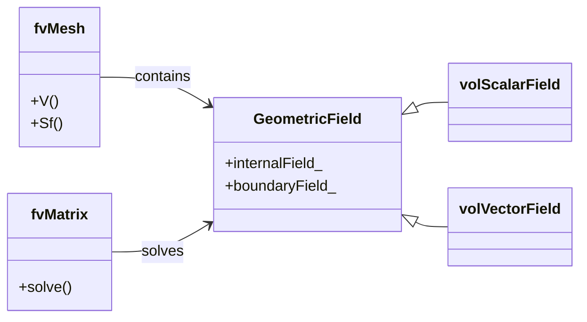

---
tags:
  - openfoam
  - cfd
  - hardcore
  - day-01
date: 2026-01-01
aliases:
  - Governing Equations
difficulty: hardcore
topic: Governing Equations
---

# Governing Equations
## HARDCORE Level - 2026-01-01

---

## วัตถุประสงค์การเรียนรู้ (Learning Objectives)
- **Understanding**: เข้าใจที่มาและความหมายทางฟิสิกส์ของสมการ Navier-Stokes และสมการพลังงาน
- **Architecture**: เข้าใจโครงสร้างคลาสหลักของ OpenFOAM (`GeometricField`, `fvMatrix`, `fvMesh`) และการจัดเก็บหน่วยความจำ
- **Implementation**: สามารถวิเคราะห์และแก้ไขไฟล์ Solver พื้นฐาน (`UEqn.H`, `pEqn.H`) ได้
- **Configuration**: สามารถเลือกและปรับแต่ง `fvSchemes` และ `fvSolution` ให้เหมาะสมกับปัญหา
- **Application**: สามารถเขียน Custom Source Term และ Discretization Scheme ได้

---

## สารบัญ (Table of Contents)
- [[#1. ทฤษฎี: สมการหลักและฟิสิกส์ (Theory: Core Equations & Physics)|1. ทฤษฎี: สมการหลักและฟิสิกส์]]
- [[#2. โครงสร้างคลาสและการนำไปใช้ (OpenFOAM Class Hierarchy & Implementation)|2. โครงสร้างคลาสและการนำไปใช้]]
- [[#3. การไล่โค้ด (Code Walkthrough)|3. การไล่โค้ด]]
- [[#4. การวิเคราะห์ Dictionary และการตั้งค่า (Dictionary Analysis & Configuration)|4. การวิเคราะห์ Dictionary และการตั้งค่า]]
- [[#5. ภาคปฏิบัติ: งานเขียนโค้ด (Hands-on: Practical Tasks & Coding)|5. ภาคปฏิบัติ: งานเขียนโค้ด]]
- [[#6. ทดสอบความเข้าใจ (Concept Checks)|6. ทดสอบความเข้าใจ]]

---

## 1. ทฤษฎี: สมการหลักและฟิสิกส์ (Theory: Core Equations & Physics)

### 1.1 ภาพรวมกฎการอนุรักษ์ (Conservation Laws Overview)

> [!INFO] หลักการพื้นฐาน (Fundamental Principle)
> การไหลของของไหลถูกควบคุมโดยกฎการอนุรักษ์มวล โมเมนตัม และพลังงาน กฎเหล่านี้เป็นรากฐานของการจำลองพลศาสตร์ของไหลเชิงคำนวณ (CFD) ใน OpenFOAM

สมการควบคุมอธิบายว่าคุณสมบัติของของไหลเปลี่ยนแปลงไปอย่างไรในอวกาศและเวลา:

| สมการ (Equation) | ปริมาณทางฟิสิกส์ (Physical Quantity) | คุณสมบัติที่อนุรักษ์ (Conserved Property) |
|----------|-------------------|-------------------|
| Continuity | มวล (Mass) | มวลไม่สามารถสร้างขึ้นหรือทำลายได้ |
| Momentum | กฎข้อที่ 2 ของนิวตัน | การเปลี่ยนแปลงโมเมนตัม = แรงลัพธ์ |
| Energy | กฎข้อที่ 1 ของอุณหพลศาสตร์ | การอนุรักษ์พลังงาน |

---

### 1.2 สมการความต่อเนื่อง (Continuity Equation - Mass Conservation)

$$\frac{\partial \rho}{\partial t} + \nabla \cdot (\rho \mathbf{U}) = 0$$

**คำศัพท์สำคัญ:**
- $\rho$ (rho): ความหนาแน่นของของไหล [kg/m³]
- $\mathbf{U}$: เวกเตอร์ความเร็ว [m/s]
- $t$: เวลา [s]
- $\nabla \cdot$: ตัวดำเนินการ Divergence (การลู่ออก)

> [!TIP] การไหลแบบอัดตัวไม่ได้ (Incompressible Flow)
> สำหรับการไหลแบบอัดตัวไม่ได้ (ความหนาแน่นคงที่) สมการจะลดรูปเหลือ:
> $$
\nabla \cdot \mathbf{U} = 0
$$

---

### 1.3 สมการโมเมนตัม (Momentum Equation - Newton's Second Law)

$$\frac{\partial (\rho \mathbf{U})}{\partial t} + \nabla \cdot (\rho \mathbf{U} \mathbf{U}) = -\nabla p + \nabla \cdot \boldsymbol{\tau} + \rho \mathbf{g}$$

**คำศัพท์สำคัญ:**

| เทอม (Term) | ความหมายทางฟิสิกส์ (Physical Meaning) | คำอธิบาย (Description) |
|------|------------------|-------------|
| $\frac{\partial (\rho \mathbf{U})}{\partial t}$ | Unsteady term | อัตราการเปลี่ยนแปลงของโมเมนตัมเทียบกับเวลา |
| $\nabla \cdot (\rho \mathbf{U} \mathbf{U})$ | Convection term | การขนส่งโมเมนตัมเนื่องจากการเคลื่อนที่ของของไหล |
| $-\nabla p$ | Pressure gradient | แรงเนื่องจากความแตกต่างของความดัน |
| $\nabla \cdot \boldsymbol{\tau}$ | Viscous stress | แรงเสียดทาน/การแพร่ (Diffusion forces) |
| $\rho \mathbf{g}$ | Body force | แรงโน้มถ่วงหรือแรงภายนอกอื่นๆ |

> [!WARNING] ความไม่เป็นเชิงเส้น (Nonlinearity)
> พจน์การพา (Convection term) $\nabla \cdot (\rho \mathbf{U} \mathbf{U})$ ทำให้สมการเป็นแบบไม่เชิงเส้น (Nonlinear) และยากต่อการแก้ด้วยวิธีเชิงตัวเลข นี่คือเหตุผลที่ CFD ต้องใช้วิธีการทำซ้ำ (Iterative methods)

---

### 1.4 เทนเซอร์ความเค้นสำหรับของไหลนิวโตเนียน (Stress Tensor for Newtonian Fluids)

สำหรับของไหลแบบนิวโตเนียน (Newtonian fluids) เทนเซอร์ความเค้น $\boldsymbol{\tau}$ คือ:

$$\boldsymbol{\tau} = \mu \left[ \nabla \mathbf{U} + (\nabla \mathbf{U})^T \right] - \frac{2}{3}\mu (\nabla \cdot \mathbf{U})\mathbf{I}$$

**คำศัพท์สำคัญ:**
- $\mu$ (mu): ความหนืดพลวัต (Dynamic viscosity) [Pa·s]
- $\mathbf{I}$: เทนเซอร์เอกลักษณ์ (Identity tensor)
- $\nabla \mathbf{U}$: เทนเซอร์เกรเดียนต์ความเร็ว (Velocity gradient tensor)

> [!INFO] การลดรูปสำหรับของไหลอัดตัวไม่ได้ (Incompressible Simplification)
> สำหรับการไหลแบบอัดตัวไม่ได้ ($\nabla \cdot \mathbf{U} = 0$):
> $$
\nabla \cdot \boldsymbol{\tau} = \mu \nabla^2 \mathbf{U}
$$
> (เทอมความหนืดจะเหลือเพียง Laplacian ของความเร็ว)

---

### 1.5 สมการพลังงาน (Energy Equation)

$$\frac{\partial (\rho h)}{\partial t} + \nabla \cdot (\rho \mathbf{U} h) = \frac{Dp}{Dt} + \nabla \cdot (k \nabla T) + \boldsymbol{\tau} : \nabla \mathbf{U} + S_h$$

**คำศัพท์สำคัญ:**

| สัญลักษณ์ | ความหมาย | หน่วย |
|--------|---------|------|
| $h$ | เอนทาลปีจำเพาะ (Specific enthalpy) | [J/kg] |
| $k$ | ค่าการนำความร้อน (Thermal conductivity) | [W/(m·K)] |
| $T$ | อุณหภูมิ (Temperature) | [K] |
| $S_h$ | แหล่งกำเนิดความร้อน (Heat source term) | [W/m³] |
| $\frac{Dp}{Dt}$ | Material derivative of pressure | [Pa/s] |

---

### 1.6 สรุปสมการ Navier-Stokes (Navier-Stokes Equations Summary)

เมื่อรวมการอนุรักษ์มวลและโมเมนตัมสำหรับการไหลแบบอัดตัวไม่ได้:

$$ 
\begin{aligned} 
\nabla \cdot \mathbf{U} &= 0 \ 
\frac{\partial \mathbf{U}}{\partial t} + (\mathbf{U} \cdot \nabla)\mathbf{U} &= -\frac{1}{\rho}\nabla p + \nu \nabla^2 \mathbf{U} + \mathbf{g} 
\end{aligned} 
$$

โดยที่ $\nu = \mu/\rho$ คือความหนืดจลน์ (Kinematic viscosity) [m²/s]

> [!TIP] การนำไปใช้ใน OpenFOAM (OpenFOAM Implementation)
> ใน OpenFOAM สมการเหล่านี้ถูกแก้โดยใช้ Finite Volume Method โดยมีคลาสสำคัญคือ:
> - `fvVectorMatrix` สำหรับโมเมนตัม
> - `fvScalarMatrix` สำหรับความดันและความต่อเนื่อง
> - `fvm::ddt`, `fvm::div`, `fvm::laplacian` สำหรับการ Discretization

---

### 1.7 ตัวเลขไร้มิติ (Dimensionless Numbers)

| Number | สูตร (Formula) | ความสำคัญทางฟิสิกส์ (Physical Significance) |
|--------|---------|----------------------|
| Reynolds | $Re = \frac{\rho U L}{\mu}$ | อัตราส่วนระหว่างแรงเฉื่อยต่อแรงหนืด (Inertia vs Viscous) |
| Mach | $Ma = \frac{U}{c}$ | ความเร็วการไหลต่อความเร็วเสียง (Compressibility) |
| Prandtl | $Pr = \frac{c_p \mu}{k}$ | การแพร่โมเมนตัมต่อการแพร่ความร้อน |

> [!INFO] การตีความ Reynolds Number
> - $Re \ll 1$: การไหลแบบคืบคลาน (Stokes flow) - แรงหนืดเด่น
> - $Re \gg 1$: การไหลแบบปั่นป่วน (Turbulent flow) - แรงเฉื่อยเด่น (ต้องใช้ Turbulence Model)

> [!SUCCESS] สรุป (Summary)
> ส่วนนี้ครอบคลุมสมการพื้นฐานที่ใช้ใน OpenFOAM ได้แก่สมการความต่อเนื่อง โมเมนตัม และพลังงาน รวมถึงความสัมพันธ์ของเทนเซอร์ความเค้น และตัวเลขไร้มิติที่สำคัญ

---

## 2. โครงสร้างคลาสและการนำไปใช้ (OpenFOAM Class Hierarchy & Implementation)

### 2.1 คลาสสมการหลัก (Core Equation Classes)

OpenFOAM ใช้คลาสแม่แบบ (Template Classes) ในการจัดการสมการควบคุม ซึ่งทำหน้าที่ดูแลการดำเนินการกับฟิลด์ (Field operations), การดิสครีไทซ์ (Discretization), และการประกอบเมทริกซ์ (Matrix Assembly)



### 2.2 คลาสฟิลด์ (Field Classes)

#### 2.2.1 GeometricField

คลาสพื้นฐานสำหรับการจัดเก็บและจัดการข้อมูลฟิลด์ (Field data)

**การจัดเก็บหน่วยความจำ (Memory Layout):**
- **Internal field**: เก็บข้อมูลแบบต่อเนื่อง (Contiguous array) เพื่อประสิทธิภาพของ Cache
- **Boundary field**: เก็บแยกตาม Patch

> [!TIP] ประเภทฟิลด์ที่พบบ่อย (Common Field Types)
> - `volScalarField`: สเกลาร์ที่ศูนย์กลางเซลล์ (p, T)
> - `volVectorField`: เวกเตอร์ที่ศูนย์กลางเซลล์ (U)
> - `surfaceScalarField`: สเกลาร์ที่หน้าเซลล์ (phi)

#### 2.2.2 ตัวอย่างการสร้างฟิลด์ (Field Creation Example)

```cpp
volVectorField U
(
    IOobject("U", runTime.timeName(), mesh, IOobject::MUST_READ, IOobject::AUTO_WRITE),
    mesh
);
```

### 2.3 คลาสเมทริกซ์ (Finite Volume Matrix Classes)

**`fvMatrix`** สืบทอดมาจาก `lduMatrix` และจัดเก็บระบบเมทริกซ์แบบ Sparse (LDU format):
- เก็บเฉพาะสัมประสิทธิ์ที่ไม่เป็นศูนย์
- ประหยัดหน่วยความจำเมื่อเทียบกับ Dense matrix

### 2.4 สคีมการดิสครีไทซ์ (Discretization Schemes)

**fvm vs fvc:**
- **`fvm::` (Implicit)**: สร้างเมทริกซ์ (LHS) เสถียรกว่า
- **`fvc::` (Explicit)**: คำนวณค่า (RHS) เร็วกว่า

### 2.5 คลาสเงื่อนไขขอบเขต (Boundary Condition Classes)

- **Fixed value**: Dirichlet (กำหนดค่าคงที่)
- **Zero gradient**: Neumann (กำหนดเกรเดียนต์เป็นศูนย์)
- **Mixed**: Robin (ผสม)

### 2.6 คลาสเมช (Mesh Classes)

**`fvMesh`**:
- **C()**: จุดศูนย์กลางเซลล์
- **Sf()**: เวกเตอร์พื้นที่หน้า
- **V()**: ปริมาตรเซลล์

> [!SUCCESS] สรุป (Summary)
> ส่วนนี้เจาะลึกโครงสร้างคลาสหลักของ OpenFOAM ตั้งแต่ `GeometricField`, `fvMatrix` ไปจนถึง `fvMesh` การเข้าใจโครงสร้างเหล่านี้ช่วยให้เห็นภาพการแปลงสมการฟิสิกส์เป็นโค้ด C++

---

## 3. การไล่โค้ด (Code Walkthrough)

### 3.1 UEqn.H

ไฟล์ `UEqn.H` สร้างเมทริกซ์สมการโมเมนตัม:

```cpp
tmp<fvVectorMatrix> UEqn
(
    fvm::ddt(U)                 // Unsteady
  + fvm::div(phi, U)           // Convection
  + fvm::laplacian(nu, U)      // Diffusion
 ==
    fvOptions(U)                // Sources
);
```

### 3.2 pEqn.H

ไฟล์ `pEqn.H` สร้างและแก้สมการความดัน (Pressure Poisson Equation) เพื่อบังคับกฎการอนุรักษ์มวล:

```cpp
volScalarField rAU(1.0/UEqn().A());
fvScalarMatrix pEqn
(
    fvm::laplacian(rAU, p) == fvc::div(phiHbyA)
);
pEqn.solve();
```

### 3.3 createFields.H

ไฟล์ `createFields.H` เริ่มต้นฟิลด์ต่างๆ (`p`, `U`, `phi`) และอ่านคุณสมบัติการขนส่ง (`transportProperties`)

---

## 4. การวิเคราะห์ Dictionary และการตั้งค่า (Dictionary Analysis & Configuration)

### 4.1 fvSchemes

ควบคุมวิธีการแปลงสมการ (Discretization):
- **ddtSchemes**: `Euler` (1st order), `backward` (2nd order)
- **divSchemes**: `Gauss upwind` (Stable), `Gauss limitedLinear` (Accurate)
- **laplacianSchemes**: `Gauss linear corrected` (Standard)

### 4.2 fvSolution

ควบคุม Solver และ Tolerances:
- **Solvers**: `GAMG` (Pressure), `PBiCGStab` (Velocity/Turbulence)
- **Tolerances**: `1e-6` (Tight), `1e-5` (Standard)
- **Algorithms**: `SIMPLE` (Steady), `PISO` (Transient), `PIMPLE` (Hybrid)

---

## 5. ภาคปฏิบัติ: งานเขียนโค้ด (Hands-on: Practical Tasks & Coding)

### งานที่ 1: Custom Momentum Source

เพิ่มแรงจากการหมุน (Rotational Body Force):

```cpp
void addRotationalSource(fvVectorMatrix& UEqn, const volVectorField& U, ...)
{
    // Calculate U_rot = omega x r
    // Add source: S = rho * (U_rot - U)
    UEqn += sourceCoeff * (U_rot - U);
}
```

### งานที่ 2: Blended Convection Scheme

สร้าง Scheme ที่ผสมระหว่าง Upwind และ Central ตามค่า Courant number:
- **Low Co**: ใช้ Central (แม่นยำ)
- **High Co**: ใช้ Upwind (เสถียร)

### งานที่ 3: Viscous Dissipation

เพิ่มเทอมการสลายพลังงานเหนียวในสมการพลังงาน:
- $\Phi_v = \boldsymbol{\tau} : \nabla \mathbf{U}$
- สำคัญสำหรับของไหลที่มีความหนืดสูง

---

## 6. ทดสอบความเข้าใจ (Concept Checks)

### คำถามที่ 1: การลดรูปสมการความต่อเนื่อง
สำหรับการไหลแบบอัดตัวไม่ได้ สมการความต่อเนื่องลดรูปเหลืออะไร?
> [!SUCCESS] เฉลย
> $\nabla \cdot \mathbf{U} = 0$

### คำถามที่ 2: ความไม่เป็นเชิงเส้น
เทอมใดในสมการโมเมนตัมที่ทำให้เกิดความไม่เป็นเชิงเส้น?
> [!SUCCESS] เฉลย
> เทอมการพา (Convection term): $\nabla \cdot (\rho \mathbf{U} \mathbf{U})$

### คำถามที่ 3: fvm vs fvc
ความแตกต่างหลักคืออะไร?
> [!SUCCESS] เฉลย
> `fvm` เป็น Implicit (สร้าง Matrix) ส่วน `fvc` เป็น Explicit (สร้าง Field)

### คำถามที่ 4: ทำไมต้องมี Pressure-Velocity Coupling?
> [!SUCCESS] เฉลย
> เพราะสมการความต่อเนื่องไม่มีเทอมความดัน จึงต้องใช้สมการโมเมนตัมและข้อบังคับความต่อเนื่องมาสร้างสมการ Poisson เพื่อหาความดันที่ทำให้สนามความเร็วอนุรักษ์มวล

---

> [!SUCCESS] บทสรุปประจำวัน (Daily Summary)
> วันนี้เราได้ปูพื้นฐานสมการควบคุมหลัก (Navier-Stokes) และวิธีการที่ OpenFOAM แปลงสมการเหล่านี้เป็นโครงสร้างข้อมูล C++ (`fvMatrix`, `GeometricField`) การเข้าใจที่มาของสมการและการตั้งค่า `fvSchemes`/`fvSolution` เป็นก้าวแรกที่สำคัญสู่การเป็นผู้เชี่ยวชาญ OpenFOAM

```