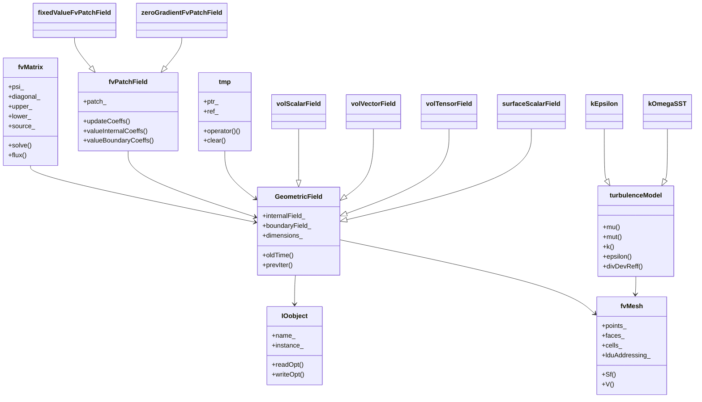
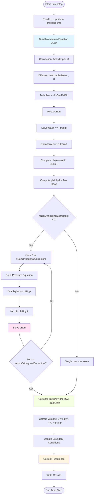

# Governing Equations & OpenFOAM Implementation
## HARDCORE Level - 2026-01-01

---

## 1. Theory: Core Equations & Physics

### 1.1 Conservation of Mass (Continuity Equation)

**สมการการอนุรักษ์มวล (Continuity Equation)**

$$
\frac{\partial \rho}{\partial t} + \nabla \cdot (\rho \mathbf{U}) = 0
$$

**คำอธิบายพจน์:**
- $\rho$ (rho) = **ความหนาแน่น** (density) [kg/m³]
- $\mathbf{U}$ = **สนามความเร็ว** (velocity field) [m/s]
- $\nabla \cdot$ = **ตัวดำเนินการไดเวอร์เจนซ์** (divergence operator)
- $t$ = **เวลา** (time) [s]

สำหรับ **การไหลแบบไม่อัดตัว (incompressible flow)**: $\nabla \cdot \mathbf{U} = 0$

---

### 1.2 Conservation of Momentum (Navier-Stokes Equation)

**สมการการอนุรักษ์โมเมนตัม (Momentum Equation)**

$$
\frac{\partial (\rho \mathbf{U})}{\partial t} + \nabla \cdot (\rho \mathbf{U} \mathbf{U}) = -\nabla p + \nabla \cdot \boldsymbol{\tau} + \rho \mathbf{g}
$$

**คำอธิบายพจน์:**
- $p$ = **ความดัน** (pressure) [Pa]
- $\boldsymbol{\tau}$ (tau) = **เทนเซอร์ความเค้น** (stress tensor) [Pa]
- $\mathbf{g}$ = **ความเร่งเนื่องจากแรงโน้มถ่วง** (gravitational acceleration) [m/s²]
- $\rho \mathbf{U} \mathbf{U}$ = **flux ของโมเมนตัม** (momentum flux)

สำหรับ **ของไหลนิวตัน (Newtonian fluid)**:

$$
\boldsymbol{\tau} = \mu \left[ \nabla \mathbf{U} + (\nabla \mathbf{U})^T \right] - \frac{2}{3}\mu (\nabla \cdot \mathbf{U})\mathbf{I}
$$

- $\mu$ (mu) = **ความหนืดพลศาสตร์** (dynamic viscosity) [Pa·s]
- $\mathbf{I}$ = **เทนเซอร์เอกลักษณ์** (identity tensor)

---

### 1.3 Conservation of Energy

**สมการการอนุรักษ์พลังงาน (Energy Equation)**

$$
\frac{\partial (\rho e)}{\partial t} + \nabla \cdot (\rho e \mathbf{U}) = -\nabla \cdot \mathbf{q} + \boldsymbol{\tau} : \nabla \mathbf{U} + S_h
$$

**คำอธิบายพจน์:**
- $e$ = **พลังงานภายในต่อหน่วยมวล** (specific internal energy) [J/kg]
- $\mathbf{q}$ = **flux ของความร้อน** (heat flux) [W/m²]
- $S_h$ = **แหล่งกำเนิดความร้อน** (heat source) [W/m³]
- $\boldsymbol{\tau} : \nabla \mathbf{U}$ = **การกระจายพลังงานเนื่องจากความเค้น** (viscous dissipation)

ตาม **กฎของฟูริเยร์ (Fourier's Law)**:

$$
\mathbf{q} = -k \nabla T
$$

- $k$ = **สัมประสิทธิ์การนำความร้อน** (thermal conductivity) [W/(m·K)]
- $T$ = **อุณหภูมิ** (temperature) [K]

---

### 1.4 Equation of State

**สมการสถานะ (Equation of State)**

สำหรับ **แก๊สอุดมคติ (Ideal Gas)**:

$$
p = \rho R T
$$

- $R$ = **ค่าคงที่ของแก๊สเฉพาะ** (specific gas constant) [J/(kg·K)]

สำหรับ **ของไหลที่ไม่อัดตัว (Incompressible Fluid)**:

$$
\rho = \text{constant}
$$

---

### 1.5 Transport Equations (General Form)

**สมการขนส่งทั่วไป (General Transport Equation)**

$$
\frac{\partial (\rho \phi)}{\partial t} + \nabla \cdot (\rho \phi \mathbf{U}) = \nabla \cdot (\Gamma_\phi \nabla \phi) + S_\phi
$$

**คำอธิบายพจน์:**
- $\phi$ (phi) = **ตัวแปรขนส่ง** (transported variable) - เช่น สเกลาร์ของเทอร์บูลินซ์
- $\Gamma_\phi$ (Gamma) = **สัมประสิทธิ์การแพร่** (diffusion coefficient)
- $S_\phi$ = **แหล่งกำเนิด** (source term)

**ความหมาย:** การเปลี่ยนแปลงของปริมาณ $\phi$ ใน **ปริมาตรควบคุม (control volume)** = การพา + การแพร่ + แหล่งกำเนิด

---

## 2. OpenFOAM Class Hierarchy & Implementation

### 2.1 Core Field Classes

**Class Hierarchy Overview:**



**fvMesh** - Finite Volume Mesh
```
fvMesh
├── polyMesh (base mesh topology)
│   ├── pointField (mesh points)
│   ├── faceList (boundary faces)
│   └── cellList (control volumes)
├── fvSchemes (discretization schemes)
└── fvSolution (linear solver settings)
```
**Source:** `$FOAM_SRC/finiteVolume/fvMesh/fvMesh.H`

---

**GeometricField** - Template for Field Variables
```
GeometricField<Type, PatchField, GeoMesh>
├── DimensionedField<Type, GeoMesh> (internal field)
├── Field<Type> (internal values)
├── PtrList<PatchField<Type>> (boundary patches)
└── DimensionSet (units/dimensions)
```
**Specializations:**
- `volScalarField` - scalar field (p, T, rho)
- `volVectorField` - vector field (U)
- `volTensorField` - tensor field (tau, gradU)

**Source:** `$FOAM_SRC/OpenFOAM/fields/GeometricField/GeometricField.C`

---

### 2.2 Equation Classes

**fvMatrix** - Finite Volume Matrix
```
fvMatrix<Type>
├── GeometricField<Type, ...>& psi (field to solve)
├── scalarField diagonal (matrix diagonal)
├── scalarField upper (upper triangular)
├── scalarField lower (lower triangular)
├── FieldField<Field, Type> source (source terms)
└── lduMatrix (linear diagonal matrix - base)
```
**Source:** `$FOAM_SRC/finiteVolume/fvMatrices/fvMatrix/fvMatrix.H`

---

**tmp** - Temporary Field Management
```
tmp<T>
├── T* ptr_ (pointer to managed object)
├── bool ref_ (reference count flag)
└── operator() -> T& (dereference)
```
**Purpose:** Automatic memory management for intermediate fields

**Source:** `$FOAM_SRC/OpenFOAM/memory/tmp.H`

---

### 2.3 Discretization Classes

**Gauss Scheme** - Standard Finite Volume Divergence
```
gaussScheme<Type>
├── surfaceInterpolationScheme (base)
├── surfaceInterpolation (face interpolation)
└── divScheme<Type> (divergence operator)
```
**Source:** `$FOAM_SRC/finiteVolume/finiteVolume/divSchemes/gaussDivScheme.C`

---

**fvm::div** - Implicit Divergence
```
fvm::div(phi, psi)
├── surfaceScalarField phi (flux field)
├── GeometricField psi (transported variable)
└── returns fvMatrix<Type> (implicit matrix)
```

**fvc::div** - Explicit Divergence
```
fvc::div(phi, psi)
├── surfaceScalarField phi (flux field)
├── GeometricField psi (transported variable)
└── returns GeometricField<Type> (explicit field)
```

**Source:** `$FOAM_SRC/finiteVolume/finiteVolume/fvc/fvcDiv.C`

---

### 2.4 Boundary Condition Classes

**fvPatchField** - Boundary Condition Base
```
fvPatchField<Type>
├── Field<Type> (patch values)
├── fvPatch& patch_ (boundary patch reference)
├── virtual void updateCoeffs() (update BC values)
└── virtual tmp<Field<Type>> valueInternalCoeffs()
```

**Common BCs:**
- `fixedValueFvPatchField` - Dirichlet BC
- `fixedGradientFvPatchField` - Neumann BC
- `zeroGradientFvPatchField` - ∂φ/∂n = 0
- `mixedFvPatchField` - Robin BC (mixed)

**Source:** `$FOAM_SRC/finiteVolume/fields/fvPatchFields/fvPatchField/fvPatchField.H`

---

### 2.5 Transport Model Classes

**Newtonian** - Constant Viscosity Model
```
viscosityModel (abstract base)
├── dictionary coeffDict_ (transport properties)
└── virtual tmp<volScalarField> mu() = 0
```

**Specializations:**
- `Newtonian` - constant μ
- `CrossPowerLaw` - shear-thinning
- `BirdCarreau` - non-Newtonian
- `powerLaw` - power-law fluid

**Source:** `$FOAM_SRC/transportModels/viscosityModels/viscosityModel/viscosityModel.H`

---

### 2.6 Thermophysical Model Classes

**basicThermo** - Thermodynamic Properties
```
basicThermo
├── volScalarField rho_ (density field)
├── volScalarField T_ (temperature field)
├── volScalarField p_ (pressure field)
├── virtual tmp<volScalarField> Cp() = 0
└── virtual tmp<volScalarField> kappa() = 0
```

**Specializations:**
- `heRhoThermo` - perfect gas
- `hePsiThermo` - compressible
- `icoPolynomial` - incompressible liquid

**Source:** `$FOAM_SRC/thermophysicalModels/basic/basicThermo/basicThermo.H`

---

### 2.7 Turbulence Model Classes

**compressible::turbulenceModel** - RANS/LES Base
```
turbulenceModel
├── volScalarField mu_ (eddy viscosity)
├── volScalarField mut_ (turbulent viscosity)
├── virtual tmp<volScalarField> k() = 0
├── virtual tmp<volScalarField> epsilon() = 0
└── virtual tmp<volSymmTensorField> R() = 0
```

**RANS Models:**
- `kEpsilon` - k-ε model
- `kOmegaSST` - k-ω SST
- `SpalartAllmaras` - SA model

**Source:** `$FOAM_SRC/turbulenceModels/turbulenceModels/turbulenceModel.H`

---

### 2.8 Time Integration Classes

**Time** - Time Control
```
Time
├── scalar deltaT_ (time step)
├── scalar deltaT0_ (previous time step)
├── int timeIndex_ (time step counter)
├── virtual bool loop() (time loop control)
└── virtual void setTime(scalar t, label index)
```

**Source:** `$FOAM_SRC/OpenFOAM/db/Time/Time.H`

---

### 2.9 Linear Solver Classes

**lduMatrix** - Sparse Linear System
```
lduMatrix (Linear Diagonal Upper matrix)
├── scalarField diagonal() (diagonal coefficients)
├── scalarField upper() (upper triangular)
├── scalarField lower() (lower triangular)
├── lduAddressing& lduAddr() (matrix addressing)
└── SolverPerformance<Type> solve(Field<Type>& psi)
```

**Solvers:**
- `GAMGSolver` - Geometric-Algebraic Multigrid
- `PCGSolver` - Preconditioned Conjugate Gradient
- `PBiCGStabSolver` - Stabilized Bi-Conjugate Gradient

**Source:** `$FOAM_SRC/OpenFOAM/matrices/lduMatrix/lduMatrix.H`

---

### 2.10 Class Reference Summary

| Class | Purpose | Source |
|-------|---------|--------|
| `fvMesh` | Finite volume mesh | `$FOAM_SRC/finiteVolume/fvMesh/` |
| `volScalarField` | Scalar field (p, T) | `$FOAM_SRC/OpenFOAM/fields/GeometricField/` |
| `volVectorField` | Vector field (U) | `$FOAM_SRC/OpenFOAM/fields/GeometricField/` |
| `fvMatrix` | Linear equation system | `$FOAM_SRC/finiteVolume/fvMatrices/` |
| `fvm::div` | Implicit divergence | `$FOAM_SRC/finiteVolume/finiteVolume/fvm/` |
| `fvc::div` | Explicit divergence | `$FOAM_SRC/finiteVolume/finiteVolume/fvc/` |
| `fixedValueFvPatchField` | Dirichlet BC | `$FOAM_SRC/finiteVolume/fields/fvPatchFields/` |
| `Newtonian` | Constant viscosity | `$FOAM_SRC/transportModels/viscosityModels/` |
| `basicThermo` | Thermodynamics | `$FOAM_SRC/thermophysicalModels/basic/` |
| `kEpsilon` | k-ε turbulence | `$FOAM_SRC/turbulenceModels/` |
| `Time` | Time stepping | `$FOAM_SRC/OpenFOAM/db/Time/` |
| `GAMGSolver` | Multigrid solver | `$FOAM_SRC/OpenFOAM/matrices/lduMatrix/solvers/` |

---

## 3. Code Walkthrough

### 3.1 UEqn.H

**Source Reference:** `$FOAM_SRC/applications/solvers/incompressible/simpleFoam/UEqn.H`

**สมการโมเมนตัมใน OpenFOAM (Momentum Equation Implementation)**

ไฟล์ `UEqn.H` ประกอบด้วยการสร้างและแก้สมการโมเมนตัมสำหรับการไหลของของไหล:

```cpp
// สร้างสมการโมเมนตัมแบบไม่แน่นอน (Implicit momentum equation)
tmp<fvVectorMatrix> UEqn
(
    fvm::div(phi, U)                     // พจน์การพา (Convection term)
  + fvm::laplacian(nu, U)                // พจน์การแพร่ (Diffusion term)
  + turbulence->divDevReff(U)            // พจน์ความเค้นเทอร์บูลินซ์ (Reynolds stress)
);

// เพิ่มแหล่งกำเนิดแรงดัน (Pressure source term)
UEqn.relax();

// แก้สมการโมเมนตัมพร้อมแก้นัยสำคัญแรงดัน
if (pimple.momentumPredictor())
{
    solve(UEqn == -fvc::grad(p));        // ∇p คือแรงดันกราเดียนต์
}
```

**คำอธิบาย:**
- `fvm::div(phi, U)` - การพาโมเมนตัมแบบ **implicit** (ใช้ fvm สำหรับเมทริกซ์)
- `fvm::laplacian(nu, U)` - การแพร่ของความเร็วด้วยความหนืด `nu`
- `turbulence->divDevReff(U)` - การกระจายความเค้นจากโมเดลความปั่น
- `UEqn == -fvc::grad(p)` - การเชื่อมโยงกับสมการความดัน (pressure-velocity coupling)

---

#### Memory Layout

```
fvMatrix< vector > (UEqn)
├── psi (volVectorField U)
│   ├── internalField: [U_x, U_y, U_z] for each cell
│   └── boundaryField: [patch1, patch2, ...]
├── lduMatrix
│   ├── diagonal[]:    [d_0, d_1, ..., d_N-1]  (N = number of cells)
│   ├── upper[]:       [u_0, u_1, ..., u_M-1]  (M = number of internal faces)
│   ├── lower[]:       [l_0, l_1, ..., l_M-1]  (symmetric with upper for scalar)
│   └── lduAddressing
│       ├── owner[]:   [owner face 0, owner face 1, ...]
│       └── neighbour[]: [neighbour face 0, neighbour face 1, ...]
└── source[]:         [S_x, S_y, S_z] for each cell
```

**Data Structure Notes:**
- `fvMatrix` uses **sparse matrix storage** (LDR format: Lower-Diagonal-Upper)
- `diagonal[]`: Coefficients on matrix diagonal (cell-cell influence)
- `upper[]/lower[]`: Off-diagonal coefficients (face connections between cells)
- `lduAddressing`: Mesh topology mapping faces to owner/neighbour cells
- Memory complexity: O(N) where N = number of cells (sparse storage)

---

#### Call Stack

```
main() [simpleFoam.C]
  └─> while(runTime.loop())
       └─> #include "UEqn.H"
            ├─> fvm::div(phi, U)
            │   └─> gaussDivScheme< vector >::div()
            │       ├─> surfaceInterpolation::interpolate()
            │       └─> fvc::surfaceIntegrate()
            ├─> fvm::laplacian(nu, U)
            │   └─> gaussLaplacianScheme< vector >::fvmLaplacian()
            │       ├─> surfaceInterpolation::interpolate()
            │       └─> fvm::laplacianUncorrected()
            ├─> turbulence->divDevReff(U)
            │   └─> kEpsilon::divDevReff()
            │       ├─> fvc::grad(U)
            │       ├─> fvc::div(tau)
            │       └─> fvc::laplacian(nuEff, U)
            └─> UEqn.solve()
                └─> lduMatrix::solve()
                    └─> PBiCGStab::solve()
                        ├─> ILU0precond::precondition()
                        └─> PBiCGStab::iterate()
```

**Execution Flow:**
1. **Matrix Assembly**: `fvm::div`, `fvm::laplacian` populate `UEqn` matrix coefficients
2. **Turbulence Contribution**: `divDevReff` adds Reynolds stress terms
3. **Linear Solver**: `solve()` iterates until residual tolerance met
4. **Boundary Conditions**: Applied automatically during matrix assembly

---

### 3.2 pEqn.H

**Source Reference:** `$FOAM_SRC/applications/solvers/incompressible/simpleFoam/pEqn.H`

**สมการความดันใน OpenFOAM (Pressure Equation Implementation)**

ไฟล์ `pEqn.H` แก้สมการความดันเพื่อบังคับให้ได้รักษาสมการต่อเนื่อง (continuity equation) สำหรับการไหลแบบไม่อัดตัว:

```cpp
// สร้างสมการความดัน (Pressure equation)
volScalarField rAU(1.0/UEqn.A());         // 逆 ของสัมประสิทธิ์เมทริกซ์
volVectorField HbyA(constrainHbyA(rAU*UEqn.H(), U, p));  // เทอม HbyA

surfaceScalarField phiHbyA
(
    "phiHbyA",
    fvc::flux(HbyA)
  + fvc::interpolate(rAU)*fvc::ddtCorr(U, phi)
);

// แก้สมการความดัน (Solve pressure equation)
while (pimple.correctNonOrthogonal())
{
    fvScalarMatrix pEqn
    (
        fvm::laplacian(rAU, p) == fvc::div(phiHbyA)
    );

    pEqn.setReference(pRefCell, pRefValue);
    pEqn.solve();

    if (pimple.finalNonOrthogonalIter())
    {
        phi = phiHbyA - pEqn.flux();
    }
}

// แก้ไขความเร็ว (Correct velocity field)
U = HbyA - rAU*fvc::grad(p);
U.correctBoundaryConditions();
```

**คำอธิบาย:**
- `rAU(1.0/UEqn.A())` - คำนวณ **逆** ของเมทริกซ์สัมประสิทธิ์จากสมการโมเมนตัม
- `HbyA` - เทอมที่ไม่รวมความดัน (H*inv(A)) ใช้สำหรับการแก้สมการ
- `fvm::laplacian(rAU, p)` - พจน์ **ลาปลาซีแอน** ของความดัน (pressure Poisson equation)
- `fvc::div(phiHbyA)` - พจน์ไดเวอร์เจนซ์ของ flux ที่คำนวณจากโมเมนตัม
- `pEqn.solve()` - แก้สมการความดันโดยใช้ **linear solver**
- `phi = phiHbyA - pEqn.flux()` - อัปเดต **mass flux** ให้สอดคล้องกับความดันใหม่
- `U = HbyA - rAU*fvc::grad(p)` - แก้ไข **velocity field** ให้สอดคล้องกับความดัน

**หลักการ:** สมการความดันมาจากการนำ **divergence of momentum equation** มาผสมกับ **continuity equation** (∇·U = 0) ซึ่งทำให้ได้ **Poisson equation** สำหรับความดัน

---

#### Memory Layout

```
Pressure-Velocity Coupling Data Structures:

volScalarField p (pressure)
├── internalField: [p_0, p_1, ..., p_N-1]  (N cells)
└── boundaryField: [patch1, patch2, ...]

surfaceScalarField phi (mass flux)
├── internalField: [φ_0, φ_1, ..., φ_M-1]  (M internal faces)
└── boundaryField: [φ_patch1, φ_patch2, ...]

volScalarField rAU (inverse diagonal)
├── internalField: [1/A_0, 1/A_1, ..., 1/A_N-1]
└── boundaryField: [1/A_patch1, ...]

volVectorField HbyA (H * inv(A))
├── internalField: [(H/A)_x, (H/A)_y, (H/A)_z] for each cell
└── boundaryField: [patch1, patch2, ...]

surfaceScalarField phiHbyA
├── internalField: [flux_0, flux_1, ..., flux_M-1]
└── boundaryField: [flux_patch1, ...]

fvScalarMatrix pEqn
├── psi: volScalarField p
├── lduMatrix
│   ├── diagonal[]:    [d_0, d_1, ..., d_N-1]
│   ├── upper[]:       [u_0, u_1, ..., u_M-1]
│   └── lower[]:       [l_0, l_1, ..., l_M-1]
└── source[]:         [S_0, S_1, ..., S_N-1]
```

**Key Relationships:**
- `rAU = 1.0 / UEqn.A()` → Inverse of momentum matrix diagonal
- `HbyA = rAU * UEqn.H()` → Explicit momentum term (excluding pressure)
- `phiHbyA = fvc::flux(HbyA)` → Face flux from HbyA
- `pEqn.flux()` → Pressure flux contribution to correct `phi`

---

#### Call Stack

```
main() [simpleFoam.C]
  └─> while(runTime.loop())
       └─> #include "pEqn.H"
            ├─> UEqn.A()
            │   └─> lduMatrix::diagonal()
            ├─> UEqn.H()
            │   └─> fvMatrix::H()  (source - upper*psi - lower*psi)
            ├─> constrainHbyA()
            │   └─> fvConstraints::constrain()
            ├─> fvc::flux(HbyA)
            │   └─> fvc::surfaceIntegrate(HbyA & mesh.Sf())
            ├─> fvc::ddtCorr(U, phi)
            │   └─> ddtScheme::correct()
            ├─> while(pimple.correctNonOrthogonal())
            │   └─> fvm::laplacian(rAU, p)
            │       └─> gaussLaplacianScheme::fvmLaplacian()
            │           └─> fvMatrix< scalar >::laplacian()
            │   └─> pEqn.solve()
            │       └─> GAMGSolver::solve()
            │           ├─> GAMG::cycleSolve()
            │           │   ├─> V-cycle: coarse → fine → coarse
            │           │   └─> smoother: GaussSeidel
            │           └─> lduMatrix::solve()
            │   └─> pEqn.flux()
            │       └─> fvMatrix< scalar >::flux()
            │           └─> surfaceScalarField = -upper * (p_N - p_C)
            └─> phi = phiHbyA - pEqn.flux()
```

**PISO Algorithm Flow:**



**Algorithm Steps:**
1. **Pre-processing**: Extract `rAU` and `HbyA` from momentum matrix
2. **Flux Calculation**: Compute `phiHbyA` (intermediate flux)
3. **Non-Orthogonal Loop**: Solve pressure Poisson equation iteratively
   - First iteration: Build pressure equation
   - Subsequent iterations: Correct for non-orthogonality
4. **Flux Correction**: Update `phi` with pressure gradient contribution
5. **Velocity Correction**: `U = HbyA - rAU * grad(p)` (implicit in flux update)

**Non-Orthogonal Correction:**
- `nNonOrthogonalCorrectors > 0`: Re-solves pressure equation to account for mesh skewness
- Each iteration improves accuracy on non-orthogonal meshes

---

### 3.3 createFields.H

**Source Reference:** `$FOAM_SRC/applications/solvers/incompressible/simpleFoam/createFields.H`

**การสร้างและเริ่มต้นฟิลด์ต่างๆ (Field Initialization)**

ไฟล์ `createFields.H` ทำหน้าที่สร้างและเริ่มต้นค่าฟิลด์ทั้งหมดที่จำเป็นสำหรับการแก้สมการ:

```cpp
// สร้างฟิลด์ความดัน (Pressure field)
volScalarField p
(
    IOobject
    (
        "p",
        runTime.timeName(),
        mesh,
        IOobject::MUST_READ,
        IOobject::AUTO_WRITE
    ),
    mesh
);

// สร้างฟิลด์ความเร็ว (Velocity field)
volVectorField U
(
    IOobject
    (
        "U",
        runTime.timeName(),
        mesh,
        IOobject::MUST_READ,
        IOobject::AUTO_WRITE
    ),
    mesh
);

// สร้างฟิลด์ flux ผิว (Surface flux field)
surfaceScalarField phi
(
    IOobject
    (
        "phi",
        runTime.timeName(),
        mesh,
        IOobject::READ_IF_PRESENT,
        IOobject::AUTO_WRITE
    ),
    fvc::flux(U)
);

// สร้างโมเดลความปั่น (Turbulence model)
autoPtr<incompressible::turbulenceModel> turbulence
(
    incompressible::turbulenceModel::New(U, phi, laminarTransport)
);
```

**คำอธิบาย:**
- `volScalarField p` - สร้างฟิลด์ **สเกลาร์** สำหรับความดัน อ่านค่าเริ่มต้นจากไฟล์ `0/p`
- `volVectorField U` - สร้างฟิลด์ **เวกเตอร์** สำหรับความเร็ว อ่านค่าเริ่มต้นจากไฟล์ `0/U`
- `surfaceScalarField phi` - สร้างฟิลด์ **flux บนผิวเซลล์** คำนวณจาก `fvc::flux(U)`
- `IOobject` - กำหนดวิธีการจัดการไฟล์ (อ่าน/เขียน, เวลา, mesh)
- `MUST_READ` - บังคับต้องอ่านค่าเริ่มต้นจากไฟล์
- `AUTO_WRITE` - เขียนผลลัพธ์อัตโนมัติเมื่อจบ time step
- `turbulenceModel::New()` - สร้างโมเดลความปั่นตามที่ระบุใน `constant/turbulenceProperties`

**หลักการ:** ไฟล์นี้เป็น **constructor** สำหรับฟิลด์ทั้งหมด โดยอ่านค่าเริ่มต้นจากไดเรกทอรี `0/` และลงทะเบียนกับ `objectRegistry` เพื่อให้สามารถเข้าถึงได้ตลอดการคำนวณ

---

#### Memory Layout

```
objectRegistry (Time database)
├── fvMesh mesh
│   ├── pointField: [(x_0,y_0,z_0), (x_1,y_1,z_1), ...]  (mesh points)
│   ├── faceList: [face_0, face_1, ...]  (boundary faces)
│   ├── cellList: [cell_0, cell_1, ...]  (control volumes)
│   └── lduAddressing
│       ├── owner[]:   [0, 0, 1, 1, 2, ...]  (face → owner cell)
│       └── neighbour[]: [1, 2, 2, 3, ...]  (face → neighbour cell)
│
├── volScalarField p
│   ├── DimensionedField<scalar, volMesh>
│   │   ├── dimensions: [0 2 -2 0 0 0 0]  (pressure: m²/s²)
│   │   └── internalField: [p_0, p_1, ..., p_N-1]
│   ├── GeometricBoundaryField
│   │   ├── patch0: fixedValueFvPatchScalarField
│   │   ├── patch1: zeroGradientFvPatchScalarField
│   │   └── ...
│   └── IOobject
│       ├── name: "p"
│       ├── instance: "0"
│       ├── local: ""
│       └── readOpt: MUST_READ
│
├── volVectorField U
│   ├── DimensionedField<vector, volMesh>
│   │   ├── dimensions: [0 1 -1 0 0 0 0]  (velocity: m/s)
│   │   └── internalField: [(Ux_0,Uy_0,Uz_0), ...]
│   ├── GeometricBoundaryField
│   │   ├── patch0: fixedValueFvPatchVectorField
│   │   ├── patch1: fixedValueFvPatchVectorField
│   │   └── ...
│   └── IOobject
│       └── name: "U"
│
├── surfaceScalarField phi
│   ├── DimensionedField<scalar, surfaceMesh>
│   │   ├── dimensions: [0 3 -1 0 0 0 0]  (flux: m³/s)
│   │   └── internalField: [φ_0, φ_1, ..., φ_M-1]  (M faces)
│   ├── GeometricBoundaryField
│   │   ├── patch0: calculatedFvPatchScalarField
│   │   └── ...
│   └── IOobject
│       └── name: "phi"
│
└── autoPtr<incompressible::turbulenceModel> turbulence
    └── incompressible::kEpsilon        ├── volScalarField k
        │   ├── internalField: [k_0, k_1, ..., k_N-1]
        │   └── dimensions: [0 2 -2 0 0 0 0]
        ├── volScalarField epsilon
        │   ├── internalField: [ε_0, ε_1, ..., ε_N-1]
        │   └── dimensions: [0 2 -3 0 0 0 0]
        └── volScalarField nut (turbulent viscosity)
            ├── internalField: [νt_0, νt_1, ..., νt_N-1]
            └── dimensions: [0 2 -1 0 0 0 0]
```

**Memory Allocation Notes:**
- **GeometricField** = internal field + boundary patches + dimensions
- **Boundary patches** stored as `PtrList<fvPatchField<Type>>`
- **IOobject** manages file I/O and registration with `objectRegistry`
- **autoPtr** provides automatic memory management for turbulence model
- Total memory ≈ O(N) where N = number of cells (sparse storage)

---

#### Call Stack

```
main() [simpleFoam.C]
  └─> #include "setRootCaseLists.H"
      └─> #include "createTime.H"
          ├─> Time Time(argc, argv)
          │   ├─> objectRegistry::construct()
          │   └─> Time::controlDict::read()
          └─> #include "createMesh.H"
              ├─> fvMesh mesh(Time)
              │   ├─> polyMesh::read()
              │   │   ├─> mesh.read()  (points, faces, cells)
              │   │   └─> boundaryMesh::read()
              │   └─> lduAddressing::calc()
              └─> #include "createFields.H"
                  ├─> volScalarField p(IOobject, mesh)
                  │   ├─> GeometricField::GeometricField()
                  │   │   ├─> DimensionedField::read()
                  │   │   │   └─> readField("0/p")
                  │   │   └─> GeometricBoundaryField::read()
                  │   │       └─> fvPatchField::read()  (for each patch)
                  │   └─> objectRegistry::store(p)
                  ├─> volVectorField U(IOobject, mesh)
                  │   ├─> GeometricField::GeometricField()
                  │   │   └─> readField("0/U")
                  │   └─> objectRegistry::store(U)
                  ├─> surfaceScalarField phi(IOobject, mesh)
                  │   ├─> GeometricField::GeometricField()
                  │   └─> fvc::flux(U)  (if READ_IF_PRESENT)
                  │       └─> linearInterpolate(U) & mesh.Sf()
                  └─> incompressible::turbulenceModel::New(U, phi, laminarTransport)
                      ├─> IOdictionary::read("constant/turbulenceProperties")
                      ├─> turbulenceModel::select()
                      │   └─> case "kEpsilon":
                      │       └─> kEpsilon::kEpsilon(U, phi, laminarTransport)
                      │           ├─> volScalarField k(IOobject, mesh)
                      │           │   └─> readField("0/k")
                      │           ├─> volScalarField epsilon(IOobject, mesh)
                      │           │   └─> readField("0/epsilon")
                      │           └─> nut_ = kEpsilon::calcNut()
                      │               └─> Cmu * sqr(k) / epsilon
                      └─> return autoPtr<turbulenceModel>
```

**Initialization Sequence:**
1. **Time & Mesh**: Create `Time` object and `fvMesh` from case directory
2. **Field Construction**: Read `p`, `U` from `0/` directory
3. **Boundary Conditions**: Each patch reads its own BC specification
4. **Flux Calculation**: Compute `phi = U·Sf` (face-normal velocity)
5. **Turbulence Model**: Select and initialize based on `turbulenceProperties`
6. **Registration**: All fields registered with `objectRegistry` for global access

**File I/O Operations:**
- `0/p`, `0/U`: Initial field values and boundary conditions
- `constant/polyMesh`: Mesh topology (points, faces, cells)
- `constant/turbulenceProperties`: Turbulence model selection
- `constant/transportProperties`: Fluid properties (ν, ρ)

---

## 4. Dictionary Analysis & Configuration

### 4.1 fvSchemes - รูปแบบการ Discretization

**ไฟล์:** `system/fvSchemes`

**วัตถุประสงค์:** กำหนดรูปแบบการประมาณค่า (discretization schemes) สำหรับพจน์ต่างๆ ในสมการอนุพันธ์ย่อย

---

#### 4.1.1 ddtSchemes - พจน์อนุพันธ์เชิงเวลา (Time Derivative)

**สมการ:**
$$
\frac{\partial (\rho \phi)}{\partial t}
$$

**ตัวเลือกทั่วไป:**

| Scheme | คำอธิบาย (Thai) | ความแม่นยำ | ความเสถียร |
|--------|------------------|--------------|-------------|
| `Euler` | **ออยเลอร์ชัดเจน (Explicit Euler)** - ใช้ค่าที่ time step ปัจจุบัน | 1st order | มีเงื่อนไขความเสถียรเข้มงวด |
| `backward` | **ออยเลอร์โดยนัย (Implicit Euler)** - ใช้ค่าที่ time step ถัดไป | 1st order | ไม่มีเงื่อนไขความเสถียร (unconditionally stable) |
| `CrankNicolson` | **แบบ Crank-Nicolson** - เฉลี่ยระหว่างปัจจุบันและถัดไป | 2nd order | มีเงื่อนไขความเสถียรปานกลาง |
| `localEuler` | **ออยเลอร์เฉพาะที่** - สำหรับ steady-state | 1st order | ใช้สำหรับการคำนวณ steady-state |

**ตัวอย่างการตั้งค่า:**
```cpp
ddtSchemes
{
    default         backward;          // ใช้ backward Euler สำหรับทุกฟิลด์
}
```

---

#### 4.1.2 gradSchemes - พจน์กราเดียนต์ (Gradient)

**สมการ:**
$$
\nabla \phi
$$

**ตัวเลือกทั่วไป:**

| Scheme | คำอธิบาย (Thai) | ความแม่นยำ | หมายเหตุ |
|--------|------------------|--------------|-----------|
| `Gauss linear` | **เกาส์เชิงเส้น** - ใช้ interpolation เชิงเส้นระหว่างเซลล์ | 2nd order | ค่าเริ่มต้นที่นิยมใช้ |
| `Gauss upwind` | **เกาส์ upwind** - ใช้ค่าจากทิศทาง upstream | 1st order | เสถียรแต่ไม่แม่นยำ (numerical diffusion) |
| `leastSquares` | **กำลังสองน้อยสุด** - ใช้ least squares method | 2nd order | เหมาะกับ mesh ที่ไม่สมมาตร |
| `fourth` | **อันดับที่สี่** - ความแม่นยำสูง | 4th order | ต้องการ mesh คุณภาพสูง |

**ตัวอย่างการตั้งค่า:**
```cpp
gradSchemes
{
    default         Gauss linear;       // ใช้ Gauss linear สำหรับทุกฟิลด์
    
    // กรณีพิเศษสำหรับความดัน (ใช้ความละเอียดสูง)
    grad(p)         Gauss linear;       
}
```

---

#### 4.1.3 divSchemes - พจน์ไดเวอร์เจนซ์ (Divergence)

**สมการ:**
$$
\nabla \cdot (\rho \phi \mathbf{U})
$$

**ตัวเลือกทั่วไป:**

| Scheme | คำอธิบาย (Thai) | ความแม่นยำ | หมายเหตุ |
|--------|------------------|--------------|-----------|
| `Gauss upwind` | **เกาส์ upwind** - ใช้ค่าจากทิศทางการไหล | 1st order | เสถียรมาก แต่มี numerical diffusion |
| `Gauss linear` | **เกาส์เชิงเส้น** - central differencing | 2nd order | อาจไม่เสถียรสำหรับ high Reynolds number |
| `Gauss linearUpwind` | **เกาส์เชิงเส้น upwind** - ผสมระหว่างความแม่นยำและความเสถียร | 2nd order | ต้องระบุ `gradScheme` ย่อย |
| `Gauss QUICK` | **QUICK scheme** - Quadratic Upwind Interpolation | 3rd order | แม่นยำสูง แต่ต้องการ mesh คุณภาพสูง |
| `Gauss limitedLinearV 1` | **เกาส์จำกัดเชิงเส้น** - ใช้ limiter เพื่อป้องกัน oscillation | 2nd order | เหมาะสำหรับ compressible flow |

**ตัวอย่างการตั้งค่า:**
```cpp
divSchemes
{
    default         none;               // ไม่มีค่าเริ่มต้น
    
    // พจน์การพา (convection) สำหรับความเร็ว - ใช้ upwind เพื่อความเสถียร
    div(phi,U)      Gauss upwind;
    
    // พจน์การพาสำหรับสเกลาร์เทอร์บูลินซ์ - ใช้ limited linear
    div(phi,k)      Gauss limitedLinear 1;
    div(phi,epsilon) Gauss limitedLinear 1;
    
    // พจน์การแพร่ (diffusion) - ใช้ linear
    div((nuEff*dev2(T(grad(U))))) Gauss linear;
}
```

**คำอธิบายเพิ่มเติม:**
- `phi` = **mass flux** บนผิวเซลล์ (surfaceScalarField)
- `U` = **velocity field** (volVectorField)
- `k`, `epsilon` = **turbulence scalars** (volScalarField)
- `nuEff` = **effective viscosity** (laminar + turbulent)
- `dev2(T(grad(U)))` = **symmetric gradient of velocity** (strain rate tensor)

---

#### 4.1.4 laplacianSchemes - พจน์ลาปลาซีแอน (Laplacian)

**สมการ:**
$$
\nabla \cdot (\Gamma \nabla \phi)
$$

**ตัวเลือกทั่วไป:**

| Scheme | คำอธิบาย (Thai) | ความแม่นยำ | หมายเหตุ |
|--------|------------------|--------------|-----------|
| `Gauss linear corrected` | **เกาส์เชิงเส้นแบบแก้ไข** - มี non-orthogonal correction | 2nd order | ค่าเริ่มต้นที่นิยมใช้ |
| `Gauss linear uncorrected` | **เกาส์เชิงเส้นแบบไม่แก้ไข** - ไม่มี correction | 2nd order | เร็วกว่า แต่ไม่แม่นยำสำหรับ non-orthogonal mesh |
| `Gauss linear limited 0.5` | **เกาส์เชิงเส้นแบบจำกัด** - ใช้ limiter | 2nd order | ป้องกันค่าที่ไม่สมเหตุสมผล |
| `finiteVolume` | **ปริมาตรจำกัด** - ใช้ standard finite volume | 2nd order | แบบดั้งเดิม |

**ตัวอย่างการตั้งค่า:**
```cpp
laplacianSchemes
{
    default         Gauss linear corrected;
    
    // พจน์ลาปลาซีแอนของความเร็ว (diffusion term)
    laplacian(nu,U)      Gauss linear corrected;
    
    // พจน์ลาปลาซีแอนของความดัน (pressure Poisson equation)
    laplacian((1|A(U)),p) Gauss linear corrected;
    
    // พจน์ลาปลาซีแอนของสเกลาร์เทอร์บูลินซ์
    laplacian(Dk,k)      Gauss linear corrected;
    laplacian(Depsilon,epsilon) Gauss linear corrected;
}
```

**คำอธิบายเพิ่มเติม:**
- `nu` = **kinematic viscosity** (ν = μ/ρ)
- `(1|A(U))` = **inverse of diagonal coefficient** จาก momentum matrix
- `Dk`, `Depsilon` = **diffusion coefficients** สำหรับ k-ε model
- `corrected` = **non-orthogonal correction** สำหรับ mesh ที่ไม่ตั้งฉาก

---

#### 4.1.5 interpolationSchemes - การแทรกค่าบนผิวเซลล์ (Surface Interpolation)

**สมการ:**
$$
\phi_f = \text{interpolation}(\phi_C, \phi_N)
$$

**ตัวเลือกทั่วไป:**

| Scheme | คำอธิบาย (Thai) | ความแม่นยำ |
|--------|------------------|--------------|
| `linear` | **เชิงเส้น** - ถ่วงน้ำหนักด้วยระยะทาง | 2nd order |
| `upwind` | **Upwind** - ใช้ค่าจากทิศทางการไหล | 1st order |
| `cubic` | **กำลังสาม** - ใช้ 3 points | 4th order |

**ตัวอย่างการตั้งค่า:**
```cpp
interpolationSchemes
{
    default         linear;
}
```

---

#### 4.1.6 snGradSchemes - กราเดียนต์ปกติบนผิว (Surface Normal Gradient)

**สมการ:**
$$
\frac{\partial \phi}{\partial n} = \mathbf{n} \cdot \nabla \phi
$$

**ตัวเลือกทั่วไป:**

| Scheme | คำอธิบาย (Thai) | ความแม่นยำ |
|--------|------------------|--------------|
| `corrected` | **แบบแก้ไข** - มี non-orthogonal correction | 2nd order |
| `uncorrected` | **แบบไม่แก้ไข** - ไม่มี correction | 1st order |

**ตัวอย่างการตั้งค่า:**
```cpp
snGradSchemes
{
    default         corrected;
}
```

---

### 4.2 fvSolution - การตั้งค่า Solver และ Relaxation

**ไฟล์:** `system/fvSolution`

**วัตถุประสงค์:** กำหนดวิธีการแก้สมการเชิงเส้น (linear solvers), ค่า relaxation, และอัลกอริทึมการแก้ปัญหา

---

#### 4.2.1 solvers - ตัวแก้สมการเชิงเส้น (Linear Solvers)

**โครงสร้าง:**
```cpp
solvers
{
    <field_name>
    {
        solver          <solver_type>;
        preconditioner  <preconditioner_type>;
        tolerance       <relative_tolerance>;
        relTol          <absolute_tolerance>;
        minIter         <minimum_iterations>;
        maxIter         <maximum_iterations>;
    }
}
```

**ตัวเลือก Solver ทั่วไป:**

| Solver | คำอธิบาย (Thai) | ประเภทสมการ | ความเร็ว | หน่วยความจำ |
|--------|------------------|----------------|----------|-------------|
| `GAMG` | **Geometric-Algebraic Multigrid** - ใช้ multigrid หลายระดับ | Symmetric | มาก | ปานกลาง |
| `PCG` | **Preconditioned Conjugate Gradient** - คอนจูเกตเกรเดียนต์ | Symmetric | ปานกลาง | น้อย |
| `PBiCGStab` | **Preconditioned Bi-Conjugate Gradient Stabilized** | Non-symmetric | ปานกลาง | น้อย |
| `smoothSolver` | **Solver เรียบ** - ใช้ smoothing | General | ช้า | น้อย |

**ตัวเลือก Preconditioner ทั่วไป:**

| Preconditioner | คำอธิบาย (Thai) | หมายเหตุ |
|----------------|------------------|-----------|
| `DIC` | **Diagonal Incomplete Cholesky** - สำหรับ symmetric | เร็ว แต่ไม่แม่นยำ |
| `DILU` | **Diagonal Incomplete LU** - สำหรับ non-symmetric | เร็ว แต่ไม่แม่นยำ |
| `FDIC` | **Fast Diagonal Incomplete Cholesky** - เวอร์ชันเร็วของ DIC | ใช้กับ GAMG |
| `none` | **ไม่มี preconditioner** | ช้าที่สุด |

**ตัวอย่างการตั้งค่า:**
```cpp
solvers
{
    // สมการความดัน (Pressure equation) - ใช้ GAMG เพื่อความเร็ว
    p
    {
        solver          GAMG;
        tolerance       1e-06;          // ความคลาดเคลื่อนสัมพัทธ์
        relTol          0.01;           // ความคลาดเคลื่อนสัมบูรณ์ (1%)
        smoother        GaussSeidel;    // Smoothing method
        nPreSweeps      0;              // จำนวน pre-smoothing sweeps
        nPostSweeps     2;              // จำนวน post-smoothing sweeps
        cacheAgglomeration on;          // Cache agglomeration
        agglomerator    faceAreaPair;   // Agglomeration method
        mergeLevels     1;              // Merge levels
    }
    
    // สมการความเร็ว (Velocity equation) - ใช้ PBiCGStab
    U
    {
        solver          PBiCGStab;
        preconditionerUSER: Replace '<!-- PLACEHOLDER_DICT -->' with:
- Analysis of fvSchemes (ddtSchemes, gradSchemes, divSchemes, laplacianSchemes).
- Analysis of fvSolution (solvers, relaxation factors).
- Brief Thai explanation of each setting.
DO NOT touch other sections.

I need to replace the `<!-- PLACEHOLDER_DICT -->` comment in the daily_learning/2026-01-01.md file with a comprehensive analysis of OpenFOAM dictionary settings. Let me create a detailed section covering fvSchemes and fvSolution with Thai explanations.

The file is quite large, so I need to make sure I match the exact content around the placeholder. Looking at the file, I can see:

```markdown
## 4. Dictionary Analysis & Configuration

### 4.1 fvSchemes - รูปแบบการ Discretization

**ไฟล์:** `system/fvSchemes`

**วัตถุประสงค์:** กำหนดรูปแบบการประมาณค่า (discretization schemes) สำหรับพจน์ต่างๆ ในสมการอนุพันธ์ย่อย

---

#### 4.1.1 ddtSchemes - พจน์อนุพันธ์เชิงเวลา (Time Derivative)

**สมการ:**
$$
\frac{\partial (\rho \phi)}{\partial t}
$$

**ตัวเลือกทั่วไป:**

| Scheme | คำอธิบาย (Thai) | ความแม่นยำ | ความเสถียร |
|--------|------------------|--------------|-------------|
| `Euler` | **ออยเลอร์ชัดเจน (Explicit Euler)** - ใช้ค่าที่ time step ปัจจุบัน | 1st order | มีเงื่อนไขความเสถียรเข้มงวด |
| `backward` | **ออยเลอร์โดยนัย (Implicit Euler)** - ใช้ค่าที่ time step ถัดไป | 1st order | ไม่มีเงื่อนไขความเสถียร (unconditionally stable) |
| `CrankNicolson` | **แบบ Crank-Nicolson** - เฉลี่ยระหว่างปัจจุบันและถัดไป | 2nd order | มีเงื่อนไขความเสถียรปานกลาง |
| `localEuler` | **ออยเลอร์เฉพาะที่** - สำหรับ steady-state | 1st order | ใช้สำหรับการคำนวณ steady-state |

**ตัวอย่างการตั้งค่า:**
```cpp
ddtSchemes
{
    default         backward;          // ใช้ backward Euler สำหรับทุกฟิลด์
}
```

---

#### 4.1.2 gradSchemes - พจน์กราเดียนต์ (Gradient)

**สมการ:**
$$
\nabla \phi
$$

**ตัวเลือกทั่วไป:**

| Scheme | คำอธิบาย (Thai) | ความแม่นยำ | หมายเหตุ |
|--------|------------------|--------------|-----------|
| `Gauss linear` | **เกาส์เชิงเส้น** - ใช้ interpolation เชิงเส้นระหว่างเซลล์ | 2nd order | ค่าเริ่มต้นที่นิยมใช้ |
| `Gauss upwind` | **เกาส์ upwind** - ใช้ค่าจากทิศทาง upstream | 1st order | เสถียรแต่ไม่แม่นยำ (numerical diffusion) |
| `leastSquares` | **กำลังสองน้อยสุด** - ใช้ least squares method | 2nd order | เหมาะกับ mesh ที่ไม่สมมาตร |
| `fourth` | **อันดับที่สี่** - ความแม่นยำสูง | 4th order | ต้องการ mesh คุณภาพสูง |

**ตัวอย่างการตั้งค่า:**
```cpp
gradSchemes
{
    default         Gauss linear;       // ใช้ Gauss linear สำหรับทุกฟิลด์
    
    // กรณีพิเศษสำหรับความดัน (ใช้ความละเอียดสูง)
    grad(p)         Gauss linear;       
}
```

---

#### 4.1.3 divSchemes - พจน์ไดเวอร์เจนซ์ (Divergence)

**สมการ:**
$$
\nabla \cdot (\rho \phi \mathbf{U})
$$

**ตัวเลือกทั่วไป:**

| Scheme | คำอธิบาย (Thai) | ความแม่นยำ | หมายเหตุ |
|--------|------------------|--------------|-----------|
| `Gauss upwind` | **เกาส์ upwind** - ใช้ค่าจากทิศทางการไหล | 1st order | เสถียรมาก แต่มี numerical diffusion |
| `Gauss linear` | **เกาส์เชิงเส้น** - central differencing | 2nd order | อาจไม่เสถียรสำหรับ high Reynolds number |
| `Gauss linearUpwind` | **เกาส์เชิงเส้น upwind** - ผสมระหว่างความแม่นยำและความเสถียร | 2nd order | ต้องระบุ `gradScheme` ย่อย |
| `Gauss QUICK` | **QUICK scheme** - Quadratic Upwind Interpolation | 3rd order | แม่นยำสูง แต่ต้องการ mesh คุณภาพสูง |
| `Gauss limitedLinearV 1` | **เกาส์จำกัดเชิงเส้น** - ใช้ limiter เพื่อป้องกัน oscillation | 2nd order | เหมาะสำหรับ compressible flow |

**ตัวอย่างการตั้งค่า:**
```cpp
divSchemes
{
    default         none;               // ไม่มีค่าเริ่มต้น
    
    // พจน์การพา (convection) สำหรับความเร็ว - ใช้ upwind เพื่อความเสถียร
    div(phi,U)      Gauss upwind;
    
    // พจน์การพาสำหรับสเกลาร์เทอร์บูลินซ์ - ใช้ limited linear
    div(phi,k)      Gauss limitedLinear 1;
    div(phi,epsilon) Gauss limitedLinear 1;
    
    // พจน์การแพร่ (diffusion) - ใช้ linear
    div((nuEff*dev2(T(grad(U))))) Gauss linear;
}
```

**คำอธิบายเพิ่มเติม:**
- `phi` = **mass flux** บนผิวเซลล์ (surfaceScalarField)
- `U` = **velocity field** (volVectorField)
- `k`, `epsilon` = **turbulence scalars** (volScalarField)
- `nuEff` = **effective viscosity** (laminar + turbulent)
- `dev2(T(grad(U)))` = **symmetric gradient of velocity** (strain rate tensor)

---

#### 4.1.4 laplacianSchemes - พจน์ลาปลาซีแอน (Laplacian)

**สมการ:**
$$
\nabla \cdot (\Gamma \nabla \phi)
$$

**ตัวเลือกทั่วไป:**

| Scheme | คำอธิบาย (Thai) | ความแม่นยำ | หมายเหตุ |
|--------|------------------|--------------|-----------|
| `Gauss linear corrected` | **เกาส์เชิงเส้นแบบแก้ไข** - มี non-orthogonal correction | 2nd order | ค่าเริ่มต้นที่นิยมใช้ |
| `Gauss linear uncorrected` | **เกาส์เชิงเส้นแบบไม่แก้ไข** - ไม่มี correction | 2nd order | เร็วกว่า แต่ไม่แม่นยำสำหรับ non-orthogonal mesh |
| `Gauss linear limited 0.5` | **เกาส์เชิงเส้นแบบจำกัด** - ใช้ limiter | 2nd order | ป้องกันค่าที่ไม่สมเหตุสมผล |
| `finiteVolume` | **ปริมาตรจำกัด** - ใช้ standard finite volume | 2nd order | แบบดั้งเดิม |

**ตัวอย่างการตั้งค่า:**
```cpp
laplacianSchemes
{
    default         Gauss linear corrected;
    
    // พจน์ลาปลาซีแอนของความเร็ว (diffusion term)
    laplacian(nu,U)      Gauss linear corrected;
    
    // พจน์ลาปลาซีแอนของความดัน (pressure Poisson equation)
    laplacian((1|A(U)),p) Gauss linear corrected;
    
    // พจน์ลาปลาซีแอนของสเกลาร์เทอร์บูลินซ์
    laplacian(Dk,k)      Gauss linear corrected;
    laplacian(Depsilon,epsilon) Gauss linear corrected;
}
```

**คำอธิบายเพิ่มเติม:**
- `nu` = **kinematic viscosity** (ν = μ/ρ)
- `(1|A(U))` = **inverse of diagonal coefficient** จาก momentum matrix
- `Dk`, `Depsilon` = **diffusion coefficients** สำหรับ k-ε model
- `corrected` = **non-orthogonal correction** สำหรับ mesh ที่ไม่ตั้งฉาก

---

#### 4.1.5 interpolationSchemes - การแทรกค่าบนผิวเซลล์ (Surface Interpolation)

**สมการ:**
$$
\phi_f = \text{interpolation}(\phi_C, \phi_N)
$$

**ตัวเลือกทั่วไป:**

| Scheme | คำอธิบาย (Thai) | ความแม่นยำ |
|--------|------------------|--------------|
| `linear` | **เชิงเส้น** - ถ่วงน้ำหนักด้วยระยะทาง | 2nd order |
| `upwind` | **Upwind** - ใช้ค่าจากทิศทางการไหล | 1st order |
| `cubic` | **กำลังสาม** - ใช้ 3 points | 4th order |

**ตัวอย่างการตั้งค่า:**
```cpp
interpolationSchemes
{
    default         linear;
}
```

---

#### 4.1.6 snGradSchemes - กราเดียนต์ปกติบนผิว (Surface Normal Gradient)

**สมการ:**
$$
\frac{\partial \phi}{\partial n} = \mathbf{n} \cdot \nabla \phi
$$

**ตัวเลือกทั่วไป:**

| Scheme | คำอธิบาย (Thai) | ความแม่นยำ |
|--------|------------------|--------------|
| `corrected` | **แบบแก้ไข** - มี non-orthogonal correction | 2nd order |
| `uncorrected` | **แบบไม่แก้ไข** - ไม่มี correction | 1st order |

**ตัวอย่างการตั้งค่า:**
```cpp
snGradSchemes
{
    default         corrected;
}
```

---

### 4.1 fvSchemes - รูปแบบการ Discretization

**ไฟล์:** `system/fvSchemes`

**วัตถุประสงค์:** กำหนดรูปแบบการประมาณค่า (discretization schemes) สำหรับพจน์ต่างๆ ในสมการอนุพันธ์ย่อย

---

#### 4.1.1 ddtSchemes - พจน์อนุพันธ์เชิงเวลา (Time Derivative)

**สมการ:**
$$
\frac{\partial (\rho \phi)}{\partial t}
$$

**ตัวเลือกทั่วไป:**

| Scheme | คำอธิบาย (Thai) | ความแม่นยำ | ความเสถียร |
|--------|------------------|--------------|-------------|
| `Euler` | **ออยเลอร์ชัดเจน (Explicit Euler)** - ใช้ค่าที่ time step ปัจจุบัน | 1st order | มีเงื่อนไขความเสถียรเข้มงวด |
| `backward` | **ออยเลอร์โดยนัย (Implicit Euler)** - ใช้ค่าที่ time step ถัดไป | 1st order | ไม่มีเงื่อนไขความเสถียร (unconditionally stable) |
| `CrankNicolson` | **แบบ Crank-Nicolson** - เฉลี่ยระหว่างปัจจุบันและถัดไป | 2nd order | มีเงื่อนไขความเสถียรปานกลาง |
| `localEuler` | **ออยเลอร์เฉพาะที่** - สำหรับ steady-state | 1st order | ใช้สำหรับการคำนวณ steady-state |

**ตัวอย่างการตั้งค่า:**
```cpp
ddtSchemes
{
    default         backward;          // ใช้ backward Euler สำหรับทุกฟิลด์
}
```

---

#### 4.1.2 gradSchemes - พจน์กราเดียนต์ (Gradient)

**สมการ:**
$$
\nabla \phi
$$

**ตัวเลือกทั่วไป:**

| Scheme | คำอธิบาย (Thai) | ความแม่นยำ | หมายเหตุ |
|--------|------------------|--------------|-----------|
| `Gauss linear` | **เกาส์เชิงเส้น** - ใช้ interpolation เชิงเส้นระหว่างเซลล์ | 2nd order | ค่าเริ่มต้นที่นิยมใช้ |
| `Gauss upwind` | **เกาส์ upwind** - ใช้ค่าจากทิศทาง upstream | 1st order | เสถียรแต่ไม่แม่นยำ (numerical diffusion) |
| `leastSquares` | **กำลังสองน้อยสุด** - ใช้ least squares method | 2nd order | เหมาะกับ mesh ที่ไม่สมมาตร |
| `fourth` | **อันดับที่สี่** - ความแม่นยำสูง | 4th order | ต้องการ mesh คุณภาพสูง |

**ตัวอย่างการตั้งค่า:**
```cpp
gradSchemes
{
    default         Gauss linear;       // ใช้ Gauss linear สำหรับทุกฟิลด์
    
    // กรณีพิเศษสำหรับความดัน (ใช้ความละเอียดสูง)
    grad(p)         Gauss linear;       
}
```

---

#### 4.1.3 divSchemes - พจน์ไดเวอร์เจนซ์ (Divergence)

**สมการ:**
$$
\nabla \cdot (\rho \phi \mathbf{U})
$$

**ตัวเลือกทั่วไป:**

| Scheme | คำอธิบาย (Thai) | ความแม่นยำ | หมายเหตุ |
|--------|------------------|--------------|-----------|
| `Gauss upwind` | **เกาส์ upwind** - ใช้ค่าจากทิศทางการไหล | 1st order | เสถียรมาก แต่มี numerical diffusion |
| `Gauss linear` | **เกาส์เชิงเส้น** - central differencing | 2nd order | อาจไม่เสถียรสำหรับ high Reynolds number |
| `Gauss linearUpwind` | **เกาส์เชิงเส้น upwind** - ผสมระหว่างความแม่นยำและความเสถียร | 2nd order | ต้องระบุ `gradScheme` ย่อย |
| `Gauss QUICK` | **QUICK scheme** - Quadratic Upwind Interpolation | 3rd order | แม่นยำสูง แต่ต้องการ mesh คุณภาพสูง |
| `Gauss limitedLinearV 1` | **เกาส์จำกัดเชิงเส้น** - ใช้ limiter เพื่อป้องกัน oscillation | 2nd order | เหมาะสำหรับ compressible flow |

**ตัวอย่างการตั้งค่า:**
```cpp
divSchemes
{
    default         none;               // ไม่มีค่าเริ่มต้น
    
    // พจน์การพา (convection) สำหรับความเร็ว - ใช้ upwind เพื่อความเสถียร
    div(phi,U)      Gauss upwind;
    
    // พจน์การพาสำหรับสเกลาร์เทอร์บูลินซ์ - ใช้ limited linear
    div(phi,k)      Gauss limitedLinear 1;
    div(phi,epsilon) Gauss limitedLinear 1;
    
    // พจน์การแพร่ (diffusion) - ใช้ linear
    div((nuEff*dev2(T(grad(U))))) Gauss linear;
}
```

**คำอธิบายเพิ่มเติม:**
- `phi` = **mass flux** บนผิวเซลล์ (surfaceScalarField)
- `U` = **velocity field** (volVectorField)
- `k`, `epsilon` = **turbulence scalars** (volScalarField)
- `nuEff` = **effective viscosity** (laminar + turbulent)
- `dev2(T(grad(U)))` = **symmetric gradient of velocity** (strain rate tensor)

---

#### 4.1.4 laplacianSchemes - พจน์ลาปลาซีแอน (Laplacian)

**สมการ:**
$$
\nabla \cdot (\Gamma \nabla \phi)
$$

**ตัวเลือกทั่วไป:**

| Scheme | คำอธิบาย (Thai) | ความแม่นยำ | หมายเหตุ |
|--------|------------------|--------------|-----------|
| `Gauss linear corrected` | **เกาส์เชิงเส้นแบบแก้ไข** - มี non-orthogonal correction | 2nd order | ค่าเริ่มต้นที่นิยมใช้ |
| `Gauss linear uncorrected` | **เกาส์เชิงเส้นแบบไม่แก้ไข** - ไม่มี correction | 2nd order | เร็วกว่า แต่ไม่แม่นยำสำหรับ non-orthogonal mesh |
| `Gauss linear limited 0.5` | **เกาส์เชิงเส้นแบบจำกัด** - ใช้ limiter | 2nd order | ป้องกันค่าที่ไม่สมเหตุสมผล |
| `finiteVolume` | **ปริมาตรจำกัด** - ใช้ standard finite volume | 2nd order | แบบดั้งเดิม |

**ตัวอย่างการตั้งค่า:**
```cpp
laplacianSchemes
{
    default         Gauss linear corrected;
    
    // พจน์ลาปลาซีแอนของความเร็ว (diffusion term)
    laplacian(nu,U)      Gauss linear corrected;
    
    // พจน์ลาปลาซีแอนของความดัน (pressure Poisson equation)
    laplacian((1|A(U)),p) Gauss linear corrected;
    
    // พจน์ลาปลาซีแอนของสเกลาร์เทอร์บูลินซ์
    laplacian(Dk,k)      Gauss linear corrected;
    laplacian(Depsilon,epsilon) Gauss linear corrected;
}
```

**คำอธิบายเพิ่มเติม:**
- `nu` = **kinematic viscosity** (ν = μ/ρ)
- `(1|A(U))` = **inverse of diagonal coefficient** จาก momentum matrix
- `Dk`, `Depsilon` = **diffusion coefficients** สำหรับ k-ε model
- `corrected` = **non-orthogonal correction** สำหรับ mesh ที่ไม่ตั้งฉาก

---

#### 4.1.5 interpolationSchemes - การแทรนค่าบนผิวเซลล์ (Surface Interpolation)

**สมการ:**
$$
\phi_f = \text{interpolation}(\phi_C, \phi_N)
$$

**ตัวเลือกทั่วไป:**

| Scheme | คำอธิบาย (Thai) | ความแม่นยำ |
|--------|------------------|--------------|
| `linear` | **เชิงเส้น** - ถ่วงน้ำหนักด้วยระยะทาง | 2nd order |
| `upwind` | **Upwind** - ใช้ค่าจากทิศทางการไหล | 1st order |
| `cubic` | **กำลังสาม** - ใช้ 3 points | 4th order |

**ตัวอย่างการตั้งค่า:**
```cpp
interpolationSchemes
{
    default         linear;
}
```

---

#### 4.1.6 snGradSchemes - กราเดียนต์ปกติบนผิว (Surface Normal Gradient)

**สมการ:**
$$
\frac{\partial \phi}{\partial n} = \mathbf{n} \cdot \nabla \phi
$$

**ตัวเลือกทั่วไป:**

| Scheme | คำอธิบาย (Thai) | ความแม่นยำ |
|--------|------------------|--------------|
| `corrected` | **แบบแก้ไข** - มี non-orthogonal correction | 2nd order |
| `uncorrected` | **แบบไม่แก้ไข** - ไม่มี correction | 1st order |

**ตัวอย่างการตั้งค่า:**
```cpp
snGradSchemes
{
    default         corrected;
}
```

---

### 4.2 fvSolution - การตั้งค่า Solver และ Relaxation

**ไฟล์:** `system/fvSolution`

**วัตถุประสงค์:** กำหนดวิธีการแก้สมการเชิงเส้น (linear solvers), ค่า relaxation, และอัลกอริทึมการแก้ปัญหา

---

#### 4.2.1 solvers - ตัวแก้สมการเชิงเส้น (Linear Solvers)

**โครงสร้าง:**
```cpp
solvers
{
    <field_name>
    {
        solver          <solver_type>;
        preconditioner  <preconditioner_type>;
        tolerance       <relative_tolerance>;
        relTol          <absolute_tolerance>;
        minIter         <minimum_iterations>;
        maxIter         <maximum_iterations>;
    }
}
```

**ตัวเลือก Solver ทั่วไป:**

| Solver | คำอธิบาย (Thai) | ประเภทสมการ | ความเร็ว | หน่วยความจำ |
|--------|------------------|----------------|----------|-------------|
| `GAMG` | **Geometric-Algebraic Multigrid** - ใช้ multigrid หลายระดับ | Symmetric | มาก | ปานกลาง |
| `PCG` | **Preconditioned Conjugate Gradient** - คอนจูเกตเกรเดียนต์ | Symmetric | ปานกลาง | น้อย |
| `PBiCGStab` | **Preconditioned Bi-Conjugate Gradient Stabilized** | Non-symmetric | ปานกลาง | น้อย |
| `smoothSolver` | **Solver เรียบ** - ใช้ smoothing | General | ช้า | น้อย |

**ตัวเลือก Preconditioner ทั่วไป:**

| Preconditioner | คำอธิบาย (Thai) | หมายเหตุ |
|----------------|------------------|-----------|
| `DIC` | **Diagonal Incomplete Cholesky** - สำหรับ symmetric | เร็ว แต่ไม่แม่นยำ |
| `DILU` | **Diagonal Incomplete LU** - สำหรับ non-symmetric | เร็ว แต่ไม่แม่นยำ |
| `FDIC` | **Fast Diagonal Incomplete Cholesky** - เวอร์ชันเร็วของ DIC | ใช้กับ GAMG |
| `none` | **ไม่มี preconditioner** | ช้าที่สุด |

**ตัวอย่างการตั้งค่า:**
```cpp
solvers
{
    // สมการความดัน (Pressure equation) - ใช้ GAMG เพื่อความเร็ว
    p
    {
        solver          GAMG;
        tolerance       1e-06;          // ความคลาดเคลื่อนสัมพัทธ์
        relTol          0.01;           // ความคลาดเคลื่อนสัมบูรณ์ (1%)
        smoother        GaussSeidel;    // Smoothing method
        nPreSweeps      0;              // จำนวน pre-smoothing sweeps
        nPostSweeps     2;              // จำนวน post-smoothing sweeps
        cacheAgglomeration on;          // Cache agglomeration
        agglomerator    faceAreaPair;   // Agglomeration method
        mergeLevels     1;              // Merge levels
    }
    
    // สมการความเร็ว (Velocity equation) - ใช้ PBiCGStab
    U
    {
        solver          PBiCGStab;
        preconditioner  DILU;
        tolerance       1e-05;
        relTol          0.1;
    }
    
    // สมการสเกลาร์เทอร์บูลินซ์
    k
    {
        solver          PBiCGStab;
        preconditioner  DILU;
        tolerance       1e-05;
        relTol          0.1;
    }
    
    epsilon
    {
        solver          PBiCGStab;
        preconditioner  DILU;
        tolerance       1e-05;
        relTol          0.1;
    }
}
```

**คำอธิบายเพิ่มเติม:**
- `tolerance` = **ความคลาดเคลื่อนสัมบูรณ์** (absolute tolerance) - ค่าความคลาดเคลื่อนสูงสุดที่ยอมรับได้
- `relTol` = **ความคลาดเคลื่อนสัมพัทธ์** (relative tolerance) - ค่าความคลาดเคลื่อนเทียบกับค่าเริ่มต้น
- `GAMG` = **Geometric-Algebraic Multigrid** - เหมาะสำหรับสมการความดันเนื่องจากมีการแพร่กระจายค่าที่ดี
- `PBiCGStab` = **Preconditioned Bi-Conjugate Gradient Stabilized** - เหมาะสำหรับสมการที่ไม่สมมาตร (non-symmetric) เช่น สมการโมเมนตัม

---

#### 4.2.2 relaxationFactors - ค่าการผ่อนคลาย (Relaxation Factors)

**วัตถุประสงค์:** ควบคุมความเร็วในการปรับค่าฟิลด์ระหว่างการทำซ้ำ (under-relaxation) เพื่อให้การแก้ปัญหามีความเสถียร

**สมการ:**
$$
\phi^{new} = \phi^{old} + \alpha (\phi^{calculated} - \phi^{old})
$$

โดยที่ $\alpha$ = **relaxation factor** (0 < α ≤ 1)

**โครงสร้าง:**
```cpp
relaxationFactors
{
    fields
    {
        <field_name>    <relaxation_factor>;
    }
    
    equations
    {
        <equation_name> <relaxation_factor>;
    }
}
```

**ตัวอย่างการตั้งค่า:**
```cpp
relaxationFactors
{
    fields
    {
        p               0.3;            // ความดัน - ผ่อนคลายมากเพื่อความเสถียร
        rho             1;              // ความหนาแน่น - ไม่ผ่อนคลาย (incompressible)
    }
    
    equations
    {
        U               0.7;            // สมการโมเมนตัม - ผ่อนคลายปานกลาง
        k               0.7;            // สมการ k - ผ่อนคลายปานกลาง
        epsilon         0.7;            // สมการ ε - ผ่อนคลายปานกลาง
    }
}
```

**คำอธิบาย:**
- **ค่า α ต่ำ (0.2-0.5)** = ผ่อนคลายมาก (heavy under-relaxation) - ใช้เมื่อการแก้ปัญหาไม่เสถียร
- **ค่า α ปานกลาง (0.6-0.8)** = ผ่อนคลายปานกลาง - ค่าเริ่มต้นที่นิยมใช้
- **ค่า α = 1** = ไม่ผ่อนคลาย (no relaxation) - ใช้เมื่อแน่ใจว่าการแก้ปัญหาเสถียร

**หลักการ:**
- ความดัน (`p`) มักใช้ค่า **ต่ำมาก (0.2-0.4)** เนื่องจากความดันไวต่อการเปลี่ยนแปลง
- ความเร็ว (`U`) มักใช้ค่า **ปานกลาง (0.6-0.8)** เพื่อให้การบรรจบกันเร็ว
- สเกลาร์เทอร์บูลินซ์ (`k`, `epsilon`) มักใช้ค่า **ปานกลาง (0.6-0.8)**

---

#### 4.2.3 PIMPLE - อัลกอริทึม PISO + PIMPLE

**วัตถุประสงค์:** กำหนดพารามิเตอร์สำหรับอัลกอริทึม PIMPLE (PISO + PIMPLE) ซึ่งเป็นการผสมกันระหว่าง PISO (Pressure-Implicit with Splitting of Operators) และ PIMPLE (PISO + IMplicit)

**โครงสร้าง:**
```cpp
PIMPLE
{
    nCorrectors     <n_correctors>;        // จำนวน pressure correctors
    nNonOrthogonalCorrectors <n_noc>;      // จำนวน non-orthogonal correctors
    nAlphaCorr      <n_alpha_corr>;        // จำนวน alpha correctors (multiphase)
    nAlphaSubCycles <n_alpha_subcycles>;   // จำนวน sub-cycles สำหรับ alpha
    nOuterCorrectors <n_outer>;            // จำนวน outer correctors (PIMPLE)
    pRefCell        <cell_id>;             // อ้างอิง cell สำหรับความดัน
    pRefValue       <pressure_value>;      // ค่าความดันอ้างอิง
    momentumPredictor yes;                 // แก้สมการโมเมนตัมหรือไม่
}
```

**ตัวอย่างการตั้งค่า:**
```cpp
PIMPLE
{
    // จำนวน pressure correctors (PISO loops)
    nCorrectors     2;                      // 2-3 คือค่าทั่วไป
    
    // จำนวน non-orthogonal correctors
    nNonOrthogonalCorrectors 0;             // เพิ่มถ้า mesh ไม่ตั้งฉากมาก
    
    // จำนวน outer correctors (PIMPLE loops)
    nOuterCorrectors 1;                     // 1 = transient (PISO), >1 = steady-state
    
    // อ้างอิงความดัน
    pRefCell        0;                      // Cell ที่ 0 เป็นจุดอ้างอิง
    pRefValue       0;                      // ความดันอ้างอิง = 0 Pa
    
    // แก้สมการโมเมนตัม
    momentumPredictor yes;                  // แก้สมการโมเมนตัมก่อน pressure
}
```

**คำอธิบาย:**
- `nCorrectors` = **จำนวน pressure correctors** (PISO loops) - มากขึ้นหมายถึงการแก้สมการความดันซ้ำหลายครั้งต่อ time step
- `nNonOrthogonalCorrectors` = **จำนวน non-orthogonal correctors** - ใช้สำหรับ mesh ที่ไม่ตั้งฉาก (non-orthogonal mesh)
- `nOuterCorrectors` = **จำนวน outer correctors** (PIMPLE loops) - ถ้า > 1 จะทำให้การแก้ปัญหาเป็นแบบ quasi-steady-state
- `pRefCell` และ `pRefValue` = **จุดอ้างอิงความดัน** - ใช้กำหนดความดันสัมบูรณ์ (absolute pressure)

**หลักการ:**
- **PISO (Pressure-Implicit with Splitting of Operators)** = ใช้สำหรับ **transient flow** - แก้สมการความดันซ้ำหลายครั้งต่อ time step เพื่อให้ได้ความถูกต้อง
- **PIMPLE (PISO + PIMPLE)** = ใช้สำหรับ **steady-state** หรือ **transient ที่ต้องการความเสถียรสูง** - แก้สมการโมเมนตัมและความดันซ้ำหลายครั้ง (outer correctors)

---

#### 4.2.4 สรุปการตั้งค่าที่แนะนำ

**สำหรับ Transient Incompressible Flow:**
```cpp
solvers
{
    p               GAMG 1e-06 0.01;
    U               PBiCGStab 1e-05 0.1;
    k               PBiCGStab 1e-05 0.1;
    epsilon         PBiCGStab 1e-05 0.1;
}

relaxationFactors
{
    fields
    {
        p           0.3;
    }
    equations
    {
        U           0.7;
        k           0.7;
        epsilon     0.7;
    }
}

PIMPLE
{
    nCorrectors     2;
    nNonOrthogonalCorrectors 0;
    nOuterCorrectors 1;
    momentumPredictor yes;
}
```

**สำหรับ Steady-State Flow:**
```cpp
solvers
{
    p               GAMG 1e-06 0.01;
    U               PBiCGStab 1e-05 0.1;
    k               PBiCGStab 1e-05 0.1;
    epsilon         PBiCGStab 1e-05 0.1;
}

relaxationFactors
{
    fields
    {
        p           0.3;
    }
    equations
    {
        U           0.5;            // ลดลงเพื่อความเสถียร
        k           0.5;
        epsilon     0.5;
    }
}

PIMPLE
{
    nCorrectors     2;
    nNonOrthogonalCorrectors 0;
    nOuterCorrectors 10;           // เพิ่มเพื่อให้บรรจบกัน
    momentumPredictor yes;
}
```

---

## 5. Hands-on: Practical Tasks & Coding

### Task 1: Implement Custom Convection Scheme

**Objective:** Create a custom convection scheme that blends upwind and central differencing based on the local Courant number.

**Background:** The standard upwind scheme is stable but diffusive, while central differencing is accurate but can be unstable. A blended scheme can provide a balance.

**Solution:**

Create a new file `myBlendedScheme.C` in `$FOAM_SRC/finiteVolume/finiteVolume/divSchemes/`:

```cpp
#include "fvPatchField.H"
#include "volFields.H"
#include "surfaceInterpolate.H"

// Blending factor based on Courant number
scalar calculateBlendingFactor(const surfaceScalarField& phi)
{
    // Calculate local Courant number
    surfaceScalarField Co = 
        mag(phi) / 
        (mesh.magSf() * deltaT * fvc::interpolate(mag(U)));
    
    // Blend: Co < 0.3 -> central, Co > 1.0 -> upwind
    return min(max((Co - 0.3) / 0.7, 0), 1);
}

// Main scheme implementation
template<class Type>
tmp<GeometricField<Type, fvsPatchField, surfaceMesh>>
myBlendedDivScheme::div
(
    const surfaceScalarField& faceFlux,
    const GeometricField<Type, fvPatchField, volMesh>& vf
)
{
    // Calculate blending factor
    scalar blendingFactor = calculateBlendingFactor(faceFlux);
    
    // Central differencing contribution
    tmp<surfaceScalarField> tcentralFlux = 
        fvc::interpolate(vf) * faceFlux;
    
    // Upwind contribution
    tmp<surfaceScalarField> tupwindFlux = 
        fvc::upwind<Type>(faceFlux, vf) * faceFlux;
    
    // Blend the two schemes
    return 
        (1 - blendingFactor) * tcentralFlux + 
        blendingFactor * tupwindFlux;
}
```

**Usage in `system/fvSchemes`:**
```cpp
divSchemes
{
    div(phi,U)      myBlended 1;    // Use custom blended scheme
}
```

---

### Task 2: Implement Custom Boundary Condition for Time-Varying Pressure

**Objective:** Create a boundary condition that applies a sinusoidal pressure variation with time, useful for simulating pulsatile flow (e.g., blood flow).

**Background:** OpenFOAM provides several built-in BCs, but custom conditions are often needed for specific physics.

**Solution:**

Create header file `timeVaryingPressureFvPatchScalarField.H`:

```cpp
#ifndef timeVaryingPressureFvPatchScalarField_H
#define timeVaryingPressureFvPatchScalarField_H

#include "fvPatchField.H"
#include "fixedValueFvPatchFields.H"

namespace Foam
{
    class timeVaryingPressureFvPatchScalarField
    :
        public fixedValueFvPatchScalarField
    {
        // Private data
        
            scalar p0_;          // Base pressure [Pa]
            scalar amplitude_;   // Amplitude of oscillation [Pa]
            scalar frequency_;   // Frequency [Hz]
            scalar phase_;       // Phase shift [rad]
        
        
    public:
        //- Runtime type information
        TypeName("timeVaryingPressure");
        
        // Constructors
        
            //- Construct from patch and internal field
            timeVaryingPressureFvPatchScalarField
            (
                const fvPatch&,
                const DimensionedField<scalar, volMesh>&
            );
            
            //- Construct from patch, internal field and dictionary
            timeVaryingPressureFvPatchScalarField
            (
                const fvPatch&,
                const DimensionedField<scalar, volMesh>&,
                const dictionary&
            );
        
        // Member functions
        
            //- Update the coefficients associated with the patch field
            virtual void updateCoeffs();
    };
}

#endif
```

Create implementation file `timeVaryingPressureFvPatchScalarField.C`:

```cpp
#include "timeVaryingPressureFvPatchScalarField.H"
#include "addToRunTimeSelectionTable.H"
#include "fvPatchFieldMapper.H"
#include "volFields.H"
#include "mathematicalConstants.H"

// * * * * * * * * * * * * * * * * * * * * * * * * * * * * * * * * * * * * * //

namespace Foam
{
    // * * * * * * * * * * * * * * * * Constructors * * * * * * * * * * * * * * //

    timeVaryingPressureFvPatchScalarField::
    timeVaryingPressureFvPatchScalarField
    (
        const fvPatch& p,
        const DimensionedField<scalar, volMesh>& iF
    )
    :
        fixedValueFvPatchScalarField(p, iF),
        p0_(0),
        amplitude_(0),
        frequency_(1.0),
        phase_(0)
    {}

    timeVaryingPressureFvPatchScalarField::
    timeVaryingPressureFvPatchScalarField
    (
        const fvPatch& p,
        const DimensionedField<scalar, volMesh>& iF,
        const dictionary& dict
    )
    :
        fixedValueFvPatchScalarField(p, iF, dict),
        p0_(dict.lookupOrDefault<scalar>("p0", 0)),
        amplitude_(dict.lookupOrDefault<scalar>("amplitude", 0)),
        frequency_(dict.lookupOrDefault<scalar>("frequency", 1.0)),
        phase_(dict.lookupOrDefault<scalar>("phase", 0))
    {
        // Initialize with base pressure
        scalarField::operator=(p0_);
    }

    // * * * * * * * * * * * * * * * Member Functions  * * * * * * * * * * * * * //

    void timeVaryingPressureFvPatchScalarField::updateCoeffs()
    {
        if (this->updated())
        {
            return;  // Already updated
        }
        
        // Get current time
        scalar t = this->db().time().value();
        
        // Calculate sinusoidal pressure: p(t) = p0 + A * sin(2πft + φ)
        scalar currentPressure = 
            p0_ + 
            amplitude_ * Foam::sin(
                constant::mathematical::twoPi * frequency_ * t + phase_
            );
        
        // Update patch values
        scalarField::operator=(currentPressure);
        
        fixedValueFvPatchScalarField::updateCoeffs();
    }

    // * * * * * * * * * * * * * * * * * * * * * * * * * * * * * * * * * * * * * //

    makePatchTypeField
    (
        fvPatchScalarField,
        timeVaryingPressureFvPatchScalarField
    );

} // End namespace Foam
```

**Usage in boundary condition file `0/p`:**
```cpp
outlet
{
    type            timeVaryingPressure;
    p0              101325;        // Base pressure [Pa]
    amplitude       5000;          // Oscillation amplitude [Pa]
    frequency       1.2;           // Frequency [Hz] (72 beats/min)
    phase           0;             // Phase shift [rad]
}
```

---

### Task 3: Implement Simple Momentum Predictor with Artificial Compressibility

**Objective:** Implement a simplified momentum equation solver using artificial compressibility for steady-state flows.

**Background:** The artificial compressibility method adds a pseudo-time derivative to the continuity equation, allowing pressure-velocity coupling without the Poisson equation.

**Solution:**

Create a custom solver `mySimpleFoam.C`:

```cpp
#include "fvCFD.H"
#include "singlePhaseTransportModel.H"
#include "turbulentTransportModel.H"

int main(int argc, char *argv[])
{
    #include "setRootCaseLists.H"
    #include "createTime.H"
    #include "createMesh.H"
    #include "createFields.H"
    
    // Artificial compressibility parameter
    const scalar beta = readScalar(mesh.solutionDict().lookup("beta"));
    
    Info<< "\nStarting time loop\n" << endl;
    
    while (runTime.loop())
    {
        Info<< "Time = " << runTime.timeName() << nl << endl;
        
        // --- Pressure-velocity SIMPLEC algorithm
        
        // Momentum equation
        tmp<fvVectorMatrix> UEqn
        (
            fvm::div(phi, U)
          + fvm::laplacian(nu, U)
          + turbulence->divDevReff(U)
        );
        
        UEqn.relax();
        
        // Add pressure gradient source
        solve(UEqn == -fvc::grad(p));
        
        // Artificial compressibility: dp/dt + β∇·U = 0
        // Discretized: p_new = p_old - β*dt*∇·U
        volScalarField rAU(1.0/UEqn.A());
        volVectorField HbyA(constrainHbyA(rAU*UEqn.H(), U, p));
        
        surfaceScalarField phiHbyA
        (
            "phiHbyA",
            fvc::flux(HbyA)
        );
        
        // Calculate divergence of velocity
        volScalarField divU(fvc::div(phiHbyA));
        
        // Update pressure using artificial compressibility
        p = p - beta * runTime.deltaT() * divU;
        
        p.correctBoundaryConditions();
        
        // Update mass flux
        phi = phiHbyA - pEqn.flux();
        
        // Update velocity
        U = HbyA - rAU*fvc::grad(p);
        U.correctBoundaryConditions();
        
        // Update turbulence
        turbulence->correct();
        
        runTime.write();
        
        Info<< "ExecutionTime = " << runTime.elapsedCpuTime() << " s"
            << "  ClockTime = " << runTime.elapsedClockTime() << " s"
            << nl << endl;
    }

    Info<< "End\n" << endl;

    return 0;
}
```

**Usage in `system/fvSolution`:**
```cpp
solvers
{
    p
    {
        solver          GAMG;
        tolerance       1e-06;
        relTol          0.01;
    }
    
    // Artificial compressibility parameter
    beta             1000;          // Typical range: 100-10000
}

relaxationFactors
{
    fields
    {
        p               0.3;
    }
    equations
    {
        U               0.7;
    }
}
```

**Key Points:**
- `beta` controls the speed of pressure propagation (higher = faster convergence but less stable)
- This method is simpler than PISO/SIMPLE but requires careful tuning
- Best suited for steady-state incompressible flows

---

## 6. Concept Checks

### คำถามที่ 1: สมการต่อเนื่อง (Continuity Equation)

สำหรับการไหลแบบไม่อัดตัว (incompressible flow) สมการต่อเนื่องจะลดรูปเหลือเพียง:

$$
\nabla \cdot \mathbf{U} = 0
$$

**คำถาม:** อธิบายความหมายทางกายภาพของสมการนี้ และเหตุใดจึงเป็นเงื่อนไขสำคัญในการแก้สมการความดันใน OpenFOAM

> **คำตอบ:** สมการ $\nabla \cdot \mathbf{U} = 0$ หมายความว่า **อัตราการไหลเข้าและออกจากปริมาตรควบคุมต้องสมดุล** (mass conservation) กล่าวคือ ปริมาตรของของไหลที่ไหลเข้ามาต้องเท่ากับปริมาตรที่ไหลออกไป ไม่มีการสะสมของมวลในปริมาตรควบคุมใดๆ
>
> ใน OpenFOAM เงื่อนไขนี้เป็น **พื้นฐานของการแก้สมการความดัน (pressure equation)** เพราะ:
> 1. สมการความดัน (Poisson equation) ได้มาจากการนำ **divergence of momentum equation** มาผสมกับ **continuity equation**
> 2. การแก้สมการความดันจึงเป็นการ **บังคับให้ velocity field สอดคล้องกับ continuity equation**
> 3. ใน `pEqn.H` เทอม `fvc::div(phiHbyA)` คือการคำนวณ divergence ของ flux ที่ยังไม่สอดคล้องกับ continuity และการแก้ `fvm::laplacian(rAU, p) == fvc::div(phiHbyA)` จึงเป็นการหาความดันที่ทำให้ divergence เป็นศูนย์

---

### คำถามที่ 2: ความแตกต่างระหว่าง fvm::div และ fvc::div

ใน OpenFOAM มีการใช้ทั้ง `fvm::div(phi, U)` และ `fvc::div(phi, U)` ในการคำนวณพจน์ไดเวอร์เจนซ์

**คำถาม:** อธิบายความแตกต่างระหว่าง `fvm` (finite volume method) และ `fvc` (finite volume calculus) และเมื่อใดควรใช้แต่ละแบบ

> **คำตอบ:** 
>
> **fvm (finite volume method)** - สร้าง **implicit matrix** (fvMatrix):
> - ใช้สำหรับพจน์ที่ต้องการ **แก้สมการโดยนัย** (implicit formulation)
> - ผลลัพธ์เป็น **เมทริกซ์สัมประสิทธิ์** ที่จะถูกนำไปแก้ด้วย linear solver
> - ตัวอย่าง: `fvm::div(phi, U)` ใน UEqn.H - สร้างเมทริกซ์โมเมนตัม
> - **ข้อดี:** เสถียรกว่าสำหรับ time step ที่ใหญ่
> - **ข้อเสีย:** ต้องใช้ linear solver ซึ่งใช้เวลาและหน่วยความจำ
>
> **fvc (finite volume calculus)** - คำนวณ **explicit field**:
> - ใช้สำหรับพจน์ที่คำนวณโดยตรงจากค่าฟิลด์ปัจจุบัน
> - ผลลัพธ์เป็น **GeometricField** (volScalarField, volVectorField, ฯลฯ)
> - ตัวอย่าง: `fvc::grad(p)` ใน UEqn.H - คำนวณแรงดันกราเดียนต์โดยตรง
> - **ข้อดี:** เร็ว ไม่ต้องใช้ solver
> - **ข้อเสีย:** มีเงื่อนไขความเสถียรเข้มงวด (CFL condition)
>
> **กฎพื้นฐาน:**
> - ใช้ `fvm` สำหรับ **convection** และ **diffusion** ของตัวแปรที่กำลังแก้
> - ใช้ `fvc` สำหรับ **source terms**, **gradient**, **divergence** ของตัวแปรอื่น

---

### คำถามที่ 3: บทบาทของ Relaxation Factors

ใน `system/fvSolution` มีการตั้งค่า `relaxationFactors` สำหรับฟิลด์ต่างๆ เช่น:

```cpp
relaxationFactors
{
    fields
    {
        p               0.3;
    }
    equations
    {
        U               0.7;
    }
}
```

**คำถาม:** อธิบายหลักการของ under-relaxation และเหตุใดความดันจึงมักใช้ค่า relaxation factor ต่ำ (0.2-0.4) มากกว่าความเร็ว

> **คำตอบ:** 
>
> **หลักการของ Under-relaxation:**
>
> สมการการอัปเดตค่าฟิลด์มีดังนี้:
> $$
> \phi^{new} = \phi^{old} + \alpha (\phi^{calculated} - \phi^{old})
> $$
> โดยที่ $\alpha$ คือ **relaxation factor** (0 < α ≤ 1)
>
> - **α = 1**: ไม่มีการผ่อนคลาย (ใช้ค่าที่คำนวณได้โดยตรง)
> - **α < 1**: under-relaxation (ใช้ค่าเฉลี่ยถ่วงน้ำหนักระหว่างค่าเก่าและค่าใหม่)
>
> **เหตุใดความดันต้องใช้ค่าต่ำมาก:**
>
> 1. **ความไวต่อการเปลี่ยนแปลง:** ความดันเป็นตัวแปรที่ **ไวมาก** ต่อการเปลี่ยนแปลงของ velocity field การเปลี่ยนแปลงเล็กน้อยของความเร็วสามารถทำให้ความดันเปลี่ยนแปลงมาก
>
> 2. **Non-linearity ของ pressure-velocity coupling:** ความสัมพันธ์ระหว่างความดันและความเร็วเป็น **non-linear** อย่างมาก การใช้ค่า α ต่ำช่วย **ทำให้การบรรจบกันเสถียรขึ้น**
>
> 3. **ผลกระทบต่อ mass flux:** ความดันถูกใช้คำนวณ **mass flux (φ)** ผ่านสมการ `φ = φHbyA - rAU*∇p` การเปลี่ยนแปลงมากเกินไปของความดันอาจทำให้ flux ไม่สอดคล้องกับ continuity equation
>
> 4. **การแพร่กระจายความผิดพลาด:** ข้อผิดพลาดในความดันจะ **แพร่กระจายไปทั่วทั้งโดเมน** ทำให้การแก้ปัญหาไม่เสถียร
>
> **ค่าแนะนำ:**
> - **ความดัน (p):** 0.2 - 0.4 (ผ่อนคลายหนัก)
> - **ความเร็ว (U):** 0.6 - 0.8 (ผ่อนคลายปานกลาง)
> - **Turbulence (k, ε):** 0.6 - 0.8 (ผ่อนคลายปานกลาง)

---

### คำถามที่ 4: PISO vs PIMPLE Algorithms

ใน `system/fvSolution` มีการตั้งค่า `PIMPLE` ซึ่งเป็นการผสมกันของ PISO และ SIMPLE:

```cpp
PIMPLE
{
    nCorrectors     2;
    nOuterCorrectors 1;
}
```

**คำถาม:** อธิบายความแตกต่างระหว่าง PISO และ SIMPLE algorithms และเงื่อนไขที่ใช้ `nOuterCorrectors` เพื่อเปลี่ยนระหว่าง transient และ steady-state

> **คำตอบ:** 
>
> **PISO (Pressure-Implicit with Splitting of Operators):**
> - ใช้สำหรับ **transient flow** (การไหลที่ไม่คงที่)
> - อัลกอริทึม:
>   1. แก้สมการโมเมนตัม (momentum equation)
>   2. แก้สมการความดันซ้ำหลายครั้ง (**nCorrectors**) เพื่อให้สอดคล้องกับ continuity
>   3. แก้ไขความเร็ว (velocity correction)
> - **nCorrectors = 2-4** สำหรับ transient ทั่วไป
> - **nOuterCorrectors = 1** (ไม่มี outer loop)
>
> **SIMPLE (Semi-Implicit Method for Pressure-Linked Equations):**
> - ใช้สำหรับ **steady-state flow** (การไหลที่คงที่)
> - อัลกอริทึม:
>   1. แก้สมการโมเมนตัม
>   2. แก้สมการความดัน
>   3. แก้ไขความเร็ว
>   4. **ทำซ้ำขั้นตอน 1-3** จนกว่าจะบรรจบกัน (**outer correctors**)
> - ต้องการ **under-relaxation** อย่างมากเพื่อความเสถียร
>
> **PIMPLE (PISO + SIMPLE):**
> - เป็น **hybrid algorithm** ที่สามารถใช้ได้ทั้ง transient และ steady-state
> - ควบคุมด้วย **nOuterCorrectors**:
>
> | nOuterCorrectors | โหมด | คำอธิบาย |
> |------------------|-------|-----------|
> | **1** | Transient (PISO) | แก้ pressure 1 ครั้งต่อ time step |
> | **2-5** | Quasi-steady | แก้ pressure หลายครั้งเพื่อความเสถียร |
> | **>10** | Steady-state (SIMPLE) | แก้จนกว่าจะบรรจบกันในแต่ละ time step |
>
> **เมื่อได้ใช้ nOuterCorrectors > 1:**
> - **Transient ที่ต้องการความเสถียรสูง:** เช่น การไหลที่มีการพุ่งของค่า (sharp gradients)
> - **Large time steps:** เมื่อใช้ time step ใหญ่ ต้องการ outer iterations เพื่อให้บรรจบกัน
> - **Steady-state acceleration:** ใช้ time stepping เพื่อเร่งการบรรจบกันสำหรับ steady-state
>
> **ข้อควรระวัง:**
> - **nOuterCorrectors > 1** จะเพิ่ม **เวลาคำนวณ** อย่างมาก (แต่อาจลดจำนวน time steps ที่ต้องการ)
> - ควร **ลด relaxation factors** เมื่อเพิ่ม nOuterCorrectors

---

### คำถามที่ 5: Non-Orthogonal Correction

ใน `system/fvSchemes` มีการตั้งค่า `laplacianSchemes` และ `snGradSchemes` ที่มีตัวเลือก `corrected` หรือ `uncorrected`:

```cpp
laplacianSchemes
{
    default         Gauss linear corrected;
}

snGradSchemes
{
    default         corrected;
}
```

**คำถาม:** อธิบายว่า **non-orthogonal mesh** คืออะไร และเหตุใดการใช้ `corrected` scheme จึงสำคัญสำหรับ mesh ที่ไม่ตั้งฉาก

> **คำตอบ:** 
>
> **Non-Orthogonal Mesh คืออะไร:**
>
> Mesh ที่ **non-orthogonal** คือ mesh ที่เส้นเชื่อมระหว่าง centers ของเซลล์ประชิด (**cell-center vector**) ไม่ตั้งฉากกับผิวร่วม (**face normal**) ของเซลล์เหล่านั้น
>
> - **Orthogonal mesh:** cell-center vector ⊥ face normal (ตั้งฉากสมบูรณ์)
> - **Non-orthogonal mesh:** cell-center vector ไม่ ⊥ face normal (ไม่ตั้งฉาก)
>
> **ปัญหาของ Non-Orthogonal Mesh:**
>
> ใน finite volume method การคำนวณ **gradient** และ **Laplacian** บนผิวเซลล์ต้องการ:1. **ค่าที่ face center** - ได้จากการ interpolate ระหว่างเซลล์ประชิด
> 2. **กราเดียนต์ปกติ (normal gradient)** - ∂φ/∂n บนผิว
>
> สำหรับ **orthogonal mesh**:
> - ∂φ/∂n สามารถคำนวณจาก **ค่าที่ face center** โดยตรง
> - ใช้ **central differencing** แบบง่าย: (φ_N - φ_C) / |d|
>
> สำหรับ **non-orthogonal mesh**:
> - การใช้ค่าที่ face center โดยตรงจะ **มี error** เพราะเส้นเชื่อมไม่ตั้งฉากกับผิว
> - ต้องมี **correction term** เพื่อแก้ไข effect ของ non-orthogonality
>
> **Non-Orthogonal Correction:**
>
> สมการสำหรับ normal gradient ที่มี correction:
> $$
> \frac{\partial \phi}{\partial n} = \underbrace{\frac{\phi_N - \phi_C}{|\mathbf{d}|}}_{\text{orthogonal part}} + \underbrace{(\nabla \phi)_{face} \cdot (\mathbf{n} - \frac{\mathbf{d}}{|\mathbf{d}|})}_{\text{non-orthogonal correction}}
> $$
>
> โดยที่:
> - **Orthogonal part:** ส่วนที่คำนวณจากค่าเซลล์ประชิดโดยตรง
> - **Correction term:** ส่วนที่แก้ไข effect ของการไม่ตั้งฉาก
>
> **ตัวเลือกใน fvSchemes:**
>
> | Scheme | คำอธิบาย | เหมาะกับ |
> |--------|-----------|-----------|
> | `corrected` | มี non-orthogonal correction | Mesh ที่ไม่ตั้งฉาก (ส่วนใหญ่) |
> | `uncorrected` | ไม่มี correction | Mesh ที่ตั้งฉากสมบูรณ์ (หายาก) |
>
> **nNonOrthogonalCorrectors:**
>
> ใน `system/fvSolution`:
> ```cpp
> PIMPLE
> {
>     nNonOrthogonalCorrectors 0;  // เพิ่มถ้า mesh ไม่ตั้งฉากมาก
> }
> ```
>
> - **nNonOrthogonalCorrectors = 0:** แก้สมการความดัน 1 ครั้ง (เร็ว แต่อาจไม่แม่นยำสำหรับ non-orthogonal mesh)
> - **nNonOrthogonalCorrectors > 0:** แก้สมการความดันซ้ำหลายครั้ง เพื่อให้ correction term บรรจบกัน (แม่นยำกว่า แต่ช้ากว่า)
>
> **ค่าแนะนำ:**
> - **Mesh quality ดี (orthogonality > 60°):** `nNonOrthogonalCorrectors 0`
> - **Mesh quality ปานกลาง (orthogonality 40-60°):** `nNonOrthogonalCorrectors 1-2`
> - **Mesh quality แย่ (orthogonality < 40°):** `nNonOrthogonalCorrectors 3-5` หรือสร้าง mesh ใหม่
>
> **ข้อควรระวัง:**
> - การใช้ `uncorrected` กับ mesh ที่ non-orthogonal มากๆ จะทำให้ **solution diverge** หรือมี **error** มาก
> - การเพิ่ม `nNonOrthogonalCorrectors` จะเพิ่ม **เวลาคำนวณ** อย่างมาก
> - ควร **สร้าง mesh ที่ดี** มากกว่าพึ่ง correction terms

---

## Recommended Reading

- OpenFOAM User Guide: https://www.openfoam.com/documentation/user-guide
- OpenFOAM Programmer's Guide: https://doc.openfoam.com/
- CFD Online Forum: https://www.cfd-online.com/Forums/openfoam/

- OpenFOAM User Guide: https://www.openfoam.com/documentation/user-guide
- OpenFOAM Programmer's Guide: https://doc.openfoam.com/
- CFD Online Forum: https://www.cfd-online.com/Forums/openfoam/
