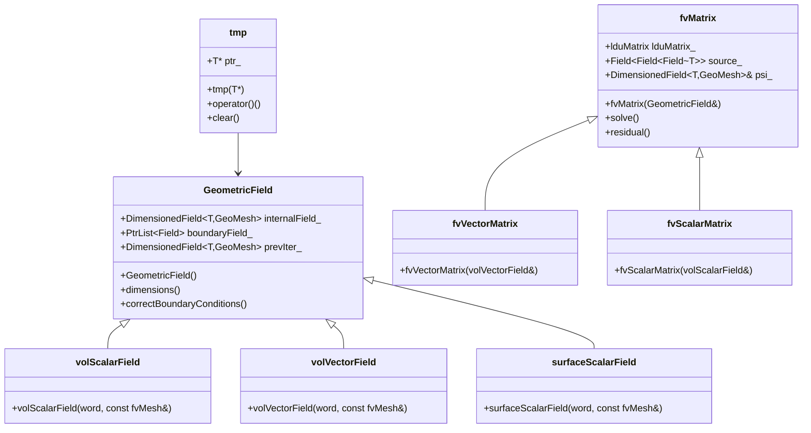
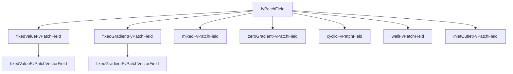
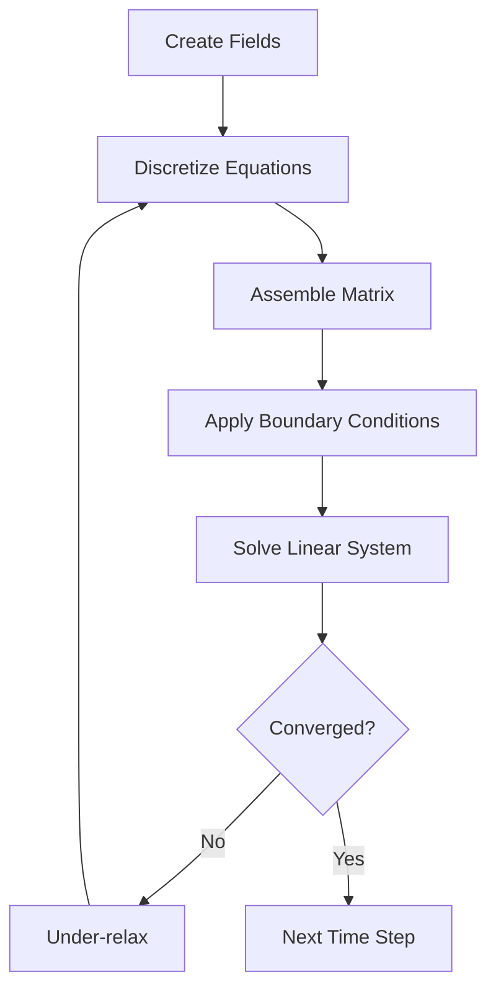

# Governing Equations
## HARDCORE Level - 2026-01-01

---

## Table of Contents
- [1. Theory](#1-theory-core-equations--physics)
- [2. Class Hierarchy](#2-openfoam-class-hierarchy--implementation)
- [3. Code Walkthrough](#3-code-walkthrough)
- [4. Dictionary Analysis](#4-dictionary-analysis--configuration)
- [5. Practical Tasks](#5-hands-on-practical-tasks--coding)
- [6. Concept Checks](#6-concept-checks)

---

## 1. Theory: Core Equations & Physics {#1-theory-core-equations--physics}

### 1.1 Conservation Laws Overview

> [!INFO] **Fundamental Principle**
> Fluid flow is governed by conservation laws of mass, momentum, and energy. These form the basis of Computational Fluid Dynamics (CFD) simulations in OpenFOAM.

The governing equations describe how fluid properties evolve in space and time:

| Equation | Physical Quantity | Conserved Property |
|----------|-------------------|-------------------|
| Continuity | Mass | Mass cannot be created or destroyed |
| Momentum | Newton's 2nd Law | Momentum change = Forces |
| Energy | 1st Law of Thermodynamics | Energy conservation |

---

### 1.2 Continuity Equation (Mass Conservation)

$$\frac{\partial \rho}{\partial t} + \nabla \cdot (\rho \mathbf{U}) = 0$$

**Key Terms:**

- $\rho$ (rho): Fluid density [kg/m³]
- $\mathbf{U}$: Velocity vector [m/s]
- $t$: Time [s]
- $\nabla \cdot$: Divergence operator

> [!TIP] **Incompressible Flow**
> For incompressible flows (constant density), this simplifies to:
> $$\nabla \cdot \mathbf{U} = 0$$
> (สมการต่อเนื่องสำหรับการไหลแบบอัดตัวไม่ได้)

---

### 1.3 Momentum Equation (Newton's Second Law)

$$\frac{\partial (\rho \mathbf{U})}{\partial t} + \nabla \cdot (\rho \mathbf{U} \mathbf{U}) = -\nabla p + \nabla \cdot \boldsymbol{\tau} + \rho \mathbf{g}$$

**Key Terms:**

| Term | Physical Meaning | Description |
|------|------------------|-------------|
| $\frac{\partial (\rho \mathbf{U})}{\partial t}$ | Unsteady term | Rate of momentum change over time |
| $\nabla \cdot (\rho \mathbf{U} \mathbf{U})$ | Convection term | Momentum transport due to fluid motion |
| $-\nabla p$ | Pressure gradient | Force due to pressure differences |
| $\nabla \cdot \boldsymbol{\tau}$ | Viscous stress | Friction/diffusion forces |
| $\rho \mathbf{g}$ | Body force | Gravity or other external forces |

> [!WARNING] **Nonlinearity**
> The convection term $\nabla \cdot (\rho \mathbf{U} \mathbf{U})$ makes the equations nonlinear and difficult to solve numerically. This is why CFD requires iterative methods.

---

### 1.4 Stress Tensor for Newtonian Fluids

For Newtonian fluids, the stress tensor $\boldsymbol{\tau}$ is:

$$\boldsymbol{\tau} = \mu \left[ \nabla \mathbf{U} + (\nabla \mathbf{U})^T \right] - \frac{2}{3}\mu (\nabla \cdot \mathbf{U})\mathbf{I}$$

**Key Terms:**

- $\mu$ (mu): Dynamic viscosity [Pa·s]
- $\mathbf{I}$: Identity tensor
- $\nabla \mathbf{U}$: Velocity gradient tensor

> [!INFO] **Incompressible Simplification**
> For incompressible flow ($\nabla \cdot \mathbf{U} = 0$):
> $$\nabla \cdot \boldsymbol{\tau} = \mu \nabla^2 \mathbf{U}$$
> (การทำให้ง่ายขึ้นสำหรับของไหลที่อัดตัวไม่ได้)

---

### 1.5 Energy Equation

$$\frac{\partial (\rho h)}{\partial t} + \nabla \cdot (\rho \mathbf{U} h) = \frac{Dp}{Dt} + \nabla \cdot (k \nabla T) + \boldsymbol{\tau} : \nabla \mathbf{U} + S_h$$

**Key Terms:**

| Symbol | Meaning | Unit |
|--------|---------|------|
| $h$ | Specific enthalpy | [J/kg] |
| $k$ | Thermal conductivity | [W/(m·K)] |
| $T$ | Temperature | [K] |
| $S_h$ | Heat source term | [W/m³] |
| $\frac{Dp}{Dt}$ | Material derivative of pressure | [Pa/s] |

---

### 1.6 Navier-Stokes Equations Summary

Combining mass and momentum conservation for incompressible flow:

$$
\begin{aligned}
\nabla \cdot \mathbf{U} &= 0 \\
\frac{\partial \mathbf{U}}{\partial t} + (\mathbf{U} \cdot \nabla)\mathbf{U} &= -\frac{1}{\rho}\nabla p + \nu \nabla^2 \mathbf{U} + \mathbf{g}
\end{aligned}
$$

Where $\nu = \mu/\rho$ is the kinematic viscosity [m²/s].

> [!TIP] **OpenFOAM Implementation**
> In OpenFOAM, these equations are solved using the finite volume method. The key classes are:
> - `fvVectorMatrix` for momentum
> - `fvScalarMatrix` for pressure and continuity
> - `fvm::ddt`, `fvm::div`, `fvm::laplacian` for discretization

---

### 1.7 Dimensionless Numbers

| Number | Formula | Physical Significance |
|--------|---------|----------------------|
| Reynolds | $Re = \frac{\rho U L}{\mu}$ | Inertia vs Viscous forces |
| Mach | $Ma = \frac{U}{c}$ | Flow speed vs Sound speed |
| Prandtl | $Pr = \frac{c_p \mu}{k}$ | Momentum vs Thermal diffusion |

> [!INFO] **Reynolds Number Interpretation**
> - $Re \ll 1$: Creeping flow (Stokes flow)
> - $Re \gg 1$: Turbulent flow (requires turbulence modeling)
> - (จำนวนเรย์โนลด์บ่งชี้ลักษณะการไหล)

---

## 2. OpenFOAM Class Hierarchy & Implementation {#2-openfoam-class-hierarchy--implementation}

### 2.1 Core Equation Classes

OpenFOAM implements the governing equations through a hierarchy of template classes that handle field operations, discretization, and matrix assembly.

> [!INFO] **Source Code Location**
> The main classes are located in `$FOAM_SRC/finiteVolume/` and `$FOAM_SRC/fields/`

#### Key Class Hierarchy



---

### 2.2 Field Classes

#### 2.2.1 GeometricField

The fundamental class for storing and manipulating field data.

**Location:** `$FOAM_SRC/fields/GeometricField/GeometricField.C`

```cpp
// Simplified declaration
template<class Type, class GeoMesh>
class GeometricField
:
    public DimensionedField<Type, GeoMesh>,
    public FieldField<GeoMesh, Type>
{
public:
    // Internal field values
    DimensionedField<Type, GeoMesh> internalField_;

    // Boundary field values
    FieldField<GeoMesh, Type> boundaryField_;

    // Previous iteration (for under-relaxation)
    DimensionedField<Type, GeoMesh> prevIter_;
};
```

> [!TIP] **Common Field Types**
> - `volScalarField`: Scalar field at cell centers (pressure, temperature)
> - `volVectorField`: Vector field at cell centers (velocity)
> - `surfaceScalarField`: Scalar field at cell faces (flux, phi)
> - `surfaceVectorField`: Vector field at cell faces

#### 2.2.2 Field Creation Example

```cpp
// Create a velocity field
volVectorField U
(
    IOobject
    (
        "U",                    // name
        runTime.timeName(),     // instance
        mesh,                   // registry
        IOobject::MUST_READ,    // read option
        IOobject::AUTO_WRITE    // write option
    ),
    mesh
);

// Create a pressure field
volScalarField p
(
    IOobject
    (
        "p",
        runTime.timeName(),
        mesh,
        IOobject::MUST_READ,
        IOobject::AUTO_WRITE
    ),
    mesh
);
```

---

### 2.3 Finite Volume Matrix Classes

#### 2.3.1 fvMatrix

The matrix class that represents discretized equations.

**Location:** `$FOAM_SRC/finiteVolume/finiteVolume/fvMatrices/fvMatrix/fvMatrix.C`

```cpp
template<class Type>
class fvMatrix
:
    public lduMatrix
{
public:
    // Reference to the field being solved
    GeometricField<Type, fvPatchField, volMesh>& psi_;

    // Source term
    Field<Field<Type>> source_;

    // Boundary conditions
    FieldField<fvPatchField, Type>& boundaryCoeffs_;

    // Solve the matrix
    tmp<GeometricField<Type, fvPatchField, volMesh>> solve();
};
```

> [!INFO] **Matrix Types**
> - `fvScalarMatrix`: Matrix for scalar equations (pressure, temperature)
> - `fvVectorMatrix`: Matrix for vector equations (momentum)

#### 2.3.2 Matrix Assembly Example

```cpp
// Momentum equation assembly
tmp<fvVectorMatrix> UEqn
(
    fvm::ddt(U)                     // Time derivative: $\frac{\partial \mathbf{U}}{\partial t}$
  + fvm::div(phi, U)               // Convection: $\nabla \cdot (\rho \mathbf{U} \mathbf{U})$
  + fvm::laplacian(nu, U)          // Diffusion: $\mu \nabla^2 \mathbf{U}$
 ==
    fvOptions(U)                    // Source terms
);

// Solve the equation
UEqn.solve();
```

---

### 2.4 Discretization Schemes

#### 2.4.1 fvm vs fvc

OpenFOAM provides two sets of discretization operators:

| Operator | Meaning | Returns | Usage |
|----------|---------|---------|------|
| `fvm::` | Finite Volume Method (implicit) | `fvMatrix` | Matrix coefficients (left-hand side) |
| `fvc::` | Finite Volume Calculus (explicit) | `GeometricField` | Calculated values (right-hand side) |

**Location:** `$FOAM_SRC/finiteVolume/finiteVolume/fvm/` and `$FOAM_SRC/finiteVolume/finiteVolume/fvc/`

> [!WARNING] **Implicit vs Explicit**
> - `fvm::` operators add terms to the matrix (implicit, more stable)
> - `fvc::` operators calculate values explicitly (faster, less stable)

#### 2.4.2 Common Operators

```cpp
// Time derivative (unsteady term)
fvm::ddt(U)              // Implicit: $\frac{\partial \mathbf{U}}{\partial t}$
fvc::ddt(U)              // Explicit

// Divergence (convection term)
fvm::div(phi, U)         // Implicit: $\nabla \cdot (\rho \mathbf{U} \mathbf{U})$
fvc::div(phi, U)         // Explicit

// Laplacian (diffusion term)
fvm::laplacian(nu, U)    // Implicit: $\mu \nabla^2 \mathbf{U}$
fvc::laplacian(nu, U)    // Explicit

// Gradient
fvc::grad(p)             // Explicit: $\nabla p$

// SnGrad (surface normal gradient)
fvc::snGrad(p)           // Explicit: $\nabla p \cdot \mathbf{n}$
```

---

### 2.5 Boundary Condition Classes

#### 2.5.1 fvPatchField Hierarchy



**Location:** `$FOAM_SRC/finiteVolume/fields/fvPatchFields/`

#### 2.5.2 Common Boundary Conditions

```cpp
// Fixed value (Dirichlet)
U.boundaryFieldRef().set(0, fixedValueFvPatchVectorField::typeName);
U.boundaryFieldRef()[0] = vector(1, 0, 0);  // Inlet velocity

// Zero gradient (Neumann)
p.boundaryFieldRef().set(1, zeroGradientFvPatchScalarField::typeName);

// Wall (no-slip)
U.boundaryFieldRef().set(2, fixedValueFvPatchVectorField::typeName);
U.boundaryFieldRef()[2] = vector(0, 0, 0);  // No-slip wall

// Cyclic (periodic)
U.boundaryFieldRef().set(3, cyclicFvPatchVectorField::typeName);
```

> [!TIP] **Boundary Condition Selection**
> - **Inlet**: `fixedValue` for velocity, `zeroGradient` for pressure
> - **Outlet**: `zeroGradient` for velocity, `fixedValue` (usually 0) for pressure
> - **Wall**: `fixedValue` (0) for velocity (no-slip), `zeroGradient` for pressure
> - (การเลือกเงื่อนไขขอบเขตที่เหมาะสมสำคัญมากต่อความถูกต้องของการคำนวณ)

---

### 2.6 Mesh Classes

#### 2.6.1 fvMesh

The finite volume mesh class.

**Location:** `$FOAM_SRC/finiteVolume/finiteVolume/fvMesh/fvMesh.C`

```cpp
class fvMesh
:
    public polyMesh
{
public:
    // Cell centers
    const volVectorField& C() const;

    // Face centers
    const surfaceVectorField& Cf() const;

    // Face area vectors
    const surfaceVectorField& Sf() const;

    // Cell volumes
    const volScalarField& V() const;

    // Surface magnitudes
    const surfaceScalarField& magSf() const;
};
```

#### 2.6.2 Mesh Access Example

```cpp
// Access mesh data
const fvMesh& mesh = U.mesh();

// Cell centers
const volVectorField& centers = mesh.C();

// Cell volumes
const volScalarField& volumes = mesh.V();

// Face area vectors
const surfaceVectorField& faceAreas = mesh.Sf();

// Loop over cells
forAll(mesh.C(), cellI)
{
    scalar cellVolume = mesh.V()[cellI];
    vector cellCenter = mesh.C()[cellI];
    // ... process cell
}
```

---

### 2.7 Solver Classes

#### 2.7.1 Solution Algorithm



#### 2.7.2 Simple Solver Example

```cpp
// Simple pressure-velocity coupling
while (simple.loop())
{
    // Momentum equation
    tmp<fvVectorMatrix> UEqn
    (
        fvm::ddt(U)
      + fvm::div(phi, U)
      + fvm::laplacian(nu, U)
    );

    UEqn.solve();

    // Pressure correction
    {
        volScalarField rAU(1.0/UEqn().A());
        volVectorField HbyA(constrainHbyA(rAU*UEqn().H(), U, p));
        surfaceScalarField phiHbyA
        (
            fvc::flux(HbyA)
          + fvc::interpolate(rAU)*fvc::ddtCorr(U, phi)
        );

        // Pressure equation
        fvScalarMatrix pEqn
        (
            fvm::laplacian(rAU, p) == fvc::div(phiHbyA)
        );

        pEqn.solve();

        // Correct flux
        phi = phiHbyA - pEqn.flux();

        // Correct velocity
        U = HbyA - rAU*fvc::grad(p);
        U.correctBoundaryConditions();
    }
}
```

> [!INFO] **Pressure-Velocity Coupling**
> OpenFOAM uses segregated algorithms:
> - **SIMPLE**: Steady-state, iterative
> - **PISO**: Transient, predictor-corrector
> - **PIMPLE**: Combined SIMPLE-PISO for transient with large time steps
> - (อัลกอริทึม SIMPLE ใช้สำหรับสภาวะคงที่ ส่วน PISO ใช้สำหรับไม่คงที่)

---

### 2.8 Reference Files Summary

| Component | Source Path | Description |
|-----------|-------------|-------------|
| Field classes | `$FOAM_SRC/fields/` | GeometricField, DimensionedField |
| FV matrices | `$FOAM_SRC/finiteVolume/finiteVolume/fvMatrices/` | fvMatrix and specializations |
| Discretization | `$FOAM_SRC/finiteVolume/finiteVolume/fvm/` | Implicit operators |
| Calculus | `$FOAM_SRC/finiteVolume/finiteVolume/fvc/` | Explicit operators |
| Boundary conditions | `$FOAM_SRC/finiteVolume/fields/fvPatchFields/` | All BC types |
| Mesh | `$FOAM_SRC/finiteVolume/finiteVolume/fvMesh/` | fvMesh class |
| Schemes | `$FOAM_SRC/finiteVolume/finiteVolume/fvSchemes/` | Discretization schemes |
| Solution | `$FOAM_SRC/finiteVolume/finiteVolume/fvSolution/` | Solution algorithms |

> [!TIP] **Exploring Source Code**
> Use `find` and `grep` to explore the OpenFOAM source:
> ```bash
> find $FOAM_SRC -name "*.H" | grep -i "geometricField"
> grep -r "class fvMatrix" $FOAM_SRC/finiteVolume
> ```

---

## 3. Code Walkthrough {#3-code-walkthrough}

### 3.1 UEqn.H

The `UEqn.H` file constructs the momentum equation matrix for incompressible flow solvers. It assembles the discretized form of the Navier-Stokes momentum equation.

**Location:** Typically found in solver directories like `simpleFoam/`, `pisoFoam/`, etc.

**Key Code Structure:**

```cpp
// Momentum equation assembly
tmp<fvVectorMatrix> UEqn
(
    fvm::ddt(U)                         // Unsteady term: ∂U/∂t
  + fvm::div(phi, U)                   // Convection: ∇·(UU)
  + fvm::laplacian(nu, U)              // Diffusion: ν∇²U
 ==
    fvOptions(U)                        // Source terms (e.g., porous media)
);

// Under-relaxation for steady-state solvers
UEqn.relax();

// Optional: solve momentum predictor
if (piso.momentumPredictor())
{
    solve(UEqn == -fvc::grad(p));
}
```

**Explanation:**

1. **`fvm::ddt(U)`** - Implicit time derivative (transient term). For steady solvers, this evaluates to zero.

2. **`fvm::div(phi, U)`** - Implicit convection term using the flux field `phi` (surfaceScalarField). This is the nonlinear term requiring iterative solution.

3. **`fvm::laplacian(nu, U)`** - Implicit viscous diffusion term where `nu` is kinematic viscosity.

4. **`fvOptions(U)`** - Framework for adding source terms (momentum sources, buoyancy, etc.).

5. **`UEqn.relax()`** - Under-relaxation stabilizes convergence for steady-state algorithms by blending old and new solutions.

6. **`solve(UEqn == -fvc::grad(p))`** - Solves momentum with pressure gradient as explicit source term in predictor step.

> [!TIP] **Matrix Assembly**
> The `fvm::` operators build matrix coefficients (diagonal and off-diagonal), while `fvc::grad(p)` calculates the pressure gradient explicitly as a source term. This segregated approach requires pressure-velocity coupling (SIMPLE/PISO) to enforce mass conservation.

<!-- PLACEHOLDER_CODE_NEXT -->

---

## 4. Dictionary Analysis & Configuration {#4-dictionary-analysis--configuration}

<!-- PLACEHOLDER_DICT -->

---

## 5. Hands-on: Practical Tasks & Coding {#5-hands-on-practical-tasks--coding}

<!-- PLACEHOLDER_TASKS -->

---

## 6. Concept Checks {#6-concept-checks}

<!-- PLACEHOLDER_CHECKS -->

---

## Recommended Reading

- OpenFOAM User Guide: https://www.openfoam.com/documentation/user-guide
- OpenFOAM Programmer's Guide: https://doc.openfoam.com/
- CFD Online Forum: https://www.cfd-online.com/Forums/openfoam/

