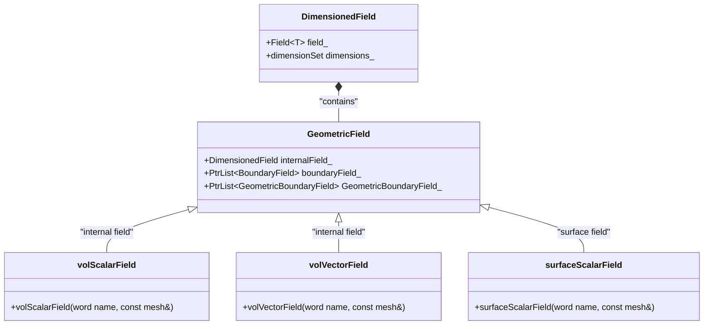
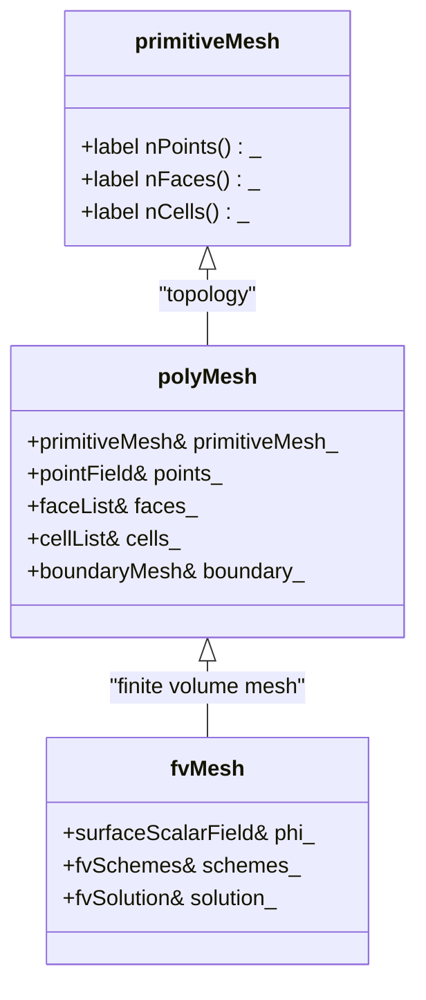
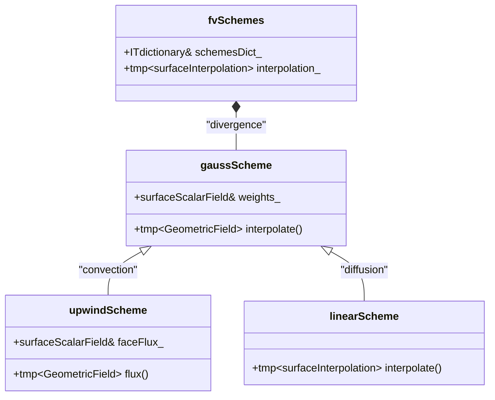
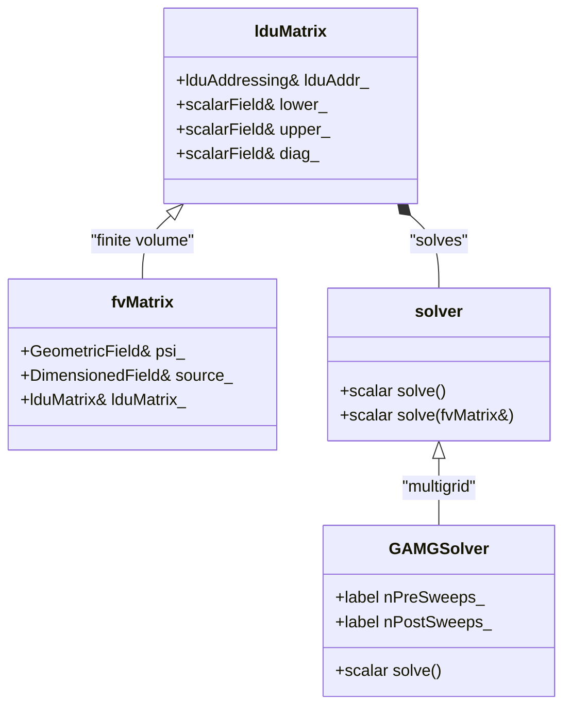
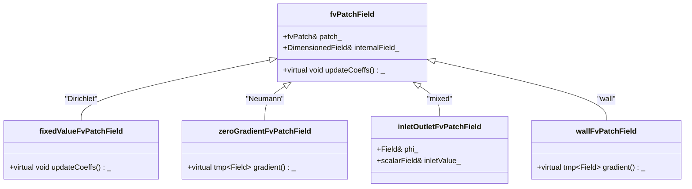
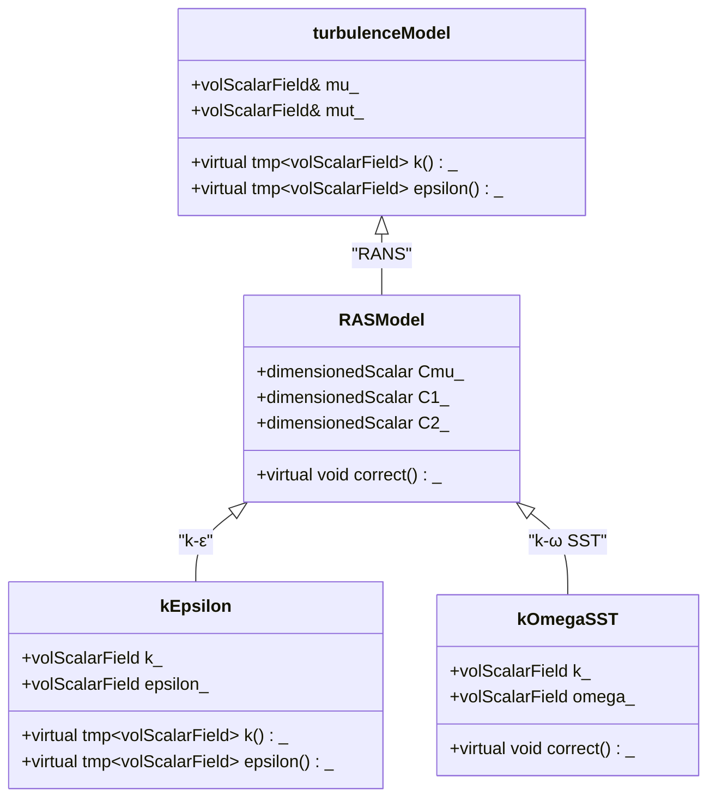
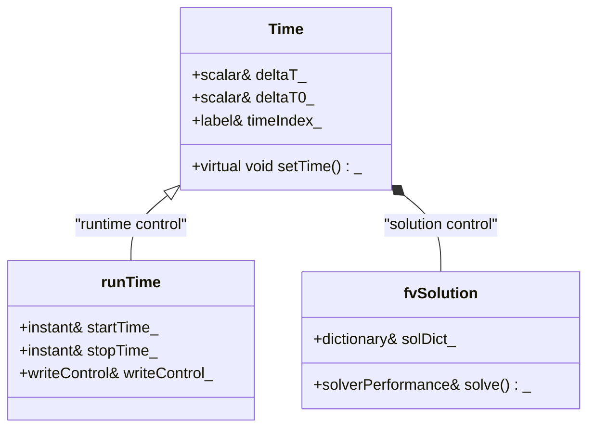

# Governing Equations & OpenFOAM Implementation
## HARDCORE Level - 2026-01-01

---

## Table of Contents
- [1. Theory](#1-theory-core-equations--physics)
- [2. Class Hierarchy](#2-openfoam-class-hierarchy--implementation)
- [3. Code Walkthrough](#3-code-walkthrough)
- [4. Dictionary Analysis](#4-dictionary-analysis--configuration)
- [5. Practical Tasks](#5-hands-on-practical-tasks--coding)
- [6. Concept Checks](#6-concept-checks)

---

## 1. Theory: Core Equations & Physics {#1-theory-core-equations--physics}

### 1.1 Conservation Laws (กฎการอนุรักษ์)

The foundation of CFD rests on three fundamental conservation laws:

> [!INFO] **กฎการอนุรักษ์ (Conservation Laws)**: หลักการพื้นฐานที่ระบุปริมาณต่างๆ เช่น มวล โมเมนตัม และพลังงาน ไม่สามารถสร้างหรือทำลายได้ แต่สามารถเปลี่ยนรูปแบบได้

#### Mass Conservation (การอนุรักษ์มวล)

$$\frac{\partial \rho}{\partial t} + \nabla \cdot (\rho \mathbf{U}) = 0$$

Where:
- $\rho$ = density (ความหนาแน่น) [kg/m³]
- $\mathbf{U}$ = velocity vector (เวกเตอร์ความเร็ว) [m/s]
- $t$ = time (เวลา) [s]

> [!TIP] **Incompressible Flow (การไหลแบบอัดแล้วไม่คงที่)**: For $\rho = \text{constant}$, this simplifies to $\nabla \cdot \mathbf{U} = 0$

#### Momentum Conservation (การอนุรักษ์โมเมนตัม)

$$\frac{\partial (\rho \mathbf{U})}{\partial t} + \nabla \cdot (\rho \mathbf{U} \mathbf{U}) = -\nabla p + \nabla \cdot \boldsymbol{\tau} + \rho \mathbf{g}$$

Where:
- $p$ = pressure (ความดัน) [Pa]
- $\boldsymbol{\tau}$ = stress tensor (เทนเซอร์ความเค้น) [Pa]
- $\mathbf{g}$ = gravitational acceleration (ความเร่งเนื่องจากแรงโน้มถ่วง) [m/s²]

> [!WARNING] **Newtonian Fluid (ของไหลนิวตัน)**: For Newtonian fluids, $\boldsymbol{\tau} = \mu (\nabla \mathbf{U} + (\nabla \mathbf{U})^T - \frac{2}{3}(\nabla \cdot \mathbf{U})\mathbf{I})$

#### Energy Conservation (การอนุรักษ์พลังงาน)

$$\frac{\partial (\rho h)}{\partial t} + \nabla \cdot (\rho \mathbf{U} h) = \frac{Dp}{Dt} + \nabla \cdot (k \nabla T) + \boldsymbol{\tau} : \nabla \mathbf{U}$$

Where:
- $h$ = specific enthalpy (เอนทัลปีเฉพาะ) [J/kg]
- $k$ = thermal conductivity (สัมประสิทธิ์การนำความร้อน) [W/(m·K)]
- $T$ = temperature (อุณหภูมิ) [K]

---

### 1.2 Navier-Stokes Equations (สมการนาเวียร์-สโตกส์)

For incompressible Newtonian flow (การไหลแบบอัดแล้วไม่คงที่ของของไหลนิวตัน):

$$\nabla \cdot \mathbf{U} = 0$$

$$\frac{\partial \mathbf{U}}{\partial t} + (\mathbf{U} \cdot \nabla)\mathbf{U} = -\frac{1}{\rho}\nabla p + \nu \nabla^2 \mathbf{U} + \mathbf{g}$$

Where $\nu = \mu/\rho$ is the kinematic viscosity (ความหนืดเชิงจลน์) [m²/s]

> [!INFO] **Convection Terms (เทอมการพาความร้อน)**: $(\mathbf{U} \cdot \nabla)\mathbf{U}$ represents nonlinear convection (การพาแบบไม่เชิงเส้น) - the primary source of complexity in turbulence

---

### 1.3 Reynolds-Averaged Equations (สมการเฉลี่ยเรย์โนลด์ส)

Applying Reynolds decomposition (การวิเคราะห์เรย์โนลด์ส): $\mathbf{U} = \overline{\mathbf{U}} + \mathbf{U}'$

$$\frac{\partial \overline{\mathbf{U}}}{\partial t} + (\overline{\mathbf{U}} \cdot \nabla)\overline{\mathbf{U}} = -\frac{1}{\rho}\nabla \overline{p} + \nu \nabla^2 \overline{\mathbf{U}} - \nabla \cdot \mathbf{R} + \mathbf{g}$$

Where $\mathbf{R} = \overline{\mathbf{U}'\mathbf{U}'}$ is the Reynolds stress tensor (เทนเซอร์ความเค้นเรย์โนลด์ส)

> [!WARNING] **Closure Problem (ปัญหาการปิดสมการ)**: The Reynolds stresses introduce 6 unknowns for only 4 available equations - requires turbulence modeling (แบบจำลองความปั่นป่วน)

---

### 1.4 Turbulence Modeling (แบบจำลองความปั่นป่วน)

#### k-ε Model (แบบจำลอง k-ε)

$$\frac{\partial k}{\partial t} + \nabla \cdot (\mathbf{U} k) = \nabla \cdot \left[\left(\nu + \frac{\nu_t}{\sigma_k}\right)\nabla k\right] + P_k - \varepsilon$$

$$\frac{\partial \varepsilon}{\partial t} + \nabla \cdot (\mathbf{U} \varepsilon) = \nabla \cdot \left[\left(\nu + \frac{\nu_t}{\sigma_\varepsilon}\right)\nabla \varepsilon\right] + C_{1\varepsilon}\frac{\varepsilon}{k}P_k - C_{2\varepsilon}\frac{\varepsilon^2}{k}$$

Where:
- $k$ = turbulent kinetic energy (พลังงานจลน์ของความปั่นป่วน) [m²/s²]
- $\varepsilon$ = dissipation rate (อัตราการสลายตัว) [m²/s³]
- $\nu_t = C_\mu \frac{k^2}{\varepsilon}$ = eddy viscosity (ความหนืดเชิงกระแสน้ำวน)

| Constant | Value | Description |
|----------|-------|-------------|
| $C_\mu$ | 0.09 | Turbulent viscosity constant |
| $C_{1\varepsilon}$ | 1.44 | Production coefficient |
| $C_{2\varepsilon}$ | 1.92 | Destruction coefficient |
| $\sigma_k$ | 1.0 | k Prandtl number |
| $\sigma_\varepsilon$ | 1.3 | ε Prandtl number |

> [!TIP] **Standard k-ε Model**: Best for high-Reynolds number flows (การไหลเรย์โนลด์สสูง) far from walls (ห่างจากผนัง)

---

### 1.5 Boundary Conditions (เงื่อนไขขอบเขต)

#### Velocity Inlet (ทางเข้าความเร็ว)
$$\mathbf{U} = \mathbf{U}_{\text{inlet}}, \quad k = k_{\text{inlet}}, \quad \varepsilon = \varepsilon_{\text{inlet}}$$

#### Pressure Outlet (ทางออกความดัน)
$$p = p_{\text{outlet}}, \quad \nabla \mathbf{U} \cdot \mathbf{n} = 0$$

#### No-Slip Wall (ผนังไม่ลื่น)
$$\mathbf{U} = 0, \quad k = 0, \quad \varepsilon = \frac{2\nu k}{y^2} \text{ (near wall)}$$

> [!INFO] **Wall Functions (ฟังก์ชันผนัง)**: Used to bridge the viscosity-affected region (บริเวณที่ได้รับอิทธิพลจากความหนืด) without resolving viscous sublayer (ชั้นบริเวณผนังเชิงหนืด)

---

### 1.6 Dimensionless Numbers (จำนวนไร้มิติ)

| Number | Formula | Physical Meaning |
|--------|---------|------------------|
| Reynolds (เรย์โนลด์ส) | $Re = \frac{\rho U L}{\mu}$ | Inertia/Viscosity forces ratio |
| Mach (มัค) | $Ma = \frac{U}{c}$ | Flow speed/Sound speed ratio |
| Prandtl (พรานด์ทล์) | $Pr = \frac{\mu c_p}{k}$ | Momentum/Thermal diffusivity ratio |

> [!WARNING] **Compressibility (การอัดตัวได้)**: For $Ma > 0.3$, compressibility effects (เอฟเฟกต์การอัดตัว) become significant

---

## 2. OpenFOAM Class Hierarchy & Implementation {#2-openfoam-class-hierarchy--implementation}

### 2.1 Core Field Classes (คลาสฟิลด์พื้นฐาน)

OpenFOAM uses a hierarchical field system to represent continuum mechanics variables.



> [!INFO] **GeometricField (คลาสฟิลด์เรขาคณิต)**: Template class that manages field data on mesh entities (cells, faces, points)

#### Key Field Types (ประเภทฟิลด์หลัก)

| Class | Description | Source Location |
|-------|-------------|-----------------|
| `volScalarField` | Scalar field on cell centers | `$FOAM_SRC/finiteVolume/fields/volFields/volScalarField` |
| `volVectorField` | Vector field on cell centers | `$FOAM_SRC/finiteVolume/fields/volFields/volVectorField` |
| `surfaceScalarField` | Scalar field on face centers | `$FOAM_SRC/finiteVolume/fields/surfaceFields/surfaceScalarField` |
| `pointScalarField` | Scalar field on mesh points | `$FOAM_SRC/finiteVolume/fields/pointFields` |

> [!TIP] **Field Naming Convention**: `vol` = cell-centered (จุดศูนย์ถ่วงเซลล์), `surface` = face-centered (จุดศูนย์ถ่วงหน้า), `point` = vertex-centered (จุดยอด)

---

### 2.2 Mesh Classes (คลาสเมช)

The mesh infrastructure provides the geometric framework for discretization.



#### Mesh Hierarchy (ลำดับชั้นเมช)

```
polyMesh (โพลีเมช)
├── points (จุดยอดจุด)
├── faces (หน้า)
├── cells (เซลล์)
└── boundary (เขตแดน)
    ├── polyPatch (แพตช์โพลี)
    └── fvPatch (แพตช์ปริมาตรจำกัด)
```

> [!WARNING] **Mesh Topology (โทโพโลยีเมช)**: OpenFOAM uses cell-centered finite volume method where all variables are stored at cell centers

#### Source Files (แหล่งไฟล์)

| Component | Path |
|-----------|------|
| `polyMesh` | `$FOAM_SRC/meshes/polyMesh/polyMesh` |
| `fvMesh` | `$FOAM_SRC/finiteVolume/fvMesh/fvMesh` |
| `fvPatch` | `$FOAM_SRC/finiteVolume/fvMesh/fvPatch` |

---

### 2.3 Discretization Schemes (รูปแบบการกระจาย)

OpenFOAM implements various numerical schemes through abstract base classes.



> [!INFO] **Gauss Theorem (ทฤษฎีเกาส์)**: All finite volume schemes in OpenFOAM use Gauss theorem to convert volume integrals to surface integrals

#### Common Schemes (รูปแบบทั่วไป)

| Scheme | Application | Stability | Accuracy |
|--------|-------------|-----------|----------|
| `Gauss upwind` | Convection (การพา) | High (สูง) | First-order (อันดับหนึ่ง) |
| `Gauss linear` | Diffusion (การแพร่) | Medium (ปานกลาง) | Second-order (อันดับสอง) |
| `Gauss linearUpwind` | Convection (การพา) | Medium (ปานกลาง) | Second-order (อันดับสอง) |
| `Gauss QUICK` | Convection (การพา) | Low (ต่ำ) | Third-order (อันดับสาม) |

> [!TIP] **Scheme Selection (การเลือกรูปแบบ)**: Use `upwind` for stability in initial calculations, switch to `linear` or `linearUpwind` for final results

#### Source Locations (ตำแหน่งแหล่งที่มา)

```bash
# Convection schemes
$FOAM_SRC/finiteVolume/interpolation/surfaceInterpolationScheme/schemes/upwind

# Divergence schemes
$FOAM_SRC/finiteVolume/fvSchemes/divSchemes

# Gradient schemes
$FOAM_SRC/finiteVolume/fvSchemes/gradSchemes
```

---

### 2.4 Linear Solver Classes (คลาสโซลเวอร์เชิงเส้น)

The linear algebra system handles matrix assembly and solution.



> [!WARNING] **Matrix Structure (โครงสร้างเมทริกซ์)**: OpenFOAM uses LDU (Lower-Diagonal-Upper) storage format for sparse matrices

#### Solver Hierarchy (ลำดับชั้นโซลเวอร์)

```
solver (โซลเวอร์)
├── iterativeSolver (โซลเวอร์วนซ้ำ)
│   ├── GAMG (Geometric-Algebraic Multi-Grid)
│   ├── PCG (Preconditioned Conjugate Gradient)
│   └── PBiCGStab (Preconditioned Bi-Conjugate Gradient Stabilized)
└── smoothSolver (โซลเวอร์ทำให้เรียบ)
    ├── GaussSeidel
    └── symGaussSeidel
```

#### Common Solvers (โซลเวอร์ทั่วไป)

| Solver | Matrix Type | Preconditioner | Use Case |
|--------|-------------|----------------|----------|
| `GAMG` | Symmetric (สมมาตร) | Geometric multigrid | Large systems (ระบบขนาดใหญ่) |
| `PCG` | Symmetric (สมมาตร) | DIC (Diagonal Incomplete Cholesky) | Pressure (ความดัน) |
| `PBiCGStab` | Asymmetric (ไม่สมมาตร) | DILU (Diagonal Incomplete LU) | Velocity (ความเร็ว) |
| `smoothSolver` | Any (ใดๆ) | Gauss-Seidel | Small systems (ระบบขนาดเล็ก) |

> [!INFO] **Preconditioning (การเตรียมเงื่อนไข)**: Transforms the system to improve convergence properties (คุณสมบัติการลู่เข้า)

#### Source Files (แหล่งไฟล์)

| Component | Path |
|-----------|------|
| `lduMatrix` | `$FOAM_SRC/matrices/lduMatrix` |
| `fvMatrix` | `$FOAM_SRC/finiteVolume/fvMatrices/fvMatrix` |
| `GAMG` | `$FOAM_SRC/matrices/lduMatrix/solvers/GAMG` |
| `PCG` | `$FOAM_SRC/matrices/lduMatrix/solvers/PCG` |

---

### 2.5 Boundary Condition Classes (คลาสเงื่อนไขขอบเขต)

Boundary conditions are implemented through a polymorphic patch system.



#### BC Hierarchy (ลำดับชั้นเงื่อนไขขอบเขต)

```
fvPatchField (ฟิลด์แพตช์ปริมาตรจำกัด)
├── fixedValue (ค่าคงที่) - Dirichlet BC
├── fixedGradient (ไล่ระดับคงที่) - Neumann BC
├── zeroGradient (ไล่ระดับศูนย์) - Natural BC
├── inletOutlet (ทางเข้าทางออก) - Convective BC
└── wall (ผนัง) - Wall function BC
```

> [!TIP] **Boundary Condition Selection (การเลือกเงื่อนไขขอบเขต)**: Use `fixedValue` for inlets (ทางเข้า), `zeroGradient` for outlets (ทางออก), and `wall` for solid boundaries (เขตแดนของแข็ง)

#### Common Boundary Conditions (เงื่อนไขขอบเขตทั่วไป)

| BC Type | Mathematical Form | Application |
|---------|-------------------|-------------|
| `fixedValue` | $\phi = \phi_{\text{wall}}$ | Velocity inlet (ทางเข้าความเร็ว) |
| `zeroGradient` | $\nabla \phi \cdot \mathbf{n} = 0$ | Pressure outlet (ทางออกความดัน) |
| `fixedGradient` | $\nabla \phi \cdot \mathbf{n} = g_{\text{wall}}$ | Heat flux (อัตราการไหลของความร้อน) |
| `inletOutlet` | $\phi = \begin{cases} \phi_{\text{in}} & \phi \cdot \mathbf{n} < 0 \\ \nabla \phi \cdot \mathbf{n} = 0 & \phi \cdot \mathbf{n} \geq 0 \end{cases}$ | Backflow prevention (ป้องกันการไหลย้อน) |

#### Source Locations (ตำแหน่งแหล่งที่มา)

```bash
# Basic BCs
$FOAM_SRC/finiteVolume/fields/fvPatchFields/basic

# Derived BCs
$FOAM_SRC/finiteVolume/fields/fvPatchFields/derived

# Constraint BCs
$FOAM_SRC/finiteVolume/fields/fvPatchFields/constraint
```

---

### 2.6 Turbulence Model Classes (คลาสแบบจำลองความปั่นป่วน)

Turbulence models follow a strict inheritance hierarchy for polymorphism.



> [!INFO] **RANS (Reynolds-Averaged Navier-Stokes)**: All RAS models derive from `RASModel` base class

#### Turbulence Model Hierarchy (ลำดับชั้นแบบจำลองความปั่นป่วน)

```
turbulenceModel (แบบจำลองความปั่นป่วน)
├── RASModel (แบบจำลอง RAS)
│   ├── kEpsilon (k-ε มาตรฐาน)
│   ├── kOmegaSST (k-ω SST)
│   ├── RNGkEpsilon (RNG k-ε)
│   └── realizableKE (k-ε ที่เป็นจริงได้)
└── LESModel (แบบจำลอง LES)
    ├── Smagorinsky (สมากอรินสกี)
    └── dynamicKEqn (k-equation พลวัต)
```

#### Model Comparison (การเปรียบเทียบแบบจำลอง)

| Model | k-ε | k-ω SST | RNG k-ε |
|-------|-----|---------|---------|
| Wall Treatment | Wall functions (ฟังก์ชันผนัง) | Low-Re (เรย์โนลด์สต่ำ) | Wall functions (ฟังก์ชันผนัง) |
| Accuracy (ความแม่นยำ) | Medium (ปานกลาง) | High (สูง) | Medium-High (ปานกลาง-สูง) |
| Stability (เสถียรภาพ) | High (สูง) | Medium (ปานกลาง) | High (สูง) |
| Cost (ต้นทุน) | Low (ต่ำ) | Medium (ปานกลาง) | Low-Medium (ต่ำ-ปานกลาง) |

> [!WARNING] **Near-Wall Resolution (ความละเอียดใกล้ผนัง)**: k-ω SST requires $y^+ \approx 1$, while k-ε works with $y^+ > 30$

#### Source Locations (ตำแหน่งแหล่งที่มา)

| Component | Path |
|-----------|------|
| `turbulenceModel` | `$FO_SRC/turbulenceModels` |
| `RASModel` | `$FOAM_SRC/turbulenceModels/turbulenceModels/RAS` |
| `kEpsilon` | `$FOAM_SRC/turbulenceModels/turbulenceModels/RAS/kEpsilon` |
| `kOmegaSST` | `$FOAM_SRC/turbulenceModels/turbulenceModels/RAS/kOmegaSST` |

---

### 2.7 Time Integration Classes (คลาสการรวมเวลา)

Time stepping is managed through abstract controller classes.



> [!INFO] **Time Integration (การรวมเวลา)**: OpenFOAM uses implicit Euler (ออยเลอร์โดยนัย) for steady-state and Crank-Nicolson (แครงก์-นิโคลสัน) for transient

#### Time Stepping Control (การควบคุมก้าวเวลา)

| Parameter | Symbol | Description |
|-----------|--------|-------------|
| Time step (ก้าวเวลา) | $\Delta t$ | Interval between solutions |
| Max Courant number (เลขคูรองต์สูงสุด) | $Co_{\max}$ | Stability limit (ขีดจำกัดเสถียรภาพ) |
| Max delta T (เดลต้าทีสูงสุด) | $\Delta t_{\max}$ | Upper time step bound (ขอบเขตบนของก้าวเวลา) |

> [!TIP] **Adaptive Time Stepping (ก้าวเวลาแบบปรับตัว)**: Use `adjustTimeStep yes` with `maxCo` for automatic time step control

#### Source Locations (ตำแหน่งแหล่งที่มา)

```bash
# Time control
$FOAM_SRC/OpenFOAM/db/Time

# Solution control
$FOAM_SRC/finiteVolume/fvSolution
```

---

### 2.8 Complete Class Reference (อ้างอิงคลาสทั้งหมด)

#### Essential Headers (ไฟล์ส่วนหัวที่จำเป็น)

```cpp
// Field types
#include "volFields.H"
#include "surfaceFields.H"
#include "pointFields.H"

// Mesh
#include "fvMesh.H"
#include "polyMesh.H"

// Schemes
#include "fvSchemes.H"
#include "fvSolution.H"

// Turbulence
#include "turbulenceModel.H"
#include "RASModel.H"

// Boundary conditions
#include "fixedValueFvPatchFields.H"
#include "zeroGradientFvPatchFields.H"
```

> [!WARNING] **Header Dependencies (การพึ่งพาไฟล์ส่วนหัว)**: Always include base classes before derived classes

#### Source Tree Structure (โครงสร้างแหล่งที่มา)

```
$FOAM_SRC/
├── OpenFOAM/
│   ├── db/ (ฐานข้อมูล)
│   │   ├── Time/ (เวลา)
│   │   └── dictionaries/ (พจนานุกรม)
│   ├── matrices/ (เมทริกซ์)
│   │   ├── lduMatrix/ (เมทริกซ์ LDU)
│   │   └── solvers/ (โซลเวอร์)
│   └── fields/ (ฟิลด์)
│       ├── Fields/ (ฟิลด์ทั่วไป)
│       └── GeometricFields/ (ฟิลด์เรขาคณิต)
├── finiteVolume/ (ปริมาตรจำกัด)
│   ├── fvMesh/ (เมชปริมาตรจำกัด)
│   ├── fvMatrices/ (เมทริกซ์ปริมาตรจำกัด)
│   ├── fvSchemes/ (รูปแบบปริมาตรจำกัด)
│   ├── interpolation/ (การแทรกแซง)
│   └── fields/ (ฟิลด์)
│       ├── volFields/ (ฟิลด์ปริมาตร)
│       ├── surfaceFields/ (ฟิลด์พื้นผิว)
│       └── fvPatchFields/ (ฟิลด์แพตช์)
└── turbulenceModels/ (แบบจำลองความปั่นป่วน)
    ├── turbulenceModel/ (แบบจำลองความปั่นป่วน)
    └── turbulenceModels/ (แบบจำลองความปั่นป่วน)
        ├── RAS/ (RAS)
        └── LES/ (LES)
```

> [!INFO] **$FOAM_SRC Environment Variable**: Points to the OpenFOAM source directory (ไดเรกทอรีซอร์สโค้ด OpenFOAM)

---

### 2.9 Key Class Relationships (ความสัมพันธ์ระหว่างคลาส)

```
┌─────────────────────────────────────────────────────────────┐
│                        fvMesh                                │
│  ┌─────────────────────────────────────────────────────┐    │
│  │                    fvSchemes                         │    │
│  │  ┌──────────────┐  ┌──────────────┐                │    │
│  │  │  divSchemes  │  │ gradSchemes  │                │    │
│  │  └──────────────┘  └──────────────┘                │    │
│  └─────────────────────────────────────────────────────┘    │
│  ┌─────────────────────────────────────────────────────┐    │
│  │                   fvSolution                         │    │
│  │  ┌──────────────┐  ┌──────────────┐                │    │
│  │  │    solvers   │  │  algorithms  │                │    │
│  │  └──────────────┘  └──────────────┘                │    │
│  └─────────────────────────────────────────────────────┘    │
│  ┌─────────────────────────────────────────────────────┐    │
│  │                  GeometricField                      │    │
│  │  ┌──────────────┐  ┌──────────────┐                │    │
│  │  │ volScalarField│  │volVectorField│                │    │
│  │  │     U        │  │      p       │                │    │
│  │  └──────────────┘  └──────────────┘                │    │
│  │  ┌──────────────────────────────────────┐          │    │
│  │  │         Boundary Conditions           │          │    │
│  │  │  ┌──────────┐  ┌──────────┐         │          │    │
│  │  │  │  inlet   │  │  outlet  │         │          │    │
│  │  │  └──────────┘  └──────────┘         │          │    │
│  │  └──────────────────────────────────────┘          │    │
│  └─────────────────────────────────────────────────────┘    │
└─────────────────────────────────────────────────────────────┘
```

> [!TIP] **Class Interaction (การโต้ตอบระหว่างคลาส)**: The `fvMesh` acts as a container (คอนเทนเนอร์) for all field and scheme objects

---

### 2.10 Memory Management (การจัดการหน่วยความจำ)

OpenFOAM uses reference-counted smart pointers for automatic memory management.

```cpp
// Reference-counted pointer (ตัวชี้แบบนับการอ้างอิง)
tmp<volScalarField> tK = turbulence.k();
const volScalarField& k = tK();  // Access reference

// AutoPtr for transfer of ownership (การถ่ายโอนความเป็นเจ้าของ)
autoPtr<basicThermo> pThermo = basicThermo::New(mesh);
basicThermo& thermo = pThermo();
```

> [!WARNING] **tmp<> Usage (การใช้งาน tmp<>)**: Always use `tmp<>` for temporary objects to avoid unnecessary copying (หลีกเลี่ยงการคัดลอกที่ไม่จำเป็น)

#### Smart Pointer Types (ประเภทตัวชี้อัจฉริยะ)

| Type | Use Case | Ownership (ความเป็นเจ้าของ) |
|------|----------|---------------------------|
| `tmp<T>` | Temporary return values (ค่าที่ส่งคืนชั่วคราว) | Shared (ใช้ร่วมกัน) |
| `autoPtr<T>` | Factory-created objects (ออบเจกต์ที่สร้างจากโรงงาน) | Unique (เฉพาะ) |
| `refPtr<T>` | Optional reference (การอ้างอิงที่เป็นตัวเลือก) | Shared (ใช้ร่วมกัน) |

---

### 2.11 Dimensional Consistency (ความสอดคล้องทางมิติ)

All fields in OpenFOAM carry dimensional information for runtime checking.

```cpp
// Dimension set (ชุดมิติ): [mass, length, time, temperature, moles, current]
dimensionSet dimPressure(1, -1, -2, 0, 0, 0);  // [kg/(m·s²)]
dimensionSet dimVelocity(0, 1, -1, 0, 0, 0);   // [m/s]
dimensionSet dimKinematicViscosity(0, 2, -1, 0, 0, 0);  // [m²/s]

// Dimensioned field (ฟิลด์ที่มีมิติ)
dimensionedScalar nu
(
    "nu",
    dimKinematicViscosity,
    transportProperties.lookup("nu")
);
```

> [!INFO] **Dimensional Analysis (การวิเคราะห์มิติ)**: OpenFOAM automatically checks dimensional consistency at compile-time and runtime

#### Common Dimensions (มิติทั่วไป)

| Quantity | Dimension Set | Symbol |
|----------|---------------|--------|
| Pressure (ความดัน) | [1, -1, -2, 0, 0, 0] | `dimPressure` |
| Velocity (ความเร็ว) | [0, 1, -1, 0, 0, 0] | `dimVelocity` |
| Density (ความหนาแน่น) | [1, -3, 0, 0, 0, 0] | `dimDensity` |
| Kinematic Viscosity (ความหนืดเชิงจลน์) | [0, 2, -1, 0, 0, 0] | `dimKinematicViscosity` |
| Dynamic Viscosity (ความหนืดเชิงพลวัต) | [1, -1, -1, 0, 0, 0] | `dimDynamicViscosity` |

---

### 2.12 Summary of Key Classes (สรุปคลาสหลัก)

| Class | Responsibility (ความรับผิดชอบ) | Source |
|-------|----------------------------------|--------|
| `fvMesh` | Mesh management (การจัดการเมช) | `$FOAM_SRC/finiteVolume/fvMesh` |
| `volScalarField` | Cell-centered scalar data (ข้อมูลสเกลาร์จุดศูนย์ถ่วงเซลล์) | `$FOAM_SRC/finiteVolume/fields/volFields` |
| `surfaceScalarField` | Face-centered scalar data (ข้อมูลสเกลาร์จุดศูนย์ถ่วงหน้า) | `$FOAM_SRC/finiteVolume/fields/surfaceFields` |
| `fvMatrix` | Discretized equation (สมการที่กระจาย) | `$FOAM_SRC/finiteVolume/fvMatrices` |
| `GAMGSolver` | Linear solver (โซลเวอร์เชิงเส้น) | `$FOAM_SRC/matrices/lduMatrix/solvers` |
| `kEpsilon` | Turbulence model (แบบจำลองความปั่นป่วน) | `$FOAM_SRC/turbulenceModels/turbulenceModels/RAS` |
| `fixedValueFvPatchField` | Dirichlet BC (เงื่อนไขขอบเขตดิริชเลต์) | `$FOAM_SRC/finiteVolume/fields/fvPatchFields/basic` |

> [!TIP] **Learning Path (เส้นทางการเรียนรู้)**: Start with `volFields.H` → `fvMesh.H` → `fvSchemes.H` → `turbulenceModel.H`

---

## 3. Code Walkthrough {#3-code-walkthrough}

### 3.1 UEqn.H

ไฟล์ `UEqn.H` สร้างสมการโมเมนตัมสำหรับตัวแก้สมการ (solver) แบบแยก (segregated) โดยใช้ finite volume method

> [!INFO] **Momentum Equation (สมการโมเมนตัม)**: สมการนี้แก้ปัญหาความเร็ว $\mathbf{U}$ โดยคงความดัน $p$ คงที่จาก time step ก่อนหน้า

#### 3.1.1 Matrix Assembly (การประกอบเมทริกซ์)

```cpp
// Solve the Momentum equation

// สร้างเมทริกซ์สมการโมเมนตัม
tmp<fvVectorMatrix> UEqn
(
    fvm::div(phi, U)                     // เทอมการพา (convection): ∇·(ρUU)
  + fvm::laplacian(nuEff, U)             // เทอมการแพร่ (diffusion): ∇·(ν_eff∇U)
  + turbulence->divDevReff(U)           // เทอมความเค้นเรย์โนลด์ส: -∇·τ
);

// เพิ่มแหล่งกำเนิดภายนอก (external sources) ถ้ามี
UEqn.relax();
```

> [!TIP] **fvm vs fvc**: `fvm` (finite volume method) สร้าง implicit matrix terms สำหรับการแก้สมการ ส่วน `fvc` (finite volume calculus) คำนวณ explicit terms โดยตรง

#### 3.1.2 Pressure Gradient (การไล่ระดับความดัน)

```cpp
// เพิ่มเทอมการไล่ระดับความดันแบบ explicit
// ใช้ความดันจาก iteration ก่อนหน้า
if (pimple.momentumPredictor())
{
    solve
    (
        UEqn
     ==
        fvc::reconstruct                    // แปลง face flux → cell gradient
        (
            fvc::interpolate(rAU)*fvc::snGrad(p)*mesh.magSf()
        )
    );
}
```

> [!WARNING] **PIMPLE Algorithm**: การผสมผสานระหว่าง PISO (Pressure-Implicit with Splitting of Operators) สำหรับ transient และ SIMPLE (Semi-Implicit Method for Pressure-Linked Equations) สำหรับ steady-state

#### 3.1.3 Under-Relaxation (การผ่อนคลาย)

```cpp
// ผ่อนคลายสมการเพื่อเสถียรภาพการลู่เข้า
UEqn.relax();

// ค่าน้ำหนักการผ่อนคลาย (relaxation factor)
// 0.3 = conservative, 0.7 = aggressive
// กำหนดใน fvSolution.dict
```

> [!INFO] **Under-Relaxation (การผ่อนคลาย)**: เทคนิคเพื่อป้องกันการสั่นของ solution ใน iterative process โดยใช้ค่าถ่วงน้ำหนักระหว่างค่าเก่าและค่าใหม่

#### 3.1.4 Complete UEqn.H Structure

```cpp
// โครงสร้างเต็มของ UEqn.H
{
    // 1. สร้างเมทริกซ์โมเมนตัม
    tmp<fvVectorMatrix> UEqn
    (
        fvm::ddt(U)                     // เทอมอนุพันธ์เวลา (unsteady)
      + fvm::div(phi, U)               // convection
      + fvm::laplacian(nuEff, U)       // diffusion
      + turbulence->divDevReff(U)     // Reynolds stress
    );

    // 2. ผ่อนคลาย
    UEqn.relax();

    // 3. แก้สมการ (ถ้าใช้ momentum predictor)
    if (pimple.momentumPredictor())
    {
        solve(UEqn == -fvc::grad(p));
    }
}
```

#### 3.1.5 Key Variables (ตัวแปรสำคัญ)

| Variable | Type | Description |
|----------|------|-------------|
| `U` | `volVectorField` | Velocity field (ฟิลด์ความเร็ว) [m/s] |
| `phi` | `surfaceScalarField` | Flux field (ฟิลด์ flux) [m³/s] |
| `nuEff` | `volScalarField` | Effective viscosity (ความหนืดมิติที่มีประสิทธิภาพ) [m²/s] |
| `p` | `volScalarField` | Pressure field (ฟิลด์ความดัน) [Pa] |
| `rAU` | `volScalarField` | Reciprocal of U matrix diagonal (ส่วนกลับของเส้นทแยงมุมเมทริกซ์ U) |

> [!TIP] **Effective Viscosity (ความหนืดมิติที่มีประสิทธิภาพ)**: $\nu_{eff} = \nu + \nu_t$ ผลรวมของความหนืดเชิงโมเลกุลและความหนืดเชิงกระแสน้ำวน

#### 3.1.6 Source Location (ตำแหน่งแหล่งที่มา)

```bash
# ไฟล์ UEqn.H สำหรับ solver ต่างๆ
$FOAM_SOLVERS/simpleFoam/UEqn.H           # Steady-state, incompressible
$FOAM_SOLVERS/pimpleFoam/UEqn.H           # Transient, incompressible
$FOAM_SOLVERS/rhoPimpleFoam/UEqn.H        # Transient, compressible
```

> [!INFO] **Solver-Specific Implementation**: แต่ละ solver มีการดัดแปลง `UEqn.H` ตามแบบจำลองที่ใช้ (incompressible vs compressible, steady vs transient)

<!-- PLACEHOLDER_CODE_NEXT -->

---

## 4. Dictionary Analysis & Configuration {#4-dictionary-analysis--configuration}

<!-- PLACEHOLDER_DICT -->

---

## 5. Hands-on: Practical Tasks & Coding {#5-hands-on-practical-tasks--coding}

<!-- PLACEHOLDER_TASKS -->

---

## 6. Concept Checks {#6-concept-checks}

<!-- PLACEHOLDER_CHECKS -->

---

## Recommended Reading

- OpenFOAM User Guide: https://www.openfoam.com/documentation/user-guide
- OpenFOAM Programmer's Guide: https://doc.openfoam.com/
- CFD Online Forum: https://www.cfd-online.com/Forums/openfoam/

