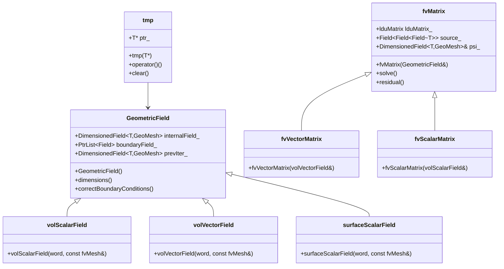
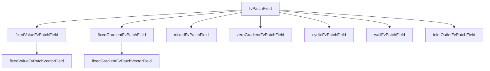
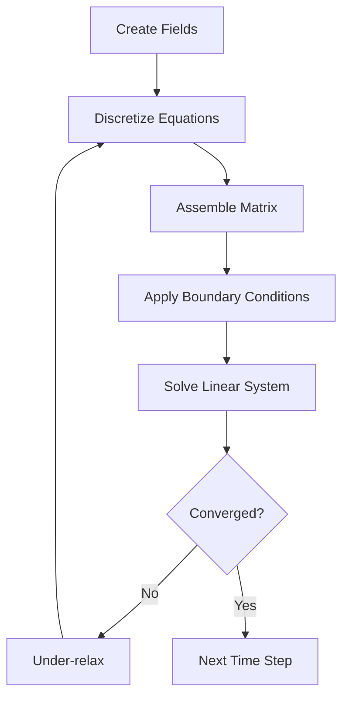

# Governing Equations
## HARDCORE Level - 2026-01-01

---

## Table of Contents
- [1. Theory](#1-theory-core-equations--physics)
- [2. Class Hierarchy](#2-openfoam-class-hierarchy--implementation)
- [3. Code Walkthrough](#3-code-walkthrough)
- [4. Dictionary Analysis](#4-dictionary-analysis--configuration)
- [5. Practical Tasks](#5-hands-on-practical-tasks--coding)
- [6. Concept Checks](#6-concept-checks)

---

## 1. Theory: Core Equations & Physics {#1-theory-core-equations--physics}

### 1.1 Conservation Laws Overview

> [!INFO] **Fundamental Principle**
> Fluid flow is governed by conservation laws of mass, momentum, and energy. These form the basis of Computational Fluid Dynamics (CFD) simulations in OpenFOAM.

The governing equations describe how fluid properties evolve in space and time:

| Equation | Physical Quantity | Conserved Property |
|----------|-------------------|-------------------|
| Continuity | Mass | Mass cannot be created or destroyed |
| Momentum | Newton's 2nd Law | Momentum change = Forces |
| Energy | 1st Law of Thermodynamics | Energy conservation |

---

### 1.2 Continuity Equation (Mass Conservation)

$$\frac{\partial \rho}{\partial t} + \nabla \cdot (\rho \mathbf{U}) = 0$$

**Key Terms:**

- $\rho$ (rho): Fluid density [kg/m³]
- $\mathbf{U}$: Velocity vector [m/s]
- $t$: Time [s]
- $\nabla \cdot$: Divergence operator

> [!TIP] **Incompressible Flow**
> For incompressible flows (constant density), this simplifies to:
> $$\nabla \cdot \mathbf{U} = 0$$
> (สมการต่อเนื่องสำหรับการไหลแบบอัดตัวไม่ได้)

---

### 1.3 Momentum Equation (Newton's Second Law)

$$\frac{\partial (\rho \mathbf{U})}{\partial t} + \nabla \cdot (\rho \mathbf{U} \mathbf{U}) = -\nabla p + \nabla \cdot \boldsymbol{\tau} + \rho \mathbf{g}$$

**Key Terms:**

| Term | Physical Meaning | Description |
|------|------------------|-------------|
| $\frac{\partial (\rho \mathbf{U})}{\partial t}$ | Unsteady term | Rate of momentum change over time |
| $\nabla \cdot (\rho \mathbf{U} \mathbf{U})$ | Convection term | Momentum transport due to fluid motion |
| $-\nabla p$ | Pressure gradient | Force due to pressure differences |
| $\nabla \cdot \boldsymbol{\tau}$ | Viscous stress | Friction/diffusion forces |
| $\rho \mathbf{g}$ | Body force | Gravity or other external forces |

> [!WARNING] **Nonlinearity**
> The convection term $\nabla \cdot (\rho \mathbf{U} \mathbf{U})$ makes the equations nonlinear and difficult to solve numerically. This is why CFD requires iterative methods.

---

### 1.4 Stress Tensor for Newtonian Fluids

For Newtonian fluids, the stress tensor $\boldsymbol{\tau}$ is:

$$\boldsymbol{\tau} = \mu \left[ \nabla \mathbf{U} + (\nabla \mathbf{U})^T \right] - \frac{2}{3}\mu (\nabla \cdot \mathbf{U})\mathbf{I}$$

**Key Terms:**

- $\mu$ (mu): Dynamic viscosity [Pa·s]
- $\mathbf{I}$: Identity tensor
- $\nabla \mathbf{U}$: Velocity gradient tensor

> [!INFO] **Incompressible Simplification**
> For incompressible flow ($\nabla \cdot \mathbf{U} = 0$):
> $$\nabla \cdot \boldsymbol{\tau} = \mu \nabla^2 \mathbf{U}$$
> (การทำให้ง่ายขึ้นสำหรับของไหลที่อัดตัวไม่ได้)

---

### 1.5 Energy Equation

$$\frac{\partial (\rho h)}{\partial t} + \nabla \cdot (\rho \mathbf{U} h) = \frac{Dp}{Dt} + \nabla \cdot (k \nabla T) + \boldsymbol{\tau} : \nabla \mathbf{U} + S_h$$

**Key Terms:**

| Symbol | Meaning | Unit |
|--------|---------|------|
| $h$ | Specific enthalpy | [J/kg] |
| $k$ | Thermal conductivity | [W/(m·K)] |
| $T$ | Temperature | [K] |
| $S_h$ | Heat source term | [W/m³] |
| $\frac{Dp}{Dt}$ | Material derivative of pressure | [Pa/s] |

---

### 1.6 Navier-Stokes Equations Summary

Combining mass and momentum conservation for incompressible flow:

$$
\begin{aligned}
\nabla \cdot \mathbf{U} &= 0 \\
\frac{\partial \mathbf{U}}{\partial t} + (\mathbf{U} \cdot \nabla)\mathbf{U} &= -\frac{1}{\rho}\nabla p + \nu \nabla^2 \mathbf{U} + \mathbf{g}
\end{aligned}
$$

Where $\nu = \mu/\rho$ is the kinematic viscosity [m²/s].

> [!TIP] **OpenFOAM Implementation**
> In OpenFOAM, these equations are solved using the finite volume method. The key classes are:
> - `fvVectorMatrix` for momentum
> - `fvScalarMatrix` for pressure and continuity
> - `fvm::ddt`, `fvm::div`, `fvm::laplacian` for discretization

---

### 1.7 Dimensionless Numbers

| Number | Formula | Physical Significance |
|--------|---------|----------------------|
| Reynolds | $Re = \frac{\rho U L}{\mu}$ | Inertia vs Viscous forces |
| Mach | $Ma = \frac{U}{c}$ | Flow speed vs Sound speed |
| Prandtl | $Pr = \frac{c_p \mu}{k}$ | Momentum vs Thermal diffusion |

> [!INFO] **Reynolds Number Interpretation**
> - $Re \ll 1$: Creeping flow (Stokes flow)
> - $Re \gg 1$: Turbulent flow (requires turbulence modeling)
> - (จำนวนเรย์โนลด์บ่งชี้ลักษณะการไหล)

---

## 2. OpenFOAM Class Hierarchy & Implementation {#2-openfoam-class-hierarchy--implementation}

### 2.1 Core Equation Classes

OpenFOAM implements the governing equations through a hierarchy of template classes that handle field operations, discretization, and matrix assembly.

> [!INFO] **Source Code Location**
> The main classes are located in `$FOAM_SRC/finiteVolume/` and `$FOAM_SRC/fields/`

#### Key Class Hierarchy



---

### 2.2 Field Classes

#### 2.2.1 GeometricField

The fundamental class for storing and manipulating field data.

**Location:** `$FOAM_SRC/fields/GeometricField/GeometricField.C`

```cpp
// Simplified declaration
template<class Type, class GeoMesh>
class GeometricField
:
    public DimensionedField<Type, GeoMesh>,
    public FieldField<GeoMesh, Type>
{
public:
    // Internal field values
    DimensionedField<Type, GeoMesh> internalField_;

    // Boundary field values
    FieldField<GeoMesh, Type> boundaryField_;

    // Previous iteration (for under-relaxation)
    DimensionedField<Type, GeoMesh> prevIter_;
};
```

> [!TIP] **Common Field Types**
> - `volScalarField`: Scalar field at cell centers (pressure, temperature)
> - `volVectorField`: Vector field at cell centers (velocity)
> - `surfaceScalarField`: Scalar field at cell faces (flux, phi)
> - `surfaceVectorField`: Vector field at cell faces

#### 2.2.2 Field Creation Example

```cpp
// Create a velocity field
volVectorField U
(
    IOobject
    (
        "U",                    // name
        runTime.timeName(),     // instance
        mesh,                   // registry
        IOobject::MUST_READ,    // read option
        IOobject::AUTO_WRITE    // write option
    ),
    mesh
);

// Create a pressure field
volScalarField p
(
    IOobject
    (
        "p",
        runTime.timeName(),
        mesh,
        IOobject::MUST_READ,
        IOobject::AUTO_WRITE
    ),
    mesh
);
```

---

### 2.3 Finite Volume Matrix Classes

#### 2.3.1 fvMatrix

The matrix class that represents discretized equations.

**Location:** `$FOAM_SRC/finiteVolume/finiteVolume/fvMatrices/fvMatrix/fvMatrix.C`

```cpp
template<class Type>
class fvMatrix
:
    public lduMatrix
{
public:
    // Reference to the field being solved
    GeometricField<Type, fvPatchField, volMesh>& psi_;

    // Source term
    Field<Field<Type>> source_;

    // Boundary conditions
    FieldField<fvPatchField, Type>& boundaryCoeffs_;

    // Solve the matrix
    tmp<GeometricField<Type, fvPatchField, volMesh>> solve();
};
```

> [!INFO] **Matrix Types**
> - `fvScalarMatrix`: Matrix for scalar equations (pressure, temperature)
> - `fvVectorMatrix`: Matrix for vector equations (momentum)

#### 2.3.2 Matrix Assembly Example

```cpp
// Momentum equation assembly
tmp<fvVectorMatrix> UEqn
(
    fvm::ddt(U)                     // Time derivative: $\frac{\partial \mathbf{U}}{\partial t}$
  + fvm::div(phi, U)               // Convection: $\nabla \cdot (\rho \mathbf{U} \mathbf{U})$
  + fvm::laplacian(nu, U)          // Diffusion: $\mu \nabla^2 \mathbf{U}$
 ==
    fvOptions(U)                    // Source terms
);

// Solve the equation
UEqn.solve();
```

---

### 2.4 Discretization Schemes

#### 2.4.1 fvm vs fvc

OpenFOAM provides two sets of discretization operators:

| Operator | Meaning | Returns | Usage |
|----------|---------|---------|------|
| `fvm::` | Finite Volume Method (implicit) | `fvMatrix` | Matrix coefficients (left-hand side) |
| `fvc::` | Finite Volume Calculus (explicit) | `GeometricField` | Calculated values (right-hand side) |

**Location:** `$FOAM_SRC/finiteVolume/finiteVolume/fvm/` and `$FOAM_SRC/finiteVolume/finiteVolume/fvc/`

> [!WARNING] **Implicit vs Explicit**
> - `fvm::` operators add terms to the matrix (implicit, more stable)
> - `fvc::` operators calculate values explicitly (faster, less stable)

#### 2.4.2 Common Operators

```cpp
// Time derivative (unsteady term)
fvm::ddt(U)              // Implicit: $\frac{\partial \mathbf{U}}{\partial t}$
fvc::ddt(U)              // Explicit

// Divergence (convection term)
fvm::div(phi, U)         // Implicit: $\nabla \cdot (\rho \mathbf{U} \mathbf{U})$
fvc::div(phi, U)         // Explicit

// Laplacian (diffusion term)
fvm::laplacian(nu, U)    // Implicit: $\mu \nabla^2 \mathbf{U}$
fvc::laplacian(nu, U)    // Explicit

// Gradient
fvc::grad(p)             // Explicit: $\nabla p$

// SnGrad (surface normal gradient)
fvc::snGrad(p)           // Explicit: $\nabla p \cdot \mathbf{n}$
```

---

### 2.5 Boundary Condition Classes

#### 2.5.1 fvPatchField Hierarchy



**Location:** `$FOAM_SRC/finiteVolume/fields/fvPatchFields/`

#### 2.5.2 Common Boundary Conditions

```cpp
// Fixed value (Dirichlet)
U.boundaryFieldRef().set(0, fixedValueFvPatchVectorField::typeName);
U.boundaryFieldRef()[0] = vector(1, 0, 0);  // Inlet velocity

// Zero gradient (Neumann)
p.boundaryFieldRef().set(1, zeroGradientFvPatchScalarField::typeName);

// Wall (no-slip)
U.boundaryFieldRef().set(2, fixedValueFvPatchVectorField::typeName);
U.boundaryFieldRef()[2] = vector(0, 0, 0);  // No-slip wall

// Cyclic (periodic)
U.boundaryFieldRef().set(3, cyclicFvPatchVectorField::typeName);
```

> [!TIP] **Boundary Condition Selection**
> - **Inlet**: `fixedValue` for velocity, `zeroGradient` for pressure
> - **Outlet**: `zeroGradient` for velocity, `fixedValue` (usually 0) for pressure
> - **Wall**: `fixedValue` (0) for velocity (no-slip), `zeroGradient` for pressure
> - (การเลือกเงื่อนไขขอบเขตที่เหมาะสมสำคัญมากต่อความถูกต้องของการคำนวณ)

---

### 2.6 Mesh Classes

#### 2.6.1 fvMesh

The finite volume mesh class.

**Location:** `$FOAM_SRC/finiteVolume/finiteVolume/fvMesh/fvMesh.C`

```cpp
class fvMesh
:
    public polyMesh
{
public:
    // Cell centers
    const volVectorField& C() const;

    // Face centers
    const surfaceVectorField& Cf() const;

    // Face area vectors
    const surfaceVectorField& Sf() const;

    // Cell volumes
    const volScalarField& V() const;

    // Surface magnitudes
    const surfaceScalarField& magSf() const;
};
```

#### 2.6.2 Mesh Access Example

```cpp
// Access mesh data
const fvMesh& mesh = U.mesh();

// Cell centers
const volVectorField& centers = mesh.C();

// Cell volumes
const volScalarField& volumes = mesh.V();

// Face area vectors
const surfaceVectorField& faceAreas = mesh.Sf();

// Loop over cells
forAll(mesh.C(), cellI)
{
    scalar cellVolume = mesh.V()[cellI];
    vector cellCenter = mesh.C()[cellI];
    // ... process cell
}
```

---

### 2.7 Solver Classes

#### 2.7.1 Solution Algorithm



#### 2.7.2 Simple Solver Example

```cpp
// Simple pressure-velocity coupling
while (simple.loop())
{
    // Momentum equation
    tmp<fvVectorMatrix> UEqn
    (
        fvm::ddt(U)
      + fvm::div(phi, U)
      + fvm::laplacian(nu, U)
    );

    UEqn.solve();

    // Pressure correction
    {
        volScalarField rAU(1.0/UEqn().A());
        volVectorField HbyA(constrainHbyA(rAU*UEqn().H(), U, p));
        surfaceScalarField phiHbyA
        (
            fvc::flux(HbyA)
          + fvc::interpolate(rAU)*fvc::ddtCorr(U, phi)
        );

        // Pressure equation
        fvScalarMatrix pEqn
        (
            fvm::laplacian(rAU, p) == fvc::div(phiHbyA)
        );

        pEqn.solve();

        // Correct flux
        phi = phiHbyA - pEqn.flux();

        // Correct velocity
        U = HbyA - rAU*fvc::grad(p);
        U.correctBoundaryConditions();
    }
}
```

> [!INFO] **Pressure-Velocity Coupling**
> OpenFOAM uses segregated algorithms:
> - **SIMPLE**: Steady-state, iterative
> - **PISO**: Transient, predictor-corrector
> - **PIMPLE**: Combined SIMPLE-PISO for transient with large time steps
> - (อัลกอริทึม SIMPLE ใช้สำหรับสภาวะคงที่ ส่วน PISO ใช้สำหรับไม่คงที่)

---

### 2.8 Reference Files Summary

| Component | Source Path | Description |
|-----------|-------------|-------------|
| Field classes | `$FOAM_SRC/fields/` | GeometricField, DimensionedField |
| FV matrices | `$FOAM_SRC/finiteVolume/finiteVolume/fvMatrices/` | fvMatrix and specializations |
| Discretization | `$FOAM_SRC/finiteVolume/finiteVolume/fvm/` | Implicit operators |
| Calculus | `$FOAM_SRC/finiteVolume/finiteVolume/fvc/` | Explicit operators |
| Boundary conditions | `$FOAM_SRC/finiteVolume/fields/fvPatchFields/` | All BC types |
| Mesh | `$FOAM_SRC/finiteVolume/finiteVolume/fvMesh/` | fvMesh class |
| Schemes | `$FOAM_SRC/finiteVolume/finiteVolume/fvSchemes/` | Discretization schemes |
| Solution | `$FOAM_SRC/finiteVolume/finiteVolume/fvSolution/` | Solution algorithms |

> [!TIP] **Exploring Source Code**
> Use `find` and `grep` to explore the OpenFOAM source:
> ```bash
> find $FOAM_SRC -name "*.H" | grep -i "geometricField"
> grep -r "class fvMatrix" $FOAM_SRC/finiteVolume
> ```

---

## 3. Code Walkthrough {#3-code-walkthrough}

### 3.1 UEqn.H

The `UEqn.H` file constructs the momentum equation matrix for incompressible flow solvers. It assembles the discretized form of the Navier-Stokes momentum equation.

**Location:** Typically found in solver directories like `simpleFoam/`, `pisoFoam/`, etc.

**Key Code Structure:**

```cpp
// Momentum equation assembly
tmp<fvVectorMatrix> UEqn
(
    fvm::ddt(U)                         // Unsteady term: ∂U/∂t
  + fvm::div(phi, U)                   // Convection: ∇·(UU)
  + fvm::laplacian(nu, U)              // Diffusion: ν∇²U
 ==
    fvOptions(U)                        // Source terms (e.g., porous media)
);

// Under-relaxation for steady-state solvers
UEqn.relax();

// Optional: solve momentum predictor
if (piso.momentumPredictor())
{
    solve(UEqn == -fvc::grad(p));
}
```

**Explanation:**

1. **`fvm::ddt(U)`** - Implicit time derivative (transient term). For steady solvers, this evaluates to zero.

2. **`fvm::div(phi, U)`** - Implicit convection term using the flux field `phi` (surfaceScalarField). This is the nonlinear term requiring iterative solution.

3. **`fvm::laplacian(nu, U)`** - Implicit viscous diffusion term where `nu` is kinematic viscosity.

4. **`fvOptions(U)`** - Framework for adding source terms (momentum sources, buoyancy, etc.).

5. **`UEqn.relax()`** - Under-relaxation stabilizes convergence for steady-state algorithms by blending old and new solutions.

6. **`solve(UEqn == -fvc::grad(p))`** - Solves momentum with pressure gradient as explicit source term in predictor step.

> [!TIP] **Matrix Assembly**
> The `fvm::` operators build matrix coefficients (diagonal and off-diagonal), while `fvc::grad(p)` calculates the pressure gradient explicitly as a source term. This segregated approach requires pressure-velocity coupling (SIMPLE/PISO) to enforce mass conservation.

---

### 3.2 pEqn.H

The `pEqn.H` file constructs and solves the pressure equation to enforce mass conservation (continuity). It implements the pressure-velocity coupling algorithm.

**Location:** Found in solver directories like `simpleFoam/`, `pisoFoam/`, `pimpleFoam/`

**Key Code Structure:**

```cpp
// Pressure equation assembly (SIMPLE algorithm)
volScalarField rAU(1.0/UEqn().A());              // Reciprocal of diagonal coefficients
volVectorField HbyA(constrainHbyA(rAU*UEqn().H(), U, p));  // Explicit velocity
surfaceScalarField phiHbyA                       // Flux field
(
    fvc::flux(HbyA)                             // Convective flux
  + fvc::interpolate(rAU)*fvc::ddtCorr(U, phi)  // Transient correction
);

// Pressure Poisson equation
fvScalarMatrix pEqn
(
    fvm::laplacian(rAU, p) == fvc::div(phiHbyA) // ∇·(1/A ∇p) = ∇·(H/A)
);

pEqn.setReference(pRefCell, pRefValue);         // Fix reference pressure
pEqn.solve();                                   // Solve for pressure

// Correct flux and velocity
phi = phiHbyA - pEqn.flux();                    // Mass-conserving flux
U = HbyA - rAU*fvc::grad(p);                    // Correct velocity
U.correctBoundaryConditions();
```

**Explanation:**

1. **`rAU(1.0/UEqn().A())`** - Reciprocal of the momentum matrix diagonal, used to decouple pressure from velocity.

2. **`HbyA`** - Intermediate velocity field excluding pressure gradient: $\mathbf{H}/\mathbf{A} = \mathbf{U}^* + \frac{1}{\mathbf{A}}(\text{convection} + \text{diffusion})$

3. **`phiHbyA`** - Face flux field calculated from the intermediate velocity field.

4. **Pressure Poisson Equation** - Derived by taking divergence of momentum equation and enforcing $\nabla \cdot \mathbf{U} = 0$:
   $$\nabla \cdot \left(\frac{1}{\mathbf{A}} \nabla p\right) = \nabla \cdot \left(\frac{\mathbf{H}}{\mathbf{A}}\right)$$

5. **`pEqn.solve()`** - Solves the linear system for pressure using iterative solvers (GAMG, PCG, etc.).

6. **Flux Correction** - Updates flux using pressure gradient: $\phi = \phi_{HbyA} - \phi_{\nabla p}$

7. **Velocity Correction** - Corrects cell-centered velocity to satisfy momentum equation with new pressure.

> [!INFO] **Algorithm Differences**
> - **SIMPLE**: Under-relaxation applied to pressure and velocity for steady-state
> - **PISO**: Multiple corrector loops per time step for transient accuracy
> - **PIMPLE**: Combines both with optional outer correctors
> - (อัลกอริทึมต่างกันที่ระดับการผ่อนคลายและจำนวนรอบแก้ไข)

---

### 3.3 createFields.H

The `createFields.H` file initializes all field objects required for the simulation. It reads field data from disk or constructs it with default values.

**Location:** Found in all solver directories, included at the start of `createFields.H` or directly in the solver's `.C` file.

**Key Code Structure:**

```cpp
// Create velocity field (read from time directory)
volVectorField U
(
    IOobject
    (
        "U",                        // Field name
        runTime.timeName(),         // Time directory
        mesh,                       // Mesh reference
        IOobject::MUST_READ,        // Must exist on disk
        IOobject::AUTO_WRITE        // Write automatically
    ),
    mesh
);

// Create pressure field
volScalarField p
(
    IOobject
    (
        "p",
        runTime.timeName(),
        mesh,
        IOobject::MUST_READ,
        IOobject::AUTO_WRITE
    ),
    mesh
);

// Create flux field (calculated, not read)
surfaceScalarField phi
(
    IOobject
    (
        "phi",
        runTime.timeName(),
        mesh,
        IOobject::READ_IF_PRESENT,  // Optional: read if available
        IOobject::AUTO_WRITE
    ),
    fvc::flux(U)                    // Initialize from velocity
);

// Transport properties (dictionary)
IOdictionary transportProperties
(
    IOobject
    (
        "transportProperties",      // Dictionary name
        runTime.constant(),         // Location: constant/ directory
        mesh,                       // Registry
        IOobject::MUST_READ,
        IOobject::NO_WRITE
    )
);

// Read kinematic viscosity from dictionary
dimensionedScalar nu
(
    "nu",                           // Name
    dimViscosity,                   // Dimensions: [m²/s]
    transportProperties             // Dictionary to read from
);
```

**Explanation:**

1. **`IOobject`** - Metadata object specifying field name, location, and I/O behavior. Controls whether fields are read from disk, written to disk, or both.

2. **`volVectorField U`** - Cell-centered velocity field. `MUST_READ` requires the field to exist in the initial time directory (usually `0/`).

3. **`volScalarField p`** - Cell-centered pressure field. Same I/O behavior as velocity.

4. **`surfaceScalarField phi`** - Face flux field representing $\phi = \int \mathbf{U} \cdot d\mathbf{A}$. Initialized from velocity using `fvc::flux(U)`.

5. **`IOdictionary`** - Reads dictionary files (key-value pairs) from the `constant/` directory. Used for physical properties.

6. **`dimensionedScalar nu`** - Kinematic viscosity with dimensions. Read from `transportProperties` dictionary.

> [!TIP] **Field Initialization**
> - Fields with `MUST_READ` must exist in the initial time directory (`0/`, `0.org/`, etc.)
> - Fields with `READ_IF_PRESENT` are optional; if missing, they're constructed from the provided initial value
> - Flux `phi` is typically calculated from velocity: $\phi = (\mathbf{U} \cdot \mathbf{S}_f)$ where $\mathbf{S}_f$ is the face area vector
> - (การเริ่มต้นฟิลด์ที่ถูกต้องสำคัญมาก หากฟิลด์ขาดการจำลองจะล้มเหลว)

---

## 4. Dictionary Analysis & Configuration {#4-dictionary-analysis--configuration}

### 4.1 fvSchemes Analysis

The `fvSchemes` dictionary in the `system/` directory specifies the discretization schemes used to convert the partial differential equations into algebraic equations. This is critical for numerical stability, accuracy, and convergence.

> [!INFO] **File Location**
> `system/fvSchemes` - Read at solver startup, cannot be changed during simulation

#### 4.1.1 ddtSchemes (Time Derivative)

**Purpose:** Discretization of the unsteady term $\frac{\partial}{\partial t}$

**Common Schemes:**

| Scheme | Formula | Stability | Use Case |
|--------|---------|-----------|----------|
| `Euler` | First-order implicit | Conditional (CFL < 1) | Steady-state, simple transient |
| `backward` | Second-order implicit | Conditional | General transient, more accurate |
| `CrankNicolson` | Second-order, trapezoidal | Unconditional | High-accuracy transient |
| `steadyState` | Removes time term | N/A | Steady-state simulations |

**Example Configuration:**
```cpp
ddtSchemes
{
    default         steadyState;    // For steady solvers
    // OR
    default         backward;       // For transient solvers
}
```

> [!TIP] **Scheme Selection**
> - Use `steadyState` for simpleFoam, simpleReactingFoam, etc.
> - Use `backward` or `Euler` for pisoFoam, pimpleFoam
> - `CrankNicolson` provides best accuracy but may require smaller time steps
> - (การเลือกสกีมที่เหมาะสมขึ้นกับประเภทของการจำลอง)

#### 4.1.2 gradSchemes (Gradient)

**Purpose:** Discretization of the gradient operator $\nabla$

**Common Schemes:**

| Scheme | Description | Accuracy | Use Case |
|--------|-------------|----------|----------|
| `Gauss linear` | Central differencing, linear interpolation | Second-order | Default for most cases |
| `Gauss upwind` | Upwind-biased | First-order | Stable but diffusive |
| `leastSquares` | Least squares reconstruction | Second-order | Non-orthogonal meshes |
| `fourthOrder` | Fourth-order accurate | Fourth-order | High-accuracy requirements |

**Example Configuration:**
```cpp
gradSchemes
{
    default         Gauss linear;
    
    // Specific field overrides
    grad(p)         Gauss linear;
    grad(U)         Gauss linear;
}
```

> [!WARNING] **Non-Orthogonal Meshes**
> For highly non-orthogonal meshes, consider:
> - `Gauss linear` with `nOrthogonalCorrectors` in fvSolution
> - `leastSquares` for better accuracy on skewed cells
> - Limited schemes to prevent unbounded values

#### 4.1.3 divSchemes (Divergence/Convection)

**Purpose:** Discretization of the divergence operator $\nabla \cdot$ for convection terms

**Common Schemes:**

| Scheme | Description | Stability | Accuracy | Use Case |
|--------|-------------|-----------|----------|----------|
| `Gauss upwind` | First-order upwind | Very stable | Low (diffusive) | Initial runs, stability |
| `Gauss linear` | Central differencing | Conditional | High | Laminar, low Re |
| `Gauss linearUpwind` | Linear upwind | Stable | Medium | General turbulent |
| `Gauss vanLeer` | TVD scheme | Stable | Medium-High | Compressible flows |
| `Gauss limitedLinear` | Flux limiter | Stable | Medium-High | General purpose |
| `Gauss QUICK` | Quadratic upwind | Conditional | Very high | Structured meshes |

**Example Configuration:**
```cpp
divSchemes
{
    default         none;
    
    // Convection schemes
    div(phi,U)      Gauss limitedLinear 1;     // Momentum with limiter
    div(phi,k)      Gauss upwind;              // Turbulence (stable)
    div(phi,epsilon) Gauss upwind;             // Turbulence (stable)
    div(phi,h)      Gauss limitedLinear 1;     // Energy
    
    // Other divergence terms
    div((nuEff*dev2(T(grad(U)))))  Gauss linear;  // Stress divergence
}
```

> [!TIP] **Flux Limiters**
> The `limitedLinear 1` syntax means:
> - `1` is the limiter value (0 = pure upwind, 1 = full linear)
- Values between 0.5-1.0 provide good stability/accuracy balance
- Use `upwind` for turbulence quantities (k, ε, ω) to prevent unboundedness

#### 4.1.4 laplacianSchemes (Diffusion)

**Purpose:** Discretization of the Laplacian operator $\nabla \cdot (\Gamma \nabla)$ for diffusion terms

**Common Schemes:**

| Scheme | Description | Orthogonality | Use Case |
|--------|-------------|---------------|----------|
| `Gauss linear corrected` | Linear with non-orthogonal correction | Handles moderate | Default for most cases |
| `Gauss linear uncorrected` | Pure linear, no correction | Requires orthogonal | Simple meshes |
| `Gauss linear limited` | Limited correction | Handles severe | Highly non-orthogonal |
| `finiteVolume` | Orthogonal mesh only | Strictly orthogonal | Special cases |

**Example Configuration:**
```cpp
laplacianSchemes
{
    default         Gauss linear corrected;
    
    // Specific field overrides
    laplacian(nu,U)      Gauss linear corrected;
    laplacian((1|A(U)),p) Gauss linear corrected;  // Pressure equation
    laplacian(Dk,k)      Gauss linear corrected;
    laplacian(Depsilon,epsilon) Gauss linear corrected;
}
```

> [!INFO] **Interpolation Schemes**
> The `corrected` keyword adds non-orthogonal correction:
> - **Uncorrected**: $\Gamma_f \approx \frac{1}{2}(\Gamma_P + \Gamma_N)$
> - **Corrected**: Adds explicit correction for non-orthogonal faces
> - Requires `nOrthogonalCorrectors` in fvSolution for stability
> - (การแก้ไขสำหรับเมชที่ไม่ตั้งฉากช่วยเพิ่มความแม่นยำ)

#### 4.1.5 interpolationSchemes (Surface Interpolation)

**Purpose:** Interpolation from cell centers to face centers

**Common Schemes:**

```cpp
interpolationSchemes
{
    default         linear;
    // OR
    interpolate(p)  linear;
}
```

| Scheme | Description | Use Case |
|--------|-------------|----------|
| `linear` | Linear interpolation (central differencing) | Default, accurate |
| `upwind` | Upwind-biased | Stable, diffusive |
| `cellPoint` | Cell-to-point interpolation | Post-processing |

#### 4.1.6 snGradSchemes (Surface Normal Gradient)

**Purpose:** Calculation of $\nabla \phi \cdot \mathbf{n}$ at boundaries

**Example Configuration:**
```cpp
snGradSchemes
{
    default         corrected;  // Includes non-orthogonal correction
}
```

> [!TIP] **Complete fvSchemes Example**
> ```cpp
> FoamFile
> {
>     version     2.0;
>     format      ascii;
>     class       dictionary;
>     location    "system";
>     object      fvSchemes;
> }
> // * * * * * * * * * * * * * * * * * * * * * * * * * * * * * * * * * * * * * //
> 
> ddtSchemes
> {
>     default         steadyState;
> }
> 
> gradSchemes
> {
>     default         Gauss linear;
> }
> 
> divSchemes
> {
>     default         none;
>     div(phi,U)      Gauss limitedLinear 1;
>     div(phi,k)      Gauss upwind;
>     div(phi,epsilon) Gauss upwind;
> }
> 
> laplacianSchemes
> {
>     default         Gauss linear corrected;
> }
> 
> interpolationSchemes
> {
>     default         linear;
> }
> 
> snGradSchemes
> {
>     default         corrected;
> }
> ```

### 4.2 fvSolution Analysis

The `fvSolution` dictionary in the `system/` directory controls the solution algorithms, linear solvers, and convergence criteria. This is critical for simulation stability, convergence speed, and accuracy.

> [!INFO] **File Location**
> `system/fvSolution` - Read at solver startup, cannot be changed during simulation

#### 4.2.1 solvers Subdictionary

**Purpose:** Specifies linear solvers and tolerances for each field variable.

**Common Solvers:**

| Solver | Description | Matrix Type | Use Case |
|--------|-------------|-------------|----------|
| `GAMG` | Geometric-Algebraic Multi-Grid | Symmetric | Large meshes, pressure equation |
| `PCG` | Preconditioned Conjugate Gradient | Symmetric | General scalar fields |
| `PBiCGStab` | Preconditioned Bi-Conjugate Gradient Stabilized | Asymmetric | Vector fields, turbulence |
| `smoothSolver` | Symmetric Gauss-Seidel | Any | Small problems, debugging |

**Tolerance Parameters:**

| Parameter | Meaning | Typical Value |
|-----------|---------|---------------|
| `tolerance` | Absolute convergence tolerance | 1e-06 to 1e-08 |
| `relTol` | Relative tolerance (reduction per iteration) | 0.01 to 0.1 |
| `minIter` | Minimum solver iterations | 0 or 1 |
| `maxIter` | Maximum solver iterations | 100 to 1000 |

**Example Configuration:**
```cpp
solvers
{
    p
    {
        solver          GAMG;
        tolerance       1e-06;
        relTol          0.01;
        smoother        GaussSeidel;
        nPreSweeps      0;
        nPostSweeps     2;
        cacheAgglomeration on;
        agglomerator    faceAreaPair;
        mergeLevels     1;
    }

    pFinal
    {
        $p;             // Inherit from p
        relTol          0;      // Force tight convergence in final iteration
    }

    U
    {
        solver          PBiCGStab;
        preconditioner  DILU;
        tolerance       1e-05;
        relTol          0.1;
    }

    "(k|epsilon|omega)"
    {
        solver          PBiCGStab;
        preconditioner  DILU;
        tolerance       1e-05;
        relTol          0.1;
    }
}
```

> [!TIP] **Solver Selection**
> - **GAMG** is best for pressure (Poisson equation) on large meshes due to O(n) complexity
> - **PBiCGStab** with DILU preconditioning is standard for momentum and turbulence
> - Use `pFinal` with `relTol 0` in PIMPLE to enforce tight convergence at end of time step
> - (การเลือก solver ที่เหมาะสมช่วยลดเวลาคำนวณอย่างมาก)

#### 4.2.2 SIMPLE Algorithm

**Purpose:** Steady-state pressure-velocity coupling algorithm.

**Key Parameters:**

| Parameter | Meaning | Typical Range | Effect |
|----------|---------|---------------|--------|
| `nNonOrthogonalCorrectors` | Non-orthogonal correction loops | 0-5 | Improves accuracy on skewed meshes |
| `nAlphaCorr` | Volume fraction corrections | 1-2 | For multiphase flows |
| `nAlphaSubCycles` | Volume fraction sub-cycles | 1-5 | Stability for sharp interfaces |

**Example Configuration:**
```cpp
SIMPLE
{
    nNonOrthogonalCorrectors 0;
    
    consistent      yes;    // Use consistent SIMPLE algorithm
    
    residualControl
    {
        p               1e-05;
        U               1e-05;
        "(k|epsilon)"   1e-04;
    }
}
```

> [!INFO] **Convergence Criteria**
> The `residualControl` subdictionary defines when the steady-state solution is considered converged:
> - Values are absolute residuals (initial residual)
> - Simulation stops when all fields fall below specified thresholds
> - Tighter criteria = more accurate but longer runtime
> - (เกณฑ์การลู่เข้าที่เหมาะสมขึ้นกับความแม่นยำที่ต้องการ)

#### 4.2.3 PIMPLE Algorithm

**Purpose:** Combined SIMPLE-PISO algorithm for transient simulations with large time steps.

**Key Parameters:**

| Parameter | Meaning | Typical Range | Effect |
|----------|---------|---------------|--------|
| `nCorrectors` | Pressure corrector loops | 1-10 | Higher = tighter coupling |
| `nNonOrthogonalCorrectors` | Non-orthogonal correction loops | 0-5 | Mesh quality handling |
| `nOuterCorrectors` | Outer iteration loops | 1-50 | Enables large time steps |
| `maxCo` | Maximum Courant number | 0.5-10 | Time step control |
| `alphaCorr` | Volume fraction corrections | 1-2 | Multiphase stability |

**Example Configuration:**
```cpp
PIMPLE
{
    // Outer correctors for large time steps
    nOuterCorrectors    2;      // >1 enables PIMPLE mode
    
    // Pressure-velocity coupling
    nCorrectors         2;      // PISO correctors per outer loop
    
    // Mesh quality handling
    nNonOrthogonalCorrectors 1;
    
    // Time step control
    maxCo               0.5;    // Maximum Courant number
    rDeltaTs            smooth; // Time scale smoothing
    
    // Convergence acceleration
    consistent          yes;    // Consistent PIMPLE
    momentumPredictor   yes;    // Solve momentum predictor
    
    // Residual-based convergence
    residualControl
    {
        p               1e-04;
        pFinal          1e-04;
        U               1e-03;
        "(k|epsilon|omega)" 1e-03;
    }
}
```

> [!WARNING] **PIMPLE vs PISO**
> - **PISO** (`nOuterCorrectors = 1`): Small time steps, transient-accurate
> - **PIMPLE** (`nOuterCorrectors > 1`): Large time steps, pseudo-steady within step
> - Higher `nOuterCorrectors` allows larger `maxCo` but increases cost per time step
> - Use `residualControl` to exit outer loops early if converged

#### 4.2.4 Relaxation Factors

**Purpose:** Under-relaxation stabilizes iterative solution by blending old and new values.

**Formula:**
$$\phi_{new} = \alpha \phi_{calculated} + (1 - \alpha) \phi_{old}$$

**Typical Values:**

| Field | Conservative | Aggressive | Description |
|-------|--------------|------------|-------------|
| `p` | 0.2 - 0.3 | 0.4 - 0.5 | Pressure (most sensitive) |
| `U` | 0.5 - 0.6 | 0.7 - 0.8 | Velocity |
| `k` | 0.5 - 0.6 | 0.7 - 0.8 | Turbulence kinetic energy |
| `epsilon` | 0.5 - 0.6 | 0.7 - 0.8 | Dissipation rate |
| `omega` | 0.5 - 0.6 | 0.7 - 0.8 | Specific dissipation rate |

**Example Configuration:**
```cpp
relaxationFactors
{
    fields
    {
        p               0.3;
        rho             0.05;   // For compressible flows
    }
    
    equations
    {
        U               0.6;
        "(k|epsilon|omega)" 0.6;
    }
}
```

> [!TIP] **Relaxation Tuning**
> - Start with conservative values (0.2-0.3 for pressure, 0.5-0.6 for others)
> - Increase gradually if simulation is stable but converging slowly
> - Reduce if simulation diverges or oscillates
> - PIMPLE with `nOuterCorrectors > 1` often allows higher relaxation
> - (การปรับค่า relaxation เป็นศาสตร์ที่ต้องใช้ประสบการณ์)

#### 4.2.5 Application-Specific Settings

**PISO (Transient, Small Time Steps):**
```cpp
PISO
{
    nCorrectors             2;
    nNonOrthogonalCorrectors 1;
    nAlphaCorr              1;
}
```

**simpleFoam (Steady-State):**
```cpp
SIMPLE
{
    nNonOrthogonalCorrectors 0;
    consistent              yes;
    
    residualControl
    {
        p               1e-05;
        U               1e-05;
    }
}

relaxationFactors
{
    fields
    {
        p               0.3;
    }
    equations
    {
        U               0.6;
    }
}
```

**interFoam (Multiphase):**
```cpp
PIMPLE
{
    nCorrectors             2;
    nNonOrthogonalCorrectors 1;
    nAlphaCorr              2;
    nAlphaSubCycles         2;
    
    cAlpha                  1;      // Compression factor for interface
}

relaxationFactors
{
    fields
    {
        p               0.3;
        alpha           0.1;    // Very tight for volume fraction
    }
    equations
    {
        U               0.5;
    }
}
```

> [!INFO] **Complete fvSolution Example**
> ```cpp
> FoamFile
> {
>     version     2.0;
>     format      ascii;
>     class       dictionary;
>     location    "system";
>     object      fvSolution;
> }
> // * * * * * * * * * * * * * * * * * * * * * * * * * * * * * * * * * * * * * //
> 
> solvers
> {
>     p
>     {
>         solver          GAMG;
>         tolerance       1e-06;
>         relTol          0.01;
>         smoother        GaussSeidel;
>     }
> 
>     pFinal
>     {
>         $p;
>         relTol          0;
>     }
> 
>     U
>     {
>         solver          PBiCGStab;
>         preconditioner  DILU;
>         tolerance       1e-05;
>         relTol          0.1;
>     }
> 
>     "(k|epsilon)"
>     {
>         solver          PBiCGStab;
>         preconditioner  DILU;
>         tolerance       1e-05;
>         relTol          0.1;
>     }
> }
> 
> SIMPLE
> {
>     nNonOrthogonalCorrectors 0;
>     consistent      yes;
>     
>     residualControl
>     {
>         p               1e-05;
>         U               1e-05;
>         "(k|epsilon)"   1e-04;
>     }
> }
> 
> relaxationFactors
> {
>     fields
>     {
>         p               0.3;
>     }
>     equations
>     {
>         U               0.6;
>         "(k|epsilon)"   0.6;
>     }
> }
> ```

---

## 5. Hands-on: Practical Tasks & Coding {#5-hands-on-practical-tasks--coding}

<!-- PLACEHOLDER_TASKS -->

---

## 6. Concept Checks {#6-concept-checks}

<!-- PLACEHOLDER_CHECKS -->

---

## Recommended Reading

- OpenFOAM User Guide: https://www.openfoam.com/documentation/user-guide
- OpenFOAM Programmer's Guide: https://doc.openfoam.com/
- CFD Online Forum: https://www.cfd-online.com/Forums/openfoam/

