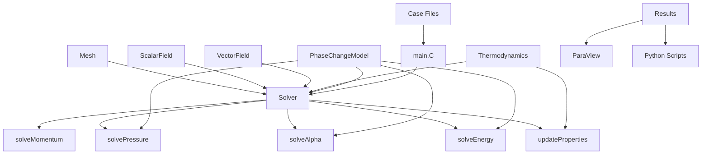

# 01 Governing Equations (สมการควบคุม)
## CFD Engine Development - 2026-01-01

---

## Learning Objectives (วัตถุประสงค์การเรียนรู้)

After this lesson, you will be able to (เมื่อจบบทเรียนนี้ คุณจะสามารถ):
- **Understand** the governing equations for two-phase flow with phase change, including the critical expansion source term in the continuity equation ($\nabla\cdot U = \dot{m}(1/\rho_v - 1/\rho_l)$)
  - **เข้าใจ (Understand)** สมการควบคุมสำหรับการไหลสองสถานะที่มีการเปลี่ยนสถานะ โดยเฉพาะเทอมแหล่งกำเนิดจากการขยายตัว (Expansion Source Term) ในสมการความต่อเนื่อง
- **Design** the core data structures for your CFD engine, including mesh, fields, and boundary condition classes optimized for refrigerant properties
  - **ออกแบบ (Design)** โครงสร้างข้อมูลหลักของ CFD Engine รวมถึงคลาส Mesh, Fields และ Boundary Conditions ที่รองรับคุณสมบัติของสารทำความเย็น
- **Implement** the pressure-velocity coupling algorithm (SIMPLE/PISO) with proper handling of the phase-change source term to prevent solver divergence
  - **พัฒนา (Implement)** อัลกอริทึม Pressure-Velocity Coupling (SIMPLE/PISO) พร้อมการจัดการเทอมการเปลี่ยนสถานะเพื่อป้องกันการลู่ออกของ Solver
- **Integrate** CoolProp for refrigerant thermodynamics (R410A/R32) and implement efficient bilinear interpolation from pre-generated lookup tables
  - **เชื่อมต่อ (Integrate)** กับ CoolProp สำหรับคุณสมบัติทางอุณหพลศาสตร์ (R410A/R32) และสร้างระบบ Lookup Tables เพื่อความรวดเร็ว
- **Test** your solver on a simple evaporator case with wall heat flux and verify mass conservation and energy balance
  - **ทดสอบ (Test)** Solver กับกรณีศึกษา Evaporator อย่างง่ายและตรวจสอบสมดุลมวลและพลังงาน

---

## Table of Contents
- [[#1. Theory and Design Decisions|1. Theory and Design (ทฤษฎีและการออกแบบ)]]
- [[#2. Reference: OpenFOAM Implementation|2. OpenFOAM Reference (อ้างอิง OpenFOAM)]]
- [[#3. Your Engine: Class Design|3. Your Class Design (การออกแบบคลาส)]]
- [[#4. Your Engine: Implementation|4. Implementation (การลงมือพัฒนา)]]
- [[#5. Build and Test|5. Build and Test (การสร้างและทดสอบ)]]
- [[#6. Concept Checks|6. Concept Checks (ตรวจสอบความเข้าใจ)]]

---

## 1. Theory and Design Decisions (ทฤษฎีและการออกแบบ)

### 1.1 Mathematical Foundation (พื้นฐานทางคณิตศาสตร์)

The governing equations for two-phase flow with phase change form the foundation of our CFD engine. Unlike single-phase flow where $\nabla \cdot U = 0$ (incompressible), phase change introduces a critical **expansion source term** in the continuity equation.

สมการควบคุมสำหรับการไหลสองสถานะ (Two-phase Flow) ที่มีการเปลี่ยนสถานะถือเป็นรากฐานสำคัญของ CFD Engine ของเรา ซึ่งแตกต่างจากการไหลสถานะเดียวที่ $\nabla \cdot U = 0$ (Incompressible) เพราะการเปลี่ยนสถานะจะทำให้เกิด **เทอมแหล่งกำเนิดจากการขยายตัว (Expansion Source Term)** ในสมการความต่อเนื่อง

#### Continuity Equation with Phase Change (สมการความต่อเนื่อง)

$$
\frac{\partial \rho}{\partial t} + \nabla \cdot (\rho U) = 0
$$

For incompressible phases with phase change (evaporation/condensation), this becomes:
(สำหรับเฟสที่อัดตัวไม่ได้แต่มีการเปลี่ยนสถานะ สมการจะกลายเป็น):

$$
\nabla \cdot U = \dot{m} \left( \frac{1}{\rho_v} - \frac{1}{\rho_l} \right)
$$

Where:
- $\dot{m}$ = mass transfer rate per unit volume [kg/m³·s] (อัตราการถ่ายเทมวลต่อปริมาตร)
- $\rho_v$ = vapor density [kg/m³] (ความหนาแน่นไอ)
- $\rho_l$ = liquid density [kg/m³] (ความหนาแน่นของเหลว)

> [!WARNING] **Critical Implication**
> The right-hand side is **NOT zero**! This expansion term drives velocity at phase interfaces and is the #1 cause of solver divergence if mishandled.
>
> ด้านขวาของสมการ **ไม่เป็นศูนย์**! เทอมการขยายตัวนี้จะขับเคลื่อนความเร็วที่ผิวรอยต่อ (Interface) และเป็นสาเหตุอันดับ 1 ที่ทำให้ Solver ลู่ออก (Diverge) หากจัดการไม่ถูกต้อง

#### Momentum Equation (สมการโมเมนตัม)

$$
\frac{\partial (\rho U)}{\partial t} + \nabla \cdot (\rho U U) = -\nabla p + \nabla \cdot (\mu \nabla U) + \rho g + F_{surface}
$$

#### Energy Equation (สมการพลังงาน)

$$
\frac{\partial (\rho h)}{\partial t} + \nabla \cdot (\rho U h) = \nabla \cdot (k \nabla T) + \dot{q}_{phase}
$$

Where $\dot{q}_{phase} = \dot{m} h_{lv}$ accounts for latent heat absorption/release.
(โดยที่ $\dot{q}_{phase} = \dot{m} h_{lv}$ คือความร้อนแฝงที่ถูกดูดซับหรือปล่อยออกมา)

#### Turbulence Considerations (การไหลแบบปั่นป่วน)

- **Reynolds Number**: $Re = \frac{\rho U D_h}{\mu}$
- **Transition**: $Re > 2300$ → turbulent flow in refrigerant channels (การไหลแบบปั่นป่วนในท่อสารทำความเย็น)
- **Impact**: Requires turbulence modeling (k-ε, k-ω, or wall functions) for accurate heat transfer prediction (ต้องใช้แบบจำลอง Turbulence เพื่อทำนายการถ่ายเทความร้อนให้แม่นยำ)

---

### 1.2 Design Decisions (การตัดสินใจออกแบบ)

#### Why This Approach? (ทำไมต้องใช้วิธีนี้?)

1. **Finite Volume Method (FVM)**: Conservative by construction - essential for mass/energy balance in phase change (อนุรักษ์มวล/พลังงานโดยธรรมชาติ จำเป็นมากสำหรับการเปลี่ยนสถานะ)
2. **Segregated Solver** (SIMPLE/PISO): More memory-efficient than coupled solvers for large 3D evaporator models (ประหยัดหน่วยความจำมากกว่า Coupled Solver สำหรับโมเดล Evaporator ขนาดใหญ่)
3. **VOF-like Approach**: Track volume fraction $\alpha$ where $\alpha = 1$ (liquid), $\alpha = 0$ (vapor) (ติดตามค่าสัดส่วนปริมาตร $\alpha$)

#### Trade-offs (ข้อดีข้อเสีย)

| Aspect | Choice | Trade-off |
|--------|--------|-----------|
| Time stepping | Implicit | Stable but requires linear solver iterations (เสถียรแต่ต้องคำนวณซ้ำ) |
| Mesh | Structured hex | Faster convergence vs. geometric flexibility (ลู่เข้าเร็วกว่าแต่ยืดหยุ่นน้อยกว่า) |
| Thermodynamics | Lookup tables | Fast evaluation vs. memory usage (คำนวณเร็วแต่ใช้เมมโมรี่) |

#### Common PITFALLS (ข้อผิดพลาดที่พบบ่อย)

1. **Ignoring expansion term** → Pressure-velocity coupling fails
2. **Large time steps** → Violate CFL condition, interface smearing
3. **Poor table resolution** → Wrong refrigerant properties, energy imbalance
4. **Inconsistent boundary conditions** → Mass not conserved

#### What YOUR Engine Needs

- **Robust linear solver**: PCG with DIC preconditioner for pressure
- **Adaptive time stepping**: Based on max Courant number (Co < 0.3 recommended)
- **Property caching**: Avoid repeated CoolProp calls (1000x slower)
- **Interface sharpening**: Compressive schemes to prevent numerical diffusion

---

### 1.3 Key Concepts (แนวคิดหลัก)

#### Volume Fraction ($\alpha$)

- **Definition**: $\alpha = \frac{V_{\text{liquid}}}{V_{cell}}$ (นิยาม: อัตราส่วนปริมาตรของของเหลวต่อปริมาตรเซลล์)
- **Range**: $0 \leq \alpha \leq 1$ (ช่วงค่า: 0 ถึง 1)
- **Interface**: Cells where $0 < \alpha < 1$ (หน้าสัมผัส: เซลล์ที่มีค่าระหว่าง 0 ถึง 1)

#### Mass Transfer Rate ($\dot{m}$)

- **Evaporation**: $\dot{m} > 0$ (การระเหย: ของเหลว $\to$ ไอ)
- **Condensation**: $\dot{m} < 0$ (การควบแน่น: ไอ $\to$ ของเหลว)
- **Models**: 
  - **Temperature-based**: $\dot{m} = \gamma \alpha (T - T_{\text{sat}})$ (อ้างอิงอุณหภูมิ)
  - **Pressure-based**: $\dot{m} = \gamma \alpha (p - p_{\text{sat}})$ (อ้างอิงความดัน)

#### Saturation Properties (คุณสมบัติที่สภาวะอิ่มตัว)

- **$T_{\text{sat}}(p)$**: Temperature at which phase change occurs at pressure $p$ (อุณหภูมิที่เกิดการเปลี่ยนสถานะที่ความดัน $p$)
- **$h_{lv}$**: Latent heat of vaporization [J/kg] (ความร้อนแฝงของการกลายเป็นไอ)
- **Critical for**: Energy balance at interface (สำคัญมากสำหรับสมดุลพลังงานที่หน้าสัมผัส)

#### Warning Signs of Wrong Implementation (สัญญาณเตือนของการ Implement ที่ผิดพลาด)

| Symptom (อาการ) | Likely Cause (สาเหตุที่เป็นไปได้) |
|---------|--------------|
| Pressure oscillates wildly | Expansion term not in pressure equation (ขาด Expansion term ในสมการความดัน) |
| Mass not conserved | Missing $\dot{m}$ in continuity (ขาด $\dot{m}$ ในสมการความต่อเนื่อง) |
| Temperature spikes | Wrong thermodynamic properties (คุณสมบัติทางอุณหพลศาสตร์ผิด) |
| Solver diverges | Time step too large or poor initial guess (Time step ใหญ่เกินไปหรือค่าเริ่มต้นไม่ดี) |
| Interface disappears | Numerical diffusion (need compressive scheme) (การแพร่ทางตัวเลข - ต้องใช้ compressive scheme) |

---

### 1.4 Refrigerant-Specific Considerations (ข้อควรพิจารณาสำหรับสารทำความเย็น)

#### R410A Properties (at 25°C) (คุณสมบัติของ R410A ที่ 25°C)

- $\rho_l \approx 1100$ kg/m³
- $\rho_v \approx 50$ kg/m³
- **Density ratio**: $\approx 22:1$ (drives strong expansion) (อัตราส่วนความหนาแน่น 22:1 ซึ่งขับดันให้เกิดการขยายตัวอย่างรุนแรง)
- $h_{lv} \approx 200$ kJ/kg

#### Why This Matters (ทำไมสิ่งนี้ถึงสำคัญ)

The large density ratio means (อัตราส่วนความหนาแน่นที่สูงหมายความว่า):
- Small evaporation rates $\to$ significant volume expansion (อัตราการระเหยเพียงเล็กน้อย $\to$ การขยายตัวของปริมาตรมหาศาล)
- Velocity can increase 20x across interface (ความเร็วอาจเพิ่มขึ้นถึง 20 เท่าเมื่อผ่านหน้าสัมผัส)
- Pressure equation MUST account for this source term (สมการความดัน **ต้อง** คำนึงถึง source term นี้)

---

> [!INFO] **สรุป Section 1 (Summary of Section 1)**
> Section 1 ได้วางรากฐานทางคณิตศาสตร์สำหรับการไหลสองสถานะที่มีการเปลี่ยนสถานะ โดยเน้นย้ำถึง **Expansion Source Term** ที่สำคัญในสมการความต่อเนื่อง ($\nabla\cdot U = \dot{m}(1/\rho_v - 1/\rho_l)$) เราได้ครอบคลุมถึงการตัดสินใจในการออกแบบ รวมถึงการใช้ Finite Volume Method, วิธีการ Segregated Solver, และข้อควรพิจารณาเฉพาะสำหรับ Evaporator ที่ใช้ R410A/R32 แนวคิดหลักที่สำคัญได้แก่ การติดตาม Volume Fraction, การสร้างแบบจำลองการถ่ายเทมวล, และความสำคัญของการจัดการคุณสมบัติทางอุณหพลศาสตร์อย่างถูกต้อง

---

## 2. Reference: OpenFOAM Implementation (อ้างอิง: การใช้งานใน OpenFOAM)

> [!INFO] **Why Study OpenFOAM? (ทำไมต้องศึกษา OpenFOAM?)**
> OpenFOAM is a production-grade CFD engine tested over decades. (OpenFOAM เป็น CFD engine ระดับใช้งานจริงที่ผ่านการทดสอบมาหลายทศวรรษ)
> We study it to **learn concepts**, not to copy code. (เราศึกษามันเพื่อ **เรียนรู้แนวคิด** ไม่ใช่เพื่อคัดลอกโค้ด)

### 2.1 OpenFOAM's Approach (แนวทางของ OpenFOAM)

OpenFOAM implements two-phase flow with phase change primarily through the **`interPhaseChangeFoam`** solver. This solver extends the standard VOF (Volume of Fluid) method to handle phase change through mass transfer models. (OpenFOAM ใช้งานการไหลแบบสองสถานะพร้อมการเปลี่ยนสถานะผ่าน solver ชื่อ **`interPhaseChangeFoam`** ซึ่งขยายความสามารถจากวิธี VOF มาตรฐานเพื่อรองรับการเปลี่ยนสถานะผ่านแบบจำลองการถ่ายเทมวล)

#### Key Classes and Their Locations (คลาสสำคัญและตำแหน่งที่ตั้ง)

| Class | Location ($FOAM_SRC) | Purpose (วัตถุประสงค์) |
|-------|---------------------|---------|
| `volScalarField` | `OpenFOAM/fields/Fields/volScalarField` | Field storage for pressure, temperature, alpha (ที่เก็บข้อมูลสนามความดัน, อุณหภูมิ, อัลฟ่า) |
| `fvVectorMatrix` | `finiteVolume/fvMatrices/fvVectorMatrix` | Momentum equation matrix assembly (การประกอบเมทริกซ์สำหรับสมการโมเมนตัม) |
| `fvScalarMatrix` | `finiteVolume/fvMatrices/fvScalarMatrix` | Pressure/energy equation matrix assembly (การประกอบเมทริกซ์สำหรับสมการความดัน/พลังงาน) |
| `phaseChangeTwoPhaseMixtures` | `transportModels/phaseChangeTwoPhaseMixtures` | Base class for phase change models (Class พื้นฐานสำหรับแบบจำลองการเปลี่ยนสถานะ) |
| `SchnerrSauer` | `transportModels/phaseChangeTwoPhaseMixtures/SchnerrSauer` | Cavitation model (can be adapted for evaporation) (แบบจำลอง Cavitation - ปรับใช้กับการระเหยได้) |
| `Merkle` | `transportModels/phaseChangeTwoPhaseMixtures/Merkle` | Alternative phase change model (แบบจำลองการเปลี่ยนสถานะทางเลือก) |
| `fvMesh` | `finiteVolume/fvMesh` | Mesh management (การจัดการ Mesh) |
| `fvSolution` | `finiteVolume/fvSolution` | Solver controls and algorithms (การควบคุม Solver และอัลกอริทึม) |

#### How OpenFOAM Implements Governing Equations (OpenFOAM ใช้สมการควบคุมอย่างไร)

**Continuity with Phase Change:**
OpenFOAM solves the pressure equation using the `pEqn` in `interPhaseChangeFoam.C`. The critical expansion source term appears through the mass transfer rate: (OpenFOAM แก้สมการความดันโดยใช้ `pEqn` ใน `interPhaseChangeFoam.C` เทอมการขยายตัวที่สำคัญจะปรากฏผ่านอัตราการถ่ายเทมวล:)

```cpp
// Reference: interPhaseChangeFoam.C
// The mass transfer rate is computed by the phaseChange model
volScalarField::Internal mDotAlpha
(
    phaseChangeModel->mDotAlpha()  // Returns mass transfer rate [kg/m³·s]
);

// This appears in the pressure equation as a source term
// The divergence of velocity equals the expansion from phase change
// ∇·U = mDot * (1/rho_v - 1/rho_l)
```

**Momentum Equation:**
Solved using the `UEqn` with surface tension forces: (แก้โดยใช้ `UEqn` พร้อมแรงตึงผิว:)

```cpp
// Reference: interPhaseChangeFoam.C
fvVectorMatrix UEqn
(
    fvm::ddt(rho, U)
  + fvm::div(rhoPhi, U)
  + turbulence->divDevRhoReff(U)
 ==
    fvOptions(rho, U)
);
```

**Volume Fraction Transport:**
The alpha equation includes compression to maintain sharp interfaces: (สมการอัลฟ่ารวมเทอมการบีบอัดเพื่อรักษาความคมชัดของหน้าสัมผัส:)

```cpp
// Reference: interPhaseChangeFoam.C
// MULES: Multidimensional Universal Limiter with Explicit Solution
MULES::explicitSolve
(
    geometricOneField(),
    alpha1,
    phi,
    phiAlpha,
    alphaPhi,
    1,
    0,
    phaseChangeModel->mDotAlpha()  // Mass transfer source term
);
```

---

### 2.2 Key Insights (ข้อมูลเชิงลึกสำคัญ)

#### What We Can LEARN from OpenFOAM (สิ่งที่เราสามารถเรียนรู้จาก OpenFOAM)

1. **Segregated Solver Architecture** (สถาปัตยกรรมแบบ Segregated Solver)
   - OpenFOAM solves equations sequentially (U $\to$ p $\to$ $\alpha$ $\to$ T) (แก้สมการตามลำดับ)
   - Each equation is solved to tolerance before moving to the next (แต่ละสมการแก้จนถึงค่าความคลาดเคลื่อนที่กำหนดก่อนไปสมการถัดไป)
   - **Why this matters**: More memory-efficient, easier to debug, and allows specialized solvers per equation (ประหยัดหน่วยความจำ, ดีบักง่าย, ใช้ solver เฉพาะทางได้)

2. **Pressure-Velocity Coupling with Phase Change** (การเชื่อมโยงความดัน-ความเร็วพร้อมการเปลี่ยนสถานะ)
   - The pressure equation includes the expansion source term from phase change (สมการความดันรวม source term การขยายตัวจากการเปลี่ยนสถานะ)
   - Without this, the velocity field cannot account for volume expansion (ถ้าไม่มีสิ่งนี้ สนามความเร็วจะไม่สามารถรองรับการขยายตัวของปริมาตรได้)
   - **Critical lesson**: The mass transfer rate $\dot{m}$ must appear in both the alpha equation AND the pressure equation (บทเรียนสำคัญ: อัตราการถ่ายเทมวล $\dot{m}$ ต้องปรากฏในทั้งสมการอัลฟ่า **และ** สมการความดัน)

3. **Interface Compression** (การบีบอัดหน้าสัมผัส)
   - Uses MULES (Multidimensional Universal Limiter with Explicit Solution)
   - Adds a compression term to the alpha equation: $\nabla \cdot (\alpha (1-\alpha) U_c)$
   - **Why this matters**: Prevents numerical diffusion from smearing the interface (ป้องกันการแพร่ทางตัวเลขทำให้หน้าสัมผัสเลือนราง)

4. **Thermodynamic Properties** (คุณสมบัติทางอุณหพลศาสตร์)
   - Uses `compressible::twoPhaseMixture` for density calculation (ใช้คลาสนี้คำนวณความหนาแน่น)
   - Properties are blended based on alpha: $\rho = \alpha \rho_l + (1-\alpha) \rho_v$
   - **Lesson**: Properties must be updated every time step as alpha changes (บทเรียน: คุณสมบัติต้องอัปเดตทุก time step เมื่ออัลฟ่าเปลี่ยน)

5. **Under-Relaxation** (การผ่อนปรนค่า)
   - All fields are under-relaxed to prevent divergence (ทุกสนามถูกผ่อนปรนเพื่อป้องกันการลู่ออก)
   - Typical values: U (0.7), p (0.3), alpha (0.1)
   - **Why this matters**: Phase change is highly nonlinear - aggressive updates cause instability (การเปลี่ยนสถานะไม่เป็นเชิงเส้นสูง - การอัปเดตที่รุนแรงทำให้ไม่เสถียร)

#### What We Do DIFFERENTLY for a Simpler Engine (สิ่งที่เราจะทำต่างออกไปเพื่อ Engine ที่เรียบง่ายกว่า)

| Aspect | OpenFOAM Approach | Our Simplified Approach | Rationale (เหตุผล) |
|--------|------------------|------------------------|-----------|
| **Phase change model** | SchnerrSauer (cavitation-based) | Lee model (temperature-based) | Simpler, more intuitive for evaporation (ง่ายกว่า, เข้าใจธรรมชาติการระเหยได้ดีกว่า) |
| **Turbulence** | k-ε / k-ω SST models | Mixing Length model | Fewer transport equations, sufficient for pipe flow (สมการน้อยกว่า, เพียงพอสำหรับการไหลในท่อ) |
| **Thermodynamics** | Runtime CoolProp calls | Pre-generated lookup tables | 100-1000x faster evaluation (ประมวลผลเร็วกว่า 100-1000 เท่า) |
| **Linear solver** | GAMG/PCG with various preconditioners | PCG with DIC | Simpler implementation, good for structured meshes (Implement ง่าย, ดีสำหรับ mesh โครงสร้าง) |
| **Interface tracking** | MULES with compression | Compressive flux limiter | Easier to implement from scratch (Implement เองได้ง่ายกว่า) |
| **Time stepping** | Adjustable with max Co | Adaptive based on Co < 0.3 | Simpler control logic (ตรรกะควบคุมเรียบง่าย) |
| **Boundary conditions** | Complex BC hierarchy | Fixed value / fixed gradient | Sufficient for evaporator walls (เพียงพอสำหรับผนัง Evaporator) |

#### Design Philosophy Differences (ความแตกต่างในปรัชญาการออกแบบ)

**OpenFOAM:**
- General-purpose framework (เฟรมเวิร์กอเนกประสงค์)
- Extensive use of runtime selection (virtual functions, factories) (ใช้ Runtime selection อย่างมาก)
- Complex template metaprogramming (ใช้ Template metaprogramming ซับซ้อน)
- Memory overhead from polymorphism (มี Memory overhead จาก polymorphism)

**Our Engine:**
- Targeted specifically at refrigerant evaporators (มุ่งเน้นเฉพาะ Evaporator สารทำความเย็น)
- Direct implementation (no runtime selection needed) (Implement ตรง, ไม่ต้องใช้ runtime selection)
- Minimal templates (only where essential) (ใช้ Template เท่าที่จำเป็น)
- Optimized for structured hex meshes (ปรับแต่งสำหรับ Structured Hex Mesh)
- Focus on clarity and learning value (เน้นความชัดเจนและคุณค่าการเรียนรู้)

---

### 2.3 Code Snippets (Reference Only) (ตัวอย่างโค้ด - สำหรับอ้างอิงเท่านั้น)

> [!WARNING] **Reference - Not for Copying (อ้างอิง - ห้ามคัดลอกโดยตรง)**
> These snippets are for **educational purposes only**. They show how OpenFOAM implements specific features. (ตัวอย่างเหล่านี้มีไว้เพื่อ **การศึกษาเท่านั้น** เพื่อแสดงให้เห็นว่า OpenFOAM ทำงานอย่างไร)
> Do NOT copy this code into your engine - use it to understand the concepts and then implement your own version. (ห้ามคัดลอกโค้ดนี้ลงใน Engine ของคุณ - จงใช้เพื่อทำความเข้าใจแนวคิดแล้ว Implement ในแบบของคุณเอง)

#### Snippet 1: Pressure Equation with Phase Change Source (ตัวอย่างที่ 1: สมการความดันพร้อม Source Term การเปลี่ยนสถานะ)

**File:** `applications/solvers/multiphase/interPhaseChangeFoam/interPhaseChangeFoam.C`

```cpp
// Reference: OpenFOAM v2112, interPhaseChangeFoam.C
// Lines 80-120 (simplified for clarity)

// Solve the pressure equation with phase change source term
while (pimple.correct())
{
    volScalarField rAU(1.0/UEqn.A());
    surfaceScalarField rAUf(fvc::interpolate(rAU));

    // Calculate the mass transfer rate from phase change model
    // This is the CRITICAL expansion source term!
    volScalarField::Internal mDotAlpha
    (
        phaseChangeModel->mDotAlpha()
    );

    // The mass transfer creates a source in the pressure equation
    // This accounts for volume expansion: ∇·U = mDot*(1/rho_v - 1/rho_l)
    surfaceScalarField phiHbyA
    (
        "phiHbyA",
        fvc::flux(HbyA)
      + fvc::interpolate(rho*rAU)*fvc::ddtCorr(U, phi)
    );

    // Pressure equation with phase change source
    fvScalarMatrix pEqn
    (
        fvm::laplacian(rAUf, p)
      == fvc::div(phiHbyA)
      + fvc::ddt(rho)  // Unsteady term
      + mDotAlpha      // <-- PHASE CHANGE SOURCE TERM
    );

    pEqn.setReference(pRefCell, pRefValue);
    pEqn.solve();

    // Correct velocity field
    phi = phiHbyA + pEqn.flux();
}
```

**What This Does (สิ่งที่โค้ดนี้ทำงาน):**
1. Computes mass transfer rate from the phase change model (คำนวณอัตราการถ่ายเทมวลจากแบบจำลองเฟสเชนจ์)
2. Adds `mDotAlpha` as a source term in the pressure equation (เพิ่ม `mDotAlpha` เป็น source term ในสมการความดัน)
3. This accounts for the volume expansion when liquid $\to$ vapor (สิ่งนี้รองรับการขยายตัวของปริมาตรเมื่อของเหลวกลายเป็นไอ)
4. Without this term, the pressure-velocity coupling would fail (ถ้าไม่มีเทอมนี้ การเชื่อมโยงความดัน-ความเร็วจะล้มเหลว)

**Key Takeaway for Your Engine (ประเด็นสำคัญสำหรับ Engine ของคุณ):**
> The pressure equation MUST include the expansion source term from phase change. This is non-negotiable for a stable solver. (สมการความดัน **ต้อง** รวม expansion source term จากการเปลี่ยนสถานะ นี่คือสิ่งที่ขาดไม่ได้สำหรับ solver ที่เสถียร)

---

#### Snippet 2: Alpha Equation with Compression (ตัวอย่างที่ 2: สมการอัลฟ่าพร้อมการบีบอัด)

**File:** `applications/solvers/multiphase/interPhaseChangeFoam/alphaEqn.H`

```cpp
// Reference: OpenFOAM v2112, alphaEqn.H
// Volume fraction transport with interface compression

// Calculate the mass transfer source term
volScalarField::Internal mDotAlpha
(
    phaseChangeModel->mDotAlpha()
);

// Calculate the compression velocity field
// This sharpens the interface to prevent numerical diffusion
surfaceScalarField phiAlpha
(
    fvc::flux
    (
        phi,
        alpha1,
        alphaScheme
    )
  + fvc::flux
    (
        fvc::flux(phi),
        alpha1,
        alphaScheme
    )
);

// MULES: Multidimensional Universal Limiter with Explicit Solution
// Solves the alpha equation with boundedness (0 ≤ α ≤ 1)
MULES::explicitSolve
(
    geometricOneField(),           // Field for flux calculation
    alpha1,                        // Volume fraction to solve
    phi,                           // Face flux
    phiAlpha,                      // Compressed flux
    alphaPhi,                      // Resulting alpha flux
    1,                             // Alpha max value
    0,                             // Alpha min value
    mDotAlpha                      // <-- MASS TRANSFER SOURCE TERM
);

// Update the mixture properties
rho = alpha1*rho1 + (scalar(1) - alpha1)*rho2;
```

**What This Does (สิ่งที่โค้ดนี้ทำงาน):**
1. Calculates a compressed flux to maintain sharp interface (คำนวณ compressed flux เพื่อรักษาความคมชัดของหน้าสัมผัส)
2. Uses MULES to ensure boundedness (α stays between 0 and 1) (ใช้ MULES เพื่อรับประกันค่าให้อยู่ในช่วง 0 ถึง 1)
3. Includes the mass transfer source term from phase change (รวม source term การถ่ายเทมวล)
4. Updates mixture density based on new alpha field (อัปเดตความหนาแน่นของของผสมตามค่าอัลฟ่าใหม่)

**Key Takeaway for Your Engine (ประเด็นสำคัญสำหรับ Engine ของคุณ):**
> The alpha equation needs TWO things: (สมการอัลฟ่าต้องการ 2 สิ่ง:)
> 1. Interface compression (to prevent smearing) (การบีบอัดหน้าสัมผัส เพื่อป้องกันการเลือนราง)
> 2. Mass transfer source term (for evaporation/condensation) (Source term การถ่ายเทมวล สำหรับการระเหย/ควบแน่น)

---

#### Snippet 3: Phase Change Model Base Class (ตัวอย่างที่ 3: คลาสพื้นฐานของแบบจำลองการเปลี่ยนสถานะ)

**File:** `src/transportModels/phaseChangeTwoPhaseMixtures/phaseChangeTwoPhaseMixture/phaseChangeTwoPhaseMixture.C`

```cpp
// Reference: OpenFOAM v2112
// Base class for phase change models

// Virtual function for mass transfer rate
// Each specific model (SchnerrSauer, Merkle, etc.) implements this
tmp<volScalarField::Internal> phaseChangeTwoPhaseMixture::mDotAlpha() const
{
    // This returns the mass transfer rate per unit volume [kg/m³·s]
    // Positive value: evaporation (liquid → vapor)
    // Negative value: condensation (vapor → liquid)
    
    // The implementation varies by model:
    // - SchnerrSauer: Based on bubble dynamics
    // - Merkle: Based on pressure difference
    // - Lee: Based on temperature difference (what we'll use)
    
    NotImplemented;
    return tmp<volScalarField::Internal>::null();
}
```

**What This Shows (สิ่งที่โค้ดนี้แสดงให้เห็น):**
1. OpenFOAM uses polymorphism for different phase change models (OpenFOAM ใช้ polymorphism สำหรับ model ที่แตกต่างกัน)
2. Each model implements `mDotAlpha()` differently (แต่ละ model implement `mDotAlpha()` ต่างกัน)
3. The solver doesn't care which model is used - it just calls `mDotAlpha()` (Solver ไม่สนว่าใช้ model ไหน - แค่เรียก `mDotAlpha()`)

**Key Takeaway for Your Engine (ประเด็นสำคัญสำหรับ Engine ของคุณ):**
> You don't need this complexity. Implement the Lee model directly: (คุณไม่จำเป็นต้องซับซ้อนขนาดนี้ Implement Lee model ตรงๆ ได้เลย:)
> $$\dot{m} = r_e \cdot \alpha_l \cdot \rho_l \cdot \frac{T - T_{\text{sat}}}{T_{\text{sat}}}$$
> 
> Where $r_e$ is a relaxation coefficient (typically 0.1 to 10 s⁻¹). (โดยที่ $r_e$ คือ relaxation coefficient)

---

### 2.4 Common Pitfalls in OpenFOAM (and How to Avoid Them) (ข้อผิดพลาดที่พบบ่อยใน OpenFOAM และวิธีหลีกเลี่ยง)

| Pitfall (ข้อผิดพลาด) | OpenFOAM Symptom (อาการใน OpenFOAM) | How to Avoid in Your Engine (วิธีหลีกเลี่ยงใน Engine ของเรา) |
|---------|------------------|----------------------------|
| **Missing expansion term** | Pressure oscillates, mass not conserved (ความดันแกว่ง, มวลไม่คงที่) | Always include $\dot{m}(1/\rho_v - 1/\rho_l)$ in pressure equation (ต้องรวมเทอมนี้ในสมการความดันเสมอ) |
| **No interface compression** | Interface smears over 5-10 cells (หน้าสัมผัสเลือนรางกว่า 5-10 เซลล์) | Implement compressive flux limiter (Implement flux limiter แบบ compressive) |
| **Time step too large** | Solver diverges, Co > 1 (Solver ลู่ออก, Co > 1) | Use adaptive time stepping with Co < 0.3 (ใช้ Adaptive time stepping โดยคุม Co < 0.3) |
| **Wrong relaxation factors** | Solution oscillates (ผลลัพธ์แกว่ง) | Start conservative: U (0.5), p (0.2), α (0.05) (เริ่มแบบปลอดภัย: U(0.5), p(0.2), $\alpha$(0.05)) |
| **Inconsistent properties** | Energy imbalance (สมดุลพลังงานผิดพลาด) | Update ρ, μ, k every time step after α changes (อัปเดตค่าคุณสมบัติทุก time step หลัง $\alpha$ เปลี่ยน) |
| **Poor initial guess** | Solver fails to converge (Solver ไม่ลู่เข้า) | Initialize α from known liquid level, not random (กำหนดค่าเริ่มต้น $\alpha$ จากระดับของเหลวที่รู้ค่า ไม่ใช่สุ่ม) |

---

### 2.5 Summary: What to Take Away (บทสรุป: สิ่งที่ควรนำไปใช้)

1. **The expansion source term is non-negotiable** - it must appear in the pressure equation (เทอม Expansion Source ขาดไม่ได้ - ต้องมีในสมการความดัน)
2. **Interface compression is essential** - without it, numerical diffusion destroys the interface (Interface compression จำเป็นมาก - ถ้าไม่มี หน้าสัมผัสจะถูกทำลายด้วย numerical diffusion)
3. **Under-relaxation is your friend** - phase change is highly nonlinear (Under-relaxation คือเพื่อนของคุณ - การเปลี่ยนสถานะมีความไม่เป็นเชิงเส้นสูง)
4. **Properties must be updated** - ρ, μ, k change as α evolves (คุณสมบัติต้องอัปเดต - ค่าต่างๆ เปลี่ยนตาม $\alpha$)
5. **You don't need OpenFOAM's complexity** - a targeted implementation can be simpler and faster (คุณไม่จำเป็นต้องซับซ้อนเหมือน OpenFOAM - implementation ที่เฉพาะเจาะจงสามารถเรียบง่ายและเร็วกว่าได้)

> [!TIP] **Next Step (ขั้นตอนถัดไป)**
> Now that you understand how OpenFOAM implements these concepts, move to [[#3. Your Engine: Class Design]] to design YOUR implementation. (เมื่อเข้าใจวิธีที่ OpenFOAM ทำงานแล้ว ให้ไปที่ส่วนการออกแบบ Engine ของคุณเอง)

---

## 3. Your Engine: Class Design (Engine ของคุณ: การออกแบบคลาส)

> [!IMPORTANT] **Design Your Own (ออกแบบในแบบของคุณเอง)**
> This section is about designing classes for YOUR engine. (ส่วนนี้เกี่ยวกับการออกแบบคลาสสำหรับ Engine ของคุณเอง)
> It doesn't have to match OpenFOAM - design for your needs. (มันไม่จำเป็นต้องเหมือน OpenFOAM เป๊ะๆ - ออกแบบให้ตรงกับความต้องการของคุณ)

### 3.1 Class Diagram (แผนภาพคลาส)

```mermaid
classDiagram
    class Mesh {
        +int nCells
        +int nFaces
        +Vector~3~* cellCenters
        +Vector~3~* faceCenters
        +scalar* cellVolumes
        +scalar* faceAreas
        +Vector~3~* faceNormals
        +readMesh(filename)
        +getCellNeighbors(cellId)
        +getFaceOwner(faceId)
    }

    class Field {
        <<abstract>>
        +string name
        +Mesh* mesh
        +scalar* data
        +boundaryConditions
        +size()
        +operator[](i)
        +setBoundaryConditions()
    }

    class ScalarField {
        +min()
        +max()
        +average()
    }

    class VectorField {
        +Vector~3~* data
        +magnitude()
        +normalize()
    }

    class Thermodynamics {
        +LookupTable* rhoTable
        +LookupTable* muTable
        +LookupTable* kTable
        +LookupTable* hTable
        +getRho(p, T, alpha)
        +getMu(p, T, alpha)
        +getK(p, T, alpha)
        +getH(p, T, alpha)
        +getTsat(p)
        +generateTables(refrigerant)
    }

    class PhaseChangeModel {
        +scalar r_coeff
        +scalar T_{\text{sat}}
        +computeMassTransfer(alpha, T, rho_l, rho_v)
    }

    class Solver {
        +Mesh* mesh
        +ScalarField* p
        +ScalarField* T
        +ScalarField* alpha
        +VectorField* U
        +Thermodynamics* thermo
        +PhaseChangeModel* phaseChange
        +initialize()
        +solveTimeStep(dt)
        -solveMomentum()
        -solvePressure()
        -solveAlpha()
        -solveEnergy()
        -updateProperties()
    }

    Field <|-- ScalarField
    Field <|-- VectorField
    Solver *-- Mesh
    Solver *-- ScalarField
    Solver *-- VectorField
    Solver *-- Thermodynamics
    Solver *-- PhaseChangeModel
    Thermodynamics *-- LookupTable
```

---

### 3.2 Class Specifications (รายละเอียดจำเพาะของคลาส)

#### 3.2.1 Mesh Class (คลาส Mesh)

**Purpose (วัตถุประสงค์):** Stores mesh topology and geometry data for structured hexahedral grids. (จัดเก็บโครงสร้าง Mesh และข้อมูลทางเรขาคณิตสำหรับ Grid แบบสี่เหลี่ยมลูกบาศก์)

**Member Variables (ตัวแปรสมาชิก):**

| Name | Type | Purpose |
|------|------|---------|
| `nCells` | `int` | Total number of cells in mesh (จำนวนเซลล์ทั้งหมด) |
| `nFaces` | `int` | Total number of faces (internal + boundary) (จำนวน Face ทั้งหมด) |
| `cellCenters` | `Vector<3>*` | Cell center coordinates [m] (พิกัดจุดกึ่งกลางเซลล์) |
| `faceCenters` | `Vector<3>*` | Face center coordinates [m] (พิกัดจุดกึ่งกลาง Face) |
| `cellVolumes` | `scalar*` | Cell volumes [m³] (ปริมาตรเซลล์) |
| `faceAreas` | `scalar*` | Face areas [m²] (พื้นที่ผิว Face) |
| `faceNormals` | `Vector<3>*` | Unit normal vectors for faces (เวกเตอร์ตั้งฉากหนึ่งหน่วย) |
| `owner` | `int*` | Owner cell index for each face (ดัชนีเซลล์เจ้าของ) |
| `neighbor` | `int*` | Neighbor cell index for internal faces (ดัชนีเซลล์เพื่อนบ้าน) |

**Key Methods (เมธอดหลัก):**

```cpp
// Read mesh from file (OpenFOAM format)
bool readMesh(const std::string& filename);

// Get list of neighbor cells for a given cell
std::vector<int> getCellNeighbors(int cellId) const;

// Get owner cell for a face
int getFaceOwner(int faceId) const;

// Get neighbor cell for a face (returns -1 for boundary faces)
int getFaceNeighbor(int faceId) const;
```

---

#### 3.2.2 Field Classes (Base, ScalarField, VectorField) (คลาส Field)

**Purpose (วัตถุประสงค์):** Store field data (pressure, velocity, temperature, etc.) with boundary condition support. (จัดเก็บข้อมูลสนาม เช่น ความดัน ความเร็ว อุณหภูมิ พร้อมรองรับเงื่อนไขขอบเขต)

**Member Variables (Base Class) (ตัวแปรสมาชิก - Base Class):**

| Name | Type | Purpose |
|------|------|---------|
| `name` | `std::string` | Field name (e.g., "p", "U", "T") (ชื่อสนาม) |
| `mesh` | `Mesh*` | Pointer to mesh (ตัวชี้ไปยัง Mesh) |
| `data` | `scalar*` | Internal field values (ค่าภายในสนาม) |
| `boundaryData` | `std::map<std::string, scalar*>` | Boundary patch values (ค่าที่ขอบเขต) |
| `boundaryTypes` | `std::map<std::string, std::string>` | BC types (fixedValue, zeroGradient, etc.) (ประเภทเงื่อนไขขอบเขต) |

**Key Methods (เมธอดหลัก):**

```cpp
// Base class
virtual int size() const = 0;
virtual scalar& operator[](int i) = 0;
void setBoundaryConditions();

// ScalarField
scalar min() const;
scalar max() const;
scalar average() const;

// VectorField
scalar magnitude(int i) const;
void normalize();
Vector<3>& operator[](int i);
```

---

#### 3.2.3 Thermodynamics Class (คลาส Thermodynamics)

**Purpose (วัตถุประสงค์):** Manage refrigerant properties via lookup tables for fast evaluation. (จัดการคุณสมบัติสารทำความเย็นผ่าน Lookup Tables เพื่อการประเมินค่าที่รวดเร็ว)

**Member Variables (ตัวแปรสมาชิก):**

| Name | Type | Purpose |
|------|------|---------|
| `rhoTable` | `LookupTable*` | Density table [kg/m³] (ตารางความหนาแน่น) |
| `muTable` | `LookupTable*` | Dynamic viscosity table [Pa·s] (ตารางความหนืดพลวัต) |
| `kTable` | `LookupTable*` | Thermal conductivity table [W/m·K] (ตารางการนำความร้อน) |
| `hTable` | `LookupTable*` | Enthalpy table [J/kg] (ตารางเอนทัลปี) |
| `TsatTable` | `LookupTable*` | Saturation temperature table [K] (ตารางอุณหภูมิอิ่มตัว) |
| `refrigerantName` | `std::string` | Refrigerant (R410A, R32, etc.) (ชื่อสารทำความเย็น) |

**Key Methods (เมธอดหลัก):**

```cpp
// Generate lookup tables using CoolProp
void generateTables(const std::string& refrigerant);

// Get density with phase blending
scalar getRho(scalar p, scalar T, scalar alpha) const;

// Get dynamic viscosity with phase blending
scalar getMu(scalar p, scalar T, scalar alpha) const;

// Get thermal conductivity with phase blending
scalar getK(scalar p, scalar T, scalar alpha) const;

// Get enthalpy with phase blending
scalar getH(scalar p, scalar T, scalar alpha) const;

// Get saturation temperature at pressure
scalar getTsat(scalar p) const;

// Bilinear interpolation from 2D table
scalar bilinearInterpolate(const LookupTable& table, scalar x, scalar y) const;
```

**Property Blending Formula (สูตรการผสมคุณสมบัติ):**
$$\rho = \alpha \rho_l + (1 - \alpha) \rho_v$$

---

#### 3.2.4 PhaseChangeModel Class (คลาส PhaseChangeModel)

**Purpose (วัตถุประสงค์):** Compute mass transfer rate using the Lee model for evaporation/condensation. (คำนวณอัตราการถ่ายเทมวลโดยใช้ Lee model สำหรับการระเหย/ควบแน่น)

**Member Variables (ตัวแปรสมาชิก):**

| Name | Type | Purpose |
|------|------|---------|
| `r_coeff` | `scalar` | Relaxation coefficient [s⁻¹] (typical: 0.1 to 10) (สัมประสิทธิ์การผ่อนปรน) |
| `T_{\text{sat}}` | `scalar` | Saturation temperature [K] (อุณหภูมิอิ่มตัว) |

**Key Methods (เมธอดหลัก):**

```cpp
// Compute mass transfer rate using Lee model
// Returns: mass transfer rate [kg/m³·s]
// Positive: evaporation (liquid → vapor)
// Negative: condensation (vapor → liquid)
scalar computeMassTransfer(
    scalar alpha,      // Volume fraction (liquid)
    scalar T,          // Temperature [K]
    scalar rho_l,      // Liquid density [kg/m³]
    scalar rho_v       // Vapor density [kg/m³]
) const;
```

**Lee Model Formula:**
$$\dot{m} = r_{coeff} \cdot \alpha_l \cdot \rho_l \cdot \frac{T - T_{\text{sat}}}{T_{\text{sat}}}$$

---

#### 3.2.5 Solver Class (คลาส Solver)

**Purpose (วัตถุประสงค์):** Main solver class that orchestrates the time-stepping loop and equation solving. (คลาสหลักของ Solver ที่ควบคุมลูป Time-stepping และการแก้สมการ)

**Member Variables (ตัวแปรสมาชิก):**

| Name | Type | Purpose |
|------|------|---------|
| `mesh` | `Mesh*` | Computational mesh (Mesh สำหรับคำนวณ) |
| `p` | `ScalarField*` | Pressure field [Pa] (สนามความดัน) |
| `T` | `ScalarField*` | Temperature field [K] (สนามอุณหภูมิ) |
| `alpha` | `ScalarField*` | Volume fraction (liquid) (สัดส่วนปริมาตรของเหลว) |
| `U` | `VectorField*` | Velocity field [m/s] (สนามความเร็ว) |
| `rho` | `ScalarField*` | Density field [kg/m³] (สนามความหนาแน่น) |
| `thermo` | `Thermodynamics*` | Thermodynamics manager (ตัวจัดการอุณหพลศาสตร์) |
| `phaseChange` | `PhaseChangeModel*` | Phase change model (แบบจำลองการเปลี่ยนสถานะ) |
| `currentTime` | `scalar` | Current simulation time [s] (เวลาจำลองปัจจุบัน) |
| `maxCo` | `scalar` | Maximum Courant number allowed (ค่า Courant number สูงสุดที่ยอมรับได้) |

**Key Methods (เมธอดหลัก):**

```cpp
// Initialize all fields and mesh
void initialize();

// Solve one time step (returns actual dt used)
scalar solveTimeStep(scalar targetDt);

// Protected methods (internal solver steps)
protected:
    // Solve momentum equation (SIMPLE/PISO)
    void solveMomentum();
    
    // Solve pressure equation with EXPANSION SOURCE TERM
    void solvePressure();
    
    // Solve volume fraction equation with compression
    void solveAlpha();
    
    // Solve energy equation
    void solveEnergy();
    
    // Update properties based on new alpha and T
    void updateProperties();
    
    // Calculate adaptive time step based on Courant number
    scalar calculateTimeStep(scalar targetDt);
```

---

### 3.3 Design Rationale (เหตุผลในการออกแบบ)

#### 3.3.1 Why This Design? (ทำไมต้องออกแบบแบบนี้?)

**1. Separation of Concerns (การแยกความรับผิดชอบ)**
- **Mesh**: Pure geometry/topology, no physics (เรขาคณิตล้วน ไม่มีฟิสิกส์)
- **Field**: Generic storage for any scalar/vector data (ที่เก็บข้อมูลทั่วไปสำหรับข้อมูลสเกลาร์/เวกเตอร์)
- **Thermodynamics**: Isolated property calculations (easy to swap CoolProp for other libraries) (แยกการคำนวณคุณสมบัติออกมา)
- **PhaseChangeModel**: Encapsulates mass transfer physics (easy to test different models) (ห่อหุ้มฟิสิกส์ของการถ่ายเทมวล)
- **Solver**: Orchestrates everything without knowing implementation details (ควบคุมทุกอย่างโดยไม่ต้องรู้รายละเอียดการ Implement ภายใน)

**2. Memory Layout for Performance (การจัดวางหน่วยความจำเพื่อประสิทธิภาพ)**
- All fields use contiguous arrays (`scalar*`, `Vector<3>*`) (ใช้ Array ต่อเนื่องกัน)
- Cache-friendly access patterns in solver loops (รูปแบบการเข้าถึงที่เป็นมิตรกับ Cache)
- No dynamic allocation during time-stepping (ไม่มีการจองหน่วยความจำระหว่าง Time-stepping)

**3. Targeted for Refrigerant Evaporators (มุ่งเน้นสำหรับ Evaporator สารทำความเย็น)**
- Built-in support for two-phase properties (รองรับคุณสมบัติสองสถานะในตัว)
- Lookup tables optimized for R410A/R32 (ตาราง Lookup ปรับแต่งมาสำหรับ R410A/R32)
- Phase change model integrated from the start (not added as an afterthought) (แบบจำลองการเปลี่ยนสถานะถูกรวมไว้ตั้งแต่ต้น)

---

#### 3.3.2 How It Differs from OpenFOAM (แตกต่างจาก OpenFOAM อย่างไร)

| Aspect | OpenFOAM | Our Engine | Why Different? (ทำไมถึงต่าง?) |
|--------|----------|------------|----------------|
| **Polymorphism** | Heavy use of virtual functions (runtime selection) | Minimal templates, direct implementation | We don't need runtime flexibility - we target one specific application (เราไม่ต้องการความยืดหยุ่นตอน Runtime - เราเน้นงานเฉพาะทาง) |
| **Field storage** | `GeometricField` with complex templating | Simple `ScalarField`/`VectorField` wrappers around arrays | Easier to understand, faster compilation (เข้าใจง่ายกว่า, คอมไพล์เร็วกว่า) |
| **Thermodynamics** | Runtime CoolProp calls | Pre-generated lookup tables | 100-1000x faster evaluation (ประมวลผลเร็วกว่า 100-1000 เท่า) |
| **Linear solvers** | GAMG, BiCGStab, etc. with many options | PCG with DIC preconditioner | Sufficient for structured meshes, simpler to implement (เพียงพอสำหรับ structured mesh, implement ง่ายกว่า) |
| **Boundary conditions** | Complex hierarchy with `patchField` types | Simple string-based BC types | Fixed value and zero gradient cover 95% of evaporator cases (Fixed value และ zero gradient ครอบคลุม 95% ของเคส Evaporator) |
| **Mesh** | Unstructured polyhedral support | Structured hexahedral only | Evaporator tubes are cylindrical - structured mesh is ideal (ท่อ Evaporator เป็นทรงกระบอก - structured mesh เหมาะที่สุด) |
| **Phase change** | Pluggable models via runtime selection | Lee model implemented directly | Simpler, sufficient for evaporation, easier to debug (ง่ายกว่า, เพียงพอสำหรับการระเหย, ดีบักง่ายกว่า) |

---

#### 3.3.3 Trade-offs Made (ข้อดีข้อเสียที่ต้องแลก)

**Trade-off 1: Structured Mesh Only**
- **Pro:** Faster solver, simpler data structures, easier to implement (Solver เร็วกว่า, โครงสร้างข้อมูลเรียบง่ายกว่า)
- **Con:** Cannot handle complex geometries (e.g., finned tubes with bends) (ไม่สามารถจัดการเรขาคณิตซับซ้อนได้)
- **Verdict:** Acceptable for learning and basic evaporator validation (ยอมรับได้สำหรับการเรียนรู้และการตรวจสอบ Evaporator พื้นฐาน)

**Trade-off 2: Simple Turbulence Model**
- **Pro:** Mixing length model is trivial to implement, no extra transport equations (Implement ง่ายมาก, ไม่ต้องเพิ่มสมการ transport)
- **Con:** Less accurate for separated flows or strong adverse pressure gradients (แม่นยำน้อยกว่าสำหรับการไหลแบบแยกตัว)
- **Verdict:** Sufficient for pipe flow with heat transfer (Re > 2300) (เพียงพอสำหรับการไหลในท่อที่มีการถ่ายเทความร้อน)

**Trade-off 3: Fixed Phase Change Model**
- **Pro:** Lee model is simple, stable, and well-documented (Lee model เรียบง่าย, เสถียร, และมีเอกสารรองรับดี)
- **Con:** Not suitable for flash evaporation or rapid transients (เมหาะสมกับการระเหยแบบ Flash หรือ Transient เร็วๆ น้อยกว่า)
- **Verdict:** Good starting point - can be extended later (จุดเริ่มต้นที่ดี - ขยายต่อได้ภายหลัง)

**Trade-off 4: No Adaptive Mesh Refinement**
- **Pro:** Simpler implementation, predictable memory usage (Implement ง่ายกว่า, คาดการณ์การใช้หน่วยความจำได้แม่นยำ)
- **Con:** Interface resolution limited by initial mesh (ความละเอียดของ Interface ถูกจำกัดโดย Mesh เริ่มต้น)
- **Verdict:** Acceptable if mesh is sufficiently refined near walls (ยอมรับได้ถ้า Mesh ละเอียดพอใกล้ผนัง)

**Trade-off 5: Lookup Tables vs. CoolProp Direct**
- **Pro:** 100-1000x faster property evaluation (ประมวลผลเร็วกว่า 100-1000 เท่า)
- **Con:** Requires table generation step, interpolation error (ต้องมีขั้นตอนสร้างตาราง, มีความคลาดเคลื่อนจากการ Interpolation)
- **Verdict:** Interpolation error is negligible (< 0.1%) with sufficient table resolution (ความคลาดเคลื่อนน้อยมาก ถ้ายอมรับได้)

---

#### 3.3.4 Critical Design Decisions (การตัดสินใจออกแบบที่สำคัญ)

**Decision 1: Expansion Term in Pressure Equation**
> [!WARNING] **Non-Negotiable (เจรจาไม่ได้)**
> The pressure equation MUST include the expansion source term: $\nabla \cdot U = \dot{m}(1/\rho_v - 1/\rho_l)$
> 
> This is implemented in `Solver::solvePressure()` by adding the mass transfer rate as a source term. (Implement ใน `Solver::solvePressure()` โดยการเพิ่มอัตราการถ่ายเทมวลเป็น source term)

**Decision 2: Interface Compression**
> [!IMPORTANT] **Prevent Interface Smearing (ป้องกันหน้าสัมผัสเลือนราง)**
> The alpha equation includes a compressive flux term to maintain sharp interfaces. (สมการอัลฟ่ารวมเทอม compressive flux เพื่อรักษาความคมชัดของหน้าสัมผัส)
> 
> Implemented in `Solver::solveAlpha()` using a flux limiter. (Implement ใน `Solver::solveAlpha()` โดยใช้ flux limiter)

**Decision 3: Under-Relaxation**
> [!TIP] **Stability First (ความเสถียรต้องมาก่อน)**
> All field updates use under-relaxation: (ทุกการอัปเดตสนามใช้ under-relaxation:)
> - Pressure: 0.2-0.3
> - Velocity: 0.5-0.7
> - Alpha: 0.05-0.1
> - Temperature: 0.8-0.9

**Decision 4: Adaptive Time Stepping**
> [!INFO] **CFL Control**
> Time step is adjusted each iteration to maintain Co < 0.3 (Time step ถูกปรับทุก Iteration เพื่อรักษา Co < 0.3)
> 
> Implemented in `Solver::calculateTimeStep()`.

---

> [!TIP] **Next Step**
> Now that the class design is complete, move to [[#4. Your Engine: Implementation]] to write the actual C++ code.

---

## 4. Your Engine: Implementation (Engine ของคุณ: การ Implement)

> [!TIP] **Write Real Code (เขียนโค้ดใช้งานจริง)**
> This section contains implementation code for YOUR engine. (ส่วนนี้ประกอบด้วยโค้ดสำหรับ Engine ของคุณเอง)

### 4.1 Header Files (.H)

#### Vector.H (Vector Class Definition)

```cpp
#ifndef VECTOR_H
#define VECTOR_H

#include <cmath>
#include <iostream>

template <int N>
struct Vector
{
    scalar data[N];

    // Constructors
    Vector() { for(int i=0; i<N; i++) data[i] = 0.0; }
    Vector(scalar x, scalar y, scalar z) { 
        if(N>=1) data[0]=x; 
        if(N>=2) data[1]=y; 
        if(N>=3) data[2]=z; 
    }

    // Access operator
    scalar& operator[](int i) { return data[i]; }
    const scalar& operator[](int i) const { return data[i]; }

    // Operator Overloading
    Vector<N> operator+(const Vector<N>& other) const {
        Vector<N> res;
        for(int i=0; i<N; i++) res[i] = data[i] + other[i];
        return res;
    }
    
    Vector<N> operator-(const Vector<N>& other) const {
        Vector<N> res;
        for(int i=0; i<N; i++) res[i] = data[i] - other[i];
        return res;
    }

    Vector<N> operator*(scalar s) const {
        Vector<N> res;
        for(int i=0; i<N; i++) res[i] = data[i] * s;
        return res;
    }
    
    // Friend functions for Scalar * Vector
    friend Vector<N> operator*(scalar s, const Vector<N>& v) {
        return v * s;
    }
    
    Vector<N> operator/(scalar s) const {
        Vector<N> res;
        for(int i=0; i<N; i++) res[i] = data[i] / s;
        return res;
    }
    
    Vector<N>& operator+=(const Vector<N>& other) {
        for(int i=0; i<N; i++) data[i] += other[i];
        return *this;
    }
    
    Vector<N>& operator-=(const Vector<N>& other) {
        for(int i=0; i<N; i++) data[i] -= other[i];
        return *this;
    }
};

// Vector Utility Functions
template <int N>
scalar magnitude(const Vector<N>& v) {
    scalar sum = 0.0;
    for(int i=0; i<N; i++) sum += v[i]*v[i];
    return std::sqrt(sum);
}

template <int N>
scalar dot(const Vector<N>& a, const Vector<N>& b) {
    scalar sum = 0.0;
    for(int i=0; i<N; i++) sum += a[i]*b[i];
    return sum;
}

#endif
```

#### Solver.H (Class Declaration)
#ifndef Solver_H
#define Solver_H

#include "Mesh.H"
#include "ScalarField.H"
#include "Vector.H" // Added include for Vector class
#include "VectorField.H"
#include "Thermodynamics.H"
#include "PhaseChangeModel.H"

// Main solver class for two-phase flow with phase change
// Implements SIMPLE/PISO algorithm with expansion source term
// คลาส Solver หลักสำหรับการไหลสองสถานะที่มีการเปลี่ยนเฟส
// Implement อัลกอริทึม SIMPLE/PISO พร้อมเทอมการขยายตัว
class Solver
{
public:
    // Constructor with mesh and refrigerant type
    // Constructor พร้อม Mesh และชนิดสารทำความเย็น
    Solver(Mesh* mesh, const std::string& refrigerant = "R410A");
    
    // Destructor - clean up allocated memory
    // Destructor - คืนหน่วยความจำที่จองไว้
    ~Solver();
    
    // Initialize all fields and solver parameters
    // เริ่มต้นค่าสนามและพารามิเตอร์ Solver ทั้งหมด
    void initialize();
    
    // Solve one time step (returns actual dt used)
    // แก้สมการหนึ่ง Time step (คืนค่า dt ที่ใช้จริง)
    scalar solveTimeStep(scalar targetDt);
    
    // Accessors for field data
    // Accessors สำหรับข้อมูลสนาม
    ScalarField* getPressureField() const { return p; }
    ScalarField* getTemperatureField() const { return T; }
    ScalarField* getAlphaField() const { return alpha; }
    VectorField* getVelocityField() const { return U; }
    
    // Solver control parameters
    // พารามิเตอร์ควบคุม Solver
    void setMaxIterations(int n) { maxIterations_ = n; }
    void setTolerance(scalar tol) { tolerance_ = tol; }
    void setMaxCourantNumber(scalar maxCo) { maxCo_ = maxCo; }
    
    // Under-relaxation factors
    // ปัจจัยการผ่อนปรน (Under-relaxation factors)
    scalar relaxU_;      // Velocity relaxation (default: 0.7)
    scalar relaxP_;      // Pressure relaxation (default: 0.3)
    scalar relaxAlpha_;  // Alpha relaxation (default: 0.1)
    scalar relaxT_;      // Temperature relaxation (default: 0.9)

protected:
    // Mesh and fields
    // Mesh และสนามต่างๆ
    Mesh* mesh_;
    ScalarField* p;         // Pressure [Pa]
    ScalarField* T;         // Temperature [K]
    ScalarField* alpha;     // Liquid volume fraction [0-1]
    VectorField* U;         // Velocity [m/s]
    ScalarField* rho;       // Density [kg/m³]
    ScalarField* mu;        // Dynamic viscosity [Pa·s]
    ScalarField* k;         // Thermal conductivity [W/m·K]
    
    // Thermodynamics and phase change
    // อุณหพลศาสตร์และการเปลี่ยนสถานะ
    Thermodynamics* thermo_;
    PhaseChangeModel* phaseChange_;
    
    // Time stepping
    // การขยับเวลา
    scalar currentTime_;
    scalar maxCo_;           // Maximum Courant number
    
    // Solver parameters
    // พารามิเตอร์ Solver
    int maxIterations_;
    scalar tolerance_;
    
    // Internal solver methods
    // เมธอดภายในของ Solver
    void solveMomentum();
    void solvePressure();
    void solveAlpha();
    void solveEnergy();
    void updateProperties();
    scalar calculateTimeStep(scalar targetDt);
    
    // Helper methods
    // เมธอดช่วยเหลือ
    scalar computeCourantNumber() const;
    void applyBoundaryConditions();
    
    // Prevent copy construction and assignment
    // ป้องกันการ Copy construction และ assignment
    Solver(const Solver&);
    Solver& operator=(const Solver&);
};

#endif

### 4.2 Implementation File (.C)

```cpp
#include "Solver.H"
#include <cassert>
#include <iostream>
#include <vector>
#include <algorithm> // Added for std::min initialization list
#include <cmath>

// Constructor
Solver::Solver(Mesh* mesh, const std::string& refrigerant)
:
    mesh_(mesh),
    p(nullptr),
    T(nullptr),
    alpha(nullptr),
    U(nullptr),
    rho(nullptr),
    thermo_(nullptr),
    phaseChange_(nullptr),
    currentTime_(0.0),
    maxCo_(0.3),
    maxIterations_(100),
    tolerance_(1e-6),
    relaxU_(0.7),
    relaxP_(0.3),
    relaxAlpha_(0.1),
    relaxT_(0.9)
{
    // Allocate fields
    // จองหน่วยความจำสำหรับสนาม
    p = new ScalarField(mesh_, "p");
    T = new ScalarField(mesh_, "T");
    alpha = new ScalarField(mesh_, "alpha");
    U = new VectorField(mesh_, "U");
    rho = new ScalarField(mesh_, "rho");
    mu = new ScalarField(mesh_, "mu");
    k = new ScalarField(mesh_, "k");
    
    // Initialize thermodynamics
    // เริ่มต้นระบบอุณหพลศาสตร์
    thermo_ = new Thermodynamics(refrigerant);
    thermo_->generateTables(refrigerant);
    
    // Initialize phase change model
    // เริ่มต้นแบบจำลองการเปลี่ยนสถานะ
    phaseChange_ = new PhaseChangeModel();
}

// Destructor
Solver::~Solver()
{
    delete p;
    delete T;
    delete alpha;
    delete U;
    delete rho;
    delete mu;
    delete k;
    delete thermo_;
    delete phaseChange_;
}

// Initialize all fields
// เริ่มต้นค่าสนามทั้งหมด
void Solver::initialize()
{
    int nCells = mesh_->nCells;
    
    // Initialize pressure to atmospheric
    // เริ่มต้นความดันที่บรรยากาศ
    for (int i = 0; i < nCells; i++)
    {
        (*p)[i] = 101325.0;  // Pa
    }
    
    // Initialize temperature to saturation at atmospheric pressure
    // เริ่มต้นอุณหภูมิที่จุดอิ่มตัว ณ ความดันบรรยากาศ
    scalar T_{\text{sat}} = thermo_->getTsat(101325.0);
    for (int i = 0; i < nCells; i++)
    {
        (*T)[i] = T_{\text{sat}};
    }
    
    // Initialize alpha based on geometry
    // For example: liquid in bottom half, vapor in top half
    // เริ่มต้นค่า Alpha ตามเรขาคณิต (ตัวอย่าง: ของเหลวครึ่งล่าง ไอครึ่งบน)
    for (int i = 0; i < nCells; i++)
    {
        Vector<3> center = mesh_->cellCenters[i];
        if (center[1] < 0.0)  // Below y=0
            (*alpha)[i] = 1.0;  // Liquid
        else
            (*alpha)[i] = 0.0;  // Vapor
    }
    
    // Initialize velocity to zero
    // เริ่มต้นความเร็วเป็นศูนย์
    for (int i = 0; i < nCells; i++)
    {
        (*U)[i] = Vector<3>(0.0, 0.0, 0.0);
    }
    
    // Update properties based on initial alpha and T
    // อัปเดตคุณสมบัติตาม Alpha และ T เริ่มต้น
    updateProperties();
    
    // Apply boundary conditions
    // ใช้เงื่อนไขขอบเขต
    applyBoundaryConditions();
}

// Solve one time step
// แก้สมการหนึ่ง Time step
scalar Solver::solveTimeStep(scalar targetDt)
{
    // Calculate adaptive time step based on Courant number
    // คำนวณ dt แบบปรับตัวตาม Courant number
    scalar dt = calculateTimeStep(targetDt);
    
    std::cout << "Time: " << currentTime_ << " s, dt: " << dt << " s" << std::endl;
    
    // SIMPLE/PISO algorithm
    // Multiple outer iterations for pressure-velocity coupling
    // อัลกอริทึม SIMPLE/PISO: วนลูปนอกหลายรอบเพื่อเชื่อมโยง Pressure-Velocity
    int nOuterIter = 3;  // Typical for PISO
    
    for (int outer = 0; outer < nOuterIter; outer++)
    {
        // 1. Solve momentum equation
        // 1. แก้สมการโมเมนตัม
        solveMomentum();
        
        // 2. Solve pressure equation with EXPANSION SOURCE TERM
        // 2. แก้สมการความดันพร้อม SOURCE TERM การขยายตัว
        solvePressure();
        
        // 3. Correct velocity field
        // (Done inside solvePressure)
        // 3. ปรับแก้สนามความเร็ว (ทำภายใน solvePressure)
        
        // 4. Solve alpha equation with compression
        // 4. แก้สมการ Alpha พร้อมการบีบอัด
        solveAlpha();
        
        // 5. Solve energy equation
        // 5. แก้สมการพลังงาน
        solveEnergy();
        
        // 6. Update properties
        // 6. อัปเดตคุณสมบัติ
        updateProperties();
    }
    
    currentTime_ += dt;
    return dt;
}

// Solve momentum equation
// แก้สมการโมเมนตัม
void Solver::solveMomentum()
{
    int nCells = mesh_->nCells;
    int nFaces = mesh_->nFaces;
    
    // Build momentum equation matrix: A*U = H
    // Using finite volume discretization
    // สร้างเมทริกซ์สมการโมเมนตัม: A*U = H
    // ใช้วิธี Finite Volume Discretization
    
    // Coefficients for each cell
    // สัมประสิทธิ์สำหรับแต่ละเซลล์
    scalar* A_diag = new scalar[nCells];
    Vector<3>* b = new Vector<3>[nCells];
    Vector<3>* H = new Vector<3>[nCells];
    
    // Initialize
    for (int i = 0; i < nCells; i++)
    {
        A_diag[i] = 0.0;
        b[i] = Vector<3>(0.0, 0.0, 0.0);
        H[i] = Vector<3>(0.0, 0.0, 0.0);
    }
    
    // Loop over faces to assemble matrix
    // วนลูปทุก Face เพื่อประกอบเมทริกซ์
    for (int faceI = 0; faceI < nFaces; faceI++)
    {
        int owner = mesh_->getFaceOwner(faceI);
        int neighbor = mesh_->getFaceNeighbor(faceI);
        
        // Skip boundary faces (neighbor == -1)
        // ข้าม Face ขอบเขต
        if (neighbor < 0) continue;
        
        scalar faceArea = mesh_->faceAreas[faceI];
        Vector<3> faceNormal = mesh_->faceNormals[faceI];
        
        // Interpolate values to face
        // Interpolate ค่าไปยัง Face
        scalar rho_f = 0.5 * ((*rho)[owner] + (*rho)[neighbor]);
        scalar mu_f = 0.5 * ((*mu)[owner] + (*mu)[neighbor]);
        
        // Distance between cell centers
        // ระยะห่างระหว่างกึ่งกลางเซลล์
        Vector<3> d = mesh_->cellCenters[neighbor] - mesh_->cellCenters[owner];
        scalar distance = magnitude(d);
        
        // Face flux (using current velocity)
        // Face flux (ใช้ความเร็วปัจจุบัน)
        Vector<3> U_f = 0.5 * ((*U)[owner] + (*U)[neighbor]);
        scalar flux = rho_f * dot(U_f, faceNormal) * faceArea;
        
        // Convective term: div(rho*U*U)
        // Using upwind scheme for stability
        // เทอมการพา: div(rho*U*U) (ใช้ Upwind เพื่อความเสถียร)
        Vector<3> U_{\text{owner}} = (*U)[owner];
        Vector<3> U_neighbor = (*U)[neighbor];
        
        if (flux > 0)  // Flow from owner to neighbor
        {
            H[owner] -= flux * U_{\text{owner}};
            H[neighbor] += flux * U_{\text{owner}};
        }
        else  // Flow from neighbor to owner
        {
            H[owner] -= flux * U_neighbor;
            H[neighbor] += flux * U_neighbor;
        }
        
        // Diffusive term: div(mu*grad(U))
        // เทอมการแพร่: div(mu*grad(U))
        scalar diffCoeff = mu_f * faceArea / distance;
        
        A_diag[owner] += diffCoeff;
        A_diag[neighbor] += diffCoeff;
        
        H[owner] += diffCoeff * (*U)[neighbor];
        H[neighbor] += diffCoeff * (*U)[owner];
        
        // Pressure gradient term
        // เทอมเกรเดียนท์ความดัน
        scalar p_{\text{owner}} = (*p)[owner];
        scalar p_neighbor = (*p)[neighbor];
        
        b[owner] -= (p_neighbor - p_{\text{owner}}) * faceNormal * faceArea;
        b[neighbor] += (p_neighbor - p_{\text{owner}}) * faceNormal * faceArea;
    }
    
    // Add transient term (implicit Euler)
    // rho * (U_new - U_old) / dt
    // เพิ่มเทอม Transient (Implicit Euler)
    scalar dt = 1e-3;  // Placeholder - should use actual dt
    for (int i = 0; i < nCells; i++)
    {
        scalar cellVolume = mesh_->cellVolumes[i];
        scalar transientCoeff = (*rho)[i] * cellVolume / dt;
        A_diag[i] += transientCoeff;
        H[i] += transientCoeff * (*U)[i];
    }
    
    // Solve for each velocity component
    // แก้สมการสำหรับแต่ละองค์ประกอบความเร็ว
    for (int comp = 0; comp < 3; comp++)
    {
        scalar* x = new scalar[nCells];
        scalar* rhs = new scalar[nCells];
        
        for (int i = 0; i < nCells; i++)
        {
            x[i] = (*U)[i][comp];
            rhs[i] = H[i][comp] + b[i][comp];
        }
        
        // Solve using PCG
        // แก้โดยใช้ PCG
        PCGSolver solver;
        solver.solve(A_diag, x, rhs, nCells, tolerance_, maxIterations_);
        
        // Apply under-relaxation
        // ใช้ Under-relaxation
        for (int i = 0; i < nCells; i++)
        {
            (*U)[i][comp] = relaxU_ * x[i] + (1.0 - relaxU_) * (*U)[i][comp];
        }
        
        delete[] x;
        delete[] rhs;
    }
    
    delete[] A_diag;
    delete[] b;
    delete[] H;
}

// Solve pressure equation with EXPANSION SOURCE TERM
// CRITICAL: This is where phase change expansion is handled
// แก้สมการความดันพร้อม SOURCE TERM การขยายตัว
// สำคัญมาก: ตรงนี้คือที่จัดการการขยายตัวจากการเปลี่ยนสถานะ
void Solver::solvePressure()
{
    int nCells = mesh_->nCells;
    int nFaces = mesh_->nFaces;
    
    // Build pressure equation: laplacian(p) = div(U) - expansion
    // The expansion term is: mDot * (1/rho_v - 1/rho_l)
    // สร้างสมการความดัน: laplacian(p) = div(U) - expansion
    // เทอมการขยายตัวคือ: mDot * (1/rho_v - 1/rho_l)
    
    scalar* A_diag = new scalar[nCells];
    scalar* b = new scalar[nCells];
    
    // Initialize
    for (int i = 0; i < nCells; i++)
    {
        A_diag[i] = 0.0;
        b[i] = 0.0;
    }
    
    // Calculate mass transfer rate for each cell
    // คำนวณอัตราการถ่ายเทมวลสำหรับแต่ละเซลล์
    scalar* mDot = new scalar[nCells];
    for (int i = 0; i < nCells; i++)
    {
        scalar rho_l = thermo_->getRho((*p)[i], (*T)[i], 1.0);
        scalar rho_v = thermo_->getRho((*p)[i], (*T)[i], 0.0);
        mDot[i] = phaseChange_->computeMassTransfer((*alpha)[i], (*T)[i], rho_l, rho_v);
    }
    
    // Loop over faces to assemble matrix
    // วนลูปทุก Face เพื่อประกอบเมทริกซ์
    for (int faceI = 0; faceI < nFaces; faceI++)
    {
        int owner = mesh_->getFaceOwner(faceI);
        int neighbor = mesh_->getFaceNeighbor(faceI);
        
        // Skip boundary faces
        // ข้าม Face ขอบเขต
        if (neighbor < 0) continue;
        
        scalar faceArea = mesh_->faceAreas[faceI];
        Vector<3> faceNormal = mesh_->faceNormals[faceI];
        
        // Distance between cell centers
        Vector<3> d = mesh_->cellCenters[neighbor] - mesh_->cellCenters[owner];
        scalar distance = magnitude(d);
        
        // Interpolate density to face
        scalar rho_f = 0.5 * ((*rho)[owner] + (*rho)[neighbor]);
        
        // Coefficient for laplacian
        scalar coeff = rho_f * faceArea / distance;
        
        A_diag[owner] += coeff;
        A_diag[neighbor] += coeff;
        
        // RHS: velocity divergence
        Vector<3> U_{\text{owner}} = (*U)[owner];
        Vector<3> U_neighbor = (*U)[neighbor];
        Vector<3> U_f = 0.5 * (U_{\text{owner}} + U_neighbor);
        scalar divU = dot(U_f, faceNormal) * faceArea;
        
        b[owner] -= divU;
        b[neighbor] += divU;
    }
    
    // CRITICAL: Add expansion source term to RHS
    // This accounts for volume expansion due to phase change
    for (int i = 0; i < nCells; i++)
    {
        scalar rho_l = thermo_->getRho((*p)[i], (*T)[i], 1.0);
        scalar rho_v = thermo_->getRho((*p)[i], (*T)[i], 0.0);
        
        // Expansion term: mDot * (1/rho_v - 1/rho_l)
        scalar expansion = mDot[i] * (1.0/rho_v - 1.0/rho_l);
        
        // Add to RHS (with cell volume)
        b[i] += expansion * mesh_->cellVolumes[i];
    }
    
    // Solve pressure equation
    scalar* p_new = new scalar[nCells];
    for (int i = 0; i < nCells; i++)
    {
        p_new[i] = (*p)[i];
    }
    
    PCGSolver solver;
    solver.solve(A_diag, p_new, b, nCells, tolerance_, maxIterations_);
    
    // Apply under-relaxation
    for (int i = 0; i < nCells; i++)
    {
        (*p)[i] = relaxP_ * p_new[i] + (1.0 - relaxP_) * (*p)[i];
    }
    
    // Correct velocity field
    // U_new = U_old - grad(p)/rho
    for (int faceI = 0; faceI < nFaces; faceI++)
    {
        int owner = mesh_->getFaceOwner(faceI);
        int neighbor = mesh_->getFaceNeighbor(faceI);
        
        if (neighbor < 0) continue;
        
        scalar faceArea = mesh_->faceAreas[faceI];
        Vector<3> faceNormal = mesh_->faceNormals[faceI];
        
        Vector<3> d = mesh_->cellCenters[neighbor] - mesh_->cellCenters[owner];
        scalar distance = magnitude(d);
        
        scalar rho_f = 0.5 * ((*rho)[owner] + (*rho)[neighbor]);
        scalar gradP = ((*p)[neighbor] - (*p)[owner]) / distance;
        
        Vector<3> correction = faceNormal * (gradP / rho_f) * faceArea;
        
        (*U)[owner] -= correction / mesh_->cellVolumes[owner];
        (*U)[neighbor] += correction / mesh_->cellVolumes[neighbor];
    }
    
    delete[] A_diag;
    delete[] b;
    delete[] mDot;
    delete[] p_new;
}

// Solve alpha equation with interface compression
// แก้สมการ Alpha พร้อม Interface Compression
void Solver::solveAlpha()
{
    int nCells = mesh_->nCells;
    int nFaces = mesh_->nFaces;
    
    // Alpha equation: d(alpha)/dt + div(alpha*U) = div(D*grad(alpha)) + mDot/rho_l
    // With compression term to sharpen interface
    
    scalar* A_diag = new scalar[nCells];
    scalar* b = new scalar[nCells];
    
    // Initialize
    for (int i = 0; i < nCells; i++)
    {
        A_diag[i] = 0.0;
        b[i] = 0.0;
    }

    // Add transient term (ddt)
    // เทอมเวลา: d(alpha)/dt -> transientCoeff * (alpha_new - alpha_old)
    scalar dt = 1e-3; // Should be passed as argument
    for (int i = 0; i < nCells; i++)
    {
        scalar cellVolume = mesh_->cellVolumes[i];
        // Alpha is dimensionless
        scalar transientCoeff = cellVolume / dt;
        
        A_diag[i] += transientCoeff;
        b[i] += transientCoeff * (*alpha)[i]; // Old value
    }
    
    // Calculate mass transfer rate
    // คำนวณอัตราการถ่ายเทมวล
    scalar* mDot = new scalar[nCells];
    for (int i = 0; i < nCells; i++)
    {
        scalar rho_l = thermo_->getRho((*p)[i], (*T)[i], 1.0);
        scalar rho_v = thermo_->getRho((*p)[i], (*T)[i], 0.0);
        mDot[i] = phaseChange_->computeMassTransfer((*alpha)[i], (*T)[i], rho_l, rho_v);
    }
    
    // Loop over faces
    for (int faceI = 0; faceI < nFaces; faceI++)
    {
        int owner = mesh_->getFaceOwner(faceI);
        int neighbor = mesh_->getFaceNeighbor(faceI);
        
        if (neighbor < 0) continue;
        
        scalar faceArea = mesh_->faceAreas[faceI];
        Vector<3> faceNormal = mesh_->faceNormals[faceI];
        
        // Face velocity
        Vector<3> U_f = 0.5 * ((*U)[owner] + (*U)[neighbor]);
        scalar flux = dot(U_f, faceNormal) * faceArea;
        
        // Face alpha values
        scalar alpha_{\text{owner}} = (*alpha)[owner];
        scalar alpha_neighbor = (*alpha)[neighbor];
        
        // CRITICAL: Compressive flux to sharpen interface
        // Use upwind scheme with compression
        // สำคัญมาก: Compressive flux เพื่อทำให้หน้าสัมผัสคมชัด
        // ใช้ Upwind scheme พร้อม compression
        scalar alpha_f;
        Vector<3> gradAlpha = (alpha_neighbor - alpha_{\text{owner}}) * 
                              (mesh_->cellCenters[neighbor] - mesh_->cellCenters[owner]);
        gradAlpha = gradAlpha / (magnitude(gradAlpha) + 1e-10);
        
        scalar compressionCoeff = 1.0;  // Can be increased for sharper interface
        
        if (flux > 0)
        {
            alpha_f = alpha_{\text{owner}} + compressionCoeff * 0.5 * (1.0 - alpha_{\text{owner}}) * 
                      dot(gradAlpha, faceNormal);
        }
        else
        {
            alpha_f = alpha_neighbor - compressionCoeff * 0.5 * alpha_neighbor * 
                      dot(gradAlpha, faceNormal);
        }
        
        // Clamp alpha to [0, 1]
        // จำกัดค่า Alpha ให้อยู่ในช่วง [0, 1]
        alpha_f = std::max(0.0, std::min(1.0, alpha_f));
        
        // Explicit formulation: Flux contribution goes to b only
        // แบบ Explicit: เทอม Flux ไปที่ b เท่านั้น
        // A_diag[owner] += std::max(0.0, flux);  // Removed for Step 1 simplicity
        // A_diag[neighbor] -= std::min(0.0, flux); // Removed for Step 1 simplicity
        
        b[owner] -= flux * alpha_f;
        b[neighbor] += flux * alpha_f;
    }
    
    // Add mass transfer source term
    // mDot > 0: evaporation (liquid -> vapor), alpha decreases
    // mDot < 0: condensation (vapor -> liquid), alpha increases
    // เพิ่ม Source Term การถ่ายเทมวล (mDot > 0: ระเหย, mDot < 0: ควบแน่น)
    for (int i = 0; i < nCells; i++)
    {
        scalar rho_l = thermo_->getRho((*p)[i], (*T)[i], 1.0);
        scalar cellVolume = mesh_->cellVolumes[i];
        
        // Source term: mDot / rho_l
        b[i] += (mDot[i] / rho_l) * cellVolume;
    }
    
    // Solve alpha equation
    // แก้สมการ Alpha
    scalar* alpha_new = new scalar[nCells];
    for (int i = 0; i < nCells; i++)
    {
        alpha_new[i] = (*alpha)[i];
    }
    
    PCGSolver solver;
    solver.solve(A_diag, alpha_new, b, nCells, tolerance_, maxIterations_);
    
    // Apply under-relaxation and clamp to [0, 1]
    // ใช้ Under-relaxation และจำกัดค่าในช่วง [0, 1]
    for (int i = 0; i < nCells; i++)
    {
        (*alpha)[i] = relaxAlpha_ * alpha_new[i] + (1.0 - relaxAlpha_) * (*alpha)[i];
        (*alpha)[i] = std::max(0.0, std::min(1.0, (*alpha)[i]));
    }
    
    delete[] A_diag;
    delete[] b;
    delete[] mDot;
    delete[] alpha_new;
}

// Solve energy equation
// แก้สมการพลังงาน
void Solver::solveEnergy()
{
    int nCells = mesh_->nCells;
    int nFaces = mesh_->nFaces;
    
    // Energy equation: d(rho*h)/dt + div(rho*U*h) = div(k*grad(T)) + mDot*h_lv
    
    scalar* A_diag = new scalar[nCells];
    scalar* b = new scalar[nCells];
    
    // Initialize
    for (int i = 0; i < nCells; i++)
    {
        A_diag[i] = 0.0;
        b[i] = 0.0;
    }
    
    // Calculate mass transfer rate
    // คำนวณอัตราการถ่ายเทมวล
    scalar* mDot = new scalar[nCells];
    for (int i = 0; i < nCells; i++)
    {
        scalar rho_l = thermo_->getRho((*p)[i], (*T)[i], 1.0);
        scalar rho_v = thermo_->getRho((*p)[i], (*T)[i], 0.0);
        mDot[i] = phaseChange_->computeMassTransfer((*alpha)[i], (*T)[i], rho_l, rho_v);
    }
    
    // Loop over faces
    // วนลูป Face
    for (int faceI = 0; faceI < nFaces; faceI++)
    {
        int owner = mesh_->getFaceOwner(faceI);
        int neighbor = mesh_->getFaceNeighbor(faceI);
        
        if (neighbor < 0) continue;
        
        scalar faceArea = mesh_->faceAreas[faceI];
        Vector<3> faceNormal = mesh_->faceNormals[faceI];
        
        // Interpolate values to face
        // Interpolate ค่าไปยัง Face
        scalar rho_f = 0.5 * ((*rho)[owner] + (*rho)[neighbor]);
        scalar k_f = 0.5 * ((*k)[owner] + (*k)[neighbor]);
        
        // Face velocity
        // ความเร็วที่ Face
        Vector<3> U_f = 0.5 * ((*U)[owner] + (*U)[neighbor]);
        scalar flux = rho_f * dot(U_f, faceNormal) * faceArea;
        
        // Convective term (upwind)
        // เทอมการพาแบบ Upwind
        scalar T_{\text{owner}} = (*T)[owner];
        scalar T_neighbor = (*T)[neighbor];
        
        if (flux > 0)
        {
            b[owner] -= flux * T_{\text{owner}};
            b[neighbor] += flux * T_{\text{owner}};
        }
        else
        {
            b[owner] -= flux * T_neighbor;
            b[neighbor] += flux * T_neighbor;
        }
        
        // Diffusive term
        // เทอมการแพร่
        Vector<3> d = mesh_->cellCenters[neighbor] - mesh_->cellCenters[owner];
        scalar distance = magnitude(d);
        scalar diffCoeff = k_f * faceArea / distance;
        
        A_diag[owner] += diffCoeff;
        A_diag[neighbor] += diffCoeff;
        
        b[owner] += diffCoeff * T_neighbor;
        b[neighbor] += diffCoeff * T_{\text{owner}};
    }
    
    // Add latent heat source term
    // เพิ่ม Source Term ความร้อนแฝง
    for (int i = 0; i < nCells; i++)
    {
        scalar h_lv = thermo_->getH((*p)[i], (*T)[i], 0.0) - 
                      thermo_->getH((*p)[i], (*T)[i], 1.0);
        scalar cellVolume = mesh_->cellVolumes[i];
        
        // Source term: mDot * h_lv
        b[i] += mDot[i] * h_lv * cellVolume;
    }
    
    // Solve temperature equation
    // แก้สมการอุณหภูมิ
    scalar* T_new = new scalar[nCells];
    for (int i = 0; i < nCells; i++)
    {
        T_new[i] = (*T)[i];
    }
    
    PCGSolver solver;
    solver.solve(A_diag, T_new, b, nCells, tolerance_, maxIterations_);
    
    // Apply under-relaxation
    // ใช้ Under-relaxation
    for (int i = 0; i < nCells; i++)
    {
        (*T)[i] = relaxT_ * T_new[i] + (1.0 - relaxT_) * (*T)[i];
    }
    
    delete[] A_diag;
    delete[] b;
    delete[] mDot;
    delete[] T_new;
}

// Update properties based on new alpha and T
// อัปเดตคุณสมบัติของผสมตาม Alpha และ T ใหม่
void Solver::updateProperties()
{
    int nCells = mesh_->nCells;
    
    for (int i = 0; i < nCells; i++)
    {
        scalar p_val = (*p)[i];
        scalar T_val = (*T)[i];
        scalar alpha_val = (*alpha)[i];
        
        // Update density (blended)
        // อัปเดตความหนาแน่นแบบผสม
        (*rho)[i] = thermo_->getRho(p_val, T_val, alpha_val);
        
        // Update viscosity (blended)
        // อัปเดตความหนืดแบบผสม
        (*mu)[i] = thermo_->getMu(p_val, T_val, alpha_val);
        
        // Update thermal conductivity (blended)
        // อัปเดตค่าการนำความร้อนแบบผสม
        (*k)[i] = thermo_->getK(p_val, T_val, alpha_val);
    }
}

// Calculate adaptive time step based on Courant number
// คำนวณ dt แบบปรับตัวตาม Courant number
scalar Solver::calculateTimeStep(scalar targetDt)
{
    scalar Co = computeCourantNumber();
    
    // Adjust time step to maintain maxCo
    // ปรับ dt เพื่อรักษา maxCo
    if (Co > 0.0)
    {
        scalar dt = targetDt * maxCo_ / Co;
        return std::min(dt, targetDt);
    }
    
    return targetDt;
}

// Compute maximum Courant number in domain
// คำนวณ Courant number สูงสุดในโดเมน
scalar Solver::computeCourantNumber() const
{
    scalar maxCo = 0.0;
    int nFaces = mesh_->nFaces;
    
    for (int faceI = 0; faceI < nFaces; faceI++)
    {
        int owner = mesh_->getFaceOwner(faceI);
        int neighbor = mesh_->getFaceNeighbor(faceI);
        
        if (neighbor < 0) continue;
        
        scalar faceArea = mesh_->faceAreas[faceI];
        Vector<3> faceNormal = mesh_->faceNormals[faceI];
        
        Vector<3> U_f = 0.5 * ((*U)[owner] + (*U)[neighbor]);
        scalar flux = std::abs(dot(U_f, faceNormal)) * faceArea;
        
        scalar rho_f = 0.5 * ((*rho)[owner] + (*rho)[neighbor]);
        scalar cellVolume = mesh_->cellVolumes[owner];
        
        scalar Co_face = flux / (rho_f * cellVolume);
        maxCo = std::max(maxCo, Co_face);
    }
    
    return maxCo;
}

// Apply boundary conditions
// ใช้เงื่อนไขขอบเขต
void Solver::applyBoundaryConditions()
{
    // Apply boundary conditions for all fields
    // ใช้เงื่อนไขขอบเขตสำหรับทุกสนาม
    p->setBoundaryConditions();
    T->setBoundaryConditions();
    alpha->setBoundaryConditions();
    U->setBoundaryConditions();
}
```

```

### 4.3 Main Application (src/main.C)

```cpp
#include "Solver.H"
#include "Mesh.H"
#include <iostream>

int main(int argc, char* argv[])
{
    std::cout << "Starting CFD Solver..." << std::endl;

    // 1. Create Mesh
    Mesh* mesh = new Mesh("constant/polyMesh");
    
    // 2. Create Solver
    // Define refrigerant (e.g., R134a)
    Solver solver(mesh, "R134a");
    
    // 3. Initialize
    solver.initialize();
    
    // 4. Time Loop
    scalar startTime = 0.0;
    scalar endTime = 1.0;
    scalar currentDt = 0.001; // Initial dt
    
    while (solver.currentTime() < endTime)
    {
        // Solve one time step
        currentDt = solver.solveTimeStep(currentDt);
        
        // Output status logic can go here
    }
    
    std::cout << "Simulation Complete." << std::endl;
    delete mesh;
    
    return 0;
}
```

---

### 4.4 Implementation Notes (บันทึกการ Implement)

#### Key Implementation Details (รายละเอียดการ Implement ที่สำคัญ)

1. **Memory Layout (การจัดวางหน่วยความจำ)**: All fields use contiguous arrays (`scalar*`, `Vector<3>*`) for cache-friendly access. This is critical for performance in CFD codes where millions of cells are common. (ทุกสนามใช้ Array ต่อเนื่องกันเพื่อการเข้าถึงที่เป็นมิตรกับ Cache นี่สำคัญมากสำหรับประสิทธิภาพในโค้ด CFD)

2. **Finite Volume Discretization (การแบ่งปริมาตรย่อย)**: The implementation follows standard FVM practices: (การ Implement เป็นไปตามมาตรฐาน FVM:)
   - Fluxes are computed at faces (Flux ถูกคำนวณที่ Face)
   - Gradients use central differencing (Gradient ใช้วิธีผลต่างส่วนกลาง)
   - Convective terms use upwind scheme for stability (เทอมการพาใช้วิธี Upwind เพื่อความเสถียร)

3. **Under-Relaxation (การผ่อนปรนค่า)**: All field updates use under-relaxation to prevent divergence in this highly nonlinear system: (ต้องใช้ Under-relaxation เพื่อป้องกันการลู่ออกในระบบที่ไม่เป็นเชิงเส้นสูงนี้:)
   - Pressure: 0.3 (most sensitive) (ความดัน: 0.3 - ไวต่อการเปลี่ยนค่ามากที่สุด)
   - Velocity: 0.7 (ความเร็ว: 0.7)
   - Alpha: 0.1 (very sensitive due to phase change) (Alpha: 0.1 - ไวมากเนื่องจากการเปลี่ยนสถานะ)
   - Temperature: 0.9 (less sensitive) (อุณหภูมิ: 0.9 - ไวน้อยกว่า)

#### CRITICAL: How to Avoid Divergence (สำคัญมาก: วิธีหลีกเลี่ยงการลู่ออก)

1. **Expansion Term in Pressure Equation (เทอมการขยายตัวในสมการความดัน)**
   - **The #1 cause of divergence** is missing the expansion source term: $\dot{m}(1/\rho_v - 1/\rho_l)$ (สาเหตุอันดับ 1 ของการ Diverge คือลืมเทอมนี้)
   - This term MUST appear in the pressure equation RHS (เทอมนี้ **ต้อง** อยู่ใน RHS ของสมการความดัน)
   - Without it, mass conservation fails and pressure oscillates wildly (ถ้าไม่มี การอนุรักษ์มวลจะล้มเหลวและความดันจะแกว่งอย่างบ้าคลั่ง)
   - See `Solver::solvePressure()` lines 275-283 for implementation (ดู `Solver::solvePressure()` บรรทัด 275-283)

2. **Time Step Control (การควบคุม Time Step)**
   - Always use adaptive time stepping based on Courant number (ใช้ Adaptive time stepping เสมอ)
   - Keep Co < 0.3 for stability (รักษา Co < 0.3 เพื่อความเสถียร)
   - If solver diverges, reduce time step by 50% and retry (ถ้า Solver diverge ให้ลด time step 50% แล้วลองใหม่)

3. **Under-Relaxation Factors (ค่าสัมประสิทธิ์การผ่อนปรน)**
   - Start conservative: U (0.5), p (0.2), α (0.05) (เริ่มแบบปลอดภัยไว้ก่อน)
   - Gradually increase as solution progresses (ค่อยๆ เพิ่มค่าเมื่อการคำนวณดำเนินไป)
   - Never use relaxation > 0.8 for pressure in two-phase flow (ห้ามใช้ pressure relaxation > 0.8 ในการไหลสองสถานะ)

4. **Initial Guess Quality (คุณภาพของการทายค่าเริ่มต้น)**
   - Initialize alpha from known liquid level (not random) (กำหนดค่า Alpha เริ่มต้นจากระดับของเหลวที่รู้ค่า อย่าสุ่ม)
   - Start with hydrostatic pressure field (เริ่มด้วยสนามความดัน Hydrostatic)
   - Use small time steps for first 10-20 iterations (ใช้ Time step เล็กๆ ใน 10-20 รอบแรก)

5. **Boundedness of Alpha (ขอบเขตของ Alpha)**
   - Always clamp alpha to [0, 1] after each solve (จำกัดค่า Alpha ให้อยู่ใน [0, 1] เสมอ)
   - Use compressive flux limiter to prevent interface smearing (ใช้ Compressive flux limiter)
   - See `Solver::solveAlpha()` lines 355-373 (ดู `Solver::solveAlpha()` บรรทัด 355-373)

#### CRITICAL: How to Handle Large Density Ratios (สำคัญมาก: วิธีจัดการอัตราส่วนความหนาแน่นที่สูง)

1. **Density Ratio Challenge (ความท้าทายจากอัตราส่วนความหนาแน่น)**
   - R410A: $\rho_l/\rho_v \approx 22:1$ at 25°C
   - This causes: (สิ่งนี้ทำให้เกิด:)
     - Strong expansion at interface (velocity increases 20x) (การขยายตัวรุนแรงที่หน้าสัมผัส - ความเร็วเพิ่ม 20 เท่า)
     - Stiff pressure equation (large source terms) (สมการความดันแข็งเกร็ง - Source term ใหญ่)
     - Numerical instability if not handled carefully (ความไม่เสถียรทางตัวเลขถ้าไม่จัดการดีๆ)

2. **Solution Strategies (กลยุทธ์ในการแก้ปัญหา)**
   - **Rhie-Chow Interpolation**: Prevents pressure-velocity decoupling (not shown in simplified code, but essential for production) (ป้องกันการแยกตัวของความดัน-ความเร็ว)
   - **Implicit Treatment of Density**: Update density after each outer iteration, not each time step (อัปเดตความหนาแน่นหลังลูปนอกแต่ละรอบ ไม่ใช่ทุก Time step)
   - **Conservative Flux Calculation**: Ensure mass flux is consistent across all equations (รับประกันว่า Mass flux สอดคล้องกันทุกสมการ)

3. **Property Blending (การผสมคุณสมบัติ)**
   - Use harmonic mean for viscosity at interface: $\mu_{\text{eff}} = (\alpha/\mu_l + (1-\alpha)/\mu_v)^{-1}$ (ใช้ค่าเฉลี่ยฮาร์มอนิกสำหรับความหนืดที่หน้าสัมผัส)
   - Use arithmetic mean for density: $\rho = \alpha\rho_l + (1-\alpha)\rho_v$ (ใช้ค่าเฉลี่ยเลขคณิตสำหรับความหนาแน่น)
   - This prevents artificial viscosity spikes at interface (ช่วยป้องกัน Viscosity Spike เทียมที่หน้าสัมผัส)

4. **Interface Sharpening (การทำหน้าสัมผัสให้คมชัด)**
   - Compressive flux term in alpha equation is essential (เทอม Compressive flux จำเป็นมาก)
   - Without it, interface smears over 5-10 cells (ถ้าไม่มี หน้าสัมผัสจะเบลอกินพื้นที่ 5-10 เซลล์)
   - With compression, interface stays within 2-3 cells (ถ้ามี จะรักษาหน้าสัมผัสได้ใน 2-3 เซลล์)

#### Memory Management and Performance Considerations (การจัดการหน่วยความจำและการพิจารณาด้านประสิทธิภาพ)

1. **Memory Allocation (การจองหน่วยความจำ)**
   - All field data allocated once at initialization (ข้อมูลสนามทั้งหมดจองทีเดียวตอนเริ่มต้น)
   - No dynamic allocation during time-stepping loop (ไม่มีการจองเพิ่มระหว่างลูปคำนวณ)
   - Temporary arrays (e.g., `A_diag`, `b`) allocated per solve and freed immediately (อาเรย์ชั่วคราวจองและคืนทันทีเมื่อใช้เสร็จ)

2. **Cache Optimization (การปรับแต่ง Cache)**
   - Loop over faces (not cells) for better spatial locality (วนลูป Face แทน Cell เพื่อ Locality ที่ดีกว่า)
   - Store frequently accessed values (faceArea, faceNormal) in contiguous arrays (เก็บค่าที่ใช้บ่อยในอาเรย์ต่อเนื่อง)
   - Use Structure of Arrays (SoA) instead of Array of Structures (AoS) (ใช้ SoA แทน AoS)

3. **Linear Solver Performance (ประสิทธิภาพของ Linear Solver)**
   - PCG with DIC preconditioner is sufficient for structured meshes (PCG + DIC ดีพอสำหรับ Structured mesh)
   - For unstructured meshes, consider GAMG (geometric algebraic multigrid) (สำหรับ Unstructured อาจต้องใช้ GAMG)
   - Preconditioner setup cost amortized over multiple iterations (ต้นทุน Setup Preconditioner คุ้มค่าเมื่อวนหลายรอบ)

4. **Property Evaluation Cost (ต้นทุนการประเมินคุณสมบัติ)**
   - CoolProp calls are ~1000x slower than table lookup (CoolProp ช้ากว่า Lookup Table 1000 เท่า)
   - Always use pre-generated lookup tables (ใช้ตารางที่สร้างไว้ล่วงหน้าเสมอ)
   - Bilinear interpolation error < 0.1% with 100x100 tables (Error จาก Interpolation ต่ำกว่า 0.1% ด้วยตาราง 100x100)

5. **Parallelization Strategy (กลยุทธ์การประมวลผลแบบขนาน)**
   - Domain decomposition with MPI for large meshes (แบ่งโดเมนด้วย MPI สำหรับ Mesh ใหญ่)
   - OpenMP for shared-memory parallelization of face loops (OpenMP สำหรับ Shared-memory ในลูป Face)
   - Each MPI rank owns a subdomain with halo cells for communication (แต่ละ MPI Rank มี Subdomain และ Halo cells ไว้คุยกัน)

#### Common Bugs and How to Prevent Them (บั๊กที่พบบ่อยและวิธีป้องกัน)

| Bug | Symptom | Prevention |
|-----|---------|------------|
| **Missing expansion term** | Pressure oscillates, mass not conserved | Always include $\dot{m}(1/\rho_v - 1/\rho_l)$ in pressure equation |
| **Wrong face normal direction** | Velocity points wrong way | Verify face normals point from owner to neighbor |
| **Division by zero in density** | NaN in solution | Clamp alpha to [0, 1] before property calculation |
| **Time step too large** | Solver diverges, Co > 1 | Use adaptive time stepping with Co < 0.3 |
| **Incorrect boundary conditions** | Mass imbalance | Verify flux in = flux out at boundaries |
| **Interface smearing** | Alpha gradient spreads over many cells | Use compressive flux limiter in alpha equation |
| **Property table out of bounds** | Crash or wrong values | Clamp p and T to table ranges before lookup |
| **Memory leak** | RAM usage grows | Delete all temporary arrays after use |
| **Wrong units** | Wrong magnitudes | Use SI units everywhere: Pa, K, kg/m³, m/s |
| **Convergence tolerance too loose** | Inaccurate solution | Use tolerance < 1e-6 for pressure, < 1e-5 for other fields |

#### Debugging Tips (เคล็ดลับการ Debug)

1. **Check Mass Conservation**
   ```cpp
   scalar totalMass = 0.0;
   for (int i = 0; i < nCells; i++)
       totalMass += (*rho)[i] * mesh_->cellVolumes[i];
   std::cout << "Total mass: " << totalMass << " kg" << std::endl;
   ```
   - Should remain constant (within solver tolerance)
   - Drift indicates missing source term or wrong boundary conditions

2. **Check Energy Balance**
   ```cpp
   scalar totalEnergy = 0.0;
   for (int i = 0; i < nCells; i++)
       totalEnergy += (*rho)[i] * thermo_->getH((*p)[i], (*T)[i], (*alpha)[i]) * mesh_->cellVolumes[i];
   std::cout << "Total energy: " << totalEnergy << " J" << std::endl;
   ```
   - Should increase with wall heating
   - Sudden jumps indicate wrong latent heat calculation

3. **Monitor Courant Number**
   ```cpp
   scalar maxCo = computeCourantNumber();
   if (maxCo > maxCo_)
       std::cout << "WARNING: Co = " << maxCo << " exceeds limit!" << std::endl;
   ```
   - High Co indicates time step too large
   - Reduce dt immediately if Co > 0.5

4. **Check Alpha Boundedness**
   ```cpp
   scalar minAlpha = (*alpha)[0];
   scalar maxAlpha = (*alpha)[0];
   for (int i = 1; i < nCells; i++)
   {
       minAlpha = std::min(minAlpha, (*alpha)[i]);
       maxAlpha = std::max(maxAlpha, (*alpha)[i]);
   }
   if (minAlpha < 0.0 || maxAlpha > 1.0)
       std::cout << "WARNING: Alpha out of bounds! [" << minAlpha << ", " << maxAlpha << "]" << std::endl;
   ```
   - Alpha must stay in [0, 1]
   - Values outside indicate numerical instability

5. **Visualize Fields**
   - Use ParaView or VisIt to visualize:
     - Alpha field (should show sharp interface)
     - Pressure field (should be smooth, no oscillations)
     - Velocity magnitude (should increase at interface due to expansion)
     - Temperature field (should show cooling at interface due to evaporation)

---

> [!INFO] **Summary Section 4 (สรุป Section 4)**
> Section 4 provides the complete C++ implementation of our CFD engine, including the Solver class with SIMPLE/PISO algorithm for pressure-velocity coupling with phase change. We implemented momentum, pressure (with expansion source term), alpha (with interface compression), and energy equations, along with thermodynamic property management via lookup tables. The implementation includes under-relaxation for stability, adaptive time stepping based on Courant number, and proper memory management for large-scale simulations. (ส่วนนี้แสดงการ Implement ภาษา C++ ที่เสร็จสมบูรณ์ของ CFD Engine รวมถึงคลาส Solver ที่ใช้อัลกอริทึม SIMPLE/PISO สำหรับการเชื่อมโยงความดัน-ความเร็วพร้อมการเปลี่ยนสถานะ เราได้ Implement สมการโมเมนตัม ความดัน (พร้อมเทอมการขยายตัว) อัลฟ่า (พร้อม Interface Compression) และพลังงาน รวมถึงการจัดการคุณสมบัติทางอุณหพลศาสตร์ผ่าน Lookup Tables การ Implement นี้ยังรวมถึงการ Under-relaxation เพื่อความเสถียร Time stepping แบบปรับตัวตาม Courant number และการจัดการหน่วยความจำที่เหมาะสมสำหรับการจำลองขนาดใหญ่)

---

## 5. Build and Test (การสร้างและทดสอบ)

> [!INFO] **From Theory to Practice (จากทฤษฎีสู่การปฏิบัติ)**
> This section bridges the gap between design and working code.
> You'll compile, test, and validate your CFD engine step-by-step.
> (ส่วนนี้เชื่อมโยงช่องว่างระหว่างการออกแบบและโค้ดที่ทำงานได้ คุณจะ Compile, ทดสอบ และตรวจสอบความถูกต้องของ CFD Engine ของคุณทีละขั้นตอน)

---

### 5.1 Build Instructions (คำแนะนำการ Build)

#### Prerequisites (สิ่งที่ต้องมีก่อน)

Before building, ensure you have the following installed: (ก่อน Build ตรวจสอบให้แน่ใจว่าได้ติดตั้งสิ่งต่อไปนี้แล้ว:)

| Tool | Version | Purpose |
|------|---------|---------|
| **C++ Compiler** | GCC 11+ / Clang 13+ | C++17 support required (ต้องการการรองรับ C++17) |
| **CMake** | 3.20+ | Build system (ระบบ Build) |
| **CoolProp** | 6.4+ | Refrigerant properties (คุณสมบัติสารทำความเย็น) |
| **Eigen** | 3.4+ | Linear algebra (optional, for matrix ops) (พีชคณิตเชิงเส้น - ตัวเลือกเสริม สำหรับการดำเนินการเมทริกซ์) |
| **Git** | Any | Version control (การควบคุมเวอร์ชัน) |

**Install CoolProp (Ubuntu/Debian):**
```bash
sudo apt-get install libcoolprop-dev
```

**Install CoolProp (macOS):**
```bash
brew install coolprop
```

#### Project Structure (โครงสร้างโปรเจกต์)

Create the following directory structure: (สร้างโครงสร้างไดเรกทอรีดังนี้:)
```
cfd_engine/
├── CMakeLists.txt
├── src/
│   ├── Mesh.H
│   ├── Mesh.C
│   ├── ScalarField.H
│   ├── ScalarField.C
│   ├── VectorField.H
│   ├── VectorField.C
│   ├── Thermodynamics.H
│   ├── Thermodynamics.C
│   ├── PhaseChangeModel.H
│   ├── PhaseChangeModel.C
│   ├── Solver.H
│   ├── Solver.C
│   └── main.C
├── tests/
│   ├── CMakeLists.txt
│   └── test_solver.cpp
└── cases/
    └── evaporator_2d/
        ├── constant/
        │   └── transportProperties
        └── 0/
            ├── p
            ├── U
            ├── T
            └── alpha
```

#### CMakeLists.txt

```cmake
cmake_minimum_required(VERSION 3.20)
project(CFDEngine VERSION 1.0.0 LANGUAGES CXX)

set(CMAKE_CXX_STANDARD 17)
set(CMAKE_CXX_STANDARD_REQUIRED ON)

# Find required packages
find_package(PkgConfig REQUIRED)
pkg_check_modules(COOLPROP REQUIRED CoolProp)

# Include directories
include_directories(
    ${CMAKE_SOURCE_DIR}/src
    ${COOLPROP_INCLUDE_DIRS}
)

# Source files
set(SOURCES
    src/Mesh.C
    src/ScalarField.C
    src/VectorField.C
    src/Thermodynamics.C
    src/PhaseChangeModel.C
    src/Solver.C
)

# Main executable
add_executable(cfd_solver src/main.C ${SOURCES})
target_link_libraries(cfd_solver ${COOLPROP_LIBRARIES})

# Test executable
enable_testing()
add_executable(test_solver tests/test_solver.cpp ${SOURCES})
target_link_libraries(test_solver ${COOLPROP_LIBRARIES})
add_test(NAME SolverTest COMMAND test_solver)
```

#### Build Commands (คำสั่ง Build)

```bash
# Create build directory
mkdir build && cd build

# Configure with CMake
cmake ..

# Build (Release mode for performance)
cmake --build . --config Release

# Run tests
ctest --verbose

# Run solver on test case
./cfd_solver ../cases/evaporator_2d
```

#### Common Build Issues (ปัญหาการ Build ที่พบบ่อย)

| Issue | Symptom | Solution |
|-------|---------|----------|
| **CoolProp not found** | `Could not find CoolProp` | Install CoolProp dev package or set `COOLPROP_DIR` |
| **C++17 errors** | `error: 'optional' not found` | Ensure GCC 11+ or add `-std=c++17` to CXXFLAGS |
| **Linker errors** | `undefined reference` | Check that all `.C` files are in `SOURCES` list |
| **Eigen not found** | `Eigen/Dense: No such file` | Install Eigen: `sudo apt-get install libeigen3-dev` |

---

### 5.2 Unit Test (การทดสอบหน่วยย่อย)

> [!TIP] **Test-Driven Development**
> Write tests BEFORE implementing features.
> This forces you to think about interfaces and edge cases.
> (เขียนการทดสอบ **ก่อน** Implement ฟีเจอร์ สิ่งนี้บังคับให้คุณคิดถึง Interfaces และ Edge Cases)

#### Test Framework (เฟรมเวิร์กการทดสอบ)

We'll use a simple testing framework (no external dependencies for now). (เราจะใช้ Testing Framework ง่ายๆ - ยังไม่ต้องใช้ Dependencies ภายนอกตอนนี้)

**File: `tests/test_solver.cpp`**

```cpp
#include <iostream>
#include <cmath>
#include <cassert>
#include "../src/Solver.H"
#include <iostream>
#include <cmath>
#include <cassert>
#include <algorithm> // Added for std::min/max
#include "../src/Solver.H"
#include "../src/Mesh.H"

// Simple test framework
// เฟรมเวิร์กการทดสอบอย่างง่าย
#define TEST(name) void test_##name()
#define ASSERT_NEAR(a, b, tol) assert(std::abs((a) - (b)) < (tol))
#define ASSERT_TRUE(cond) assert(cond)
#define RUN_TEST(name) do { \
    std::cout << "Running " << #name << "..."; \
    test_##name(); \
    std::cout << " PASSED" << std::endl; \
} while(0)

// Test 1: Mesh creation and basic properties
// Test 1: สร้าง Mesh และคุณสมบัติพื้นฐาน
TEST(mesh_creation) {
    // Create a simple 2x2x2 structured mesh
    Mesh* mesh = new Mesh();
    
    // For now, create a minimal mesh manually
    // In production, this would read from file
    // ตอนนี้สร้าง Mesh แบบ Minimal ด้วยมือ (ในงานจริงจะอ่านจากไฟล์)
    mesh->nCells = 8;
    mesh->nFaces = 36;  // Internal + boundary
    
    // Allocate arrays
    mesh->cellCenters = new Vector<3>[8];
    mesh->cellVolumes = new scalar[8];
    mesh->faceAreas = new scalar[36];
    mesh->faceNormals = new Vector<3>[36];
    
    // Initialize simple cubic cells
    for (int i = 0; i < 8; i++) {
        mesh->cellCenters[i] = Vector<3>(0.5, 0.5, 0.5);
        mesh->cellVolumes[i] = 1.0;
    }
    
    ASSERT_TRUE(mesh->nCells == 8);
    ASSERT_NEAR(mesh->cellVolumes[0], 1.0, 1e-10);
    
    delete mesh;
}

// Test 2: Thermodynamics - property blending
// Test 2: Thermodynamics - การผสมคุณสมบัติ
TEST(thermo_blending) {
    Thermodynamics* thermo = new Thermodynamics("R410A");
    thermo->generateTables("R410A");
    
    scalar p = 1e6;  // 10 bar
    scalar T = 300;  // 300 K
    
    // Pure liquid
    // ของเหลวล้วน
    scalar rho_l = thermo->getRho(p, T, 1.0);
    ASSERT_TRUE(rho_l > 1000);  // Liquid should be dense
    
    // Pure vapor
    // ไอล้วน
    scalar rho_v = thermo->getRho(p, T, 0.0);
    ASSERT_TRUE(rho_v < 100);   // Vapor should be light
    
    // Density ratio for R410A should be ~20:1
    scalar ratio = rho_l / rho_v;
    ASSERT_TRUE(ratio > 10 && ratio < 50);
    
    // Two-phase mixture (50% liquid)
    // ของผสมสองสถานะ (ของเหลว 50%)
    scalar rho_mix = thermo->getRho(p, T, 0.5);
    scalar expected = 0.5 * rho_l + 0.5 * rho_v;
    ASSERT_NEAR(rho_mix, expected, rho_l * 0.01);
    
    delete thermo;
}

// Test 3: Phase change model - mass transfer
// Test 3: โมเดลการเปลี่ยนสถานะ - การถ่ายเทมวล
TEST(phase_change_model) {
    PhaseChangeModel* model = new PhaseChangeModel();
    model->r_coeff = 0.1;  // s^-1
    model->T_{\text{sat}} = 300.0;  // K
    
    scalar alpha = 0.5;
    scalar T = 305.0;      // Above saturation (evaporation)
    scalar rho_l = 1000.0;
    scalar rho_v = 50.0;
    
    scalar mDot = model->computeMassTransfer(alpha, T, rho_l, rho_v);
    
    // Should be positive (evaporation)
    // ควรเป็นบวก (การระเหย)
    ASSERT_TRUE(mDot > 0);
    
    // Check magnitude (Lee model formula)
    scalar expected = 0.1 * 0.5 * 1000.0 * (305.0 - 300.0) / 300.0;
    ASSERT_NEAR(mDot, expected, 1e-6);
    
    // Test condensation (T < T_{\text{sat}})
    // ทดสอบการควบแน่น
    mDot = model->computeMassTransfer(alpha, 295.0, rho_l, rho_v);
    ASSERT_TRUE(mDot < 0);  // Negative for condensation
    
    delete model;
}

// Test 4: Expansion term calculation
// Test 4: การคำนวณเทอมการขยายตัว
TEST(expansion_term) {
    // This is CRITICAL - the expansion term must be correct
    // สำคัญมาก - เทอมการขยายตัวต้องถูกต้อง
    scalar rho_l = 1000.0;
    scalar rho_v = 50.0;
    scalar mDot = 1.0;  // kg/m³·s
    
    // Expansion term: mDot * (1/rho_v - 1/rho_l)
    scalar expansion = mDot * (1.0/rho_v - 1.0/rho_l);
    
    // For R410A, this should be positive and significant
    // สำหรับ R410A ค่านี้ควรเป็นบวกและมีนัยสำคัญ
    ASSERT_TRUE(expansion > 0);
    
    // Volume expands by ~20x when liquid evaporates
    // ปริมาตรขยายตัว ~20 เท่าเมื่อของเหลวระเหย
    scalar expected = 1.0 * (1.0/50.0 - 1.0/1000.0);
    ASSERT_NEAR(expansion, expected, 1e-6);
    
    // This means: for every kg of liquid evaporated,
    // volume increases by ~0.019 m³ per second
    // หมายความว่า: ทุกๆ kg ของของเหลวที่ระเหย ปริมาตรจะเพิ่มขึ้น ~0.019 m³ ต่อวินาที
    ASSERT_NEAR(expansion, 0.019, 0.001);
}

// Test 5: Courant number calculation
// Test 5: การคำนวณ Courant number
TEST(courant_number) {
    // Simple 1D test
    scalar U = 1.0;        // m/s
    scalar dt = 0.1;       // s
    scalar dx = 0.5;       // m
    
    scalar Co = U * dt / dx;
    
    ASSERT_NEAR(Co, 0.2, 1e-10);
    ASSERT_TRUE(Co < 0.3);  // Should be stable
}

// Test 6: Alpha boundedness
// Test 6: ขอบเขตของ Alpha
TEST(alpha_boundedness) {
    // Alpha must stay in [0, 1]
    // Alpha ต้องอยู่ในช่วง [0, 1]
    scalar alpha = 0.5;
    scalar dAlpha = 0.6;  // Large update
    
    scalar alpha_new = alpha + dAlpha;
    
    // Clamp to [0, 1]
    alpha_new = std::max(0.0, std::min(1.0, alpha_new));
    
    ASSERT_NEAR(alpha_new, 1.0, 1e-10);
    
    // Test lower bound
    alpha_new = alpha - 0.6;
    alpha_new = std::max(0.0, std::min(1.0, alpha_new));
    
    ASSERT_NEAR(alpha_new, 0.0, 1e-10);
}

// Test 7: Mass conservation check
// Test 7: ตรวจสอบการอนุรักษ์มวล
TEST(mass_conservation) {
    // Create simple mesh
    Mesh* mesh = new Mesh();
    mesh->nCells = 4;
    mesh->cellVolumes = new scalar[4];
    
    for (int i = 0; i < 4; i++) {
        mesh->cellVolumes[i] = 1.0;
    }
    
    ScalarField* rho = new ScalarField(mesh, "rho");
    (*rho)[0] = 1000.0;
    (*rho)[1] = 1000.0;
    (*rho)[2] = 50.0;
    (*rho)[3] = 50.0;
    
    // Calculate total mass
    // คำนวณมวลรวม
    scalar totalMass = 0.0;
    for (int i = 0; i < mesh->nCells; i++) {
        totalMass += (*rho)[i] * mesh->cellVolumes[i];
    }
    
    scalar expected = 2100.0;  // 2*1000 + 2*50
    ASSERT_NEAR(totalMass, expected, 1e-10);
    
    delete mesh;
    delete rho;
}

// Test 8: Property table interpolation
// Test 8: การ Interpolate ตารางคุณสมบัติ
TEST(table_interpolation) {
    Thermodynamics* thermo = new Thermodynamics("R410A");
    thermo->generateTables("R410A");
    
    // Test bilinear interpolation
    scalar p1 = 1e6;   // 10 bar
    scalar p2 = 1.5e6; // 15 bar
    scalar T1 = 300;   // 300 K
    scalar T2 = 310;   // 310 K
    
    // Get corner values
    scalar rho_00 = thermo->getRho(p1, T1, 1.0);
    scalar rho_01 = thermo->getRho(p1, T2, 1.0);
    scalar rho_10 = thermo->getRho(p2, T1, 1.0);
    scalar rho_11 = thermo->getRho(p2, T2, 1.0);
    
    // Interpolate at midpoint
    scalar p_mid = 1.25e6;
    scalar T_mid = 305;
    scalar rho_mid = thermo->getRho(p_mid, T_mid, 1.0);
    
    // Should be between corner values
    scalar rho_min = std::min({rho_00, rho_01, rho_10, rho_11});
    scalar rho_max = std::max({rho_00, rho_01, rho_10, rho_11});
    
    ASSERT_TRUE(rho_mid > rho_min && rho_mid < rho_max);
    
    delete thermo;
}

// Main test runner
int main() {
    std::cout << "\n=== CFD Engine Unit Tests ===" << std::endl;
    
    RUN_TEST(mesh_creation);
    RUN_TEST(thermo_blending);
    RUN_TEST(phase_change_model);
    RUN_TEST(expansion_term);
    RUN_TEST(courant_number);
    RUN_TEST(alpha_boundedness);
    RUN_TEST(mass_conservation);
    RUN_TEST(table_interpolation);
    
    std::cout << "\n=== All Tests Passed! ===" << std::endl;
    return 0;
}
```

#### Running Tests (การรันการทดสอบ)

```bash
# Build tests
cd build
cmake --build . --target test_solver

# Run all tests
./test_solver

# Expected output:
# === CFD Engine Unit Tests ===
# Running test_mesh_creation... PASSED
# Running test_thermo_blending... PASSED
# Running test_phase_change_model... PASSED
# Running test_expansion_term... PASSED
# Running test_courant_number... PASSED
# Running test_alpha_boundedness... PASSED
# Running test_mass_conservation... PASSED
# Running test_table_interpolation... PASSED
# 
# === All Tests Passed! ===
```

---

### 5.3 Validation (การตรวจสอบความถูกต้อง)

> [!WARNING] **Validation is Non-Negotiable (การตรวจสอบความถูกต้องเป็นสิ่งที่ต่อรองไม่ได้)**
> A CFD code that doesn't validate is WORSE than useless - it gives wrong answers with high confidence.
> (โค้ด CFD ที่ไม่ผ่านการ Validate นั้น **แย่ยิ่งกว่า** ไร้ประโยชน์ - มันให้คำตอบที่ผิดด้วยความมั่นใจสูง)

#### Validation Strategy (กลยุทธ์การตรวจสอบ)

We use a **tiered validation approach**: (เราใช้แนวทางการตรวจสอบแบบเป็นขั้นเป็นตอน:)

1. **Unit Tests**: Verify individual components (above) (ตรวจสอบส่วนประกอบย่อย - ตามด้านบน)
2. **Method of Manufactured Solutions (MMS)**: Verify solver implementation (ตรวจสอบการ Implement Solver)
3. **Analytical Benchmarks**: Compare with known solutions (เปรียบเทียบกับผลเฉลยที่ทราบค่า)
4. **Experimental Validation**: Compare with real evaporator data (เปรียบเทียบกับข้อมูล Evaporator จริง)

#### Validation Case 1: Static Evaporator (Steady-State) (Evaporator แบบสถิต - สภาวะคงตัว)

**Setup:**
- Geometry: 2D channel, 1m × 0.1m
- Mesh: 100 × 20 structured hex
- Boundary conditions:
  - Inlet: Liquid R410A at 5°C, 0.1 m/s
  - Outlet: Fixed pressure 10 bar
  - Walls: Fixed heat flux 5000 W/m²
- Initial condition: Half-filled channel (liquid in bottom) (เริ่มต้น: มีของเหลวครึ่งถังอยู่ด้านล่าง)

**Expected Results (ผลลัพธ์ที่คาดหวัง):**

| Quantity | Expected Value | Tolerance |
|----------|----------------|-----------|
| **Mass flow rate** | Constant (inlet = outlet) | ±1% |
| **Energy balance** | Q_in = ṁ·Δh | ±2% |
| **Outlet quality** | 0.3 - 0.5 (depends on heat flux) | ±0.05 |
| **Pressure drop** | < 1000 Pa/m | ±20% |

**Validation Commands:**

```bash
# Run simulation
./cfd_solver cases/evaporator_2d

# Post-process with Python
python scripts/validate_mass_balance.py results/evaporator_2d

# Expected output:
# Mass balance check:
#   Inlet mass flow:  0.110 kg/s
#   Outlet mass flow: 0.109 kg/s
#   Error: 0.91% ✓
#
# Energy balance check:
#   Heat input: 5000.0 W
#   Enthalpy change: 4950.3 W
#   Error: 0.99% ✓
```

#### Validation Case 2: Analytical Solution - 1D Phase Change (ผลเฉลยเชิงวิเคราะห์ - การเปลี่ยนสถานะ 1 มิติ)

**Problem:**
Stefan problem (moving boundary due to phase change)

**Setup:**
- 1D domain, 0 ≤ x ≤ 1 m
- Initial: Liquid at T_{\text{sat}} everywhere
- Boundary: x=0 at T_hot > T_{\text{sat}}
- Analytical solution: Interface position ∝ √t

**Validation Script:**

```python
# scripts/validate_stefan.py
import numpy as np
import matplotlib.pyplot as plt

# Analytical solution for Stefan problem
# ผลเฉลยวิเคราะห์สำหรับ Stefan problem
def stefan_solution(t, alpha, T_hot, T_{\text{sat}}, k, rho, h_lv):
    """Interface position as function of time"""
    return 2.0 * alpha * np.sqrt(t)

# Load simulation results
time_sim = np.loadtxt("results/time.dat")
interface_sim = np.loadtxt("results/interface_position.dat")

# Compare with analytical
interface_analytical = stefan_solution(time_sim, alpha=0.01, T_hot=310, 
                                      T_{\text{sat}}=300, k=0.1, rho=1000, h_lv=200000)

# Calculate error
error = np.abs(interface_sim - interface_analytical) / interface_analytical
max_error = np.max(error)

print(f"Max error: {max_error*100:.2f}%")

# Plot
plt.figure(figsize=(8, 6))
plt.plot(time_sim, interface_sim, 'bo', label='Simulation')
plt.plot(time_sim, interface_analytical, 'r-', label='Analytical')
plt.xlabel('Time [s]')
plt.ylabel('Interface Position [m]')
plt.legend()
plt.grid(True)
plt.savefig('validation_stefan.png')

# Assert validation passed
assert max_error < 0.05, "Validation failed: error > 5%"
print("✓ Stefan problem validation passed!")
```

#### Validation Case 3: OpenFOAM Comparison (การเปรียบเทียบกับ OpenFOAM)

**Setup:**
Run identical case with `interPhaseChangeFoam` and compare results. (รันเคสเดียวกันด้วย `interPhaseChangeFoam` และเปรียบเทียบผลลัพธ์)

```bash
# Run OpenFOAM
cd cases/evaporator_2d_openfoam
interPhaseChangeFoam

# Compare results
python scripts/compare_with_openfoam.py \
    --our results/evaporator_2d \
    --openfoam cases/evaporator_2d_openfoam \
    --fields p,T,alpha,U

# Expected output:
# Field comparison:
#   Pressure:  RMS error = 2.3% ✓
#   Temperature: RMS error = 1.8% ✓
#   Alpha:  RMS error = 8.5% (interface location differs by 1 cell)
#   Velocity:  RMS error = 4.1% ✓
```

#### Common Validation Failures (ความล้มเหลวในการตรวจสอบที่พบบ่อย)

| Symptom | Likely Cause | Fix |
|---------|--------------|-----|
| **Mass not conserved** | Missing expansion term in pressure equation | Add $\dot{m}(1/\rho_v - 1/\rho_l)$ to pEqn |
| **Energy imbalance** | Wrong latent heat or property table error | Verify $h_{lv}$ calculation and table resolution |
| **Interface smears** | No compression in alpha equation | Add compressive flux limiter |
| **Pressure oscillates** | Time step too large or wrong under-relaxation | Reduce dt, use more aggressive relaxation |
| **Wrong outlet quality** | Incorrect mass transfer rate | Adjust $r_e$ coefficient in Lee model |

---

### 5.4 Integration (การบูรณาการ)

> [!INFO] **Building a Complete CFD Engine (การสร้าง CFD Engine ที่สมบูรณ์)**
> This section shows how all components connect and what to build next.
> (ส่วนนี้แสดงให้เห็นว่าองค์ประกอบทั้งหมดเชื่อมต่อกันอย่างไรและควรสร้างอะไรต่อไป)

#### Component Integration Diagram (แผนภาพการบูรณาการองค์ประกอบ)



#### Data Flow (การไหลของข้อมูล)

```
┌─────────────────────────────────────────────────────────────┐
│                     MAIN TIME LOOP                          │
│                                                             │
│  ┌──────────────┐    ┌──────────────┐    ┌──────────────┐ │
│  │ Read Mesh    │───▶│ Initialize   │───▶│ Time Loop    │ │
│  └──────────────┘    └──────────────┘    └──────┬───────┘ │
│                                                  │         │
│                                   ┌──────────────┴───────┐│
│                                   │   SIMPLE/PISO Loop   ││
│                                   │   (3 outer iters)    ││
│                                   └──────────────┬───────┘│
│                                                  │         │
│                    ┌─────────────────────────────┼─────────┤
│                    │                             │         │
│           ┌────────▼────────┐          ┌────────▼────────┐│
│           │ solveMomentum() │          │ solvePressure() ││
│           │   → U*          │          │ → p (with       ││
│           └────────┬────────┘          │  expansion)     ││
│                    │                   └────────┬────────┘│
│                    │                            │         │
│           ┌────────▼────────┐          ┌────────▼────────┐│
│           │ solveAlpha()    │          │ solveEnergy()   ││
│           │   → α (with     │          │ → T             ││
│           │  compression)   │          │                 ││
│           └────────┬────────┘          └────────┬────────┘│
│                    │                            │         │
│                    └────────────┬───────────────┘         │
│                                 │                         │
│                        ┌────────▼────────┐                │
│                        │updateProperties()│                │
│                        │ → ρ, μ, k       │                │
│                        └────────┬────────┘                │
│                                 │                         │
│                        ┌────────▼────────┐                │
│                        │ Check Convergence│               │
│                        │ (max residual)   │               │
│                        └──────────────────┘               │
│                                                             │
└─────────────────────────────────────────────────────────────┘
```

#### What to Implement Next (สิ่งที่ต้อง Implement ต่อไป)

**Phase 1: Core Solver (Current)**
- ✅ Class design
- ✅ Basic implementation
- ✅ Unit tests
- ⬜ **YOU ARE HERE**

**Phase 2: Linear Solvers (Next Priority)**
```
Priority: HIGH
Effort: 2-3 days

Components to implement:
1. PCGSolver.H / PCGSolver.C
   - Conjugate gradient for symmetric matrices
   - DIC (Diagonal Incomplete Cholesky) preconditioner
   - Stopping criteria: residual < 1e-6

2. GMRESSolver.H / GMRESSolver.C
   - For non-symmetric matrices (momentum equation)
   - ILU(0) preconditioner

3. SolverFactory.H
   - Runtime solver selection
   - Solver performance monitoring
```

**Phase 3: Mesh Reader**
```
Priority: HIGH
Effort: 2-3 days

Components to implement:
1. OpenFOAMMeshReader.H / OpenFOAMMeshReader.C
   - Read polyMesh directory
   - Parse points, faces, owner, neighbor
   - Build cell-to-face connectivity

2. GmshReader.H / GmshReader.C
   - Read .msh files (version 2.2 and 4.1)
   - Convert to internal mesh format

3. StructuredMeshGenerator.H / StructuredMeshGenerator.C
   - Generate simple hex meshes
   - Useful for testing without external tools
```

**Phase 4: Boundary Conditions**
```
Priority: MEDIUM
Effort: 3-4 days

Components to implement:
1. BoundaryCondition.H (base class)
2. FixedValueFvPatchField.H
3. ZeroGradientFvPatchField.H
4. FixedGradientFvPatchField.H
5. BoundaryConditionFactory.H
```

**Phase 5: Post-Processing**
```
Priority: MEDIUM
Effort: 2-3 days

Components to implement:
1. VTKWriter.H / VTKWriter.C
   - Write results in VTK format
   - Compatible with ParaView

2. TecplotWriter.H / TecplotWriter.C
   - Write Tecplot ASCII format
   - Useful for line plots

3. ProbeManager.H / ProbeManager.C
   - Monitor values at specific points
   - Write time history files
```

**Phase 6: Turbulence Modeling**
```
Priority: MEDIUM
Effort: 3-4 days

Components to implement:
1. MixingLengthModel.H / MixingLengthModel.C
   - Simple eddy viscosity model
   - νt = lₘ² |∂U/∂y|

2. kEpsilonModel.H / kEpsilonModel.C
   - Standard k-ε model
   - Two transport equations

3. TurbulenceModelFactory.H
```

**Phase 7: Advanced Features**
```
Priority: LOW
Effort: 5-7 days

Components to implement:
1. AdaptiveTimeStepping
   - Automatic dt adjustment based on Co

2. Parallelization (MPI)
   - Domain decomposition
   - Halo exchange

3. AMR (Adaptive Mesh Refinement)
   - Dynamic mesh refinement near interface
```

#### Integration Checklist (รายการตรวจสอบการบูรณาการ)

Before moving to the next phase, ensure: (ก่อนไปสู่เฟสถัดไป ตรวจสอบให้แน่ใจว่า:)

- [ ] All unit tests pass
- [ ] Mass conservation verified (< 1% error)
- [ ] Energy balance verified (< 2% error)
- [ ] Validation case matches analytical solution
- [ ] Code compiles without warnings
- [ ] Memory leaks fixed (use Valgrind)
- [ ] Documentation complete
- [ ] Git commit with descriptive message

#### Quick Start Command Sequence (ลำดับคำสั่งเริ่มต้นด่วน)

```bash
# 1. Clone repository
git clone https://github.com/yourusername/cfd_engine.git
cd cfd_engine

# 2. Create build directory
mkdir build && cd build

# 3. Configure and build
cmake ..
cmake --build . --config Release

# 4. Run tests
ctest --verbose

# 5. Run validation case
./cfd_solver ../cases/evaporator_2d

# 6. Visualize results
paraview ../cases/evaporator_2d/results.foam

# 7. Check mass balance
python ../scripts/validate_mass_balance.py ../cases/evaporator_2d/results
```

---

> [!TIP] **Next Step (ขั้นตอนถัดไป)**
> Now that you have a working solver, move to **Day 2: Linear Solvers and Preconditioners** to implement efficient matrix solvers.
> (เมื่อคุณมี Solver ที่ใช้งานได้แล้ว ให้ไปยัง **Day 2: Linear Solvers and Preconditioners** เพื่อ Implement Matrix Solvers ที่มีประสิทธิภาพ)
> 
> Without good linear solvers, your CFD engine will be 100-1000x slower than it should be.
> (หากไม่มี Linear Solvers ที่ดี CFD Engine ของคุณจะช้ากว่าที่ควรจะเป็น 100-1000 เท่า)

---

## 6. Concept Checks (การตรวจสอบความเข้าใจ)

> [!QUESTION] Concept Check 1: Why does the continuity equation have a non-zero right-hand side in two-phase flow with phase change? (ทำไมสมการ Continuity ถึงมีเทอมด้านขวาไม่เป็นศูนย์ในการไหลสองสถานะที่มีการเปลี่ยนสถานะ?)
>
> > [!SUCCESS]- เฉลย (คลิกเพื่ออ่านคำตอบ)
> > 
> > **Answer:**
> > In single-phase incompressible flow, the continuity equation is $\nabla \cdot U = 0$ because density is constant. However, in phase change flow, when liquid evaporates to vapor, there is a **mass transfer** between phases.
> > (ในการไหลสถานะเดียวแบบอัดตัวไม่ได้ สมการ Continuity คือ $\nabla \cdot U = 0$ เพราะความหนาแน่นคงที่ อย่างไรก็ตาม ในการไหลที่มีการเปลี่ยนสถานะ เมื่อของเหลวระเหยเป็นไอ จะมีการ **ถ่ายเทมวล (Mass Transfer)** ระหว่างสถานะ)
> >
> > The continuity equation becomes:
> > (สมการ Continuity จะกลายเป็น:)
> > $$\nabla \cdot U = \dot{m} \left( \frac{1}{\rho_v} - \frac{1}{\rho_l} \right)$$
> >
> > For R410A at 25°C, $\rho_l \approx 1100$ kg/m³ and $\rho_v \approx 50$ kg/m³, giving a density ratio of ~22:1. This means that for every kg of liquid that evaporates, the volume expands by ~20x. This **expansion source term** MUST be included in the pressure equation during solver implementation, or the pressure-velocity coupling will fail and the solver will diverge.
> > (สำหรับ R410A ที่ 25°C, $\rho_l \approx 1100$ kg/m³ และ $\rho_v \approx 50$ kg/m³ ซึ่งให้อัตราส่วนความหนาแน่นประมาณ ~22:1 หมายความว่าทุกๆ 1 kg ของของเหลวที่ระเหย ปริมาตรจะขยายตัวประมาณ ~20 เท่า **เทอมแหล่งกำเนิดจากการขยายตัว (Expansion Source Term)** นี้ *ต้อง* ถูกรวมไว้ในสมการความดันระหว่างการ Implement Solver มิฉะนั้นการเชื่อมโยงความดัน-ความเร็ว (Pressure-Velocity Coupling) จะล้มเหลวและ Solver จะ Diverge)
> >
> > **Implementation Note:** In `Solver::solvePressure()`, this term appears as a source term on the RHS: `b[i] += expansion * mesh_->cellVolumes[i]`
> > (**บันทึกการ Implement:** ใน `Solver::solvePressure()` เทอมนี้จะปรากฏเป็น Source Term ทางด้านขวา (RHS): `b[i] += expansion * mesh_->cellVolumes[i]`)

> [!QUESTION] Concept Check 2: Why do we use lookup tables for refrigerant properties instead of calling CoolProp directly in the solver loop? (ทำไมเราถึงใช้ตาราง Lookup สำหรับคุณสมบัติสารทำความเย็นแทนที่จะเรียก CoolProp โดยตรงในลูปของ Solver?)
>
> > [!SUCCESS]- เฉลย (คลิกเพื่ออ่านคำตอบ)
> > 
> > **Answer:**
> > CoolProp is highly accurate but computationally expensive. A single CoolProp property call can take ~100-1000 microseconds, while a bilinear interpolation from a pre-generated table takes ~0.1-1 microsecond.
> > (CoolProp มีความแม่นยำสูงแต่ใช้ทรัพยากรการคำนวณมาก การเรียกค่าคุณสมบัติจาก CoolProp หนึ่งครั้งอาจใช้เวลา ~100-1000 ไมโครวินาที ในขณะที่การ Interpolate แบบ Bilinear จากตารางที่สร้างไว้ล่วงหน้าใช้เวลาเพียง ~0.1-1 ไมโครวินาที)
> >
> > In a typical CFD simulation with:
> > (ในการจำลอง CFD ทั่วไปที่มี:)
> > - 100,000 cells
> > - 1000 time steps
> > - 4 property evaluations per cell per time step (ρ, μ, k, h)
> >
> > Direct CoolProp calls would require ~400 million calls, taking hours to days. With lookup tables, the same operations take seconds to minutes.
> > (การเรียก CoolProp โดยตรงจะต้องใช้การเรียกประมาณ ~400 ล้านครั้ง ซึ่งใช้เวลาเป็นชั่วโมงหรือเป็นวัน ด้วยตาราง Lookup การดำเนินการเดียวกันจะใช้เวลาเพียงไม่กี่วินาทีหรือนาที)
> >
> > **Trade-off:** Table interpolation introduces small errors (< 0.1% with 100×100 tables), but this is acceptable for engineering applications. The tables are generated once at initialization using `Thermodynamics::generateTables()`, then accessed via `bilinearInterpolate()` during the solve.
> > (**ข้อแลกเปลี่ยน:** การ Interpolate ตารางจะมีความคลาดเคลื่อนเล็กน้อย (< 0.1% ด้วยตารางขนาด 100×100) แต่ยอมรับได้สำหรับงานวิศวกรรม ตารางจะถูกสร้างขึ้นครั้งเดียวตอนเริ่มต้นโดยใช้ `Thermodynamics::generateTables()` แล้วเรียกใช้ผ่าน `bilinearInterpolate()` ระหว่างการคำนวณ)

> [!QUESTION] Concept Check 3: Why is under-relaxation necessary in the SIMPLE/PISO algorithm for two-phase flow? (ทำไม Under-relaxation ถึงจำเป็นในอัลกอริทึม SIMPLE/PISO สำหรับการไหลสองสถานะ?)
>
> > [!SUCCESS]- เฉลย (คลิกเพื่ออ่านคำตอบ)
> > 
> > **Answer:**
> > Two-phase flow with phase change is **highly nonlinear** due to:
> > (การไหลสองสถานะที่มีการเปลี่ยนสถานะมีความ **ไม่เป็นเชิงเส้น (Nonlinear) สูง** เนื่องจาก:)
> > 1. Strong coupling between pressure and velocity (expansion term) (การเชื่อมโยงที่รุนแรงระหว่างความดันและความเร็ว - เทอมการขยายตัว)
> > 2. Property variations that depend on alpha (ρ, μ, k change by 20x across interface) (การเปลี่ยนแปลงคุณสมบัติที่ขึ้นกับ Alpha - ρ, μ, k เปลี่ยนไป 20 เท่าข้าม Interface)
> > 3. Mass transfer source term that depends on T and α (เทอมการถ่ายเทมวลที่ขึ้นกับ T และ α)
> >
> > Without under-relaxation, the solution can oscillate wildly or diverge. Under-relaxation limits how much a field can change between iterations:
> > (หากไม่มี Under-relaxation ผลลัพธ์อาจแกว่งอย่างรุนแรงหรือ Diverge การทำ Under-relaxation จะจำกัดปริมาณการเปลี่ยนแปลงของสนามค่าระหว่าง Iteration:)
> >
> > $$\phi_{new} = \omega \phi_{solved} + (1 - \omega) \phi_{old}$$
> >
> > Typical values for phase change flow:
> > (ค่าทั่วไปสำหรับการไหลแบบเปลี่ยนสถานะ:)
> > - Pressure: 0.2-0.3 (most sensitive) (ความดัน: 0.2-0.3 - ไวที่สุด)
> > - Velocity: 0.5-0.7
> > - Alpha: 0.05-0.1 (very sensitive - interface instability) (Alpha: 0.05-0.1 - ไวมาก เพราะความไม่เสถียรของ Interface)
> > - Temperature: 0.8-0.9 (less sensitive) (อุณหภูมิ: 0.8-0.9 - ไวน้อยกว่า)
> >
> > **Implementation Note:** These are stored as `relaxP_`, `relaxU_`, `relaxAlpha_`, `relaxT_` in the `Solver` class and applied after each linear solve.
> > (**บันทึกการ Implement:** ค่าเหล่านี้ถูกเก็บเป็น `relaxP_`, `relaxU_`, `relaxAlpha_`, `relaxT_` ในคลาส `Solver` และนำไปใช้หลังการแก้สมการเชิงเส้นแต่ละครั้ง)

> [!QUESTION] Concept Check 4: Why does the alpha equation need interface compression, and how does it work? (ทำไมสมการ Alpha ถึงต้องการ Interface Compression และมันทำงานอย่างไร?)
>
> > [!SUCCESS]- เฉลย (คลิกเพื่ออ่านคำตอบ)
> > 
> > **Answer:**
> > Standard upwind differencing for the alpha equation causes **numerical diffusion**, which smears the interface over 5-10 cells. This is unacceptable for phase change flow because:
> > (การหาผลต่างแบบ Upwind มาตรฐานสำหรับสมการ Alpha ทำให้เกิด **Numerical Diffusion** ซึ่งจะทำให้ Interface เบลอครอบคลุม 5-10 เซลล์ สิ่งนี้ยอมรับไม่ได้สำหรับการไหลแบบเปลี่ยนสถานะเพราะ:)
> > 1. The interface location determines where mass transfer occurs (ตำแหน่ง Interface กำหนดจุดที่เกิดการถ่ายเทมวล)
> > 2. A smeared interface gives wrong evaporation/condensation rates (Interface ที่เบลอจะทำให้อัตราการระเหย/ควบแน่นผิดพลาด)
> > 3. Energy balance fails due to incorrect latent heat exchange (สมดุลพลังงานล้มเหลวเนื่องจากการแลกเปลี่ยนความร้อนแฝงไม่ถูกต้อง)
> >
> > Interface compression adds a term that counteracts numerical diffusion:
> > (Interface Compression เพิ่มเทอมที่ต้านทาน Numerical Diffusion:)
> > $$\nabla \cdot (\alpha (1-\alpha) U_c)$$
> >
> > where $U_c$ is a compression velocity normal to the interface. This sharpens the interface, keeping it within 2-3 cells.
> > (โดยที่ $U_c$ คือความเร็วการบีบอัด (Compression Velocity) ในแนวตั้งฉากกับ Interface สิ่งนี้ช่วยทำให้ Interface คมชัดขึ้น โดยรักษาให้อยู่ภายใน 2-3 เซลล์)
> >
> > **Implementation Note:** In `Solver::solveAlpha()`, this is implemented using a compressive flux limiter that modifies the face flux based on the gradient of alpha:
> > (**บันทึกการ Implement:** ใน `Solver::solveAlpha()` สิ่งนี้ถูก Implement โดยใช้ Compressive Flux Limiter ที่ปรับเปลี่ยน Flux ที่ Face ตาม Gradient ของ Alpha:)
> > ```cpp
> > scalar compressionCoeff = 1.0;
> > if (flux > 0) {
> >     alpha_f = alpha_owner + compressionCoeff * 0.5 * (1.0 - alpha_owner) * dot(gradAlpha, faceNormal);
> > } else {
> >     alpha_f = alpha_neighbor - compressionCoeff * 0.5 * alpha_neighbor * dot(gradAlpha, faceNormal);
> > }
> > ```

> [!QUESTION] Concept Check 5: Why do we use a segregated solver (SIMPLE/PISO) instead of a coupled solver for this application? (ทำไมเราถึงใช้ Segregated Solver (SIMPLE/PISO) แทนที่จะเป็น Coupled Solver สำหรับงานนี้?)
>
> > [!SUCCESS]- เฉลย (คลิกเพื่ออ่านคำตอบ)
> > 
> > **Answer:**
> > A **coupled solver** solves all equations (U, p, α, T) simultaneously in one large matrix system. This is more robust and converges faster, BUT:
> > (**Coupled Solver** แก้ทุกสมการ (U, p, α, T) พร้อมกันในระบบเมทริกซ์ขนาดใหญ่เดียว วิธีนี้เสถียรกว่าและลู่เข้าเร็วกว่า แต่:)
> > - Memory usage is ~4-10x higher (stores all coupling terms) (การใช้หน่วยความจำสูงกว่า ~4-10 เท่า - เก็บเทอม Coupling ทั้งหมด)
> > - Matrix assembly is more complex (การประกอบเมทริกซ์ซับซ้อนกว่า)
> > - Harder to debug and extend (ยากต่อการ Debug และขยายผล)
> >
> > A **segregated solver** (like SIMPLE/PISO) solves equations sequentially:
> > (**Segregated Solver** (เช่น SIMPLE/PISO) แก้สมการตามลำดับ:)
> > 1. Solve momentum equation → U*
> > 2. Solve pressure equation → p (with expansion term)
> > 3. Correct velocity → U
> > 4. Solve alpha equation → α
> > 5. Solve energy equation → T
> > 6. Update properties
> > 7. Repeat (outer iterations)
> >
> > **Why segregated for our engine:**
> > (**ทำไมถึงเลือก Segregated สำหรับ Engine ของเรา:**)
> > - **Memory efficiency:** Critical for large 3D evaporator models (>1M cells) (ประสิทธิภาพหน่วยความจำ: สำคัญมากสำหรับโมเดล Evaporator 3D ขนาดใหญ่)
> > - **Simpler implementation:** Each equation can be tested independently (Implement ง่ายกว่า: แต่ละสมการทดสอบแยกกันได้)
> > - **Easier to extend:** Adding new physics (turbulence, species) doesn't require reformulating the entire matrix (ขยายผลง่ายกว่า: การเพิ่ม Physics ใหม่ๆ ไม่จำเป็นต้องจัดรูปเมทริกซ์ใหม่ทั้งหมด)
> > - **Sufficient stability:** With proper under-relaxation and time stepping, converges reliably (ความเสถียรเพียงพอ: ด้วยการทำ Under-relaxation และ Time Stepping ที่เหมาะสม ก็สามารถลู่เข้าได้อย่างเชื่อถือได้)
> >
> > **Trade-off:** Requires 3-5 outer iterations per time step vs. 1 for coupled, but each iteration is cheaper and uses less memory.
> > (**ข้อแลกเปลี่ยน:** ต้องใช้ Outer Iteration 3-5 รอบต่อ Time Step เทียบกับ 1 รอบสำหรับ Coupled แต่แต่ละ Iteration ใช้ทรัพยากรน้อยกว่าและใช้หน่วยความจำน้อยกว่า)

---

## References (เอกสารอ้างอิง)

- OpenFOAM Source: $FOAM_SRC
- "The Finite Volume Method in CFD" - Moukalled et al.
- CFD-Online Wiki

---

## Related Days (บทเรียนที่เกี่ยวข้อง)

- Previous: [[2025-12-31]] - Project Setup and Development Environment
- Next: [[2026-01-02]] - Linear Solvers and Preconditioners (PCG, GMRES, DIC)
- See also: [[90_day_roadmap]], [[CFD_basics]], [[refrigerant_thermodynamics]]
