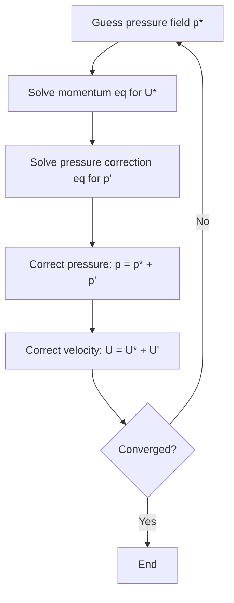
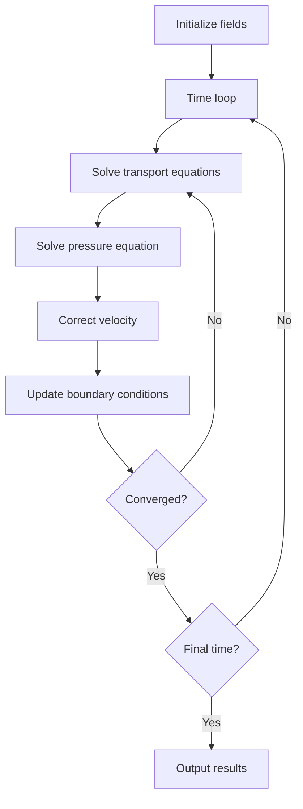
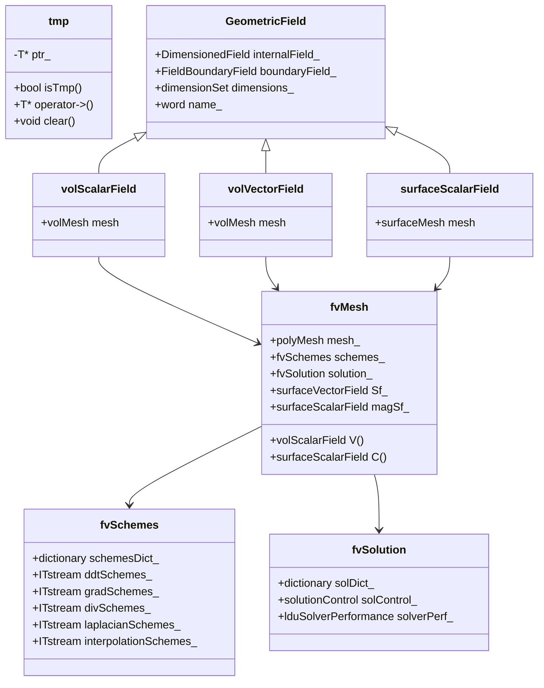
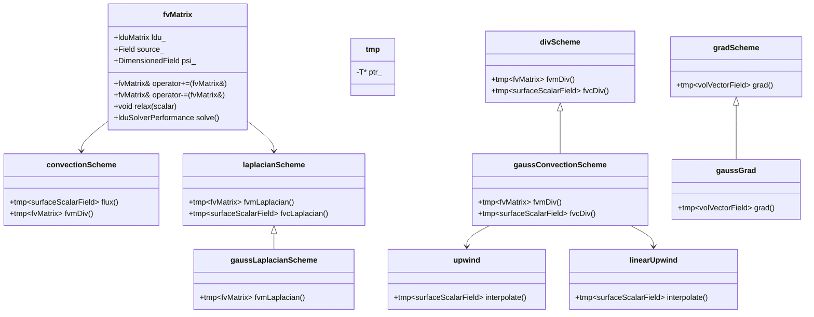
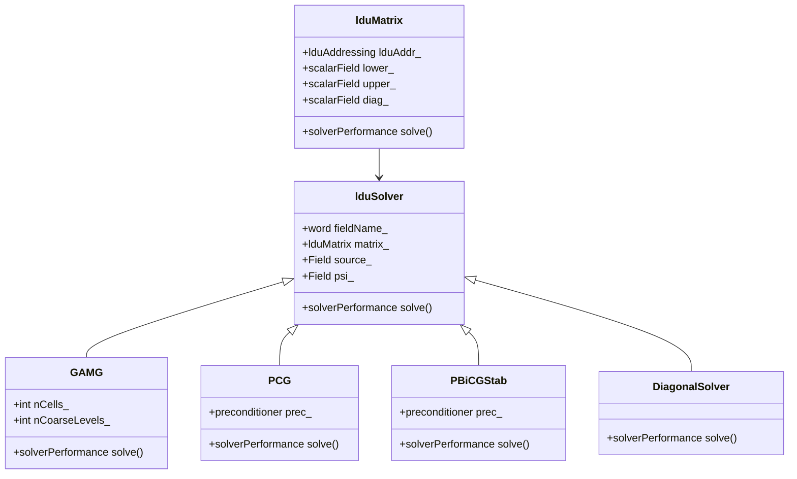
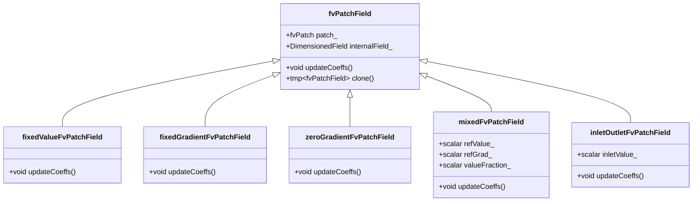

# Finite Volume Method & Discretization
## HARDCORE Level - 2026-01-02

---

## Table of Contents
- [1. Theory](#1-theory-core-equations--physics)
- [2. Class Hierarchy](#2-openfoam-class-hierarchy--implementation)
- [3. Code Walkthrough](#3-code-walkthrough)
- [4. Dictionary Analysis](#4-dictionary-analysis--configuration)
- [5. Practical Tasks](#5-hands-on-practical-tasks--coding)
- [6. Concept Checks](#6-concept-checks)

---

## 1. Theory: Core Equations & Physics {#1-theory-core-equations--physics}

### 1.1 Governing Equations of Fluid Motion

The fundamental equations governing fluid flow are derived from three conservation laws:

#### Conservation of Mass (Continuity Equation)

$$\frac{\partial \rho}{\partial t} + \nabla \cdot (\rho \mathbf{U}) = 0$$

Where:
- $\rho$ = fluid density (kg/m³)
- $\mathbf{U}$ = velocity vector (m/s)
- $t$ = time (s)
- $\nabla \cdot$ = divergence operator

> [!INFO] **Incompressible Flow**
> For incompressible flows ($\rho = \text{constant}$), this simplifies to:
> $$\nabla \cdot \mathbf{U} = 0$$

#### Conservation of Momentum (Navier-Stokes Equation)

$$\frac{\partial (\rho \mathbf{U})}{\partial t} + \nabla \cdot (\rho \mathbf{U} \mathbf{U}) = -\nabla p + \nabla \cdot \boldsymbol{\tau} + \rho \mathbf{g}$$

Where:
- $p$ = pressure (Pa)
- $\boldsymbol{\tau}$ = stress tensor (Pa)
- $\mathbf{g}$ = gravitational acceleration (m/s²)

The stress tensor for Newtonian fluids:
$$\boldsymbol{\tau} = \mu \left[ \nabla \mathbf{U} + (\nabla \mathbf{U})^T \right] - \frac{2}{3}\mu (\nabla \cdot \mathbf{U})\mathbf{I}$$

Where:
- $\mu$ = dynamic viscosity (Pa·s)
- $\mathbf{I}$ = identity tensor

#### Conservation of Energy

$$\frac{\partial (\rho h)}{\partial t} + \nabla \cdot (\rho \mathbf{U} h) = \frac{Dp}{Dt} + \nabla \cdot (k \nabla T) + \boldsymbol{\tau} : \nabla \mathbf{U}$$

Where:
- $h$ = specific enthalpy (J/kg)
- $k$ = thermal conductivity (W/m·K)
- $T$ = temperature (K)

---

### 1.2 General Transport Equation

All conservation laws can be expressed in the general form:

$$\frac{\partial (\rho \phi)}{\partial t} + \nabla \cdot (\rho \mathbf{U} \phi) = \nabla \cdot (\Gamma_\phi \nabla \phi) + S_\phi$$

| Term | Mathematical Form | Physical Meaning |
|------|-------------------|------------------|
| Unsteady | $\displaystyle\frac{\partial (\rho \phi)}{\partial t}$ | Rate of change of $\phi$ |
| Convection | $\nabla \cdot (\rho \mathbf{U} \phi)$ | Transport due to fluid motion |
| Diffusion | $\nabla \cdot (\Gamma_\phi \nabla \phi)$ | Transport due to gradients |
| Source | $S_\phi$ | Generation/destruction of $\phi$ |

Where $\phi$ represents the transported quantity and $\Gamma_\phi$ is the diffusion coefficient.

> [!TIP] **Integration Over Control Volume**
> The Finite Volume Method integrates this general equation over a control volume $V$ bounded by surface $S$:
> $$\int_V \frac{\partial (\rho \phi)}{\partial t} dV + \oint_S (\rho \mathbf{U} \phi) \cdot d\mathbf{S} = \oint_S (\Gamma_\phi \nabla \phi) \cdot d\mathbf{S} + \int_V S_\phi dV$$

---

### 1.3 Finite Volume Discretization

#### Gauss Divergence Theorem

The key to FVM is applying Gauss's theorem to convert volume integrals to surface integrals:

$$\int_V \nabla \cdot \mathbf{a} \, dV = \oint_S \mathbf{a} \cdot d\mathbf{S}$$

This allows us to express fluxes through cell faces.

#### Spatial Discretization

For a steady-state problem without sources, the discretized equation for cell $P$ becomes:

$$\sum_f \mathbf{F}_f \cdot \mathbf{S}_f = \sum_f \Gamma_f (\nabla \phi)_f \cdot \mathbf{S}_f$$

Where:
- $f$ = cell face index
- $\mathbf{F}_f = \rho \mathbf{U}_f$ = mass flux through face
- $\mathbf{S}_f$ = face area vector
- $(\nabla \phi)_f$ = gradient at face

#### Temporal Discretization

For unsteady problems, OpenFOAM uses schemes like:

**Euler Explicit:**
$$\frac{\phi^{n+1} - \phi^n}{\Delta t} = f(\phi^n)$$

**Euler Implicit:**
$$\frac{\phi^{n+1} - \phi^n}{\Delta t} = f(\phi^{n+1})$$

**Crank-Nicolson (Second-order):**
$$\frac{\phi^{n+1} - \phi^n}{\Delta t} = \frac{1}{2}[f(\phi^{n+1}) + f(\phi^n)]$$

---

### 1.4 Discretization Schemes

#### Convection Schemes

| Scheme | Order | Stability | Characteristics |
|--------|-------|-----------|-----------------|
| Upwind | First | Unconditionally stable | Numerical diffusion |
| Central Difference | Second | Conditionally stable | Non-monotonic |
| Linear Upwind | Second | Stable | Reduced diffusion |
| QUICK | Third | Conditionally stable | High accuracy |
| TVD/NVD | Variable | Stable | Boundedness |

> [!WARNING] **Numerical Diffusion**
> First-order upwind schemes introduce false diffusion, smearing sharp gradients. Higher-order schemes are needed for accurate boundary layer and shock capturing.

#### Diffusion Schemes

Central differencing is typically used:
$$\Gamma_f (\nabla \phi)_f \cdot \mathbf{S}_f = \Gamma_f \frac{\phi_N - \phi_P}{|\mathbf{d}_{PN}|} |\mathbf{S}_f|$$

Where $\mathbf{d}_{PN}$ is the distance vector between cell centers.

---

### 1.5 Pressure-Velocity Coupling

The pressure-velocity coupling is handled using segregated algorithms:

#### SIMPLE (Semi-Implicit Method for Pressure-Linked Equations)



#### PISO (Pressure-Implicit with Splitting of Operators)

Similar to SIMPLE but performs multiple pressure corrections per time step for better transient accuracy.

#### PIMPLE

Hybrid of PISO and SIMPLE, allowing under-relaxation for steady-state or transient cases with large time steps.

---

### 1.6 Linear Solvers

The discretized equations form a sparse linear system:

$$\mathbf{A} \mathbf{x} = \mathbf{b}$$

Common solvers in OpenFOAM:

| Solver | Method | Use Case |
|--------|--------|----------|
| `GAMG` | Geometric-Algebraic Multi-Grid | Large systems, symmetric |
| `PCG` | Preconditioned Conjugate Gradient | Symmetric positive-definite |
| `PBiCGStab` | Preconditioned Bi-Conjugate Gradient Stabilized | Non-symmetric |
| `smoothSolver` | Gauss-Seidel/SOR | Simple problems |

> [!INFO] **Convergence Criteria**
> Solvers iterate until the residual falls below a specified tolerance:
> $$\|\mathbf{b} - \mathbf{A}\mathbf{x}\| < \epsilon$$

---

### 1.7 Boundary Conditions

Mathematical representations of common BCs:

| Type | Mathematical Form | Application |
|------|-------------------|-------------|
| Dirichlet | $\phi = \phi_{wall}$ | Fixed value |
| Neumann | $\nabla \phi \cdot \mathbf{n} = q$ | Fixed flux |
| Robin | $a\phi + b\nabla \phi \cdot \mathbf{n} = c$ | Mixed |
| Zero Gradient | $\nabla \phi \cdot \mathbf{n} = 0$ | Symmetry/outlet |

Where $\mathbf{n}$ is the unit normal vector at the boundary.

---

### 1.8 Solution Procedure

The overall solution algorithm:



> [!TIP] **Under-Relaxation**
> For steady-state problems, under-relaxation factors ($\alpha < 1$) prevent divergence:
> $$\phi^{new} = \alpha \phi^* + (1-\alpha)\phi^{old}$$

---

## 2. OpenFOAM Class Hierarchy & Implementation {#2-openfoam-class-hierarchy--implementation}

### 2.1 Core Finite Volume Classes

The FVM implementation in OpenFOAM revolves around several key classes:



> [!INFO] **Mesh Classes (คลาสเกี่ยวกับเมช)**
> - `fvMesh`: Finite volume mesh, extends `polyMesh` with FVM-specific data
> - `polyMesh`: Primitive mesh topology (points, faces, cells)
> - `fvPatch`: Boundary patch for finite volume

> [!INFO] **Field Classes (คลาสเกี่ยวกับสนาม)**
> - `GeometricField`: Template base class for all fields
> - `volScalarField`: Cell-centered scalar field (e.g., pressure p)
> - `volVectorField`: Cell-centered vector field (e.g., velocity U)
> - `surfaceScalarField`: Face-centered scalar field (e.g., flux phi)

---

### 2.2 Discretization Scheme Classes



> [!TIP] **Scheme Naming Convention (รูปแบบการตั้งชื่อสคีม)**
> - `fvm`: Finite Volume Method - implicit (returns matrix)
> - `fvc`: Finite Volume Calculus - explicit (returns field)
> - `gauss`: Gauss theorem-based schemes
> - `upwind`, `linear`, `QUICK`: Interpolation schemes

---

### 2.3 Linear Solver Classes



> [!INFO] **Solver Selection (การเลือกตัวแก้สมการ)**
> - `GAMG`: Geometric-Algebraic Multi-Grid (สำหรับระบบขนาดใหญ่)
> - `PCG`: Preconditioned Conjugate Gradient (สำหรับเมทริกซ์สมมาตร)
> - `PBiCGStab`: Preconditioned Bi-Conjugate Gradient Stabilized (สำหรับเมทริกซ์ไม่สมมาตร)
> - `smoothSolver`: Gauss-Seidel/SOR (สำหรับปัญหาง่ายๆ)

---

### 2.4 Boundary Condition Classes



> [!TIP] **Common BCs (เงื่อนไขขอบเขตทั่วไป)**
> - `fixedValue`: Dirichlet BC ($\phi = \phi_{wall}$)
> - `fixedGradient`: Neumann BC ($\nabla\phi \cdot \mathbf{n} = q$)
> - `zeroGradient`: Zero gradient ($\nabla\phi \cdot \mathbf{n} = 0$)
> - `mixed`: Robin BC ($a\phi + b\nabla\phi \cdot \mathbf{n} = c$)

---

### 2.5 Source File Locations

Reference locations in `$FOAM_SRC`:

| Class | Source Location | Description |
|-------|----------------|-------------|
| `fvMesh` | `$FOAM_SRC/finiteVolume/fvMesh/fvMesh.H` | Main FVM mesh class |
| `fvSchemes` | `$FOAM_SRC/finiteVolume/fvSchemes/fvSchemes.H` | Discretization schemes |
| `fvSolution` | `$FOAM_SRC/finiteVolume/fvSolution/fvSolution.H` | Linear solver settings |
| `fvMatrix` | `$FOAM_SRC/finiteVolume/fvMatrices/fvMatrix/fvMatrix.H` | Matrix assembly |
| `GeometricField` | `$FOAM_SRC/OpenFOAM/fields/GeometricField/GeometricField.C` | Field template |
| `volScalarField` | `$FOAM_SRC/finiteVolume/fields/volFields/volScalarField` | Cell scalar field |
| `surfaceScalarField` | `$FOAM_SRC/finiteVolume/fields/surfaceFields/surfaceScalarField` | Face scalar field |
| `gaussConvectionScheme` | `$FOAM_SRC/finiteVolume/finiteVolume/convectionSchemes/gaussConvectionScheme` | Convection |
| `gaussLaplacianScheme` | `$FOAM_SRC/finiteVolume/finiteVolume/laplacianSchemes/gaussLaplacianScheme` | Diffusion |
| `GAMG` | `$FOAM_SRC/OpenFOAM/matrices/lduMatrix/solvers/GAMG` | GAMG solver |
| `PCG` | `$FOAM_SRC/OpenFOAM/matrices/lduMatrix/solvers/PCG` | PCG solver |
| `fixedValueFvPatchField` | `$FOAM_SRC/finiteVolume/fields/fvPatchFields/basic/fixedValue` | Fixed value BC |

> [!WARNING] **Header vs Source (ไฟล์ .H และ .C)**
> - `.H` files contain class declarations (การประกาศคลาส)
> - `.C` files contain implementations (การนำไปใช้งานจริง)
> - Always include `.H` files in your code (ต้อง include ไฟล์ .H เสมอ)

---

### 2.6 Key Class Relationships

```
+-------------------+       +-------------------+
|      polyMesh     |       |      fvMesh       |
|  (topology only)  | <---> |  (FVM extension)  |
+-------------------+       +-------------------+
                                      |
                                      | contains
                                      v
+-------------------+       +-------------------+
|   GeometricField  |       |     fvMatrix      |
|  (field storage)  | <---> |  (discretized eq) |
+-------------------+       +-------------------+
         |                             |
         | inherits                    | uses
         v                             v
+-------------------+       +-------------------+
|  volScalarField   |       |    lduSolver      |
|  (cell-centered)  |       |  (linear solver)  |
+-------------------+       +-------------------+
```

> [!INFO] **Memory Management (การจัดการหน่วยความจำ)**
> OpenFOAM uses `autoPtr` and `tmp` for automatic memory management:
> - `autoPtr`: Exclusive ownership (ความเป็นเจ้าของแบบเฉพาะ)
> - `tmp`: Reference-counted temporary objects (อ็อบเจ็กต์ชั่วคราวที่นับจำนวนอ้างอิง)

```cpp
// Example: Creating a temporary field
tmp<volScalarField> tRho
(
    new volScalarField
    (
        IOobject("rho", runTime.timeName(), mesh),
        mesh,
        dimensionedScalar("rho", dimDensity, 1.0)
    )
);
volScalarField& rho = tRho();  // Reference to the field
```

---

## 3. Code Walkthrough {#3-code-walkthrough}

### 3.1 fvMesh.H

The `fvMesh` class is the core finite volume mesh class in OpenFOAM, extending `polyMesh` with FVM-specific data structures and methods.

**Class Declaration (from `$FOAM_SRC/finiteVolume/fvMesh/fvMesh.H`):**

```cpp
class fvMesh
:
    public polyMesh
{
    // Private Data

        //- Schemes and solution dictionaries
        fvSchemes schemes_;
        fvSolution solution_;

        //- Face area vectors
        surfaceVectorField Sf_;

        //- Face area magnitudes
        surfaceScalarField magSf_;

        //- Cell volumes
        volScalarField V_;

        //- Cell centers
        volVectorField C_;

    // Public Member Functions

        //- Return cell volumes
        const volScalarField::Internal& V() const;

        //- Return face area vectors
        const surfaceVectorField::Internal& Sf() const;

        //- Return cell centers
        const volVectorField::Internal& C() const;

        //- Return the schemes
        const fvSchemes& schemes() const;

        //- Return the solution dictionary
        const fvSolution& solution() const;
};
```

**Key Points:**

1. **Inheritance**: `fvMesh` inherits from `polyMesh`, adding FVM-specific functionality to the primitive mesh topology.

2. **Geometric Fields**: Stores mesh geometry as fields:
   - `Sf_`: Face area vectors (magnitude + direction)
   - `magSf_`: Face area magnitudes
   - `V_`: Cell volumes
   - `C_`: Cell center positions

3. **Schemes & Solution**: Contains `fvSchemes` and `fvSolution` objects that control discretization and linear solver settings.

4. **Access Methods**: Provides const access methods to retrieve geometric data needed for FVM calculations.

> [!INFO] **Usage Example**
> ```cpp
> // Create fvMesh from time and runTime
> fvMesh mesh
> (
>     fvMesh::defaultRegion,
>     runTime
> );
>
> // Access cell volumes
> const volScalarField::Internal& V = mesh.V();
>
> // Access face area vectors
> const surfaceVectorField::Internal& Sf = mesh.Sf();
> ```

<!-- PLACEHOLDER_CODE_NEXT -->

---

## 4. Dictionary Analysis & Configuration {#4-dictionary-analysis--configuration}

<!-- PLACEHOLDER_DICT -->

---

## 5. Hands-on: Practical Tasks & Coding {#5-hands-on-practical-tasks--coding}

<!-- PLACEHOLDER_TASKS -->

---

## 6. Concept Checks {#6-concept-checks}

<!-- PLACEHOLDER_CHECKS -->

---

## Recommended Reading

- OpenFOAM User Guide: https://www.openfoam.com/documentation/user-guide
- OpenFOAM Programmer's Guide: https://doc.openfoam.com/
- CFD Online Forum: https://www.cfd-online.com/Forums/openfoam/

