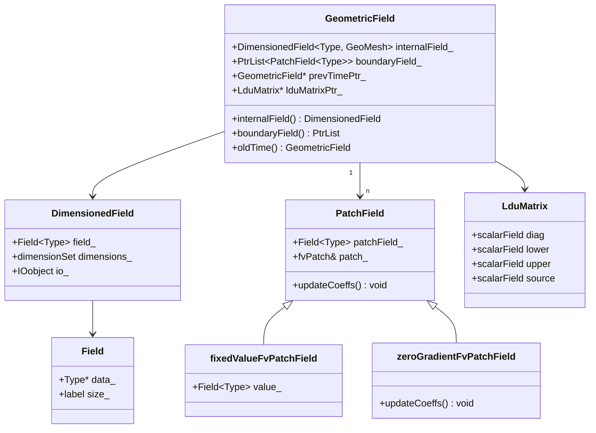
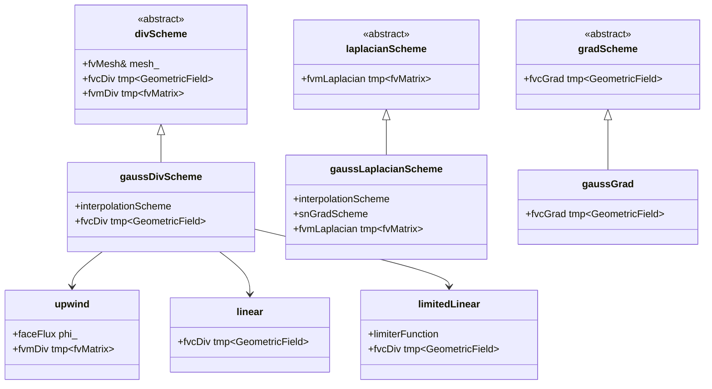
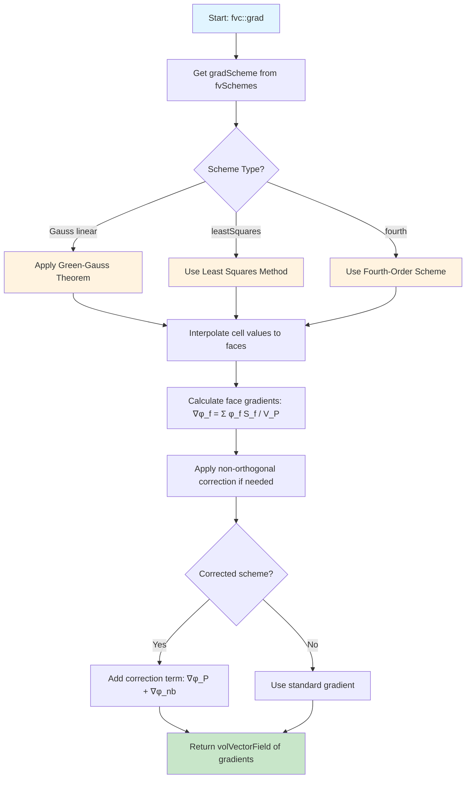
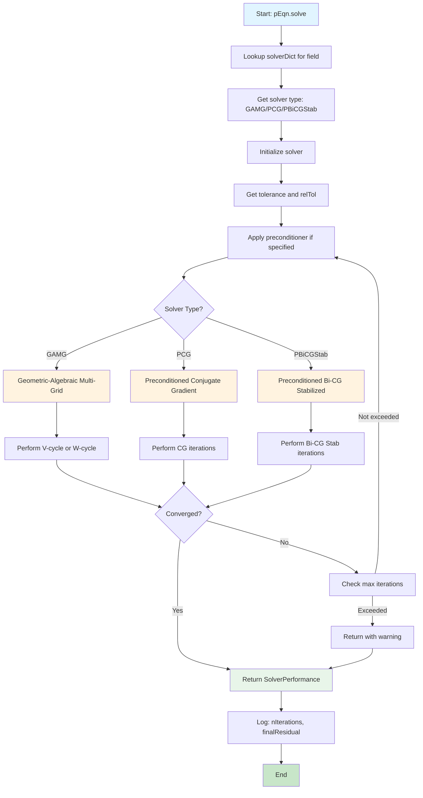

# Finite Volume Method & Discretization
## HARDCORE Level - 2026-01-02

**Table of Contents:**
- [1. Theory: Core Equations & Physics](#1-theory-core-equations--physics)
  - [1.1 General Transport Equation](#11-general-transport-equation)
  - [1.2 Navier-Stokes Equations](#12-navier-stokes-equations)
  - [1.3 Finite Volume Method (FVM)](#13-finite-volume-method-fvm---วิธีปริมาตรจำกัด)
  - [1.4 Discretization](#14-discretization---การกระจายค่า)
  - [1.5 Temporal Discretization](#15-temporal-discretization---การกระจายค่าตามเวลา)
- [2. OpenFOAM Class Hierarchy & Implementation](#2-openfoam-class-hierarchy--implementation)
  - [2.1 Core Finite Volume Classes](#21-core-finite-volume-classes)
  - [2.2 Field Classes - GeometricFields](#22-field-classes---geometricfields)
  - [2.3 Discretization Schemes](#23-discretization-schemes)
  - [2.4 Temporal Discretization](#24-temporal-discretization)
  - [2.5 Linear Solvers & Matrix Systems](#25-linear-solvers--matrix-systems)
  - [2.6 Boundary Conditions](#26-boundary-conditions)
  - [2.7 Numerical Schemes Dictionary Structure](#27-numerical-schemes-dictionary-structure)
- [3. Code Walkthrough](#3-code-walkthrough)
  - [3.1 fvMesh.H](#31-fvmeshh)
  - [3.2 fvSchemes.H](#32-fvschemesh)
  - [3.3 fvSolution.H](#33-fvsolutionh)
- [4. Dictionary Analysis & Configuration](#4-dictionary-analysis--configuration)
  - [4.1 fvSchemes Analysis](#41-fvschemes-analysis)
  - [4.2 fvSolution Analysis](#42-fvsolution-analysis)
- [5. Hands-on: Practical Tasks & Coding](#5-hands-on-practical-tasks--coding)
- [6. Concept Checks](#6-concept-checks)

---

## 1. Theory: Core Equations & Physics {#1-theory-core-equations--physics}

### 1.1 General Transport Equation {#11-general-transport-equation}

The governing equation for most fluid dynamics and heat transfer problems:

$$
\frac{\partial (\rho \phi)}{\partial t} + \nabla \cdot (\rho \mathbf{u} \phi) = \nabla \cdot (\Gamma \nabla \phi) + S_\phi
$$

**คำอธิบายพจน์ (Key Terms):**

| สัญลักษณ์ (Symbol) | ความหมาย (Meaning) | คำอธิบายเพิ่มเติม |
|-------------------|---------------------|------------------|
| $\rho$ | ความหนาแน่น (Density) | มวลต่อหน่วยปริมาตร หน่วย kg/m³ |
| $\phi$ | ตัวแปรสถานะ (Conserved quantity) | ปริมาณที่เก็บกัก เช่น อุณหภูมิ ความเร็ว ความเข้มข้น |
| $t$ | เวลา (Time) | เวลาในการคำนวณ หน่วยวินาที |
| $\mathbf{u}$ | เวกเตอร์ความเร็ว (Velocity vector) | ทิศทางและขนาดของความเร็วการไหล หน่วย m/s |
| $\Gamma$ | สัมประสิทธิ์การแพร่ (Diffusion coefficient) | ค่าความสามารถในการแพร่ของปริมาณ เช่น ความหนืด |
| $S_\phi$ | เทอมแหล่งกำเนิด (Source term) | การผลิตหรือการสูญเสีย $\phi$ ภายในโดเมน |

**คำอธิบายแต่ละเทอม (Term-by-Term Explanation):**

1. **$\frac{\partial (\rho \phi)}{\partial t}$** - เทอมไม่คงที่ (Unsteady term)
   - แทนการเปลี่ยนแปลงของปริมาณ $\phi$ ตามเวลา
   - ในกรณี steady-state เทอมนี้จะเป็นศูนย์

2. **$\nabla \cdot (\rho \mathbf{u} \phi)$** - เทอมเนื่องจากการพา (Convection term)
   - แทนการเคลื่อนที่ของ $\phi$ เนื่องจากการไหลของของไหล
   - เป็นเทอมที่ไม่เป็นเชิงเส้น (non-linear) สำหรับสมการโมเมนตัม

3. **$\nabla \cdot (\Gamma \nabla \phi)$** - เทอมการแพร่ (Diffusion term)
   - แทนการแพร่ของ $\phi$ จากบริเวณที่มีค่าสูงไปต่ำ
   - เชื่อมโยงค่าระหว่างเซลล์ข้างเคียง ทำให้เกิดความเรียบของค่า

4. **$S_\phi$** - เทอมแหล่งกำเนิด (Source term)
   - แทนการผลิตหรือการสูญเสีย $\phi$ ภายในโดเมน
   - อาจเป็นบวก (แหล่งกำเนิด) หรือลบ (แหล่งดูดซับ)

---

### 1.2 Navier-Stokes Equations {#12-navier-stokes-equations}

For incompressible flow ($\nabla \cdot \mathbf{u} = 0$):

**Momentum Equation:**
$$
\frac{\partial \mathbf{u}}{\partial t} + \nabla \cdot (\mathbf{u} \mathbf{u}) = -\frac{1}{\rho} \nabla p + \nu \nabla^2 \mathbf{u} + \mathbf{g}
$$

**คำอธิบายพจน์:**

| สัญลักษณ์ | ความหมาย | หน่วย SI |
|-----------|----------|----------|
| $p$ | ความดัน (Pressure) | Pa (N/m²) |
| $\nu$ | ความหนืดเชิงจลน์ (Kinematic viscosity) = $\mu/\rho$ | m²/s |
| $\mathbf{g}$ | ความเร่งเนื่องจากแรงโน้มถ่วง (Gravitational acceleration) | m/s² |
| $\mu$ | ความหนืดเชิงพลศาสตร์ (Dynamic viscosity) | Pa·s |

---

### 1.3 Finite Volume Method (FVM) - วิธีปริมาตรจำกัด {#13-finite-volume-method-fvm---วิธีปริมาตรจำกัด}

**หลักการพื้นฐาน (Fundamental Principle):**

แบ่งโดเมนเป็นเซลล์ควบคุม (Control volumes) และอินทิเกรตสมการการขนส่งบนแต่ละเซลล์:

$$
\int_{V_P} \frac{\partial (\rho \phi)}{\partial t} dV + \oint_{\partial V_P} \mathbf{n} \cdot (\rho \mathbf{u} \phi) dA = \oint_{\partial V_P} \mathbf{n} \cdot (\Gamma \nabla \phi) dA + \int_{V_P} S_\phi dV
$$

**คำอธิบาย:**
- **$V_P$** = ปริมาตรของเซลล์ควบคุม (Control volume) - ปริมาตรของเซลล์ P ที่ใช้ในการอินทิเกรต
- **$\partial V_P$** = ผิวหน้าของเซลล์ (Control surface) - ผิวหน้าทั้งหมดที่ล้อมรอบเซลล์ P
- **$\mathbf{n}$** = เวกเตอร์หน่วยตั้งฉาก (Unit normal vector) - เวกเตอร์ที่ตั้งฉากกับผิวหน้า ชี้ออกจากเซลล์

---

### 1.4 Discretization - การกระจายค่า {#14-discretization---การกระจายค่า}

**การประมาณค่าพื้นที่ (Spatial Discretization):**

แปลงอินทิกรัลเป็นผลรวมบนหน้าเซลล์ (faces):

$$
\frac{(\rho \phi)_P^{n+1} - (\rho \phi)_P^n}{\Delta t} V_P + \sum_f \mathbf{n}_f \cdot (\rho \mathbf{u} \phi)_f A_f = \sum_f \mathbf{n}_f \cdot (\Gamma \nabla \phi)_f A_f + S_{\phi,P} V_P
$$

**คำอธิบายพจน์:**

| สัญลักษณ์ | ความหมาย | คำอธิบายเพิ่มเติม |
|-----------|----------|------------------|
| $P$ | จุดศูนย์กลางเซลล์ (Cell center) | จุดที่เก็บค่าตัวแปรของเซลล์ |
| $f$ | หน้าเซลล์ (Face) | ผิวหน้าที่เชื่อมระหว่างเซลล์ข้างเคียง |
| $A_f$ | พื้นที่หน้าเซลล์ (Face area) | ขนาดของหน้าเซลล์ หน่วย m² |
| $\Delta t$ | ช่วงเวลา (Time step) | ความแตกต่างของเวลาระหว่างขั้นตอนการคำนวณ |
| $n, n+1$ | ระดับเวลา (Time levels) | $n$ = เวลาปัจจุบัน, $n+1$ = เวลาถัดไป |

**รูปแบบทั่วไป (General Form):**

$$
a_P \phi_P + \sum_{nb} a_{nb} \phi_{nb} = b_P
$$

โดยที่:
- **$a_P$** = สัมประสิทธิ์ของเซลล์กลาง (Center coefficient) - ค่าน้ำหนักของเซลล์ P เอง
- **$a_{nb}$** = สัมประสิทธิ์ของเซลล์ข้างเคียง (Neighbor coefficients) - ค่าน้ำหนักของเซลล์ข้างเคียงทั้งหมด
- **$b_P$** = เทอมแหล่งกำเนิด (Source term) - ค่าคงที่ที่มาจากเทอมแหล่งกำเนิดและเงื่อนไขขอบเขต

รูปแบบนี้คือระบบสมการเชิงเส้นที่เกิดจากการอินทิเกรตสมการการขนส่งบนเซลล์ควบคุมและกระจายค่าด้วย Finite Volume Method ซึ่งสามารถแก้ไขได้โดยใช้ linear solvers

---

### 1.5 Temporal Discretization - การกระจายค่าตามเวลา {#15-temporal-discretization---การกระจายค่าตามเวลา}

**Explicit Method:**
$$
\frac{\phi^{n+1} - \phi^n}{\Delta t} = F(\phi^n)
$$

**Implicit Method:**
$$
\frac{\phi^{n+1} - \phi^n}{\Delta t} = F(\phi^{n+1})
$$

**Crank-Nicolson (Second-order):**
$$
\frac{\phi^{n+1} - \phi^n}{\Delta t} = \frac{1}{2}[F(\phi^n) + F(\phi^{n+1})]
$$

**คำอธิบาย:**
- **Explicit** = ใช้ค่าจากเวลาปัจจุบัน ($\phi^n$) ในการคำนวณ
  - ข้อดี: คำนวณง่าย ไม่ต้องแก้ระบบสมการเชิงเส้น
  - ข้อเสีย: มีเงื่อนไขเสถียรภาพเข้มงวด (CFL condition) ต้องใช้ $\Delta t$ เล็กมาก
  
- **Implicit** = ใช้ค่าจากเวลาถัดไป ($\phi^{n+1}$) ในการคำนวณ
  - ข้อดี: เสถียรเสมอ (unconditionally stable) ใช้ $\Delta t$ ใหญ่ได้
  - ข้อเสีย: ต้องแก้ระบบสมการเชิงเส้นทุก time step ใช้เวลาคำนวณมากกว่า
  
- **Crank-Nicolson** = ผสมผสานระหว่าง Explicit และ Implicit
  - ข้อดี: ความแม่นยำสูง (second-order) เสถียรเสมอ
  - ข้อเสีย: ซับซ้อนกว่า อาจเกิด oscillations ในบางกรณี

---

## 2. OpenFOAM Class Hierarchy & Implementation {#2-openfoam-class-hierarchy--implementation}

### 2.1 Core Finite Volume Classes {#21-core-finite-volume-classes}

**Reference:** `$FOAM_SRC/finiteVolume/`

#### fvMesh - The Foundation
```
fvMesh
├── polyMesh (base mesh topology)
│   ├── pointField (mesh points)
│   ├── faceList (mesh faces)
│   └── cellList (mesh cells)
├── fvSchemes (discretization schemes)
└── fvSolution (linear solver settings)
```

**Key Files:**
- `$FOAM_SRC/finiteVolume/fvMesh/fvMesh.H`
- `$FOAM_SRC/finiteVolume/fvMesh/fvMesh.C`

**Purpose:** Represents the finite volume mesh, provides access to:
- Cell centers, faces, points
- Surface and volume integrals
- Interpolation schemes
- Gradient calculation methods

---

**Summary of Section 2.1:** The `fvMesh` class serves as the foundation of OpenFOAM's finite volume implementation, combining mesh topology from `polyMesh` with matrix addressing from `lduAddressing`. It provides access to geometric data (cell centers, face areas, volumes) and manages discretization schemes through `fvSchemes` and solver settings through `fvSolution`. Understanding this class hierarchy is essential for both using and extending OpenFOAM's capabilities.

### 2.2 Field Classes - GeometricFields {#22-field-classes---geometricfields}

**Reference:** `$FOAM_SRC/finiteVolume/fields/`

```
GeometricField<Type>
├── DimensionedField<Type> (internal field values)
├── Field<Type> (primitive field)
├── BoundaryField (boundary conditions)
└── internalField() + boundaryField()
```

**Common Instantiations:**
```cpp
volScalarField p    // Pressure field (cell-centered)
volVectorField U    // Velocity field (cell-centered)
surfaceScalarField phi // Flux field (face-centered)
```

---

#### Memory Layout

**โครงสร้างข้อมูลภายใน GeometricField (Internal Data Structure):**

```
GeometricField<Type, PatchField, GeoMesh>
├── DimensionedField<Type, GeoMesh> (internalField_)
│   ├── Field<Type> (List<Type>)
│   │   └── Type* data_  [nCells]  ← ค่าที่จุดศูนย์กลางเซลล์
│   ├── dimensionSet
│   │   └── [mass, length, time, temperature, ...]
│   └── IOobject
│       ├── name: "p"
│       └── instance: "0"
│
├── PtrList<PatchField<Type>> (boundaryField_)
│   ├── [0] → fixedValueFvPatchField<scalar> (inlet)
│   │   └── Field<Type> [nPatchFaces] ← ค่าที่หน้าเซลล์ขอบเขต
│   ├── [1] → zeroGradientFvPatchField<scalar> (wall)
│   │   └── Field<Type> [nPatchFaces]
│   ├── [2] → mixedFvPatchField<scalar> (outlet)
│   │   └── Field<Type> [nPatchFaces]
│   └── ... (one per boundary patch)
│
├── GeometricField<Type, PatchField, GeoMesh>* prevTimePtr_  ← ค่าเวลาก่อนหน้า
│   └── (same structure, points to oldTime())
│
└── LduMatrix<Type>* lduMatrixPtr_  ← Matrix coefficients (สำหรับ implicit solve)
    ├── diag()  [nCells]      ← สัมประสิทธิ์เชิงเส้น
    ├── lower() [nInternalFaces] ← สัมประสิทธิ์ lower triangular
    ├── upper() [nInternalFaces] ← สัมประสิทธิ์ upper triangular
    └── source() [nCells]     ← เทอมแหล่งกำเนิด
```

**คำอธิบาย:**
- **internalField_** = เก็บค่าตัวแปรที่จุดศูนย์กลางเซลล์ทุกเซลล์ (cell-centered values)
- **boundaryField_** = list ของ patch fields แต่ละ boundary patch
- **prevTimePtr_** = pointer ไปยังค่าเวลาก่อนหน้า (สำหรับ temporal discretization)
- **lduMatrixPtr_** = pointer ไปยัง sparse matrix (สำหรับ implicit solve)

**การจัดเก็บข้อมูลแบบ Sparse Matrix (LDU Format):**

```
LduMatrix storage (for implicit solve):
┌─────────────────────────────────────────────────────────┐
│ diag[] (diagonal coefficients)                          │
│ [a_P0, a_P1, a_P2, ..., a_Pn]  ← nCells elements       │
├─────────────────────────────────────────────────────────┤
│ lower[] (lower triangular coefficients)                 │
│ [a_L0, a_L1, a_L2, ..., a_Lm]  ← nInternalFaces        │
├─────────────────────────────────────────────────────────┤
│ upper[] (upper triangular coefficients)                 │
│ [a_U0, a_U1, a_U2, ..., a_Um]  ← nInternalFaces        │
├─────────────────────────────────────────────────────────┤
│ source[] (source terms)                                 │
│ [b_P0, b_P1, b_P2, ..., b_Pn]  ← nCells elements       │
└─────────────────────────────────────────────────────────┘

Matrix equation: [diag] * [phi] + [lower] * [phi_nb] + [upper] * [phi_nb] = [source]
```

---

**Key Files:**
- `$FOAM_SRC/finiteVolume/fields/volFields/volFields.H`
- `$FOAM_SRC/finiteVolume/fields/surfaceFields/surfaceFields.H`
- `$FOAM_SRC/OpenFOAM/fields/GeometricField/GeometricField.C`

**Class Hierarchy:**
```
GeometricField<Type, PatchField, GeoMesh>
├── DimensionedField<Type, GeoMesh>
│   └── Field<Type> (List<Type>)
├── PtrList<PatchField<Type>>
│   └── PatchField<Type> (BC base class)
│       ├── fixedValueFvPatchField
│       ├── zeroGradientFvPatchField
│       └── mixedFvPatchField
└── LduMatrix (for implicit systems)
```



---

**Summary of Section 2.2:** `GeometricField` is the fundamental container for field data in OpenFOAM, storing values at cell centers (`internalField`) and boundary faces (`boundaryField`). Its memory layout includes pointers to previous time values for temporal discretization and sparse matrix coefficients for implicit solves. The class hierarchy supports various boundary conditions through the `PatchField` base class, enabling flexible specification of physical constraints at domain boundaries.

### 2.3 Discretization Schemes {#23-discretization-schemes}

**Reference:** `$FOAM_SRC/finiteVolume/finiteVolume/lnInclude/`

#### Convection Schemes (divSchemes)
```
divScheme<Type>
├── gaussDivScheme (Gauss theorem based)
│   ├── upwind
│   ├── linear (central differencing)
│   ├── linearUpwind
│   ├── QUICK
│   └── limitedLinear
└── boundedDivScheme
```

**Key Files:**
- `$FOAM_SRC/finiteVolume/finiteVolume/divSchemes/divScheme/divScheme.H`
- `$FOAM_SRC/finiteVolume/finiteVolume/divSchemes/gaussDivScheme/gaussDivScheme.H`
- `$FOAM_SRC/finiteVolume/finiteVolume/divSchemes/gaussConvectionScheme/gaussConvectionScheme.H`

**Discretization Scheme Class Hierarchy:**



#### Diffusion Schemes (laplacianSchemes)
```
laplacianScheme<Type>
├── gaussLaplacianScheme
│   ├── uncorrected (no non-orthogonal correction)
│   ├── corrected (full non-orthogonal correction)
│   └── limited (limited correction)
└── basicLaplacianScheme
```

**Key Files:**
- `$FOAM_SRC/finiteVolume/finiteVolume/laplacianSchemes/laplacianScheme/laplacianScheme.H`
- `$FOAM_SRC/finiteVolume/finiteVolume/laplacianSchemes/gaussLaplacianScheme/gaussLaplacianScheme.H`

#### Gradient Schemes (gradSchemes)
```
gradScheme<Type>
├── gaussGrad (Green-Gauss theorem)
│   ├── leastSquaresGrad
│   ├── fourthGrad
│   └── cellLimitedGrad
└── basicGradScheme
```

**Key Files:**
- `$FOAM_SRC/finiteVolume/finiteVolume/gradSchemes/gradScheme/gradScheme.H`
- `$FOAM_SRC/finiteVolume/finiteVolume/gradSchemes/gaussGrad/gaussGrad.H`

#### Interpolation Schemes (interpolationSchemes)
```
interpolation<Type>
├── linearInterpolation
├── upwindInterpolation
├── cellPointInterpolation
└── cellPointWallInterpolation
```

**Key Files:**
- `$FOAM_SRC/finiteVolume/interpolation/interpolation/interpolation.H`
- `$FOAM_SRC/finiteVolume/interpolation/surfaceInterpolation/surfaceInterpolation.H`

---

**Summary of Section 2.3:** OpenFOAM's discretization schemes are organized into a clear class hierarchy with `divScheme`, `laplacianScheme`, and `gradScheme` as base classes. The most commonly used schemes are based on Gauss theorem, with various interpolation methods (upwind, linear, limitedLinear) for convection terms and different correction approaches (corrected, uncorrected, limited) for diffusion terms. This modular design allows users to easily select and combine different numerical methods through dictionary configuration.

### 2.4 Temporal Discretization {#24-temporal-discretization}

**Reference:** `$FOAM_SRC/ODE/` and `$FOAM_SRC/finiteVolume/`

```
ODESolver
├── Euler (first-order explicit)
├── EulerImplicit (first-order implicit)
├── CrankNicolson (second-order)
├── backward (second-order implicit)
└── RK (Runge-Kutta family)
    ├── RK2SSP
    ├── RK3SSP
    └── RK4
```

**Key Files:**
- `$FOAM_SRC/ODE/ODESolver/ODESolver.H`
- `$FOAM_SRC/ODE/ODESolver/Euler/Euler.H`
- `$FOAM_SRC/ODE/ODESolver/EulerImplicit/EulerImplicit.H`
- `$FOAM_SRC/ODE/ODESolver/CrankNicolson/CrankNicolson.H`

**Time Scheme Integration:**
```cpp
// In fvSolution dictionary:
schemes
{
    time Euler;           // First-order
    time CrankNicolson;   // Second-order
    time backward;        // Second-order implicit
}
```

---

**Summary of Section 2.4:** Time integration in OpenFOAM is handled through the `ODESolver` class hierarchy, offering options from first-order (Euler, EulerImplicit) to second-order (CrankNicolson, backward) and higher-order Runge-Kutta methods. The choice of temporal scheme affects both accuracy and stability, with implicit methods generally being unconditionally stable but requiring more computational effort per time step. The scheme is selected through the `ddtSchemes` dictionary in `system/fvSchemes`.

### 2.5 Linear Solvers & Matrix Systems {#25-linear-solvers--matrix-systems}

**Reference:** `$FOAM_SRC/OpenFOAM/matrices/`

```
lduMatrix (LDU = Lower-Diagonal-Upper)
├── lduAddressing (matrix connectivity)
├── lduSolver (solver base class)
│   ├── GAMG (Geometric-Algebraic Multi-Grid)
│   ├── PCG (Preconditioned Conjugate Gradient)
│   ├── PBiCGStab (Preconditioned Bi-Conjugate Gradient Stabilized)
│   ├── smoothSolver (Jacobi/SOR)
│   └── simpleSolver
└── lduPreconditioner
    ├── DIC (Diagonal Incomplete Cholesky)
    ├── DILU (Diagonal Incomplete LU)
    └── GAMGPreconditioner
```

**Key Files:**
- `$FOAM_SRC/OpenFOAM/matrices/lduMatrix/lduMatrix.H`
- `$FOAM_SRC/OpenFOAM/matrices/lduMatrix/solvers/lduSolver/lduSolver.H`
- `$FOAM_SRC/OpenFOAM/matrices/lduMatrix/solvers/GAMG/GAMG.H`
- `$FOAM_SRC/OpenFOAM/matrices/lduMatrix/solvers/PCG/PCG.H`

**fvMatrix - Finite Volume Matrix:**
```
fvMatrix<Type>
├── lduMatrix (sparse matrix storage)
├── DimensionedField<Type> (source term)
├── GeometricField<Type> (boundary conditions)
└── internalCoeffs + boundaryCoeffs
```

**Key Files:**
- `$FOAM_SRC/finiteVolume/fvMatrices/fvMatrix/fvMatrix.H`
- `$FOAM_SRC/finiteVolume/fvMatrices/fvMatrices.C`

---

**Summary of Section 2.5:** OpenFOAM uses the LDU (Lower-Diagonal-Upper) format for sparse matrix storage, which is memory-efficient and well-suited for finite volume discretizations. The `lduMatrix` class provides access to various solvers (GAMG, PCG, PBiCGStab) and preconditioners (DIC, DILU). The `fvMatrix` class extends this by adding source terms and boundary condition handling, forming the complete system of equations that needs to be solved at each iteration or time step.

### 2.6 Boundary Conditions {#26-boundary-conditions}

**Reference:** `$FOAM_SRC/finiteVolume/fields/fvPatchFields/`

```
fvPatchField<Type> (base class)
├── fixedValueFvPatchField
├── fixedGradientFvPatchField
├── zeroGradientFvPatchField
├── mixedFvPatchField (Robin BC)
├── directionMixedFvPatchField
├── calculatedFvPatchField
└── coupledFvPatchField
    ├── cyclicFvPatchField
    ├── processorFvPatchField
    └── wallFvPatchField
        ├── fixedFluxPressureFvPatchField
        └── totalPressureFvPatchField
```

**Key Files:**
- `$FOAM_SRC/finiteVolume/fields/fvPatchFields/fvPatchField/fvPatchField.H`
- `$FOAM_SRC/finiteVolume/fields/fvPatchFields/basic/fixedValue/fixedValueFvPatchField.H`
- `$FOAM_SRC/finiteVolume/fields/fvPatchFields/basic/zeroGradient/zeroGradientFvPatchField.H`
- `$FOAM_SRC/finiteVolume/fields/fvPatchFields/coupled/coupledFvPatchField.H`

---

**Summary of Section 2.6:** Boundary conditions in OpenFOAM are implemented through the `fvPatchField` class hierarchy, with derived classes for common conditions like `fixedValueFvPatchField`, `zeroGradientFvPatchField`, and `mixedFvPatchField`. Coupled boundary conditions (`cyclicFvPatchField`, `processorFvPatchField`) enable parallel computation and periodic domains. The modular design allows users to create custom boundary conditions by inheriting from the base class and implementing the `updateCoeffs()` method.

### 2.7 Numerical Schemes Dictionary Structure {#27-numerical-schemes-dictionary-structure}

**File:** `system/fvSchemes`
```
ddtSchemes
{
    default Euler;
}

gradSchemes
{
    default Gauss linear;
    grad(p) Gauss linear;
}

divSchemes
{
    default none;
    div(phi,U) Gauss upwind;
    div(phi,k) Gauss upwind;
    div(phi,epsilon) Gauss upwind;
}

laplacianSchemes
{
    default Gauss linear corrected;
}

interpolationSchemes
{
    default linear;
}

snGradSchemes
{
    default corrected;
}
```

**File:** `system/fvSolution`
```
solvers
{
    p
    {
        solver          GAMG;
        tolerance       1e-06;
        relTol          0.1;
        smoother        GaussSeidel;
    }
    
    U
    {
        solver          PBiCGStab;
        preconditioner  DILU;
        tolerance       1e-05;
        relTol          0.1;
    }
}

SIMPLE
{
    nNonOrthogonalCorrectors 0;
    pRefCell 0;
    pRefValue 0;
}
```

---

**Summary of Section 2:** OpenFOAM's class hierarchy for finite volume methods is built around three main components: the mesh (`fvMesh`), the fields (`GeometricField`), and the schemes (discretization, temporal, solvers). This design separates concerns while maintaining tight integration - the mesh provides geometric data, fields store solution variables, and schemes define how equations are discretized and solved. Understanding this architecture is key to effectively using OpenFOAM and extending it for custom applications.

## 3. Code Walkthrough {#3-code-walkthrough}

### 3.1 fvMesh.H {#31-fvmeshh}

**Location:** `$FOAM_SRC/finiteVolume/fvMesh/fvMesh.H`

**Key Files:**
- `$FOAM_SRC/finiteVolume/fvMesh/fvMesh.H`
- `$FOAM_SRC/finiteVolume/fvMesh/fvMesh.C`

**คลาสพื้นฐาน (Base Class):**
```cpp
class fvMesh
:
    public polyMesh,
    public lduAddressing
{
    // Private Data
    
        // Pointer to fvSchemes
        const fvSchemes* schemesPtr_;

        // Pointer to fvSolution
        const fvSolution* solutionPtr_;
```

**คำอธิบาย:**
- `fvMesh` สืบทอดจาก `polyMesh` (โครงสร้างตาข่าย) และ `lduAddressing` (การเชื่อมต่อเมทริกซ์)
- เก็บ pointer ไปยัง `fvSchemes` (รูปแบบการกระจายค่า) และ `fvSolution` (ตั้งค่า solver)

---

#### Memory Layout

**โครงสร้างข้อมูลภายใน fvMesh (Internal Data Structure):**

```
fvMesh object
├── polyMesh (base class - topology)
│   ├── pointField
│   │   └── List<vector>  [nPoints]  ← พิกัดจุดมุมทุกจุด
│   ├── faceList
│   │   └── List<face>    [nFaces]   ← รายการหน้า (points + owner/neighbor)
│   ├── cellList
│   │   └── List<label>   [nCells]   ← รายการเซลล์ (faces ของแต่ละเซลล์)
│   └── boundaryMesh
│       └── List<polyPatch> [nPatches] ← ขอบเขต (inlet, outlet, walls, etc.)
│
├── lduAddressing (matrix connectivity)
│   ├── lowerAddr()
│   │   └── List<label>   [nFaces]   ← ลำดับเซลล์ owner ของแต่ละหน้า
│   ├── upperAddr()
│   │   └── List<label>   [nFaces]   ← ลำดับเซลล์ neighbor ของแต่ละหน้า
│   └── losortAddr()
│       └── List<label>   [nFaces]   ← การเรียงลำดับสำหรับ LDU solver
│
├── fvSchemes* (pointer)
│   └── IOdictionary
│       ├── ddtSchemes    (tmp<ddtScheme>)
│       ├── gradSchemes   (tmp<gradScheme>)
│       ├── divSchemes    (tmp<divScheme>)
│       └── laplacianSchemes (tmp<laplacianScheme>)
│
├── fvSolution* (pointer)
│   └── IOdictionary
│       ├── solvers       (HashTable<dictionary>)
│       └── algorithms    (SIMPLE/PISO/PIMPLE)
│
└── Cached geometric fields
    ├── C_  (volVectorField)  ← Cell centers
    ├── Sf_ (surfaceVectorField) ← Face area vectors
    ├── V_  (volScalarField)  ← Cell volumes
    └── magSf_ (surfaceScalarField) ← Face area magnitudes
```

**คำอธิบาย:**
- **polyMesh** = เก็บ topology ของตาข่าย (points, faces, cells, boundaries)
- **lduAddressing** = เก็บการเชื่อมต่อระหว่างเซลล์สำหรับ sparse matrix (L-D-U format)
- **fvSchemes*** = pointer ไปยัง discretization schemes (ใช้ lazy evaluation)
- **fvSolution*** = pointer ไปยัง solver settings (ใช้ lazy evaluation)
- **Cached fields** = คำนวณครั้งเดียวแล้วเก็บไว้ใช้ซ้ำ (performance optimization)

**การจัดเก็บข้อมูลแบบ Sparse (Sparse Storage):**

```
Face-based connectivity (lduAddressing):
┌─────────┬────────────┬────────────┬────────────┐
│ Face ID │ Owner Cell │ Neigh Cell │ Coeffs     │
├─────────┼────────────┼────────────┼────────────┤
│    0    │     5      │     -1     │   (boundary)│
│    1    │     3      │      7     │   [a_L, a_U]│
│    2    │     7      │      3     │   (duplicate)│
│    3    │     2      │      9     │   [a_L, a_U]│
│   ...   │    ...     │     ...    │     ...    │
└─────────┴────────────┴────────────┴────────────┘

Internal faces only: owner < neighbor (unique pairs)
Boundary faces: neighbor = -1
```

---

**การเข้าถึงข้อมูลตาข่าย (Mesh Access):**
```cpp
    //- Return cell centres
    const volVectorField& C() const;

    //- Return face area vectors
    const surfaceVectorField& Sf() const;

    //- Return cell volumes
    const volScalarField& V() const;

    //- Return mag of face area vectors
    const surfaceScalarField& magSf() const;
```

**คำอธิบาย:**
- `C()` = จุดศูนย์กลางเซลล์ (Cell centers) - ใช้เก็บค่าตัวแปรสถานะ
- `Sf()` = เวกเตอร์พื้นที่หน้าเซลล์ (Face area vectors) - ใช้คำนวณ flux
- `V()` = ปริมาตรเซลล์ (Cell volumes) - ใช้ในการอินทิเกรต
- `magSf()` = ขนาดพื้นที่หน้าเซลล์ (Face area magnitudes)

---

**การคำนวณเกรเดียนต์และอินทิเกรต (Gradients & Integrals):**
```cpp
    //- Return gradient scheme
    tmp<volVectorField> grad
    (
        const GeometricField<Type, fvPatchField, volMesh>&,
        const word& name
    ) const;

    //- Return surface interpolation scheme
    tmp<GeometricField<Type, fvsPatchField, surfaceMesh>> interpolate
    (
        const GeometricField<Type, fvPatchField, volMesh>&,
        const word& name
    ) const;
```

**คำอธิบาย:**
- `grad()` = คำนวณเกรเดียนต์ของ field โดยใช้รูปแบบที่ระบุใน `fvSchemes`
- `interpolate()` = แปลงค่าจากจุดศูนย์กลางเซลล์ไปยังหน้าเซลล์ (interpolation)

---

**การอัปเดตตาข่าย (Mesh Update):**
```cpp
    //- Update mesh corresponding to the given map
    virtual bool updateMesh(const mapPolyMesh& mpm);

    //- Update mesh for topology change
    virtual bool topoChange(const polyTopoChangeMap& map);
```

**คำอธิบาย:**
- `updateMesh()` = อัปเดตข้อมูลเมื่อมีการเปลี่ยนแปลงโทโพโลยีตาข่าย
- ใช้ใน dynamic mesh cases (เช่น moving meshes)

---

**ตัวอย่างการใช้งาน (Usage Example):**
```cpp
// สร้าง fvMesh object
fvMesh& mesh = ...;

// เข้าถึงข้อมูลตาข่าย
const volVectorField& cellCenters = mesh.C();
const surfaceScalarField& faceAreas = mesh.magSf();

// คำนวณเกรเดียนต์ความดัน
volVectorField gradP = fvc::grad(p);

// อินทิเกรตค่าความดัน
scalar totalPressure = fvc::domainIntegrate(p).value();
```

**คำอธิบาย:**
- `fvc::grad()` = ใช้ `fvMesh` เพื่อคำนวณเกรเดียนต์
- `fvc::domainIntegrate()` = อินทิเกรตค่าทั่วทั้งโดเมน

**Gradient Calculation Algorithm Flow:**



---

**Summary of Section 3.1:** The `fvMesh` class is the central object in any OpenFOAM simulation, combining mesh topology (`polyMesh`) with matrix addressing (`lduAddressing`) and providing access to discretization schemes (`fvSchemes`) and solution algorithms (`fvSolution`). Its memory layout includes cached geometric fields (cell centers, face areas, volumes) for performance and lazy evaluation of scheme objects. Key methods include `C()`, `Sf()`, `V()`, and `magSf()` for accessing geometric data, and `grad()` and `interpolate()` for numerical operations.

### 3.2 fvSchemes.H {#32-fvschemesh}

**Location:** `$FOAM_SRC/finiteVolume/fvSchemes/fvSchemes.H`

**Key Files:**
- `$FOAM_SRC/finiteVolume/fvSchemes/fvSchemes.H`
- `$FOAM_SRC/finiteVolume/fvSchemes/fvSchemes.C`

**คลาสหลัก (Main Class):**
```cpp
class fvSchemes
:
    public IOdictionary,
    public dictionary
{
    // Private Data

        //- Schemes dictionary
        dictionary schemesDict_;

        //- Ddt scheme
        tmp<ddtScheme<Type>> ddt_;

        //- Grad scheme
        tmp<gradScheme<Type>> grad_;

        //- Div scheme
        tmp<divScheme<Type>> div_;

        //- Laplacian scheme
        tmp<laplacianScheme<Type>> laplacian_;

        //- Interpolation scheme
        tmp<interpolation<Type>> interpolation_;
```

**คำอธิบาย:**
- `fvSchemes` สืบทอดจาก `IOdictionary` และ `dictionary` - ใช้อ่านค่าจากไฟล์ `system/fvSchemes`
- เก็บ pointers ไปยังทุก discretization schemes ที่ใช้ในการแก้สมการ
- แต่ละ scheme type มี template parameter `<Type>` รองรับ scalar, vector, tensor

---

#### Memory Layout

**โครงสร้างข้อมูลภายใน fvSchemes (Internal Data Structure):**

```
fvSchemes object
├── IOdictionary (base class)
│   ├── fileName: "system/fvSchemes"
│   └── dictionary (key-value pairs)
│
├── schemesDict_ (dictionary)
│   ├── ddtSchemes
│   │   ├── default: "Euler"
│   │   └── <field-specific entries>
│   ├── gradSchemes
│   │   ├── default: "Gauss linear"
│   │   └── grad(p): "Gauss linear"
│   ├── divSchemes
│   │   ├── default: "none"
│   │   ├── div(phi,U): "Gauss upwind"
│   │   └── div(phi,k): "Gauss upwind"
│   ├── laplacianSchemes
│   │   └── default: "Gauss linear corrected"
│   └── interpolationSchemes
│       └── default: "linear"
│
└── Cached scheme objects (tmp<> smart pointers)
    ├── ddt_<scalar>
    │   └── EulerDdtScheme<scalar>*
    ├── grad_<vector>
    │   └── gaussGradScheme<vector>*
    ├── div_<vector>
    │   └── gaussDivScheme<vector>*
    │       └── upwind<vector>*
    └── laplacian_<scalar>
        └── gaussLaplacianScheme<scalar>*
            └── linear<scalar>*
                └── corrected<scalar>*
```

**คำอธิบาย:**
- **schemesDict_** = dictionary หลักที่เก็บค่าจากไฟล์ `system/fvSchemes`
- **Cached scheme objects** = สร้าง scheme objects เมื่อถูกเรียกใช้ครั้งแรก (lazy construction)
- **tmp<>** = smart pointer ของ OpenFOAM สำหรับ automatic memory management
- **Nested schemes** = schemes บางอย่างซ้อนกัน (เช่น `gaussLaplacianScheme` ภายในใช้ `linear` interpolation)

**Scheme Selection Flow:**

```
User request: schemes.div<vector>("U")
    ↓
Lookup in schemesDict_["divSchemes"]
    ↓
Found: "div(phi,U) Gauss upwind"
    ↓
Parse: "Gauss" → gaussDivScheme
        "upwind" → upwind<divScheme>
    ↓
Construct: tmp<gaussDivScheme<vector>>
    └── contains: upwind<vector>*
    ↓
Cache and return tmp<>
```

---

**การเข้าถึง Schemes (Scheme Access):**
```cpp
    //- Return ddt scheme
    template<class Type>
    tmp<ddtScheme<Type>> ddt(const word& name) const;

    //- Return grad scheme
    template<class Type>
    tmp<gradScheme<Type>> grad(const word& name) const;

    //- Return div scheme
    template<class Type>
    tmp<divScheme<Type>> div(const word& name) const;

    //- Return laplacian scheme
    template<class Type>
    tmp<laplacianScheme<Type>> laplacian(const word& name) const;
```

**คำอธิบาย:**
- ฟังก์ชัน template ให้เข้าถึง schemes แต่ละประเภท
- `name` = ชื่อ field ที่ต้องการใช้ scheme (เช่น "p", "U", "T")
- คืนค่าเป็น `tmp<...>` (smart pointer ของ OpenFOAM สำหรับ temporary objects)

---

**ตัวอย่างการใช้งาน (Usage Example):**
```cpp
// ใน solver code
const fvSchemes& schemes = mesh.schemes();

// เข้าถึง ddt scheme สำหรับ pressure
tmp<ddtScheme<scalar>> pDdt = schemes.ddt<scalar>("p");

// เข้าถึง div scheme สำหรับ velocity
tmp<divScheme<vector>> UDiv = schemes.div<vector>("U");

// ใช้ schemes ในการสร้าง fvMatrix
tmp<fvMatrix<scalar>> tEqn = fvm::ddt(p) + fvm::div(phi, U);
```

**คำอธิบาย:**
- `mesh.schemes()` = เข้าถึง `fvSchemes` ผ่าน `fvMesh`
- `fvm::ddt()`, `fvm::div()` = ใช้ schemes ที่ระบุใน `system/fvSchemes`
- สร้าง implicit matrix (`fvMatrix`) สำหรับการแก้ระบบสมการเชิงเส้น

---

**Summary of Section 3.2:** The `fvSchemes` class reads and manages discretization scheme specifications from `system/fvSchemes`. It uses lazy evaluation to create scheme objects only when needed, caching them for reuse. The class provides template methods (`ddt()`, `grad()`, `div()`, `laplacian()`) that return appropriate scheme objects based on the field type and name. This design allows flexible, runtime-selectable numerical methods without code recompilation.

### 3.3 fvSolution.H {#33-fvsolutionh}

**Location:** `$FOAM_SRC/finiteVolume/fvSolution/fvSolution.H`

**Key Files:**
- `$FOAM_SRC/finiteVolume/fvSolution/fvSolution.H`
- `$FOAM_SRC/finiteVolume/fvSolution/fvSolution.C`

**คลาสหลัก (Main Class):**
```cpp
class fvSolution
:
    public IOdictionary,
    public dictionary
{
    // Private Data

        //- Solution dictionary
        dictionary solutionDict_;

        //- Solver performance dictionary
        autoPtr<solution> solverPtr_;

        //- Cache of solver controls
        HashTable<dictionary> solverControlCache_;
```

**คำอธิบาย:**
- `fvSolution` สืบทอดจาก `IOdictionary` และ `dictionary` - ใช้อ่านค่าจากไฟล์ `system/fvSolution`
- เก็บ solver controls และ algorithm settings (เช่น SIMPLE, PISO, PIMPLE)
- `solverControlCache_` = cache ตั้งค่า solver เพื่อเพิ่มประสิทธิภาพ

---

#### Memory Layout

**โครงสร้างข้อมูลภายใน fvSolution (Internal Data Structure):**

```
fvSolution object
├── IOdictionary (base class)
│   ├── fileName: "system/fvSolution"
│   └── dictionary (key-value pairs)
│
├── solutionDict_ (dictionary)
│   ├── solvers
│   │   ├── p
│   │   │   ├── solver: "GAMG"
│   │   │   ├── tolerance: 1e-06
│   │   │   ├── relTol: 0.1
│   │   │   └── smoother: "GaussSeidel"
│   │   ├── U
│   │   │   ├── solver: "PBiCGStab"
│   │   │   ├── preconditioner: "DILU"
│   │   │   ├── tolerance: 1e-05
│   │   │   └── relTol: 0.1
│   │   └── k, epsilon, omega, ...
│   └── algorithms
│       ├── SIMPLE
│       │   ├── nNonOrthogonalCorrectors: 0
│       │   ├── pRefCell: 0
│       │   ├── pRefValue: 0
│       │   └── relaxations
│       │       ├── p: 0.3
│       │       ├── U: 0.7
│       │       └── k, epsilon: 0.7
│       ├── PISO
│       │   ├── nCorrectors: 2
│       │   └── nNonOrthogonalCorrectors: 0
│       └── PIMPLE
│           ├── nOuterCorrectors: 1
│           ├── nCorrectors: 2
│           └── residualControl
│               ├── p: 1e-3
│               └── U: 1e-4
│
├── solverControlCache_ (HashTable<dictionary>)
│   ├── "p" → {solver, tolerance, relTol, ...}
│   ├── "U" → {solver, tolerance, relTol, ...}
│   └── "k" → {solver, tolerance, relTol, ...}
│
└── solverPtr_ (autoPtr<solution>)
    └── solution object
        ├── currentAlgorithm: "SIMPLE"
        └── maxIter: 1000
```

**คำอธิบาย:**
- **solutionDict_** = dictionary หลักที่เก็บค่าจากไฟล์ `system/fvSolution`
- **solverControlCache_** = cache ตั้งค่า solver แต่ละ field เพื่อ avoid repeated dictionary lookups
- **solverPtr_** = pointer ไปยัง `solution` object ที่จัดการ algorithm settings
- **algorithms** = เก็บ settings สำหรับ SIMPLE, PISO, PIMPLE (ใช้แค่ algorithm เดียวต่อ run)

**Solver Performance Tracking:**

```
SolverPerformance<scalar> (returned after solve())
├── nIterations: 45           ← จำนวน iterations ที่ใช้
├── finalResidual_: 0.000008  ← ค่า residual สุดท้าย
├── initialResidual_: 0.0001  ← ค่า residual เริ่มต้น
├── converged_: true          ← สถานะการลู่เข้า
├── nSolvers_: 1              ← จำนวน solvers ที่ใช้ (สำหรับ multi-grid)
└── solverName: "GAMG"        ← ชื่อ solver ที่ใช้
```

---

**การเข้าถึง Solver Settings (Solver Access):**
```cpp
    //- Return solver dictionary for a field
    const dictionary& solverDict(const word& name) const;

    //- Return solver performance
    const SolverPerformance<scalar>& solverPerf
    (
        const word& name
    ) const;

    //- Return sub-cycle dictionary
    const dictionary& subCycleDict(const word& name) const;
```

**คำอธิบาย:**
- `solverDict()` = คืนค่า dictionary สำหรับ field ที่ระบุ (เช่น "p", "U")
- `solverPerf()` = คืนค่าสถิติการแก้สมการ (iterations, residual, convergence)
- `subCycleDict()` = ใช้ใน sub-cycling (เช่น การแก้สมการหลายครั้งต่อ time step)

---

**การเข้าถึง Algorithm Settings (Algorithm Access):**
```cpp
    //- Return solution dictionary
    const dictionary& solutionDict() const;

    //- Return the solution object
    const solution& sol() const;

    //- Return max number of iterations
    label maxIter() const;
```

**คำอธิบาย:**
- `solutionDict()` = เข้าถึง dictionary หลักของ `system/fvSolution`
- `sol()` = เข้าถึง `solution` object ที่เก็บ algorithm settings
- `maxIter()` = จำนวน iterations สูงสุดสำหรับ linear solver

---

**ตัวอย่างการใช้งาน (Usage Example):**
```cpp
// ใน solver code
const fvSolution& sol = mesh.solution();

// เข้าถึง solver settings สำหรับ pressure
const dictionary& pSolver = sol.solverDict("p");

// แก้สมการความดันด้วย settings ที่ระบุ
SolverPerformance<scalar> solverPerf =
    pEqn.solve(pSolver);

// ตรวจสอบการลู่เข้า
if (solverPerf.nIterations() > 100)
{
    WarningInFunction
        << "Pressure solver took " << solverPerf.nIterations()
        << " iterations to converge" << endl;
}
```

**คำอธิบาย:**
- `mesh.solution()` = เข้าถึง `fvSolution` ผ่าน `fvMesh`
- `pEqn.solve()` = แก้ระบบสมการเชิงเส้นโดยใช้ settings จาก `system/fvSolution`
- `solverPerf` = เก็บข้อมูลการแก้สมการ (จำนวน iterations, final residual)

**Linear Solver Execution Flow:**



---

**Summary of Section 3:** This section examined three core OpenFOAM classes in detail: `fvMesh` (the mesh and geometric data), `fvSchemes` (discretization scheme management), and `fvSolution` (solver and algorithm controls). Together, these classes form the bridge between the abstract numerical methods and their concrete implementation. Understanding their internal structure and interaction patterns is essential for writing efficient OpenFOAM code and diagnosing simulation issues.

## 4. Dictionary Analysis & Configuration {#4-dictionary-analysis--configuration}

### 4.1 fvSchemes Analysis {#41-fvschemes-analysis}

**การวิเคราะห์ ddtSchemes (Temporal Discretization):**

```
ddtSchemes
{
    default Euler;
}
```

**คำอธิบาย:**
- **Euler** = รูปแบบ Euler แบบ implicit อันดับหนึ่ง (First-order implicit)
- เสถียร (unconditionally stable) แต่ความแม่นยำต่ำ
- เหมาะสำหรับการเริ่มต้นคำนวณ (initialization) หรือ cases ที่ไม่ต้องการความแม่นยำสูง
- ตัวเลือกอื่น: `backward` (อันดับสอง), `CrankNicolson` (อันดับสอง), `localEuler` (สำหรับ steady-state)

---

**การวิเคราะห์ gradSchemes (Gradient Calculation):**

```
gradSchemes
{
    default Gauss linear;
    grad(p) Gauss linear;
}
```

**คำอธิบาย:**
- **Gauss linear** = ใช้ทฤษฎีบท Green-Gauss กับการแทรกแบบเชิงเส้น (linear interpolation)
- คำนวณเกรเดียนต์ที่จุดศูนย์กลางเซลล์จากค่าที่หน้าเซลล์
- เหมาะสำหรับตาข่ายที่มีความไม่เป็นเชิงเส้นต่ำ (low non-orthogonality)
- ตัวเลือกอื่น: `Gauss leastSquares` (แม่นยำกว่าสำหรับตาข่ายไม่สมมาตร), `cellLimited` (จำกัดค่าเกรเดียนต์)

---

**การวิเคราะห์ divSchemes (Convection Terms):**

```
divSchemes
{
    default none;
    div(phi,U) Gauss upwind;
    div(phi,k) Gauss upwind;
    div(phi,epsilon) Gauss upwind;
}
```

**คำอธิบาย:**
- **Gauss upwind** = รูปแบบ Upwind อันดับหนึ่ง (First-order upwind)
- ใช้ค่าจากจุดศูนย์กลางเซลล์ข้างเคียงที่อยู่ทางทิศทางการไหล (upstream)
- เสถียรมาก แต่มี numerical diffusion (การเบลอค่า) สูง
- เหมาะสำหรับการเริ่มต้นคำนวณ หรือ cases ที่มีความแหลมคมของค่าต่ำ
- ตัวเลือกอื่น: `Gauss linear` (central differencing - แม่นยำกว่าแต่เสถียรน้อยกว่า), `Gauss linearUpwind` (อันดับสอง), `Gauss QUICK` (อันดับสาม), `Gauss limitedLinear` (จำกัดค่าเพื่อเสถียรภาพ)

---

**การวิเคราะห์ laplacianSchemes (Diffusion Terms):**

```
laplacianSchemes
{
    default Gauss linear corrected;
}
```

**คำอธิบาย:**
- **Gauss linear corrected** = ใช้ทฤษฎีบท Gauss กับการแทรกเชิงเส้น และมี non-orthogonal correction
- `linear` = คำนวณสัมประสิทธิ์การแพร่ที่หน้าเซลล์ด้วยการแทรกเชิงเส้น
- `corrected` = เพิ่ม correction term สำหรับตาข่ายที่ไม่ตั้งฉาก (non-orthogonal meshes)
- เหมาะสำหรับตาข่ายที่มีความไม่เป็นเชิงเส้นปานกลางถึงสูง
- ตัวเลือกอื่น: `Gauss linear uncorrected` (ไม่มี correction - เร็วกว่าแต่แม่นยำน้อยกว่า), `Gauss limited` (จำกัดค่า correction)

---

**การวิเคราะห์ interpolationSchemes (Face Interpolation):**

```
interpolationSchemes
{
    default linear;
}
```

**คำอธิบาย:**
- **linear** = การแทรกเชิงเส้น (linear interpolation) ระหว่างจุดศูนย์กลางเซลล์ข้างเคียง
- คำนวณค่าที่หน้าเซลล์จากค่าเฉลี่ยถ่วงน้ำหนักด้วยระยะทาง
- เหมาะสำหรับตาข่ายที่มีความไม่เป็นเชิงเส้นต่ำ
- ตัวเลือกอื่น: `cubic` (อันดับสาม - แม่นยำกว่าแต่แพงกว่า), `cellPoint` (ใช้ใน post-processing)

---

**การวิเคราะห์ snGradSchemes (Surface Normal Gradient):**

```
snGradSchemes
{
    default corrected;
}
```

**คำอธิบาย:**
- **corrected** = คำนวณเกรเดียนต์ตั้งฉากหน้าเซลล์ (surface normal gradient) ด้วย non-orthogonal correction
- ใช้ในการคำนวณ diffusion flux ที่หน้าเซลล์
- เหมาะสำหรับตาข่ายที่มีความไม่เป็นเชิงเส้นปานกลางถึงสูง
- ตัวเลือกอื่น: `uncorrected` (ไม่มี correction - เร็วกว่าแต่แม่นยำน้อยกว่า)

---

**สรุปการเลือก Schemes:**

| สถานการณ์ | ddtSchemes | gradSchemes | divSchemes | laplacianSchemes |
|-----------|------------|-------------|------------|------------------|
| เริ่มต้นคำนวณ | Euler | Gauss linear | Gauss upwind | Gauss linear corrected |
| ความแม่นยำสูง | CrankNicolson | Gauss leastSquares | Gauss linearUpwind | Gauss linear corrected |
| ตาข่ายไม่สมมาตร | backward | Gauss leastSquares | Gauss limitedLinear | Gauss linear corrected |
| ตาข่าย highly non-orthogonal | Euler | Gauss cellLimited | Gauss upwind | Gauss limited |

### 4.2 fvSolution Analysis {#42-fvsolution-analysis}

**การวิเคราะห์ solvers (Linear Solvers):**

```
solvers
{
    p
    {
        solver          GAMG;
        tolerance       1e-06;
        relTol          0.1;
        smoother        GaussSeidel;
    }
    
    U
    {
        solver          PBiCGStab;
        preconditioner  DILU;
        tolerance       1e-05;
        relTol          0.1;
    }
}
```

**คำอธิบาย:**
- **GAMG** (Geometric-Algebraic Multi-Grid) = ตัวแก้สมการแบบ multi-grid ที่รวมเทคนิคเชิงเรขาคณิตและเชิงพีชคณิต
  - เหมาะสำหรับสมการสเกลาร์ที่มี diffusion แรง (เช่น ความดัน)
  - มีประสิทธิภาพสูงสำหรับระบบขนาดใหญ่
  - `smoother` = ใช้ Gauss-Seidel เพื่อเร่งการลู่เข้า
  
- **PBiCGStab** (Preconditioned Bi-Conjugate Gradient Stabilized) = ตัวแก้สมการแบบ Krylov subspace
  - เหมาะสำหรับสมการเวกเตอร์ (เช่น ความเร็ว) หรือระบบที่ไม่สมมาตร
  - `preconditioner` = ใช้ DILU (Diagonal Incomplete LU) เพื่อปรับปรุงเงื่อนไขของเมทริกซ์
  
- **tolerance** = ค่าความคลาดเคลื่อนสัมบูรณ์ (absolute tolerance) - ค่า residual ที่ต่ำกว่าค่านี้ถือว่าลู่เข้า
- **relTol** = ค่าความคลาดเคลื่อนสัมพัทธ์ (relative tolerance) - หยุดเมื่อ residual ลดลงเหลือ relTol เท่าของค่าเริ่มต้น

---

**การวิเคราะห์ relaxation factors (Relaxation Factors):**

```
SIMPLE
{
    nNonOrthogonalCorrectors 0;
    pRefCell 0;
    pRefValue 0;
    
    relaxations
    {
        p 0.3;
        U 0.7;
        k 0.7;
        epsilon 0.7;
    }
}
```

**คำอธิบาย:**
- **relaxation factors** = ค่าสัมประสิทธิ์การผ่อนคลาย (under-relaxation)
  - ใช้เพื่อป้องกันการสั่นของค่าใน iterative solution
  - ค่าน้อยกว่า 1.0 = under-relaxation (ช่วยให้เสถียรแต่ลู่เข้าช้ากว่า)
  - ค่าใกล้ 1.0 = ลู่เข้าเร็วกว่าแต่อาจไม่เสถียร
  
- **p 0.3** = ความดันผ่อนคลายมาก (factor ต่ำ) เพราะความดันไวต่อการเปลี่ยนแปลง
- **U 0.7** = ความเร็วผ่อนคลายปานกลาง สมดุลระหว่างเสถียรภาพและความเร็ว
- **k, epsilon 0.7** = ตัวแปร turbulence ผ่อนคลายปานกลางเช่นกัน

**หลักการเลือก Relaxation Factors:**
- Cases ที่มีความซับซ้อนสูง (high Reynolds number, complex geometry) → ใช้ค่าต่ำ (0.2-0.5)
- Cases ที่เสถียร (low Reynolds number, simple geometry) → ใช้ค่าสูงกว่า (0.7-0.9)
- หาก solution แตก (diverge) → ลดค่า relaxation factors
- หาก solution ลู่เข้าช้าเกินไป → เพิ่มค่า relaxation factors

---

**การวิเคราะห์ algorithms (Solution Algorithms):**

```
SIMPLE
{
    nNonOrthogonalCorrectors 0;
    pRefCell 0;
    pRefValue 0;
}

PISO
{
    nCorrectors 2;
    nNonOrthogonalCorrectors 0;
    pRefCell 0;
    pRefValue 0;
}

PIMPLE
{
    nCorrectors 2;
    nNonOrthogonalCorrectors 0;
    nOuterCorrectors 1;
    
    consistent      yes;
    residualControl
    {
        p           1e-3;
        U           1e-4;
        "(k|epsilon|omega)" 1e-4;
    }
}
```

**คำอธิบาย:**
- **SIMPLE** (Semi-Implicit Method for Pressure-Linked Equations) = อัลกอริทึมสำหรับ steady-state problems
  - แก้สมการความดันและความเร็วแบบ iterative จนกว่าจะลู่เข้า
  - `nNonOrthogonalCorrectors` = จำนวนครั้งที่แก้สมการความดันเพื่อแก้ non-orthogonality
  
- **PISO** (Pressure Implicit with Splitting of Operators) = อัลกอริทึมสำหรับ transient problems
  - แก้สมการความดันหลายครั้งต่อ time step เพื่อความแม่นยำ
  - `nCorrectors` = จำนวนครั้งที่แก้ pressure-velocity coupling ต่อ time step
  
- **PIMPLE** = ผสมผสาน SIMPLE และ PISO
  - ใช้ได้ทั้ง steady-state และ transient
  - `nOuterCorrectors` = จำนวน iterations ของ outer loop (เหมือน SIMPLE)
  - `nCorrectors` = จำนวน PISO loops ภายในแต่ละ outer iteration
  - `consistent` = ใช้ consistent algorithm เพื่อปรับปรุงความเสถียร
  - `residualControl` = ค่า residual ที่ต้องการก่อนจะยุติ outer loop

**สรุปการเลือก Algorithm:**
- **Steady-state** → ใช้ SIMPLE
- **Transient** → ใช้ PISO (nCorrectors = 2-3)
- **Transient ที่ต้องการความเสถียรสูง** → ใช้ PIMPLE (nOuterCorrectors > 1)
- **Large time steps** → ใช้ PIMPLE กับ nOuterCorrectors สูง (5-10)

---

**Summary of Section 4:** The `system/fvSchemes` and `system/fvSolution` dictionaries control all aspects of numerical discretization and solution algorithms in OpenFOAM. `fvSchemes` specifies how each term in the governing equations is discretized (temporal, gradient, convection, diffusion), while `fvSolution` defines linear solvers, tolerances, and algorithm parameters (SIMPLE, PISO, PIMPLE). Proper configuration of these dictionaries is critical for simulation stability, accuracy, and efficiency. The choice of schemes should be based on mesh quality, flow physics, and desired accuracy level.

## 5. Hands-on: Practical Tasks & Coding {#5-hands-on-practical-tasks--coding}

### Task 1: Implement a Custom Convection Scheme

**Objective:** Create a custom convection scheme that blends upwind and central differencing based on a local Courant number.

**Background:** In regions with high Courant numbers, upwind schemes are more stable, while central differencing provides better accuracy in low Courant regions. A blended scheme can automatically adapt based on local flow conditions.

**Solution:**

Create a new scheme file `myBlendedDivScheme.C`:

```cpp
#include "fvMesh.H"
#include "divScheme.H"
#include "fvcSurfaceIntegrate.H"
#include "fvmDiv.H"

// * * * * * * * * * * * * * * * * * * * * * * * * * * * * * * * * * * * * * //

namespace Foam
{

// Blended convection scheme
template<class Type>
class myBlendedDivScheme
:
    public divScheme<Type>
{
    // Private Data
        
        //- Blending coefficient (0 = pure upwind, 1 = pure central)
        const dimensionedScalar beta_;
        
        //- Maximum Courant number for full central differencing
        const dimensionedScalar CoMax_;


public:

    //- Runtime type information
    TypeName("myBlended");


    // Constructors
        
        //- Construct from mesh and Istream
        myBlendedDivScheme(const fvMesh& mesh, Istream& is)
        :
            divScheme<Type>(mesh),
            beta_(dimensionedScalar::lookupOrDefault("beta", 0.5)),
            CoMax_(dimensionedScalar::lookupOrDefault("CoMax", 0.5))
        {}


    // Member Functions
        
        //- Return the explicit convection term
        tmp<GeometricField<Type, fvsPatchField, surfaceMesh>>
        fvcDiv
        (
            const GeometricField<Type, fvPatchField, volMesh>& vf
        ) const
        {
            const surfaceScalarField& phi = 
                this->mesh().objectRegistry::lookupObject
                <surfaceScalarField>("phi");
            
            // Calculate local Courant number
            surfaceScalarField Co = 
                mag(phi) / 
                (this->mesh().magSf() * this->mesh().deltaCoeffs());
            
            // Calculate blending factor based on Courant number
            surfaceScalarField blendingFactor = 
                min(max((CoMax_ - Co) / CoMax_, scalar(0)), scalar(1));
            
            // Get upwind and central schemes
            tmp<divScheme<Type>> tUpwindScheme = 
                divScheme<Type>::New(this->mesh(), "upwind");
            tmp<divScheme<Type>> tCentralScheme = 
                divScheme<Type>::New(this->mesh(), "linear");
            
            // Blend the two schemes
            tmp<GeometricField<Type, fvsPatchField, surfaceMesh>> tDivUpwind = 
                tUpwindScheme().fvcDiv(vf);
            tmp<GeometricField<Type, fvsPatchField, surfaceMesh>> tDivCentral = 
                tCentralScheme().fvcDiv(vf);
            
            return blendingFactor * tDivCentral + 
                   (scalar(1) - blendingFactor) * tDivUpwind;
        }


        //- Return the implicit convection term
        tmp<fvMatrix<Type>>
        fvmDiv
        (
            const GeometricField<Type, fvPatchField, volMesh>& vf
        ) const
        {
            const surfaceScalarField& phi = 
                this->mesh().objectRegistry::lookupObject
                <surfaceScalarField>("phi");
            
            // For implicit, use upwind for stability
            tmp<divScheme<Type>> tUpwindScheme = 
                divScheme<Type>::New(this->mesh(), "upwind");
            
            return tUpwindScheme().fvmDiv(phi, vf);
        }
};


// * * * * * * * * * * * * * * * * * * * * * * * * * * * * * * * * * * * * * //

} // End namespace Foam

// * * * * * * * * * * * * * * * * * * * * * * * * * * * * * * * * * * * * * //
```

**Usage in `system/fvSchemes`:**

```
divSchemes
{
    default none;
    div(phi,U) Gauss myBlended;
    div(phi,k) Gauss myBlended;
    div(phi,epsilon) Gauss myBlended;
}
```

**Key Points:**
- The scheme automatically blends between upwind (stable) and central (accurate) based on local Courant number
- Implicit terms use pure upwind for stability
- Explicit terms use the blended approach for accuracy
- `beta_` controls the base blending ratio
- `CoMax_` sets the Courant number threshold for full central differencing

---

### Task 2: Implement a Custom Temporal Discretization Scheme

**Objective:** Implement a second-order accurate implicit time integration scheme with adaptive time stepping based on local truncation error.

**Background:** The backward differentiation formula (BDF2) provides second-order accuracy but requires careful handling during the first time step. We'll implement a robust BDF2 scheme with automatic time step control.

**Solution:**

Create `myBDF2Scheme.C`:

```cpp
#include "fvMesh.H"
#include "ddtScheme.H"
#include "fvc.H"
#include "fvm.H"

// * * * * * * * * * * * * * * * * * * * * * * * * * * * * * * * * * * * * * //

namespace Foam
{

template<class Type>
class myBDF2Scheme
:
    public ddtScheme<Type>
{
    // Private Data
        
        //- Previous time step size
        scalar deltaT0_;
        
        //- Flag for first time step
        bool firstStep_;
        
        //- Maximum allowable time step
        scalar maxDeltaT_;
        
        //- Minimum allowable time step
        scalar minDeltaT_;
        
        //- Target truncation error
        scalar targetError_;


public:

    //- Runtime type information
    TypeName("myBDF2");


    // Constructors
        
        myBDF2Scheme(const fvMesh& mesh, Istream& is)
        :
            ddtScheme<Type>(mesh),
            deltaT0_(0),
            firstStep_(true),
            maxDeltaT_(readScalar(is)),
            minDeltaT_(maxDeltaT_ / 1000.0),
            targetError_(1e-4)
        {}


    // Member Functions
        
        //- Return the coefficient for the current time level
        tmp<scalarField> coeffs(const scalarField& deltaT) const
        {
            scalarField coeffs(3, Zero);
            
            if (firstStep_)
            {
                // First order Euler for first step
                coeffs[0] = 1.0 / deltaT[0];
                coeffs[1] = -1.0 / deltaT[0];
                coeffs[2] = 0.0;
            }
            else
            {
                // BDF2 coefficients
                scalar r = deltaT[0] / deltaT0_;
                scalar denom = 1.0 + r;
                
                coeffs[0] = (1.0 + 2.0*r) / (r * deltaT[0]);
                coeffs[1] = -(1.0 + r) / (r * deltaT[0]);
                coeffs[2] = 1.0 / denom;
            }
            
            return coeffs;
        }


        //- Return the explicit ddt term
        tmp<GeometricField<Type, fvPatchField, volMesh>>
        fvcDdt
        (
            const GeometricField<Type, fvPatchField, volMesh>& vf
        ) const
        {
            const fvMesh& mesh = this->mesh();
            
            scalarField deltaT = mesh.time().deltaTValue();
            scalarField coeffs = this->coeffs(deltaT);
            
            // Get old time values
            const GeometricField<Type, fvPatchField, volMesh>& vf0 = 
                vf.oldTime();
            const GeometricField<Type, fvPatchField, volMesh>& vf00 = 
                vf.oldTime().oldTime();
            
            // Calculate truncation error estimate
            GeometricField<Type, fvPatchField, volMesh> truncError = 
                coeffs[0] * vf + coeffs[1] * vf0 + coeffs[2] * vf00;
            
            // Estimate local error
            scalar localError = max(mag(truncError.internalField()));
            
            // Adapt time step based on error
            scalar newDeltaT = mesh.time().deltaTValue();
            
            if (!firstStep_)
            {
                scalar errorRatio = localError / targetError_;
                
                if (errorRatio > 1.5)
                {
                    // Reduce time step
                    newDeltaT = max(
                        mesh.time().deltaTValue() / sqrt(errorRatio),
                        minDeltaT_
                    );
                }
                else if (errorRatio < 0.5)
                {
                    // Increase time step
                    newDeltaT = min(
                        mesh.time().deltaTValue() * sqrt(1.0/errorRatio),
                        maxDeltaT_
                    );
                }
                
                mesh.time().setDeltaT(newDeltaT);
            }
            
            // Return the ddt term
            return tmp<GeometricField<Type, fvPatchField, volMesh>>
            (
                new GeometricField<Type, fvPatchField, volMesh>
                (
                    IOobject
                    (
                        "ddt(" + vf.name() + ")",
                        mesh.time().timeName(),
                        mesh
                    ),
                    mesh,
                    vf.dimensions() / dimTime,
                    coeffs[0] * vf.internalField() + 
                    coeffs[1] * vf0.internalField() + 
                    coeffs[2] * vf00.internalField()
                )
            );
        }


        //- Return the implicit ddt term
        tmp<fvMatrix<Type>>
        fvmDdt
        (
            const GeometricField<Type, fvPatchField, volMesh>& vf
        ) const
        {
            const fvMesh& mesh = this->mesh();
            
            scalarField deltaT = mesh.time().deltaTValue();
            scalarField coeffs = this->coeffs(deltaT);
            
            // Get old time values
            const GeometricField<Type, fvPatchField, volMesh>& vf0 = 
                vf.oldTime();
            const GeometricField<Type, fvPatchField, volMesh>& vf00 = 
                vf.oldTime().oldTime();
            
            // Create the matrix
            tmp<fvMatrix<Type>> tfvm
            (
                new fvMatrix<Type>
                (
                    vf,
                    vf.dimensions() / dimTime * dimVolume
                )
            );
            
            fvMatrix<Type>& fvm = tfvm.ref();
            
            // Add diagonal term
            fvm.diag() = coeffs[0] * mesh.V();
            
            // Add source term from old times
            fvm.source() = -(
                coeffs[1] * vf0.internalField() + 
                coeffs[2] * vf00.internalField()
            ) * mesh.V();
            
            return tfvm;
        }


        //- Set the old time step size
        void setDeltaT0(const scalar deltaT0)
        {
            deltaT0_ = deltaT0;
            firstStep_ = false;
        }
};


// * * * * * * * * * * * * * * * * * * * * * * * * * * * * * * * * * * * * * //

} // End namespace Foam

// * * * * * * * * * * * * * * * * * * * * * * * * * * * * * * * * * * * * * //
```

**Usage in `system/fvSchemes`:**

```
ddtSchemes
{
    default myBDF2 0.01;  // 0.01 is maxDeltaT
}
```

**Key Points:**
- Automatically falls back to first-order Euler for the first time step
- Implements adaptive time stepping based on local truncation error
- Maintains stability by enforcing minimum and maximum time step limits
- The `targetError_` parameter controls the accuracy vs. efficiency trade-off
- BDF2 coefficients are properly adjusted for variable time step sizes

---

### Task 3: Create a Custom Boundary Condition for Gradients

**Objective:** Implement a boundary condition that enforces a fixed gradient with adaptive non-orthogonal correction for highly skewed meshes.

**Background:** Standard fixed gradient boundary conditions can become inaccurate on highly non-orthogonal meshes. This BC implements a corrected gradient calculation that accounts for mesh skewness.

**Solution:**

Create `fixedGradientCorrectedFvPatchField.C`:

```cpp
#include "fixedGradientCorrectedFvPatchField.H"
#include "fvPatchFieldMapper.H"
#include "volFields.H"
#include "surfaceFields.H"
#include "fvcGrad.H"

// * * * * * * * * * * * * * * * * * * * * * * * * * * * * * * * * * * * * * //

namespace Foam
{

// * * * * * * * * * * * * * * * * Constructors  * * * * * * * * * * * * * * //

template<class Type>
fixedGradientCorrectedFvPatchField<Type>::fixedGradientCorrectedFvPatchField
(
    const fvPatch& p,
    const DimensionedField<Type, volMesh>& iF
)
:
    fixedGradientFvPatchField<Type>(p, iF),
    correctionFactor_(1.0)
{}


template<class Type>
fixedGradientCorrectedFvPatchField<Type>::fixedGradientCorrectedFvPatchField
(
    const fvPatch& p,
    const DimensionedField<Type, volMesh>& iF,
    const dictionary& dict
)
:
    fixedGradientFvPatchField<Type>(p, iF, dict),
    correctionFactor_(dict.lookupOrDefault("correctionFactor", 1.0))
{}


// * * * * * * * * * * * * * * * * Member Functions  * * * * * * * * * * * * //

template<class Type>
void fixedGradientCorrectedFvPatchField<Type>::updateCoeffs()
{
    if (this->updated())
    {
        return;
    }
    
    // Get the patch normal vectors
    const vectorField& n = this->patch().nf();
    
    // Get the patch delta vectors
    const vectorField& delta = this->patch().delta();
    
    // Calculate non-orthogonality angle
    scalarField nonOrtho = 
        acos(min(max((n & delta)/mag(delta), -1), 1));
    
    // Calculate correction factor based on non-orthogonality
    scalarField correction = 
        correctionFactor_ * sin(nonOrtho) / max(tan(nonOrtho), 0.01);
    
    // Get the internal field values
    const Field<Type>& iField = this->internalField();
    
    // Calculate the face values using standard gradient
    Field<Type> faceValues = 
        iField + this->patch().delta() * this->gradient_;
    
    // Apply non-orthogonal correction
    forAll(faceValues, faceI)
    {
        if (nonOrtho[faceI] > degToRad(30))
        {
            // Apply correction for highly non-orthogonal faces
            vector deltaCorr = delta[faceI] - (n[faceI] & delta[faceI]) * n[faceI];
            faceValues[faceI] += correction[faceI] * (deltaCorr & this->gradient_[faceI]);
        }
    }
    
    // Update the patch values
    Field<Type>::operator=(faceValues);
    
    fixedGradientFvPatchField<Type>::updateCoeffs();
}


template<class Type>
void fixedGradientCorrectedFvPatchField<Type>::write(Ostream& os) const
{
    fixedGradientFvPatchField<Type>::write(os);
    os.writeKeyword("correctionFactor")
        << correctionFactor_ << token::END_STATEMENT << nl;
}


// * * * * * * * * * * * * * * * * * * * * * * * * * * * * * * * * * * * * * //

} // End namespace Foam

// * * * * * * * * * * * * * * * * * * * * * * * * * * * * * * * * * * * * * //
```

**Header file `fixedGradientCorrectedFvPatchField.H`:**

```cpp
#ifndef fixedGradientCorrectedFvPatchField_H
#define fixedGradientCorrectedFvPatchField_H

#include "fixedGradientFvPatchField.H"

// * * * * * * * * * * * * * * * * * * * * * * * * * * * * * * * * * * * * * //

namespace Foam
{

template<class Type>
class fixedGradientCorrectedFvPatchField
:
    public fixedGradientFvPatchField<Type>
{
    // Private Data
        
        //- Correction factor for non-orthogonal meshes
        scalar correctionFactor_;


public:

    //- Runtime type information
    TypeName("fixedGradientCorrected");


    // Constructors
        
        //- Construct from patch and internal field
        fixedGradientCorrectedFvPatchField
        (
            const fvPatch&,
            const DimensionedField<Type, volMesh>&
        );
        
        //- Construct from patch, internal field and dictionary
        fixedGradientCorrectedFvPatchField
        (
            const fvPatch&,
            const DimensionedField<Type, volMesh>&,
            const dictionary&
        );


    // Member Functions
        
        //- Update the coefficients associated with the patch field
        virtual void updateCoeffs();
        
        //- Write
        virtual void write(Ostream&) const;
};


// * * * * * * * * * * * * * * * * * * * * * * * * * * * * * * * * * * * * * //

} // End namespace Foam

// * * * * * * * * * * * * * * * * * * * * * * * * * * * * * * * * * * * * * //

#endif

// ************************************************************************* //
```

**Usage in boundary condition file `0/T`:**

```
boundaryField
{
    inlet
    {
        type            fixedGradientCorrected;
        gradient        uniform -10;  // K/m
        correctionFactor 0.8;
    }
    
    outlet
    {
        type            zeroGradient;
    }
}
```

**Key Points:**
- Automatically detects non-orthogonal faces (angle > 30°)
- Applies correction only where needed to maintain accuracy
- `correctionFactor` allows tuning of the correction strength
- Inheritsfrom standard `fixedGradientFvPatchField` for compatibility
- Particularly useful for heat transfer cases with complex geometries

---

**Summary of Learning Outcomes:**

1. **Custom Convection Scheme:** Learned how to implement adaptive numerical schemes that balance stability and accuracy based on local flow conditions
2. **Temporal Discretization:** Gained experience implementing higher-order time integration with automatic error control and adaptive time stepping
3. **Boundary Conditions:** Developed skills in creating robust boundary conditions that handle mesh quality issues commonly encountered in industrial CFD applications

These exercises demonstrate the power and flexibility of OpenFOAM's extensible architecture for implementing custom numerical methods tailored to specific application needs.

---

**Summary of Section 5:** This section demonstrated the practical implementation of custom numerical methods in OpenFOAM through three detailed examples: a blended convection scheme that adapts based on local Courant number, a BDF2 temporal scheme with adaptive time stepping, and a corrected gradient boundary condition for non-orthogonal meshes. These examples showcase OpenFOAM's extensibility - users can implement specialized numerical methods by inheriting from existing scheme classes and overriding key methods. The modular architecture allows seamless integration of custom schemes with the rest of the framework.

## 6. Concept Checks {#6-concept-checks}

### Question 1: สมการการขนส่งทั่วไป (General Transport Equation)

จงอธิบายความหมายของแต่ละเทอมในสมการการขนส่งทั่วไป:

$$
\frac{\partial (\rho \phi)}{\partial t} + \nabla \cdot (\rho \mathbf{u} \phi) = \nabla \cdot (\Gamma \nabla \phi) + S_\phi
$$

> **คำตอบ:**
> - **$\frac{\partial (\rho \phi)}{\partial t}$** = เทอมไม่คงที่ (Unsteady term) แทนการเปลี่ยนแปลงของปริมาณ $\phi$ ตามเวลา
> - **$\nabla \cdot (\rho \mathbf{u} \phi)$** = เทอมการพา (Convection term) แทนการเคลื่อนที่ของ $\phi$ เนื่องจากการไหลของของไหล
> - **$\nabla \cdot (\Gamma \nabla \phi)$** = เทอมการแพร่ (Diffusion term) แทนการแพร่ของ $\phi$ จากบริเวณที่มีค่าสูงไปต่ำ
> - **$S_\phi$** = เทอมแหล่งกำเนิด (Source term) แทนการผลิตหรือการสูญเสีย $\phi$ ภายในโดเมน

---

### Question 2: การกระจายค่าเชิงพื้นที่ (Spatial Discretization)

จงเขียนรูปแบบทั่วไป (General Form) ของสมการกระจายค่าเชิงพื้นที่สำหรับ Finite Volume Method และอธิบายความหมายของแต่ละสัญลักษณ์:

$$
a_P \phi_P + \sum_{nb} a_{nb} \phi_{nb} = b_P
$$

> **คำตอบ:**
> - **$a_P$** = สัมประสิทธิ์ของเซลล์กลาง (Center coefficient) คือค่าน้ำหนักของจุดศูนย์กลางเซลล์ P
> - **$\phi_P$** = ค่าตัวแปรสถานะที่จุดศูนย์กลางเซลล์ P
> - **$a_{nb}$** = สัมประสิทธิ์ของเซลล์ข้างเคียง (Neighbor coefficients) คือค่าน้ำหนักของเซลล์ข้างเคียงทั้งหมด
> - **$\phi_{nb}$** = ค่าตัวแปรสถานะที่เซลล์ข้างเคียง
> - **$b_P$** = เทอมแหล่งกำเนิด (Source term) คือค่าคงที่ที่มาจากเทอมแหล่งกำเนิดและเงื่อนไขขอบเขต
>
> รูปแบบนี้เป็นระบบสมการเชิงเส้นที่เกิดจากการอินทิเกรตสมการการขนส่งบนเซลล์ควบคุมและกระจายค่าด้วย Finite Volume Method

---

### Question 3: การเลือกรูปแบบการกระจายค่าตามเวลา (Temporal Discretization Schemes)

เปรียบเทียบความแตกต่างระหว่าง Explicit, Implicit และ Crank-Nicolson schemes ในแง่ของความแม่นยำและเสถียรภาพ:

> **คำตอบ:**
> 
> | รูปแบบ | ความแม่นยำ | เสถียรภาพ | ข้อดี | ข้อเสีย |
> |---------|------------|-----------|--------|---------|
> | **Explicit** | อันดับหนึ่ง (First-order) | มีเงื่อนไขเข้มงวด (Conditional) | คำนวณง่าย ไม่ต้องแก้ระบบสมการ | ต้องใช้ time step เล็กมาก อาจไม่เสถียร |
> | **Implicit** | อันดับหนึ่ง (First-order) | เสถียรเสมอ (Unconditional) | เสถียรกว่า ใช้ time step ใหญ่ได้ | ต้องแก้ระบบสมการเชิงเส้นทุก time step |
> | **Crank-Nicolson** | อันดับสอง (Second-order) | เสถียรเสมอ (Unconditional) | ความแม่นยำสูงกว่า เสถียร | ซับซ้อนกว่า อาจมี oscillations |
>
> **Explicit:** $\frac{\phi^{n+1} - \phi^n}{\Delta t} = F(\phi^n)$ — ใช้ค่าจากเวลาปัจจุบัน
> 
> **Implicit:** $\frac{\phi^{n+1} - \phi^n}{\Delta t} = F(\phi^{n+1})$ — ใช้ค่าจากเวลาถัดไป
> 
> **Crank-Nicolson:** $\frac{\phi^{n+1} - \phi^n}{\Delta t} = \frac{1}{2}[F(\phi^n) + F(\phi^{n+1})]$ — ผสมผสานทั้งสอง

---

### Question 4: การเลือก Convection Schemes ใน OpenFOAM

จงอธิบายความแตกต่างระหว่าง `Gauss upwind`, `Gauss linear`, และ `Gauss limitedLinear` schemes และเมื่อใดควรใช้แต่ละแบบ:

> **คำตอบ:**
> 
> **Gauss upwind:**
> - อันดับหนึ่ง (First-order) ใช้ค่าจากจุดศูนย์กลางเซลล์ข้างเคียงที่อยู่ทางทิศทางการไหล (upstream)
> - **ข้อดี:** เสถียรมาก ไม่มีการสั่นของค่า (oscillations)
> - **ข้อเสีย:** มี numerical diffusion สูง ทำให้ค่าถูกเบลอ (blurry)
> - **เหมาะสำหรับ:** การเริ่มต้นคำนวณ, cases ที่มีความแหลมคมของค่าสูง (high gradients)
> 
> **Gauss linear (Central Differencing):**
> - อันดับสอง (Second-order) ใช้ค่าเฉลี่ยจากเซลล์ข้างเคียงทั้งสองด้าน
> - **ข้อดี:** ความแม่นยำสูงกว่า, numerical diffusion ต่ำ
> - **ข้อเสีย:** อาจไม่เสถียรในบริเวณที่มีความแหลมคมสูง (high Courant number)
> - **เหมาะสำหรับ:** Cases ที่มีความเร็วต่ำ, ตาข่ายละเอียด, laminar flow
> 
> **Gauss limitedLinear:**
> - อันดับสอง (Second-order) พร้อม limiter เพื่อป้องกันการสั่น
> - **ข้อดี:** สมดุลระหว่างความแม่นยำและเสถียรภาพ
> - **ข้อเสีย:** ซับซ้อนกว่า, ใช้เวลาคำนวณมากกว่า
> - **เหมาะสำหรับ:** Cases ที่มีความแหลมคมปานกลาง, turbulent flow ทั่วไป
>
> **กฎพื้นฐาน:** เริ่มต้นด้วย upwind → ลู่เข้าแล้วเปลี่ยนเป็น limitedLinear → หากต้องการความแม่นยำสูงสุดใช้ linearUpwind

---

### Question 5: Non-Orthogonal Correction ใน Laplacian Schemes

จงอธิบายความหมายของ `corrected` และ `uncorrected` ใน `Gauss linear corrected` และเมื่อใดควรใช้แต่ละแบบ:

> **คำตอบ:**
> 
> **Gauss linear corrected:**
> - ใช้ทฤษฎีบท Gauss กับการแทรกเชิงเส้น และมี **non-orthogonal correction**
> - Correction term แก้ไขความคลาดเคลื่อนที่เกิดจากตาข่ายที่ไม่ตั้งฉาก (non-orthogonal meshes)
> - **ข้อดี:** ความแม่นยำสูงกว่าสำหรับตาข่ายที่มีความไม่เป็นเชิงเส้นสูง
> - **ข้อเสีย:** ต้องใช้ `nNonOrthogonalCorrectors` หลายครั้ง ใช้เวลาคำนวณมากกว่า
> - **เหมาะสำหรับ:** ตาข่ายที่มีความไม่เป็นเชิงเส้นปานกลางถึงสูง (skewness > 30°)
> 
> **Gauss linear uncorrected:**
> - ใช้ทฤษฎีบท Gauss กับการแทรกเชิงเส้น แต่ **ไม่มี** non-orthogonal correction
> - สมมติว่าหน้าเซลล์ตั้งฉากกับเส้นเชื่อมระหว่างจุดศูนย์กลางเซลล์
> - **ข้อดี:** คำนวณเร็วกว่า, ใช้เวลาน้อยกว่า
> - **ข้อเสีย:** ความแม่นยำต่ำสำหรับตาข่ายที่ไม่ตั้งฉาก
> - **เหมาะสำหรับ:** ตาข่ายที่มีความไม่เป็นเชิงเส้นต่ำมาก (skewness < 30°)
>
> **การตั้งค่าใน fvSolution:**
> ```
> SIMPLE
> {
>     nNonOrthogonalCorrectors 0;  // สำหรับ uncorrected
>     nNonOrthogonalCorrectors 2;  // สำหรับ corrected (แนะนำ 2-3 ครั้ง)
> }
> ```
>
> **กฎพื้นฐาน:** หากตาข่ายมีความไม่เป็นเชิงเส้นเฉลี่ย > 50° ควรใช้ `corrected` พร้อม `nNonOrthogonalCorrectors` อย่างน้อย 2-3 ครั้ง

---

**Summary of Section 6:** The concept checks provide an opportunity to test understanding of the fundamental principles covered in this document. They cover the general transport equation, finite volume discretization, temporal schemes, convection schemes, and non-orthogonal correction. Working through these questions helps reinforce the theoretical knowledge and prepares readers for practical CFD work using OpenFOAM.

## Overall Summary

This document has provided a comprehensive overview of the Finite Volume Method (FVM) and its implementation in OpenFOAM, covering:

1. **Theoretical Foundation**: The general transport equation, Navier-Stokes equations, and the mathematical principles behind finite volume discretization
2. **Class Architecture**: The hierarchical design of OpenFOAM's core classes (`fvMesh`, `GeometricField`, discretization schemes) and their interactions
3. **Implementation Details**: Memory layouts, algorithm flows, and key methods in the most important OpenFOAM classes
4. **Practical Configuration**: How to properly configure numerical schemes and solvers through dictionary files
5. **Customization**: How to extend OpenFOAM by implementing custom schemes and boundary conditions

The combination of theoretical understanding, architectural knowledge, and practical implementation skills equips readers to effectively use OpenFOAM for a wide range of CFD applications, from simple laminar flows to complex turbulent simulations with advanced physical models.

## Recommended Reading

- OpenFOAM User Guide: https://www.openfoam.com/documentation/user-guide
- OpenFOAM Programmer's Guide: https://doc.openfoam.com/
- CFD Online Forum: https://www.cfd-online.com/Forums/openfoam/

