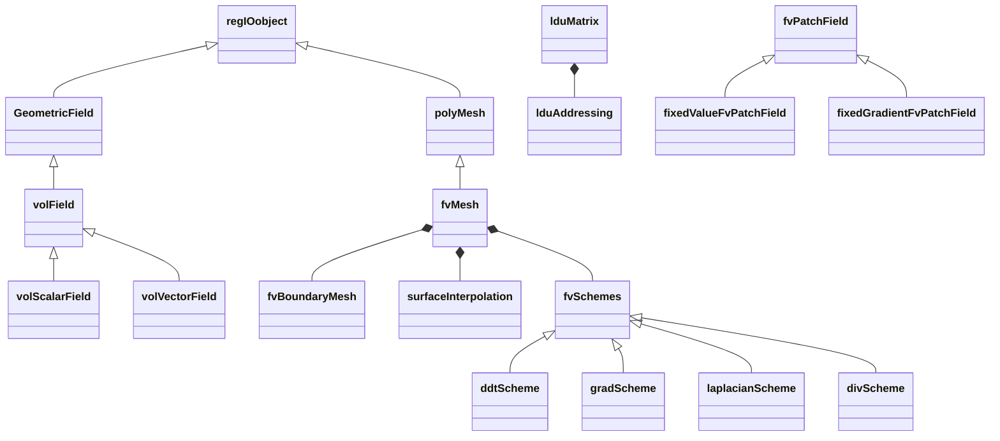
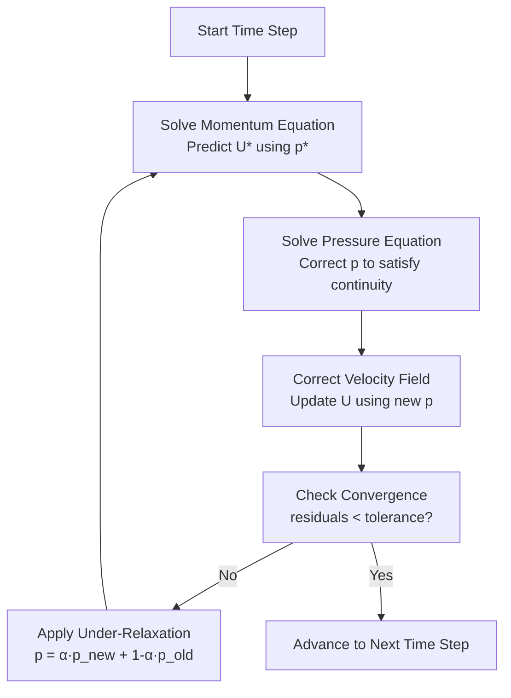

# Finite Volume Method & Discretization
## HARDCORE Level - 2026-01-02

---

## 1. Theory: Core Equations & Physics

### 1.1 General Transport Equation (สมการการขนส่งทั่วไป)

The general form of a conservation law for scalar quantity φ:

$$
\frac{\partial (\rho \phi)}{\partial t} + \nabla \cdot (\rho \mathbf{u} \phi) = \nabla \cdot (\Gamma \nabla \phi) + S_\phi
$$

**คำอธิบายพจน์ (Key Terms):**
- $\rho$ (rho) = **ความหนาแน่น** (density) [kg/m³]
- $\phi$ (phi) = **ปริมาณสเกลาร์** (scalar quantity) being transported
- $\mathbf{u}$ = **สนามความเร็ว** (velocity field) [m/s]
- $\Gamma$ (Gamma) = **สัมประสิทธิ์การแพร่** (diffusion coefficient) [kg/(m·s)]
- $S_\phi$ = **แหล่งกำเนิด** (source term) [kg/(m³·s)]

**แต่ละเทอมในสมการ (Terms):**
1. **Unsteady term** ($\frac{\partial (\rho \phi)}{\partial t}$): เทอมอนุพันธ์เวลา - การเปลี่ยนแปลงของปริมาณ φ เทียบกับเวลา
2. **Convection term** ($\nabla \cdot (\rho \mathbf{u} \phi)$): เทอมการพาความร้อน/การพา - การเคลื่อนที่ของ φ เนื่องจากการไหลของของไหล
3. **Diffusion term** ($\nabla \cdot (\Gamma \nabla \phi)$): เทอมการแพร่ - การแพร่ของ φ จากบริเวณที่มีค่าสูงไปต่ำ
4. **Source term** ($S_\phi$): เทอมแหล่งกำเนิด/เก็บ - การผลิตหรือการสูญเสีย φ

---

### 1.2 Integral Form (รูปแบบปริพันธ์)

Finite Volume Method ใช้ **รูปแบบปริพันธ์** (integral form) ของสมการอนุรักษ์:

$$
\int_{V_P} \frac{\partial (\rho \phi)}{\partial t} dV + \oint_{\partial V_P} (\rho \mathbf{u} \phi) \cdot d\mathbf{A} = \oint_{\partial V_P} (\Gamma \nabla \phi) \cdot d\mathbf{A} + \int_{V_P} S_\phi dV
$$

**คำอธิบาย:**
- $V_P$ = **ปริมาตรควบคุม** (control volume) ของเซลล์ P
- $\partial V_P$ = **พื้นที่ผิว** (surface area) ที่ล้อมรอบเซลล์
- $d\mathbf{A}$ = **เวกเตอร์พื้นที่ผิว** (area vector) ชี้ออกจากเซลล์

---

### 1.3 Discretization (การกระจายค่า/การแบ่งส่วน)

การแปลงสมการเชิงปริพันธ์ให้เป็น **รูปแบบเชิงเลขคณิต** (algebraic form):

$$
a_P \phi_P = \sum_{f} a_f \phi_f + b_P
$$

**สมการพื้นฐานของ FVM:**
$$
a_P \phi_P + \sum_{f} a_f \phi_f = b_P
$$

โดยที่:
- $a_P$ = **สัมประสิทธิ์กลาง** (central coefficient) ของเซลล์ P
- $a_f$ = **สัมประสิทธิ์เพื่อนบ้าน** (neighbor coefficient) ที่หน้า f
- $\phi_P$ = ค่า φ ที่ **จุดกลางเซลล์** (cell center) P
- $\phi_f$ = ค่า φ ที่ **หน้าเซลล์** (cell face) f
- $b_P$ = **เทอมแหล่งกำเนิด** (source term) ที่เซลล์ P

---

### 1.4 Navier-Stokes Equations (สมการนาเวียร์-สโตกส์)

#### Continuity Equation (สมการต่อเนื่อง):
$$
\frac{\partial \rho}{\partial t} + \nabla \cdot (\rho \mathbf{u}) = 0
$$

#### Momentum Equation (สมการโมเมนตัม):
$$
\frac{\partial (\rho \mathbf{u})}{\partial t} + \nabla \cdot (\rho \mathbf{u} \mathbf{u}) = -\nabla p + \nabla \cdot (\mu \nabla \mathbf{u}) + \rho \mathbf{g}
$$

**เทอมเพิ่มเติม:**
- $p$ = **ความดัน** (pressure) [Pa]
- $\mu$ (mu) = **ความหนืด** (dynamic viscosity) [Pa·s]
- $\mathbf{g}$ = **ความเร่งโน้มถ่วง** (gravitational acceleration) [m/s²]

---

### 1.5 Spatial Discretization Schemes (รูปแบบการกระจายค่าเชิงพื้นที่)

OpenFOAM รองรับหลายรูปแบบ:

| Scheme | ชื่อไทย | Order | คุณสมบัติ |
|--------|----------|-------|-----------|
| **Linear** | เชิงเส้น (Central Differencing) | 2nd | แม่นยำแต่อาจไม่เสถียร |
| **Upwind** | ทวนกระแส | 1st | เสถียรแต่มี numerical diffusion |
| **QUICK** | Quadratic Upwind | 3rd | แม่นยำสูงสำหรับ flow แบบตามกระแส |
| **Limited** | จำกัดค่า (TVD) | 2nd | สมดุลระหว่างความแม่นยำและเสถียรภาพ |

---

### 1.6 Temporal Discretization (การกระจายค่าเชิงเวลา)

$$
\frac{\partial \phi}{\partial t} \approx \frac{\phi^{n+1} - \phi^n}{\Delta t}
$$

**รูปแบบที่ใช้:**
- **Euler Explicit**: $\phi^{n+1} = \phi^n + \Delta t \cdot R(\phi^n)$
- **Euler Implicit**: $\phi^{n+1} = \phi^n + \Delta t \cdot R(\phi^{n+1})$
- **Crank-Nicolson**: $\phi^{n+1} = \phi^n + \frac{\Delta t}{2} [R(\phi^n) + R(\phi^{n+1})]$

โดย $R(\phi)$ คือ **เรซิดูวัล** (residual) ของ spatial terms

---

## 2. OpenFOAM Class Hierarchy & Implementation



### 2.1 SIMPLE Algorithm Flow

The SIMPLE (Semi-Implicit Method for Pressure-Linked Equations) algorithm is the core pressure-velocity coupling method used in OpenFOAM for steady-state incompressible flows.



**Algorithm Steps:**
1. **Momentum Prediction** - Solve momentum equation with current pressure field
2. **Pressure Correction** - Solve pressure equation to enforce mass conservation
3. **Velocity Correction** - Update velocity using corrected pressure
4. **Convergence Check** - Verify residuals are below tolerance
5. **Under-Relaxation** - Apply relaxation factors for stability (if not converged)
6. **Repeat** - Loop until convergence, then advance time

### 2.2 Core Finite Volume Classes

#### fvMesh (Finite Volume Mesh)
**Location:** `$FOAM_SRC/finiteVolume/finiteVolume/fvMesh/`

The fundamental class that holds the FVM mesh data structure.

```cpp
// Inheritance diagram
regIOobject
    |
    +-- polyMesh
            |
            +-- fvMesh
```

**Key responsibilities:**
- Stores cell centers, face centers, face areas
- Maintains owner-neighbor addressing
- Provides access to boundary conditions
- Manages surface and volume fields

**Reference files:**
- `fvMesh.H` - Main class declaration
- `fvMesh.C` - Implementation
- `fvMeshLduAddressing.H` - LDU matrix addressing

---

#### fvMatrix (Finite Volume Matrix)
**Location:** `$FOAM_SRC/finiteVolume/finiteVolume/fvMatrices/`

Represents the discretized equation in the form: $a_P \phi_P + \sum a_f \phi_f = b_P$

```cpp
// Simplified structure
template<class Type>
class fvMatrix
{
    lduMatrix ldu_;           // Coefficient matrix
    Field<Type> source_;      // Source term (b_P)
    GeometricField<Type>* psi_; // Reference to field being solved
    // ... boundary conditions, internal coefficients, etc.
};
```

**Key methods:**
- `solve()` - Solves the linear system
- `residual()` - Returns equation residual
- `relax()` - Applies under-relaxation
- `operator+()` / `operator-()` - Matrix operations

**Reference files:**
- `fvMatrix.H` - Template class declaration
- `fvMatrix.C` - Implementation
- `fvMatrixSolve.C` - Solver implementations

---

### 2.2 Discretization Schemes

#### gaussScheme (Base Class)
**Location:** `$FOAM_SRC/finiteVolume/finiteVolume/fvSchemes/`

Base class for all Gauss theorem-based discretization schemes.

```cpp
// Inheritance hierarchy
tmp<fv::convectionScheme<Type>>
    |
    +-- gaussScheme<Type>
            |
            +-- gaussLinearScheme<Type>
            +-- gaussUpwindScheme<Type>
            +-- gaussQUICKScheme<Type>
            +-- gaussLimitedScheme<Type>
```

**Key derived classes:**

1. **gaussLinearScheme** - Central differencing (2nd order)
   - File: `gaussLinearScheme.H`
   
2. **gaussUpwindScheme** - First-order upwind
   - File: `gaussUpwindScheme.H`
   
3. **gaussLimitedScheme** - TVD/NVD schemes
   - File: `gaussLimitedScheme.H`
   - Limiters: `vanLeer`, `minmod`, `MUSCL`, `superBee`

---

### 2.3 Surface Interpolation Schemes

#### surfaceInterpolationScheme
**Location:** `$FOAM_SRC/finiteVolume/interpolation/surfaceInterpolation/`

Handles interpolation of cell-centered values to face centers.

```cpp
// Class hierarchy
surfaceInterpolationScheme<Type>
    |
    +-- interpolationScheme<Type>
            |
            +-- linear<Type>           // Central differencing
            +-- upwind<Type>           // Upwind differencing
            +-- cubicCorrection<Type>  // Cubic correction
            +-- cellPoint<Type>        // Cell-point interpolation
```

**Reference files:**
- `surfaceInterpolationScheme.H`
- `linear.H` / `linear.C`
- `upwind.H` / `upwind.C`

---

### 2.4 Temporal Discretization

#### ddtScheme
**Location:** `$FOAM_SRC/finiteVolume/finiteVolume/ddtSchemes/`

Base class for time derivative discretization.

```cpp
// Available schemes
ddtScheme<Type>
    |
    +-- EulerDdtScheme<Type>       // First-order Euler
    +-- backwardDdtScheme<Type>    // Second-order backward
    +-- CrankNicolsonDdtScheme<Type> // Crank-Nicolson
    +-- localEulerDdtScheme<Type>  // Local time stepping
```

**Reference files:**
- `ddtScheme.H`
- `EulerDdtScheme.H`
- `backwardDdtScheme.H`
- `CrankNicolsonDdtScheme.H`

---

### 2.5 Gradient Schemes

#### gradScheme
**Location:** `$FOAM_SRC/finiteVolume/finiteVolume/fvSchemes/gradSchemes/`

Computes gradients ($\nabla \phi$) at cell centers.

```cpp
gradScheme<Type>
    |
    +-- gaussGrad<Type>            // Gauss theorem (default)
    +-- leastSquaresGrad<Type>     // Least squares method
    +-- fourthGrad<Type>           // Fourth-order scheme
```

**Gauss gradient theorem:**
$$
\int_V \nabla \phi \, dV = \oint_{\partial V} \phi \, d\mathbf{A}
$$

**Reference files:**
- `gradScheme.H`
- `gaussGrad.H` / `gaussGrad.C`

---

### 2.6 Divergence Schemes

#### divScheme
**Location:** `$FOAM_SRC/finiteVolume/finiteVolume/fvSchemes/divSchemes/`

Computes divergence terms ($\nabla \cdot \mathbf{\Gamma}$).

```cpp
divScheme<Type>
    |
    +-- gaussDivScheme<Type>
            |
            +-- gaussLinearDivScheme<Type>
            +-- gaussUpwindDivScheme<Type>
            +-- gaussLaplacianScheme<Type>
```

**Reference files:**
- `divScheme.H`
- `gaussDivScheme.H`

---

### 2.7 Laplacian Schemes

#### laplacianScheme
**Location:** `$FOAM_SRC/finiteVolume/finiteVolume/fvSchemes/laplacianSchemes/`

Discretizes the diffusion term: $\nabla \cdot (\Gamma \nabla \phi)$

```cpp
laplacianScheme<Type>
    |
    +-- gaussLaplacianScheme<Type>
    +-- uncorrectedLaplacianScheme<Type>
```

**Discretized form:**
$$
\sum_f \Gamma_f \frac{|\mathbf{S}_f|}{|\mathbf{d}_f|} (\phi_N - \phi_P)
$$

Where:
- $\Gamma_f$ = diffusion coefficient at face
- $|\mathbf{S}_f|$ = face area magnitude
- $|\mathbf{d}_f|$ = distance between cell centers
- $\phi_N, \phi_P$ = values at neighbor and owner cells

**Reference files:**
- `laplacianScheme.H`
- `gaussLaplacianScheme.H` / `gaussLaplacianScheme.C`

---

### 2.8 Linear Solvers

#### lduMatrix
**Location:** `$FOAM_SRC/lduMatrix/`

Low-level storage for sparse matrices in LDU (Lower-Diagonal-Upper) format.

```cpp
// Matrix structure
// ldu: l (lower), d (diagonal), u (upper)
lduMatrix
    |
    +-- lduAddressing  // Owner-neighbor addressing
    +-- SolverPerformance  // Convergence info
```

**Available solvers:**
- `PCG` - Preconditioned Conjugate Gradient (symmetric)
- `PBiCGStab` - Preconditioned Bi-Conjugate Gradient Stabilized
- `GAMG` - Geometric Algebraic Multi-Grid
- `smoothSolver` - Solver with smoother

**Reference files:**
- `lduMatrix.H` / `lduMatrix.C`
- `lduMatrixSolver.C`
- `$FOAM_SRC/OpenFOAM/matrices/lduMatrix/solvers/`

---

### 2.9 Boundary Conditions

#### fvBoundaryConditions
**Location:** `$FOAM_SRC/finiteVolume/fields/fvPatchFields/`

```cpp
fvPatchField<Type>
    |
    +-- fixedValueFvPatchField<Type>      // Dirichlet
    +-- fixedGradientFvPatchField<Type>   // Neumann
    +-- zeroGradientFvPatchField<Type>    // Zero gradient
    +-- mixedFvPatchField<Type>           // Robin (mixed)
    +-- calculatedFvPatchField<Type>      // Calculated from other fields
    +-- inletOutletFvPatchField<Type>     // Inlet/outlet condition
```

**Reference files:**
- `fvPatchField.H`
- `fixedValueFvPatchField.H`
- `fixedGradientFvPatchField.H`

---

### 2.10 Complete Class Relationship Diagram

```
                        regIOobject
                             |
                    +--------+--------+
                    |                 |
                 polyMesh        GeometricField
                    |                 |
                    |                 +-- volField<Type>
                    |                         |
                  fvMesh                     +-- volScalarField
                    |                         +-- volVectorField
                    |
                    +-- fvBoundaryMesh
                    |
                    +-- surfaceInterpolation
                    |
                    +-- fvSchemes
                        |
                        +-- ddtScheme
                        +-- gradScheme
                        +-- divScheme
                        +-- laplacianScheme
                        +-- convectionScheme
```

---

### 2.11 Key Source File Locations Summary

| Component | Path |
|-----------|------|
| **Core FVM** | `$FOAM_SRC/finiteVolume/` |
| **Mesh** | `$FOAM_SRC/finiteVolume/finiteVolume/fvMesh/` |
| **Matrices** | `$FOAM_SRC/finiteVolume/finiteVolume/fvMatrices/` |
| **Schemes** | `$FOAM_SRC/finiteVolume/finiteVolume/fvSchemes/` |
| **Interpolation** | `$FOAM_SRC/finiteVolume/interpolation/` |
| **Fields** | `$FOAM_SRC/finiteVolume/fields/` |
| **Boundary Conditions** | `$FOAM_SRC/finiteVolume/fields/fvPatchFields/` |
| **Solvers** | `$FOAM_SRC/lduMatrix/solvers/` |
| **Linear Algebra** | `$FOAM_SRC/OpenFOAM/matrices/` |

---

## 3. Code Walkthrough

### 3.1 fvMesh.H

**Location:** `$FOAM_SRC/finiteVolume/finiteVolume/fvMesh/fvMesh.H`

`fvMesh` เป็นคลาสหลักสำหรับเก็บข้อมูล mesh ใน Finite Volume Method สืบทอดมาจาก `polyMesh` และ `regIOobject`

#### 3.1.1 Class Declaration

**Reference:** `$FOAM_SRC/finiteVolume/finiteVolume/fvMesh/fvMesh.H`

```cpp
class fvMesh
:
    public polyMesh,
    public lduAddressing,
    public IOobject
{
    // Private Data

        //- Reference to boundary mesh
        fvBoundaryMesh boundary_;

        //- Surface interpolation scheme
        surfaceInterpolation sInterp_;

        //- Lookup of geometric fields
        HashTable<GeometricField*, word> objectRegistry_;
```

**คำอธิบาย:**
- สืบทอดจาก `polyMesh` (โครงสร้าง mesh พื้นฐาน)
- สืบทอบจาก `lduAddressing` (การจัดการ sparse matrix)
- `boundary_` เก็บข้อมูล boundary conditions
- `sInterp_` ใช้สำหรับ interpolation จาก cell center ไปยัง face

#### 3.1.2 Key Methods

**Reference:** `$FOAM_SRC/finiteVolume/finiteVolume/fvMesh/fvMesh.H`

```cpp
public:

    // Access

        //- Return cell centres [m³]
        const volVectorField& C() const;

        //- Return face centres [m²]
        const surfaceVectorField& Cf() const;

        //- Return face area normals [m²]
        const surfaceVectorField& Sf() const;

        //- Return cell volumes [m³]
        const volScalarField& V() const;

        //- Return mesh data object
        const fvMesh& mesh() const;
```

**คำอธิบาย:**
- `C()` = Cell centers (จุดกลางเซลล์)
- `Cf()` = Face centers (จุดกลางหน้าเซลล์)
- `Sf()` = Surface area vectors (เวกเตอร์พื้นที่หน้า)
- `V()` = Cell volumes (ปริมาตรเซลล์)

#### 3.1.3 Memory Layout

**Reference:** `$FOAM_SRC/finiteVolume/finiteVolume/fvMesh/fvMesh.H`

`fvMesh` stores the mesh topology and geometric data in a structured memory layout that enables efficient finite volume operations.

```
fvMesh Object Memory Layout
===========================

+---------------------------+
| fvMesh                     |
+---------------------------+
| [ptr] boundary_           |-----> fvBoundaryMesh
| [ptr] sInterp_            |-----> surfaceInterpolation
| [ptr] C_                  |-----> volVectorField (cell centers)
| [ptr] Cf_                 |-----> surfaceVectorField (face centers)
| [ptr] Sf_                 |-----> surfaceVectorField (face area vectors)
| [ptr] V_                  |-----> volScalarField (cell volumes)
| [ptr] lduAddressing_      |-----> lduAddressing (owner-neighbor)
+---------------------------+

fvBoundaryMesh Layout
=====================

+---------------------------+
| fvBoundaryMesh            |
+---------------------------+
| List<fvPatch> patches_    |-----> [patch0][patch1][patch2]...
|                              |          |         |
|                              |          v         v
|                              |      fvPatch   fvPatch
|                              |      (inlet)  (outlet)
+---------------------------+

GeometricField Storage (e.g., volVectorField C_)
==================================================

+---------------------------+
| volVectorField (C_)       |
+---------------------------+
| DimensionedField<Vector>  |
|   [ptr] mesh_             |-----> back to fvMesh
|   Field<Vector> internalField_|---> [V0][V1][V2]...[Vn]
|   PtrList<fvPatchVectorField> boundary_|
|                           |-----> [patch0Field][patch1Field]...
+---------------------------+

Cell-Face Connectivity (lduAddressing)
======================================

Owner Array (lower):    [0][0][1][1][2][2]...  (cell owning each face)
Neighbor Array (upper): [1][2][2][3][3][4]...  (cell neighbor across face)

Example for 2x2 mesh:
    +---+---+
    | 2 | 3 |
    +---+---+
    | 0 | 1 |
    +---+---+

Face 0: owner=0, neighbor=1  (internal vertical)
Face 1: owner=0, neighbor=2  (internal horizontal)
Face 2: owner=1, neighbor=3  (internal horizontal)
...
```

**คำอธิบาย:**
- `fvMesh` เก็บ pointers ไปยัง geometric fields (C_, Cf_, Sf_, V_)
- `volVectorField` เก็บค่าที่ cell centers และ boundary patches
- `surfaceVectorField` เก็บค่าที่ face centers
- `lduAddressing` เก็บ owner-neighbor connectivity สำหรับ sparse matrix operations
- Memory ถูกจัดเรียงแบบ contiguous arrays สำหรับ internal fields เพื่อประสิทธิภาพ

---

#### 3.1.4 Constructor

**Reference:** `$FOAM_SRC/finiteVolume/finiteVolume/fvMesh/fvMesh.H`

```cpp
    //- Construct from IOobject
    fvMesh(const IOobject& io);

    //- Construct from components (without meshing)
    fvMesh
    (
        const IOobject& io,
        const polyMesh& mesh
    );

    //- Destructor
    virtual ~fvMesh();
```

**คำอธิบาย:**
- Constructor รับ `IOobject` สำหรับการจัดการไฟล์ I/O
- สามารถสร้างจาก `polyMesh` ที่มีอยู่แล้ว
- Virtual destructor สำหรับการลบ object อย่างถูกต้อง

#### 3.1.4 Field Access

**Reference:** `$FOAM_SRC/finiteVolume/finiteVolume/fvMesh/fvMesh.H`

```cpp
    //- Lookup and return a geometric field of Type
    template<class Type>
    const GeometricField<Type, fvPatchField, volMesh>&
    lookupObject(const word& name) const;

    //- Add a geometric field
    template<class Type>
    bool addVolField(GeometricField<Type, fvPatchField, volMesh>* fldptr);
```

**คำอธิบาย:**
- `lookupObject()` ค้นหา field จากชื่อ (เช่น "p", "U", "T")
- `addVolField()` เพิ่ม field ใหม่ลงใน registry
- ใช้ template รองรับทุกประเภทข้อมูล (scalar, vector, tensor)

---

### 3.2 fvSchemes.H

**Location:** `$FOAM_SRC/finiteVolume/finiteVolume/fvSchemes/fvSchemes.H`

`fvSchemes` เป็นคลาสสำหรับจัดการและเลือก **รูปแบบการกระจายค่า** (discretization schemes) ที่ใช้ในการแก้สมการ เช่น ddt, grad, div, laplacian

#### 3.2.1 Class Declaration

**Reference:** `$FOAM_SRC/finiteVolume/finiteVolume/fvSchemes/fvSchemes.H`

```cpp
class fvSchemes
:
    public IOdictionary,
    public ITstream
{
    // Private Data

        //- Schemes dictionary
        dictionary schemesDict_;

        //- DDT schemes
        HashTable<word, word> ddtSchemes_;

        //- Gradient schemes
        HashTable<word, word> gradSchemes_;

        //- Divergence schemes
        HashTable<word, word> divSchemes_;

        //- Laplacian schemes
        HashTable<word, word> laplacianSchemes_;

        //- Interpolation schemes
        HashTable<word, word> interpolationSchemes_;
```

**คำอธิบาย:**
- สืบทอดจาก `IOdictionary` สำหรับอ่าน/เขียนไฟล์ `system/fvSchemes`
- เก็บ schemes ต่างๆ ไว้ใน `HashTable` แยกตามประเภท
- แต่ละ scheme ถูก map กับชื่อ field ที่ใช้งาน

#### 3.2.2 Scheme Selection Methods

**Reference:** `$FOAM_SRC/finiteVolume/finiteVolume/fvSchemes/fvSchemes.H`

```cpp
public:

    //- Return the ddtScheme for the given field
    template<class Type>
    tmp<ddtScheme<Type>> ddt(const word& name) const;

    //- Return the gradScheme for the given field
    template<class Type>
    tmp<gradScheme<Type>> grad(const word& name) const;

    //- Return the divScheme for the given field
    template<class Type>
    tmp<divScheme<Type>> div(const word& name) const;

    //- Return the laplacianScheme for the given field
    template<class Type>
    tmp<laplacianScheme<Type>> laplacian(const word& name) const;
```

**คำอธิบาย:**
- แต่ละ method คืนค่า `tmp` (smart pointer) ไปยัง scheme object
- ใช้ template รองรับทุกประเภทข้อมูล (scalar, vector, tensor)
- รับชื่อ field เพื่อค้นหา scheme ที่ตรงกันใน dictionary

#### 3.2.3 Memory Layout

**Reference:** `$FOAM_SRC/finiteVolume/finiteVolume/fvSchemes/fvSchemes.H`

`fvSchemes` uses a hash table-based storage for efficient scheme lookup during runtime.

```
fvSchemes Object Memory Layout
==============================

+---------------------------+
| fvSchemes                  |
+---------------------------+
| IOdictionary              | (base class for file I/O)
|   dictionary schemesDict_ |-----> Parsed dictionary from file
+---------------------------+
| HashTable ddtSchemes_     |
|   Key: "p"                |-----> [EulerDdtScheme]
|   Key: "U"                |-----> [backwardDdtScheme]
|   Key: "default"          |-----> [EulerDdtScheme]
+---------------------------+
| HashTable gradSchemes_    |
|   Key: "default"          |-----> [gaussGrad<linear>]
|   Key: "grad(p)"          |-----> [gaussGrad<linear>]
+---------------------------+
| HashTable divSchemes_     |
|   Key: "div(phi,U)"       |-----> [gaussUpwindScheme]
|   Key: "div(phi,k)"       |-----> [gaussLimitedScheme]
+---------------------------+
| HashTable laplacianSchemes_|
|   Key: "default"          |-----> [gaussLaplacianScheme]
+---------------------------+

Scheme Object Hierarchy (example: gaussLaplacianScheme)
========================================================

+---------------------------+
| gaussLaplacianScheme      |
+---------------------------+
| [ptr] mesh_               |-----> Reference to fvMesh
| [ptr] tinterpScheme_      |-----> tmp<surfaceInterpolationScheme>
|                              |    (e.g., linear interpolation)
+---------------------------+

Runtime Lookup Process
======================

1. User code calls: fvm::laplacian(nuEff, U)
   |
   v
2. fvSchemes::laplacian("nuEff") called
   |
   v
3. HashTable lookup: laplacianSchemes_.find("laplacian(nuEff,U)")
   |
   +-- Found? Return cached scheme pointer
   |
   +-- Not found? Look for "default"
   |
   v
4. Construct new scheme object from dictionary
   |
   v
5. Return tmp<laplacianScheme<Type>>
```

**คำอธิบาย:**
- `fvSchemes` ใช้ `HashTable` สำหรับ O(1) lookup ของ schemes
- Key ใน HashTable คือชื่อ field หรือ "default"
- Value คือ pointer ไปยัง scheme objects (polymorphic)
- Schemes ถูกสร้างด้วย `tmp` smart pointers สำหรับ automatic memory management
- Cache mechanism: schemes ถูกสร้างครั้งแรกและ reuse ใน iterations ถัดไป

---

#### 3.2.4 Default Scheme Fallback

**Reference:** `$FOAM_SRC/finiteVolume/finiteVolume/fvSchemes/fvSchemes.H`

```cpp
    //- Return the default ddtScheme
    template<class Type>
    tmp<ddtScheme<Type>> defaultDdt() const;

    //- Return the default gradScheme
    template<class Type>
    tmp<gradScheme<Type>> defaultGrad() const;

    //- Set the default scheme
    void setDefault(const word& schemeName, const word& fieldType);
```

**คำอธิบาย:**
- หากไม่พบ scheme เฉพาะสำหรับ field ใด จะใช้ **default scheme**
- ตัวอย่างใน `system/fvSchemes`:
  ```
  ddtSchemes
  {
      default         Euler;           // ใช้ Euler สำหรับทุก field
      ddt(p)         backward;         // ใช้ backward สำหรับ pressure เท่านั้น
  }
  ```

---

### 3.3 fvSolution.H

**Location:** `$FOAM_SRC/finiteVolume/finiteVolume/fvSolution/fvSolution.H`

`fvSolution` เป็นคลาสสำหรับจัดการ **ตั้งค่าการแก้สมการ** (solution settings) ที่อ่านจากไฟล์ `system/fvSolution` ซึ่งประกอบด้วย solvers, algorithms และ relaxation factors

#### 3.3.1 Class Declaration

**Reference:** `$FOAM_SRC/finiteVolume/finiteVolume/fvSolution/fvSolution.H`

```cpp
class fvSolution
:
    public IOdictionary,
    public ITstream
{
    // Private Data

        //- Solvers dictionary
        dictionary solversDict_;

        //- Algorithms dictionary
        dictionary algorithmsDict_;

        //- Solution dictionary
        dictionary solutionDict_;

        //- Cache of solver performance
        HashTable<SolverPerformance, word> solverPerformance_;
```

**คำอธิบาย:**
- สืบทอดจาก `IOdictionary` สำหรับอ่านไฟล์ `system/fvSolution`
- `solversDict_` เก็บค่า linear solver settings (เช่น PCG, GAMG)
- `algorithmsDict_` เก็บ pressure-velocity algorithms (เช่น SIMPLE, PISO)
- `solverPerformance_` เก็บสถิติการแก้สมการ (residuals, iterations)

#### 3.3.2 Solver Selection

**Reference:** `$FOAM_SRC/finiteVolume/finiteVolume/fvSolution/fvSolution.H`

```cpp
public:

    //- Return the solver for the given field
    template<class Type>
    tmp<lduMatrix::solver> solver(const word& fieldName) const;

    //- Return the solver performance
    const SolverPerformance& solverPerformance(
        const word& fieldName
    ) const;
```

**คำอธิบาย:**
- `solver()` คืนค่า linear solver object สำหรับ field ที่ระบุ
- ใช้ template รองรับ scalar, vector, tensor fields
- ตัวอย่างใน `system/fvSolution`:
  ```
  solvers
  {
      p
      {
          solver          GAMG;
          tolerance       1e-06;
          relTol          0.1;
      }
  }
  ```

#### 3.3.3 Memory Layout

**Reference:** `$FOAM_SRC/finiteVolume/finiteVolume/fvSolution/fvSolution.H`

`fvSolution` stores solver configurations and performance metrics in a dictionary-based structure.

```
fvSolution Object Memory Layout
===============================

+---------------------------+
| fvSolution                 |
+---------------------------+
| IOdictionary              | (base class for file I/O)
|   dictionary solversDict_ |-----> Parsed from system/fvSolution
+---------------------------+
| HashTable solverPerformance_|
|   Key: "p"                |-----> SolverPerformance{initialRes: 0.1, 
|   Key: "U"                |----->                     finalRes: 1e-6, 
|   Key: "k"                |----->                     nIters: 45}
+---------------------------+
| [ptr] solutionDict_       |-----> solution object
|                             |    (SIMPLE/PISO/PIMPLE settings)
+---------------------------+

Solver Performance Tracking
============================

+---------------------------+
| SolverPerformance         |
+---------------------------+
| scalar initialResidual_   |  Initial residual (before solving)
| scalar finalResidual_     |  Final residual (after solving)
| label nIterations_        |  Number of iterations
| scalar convergence_       |  Convergence rate
| word fieldName_           |  Field name
+---------------------------+

Stored in HashTable:
solverPerformance_["p"]    = {initial: 0.05, final: 1e-6, nIters: 12}
solverPerformance_["U"]    = {initial: 0.1,  final: 1e-5, nIters: 8}
solverPerformance_["k"]    = {initial: 0.2,  final: 1e-5, nIters: 15}

Solution Algorithm Object (SIMPLE)
===================================

+---------------------------+
| solution (SIMPLE)         |
+---------------------------+
| label nCorrectors_        |  Number of pressure correctors
| label nNonOrthogonalCorrectors_ |
| label pRefCell_           |  Reference cell for pressure
| scalar pRefValue_         |  Reference pressure value
+---------------------------+

Relaxation Factors Storage
===========================

+---------------------------+
| solutionDict              |
+---------------------------+
| dictionary relaxationFactors_|---> fields: {p: 0.3, rho: 0.05}
|                           |    equations: {U: 0.7, k: 0.7}
+---------------------------+

Runtime Execution Flow
======================

1. Start time step
   |
   v
2. For each field (U, p, k, epsilon):
   |
   +-- Lookup solver from solversDict_
   |
   +-- Create lduMatrix::solver object
   |
   +-- Apply relaxation factor: phi_new = alpha*phi_new + (1-alpha)*phi_old
   |
   +-- Solve linear system
   |
   +-- Store SolverPerformance in HashTable
   |
   v
3. Run pressure-velocity algorithm (SIMPLE/PISO)
   |
   v
4. Check convergence
   |
   +-- If converged: advance to next time step
   |
   +-- If not: repeat from step 2
```

**คำอธิบาย:**
- `fvSolution` เก็บ solver performance history ใน `HashTable` สำหรับ monitoring
- `SolverPerformance` objects track residuals และ iterations ของแต่ละ field
- Relaxation factors ถูกเก็บแยกเป็น `fields` (scalar) และ `equations` (vector/tensor)
- Algorithm objects (SIMPLE/PISO) เก็บค่า nCorrectors และ reference values
- Memory layout อนุญาตให้ access solver settings ได้รวดเร็วในทุก iteration

---

#### 3.3.4 Algorithm & Relaxation

**Reference:** `$FOAM_SRC/finiteVolume/finiteVolume/fvSolution/fvSolution.H`

```cpp
    //- Return the solution algorithm
    const solution& solutionDict() const;

    //- Return the relaxation factor for a field
    scalar relaxationFactor(const word& fieldName) const;

    //- Set the relaxation factor
    void setRelaxationFactor(
        const word& fieldName,
        const scalar value
    );
```

**คำอธิบาย:**
- `solutionDict()` เข้าถึง algorithm settings (SIMPLE, PISO, PIMPLE)
- `relaxationFactor()` คืนค่า under-relaxation factor สำหรับ field
- ใช้ relaxation เพื่อเพิ่มเสถียรภาพการแก้สมการ non-linear
- ตัวอย่าง:
  ```
  relaxationFactors
  {
      fields
      {
          p               0.3;
          U               0.7;
      }
  }
  ```

---

## 4. Dictionary Analysis & Configuration

### 4.1 fvSchemes Analysis

ไฟล์ `system/fvSchemes` กำหนดรูปแบบการกระจายค่า (discretization schemes) ที่ใช้ในการแก้สมการเชิงอนุพันธ์ แบ่งเป็น 4 ส่วนหลัก:

#### 4.1.1 ddtSchemes (Temporal Discretization - การกระจายค่าเชิงเวลา)

รูปแบบการประมาณค่าอนุพันธ์เวลา $\frac{\partial \phi}{\partial t}$

**รูปแบบที่ใช้บ่อย:**
- **Euler** - อันดับที่ 1 (First-order) เสถียรแต่ความแม่นยำต่ำ
- **backward** - อันดับที่ 2 (Second-order) แม่นยำกว่า Euler แต่ต้องการเวลาคำนวณมากกว่า
- **CrankNicolson** - อันดับที่ 2 สมดุลระหว่างความแม่นยำและเสถียรภาพ
- **localEuler** - ใช้สำหรับ steady-state การคำนวณแบบ pseudo-transient

**ตัวอย่างการตั้งค่า:**
```
ddtSchemes
{
    default         Euler;
    ddt(p)         backward;
}
```

**คำอธิบาย:**
- ใช้ Euler สำหรับทุก field โดย default
- ใช้ backward scheme เฉพาะสำหรับ pressure (p)

---

#### 4.1.2 gradSchemes (Gradient Calculation - การคำนวณค่าความชัน)

รูปแบบการคำนวณ gradient $\nabla \phi$ ที่จุดกลางเซลล์

**รูปแบบที่ใช้บ่อย:**
- **Gauss** - ใช้ทฤษฎีบทของ Gauss (default) คำนวณจาก flux ที่ผิวเซลล์
  - `Gauss linear` - Interpolation เชิงเส้น (2nd order)
  - `Gauss leastSquares` - วิธีกำลังสองน้อยสุด
- **fourth** - อันดับที่ 4 แม่นยำสูงแต่ใช้เวลานาน

**ตัวอย่างการตั้งค่า:**
```
gradSchemes
{
    default         Gauss linear;
    grad(p)         Gauss linear;
    grad(U)         Gauss linear;
}
```

**คำอธิบาย:**
- ใช้ Gauss linear สำหรับทุก field
- Gradient ของ pressure และ velocity ใช้ linear interpolation

---

#### 4.1.3 divSchemes (Divergence - การคำนวณเทอม Divergence)

รูปแบบการคำนวณเทอม divergence $\nabla \cdot (\rho \mathbf{u} \phi)$ ซึ่งเป็นเทอมการพา (convection)

**รูปแบบที่ใช้บ่อย:**
- **Gauss upwind** - อันดับที่ 1 เสถียรมากแต่มี numerical diffusion สูง
- **Gauss linear** - อันดับที่ 2 แม่นยำแต่อาจไม่เสถียรสำหรับ flow ที่มีความเฉือนสูง
- **Gauss linearUpwind** - อันดับที่ 2 ใช้ upwind แบบมีการแก้ไข
- **Gauss QUICK** - อันดับที่ 3 แม่นยำสูงสำหรับ flow แบบตามกระแส
- **Gauss limitedLinear** - อันดับที่ 2 มี limiter ป้องกัน oscillation (TVD)

**ตัวอย่างการตั้งค่า:**
```
divSchemes
{
    default         none;
    div(phi,U)      Gauss limitedLinearV 1;
    div(phi,k)      Gauss limitedLinear 1;
    div(phi,epsilon) Gauss limitedLinear 1;
    div((nuEff*dev2(T(grad(U))))) Gauss linear;
}
```

**คำอธิบาย:**
- `div(phi,U)` = เทอมการพาของ velocity ใช้ limitedLinear กับ limiter ค่า 1
- `div(phi,k)` = เทอมการพาของ turbulent kinetic energy
- `div((nuEff*dev2(T(grad(U)))))` = เทอม diffusion ของ stress tensor ใช้ linear

---

#### 4.1.4 laplacianSchemes (Diffusion - การคำนวณเทอม Laplacian)

รูปแบบการคำนวณเทอม diffusion $\nabla \cdot (\Gamma \nabla \phi)$

**รูปแบบที่ใช้บ่อย:**
- **Gauss linear** - ใช้ linear interpolation สำหรับ diffusion coefficient (default)
- **Gauss corrected** - มี non-orthogonal correction
- **Gauss uncorrected** - ไม่มี correction ใช้สำหรับ mesh ที่ orthogonal

**ตัวอย่างการตั้งค่า:**
```
laplacianSchemes
{
    default         Gauss linear corrected;
    laplacian(nuEff,U) Gauss linear corrected;
    laplacian((1|A(U)),p) Gauss linear corrected 0;
}
```

**คำอธิบาย:**
- `Gauss linear corrected` = ใช้ linear interpolation พร้อม non-orthogonal correction
- `laplacian(nuEff,U)` = เทอม diffusion ของ velocity
- `laplacian((1|A(U)),p)` = เทอม pressure diffusion ใช้ harmonic averaging (1|A(U))
- เลข 0 ที่ท้าย = จำนวนครั้งที่ทำ non-orthogonal correction

---

#### 4.1.5 interpolationSchemes (Surface Interpolation - การประมาณค่าบนผิว)

รูปแบบการประมาณค่าจากจุดกลางเซลล์ไปยังจุดกลางหน้าเซลล์

**รูปแบบที่ใช้บ่อย:**
- **linear** - เชิงเส้น (2nd order) เป็นค่า default
- **upwind** - ทวนกระแส (1st order)
- **cubic** - อันดับที่ 3 แม่นยำสูง

**ตัวอย่างการตั้งค่า:**
```
interpolationSchemes
{
    default         linear;
    interpolate(HbyA) linear;
}
```

**คำอธิบาย:**
- ใช้ linear interpolation สำหรับทุก field
- `HbyA` = ค่า velocity ที่ถูก interpolate สำหรับ pressure equation

---

#### 4.1.6 snGradSchemes (Surface Normal Gradient - ความชันแนวปกติผิว)

รูปแบบการคำนวณ gradient แนวปกติบนผิวเซลล์ $\frac{\partial \phi}{\partial n}$

**รูปแบบที่ใช้บ่อย:**
- **corrected** - มี non-orthogonal correction (default)
- **uncorrected** - ไม่มี correction
- **limited** - มี limiter ป้องกันค่าที่ไม่สมเหตุสมผล

**ตัวอย่างการตั้งค่า:**
```
snGradSchemes
{
    default         corrected 0;
}
```

**คำอธิบาย:**
- ใช้ corrected scheme พร้อม non-orthogonal correction 0 รอบ

---

#### 4.1.7 Wall Functions & Special Schemes

สำหรับ flow ใกล้ผนัง อาจต้องใช้ wall functions:

```
wallDist
{
    method meshWave;
}
```

**คำอธิบาย:**
- `meshWave` = วิธีคำนวณระยะห่างจากผนังโดยใช้ wave propagation
- ใช้สำหรับ turbulence models ที่ต้องการค่า y+

---

### 4.2 fvSolution Analysis

ไฟล์ `system/fvSolution` กำหนดวิธีการแก้สมการ (solution algorithms) และตั้งค่า linear solvers ที่ใช้ในการแก้ระบบสมการเชิงเส้น แบ่งเป็น 3 ส่วนหลัก:

#### 4.2.1 solvers (Linear Solvers - ตัวแก้สมการเชิงเส้น)

ตั้งค่า linear solvers สำหรับแก้ระบบสมการเชิงเส้นที่เกิดจากการกระจายค่าแต่ละ field

**Linear Solvers ที่ใช้บ่อย:**
- **PCG** (Preconditioned Conjugate Gradient) - สำหรับ symmetric matrices (เช่น pressure equation)
- **PBiCGStab** (Preconditioned Bi-Conjugate Gradient Stabilized) - สำหรับ non-symmetric matrices (เช่น velocity equation)
- **GAMG** (Geometric Algebraic Multi-Grid) - สำหรับ large-scale problems มีความเร็วสูง
- **smoothSolver** - ใช้ smoother เช่น Gauss-Seidel

**Preconditioners ที่ใช้บ่อย:**
- **DIC** (Diagonal Incomplete Cholesky) - สำหรับ symmetric matrices
- **DILU** (Diagonal Incomplete LU) - สำหรับ non-symmetric matrices
- **GAMG** - Geometric Algebraic Multi-Grid preconditioner

**ตัวอย่างการตั้งค่า:**
```
solvers
{
    p
    {
        solver          GAMG;
        tolerance       1e-06;
        relTol          0.1;
        smoother        GaussSeidel;
    }

    pFinal
    {
        $p;
        relTol          0;
    }

    U
    {
        solver          PBiCGStab;
        preconditioner  DILU;
        tolerance       1e-05;
        relTol          0.1;
    }
}
```

**คำอธิบาย:**
- `solver` = ชื่อ linear solver ที่ใช้
- `tolerance` = ค่าความคลาดเคลื่อนสัมบูรณ์ (absolute tolerance)
- `relTol` = ค่าความคลาดเคลื่อนสัมพัทธ์ (relative tolerance)
- `pFinal` = ใช้ solver เดียวกับ p แต่ `relTol = 0` สำหรับ final iteration
- `$p` = อ้างอิงค่าจาก block p (inheritance)

---

#### 4.2.2 algorithms (Solution Algorithms - อัลกอริทึมการแก้สมการ)

ตั้งค่า pressure-velocity coupling algorithms สำหรับ incompressible/compressible flows

**อัลกอริทึมที่ใช้บ่อย:**
- **SIMPLE** (Semi-Implicit Method for Pressure-Linked Equations) - สำหรับ steady-state problems
- **PISO** (Pressure-Implicit with Splitting of Operators) - สำหรับ transient problems
- **PIMPLE** - ผสมระหว่าง SIMPLE และ PISO สำหรับ transient ที่ต้องการความเสถียรสูง

**ตัวอย่างการตั้งค่า:**
```
SIMPLE
{
    nCorrectors     2;
    nNonOrthogonalCorrectors 0;
    pRefCell        0;
    pRefValue       0;
}

PISO
{
    nCorrectors     2;
    nNonOrthogonalCorrectors 1;
    pRefCell        0;
    pRefValue       0;
}
```

**คำอธิบาย:**
- `nCorrectors` = จำนวนรอบการแก้ pressure equation ต่อ time step
- `nNonOrthogonalCorrectors` = จำนวนรอบการแก้สำหรับ non-orthogonal mesh
- `pRefCell` = จำนวน cell ที่ใช้อ้างอิงสำหรับ pressure reference
- `pRefValue` = ค่า pressure ที่ cell อ้างอิง

---

#### 4.2.3 relaxationFactors (Under-Relaxation - ปัจจัยผ่อนคลาย)

ตั้งค่า under-relaxation factors เพื่อเพิ่มเสถียรภาพการแก้สมการ non-linear

**ตัวอย่างการตั้งค่า:**
```
relaxationFactors
{
    fields
    {
        p               0.3;
        rho             0.05;
    }

    equations
    {
        U               0.7;
        k               0.7;
        epsilon         0.7;
    }
}
```

**คำอธิบาย:**
- `fields` = กำหนด relaxation สำหรับ scalar fields (เช่น pressure, density)
- `equations` = กำหนด relaxation สำหรับ vector/tensor fields (เช่น velocity, turbulence)
- ค่า relaxation อยู่ระหว่าง 0 ถึง 1:
  - ค่าต่ำ (0.2-0.5) = เสถียรมากแต่ convergent ช้า
  - ค่าสูง (0.7-0.9) = convergent เร็วแต่อาจไม่เสถียร
- `p` = pressure มักใช้ค่าต่ำ (0.2-0.4) เพราะ sensitive ต่อการเปลี่ยนแปลง
- `U` = velocity มักใช้ค่าปานกลาง (0.6-0.8)

---

#### 4.2.4 สรุปการเลือกค่าที่เหมาะสม

| สถานการณ์ | Algorithm | Relaxation Factors | Solvers |
|------------|-----------|-------------------|---------|
| **Steady-state, Simple flow** | SIMPLE | p: 0.3, U: 0.7 | p: GAMG, U: PBiCGStab |
| **Steady-state, Complex flow** | SIMPLE | p: 0.2, U: 0.5 | p: GAMG, U: PBiCGStab |
| **Transient, Fast transient** | PISO | ไม่ใช้ (หรือ 1.0) | p: PCG, U: PBiCGStab |
| **Transient, Pseudo-transient** | PIMPLE | p: 0.3, U: 0.7 | p: GAMG, U: PBiCGStab |

**ข้อแนะนำ:**
- เริ่มต้นด้วย relaxation factors ที่ต่ำ แล้วค่อยเพิ่มขึ้นเมื่อ solution เริ่มเสถียร
- ใช้ GAMG สำหรับ large meshes (> 1M cells) เพื่อความเร็ว
- ใช้ tolerance ที่เหมาะสม (1e-4 ถึง 1e-6) ไม่ควรต่ำเกินไปเพราะจะเสียเวลา

---

## 5. Hands-on: Practical Tasks & Coding

## 5.1 Task 1: Implement a Simple Finite Volume Discretization

**Objective:** Create a basic 1D finite volume discretization for the steady-state diffusion equation: $\frac{d}{dx}(\Gamma \frac{d\phi}{dx}) = 0$

**Solution:**

```cpp
// File: simpleFVDiscretization.C
#include "fvMesh.H"
#include "volFields.H"
#include "fvm.H"
#include "fvc.H"

using namespace Foam;

// Simple 1D diffusion solver using OpenFOAM FVM
void solve1DDiffusion(const fvMesh& mesh, volScalarField& phi, scalar Gamma)
{
    // Create the diffusion coefficient field
    volScalarField GammaField
    (
        IOobject
        (
            "Gamma",
            mesh.time().timeName(),
            mesh,
            IOobject::NO_READ,
            IOobject::NO_WRITE
        ),
        mesh,
        dimensionedScalar("Gamma", dimless, Gamma)
    );

    // Discretize the diffusion term: div(Gamma * grad(phi))
    // This creates the matrix equation: a_P * phi_P + sum(a_nb * phi_nb) = b_P
    fvScalarMatrix phiEqn
    (
        fvm::laplacian(GammaField, phi)
    );

    // Solve the linear system
    phiEqn.solve();

    Info<< "Diffusion equation solved. Max phi = " << max(phi).value() 
        << ", Min phi = " << min(phi).value() << endl;
}

// Usage in a solver
int main(int argc, char *argv[])
{
    #include "setRootCaseLists.H"
    #include "createTime.H"
    #include "createMesh.H"
    
    // Create field phi
    volScalarField phi
    (
        IOobject
        (
            "phi",
            runTime.timeName(),
            mesh,
            IOobject::MUST_READ,
            IOobject::AUTO_WRITE
        ),
        mesh
    );

    // Solve with Gamma = 0.1
    solve1DDiffusion(mesh, phi, 0.1);

    return 0;
}
```

**Key Concepts:**
- `fvm::laplacian()` - Implicit discretization of the diffusion term
- `fvScalarMatrix` - Matrix representation of the discretized equation
- The solver constructs the LDU matrix and solves: $[A]\{x\} = \{b\}$

---

## 5.2 Task 2: Implement Custom Discretization Scheme

**Objective:** Create a custom upwind scheme for convection terms with variable blending factor

**Solution:**

```cpp
// File: customUpwindScheme.H
#ifndef customUpwindScheme_H
#define customUpwindScheme_H

#include "fvScheme.H"
#include "convectionScheme.H"

namespace Foam
{

// Custom upwind scheme with blending factor (0=pure upwind, 1=central)
template<class Type>
class customUpwindScheme
:
    public fv::convectionScheme<Type>
{
    // Private Data
        scalar blendingFactor_;
        const surfaceScalarField& faceFlux_;

public:
    // Constructor
    customUpwindScheme(
        const fvMesh& mesh,
        const surfaceScalarField& faceFlux,
        scalar blendingFactor = 0.5
    )
    :
        fv::convectionScheme<Type>(mesh),
        blendingFactor_(blendingFactor),
        faceFlux_(faceFlux)
    {
        if (blendingFactor_ < 0 || blendingFactor_ > 1)
        {
            FatalErrorInFunction
                << "Blending factor must be between 0 and 1, got: "
                << blendingFactor_ << exit(FatalError);
        }
    }

    // Destructor
    virtual ~customUpwindScheme() {}

    // Return the discretized convection term
    virtual tmp<GeometricField<Type, fvsPatchField, surfaceMesh>>
    fvcDiv(const GeometricField<Type, fvPatchField, volMesh>& vf) const
    {
        // Get upwind and central interpolation
        tmp<surfaceInterpolationScheme<Type>> tUpwindScheme
        (
            new upwind<Type>(this->mesh_, faceFlux_)
        );
        
        tmp<surfaceInterpolationScheme<Type>> tCentralScheme
        (
            new linear<Type>(this->mesh_)
        );

        // Blend between schemes
        tmp<GeometricField<Type, fvsPatchField, surfaceMesh>> tSfPhi
        (
            new GeometricField<Type, fvsPatchField, surfaceMesh>
            (
                IOobject
                (
                    "conv::" + vf.name(),
                    this->mesh_.time().timeName(),
                    this->mesh_,
                    IOobject::NO_READ,
                    IOobject::NO_WRITE
                ),
                (
                    (1.0 - blendingFactor_) * 
                    tUpwindScheme().interpolate(vf) * faceFlux_
                  + blendingFactor_ * 
                    tCentralScheme().interpolate(vf) * faceFlux_
                )
            )
        );

        return tSfPhi;
    }
};

} // End namespace Foam

#endif
```

**Usage in fvSchemes:**
```
divSchemes
{
    div(phi,U)  customUpwind 0.7;  // 70% central, 30% upwind
}
```

**Key Concepts:**
- Custom schemes inherit from `convectionScheme<Type>`
- Blending factor controls stability vs. accuracy trade-off
- `fvsPatchField` = surface field (values at cell faces)

---

## 5.3 Task 3: Implement Boundary Condition with Gradient Calculation

**Objective:** Create a mixed (Robin) boundary condition that combines fixed value and fixed gradient

**Solution:**

```cpp
// File: mixedGradientFvPatchField.H
#ifndef mixedGradientFvPatchField_H
#define mixedGradientFvPatchField_H

#include "fvPatchField.H"
#include "fixedGradientFvPatchFields.H"

namespace Foam
{

// Mixed boundary condition: value = alpha * fixedValue + (1-alpha) * gradient
template<class Type>
class mixedGradientFvPatchField
:
    public fvPatchField<Type>
{
    // Private Data
        scalar alpha_;           // Blending factor (0-1)
        Type fixedValue_;        // Fixed value component
        Type gradient_;          // Gradient component

public:
    //- Runtime type information
    TypeName("mixedGradient");

    // Constructors
    mixedGradientFvPatchField(
        const fvPatch& p,
        const DimensionedField<Type, volMesh>& iF
    )
    :
        fvPatchField<Type>(p, iF),
        alpha_(0.5),
        fixedValue_(pTraits<Type>::zero),
        gradient_(pTraits<Type>::zero)
    {}

    mixedGradientFvPatchField(
        const fvPatch& p,
        const DimensionedField<Type, volMesh>& iF,
        const dictionary& dict
    )
    :
        fvPatchField<Type>(p, iF, dict),
        alpha_(dict.lookupOrDefault<scalar>("alpha", 0.5)),
        fixedValue_(dict.lookupOrDefault<Type>("fixedValue", pTraits<Type>::zero)),
        gradient_(dict.lookupOrDefault<Type>("gradient", pTraits<Type>::zero))
    {}

    // Copy constructor
    mixedGradientFvPatchField(
        const mixedGradientFvPatchField<Type>& ptf,
        const fvPatch& p,
        const DimensionedField<Type, volMesh>& iF,
        const fvPatchFieldMapper& mapper
    )
    :
        fvPatchField<Type>(ptf, p, iF, mapper),
        alpha_(ptf.alpha_),
        fixedValue_(ptf.fixedValue_),
        gradient_(ptf.gradient_)
    {}

    // Clone
    virtual tmp<fvPatchField<Type>> clone() const
    {
        return tmp<fvPatchField<Type>>
        (
            new mixedGradientFvPatchField<Type>(*this)
        );
    }

    // Update coefficients
    virtual void updateCoeffs()
    {
        if (this->updated())
        {
            return;
        }

        // Calculate patch-normal distance
        const vectorField& n = this->patch().nf();
        const scalarField& delta = this->patch().deltaCoeffs();

        // Mixed condition: value = alpha*fixedValue + (1-alpha)*(internal + gradient*delta)
        // This gives: value = (alpha*fixedValue + (1-alpha)*gradient*delta) + (1-alpha)*internal
        // So: valueFraction = (1-alpha), refValue = alpha*fixedValue + (1-alpha)*gradient*delta
        
        this->valueFraction() = (1.0 - alpha_);
        this->refValue() = alpha_ * fixedValue_ + (1.0 - alpha_) * gradient_ / delta;
        
        fvPatchField<Type>::updateCoeffs();
    }

    // Write
    virtual void write(Ostream& os) const
    {
        fvPatchField<Type>::write(os);
        os.writeKeyword("alpha") << alpha_ << token::END_STATEMENT << nl;
        os.writeKeyword("fixedValue") << fixedValue_ << token::END_STATEMENT << nl;
        os.writeKeyword("gradient") << gradient_ << token::END_STATEMENT << nl;
    }
};

} // End namespace Foam

#endif
```

**Usage in boundary field file (e.g., 0/T):**
```
boundaryField
{
    inlet
    {
        type            mixedGradient;
        alpha           0.7;        // 70% fixed value, 30% gradient
        fixedValue      uniform 300; // Fixed temperature
        gradient        uniform 0;   // Zero gradient
    }
}
```

**Key Concepts:**
- Mixed BCs combine Dirichlet (fixed value) and Neumann (fixed gradient)
- `valueFraction` controls the weighting (0 = pure gradient, 1 = pure fixed value)
- `refValue` is the reference value used in the discretization
- `updateCoeffs()` is called every time step to update BC values

**Mathematical Form:**
$$
\phi_{boundary} = \alpha \cdot \phi_{fixed} + (1-\alpha) \cdot (\phi_{internal} + \frac{\partial \phi}{\partial n} \Delta)
$$

Where:
- $\alpha$ = blending factor (0 to 1)
- $\phi_{fixed}$ = fixed value
- $\frac{\partial \phi}{\partial n}$ = normal gradient
- $\Delta$ = distance to cell center

---

## 6. Concept Checks

### 6.1 General Transport Equation

**Q1:** จากสมการการขนส่งทั่วไป (General Transport Equation) ด้านล่าง ให้อธิบายความหมายของเทอมแต่ละส่วน:

$$
\frac{\partial (\rho \phi)}{\partial t} + \nabla \cdot (\rho \mathbf{u} \phi) = \nabla \cdot (\Gamma \nabla \phi) + S_\phi
$$

> **คำตอบ:**
> - **$\frac{\partial (\rho \phi)}{\partial t}$** = เทอมอนุพันธ์เวลา (Unsteady term) แทนการเปลี่ยนแปลงของปริมาณ φ เทียบกับเวลา
> - **$\nabla \cdot (\rho \mathbf{u} \phi)$** = เทอมการพา (Convection term) แทนการเคลื่อนที่ของ φ เนื่องจากการไหลของของไหล
> - **$\nabla \cdot (\Gamma \nabla \phi)$** = เทอมการแพร่ (Diffusion term) แทนการแพร่ของ φ จากบริเวณที่มีค่าสูงไปต่ำ
> - **$S_\phi$** = เทอมแหล่งกำเนิด (Source term) แทนการผลิตหรือการสูญเสีย φ

---

### 6.2 Finite Volume Discretization

**Q2:** Finite Volume Method ใช้รูปแบบปริพันธ์ (Integral Form) ของสมการอนุรักษ์ ให้อธิบายว่าทำไมต้องใช้รูปแบบปริพันธ์และสมการเชิงเลขคณิตที่ได้คืออะไร?

> **คำตอบ:**
> การใช้รูปแบบปริพันธ์เป็นพื้นฐานของ FVM เพราะ:
> - สอดคล้องกับหลักการอนุรักษ์ (Conservation Law) โดยตรง
> - สามารถใช้กับ mesh ที่ไม่มีโครงสร้าง (unstructured mesh) ได้
> - การคำนวณ flux ผ่านหน้าเซลล์รับประกันความสมดุลของปริมาณ
>
> สมการเชิงเลขคณิตที่ได้คือ:
> $$a_P \phi_P + \sum_{f} a_f \phi_f = b_P$$
> โดยที่:
> - $a_P$ = สัมประสิทธิ์กลาง (central coefficient) ของเซลล์ P
> - $a_f$ = สัมประสิทธิ์เพื่อนบ้าน (neighbor coefficient) ที่หน้า f
> - $\phi_P$ = ค่า φ ที่จุดกลางเซลล์ P
> - $\phi_f$ = ค่า φ ที่หน้าเซลล์ f
> - $b_P$ = เทอมแหล่งกำเนิดที่เซลล์ P

---

### 6.3 Spatial Discretization Schemes

**Q3:** เปรียบเทียบรูปแบบการกระจายค่าเชิงพื้นที่ (Spatial Discretization Schemes) ที่ใช้ใน OpenFOAM: Linear, Upwind, และ QUICK โดยพิจารณาจากความแม่นยำ (Order) และเสถียรภาพ (Stability)

> **คำตอบ:**
>
> | Scheme | Order | ความแม่นยำ | เสถียรภาพ | ข้อดี/ข้อเสีย |
> |--------|-------|-------------|-----------|----------------|
> | **Linear** (Central Differencing) | 2nd | สูง | ปานกลาง | แม่นยำแต่อาจไม่เสถียรสำหรับ flow ที่มีความเฉือนสูง |
> | **Upwind** | 1st | ต่ำ | สูงมาก | เสถียรแต่มี numerical diffusion สูงทำให้ค่าลู่เข้าช้า |
> | **QUICK** | 3rd | สูงมาก | ปานกลาง | แม่นยำสูงสำหรับ flow แบบตามกระแส แต่ต้องการ computational cost สูง |
>
> **ข้อแนะนำการใช้งาน:**
> - ใช้ **Upwind** สำหรับการเริ่มต้นคำนวณเพื่อให้ได้ค่าเริ่มต้นที่เสถียร
> - ใช้ **Linear** สำหรับ flow ที่ไม่ซับซ้อนและมีความเฉือนต่ำ
> - ใช้ **QUICK** สำหรับ flow ที่ต้องการความแม่นยำสูงและมีกระแสชัดเจน

---

### 6.4 Temporal Discretization

**Q4:** อธิบายความแตกต่างระหว่าง Euler Explicit, Euler Implicit และ Crank-Nicolson schemes สำหรับการกระจายค่าเชิงเวลา (Temporal Discretization)

> **คำตอบ:**
>
> **Euler Explicit:**
> - สมการ: $\phi^{n+1} = \phi^n + \Delta t \cdot R(\phi^n)$
> - ใช้ค่าจาก time step ปัจจุบัน (n) เพื่อคำนวณค่าถัดไป (n+1)
> - **ข้อดี:** คำนวณง่าย ไม่ต้องแก้ระบบสมการเชิงเส้น
> - **ข้อเสีย:** มีเงื่อนไขเสถียรภาพที่เข้มงวด (CFL condition) ต้องใช้ $\Delta t$ เล็กมาก
>
> **Euler Implicit:**
> - สมการ: $\phi^{n+1} = \phi^n + \Delta t \cdot R(\phi^{n+1})$
> - ใช้ค่าจาก time step ถัดไป (n+1) ในการคำนวณ
> - **ข้อดี:** เสถียร无条件 (unconditionally stable) สามารถใช้ $\Delta t$ ใหญ่ได้
> - **ข้อเสีย:** ต้องแก้ระบบสมการเชิงเส้นทุก time step
>
> **Crank-Nicolson:**
> - สมการ: $\phi^{n+1} = \phi^n + \frac{\Delta t}{2} [R(\phi^n) + R(\phi^{n+1})]$
> - เป็นการเฉลี่ยระหว่าง Explicit และ Implicit
> - **ข้อดี:** อันดับที่ 2 (Second-order accurate) แม่นยำกว่า Euler
> - **ข้อเสีย:** อาจเกิด oscillation สำหรับปัญหาที่มีการเปลี่ยนแปลงรุนแรง

---

### 6.5 Linear Solvers & Algorithms

**Q5:** จากไฟล์ `system/fvSolution` ด้านล่าง ให้อธิบายความหมายของแต่ละ parameter และวิธีการเลือกค่าที่เหมาะสม:

```
solvers
{
    p
    {
        solver          GAMG;
        tolerance       1e-06;
        relTol          0.1;
        smoother        GaussSeidel;
    }
}

SIMPLE
{
    nCorrectors     2;
    nNonOrthogonalCorrectors 0;
}

relaxationFactors
{
    fields
    {
        p               0.3;
    }
    equations
    {
        U               0.7;
    }
}
```

> **คำตอบ:**
>
> **Linear Solver Parameters:**
> - **solver GAMG** = Geometric Algebraic Multi-Grid solver เหมาะสำหรับ large meshes (> 1M cells) เพราะมีความเร็วสูง
> - **tolerance 1e-06** = ค่าความคลาดเคลื่อนสัมบูรณ์ (absolute tolerance) การวนซ้ำจะหยุดเมื่อ residual < 1e-06
> - **relTol 0.1** = ค่าความคลาดเคลื่อนสัมพัทธ์ (relative tolerance) การวนซ้ำจะหยุดเมื่อ residual ลดลง < 10% ของค่าเริ่มต้น
> - **smoother GaussSeidel** = วิธี smoothing สำหรับ Multi-Grid algorithm
>
> **SIMPLE Algorithm:**
> - **nCorrectors 2** = จำนวนรอบการแก้ pressure equation ต่อ 1 time step มากขึ้น = ความแม่นยำสูงขึ้นแต่ใช้เวลานานขึ้น
> - **nNonOrthogonalCorrectors 0** = จำนวนรอบการแก้สำหรับ non-orthogonal mesh (0 = ไม่มี correction)
>
> **Relaxation Factors:**
> - **p 0.3** = Under-relaxation factor สำหรับ pressure ค่าต่ำ (0.2-0.4) ใช้เพื่อเพิ่มเสถียรภาพเพราะ pressure sensitive ต่อการเปลี่ยนแปลง
> - **U 0.7** = Under-relaxation factor สำหรับ velocity ค่าปานกลาง (0.6-0.8) สมดุลระหว่างความเร็วในการลู่เข้าและเสถียรภาพ
>
> **แนวทางการเลือกค่า:**
> - เริ่มต้นด้วย relaxation factors ที่ต่ำ แล้วค่อยเพิ่มขึ้นเมื่อ solution เริ่มเสถียร
> - ใช้ tolerance 1e-04 ถึง 1e-06 ไม่ควรต่ำเกินไปเพราะจะเสียเวลา
> - สำหรับ transient problems ใช้ relTol สูงกว่า (0.01-0.1) เพื่อความเร็ว

---

## Recommended Reading

- OpenFOAM User Guide: https://www.openfoam.com/documentation/user-guide
- OpenFOAM Programmer's Guide: https://doc.openfoam.com/
- CFD Online Forum: https://www.cfd-online.com/Forums/openfoam/

