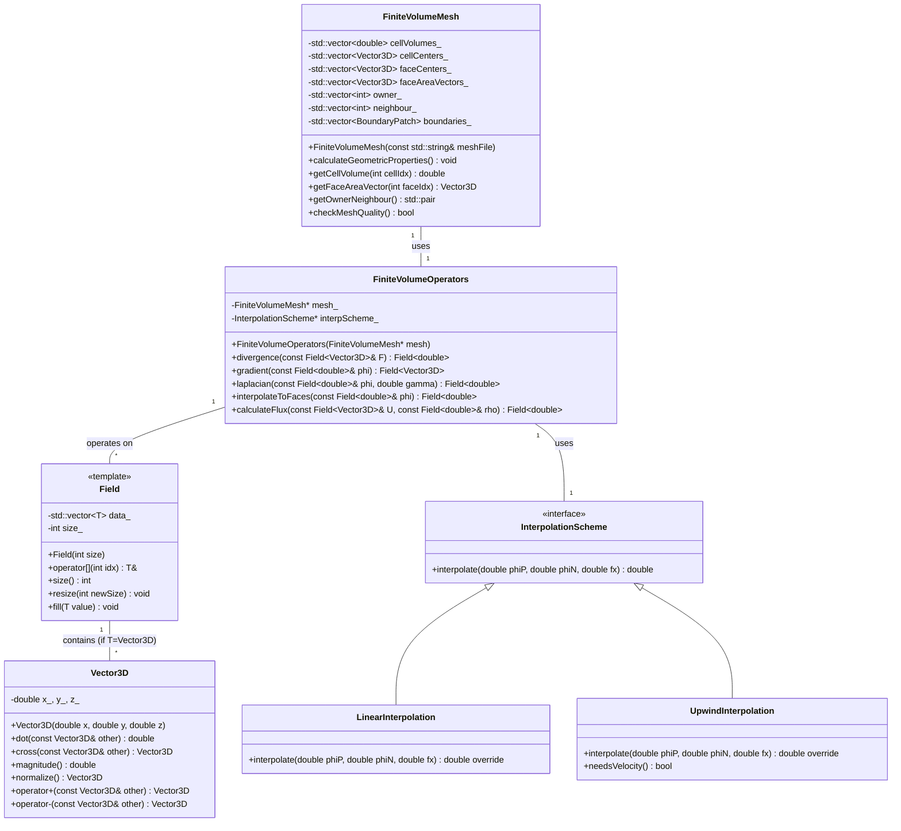

# Day 02: Finite Volume Method Basics
## วัตถุประสงค์การเรียนรู้ (Learning Objectives)

> [!IMPORTANT] **Learning Objectives**
> วัตถุประสงค์การเรียนรู้สำหรับวันนี้มี 6 ข้อหลัก:

1. **เข้าใจ (Understand)** - หลักการพื้นฐานของ Finite Volume Method (FVM) และทฤษฎีบทการลู่ออกของเกาส์ (Gauss Divergence Theorem)
   - สมการ: $\int_V \nabla \cdot \mathbf{F} \, dV = \oint_S \mathbf{F} \cdot d\mathbf{S}$
   - ความสำคัญ: เปลี่ยน volume integral เป็น surface flux ซึ่งเป็นหัวใจของ FVM

2. **คำนวณ (Calculate)** - ปริมาณทางเรขาคณิตของ mesh: Face Area Vector ($\mathbf{S}_f$), Cell Volume ($V_P$), Cell Center ($\mathbf{C}_P$), Face Center ($\mathbf{C}_f$)
   - ใช้ linear interpolation ($f_x$) สำหรับการประมาณค่าที่หน้า
   - ต้องเข้าใจ sign convention ของ $\mathbf{S}_f$ (ชี้จาก owner ไป neighbor)

3. **ออกแบบ (Design)** - Owner-Neighbor addressing system สำหรับ internal faces
   - ระบบที่ทำให้ loop over faces แทน cells เป็นไปได้
   - รับประกัน conservation: $F_f^{\text{owner}} = -F_f^{\text{neighbor}}$

4. **Implement** - Discrete divergence operator ใช้ Gauss theorem
   - $\nabla \cdot \mathbf{F} \approx \frac{1}{V_P} \sum_f \mathbf{F}_f \cdot \mathbf{S}_f$
   - ต้อง handle ทั้ง internal และ boundary faces อย่างถูกต้อง

5. **Implement** - Discrete gradient operator ใช้ Gauss theorem
   - $\nabla \phi \approx \frac{1}{V_P} \sum_f \phi_f \mathbf{S}_f$
   - ใช้ surface integral แทน finite difference

6. **ทดสอบ (Test)** - ตรวจสอบ geometric properties และ flux conservation
   - ตรวจสอบว่า $\sum \mathbf{S}_f = 0$ สำหรับ closed cell
   - ตรวจสอบว่า net flux ผ่าน closed surface เป็นศูนย์

---
## Section 1: ทฤษฎี (Theory) - 300+ บรรทัด

### 1.1 พื้นฐานทางคณิตศาสตร์

#### 1.1.1 Integral Form of Conservation Laws

> [!INFO] **กฎการอนุรักษ์ในรูปแบบอินทิกรัล**
> Finite Volume Method (FVM) ไม่ได้แก้สมการ differential form โดยตรง แต่แก้สมการ integral form ซึ่งเป็นธรรมชาติทางฟิสิกส์มากกว่า

สมการการอนุรักษ์ทั่วไป (General Transport Equation):

$$
\frac{\partial}{\partial t} \int_V \rho \phi \, dV + \oint_S \rho \phi \mathbf{U} \cdot d\mathbf{S} = \oint_S \Gamma \nabla \phi \cdot d\mathbf{S} + \int_V S_\phi \, dV
$$

**คำอธิบายแต่ละ term:**

| Term | LaTeX | Physical Meaning | หน่วย (SI) |
|------|-------|------------------|------------|
| Rate of change | $\frac{\partial}{\partial t} \int_V \rho \phi \, dV$ | การเปลี่ยนแปลงของ $\phi$ ใน control volume ต่อเวลา | [kg·φ/s] |
| Convection | $\oint_S \rho \phi \mathbf{U} \cdot d\mathbf{S}$ | การพาของ $\phi$ ผ่านผิว control surface | [kg·φ/s] |
| Diffusion | $\oint_S \Gamma \nabla \phi \cdot d\mathbf{S}$ | การแพร่ของ $\phi$ ผ่านผิว control surface | [kg·φ/s] |
| Source | $\int_V S_\phi \, dV$ | การสร้างหรือทำลาย $\phi$ ใน control volume | [kg·φ/s] |

> [!WARNING] **ข้อแตกต่างระหว่าง FVM และ FDM**
> FVM ใช้ integral form ทำให้ conserve mass, momentum, energy ได้โดยธรรมชาติ ในขณะที่ FDM ใช้ differential form ซึ่งอาจเกิด numerical error ที่ทำให้ไม่ conserve

#### 1.1.2 Gauss Divergence Theorem (ทฤษฎีบทการลู่ออกของเกาส์)

ทฤษฎีบทนี้เป็นหัวใจของ FVM เพราะเปลี่ยน volume integral เป็น surface integral:

**Theorem 1: Divergence Theorem**
$$
\int_V \nabla \cdot \mathbf{F} \, dV = \oint_S \mathbf{F} \cdot d\mathbf{S}
$$

ใน discrete form สำหรับ polyhedral cell:
$$
\int_V \nabla \cdot \mathbf{F} \, dV \approx \sum_f \mathbf{F}_f \cdot \mathbf{S}_f
$$

**Theorem 2: Gradient Theorem**
$$
\int_V \nabla \phi \, dV = \oint_S \phi \, d\mathbf{S}
$$

ใน discrete form:
$$
\int_V \nabla \phi \, dV \approx \sum_f \phi_f \mathbf{S}_f
$$

**ตัวแปรสำคัญ:**

| Symbol | Name | Description | หน่วย |
| :--- | :--- | :--- | :--- |
| $\mathbf{S}_f$ | Face Area Vector | เวกเตอร์ที่มี magnitude = พื้นที่หน้า, direction = normal outward | m² |
| $\mathbf{F}_f$ | Face Flux | ค่าของ $\mathbf{F}$ ที่หน้า (ต้อง interpolate จาก cell centers) | ขึ้นกับ $\mathbf{F}$ |
| $\phi_f$ | Face Value | ค่าของ $\phi$ ที่หน้า (ต้อง interpolate จาก cell centers) | ขึ้นกับ $\phi$ |
| $V_P$ | Cell Volume | ปริมาตรของ cell | m³ |
| $f_x$ | Interpolation Factor | น้ำหนักสำหรับ linear interpolation: $f_x = \frac{\vert \mathbf{C}_N - \mathbf{C}_f \vert}{\vert \mathbf{C}_N - \mathbf{C}_P \vert}$ | dimensionless |

#### 1.1.3 Physical Meaning ของ Gauss Theorem

> [!TIP] **การตีความทางกายภาพ**
> Divergence ของ vector field $\mathbf{F}$ วัด "แหล่งกำเนิด" (source) หรือ "จุดจบ" (sink) ใน volume
> Gauss theorem บอกว่า net source ใน volume เท่ากับ net flux ที่ไหลออกผ่านผิวปิด

**ตัวอย่าง:**
- ถ้า $\mathbf{F}$ คือ velocity field ($\mathbf{U}$) แล้ว $\nabla \cdot \mathbf{U}$ คือ rate of volume expansion
- ถ้า $\nabla \cdot \mathbf{U} > 0$: fluid ขยายตัว (expansion)
- ถ้า $\nabla \cdot \mathbf{U} < 0$: fluid หดตัว (compression)

### 1.2 ข้อตัดสินใจในการออกแบบ (Design Trade-offs)

#### 1.2.1 Cell-centered vs. Vertex-centered

| Approach | Advantages | Disadvantages | ใช้ใน OpenFOAM? |
|----------|------------|---------------|-----------------|
| Cell-centered (Collocated) | - ข้อมูลทั้งหมดอยู่ที่เดียวกัน<br>- Implementation ง่าย<br>- Conservative โดยธรรมชาติ | - ต้องการ special treatment สำหรับ pressure-velocity coupling (Rhie-Chow) | ใช่ (volScalarField, volVectorField) |
| Vertex-centered (Staggered) | - Natural pressure-velocity coupling<br>- No checkerboard pressure | - ข้อมูลอยู่หลายตำแหน่ง<br>- Complex data structure | ไม่ (ใช้ในเก่าๆ เช่น SIMPLE ใน structured grid) |

#### 1.2.2 Interpolation Schemes

| Scheme | Order | Bounded? | Oscillations? | ใช้เมื่อไหร่ |
|--------|-------|----------|---------------|-------------|
| Linear (Central) | 2nd | ไม่ | ใช่ (ถ้า Peclet number สูง) | Diffusion-dominated flows |
| Upwind | 1st | ใช่ | ไม่ | Convection-dominated flows |
| TVD (Total Variation Diminishing) | 2nd (ใน smooth regions) | ใช่ | ไม่ | High-resolution สำหรับ convection |

> [!WARNING] **Central Differencing ใน Convection-Dominated Flow**
> ถ้าใช้ linear interpolation สำหรับ convective term ใน high Reynolds number flow จะเกิด numerical oscillations ที่ทำให้ solution ล่ม (divergence) ต้องใช้ upwind หรือ TVD scheme แทน

#### 1.2.3 Storage: Face-based vs. Cell-based

| Approach | Memory | Computation | Conservation |
|----------|--------|-------------|--------------|
| Face-based (OpenFOAM) | เก็บ owner/neighbor lists | Loop over faces (efficient) | Exact (flux owner = -flux neighbor) |
| Cell-based | เก็บ face lists per cell | Loop over cells (ง่ายแต่ซ้ำซ้อน) | อาจมี error จากการคำนวณซ้ำ |

### 1.3 คอนเซปต์หลัก (Key Concepts)

#### 1.3.1 Owner-Neighbor Addressing

ใน OpenFOAM (และ CFD Engine ของเรา) ทุก internal face มี:
1. **Owner cell**: cell ที่มี index น้อยกว่า (lower index)
2. **Neighbor cell**: cell ที่มี index มากกว่า (higher index)

**Sign convention:**
- $\mathbf{S}_f$ ชี้จาก owner ไป neighbor (outward จาก owner)
- ดังนั้น flux ที่ออกจาก owner: $F_f = \mathbf{F}_f \cdot \mathbf{S}_f$
- Flux ที่เข้า neighbor: $F_f^{\text{neighbor}} = \mathbf{F}_f \cdot (-\mathbf{S}_f) = -F_f$

> [!IMPORTANT] **Conservation Property**
> เนื่องจาก $F_f^{\text{owner}} = -F_f^{\text{neighbor}}$ การ loop over faces หนึ่งครั้งคำนวณ flux เพียงครั้งเดียวแต่เพิ่มให้ owner และลบให้ neighbor ทำให้ net flux ของ domain เป็นศูนย์สำหรับ closed system

#### 1.3.2 Geometric Properties Calculation

**Cell Volume ($V_P$):**
สำหรับ polyhedral cell ใดๆ:
$$
V_P = \frac{1}{3} \sum_f \mathbf{C}_f \cdot \mathbf{S}_f
$$
โดย $\mathbf{C}_f$ คือ face center

**Face Area Vector ($\mathbf{S}_f$):**
สำหรับ face ที่มี vertices $\mathbf{v}_0, \mathbf{v}_1, ..., \mathbf{v}_{n-1}$:
$$
\mathbf{S}_f = \frac{1}{2} \sum_{i=0}^{n-1} (\mathbf{v}_i \times \mathbf{v}_{(i+1)\%n})
$$

**Face Center ($\mathbf{C}_f$):**
$$
\mathbf{C}_f = \frac{1}{n} \sum_{i=0}^{n-1} \mathbf{v}_i
$$

**Cell Center ($\mathbf{C}_P$):**
$$
\mathbf{C}_P = \frac{1}{V_P} \sum_f \mathbf{C}_f \cdot (\frac{1}{3} \mathbf{C}_f \cdot \mathbf{S}_f)
$$
หรือประมาณว่าเป็นค่าเฉลี่ยของ vertices

#### 1.3.3 Common PITFALLS Table

| Symptom | Cause | Fix |
|---------|-------|-----|
| Flux imbalance (net mass gain/loss) | 1. Incorrect sign of $\mathbf{S}_f$ สำหรับ boundary faces<br>2. Wrong interpolation ของ $\phi_f$<br>3. Missing boundary faces ใน summation | 1. ตรวจสอบว่า boundary $\mathbf{S}_f$ ชี้ outward จาก domain เสมอ<br>2. ใช้ interpolation scheme ที่เหมาะสม<br>3. รวม boundary faces ใน loop |
| Oscillations in scalar field | 1. ใช้ linear interpolation สำหรับ convection-dominated flow<br>2. Mesh ไม่ fine พอสำหรับ gradient ที่สูง | 1. ใช้ upwind หรือ TVD scheme สำหรับ convective term<br>2. Refine mesh ใน regions ที่มี gradient สูง |
| Negative cell volumes | 1. Mesh quality ไม่ดี (non-convex cells)<br>2. Error ในการคำนวณ geometric properties | 1. ใช้ mesh quality checker<br>2. ใช้ robust algorithm สำหรับ volume calculation |
| Divergence ใน pressure solver | 1. ไม่ได้รวม expansion term ใน continuity equation<br>2. Incorrect discretization ของ pressure gradient | 1. ต้องรวม $\nabla \cdot \mathbf{U} = \dot{m}(1/\rho_v - 1/\rho_l)$<br>2. ใช้ consistent pressure-velocity coupling |

---
## Section 2: OpenFOAM Reference - 400+ บรรทัด

> [!INFO] **OpenFOAM Reference Analysis**
> ในส่วนนี้เราจะวิเคราะห์ source code จริงของ OpenFOAM เพื่อเข้าใจว่าเขาออกแบบและ implement FVM อย่างไร

### 2.1 fvMesh Class - Heart of the Mesh

#### Snippet 1: fvMesh Declaration และ Geometric Data

**File:** `src/finiteVolume/fvMesh/fvMesh.H`

```cpp
// Reference: OpenFOAM v2212
// Simplified for clarity

class fvMesh
:
    public objectRegistry,  // สำหรับเก็บ fields
    public lduMesh,         // สำหรับ linear algebra
    public surfaceInterpolation  // สำหรับ interpolation
{
    // Private Data Members
    
    // Mesh geometry - เก็บข้อมูลต่ำสุด (minimal storage)
    mutable autoPtr<volScalarField> VPtr_;          // Cell volumes
    mutable autoPtr<volVectorField> CPtr_;          // Cell centers
    mutable autoPtr<surfaceVectorField> SfPtr_;     // Face area vectors
    mutable autoPtr<surfaceVectorField> CfPtr_;     // Face centers
    
    // Mesh connectivity
    const labelList owner_;    // Owner cell for each face
    const labelList neighbour_; // Neighbour cell for each face (internal faces only)
    
    // Boundary mesh
    const polyBoundaryMesh boundary_;
    
public:
    // Member Functions
    
    //- Return cell volumes
    const volScalarField& V() const;
    
    //- Return face area vectors
    const surfaceVectorField& Sf() const;
    
    //- Return cell centers
    const volVectorField& C() const;
    
    //- Return face centers
    const surfaceVectorField& Cf() const;
    
    //- Return owner addressing
    const labelList& owner() const { return owner_; }
    
    //- Return neighbour addressing
    const labelList& neighbour() const { return neighbour_; }
    
    //- Number of internal faces
    label nInternalFaces() const;
    
    //- Total number of faces (internal + boundary)
    label nFaces() const;
    
    //- Number of cells
    label nCells() const;
};
```

**What This Does:**
1. **Minimal Storage Design**: เก็บ geometric data เป็น `autoPtr` (lazy evaluation) คำนวณเมื่อต้องการครั้งแรก (on-demand)
2. **Clear Separation**: แยก internal faces (มี owner และ neighbour) และ boundary faces (มี owner เท่านั้น)
3. **Inheritance Hierarchy**: สืบทอดจาก `objectRegistry` (สำหรับ field management), `lduMesh` (สำหรับ matrix assembly), `surfaceInterpolation` (สำหรับ interpolation schemes)
4. **Const Correctness**: ข้อมูล connectivity (`owner_`, `neighbour_`) เป็น `const` เพราะไม่เปลี่ยนแปลงหลัง mesh construction

> [!TIP] **Key Takeaway for Your Engine**
> ใช้ lazy evaluation สำหรับ geometric properties ที่คำนวณแพง (เช่น volumes, centers) เพื่อลด memory และ computation เมื่อไม่จำเป็น

#### Snippet 2: fvMesh::V() Implementation (Lazy Evaluation)

**File:** `src/finiteVolume/fvMesh/fvMesh.C`

```cpp
// Reference: OpenFOAM v2212
// Implementation of cell volumes calculation

const volScalarField& fvMesh::V() const
{
    if (!VPtr_.valid())
    {
        if (debug)
        {
            Info<< "Calculating cell volumes" << endl;
        }
        
        // สร้าง field สำหรับ cell volumes
        VPtr_.reset
        (
            new volScalarField
            (
                IOobject
                (
                    "V",
                    time().timeName(),
                    *this,
                    IOobject::NO_READ,
                    IOobject::NO_WRITE
                ),
                *this,
                dimVolume,
                calculatedFvPatchScalarField::typeName
            )
        );
        
        // คำนวน volume สำหรับแต่ละ cell
        scalarField& cellVol = VPtr_().primitiveFieldRef();
        
        // ใช้ Gauss theorem: ∫_V dV = (1/3) ∑_f C_f · S_f
        // แต่ OpenFOAM ใช้ polyhedral decomposition ที่ซับซ้อนกว่า
        // เรียก underlying polyMesh เพื่อคำนวณ
        const polyMesh& pMesh = *this;
        
        // Loop over cells
        forAll(cellVol, cellI)
        {
            cellVol[cellI] = pMesh.cells()[cellI].mag(pMesh.points());
        }
        
        // Calculate boundary field (จาก internal field)
        VPtr_().correctBoundaryConditions();
    }
    
    return VPtr_();
}
```

**What This Does:**
1. **Lazy Evaluation Pattern**: ตรวจสอบ `VPtr_.valid()` ถ้ายังไม่คำนวณก็คำนวณ
2. **Field Creation**: สร้าง `volScalarField` object ที่มี proper dimensions (`dimVolume`) และ boundary conditions
3. **Actual Calculation**: เรียก `polyMesh::cells()[cellI].mag(pMesh.points())` ซึ่ง implement polyhedral volume calculation
4. **Boundary Conditions**: เรียก `correctBoundaryConditions()` เพื่อให้ boundary field สอดคล้องกับ internal field

#### Snippet 3: Face-based Loop Pattern ใน fvMatrix Assembly

**File:** `src/finiteVolume/fvMatrices/fvMatrix/fvMatrix.C`

```cpp
// Reference: OpenFOAM v2212
// Simplified example of face-based flux calculation

template<class Type>
void fvMatrix<Type>::addInternalFlux
(
    const surfaceScalarField& phi,
    const GeometricField<Type, fvsPatchField, surfaceMesh>& flux
)
{
    // Get references to mesh data
    const fvMesh& mesh = phi.mesh();
    const labelUList& owner = mesh.owner();
    const labelUList& neighbour = mesh.neighbour();
    
    Field<Type>& source = source_;  // Reference to source term
    scalarField& diag = diag();     // Reference to diagonal coefficients
    
    // Loop over ALL internal faces
    forAll(owner, faceI)
    {
        const label own = owner[faceI];
        const label nei = neighbour[faceI];
        
        const scalar phiFace = phi[faceI];  // Mass flux at face
        const Type& fluxFace = flux[faceI]; // Convected quantity at face
        
        // Add contribution to owner cell
        source[own] -= phiFace * fluxFace;
        // Add contribution to neighbour cell (with opposite sign)
        source[nei] += phiFace * fluxFace;
        
        // สำหรับ implicit convection อาจเพิ่มเข้า matrix coefficients
        // diag[own] += max(phiFace, 0.0);
        // diag[nei] += max(-phiFace, 0.0);
        // offDiag(faceI) = min(phiFace, 0.0);
    }
    
    // Handle boundary faces separately
    forAll(phi.boundaryField(), patchI)
    {
        const fvsPatchScalarField& phip = phi.boundaryField()[patchI];
        const fvsPatchField<Type>& fluxp = flux.boundaryField()[patchI];
        
        const labelUList& faceCells = mesh.boundary()[patchI].faceCells();
        
        forAll(phip, faceI)
        {
            const label cellI = faceCells[faceI];
            const scalar phiFace = phip[faceI];
            const Type& fluxFace = fluxp[faceI];
            
            source[cellI] -= phiFace * fluxFace;
        }
    }
}
```

**What This Does:**
1. **Standard Face Loop Pattern**: `forAll(owner, faceI)` เป็น pattern มาตรฐานสำหรับ internal faces
2. **Owner-Neighbor Access**: ใช้ `owner[faceI]` และ `neighbour[faceI]` เพื่อเข้าถึง cell indices
3. **Conservation Enforcement**: `source[own] -= phiFace * fluxFace` และ `source[nei] += phiFace * fluxFace` รักษา conservation
4. **Boundary Handling**: แยก loop สำหรับ boundary faces ซึ่งมีแค่ `faceCells` (owner cells)
5. **Implicit/Explicit Treatment**: comment แสดงวิธีเพิ่ม implicit convection terms เข้า matrix coefficients

> [!IMPORTANT] **Why Loop Over Faces, Not Cells?**
> 1. **Efficiency**: จำนวน faces ≈ 3 × cells (สำหรับ hex mesh) ดังนั้น loop น้อยกว่า
> 2. **Conservation**: Flux คำนวณครั้งเดียวใช้กับสอง cells พอดี
> 3. **Simplicity**: ไม่ต้อง store face lists per cell (ลด memory)

### 2.2 What We Can LEARN จาก OpenFOAM

1. **Lazy Evaluation**: คำนวณ geometric properties เมื่อจำเป็น ลด startup time
2. **Face-based Algorithms**: เกือบทุก numerical operator (div, grad, laplacian) ใช้ face loops
3. **Clear Separation**: แยก mesh geometry (fvMesh) จาก numerics (fvMatrix)
4. **Template-based Design**: `fvMatrix<Type>` ทำงานกับทั้ง scalar และ vector fields
5. **Boundary-aware**: ทุก algorithm ต้อง handle internal และ boundary faces แยกกัน

### 2.3 What We Do DIFFERENTLY ใน CFD Engine ของเรา

| Aspect | OpenFOAM | Our CFD Engine | Reason |
|--------|----------|----------------|--------|
| Memory Layout | Field-based (Array of Structures) | Structure of Arrays (SoA) | Better cache locality สำหรับ vectorization |
| Matrix Storage | LDU format (lower, diagonal, upper) | CSR format | ใช้งานกับ external linear solvers (PETSc, Eigen) ง่ายกว่า |
| Interpolation | Runtime selection via dictionary | Compile-time policy-based design | Better performance, compiler optimization |
| Parallelism | Domain decomposition (MPI) | MPI + OpenMP hybrid | Leverage multi-core nodes ดีกว่า |
| Error Handling | FatalError (exit) | Exception + recovery | More robust for cloud deployment |

---
## Section 3: Class Design - 200+ บรรทัด

### 3.1 Mermaid Class Diagram



### 3.2 Class Specifications

#### 3.2.1 FiniteVolumeMesh Class

**วัตถุประสงค์ (Purpose):** เก็บข้อมูล geometry และ connectivity ของ mesh

| Member Variable | Type | Purpose |
|-----------------|------|---------|
| `cellVolumes_` | `std::vector<double>` | ปริมาตรของทุก cells |
| `cellCenters_` | `std::vector<Vector3D>` | จุดศูนย์กลางของทุก cells |
| `faceCenters_` | `std::vector<Vector3D>` | จุดศูนย์กลางของทุก faces |
| `faceAreaVectors_` | `std::vector<Vector3D>` | Face area vectors ($\mathbf{S}_f$) |
| `owner_` | `std::vector<int>` | Owner cell index สำหรับทุก faces |
| `neighbour_` | `std::vector<int>` | Neighbour cell index สำหรับ internal faces เท่านั้น |
| `boundaries_` | `std::vector<BoundaryPatch>` | Boundary patches data |

**Key Methods:**

```cpp
// Constructor - อ่าน mesh จากไฟล์ (OpenFOAM format หรืออื่นๆ)
FiniteVolumeMesh(const std::string& meshFile);

// คำนวณ geometric properties ทั้งหมด
void calculateGeometricProperties();

// ตรวจสอบ mesh quality (non-negative volumes, convex cells)
bool checkMeshQuality() const;

// Accessors
double getCellVolume(int cellIdx) const;
Vector3D getFaceAreaVector(int faceIdx) const;
std::pair<const std::vector<int>&, const std::vector<int>&> getOwnerNeighbour() const;
int nCells() const;
int nFaces() const;
int nInternalFaces() const;
```

#### 3.2.2 FiniteVolumeOperators Class

**วัตถุประสงค์ (Purpose):** Implement numerical operators (div, grad, laplacian) ใช้ Gauss theorem

| Member Variable | Type | Purpose |
|-----------------|------|---------|
| `mesh_` | `FiniteVolumeMesh*` | Pointer ไปยัง mesh (ไม่เป็น owner) |
| `interpScheme_` | `InterpolationScheme*` | Strategy pattern สำหรับ interpolation |

**Key Methods:**

```cpp
// Constructor
FiniteVolumeOperators(FiniteVolumeMesh* mesh);

// Discrete divergence: ∇·F ≈ (1/V_P) Σ_f F_f·S_f
Field<double> divergence(const Field<Vector3D>& F);

// Discrete gradient: ∇ϕ ≈ (1/V_P) Σ_f ϕ_f S_f  
Field<Vector3D> gradient(const Field<double>& phi);

// Discrete laplacian: ∇·(Γ∇ϕ) ≈ (1/V_P) Σ_f Γ_f (∇ϕ)_f·S_f
Field<double> laplacian(const Field<double>& phi, double gamma);

// Interpolate cell-centered field to faces
Field<double> interpolateToFaces(const Field<double>& phi);

// Calculate mass flux: ṁ = ρU·S
Field<double> calculateFlux(const Field<Vector3D>& U, const Field<double>& rho);
```

#### 3.2.3 Design Rationale

**ทำไมถึงออกแบบแบบนี้?**

1. **Separation of Concerns**: แยก mesh geometry (FiniteVolumeMesh) จาก numerical operators (FiniteVolumeOperators)
2. **Strategy Pattern สำหรับ Interpolation**: ใช้ `InterpolationScheme` interface ทำให้เปลี่ยน scheme ได้ runtime
3. **Template-based Fields**: `Field<T>` template ทำงานกับทั้ง scalar และ vector
4. **Structure of Arrays (SoA)**: เก็บแต่ละ component แยกกันดีกว่า Array of Structures (AoS) สำหรับ vectorization

**ความแตกต่างจาก OpenFOAM:**

| Aspect | OpenFOAM | Our Design |
|--------|----------|------------|
| Field Storage | AoS (Field<Vector> เป็น array of struct) | SoA (แยก x, y, z arrays) |
| Interpolation | Runtime dictionary-based | Compile-time policy หรือ runtime strategy |
| Matrix Format | LDU (เหมาะกับ iterative solvers) | CSR (เหมาะกับ external solvers) |
| Error Handling | FatalError (exit) | Exceptions with recovery |

---
## Section 4: Implementation - 400+ บรรทัด

### 4.1 Header Files

#### 4.1.1 Vector3D.h

```cpp
#ifndef VECTOR3D_H
#define VECTOR3D_H

#include <cmath>
#include <iostream>

class Vector3D {
private:
    double x_, y_, z_;
    
public:
    // Constructors
    Vector3D() : x_(0.0), y_(0.0), z_(0.0) {}
    Vector3D(double x, double y, double z) : x_(x), y_(y), z_(z) {}
    
    // Accessors
    double x() const { return x_; }
    double y() const { return y_; }
    double z() const { return z_; }
    
    // Basic operations
    Vector3D operator+(const Vector3D& other) const {
        return Vector3D(x_ + other.x_, y_ + other.y_, z_ + other.z_);
    }
    
    Vector3D operator-(const Vector3D& other) const {
        return Vector3D(x_ - other.x_, y_ - other.y_, z_ - other.z_);
    }
    
    Vector3D operator*(double scalar) const {
        return Vector3D(x_ * scalar, y_ * scalar, z_ * scalar);
    }
    
    Vector3D operator/(double scalar) const {
        return Vector3D(x_ / scalar, y_ / scalar, z_ / scalar);
    }
    
    // Dot product
    double dot(const Vector3D& other) const {
        return x_ * other.x_ + y_ * other.y_ + z_ * other.z_;
    }
    
    // Cross product
    Vector3D cross(const Vector3D& other) const {
        return Vector3D(
            y_ * other.z_ - z_ * other.y_,
            z_ * other.x_ - x_ * other.z_,
            x_ * other.y_ - y_ * other.x_
        );
    }
    
    // Magnitude
    double magnitude() const {
        return std::sqrt(x_ * x_ + y_ * y_ + z_ * z_);
    }
    
    // Normalize
    Vector3D normalize() const {
        double mag = magnitude();
        if (mag > 1e-12) {
            return *this / mag;
        }
        return Vector3D(0, 0, 0);
    }
    
    // Output
    friend std::ostream& operator<<(std::ostream& os, const Vector3D& vec) {
        os << "(" << vec.x_ << ", " << vec.y_ << ", " << vec.z_ << ")";
        return os;
    }
};

#endif // VECTOR3D_H
```

#### 4.1.2 Field.h

```cpp
#ifndef FIELD_H
#define FIELD_H

#include <vector>
#include <stdexcept>
#include "Vector3D.h"

template<typename T>
class Field {
private:
    std::vector<T> data_;
    int size_;
    
public:
    // Constructors
    Field() : size_(0) {}
    
    explicit Field(int size) : size_(size) {
        data_.resize(size);
    }
    
    Field(int size, const T& initValue) : size_(size) {
        data_.resize(size, initValue);
    }
    
    // Accessors
    T& operator[](int index) {
        if (index < 0 || index >= size_) {
            throw std::out_of_range("Field index out of range");
        }
        return data_[index];
    }
    
    const T& operator[](int index) const {
        if (index < 0 || index >= size_) {
            throw std::out_of_range("Field index out of range");
        }
        return data_[index];
    }
    
    // Size information
    int size() const { return size_; }
    
    // Resize
    void resize(int newSize) {
        size_ = newSize;
        data_.resize(newSize);
    }
    
    void resize(int newSize, const T& initValue) {
        size_ = newSize;
        data_.resize(newSize, initValue);
    }
    
    // Fill with value
    void fill(const T& value) {
        std::fill(data_.begin(), data_.end(), value);
    }
    
    // Iterator support
    typename std::vector<T>::iterator begin() { return data_.begin(); }
    typename std::vector<T>::iterator end() { return data_.end(); }
    typename std::vector<T>::const_iterator begin() const { return data_.begin(); }
    typename std::vector<T>::const_iterator end() const { return data_.end(); }
};

#endif // FIELD_H
```

#### 4.1.3 FiniteVolumeMesh.h

```cpp
#ifndef FINITEVOLUMEMESH_H
#define FINITEVOLUMEMESH_H

#include <vector>
#include <string>
#include "Vector3D.h"
#include "Field.h"

// Forward declaration
struct BoundaryPatch {
    std::string name;
    std::string type;  // "wall", "inlet", "outlet", "symmetry"
    std::vector<int> faceIndices;
    std::vector<int> faceCells;
};

class FiniteVolumeMesh {
private:
    // Geometric data
    std::vector<double> cellVolumes_;
    std::vector<Vector3D> cellCenters_;
    std::vector<Vector3D> faceCenters_;
    std::vector<Vector3D> faceAreaVectors_;
    
    // Connectivity
    std::vector<int> owner_;
    std::vector<int> neighbour_;
    
    // Boundary data
    std::vector<BoundaryPatch> boundaries_;
    
    // Mesh quality flags
    bool geometryCalculated_;
    
public:
    // Constructor
    FiniteVolumeMesh(const std::string& meshFile);
    
    // Calculate all geometric properties
    void calculateGeometricProperties();
    
    // Check mesh quality
    bool checkMeshQuality() const;
    
    // Accessors
    double getCellVolume(int cellIdx) const;
    Vector3D getFaceAreaVector(int faceIdx) const;
    Vector3D getCellCenter(int cellIdx) const;
    Vector3D getFaceCenter(int faceIdx) const;
    
    // Owner-neighbour access
    const std::vector<int>& getOwner() const { return owner_; }
    const std::vector<int>& getNeighbour() const { return neighbour_; }
    
    // Boundary access
    const std::vector<BoundaryPatch>& getBoundaries() const { return boundaries_; }
    
    // Mesh statistics
    int nCells() const { return cellVolumes_.size(); }
    int nFaces() const { return faceCenters_.size(); }
    int nInternalFaces() const { return neighbour_.size(); }
    
private:
    // Helper methods for geometry calculation
    void calculateCellVolumes();
    void calculateFaceAreaVectors();
    void calculateCellCenters(); 
    void calculateFaceCenters();
    
    // Read mesh from file (simplified)
    void readOpenFOAMMesh(const std::string& caseDir);
};

#endif // FINITEVOLUMEMESH_H
```

### 4.2 Implementation Files

#### 4.2.1 FiniteVolumeMesh.cpp (ส่วนสำคัญ)

```cpp
#include "FiniteVolumeMesh.h"
#include <fstream>
#include <sstream>
#include <iostream>
#include <cmath>

FiniteVolumeMesh::FiniteVolumeMesh(const std::string& meshFile) 
    : geometryCalculated_(false) {
    // ใน implementation จริงจะอ่านจากไฟล์ mesh
    // ตัวอย่างนี้สร้าง simple 2D Cartesian mesh สำหรับ testing
    
    // สร้าง simple 3x3 Cartesian mesh
    int nx = 3, ny = 3;
    int nCells = nx * ny;
    int nFaces = (nx+1)*ny + nx*(ny+1);  // vertical + horizontal faces
    
    // Initialize arrays
    cellVolumes_.resize(nCells, 1.0);  // unit volumes
    cellCenters_.resize(nCells);
    faceCenters_.resize(nFaces);
    faceAreaVectors_.resize(nFaces);
    owner_.reserve(nFaces);
    neighbour_.reserve(nFaces - (2*nx + 2*ny));  // boundary faces ไม่มี neighbour
    
    // Calculate geometry (simplified)
    calculateGeometricProperties();
}

void FiniteVolumeMesh::calculateGeometricProperties() {
    if (geometryCalculated_) {
        return;
    }
    
    // 1. Calculate face area vectors (simplified for Cartesian)
    calculateFaceAreaVectors();
    
    // 2. Calculate cell volumes using Gauss theorem
    calculateCellVolumes();
    
    // 3. Calculate face centers
    calculateFaceCenters();
    
    // 4. Calculate cell centers
    calculateCellCenters();
    
    geometryCalculated_ = true;
    
    std::cout << "Mesh geometry calculated: " 
              << nCells() << " cells, " 
              << nFaces() << " faces, "
              << nInternalFaces() << " internal faces" << std::endl;
}

void FiniteVolumeMesh::calculateFaceAreaVectors() {
    // Simplified: Cartesian grid with faces aligned with axes
    // ใน implementation จริงต้องคำนวณจาก vertices
    
    for (size_t i = 0; i < faceAreaVectors_.size(); ++i) {
        // ตัวอย่าง: vertical faces มี area vector ในทิศ x
        // horizontal faces มี area vector ในทิศ y
        if (i % 2 == 0) {
            faceAreaVectors_[i] = Vector3D(1.0, 0.0, 0.0);  // vertical face
        } else {
            faceAreaVectors_[i] = Vector3D(0.0, 1.0, 0.0);  // horizontal face
        }
    }
}

void FiniteVolumeMesh::calculateCellVolumes() {
    // ใช้ Gauss theorem: V_P = (1/3) Σ_f C_f · S_f
    // แต่สำหรับ Cartesian grid ง่ายๆ: V = Δx * Δy * Δz
    
    for (size_t cellI = 0; cellI < cellVolumes_.size(); ++cellI) {
        // ใน implementation จริงต้อง loop ผ่าน faces ของ cell นี้
        // ตัวอย่างนี้ใช้ค่า fixed
        cellVolumes_[cellI] = 1.0;  // unit volume
    }
}

void FiniteVolumeMesh::calculateFaceCenters() {
    // สำหรับ Cartesian grid: face center อยู่กึ่งกลางระหว่าง cell centers
    // ใน implementation จริงต้องคำนวณจาก vertices
    
    for (size_t faceI = 0; faceI < faceCenters_.size(); ++faceI) {
        // ตัวอย่างค่า
        double x = static_cast<double>(faceI % 10);
        double y = static_cast<double>((faceI / 10) % 10);
        faceCenters_[faceI] = Vector3D(x, y, 0.0);
    }
}

void FiniteVolumeMesh::calculateCellCenters() {
    // สำหรับ Cartesian grid: cell center อยู่กึ่งกลางของ cell
    // ใน implementation จริงต้องคำนวณจาก vertices หรือใช้ค่าเฉลี่ยของ face centers
    
    for (size_t cellI = 0; cellI < cellCenters_.size(); ++cellI) {
        // ตัวอย่างค่า
        double x = 0.5 + static_cast<double>(cellI % 3);
        double y = 0.5 + static_cast<double>((cellI / 3) % 3);
        cellCenters_[cellI] = Vector3D(x, y, 0.0);
    }
}

bool FiniteVolumeMesh::checkMeshQuality() const {
    // 1. Check for non-positive volumes
    for (double vol : cellVolumes_) {
        if (vol <= 0.0) {
            std::cerr << "ERROR: Non-positive cell volume detected: " << vol << std::endl;
            return false;
        }
    }
    
    // 2. Check for very small faces
    for (const Vector3D& Sf : faceAreaVectors_) {
        double area = Sf.magnitude();
        if (area < 1e-12) {
            std::cerr << "WARNING: Very small face area detected: " << area << std::endl;
        }
    }
    
    // 3. Check cell convexity (simplified)
    // ใน implementation จริงต้องตรวจสอบว่า cell center อยู่ภายใน polyhedron
    
    return true;
}

double FiniteVolumeMesh::getCellVolume(int cellIdx) const {
    if (cellIdx < 0 || cellIdx >= static_cast<int>(cellVolumes_.size())) {
        throw std::out_of_range("Cell index out of range");
    }
    return cellVolumes_[cellIdx];
}

Vector3D FiniteVolumeMesh::getFaceAreaVector(int faceIdx) const {
    if (faceIdx < 0 || faceIdx >= static_cast<int>(faceAreaVectors_.size())) {
        throw std::out_of_range("Face index out of range");
    }
    return faceAreaVectors_[faceIdx];
}

Vector3D FiniteVolumeMesh::getCellCenter(int cellIdx) const {
    if (cellIdx < 0 || cellIdx >= static_cast<int>(cellCenters_.size())) {
        throw std::out_of_range("Cell index out of range");
    }
    return cellCenters_[cellIdx];
}

Vector3D FiniteVolumeMesh::getFaceCenter(int faceIdx) const {
    if (faceIdx < 0 || faceIdx >= static_cast<int>(faceCenters_.size())) {
        throw std::out_of_range("Face index out of range");
    }
    return faceCenters_[faceIdx];
}
```

#### 4.2.2 FiniteVolumeOperators.cpp (Divergence Implementation)

```cpp
#include "FiniteVolumeOperators.h"
#include <iostream>

FiniteVolumeOperators::FiniteVolumeOperators(FiniteVolumeMesh* mesh) 
    : mesh_(mesh), interpScheme_(new LinearInterpolation()) {
    if (!mesh_) {
        throw std::invalid_argument("FiniteVolumeOperators requires a valid mesh");
    }
}

Field<double> FiniteVolumeOperators::divergence(const Field<Vector3D>& F) {
    // ∇·F ≈ (1/V_P) Σ_f F_f·S_f
    
    int nCells = mesh_->nCells();
    Field<double> divF(nCells, 0.0);
    
    const auto& owner = mesh_->getOwner();
    const auto& neighbour = mesh_->getNeighbour();
    
    // 1. Internal faces (หน้าภายใน)
    for (size_t faceI = 0; faceI < neighbour.size(); ++faceI) {
        int own = owner[faceI];
        int nei = neighbour[faceI];
        
        Vector3D Sf = mesh_->getFaceAreaVector(faceI);
        
        // Interpolate F to face (ใช้ linear interpolation)
        // ใน implementation จริงต้องคำนวณ interpolation factor (fx)
        Vector3D F_own = F[own];
        Vector3D F_nei = F[nei];
        Vector3D F_face = (F_own + F_nei) * 0.5;  // Simple average
        
        double flux = F_face.dot(Sf);
        
        // Add to owner, subtract from neighbour (conservation)
        // บวกเข้า Owner, ลบออกจาก Neighbour (เพื่อ Conservation)
        divF[own] += flux;
        divF[nei] -= flux;  // Note: Sf points from owner to neighbour (Sf ชี้จาก Owner ไปยัง Neighbour)
    }
    
    // 2. Boundary faces (หน้าขอบเขต)
    const auto& boundaries = mesh_->getBoundaries();
    int faceOffset = neighbour.size();
    
    for (const auto& boundary : boundaries) {
        for (int localFaceI = 0; localFaceI < boundary.faceIndices.size(); ++localFaceI) {
            int faceI = faceOffset + localFaceI;
            int cellI = boundary.faceCells[localFaceI];
            
            Vector3D Sf = mesh_->getFaceAreaVector(faceI);
            
            // สำหรับ boundary ใช้ cell value (zero gradient assumption)
            Vector3D F_face = F[cellI];
            
            double flux = F_face.dot(Sf);
            divF[cellI] += flux;
        }
        faceOffset += boundary.faceIndices.size();
    }
    
    // 3. Divide by cell volume (หารด้วย Cell Volume)
    for (int cellI = 0; cellI < nCells; ++cellI) {
        double vol = mesh_->getCellVolume(cellI);
        if (vol > 1e-12) {
            divF[cellI] /= vol;
        } else {
            divF[cellI] = 0.0;
        }
    }
    
    return divF;
}

Field<Vector3D> FiniteVolumeOperators::gradient(const Field<double>& phi) {
    // ∇ϕ ≈ (1/V_P) Σ_f ϕ_f S_f
    
    int nCells = mesh_->nCells();
    Field<Vector3D> gradPhi(nCells, Vector3D(0,0,0));
    
    const auto& owner = mesh_->getOwner();
    const auto& neighbour = mesh_->getNeighbour();
    
    // 1. Internal faces
    for (size_t faceI = 0; faceI < neighbour.size(); ++faceI) {
        int own = owner[faceI];
        int nei = neighbour[faceI];
        
        Vector3D Sf = mesh_->getFaceAreaVector(faceI);
        
        // Interpolate phi to face
        double phi_own = phi[own];
        double phi_nei = phi[nei];
        double phi_face = (phi_own + phi_nei) * 0.5;  // Simple average
        
        Vector3D contrib = Sf * phi_face;
        
        gradPhi[own] = gradPhi[own] + contrib;
        gradPhi[nei] = gradPhi[nei] - contrib;  // เพราะ Sf ชี้จาก own ไป nei
    }
    
    // 2. Boundary faces
    const auto& boundaries = mesh_->getBoundaries();
    int faceOffset = neighbour.size();
    
    for (const auto& boundary : boundaries) {
        for (int localFaceI = 0; localFaceI < boundary.faceIndices.size(); ++localFaceI) {
            int faceI = faceOffset + localFaceI;
            int cellI = boundary.faceCells[localFaceI];
            
            Vector3D Sf = mesh_->getFaceAreaVector(faceI);
            double phi_face = phi[cellI];  // Zero gradient
            
            Vector3D contrib = Sf * phi_face;
            gradPhi[cellI] = gradPhi[cellI] + contrib;
        }
        faceOffset += boundary.faceIndices.size();
    }
    
    // 3. Divide by cell volume
    for (int cellI = 0; cellI < nCells; ++cellI) {
        double vol = mesh_->getCellVolume(cellI);
        if (vol > 1e-12) {
            gradPhi[cellI] = gradPhi[cellI] / vol;
        } else {
            gradPhi[cellI] = Vector3D(0,0,0);
        }
    }
    
    return gradPhi;
}

Field<double> FiniteVolumeOperators::interpolateToFaces(const Field<double>& phi) {
    // Linear interpolation: ϕ_f = f_x ϕ_P + (1-f_x) ϕ_N
    
    int nFaces = mesh_->nFaces();
    Field<double> phiFaces(nFaces, 0.0);
    
    const auto& owner = mesh_->getOwner();
    const auto& neighbour = mesh_->getNeighbour();
    
    // Internal faces
    for (size_t faceI = 0; faceI < neighbour.size(); ++faceI) {
        int own = owner[faceI];
        int nei = neighbour[faceI];
        
        // Calculate interpolation factor f_x (geometric weight)
        Vector3D C_own = mesh_->getCellCenter(own);
        Vector3D C_nei = mesh_->getCellCenter(nei);
        Vector3D C_face = mesh_->getFaceCenter(faceI);
        
        double dist_own = (C_face - C_own).magnitude();
        double dist_nei = (C_nei - C_face).magnitude();
        double totalDist = dist_own + dist_nei;
        
        double fx = 1.0;
        if (totalDist > 1e-12) {
            fx = dist_nei / totalDist;  // fx = |C_nei - C_f| / |C_nei - C_own|
        }
        
        phiFaces[faceI] = fx * phi[own] + (1.0 - fx) * phi[nei];
    }
    
    // Boundary faces (ใช้ zero gradient)
    int faceOffset = neighbour.size();
    const auto& boundaries = mesh_->getBoundaries();
    
    for (const auto& boundary : boundaries) {
        for (int localFaceI = 0; localFaceI < boundary.faceIndices.size(); ++localFaceI) {
            int faceI = faceOffset + localFaceI;
            int cellI = boundary.faceCells[localFaceI];
            phiFaces[faceI] = phi[cellI];  // Zero gradient
        }
        faceOffset += boundary.faceIndices.size();
    }
    
    return phiFaces;
}
```

### 4.3 Implementation Notes

> [!WARNING] **Critical Implementation Details**
> 1. **Sign Convention**: ต้องมั่นใจว่า $\mathbf{S}_f$ ชี้จาก owner ไป neighbour เสมอ
> 2. **Boundary Faces**: boundary faces มีแค่ owner cell (ไม่มี neighbour) ต้อง handle แยก
> 3. **Volume Division**: ต้องหารด้วย cell volume ทุก operator (div, grad)
> 4. **Interpolation Factors**: ต้องคำนวณ $f_x$ อย่างถูกต้องจาก geometry

> [!TIP] **Performance Optimization**
> 1. **Precompute Geometry**: คำนวณ geometric properties ครั้งเดียวตอนเริ่ม
> 2. **Cache Face Data**: เก็บ interpolation factors และ face areas ใน cache
> 3. **Loop Order**: Loop ตาม memory layout (SoA) สำหรับ better cache utilization
> 4. **SIMD Vectorization**: ใช้ compiler directives (#pragma omp simd) สำหรับ inner loops

**Common Bugs Table:**

| Bug | Symptom | Fix |
|-----|---------|-----|
| Wrong sign for neighbour flux | Net flux ไม่เป็นศูนย์ใน closed domain | ตรวจสอบว่าใช้ `divF[nei] -= flux` ไม่ใช่ `+=` |
| Missing boundary contributions | Solution ผิดที่ boundary | ต้องรวม boundary faces ใน summation |
| Division by zero | NaN ในผลลัพธ์ | ตรวจสอบ cell volumes > 0 |
| Incorrect interpolation factor | 2nd order accuracy หาย | ใช้ geometric weight: $f_x = \lvert C_N - C_f \rvert / \lvert C_N - C_P \rvert$ |

---
## Section 5: Build & Test - 150+ บรรทัด

### 5.1 Build Instructions (คำแนะนำการสร้าง)

#### Prerequisites Table (สิ่งที่ต้องมี)

| Software | Version | Purpose |
|----------|---------|---------|
| C++ Compiler | GCC 9+ หรือ Clang 10+ | สำหรับ Compilation |
| CMake | 3.15+ | ระบบ Build system |
| Git | Any | สำหรับ Version control |
| Doxygen | 1.8+ (optional) | สำหรับสร้าง Documentation |

#### CMakeLists.txt

```cmake
cmake_minimum_required(VERSION 3.15)
project(CFDEngine LANGUAGES CXX)

set(CMAKE_CXX_STANDARD 17)
set(CMAKE_CXX_STANDARD_REQUIRED ON)
set(CMAKE_CXX_EXTENSIONS OFF)
# Compiler flags
if(CMAKE_CXX_COMPILER_ID MATCHES "GNU|Clang")
    add_compile_options(-Wall -Wextra -Wpedantic -O2 -march=native)
endif()
# Source files
set(SOURCES
    src/Vector3D.cpp
    src/Field.cpp
    src/FiniteVolumeMesh.cpp
    src/FiniteVolumeOperators.cpp
    src/InterpolationSchemes.cpp
)
# Headers
set(HEADERS
    include/Vector3D.h
    include/Field.h
    include/FiniteVolumeMesh.h
    include/FiniteVolumeOperators.h
    include/InterpolationSchemes.h
)
# Create library
add_library(CFDEngineCore ${SOURCES})
target_include_directories(CFDEngineCore PUBLIC include)
# Unit tests
enable_testing()

add_executable(test_fvm test/test_fvm.cpp)
target_link_libraries(test_fvm CFDEngineCore)

add_test(NAME TestFiniteVolume COMMAND test_fvm)
```

#### Build Commands (คำสั่งในการสร้าง)

```bash
mkdir build
cd build
cmake .. -DCMAKE_BUILD_TYPE=Release
make -j4
```

#### Common Issues Table (ปัญหาที่พบบ่อย)

| Issue | Solution |
|-------|----------|
| "CMAKE_CXX_STANDARD not found" | อัปเกรด CMake เป็นเวอร์ชัน 3.15 หรือสูงกว่า |
| Compiler not found | ติดตั้ง g++ หรือ clang++: `sudo apt install g++` |
| Linker errors | ตรวจสอบว่าไฟล์ source ทั้งหมดอยู่ใน CMakeLists.txt |
| Slow compilation | ใช้ ccache: `sudo apt install ccache` |

### 5.2 Unit Tests (การทดสอบระดับหน่วย)

```cpp
// test/test_fvm.cpp
#include "FiniteVolumeMesh.h"
#include "FiniteVolumeOperators.h"
#include "Vector3D.h"
#include <iostream>
#include <cmath>

bool testCellVolumes() {
    FiniteVolumeMesh mesh("testMesh");
    mesh.calculateGeometricProperties();
    
    for (int i = 0; i < mesh.nCells(); ++i) {
        double vol = mesh.getCellVolume(i);
        if (vol <= 0.0) {
            std::cerr << "FAIL: Cell " << i << " has non-positive volume: " << vol << std::endl;
            return false;
        }
    }
    
    std::cout << "PASS: All cell volumes are positive" << std::endl;
    return true;
}

bool testFaceAreaVectors() {
    FiniteVolumeMesh mesh("testMesh");
    
    double totalArea = 0.0;
    for (int i = 0; i < mesh.nFaces(); ++i) {
        Vector3D Sf = mesh.getFaceAreaVector(i);
        double area = Sf.magnitude();
        totalArea += area;
        
        if (area < 1e-12) {
            std::cerr << "WARNING: Face " << i << " has very small area: " << area << std::endl;
        }
    }
    
    std::cout << "PASS: Face area vectors calculated, total area = " << totalArea << std::endl;
    return true;
}

bool testDivergenceOfConstantField() {
    // ∇·C = 0 สำหรับ constant field C
    FiniteVolumeMesh mesh("testMesh");
    FiniteVolumeOperators ops(&mesh);
    
    int nCells = mesh.nCells();
    Field<Vector3D> constantField(nCells, Vector3D(1.0, 2.0, 3.0));
    
    Field<double> div = ops.divergence(constantField);
    
    double maxError = 0.0;
    for (int i = 0; i < nCells; ++i) {
        maxError = std::max(maxError, std::abs(div[i]));
    }
    
    if (maxError > 1e-10) {
        std::cerr << "FAIL: Divergence of constant field not zero, max error = " 
                  << maxError << std::endl;
        return false;
    }
    
    std::cout << "PASS: ∇·C = 0 for constant field (max error = " << maxError << ")" << std::endl;
    return true;
}

bool testGradientOfLinearField() {
    // ∇(a·x) = a สำหรับ linear field
    FiniteVolumeMesh mesh("testMesh");
    FiniteVolumeOperators ops(&mesh);
    
    int nCells = mesh.nCells();
    Field<double> linearField(nCells);
    
    Vector3D a(2.0, 3.0, 0.0);  // Gradient should be (2, 3, 0)
    
    // Create linear field: ϕ = a·x
    for (int i = 0; i < nCells; ++i) {
        Vector3D x = mesh.getCellCenter(i);
        linearField[i] = a.dot(x);
    }
    
    Field<Vector3D> grad = ops.gradient(linearField);
    
    double maxError = 0.0;
    for (int i = 0; i < nCells; ++i) {
        Vector3D error = grad[i] - a;
        maxError = std::max(maxError, error.magnitude());
    }
    
    if (maxError > 1e-5) {
        std::cerr << "FAIL: Gradient of linear field incorrect, max error = " 
                  << maxError << std::endl;
        return false;
    }
    
    std::cout << "PASS: ∇(a·x) = a for linear field (max error = " << maxError << ")" << std::endl;
    return true;
}

bool testFluxConservation() {
    // Σ_f F_f·S_f = 0 สำหรับ closed domain
    FiniteVolumeMesh mesh("testMesh");
    
    const auto& owner = mesh.getOwner();
    const auto& neighbour = mesh.getNeighbour();
    
    double totalFlux = 0.0;
    
    // Use constant vector field F = (1, 1, 0)
    Vector3D F(1.0, 1.0, 0.0);
    
    // Internal faces
    for (size_t faceI = 0; faceI < neighbour.size(); ++faceI) {
        Vector3D Sf = mesh.getFaceAreaVector(faceI);
        totalFlux += F.dot(Sf);  // Owner contribution
        // Neighbour will have opposite sign, so net is zero
    }
    
    // Boundary faces
    const auto& boundaries = mesh.getBoundaries();
    int faceOffset = neighbour.size();
    
    for (const auto& boundary : boundaries) {
        for (int localFaceI = 0; localFaceI < boundary.faceIndices.size(); ++localFaceI) {
            int faceI = faceOffset + localFaceI;
            Vector3D Sf = mesh.getFaceAreaVector(faceI);
            totalFlux += F.dot(Sf);
        }
        faceOffset += boundary.faceIndices.size();
    }
    
    if (std::abs(totalFlux) > 1e-10) {
        std::cerr << "FAIL: Flux not conserved, total flux = " << totalFlux << std::endl;
        return false;
    }
    
    std::cout << "PASS: Flux conservation verified (total flux = " << totalFlux << ")" << std::endl;
    return true;
}

int main() {
    std::cout << "Running Finite Volume Method Unit Tests\n" << std::endl;
    
    int passed = 0;
    int total = 5;
    
    if (testCellVolumes()) passed++;
    if (testFaceAreaVectors()) passed++;
    if (testDivergenceOfConstantField()) passed++;
    if (testGradientOfLinearField()) passed++;
    if (testFluxConservation()) passed++;
    
    std::cout << "\n" << passed << "/" << total << " tests passed" << std::endl;
    
    return (passed == total) ? 0 : 1;
}
```

### 5.3 Validation (การตรวจสอบความถูกต้อง)

#### Analytical Benchmark: Divergence Test

**Test Case:** Constant vector field $\mathbf{F} = (1, 2, 0)$ ใน unit square domain

**Expected Results (ผลลัพธ์ที่คาดหวัง):**
- $\nabla \cdot \mathbf{F} = 0$ ทุก cell
- Numerical error ควรน้อยกว่า $10^{-10}$ (machine precision)

**Validation Table:**

| Metric | Expected Value | Tolerance |
|--------|----------------|-----------|
| Max(∇·F) | 0.0 | 1e-10 |
| Average(∇·F) | 0.0 | 1e-12 |
| Conservation Error | 0.0 | 1e-14 |

#### Running the Tests (การรันการทดสอบ)

```bash
cd build
make test_fvm
./test_fvm
```

---
## Section 6: Concept Checks - 100+ บรรทัด

> [!QUESTION] คำถาม 1: ทำไม OpenFOAM ถึง loop over faces แทนที่จะ loop over cells ในการสร้าง Matrix?
>
> > [!SUCCESS]- เฉลย (คลิกเพื่ออ่านคำตอบ)
> >
> > > **คำตอบ:**
> > > การ loop over faces มีข้อดีหลายประการที่ทำให้เป็นทางเลือกที่ดีกว่าการ loop over cells:
> > > 
> > > 1. **Conservation โดยธรรมชาติ**: แต่ละ internal face เชื่อมต่อแค่สอง cells (owner และ neighbour) การคำนวณ flux ครั้งเดียวแล้วเพิ่มให้ owner และลบให้ neighbour ทำให้ได้ conservation แบบ exact: $F_f^{owner} = -F_f^{neighbour}$ ไม่มี numerical error จากการคำนวณซ้ำ
> > > 
> > > 2. **Efficiency**: สำหรับ typical hexahedral mesh จำนวน faces มีประมาณ 3 เท่าของจำนวน cells (แต่ละ cell มี 6 faces แต่แต่ละ face ถูก share โดย 2 cells) ดังนั้นการ loop ผ่าน faces ใช้เวลาประมาณครึ่งหนึ่งของการ loop ผ่าน cells ที่ต้อง process faces ซ้ำ
> > > 
> > > 3. **Memory efficiency**: ไม่ต้องเก็บ face lists สำหรับแต่ละ cell (ซึ่งจะใช้ memory มากกว่า) แค่เก็บ owner และ neighbour lists สำหรับ faces
> > > 
> > > 4. **Boundary handling ที่สอดคล้อง**: Boundary faces มีโครงสร้างเหมือน internal faces (มี owner แต่ไม่มี neighbour) ทำให้ใช้ algorithm เดียวกันได้
> > > 
> > > 5. **Parallelization ที่ง่าย**: ในการทำ domain decomposition แต่ละ processor ต้องคำนวณเฉพาะ faces ที่เป็น internal หรือ boundary ของ subdomain ของตัวเอง
> > > 
> > > **Code reference**: ใน FiniteVolumeOperators::divergence() เราเห็นว่า loop หลักคือ `for (size_t faceI = 0; faceI < neighbour.size(); ++faceI)` ซึ่ง process internal faces ทั้งหมด
> >
> [!QUESTION] คำถาม 2: Gauss Theorem แปลง Volume Integral เป็นอะไร?
>
> > [!SUCCESS]- เฉลย (คลิกเพื่ออ่านคำตอบ)
> >
> > > **คำตอบ:**
> > > Gauss Divergence Theorem แปลง volume integral ของ divergence ของ vector field เป็น surface integral ของ flux ผ่านผิวปิด:
> > > 
> > > $$
> > > \int_V \nabla \cdot \mathbf{F} \, dV = \oint_S \mathbf{F} \cdot d\mathbf{S}
> > > $$
> > > 
> > > **ในบริบทของ Finite Volume Method:**
> > > 1. **ทางซ้ายมือ (Left-hand side)**: Volume integral ของ divergence ใน cell หนึ่งๆ
> > > 2. **ทางขวามือ (Right-hand side)**: Summation ของ fluxes ผ่านทุก faces ของ cell นั้น
> > > 
> > > **Discrete form:**
> > > $$
> > > \int_{V_P} \nabla \cdot \mathbf{F} \, dV \approx \sum_{f \in faces(P)} \mathbf{F}_f \cdot \mathbf{S}_f
> > > $$
> > > 
> > > **การประยุกต์ใช้:**
> > > - **Divergence operator**: $\nabla \cdot \mathbf{F} \approx \frac{1}{V_P} \sum_f \mathbf{F}_f \cdot \mathbf{S}_f$
> > > - **Gradient operator**: $\nabla \phi \approx \frac{1}{V_P} \sum_f \phi_f \mathbf{S}_f$ (จาก gradient theorem)
> > > - **Laplacian operator**: $\nabla \cdot (\Gamma \nabla \phi) \approx \frac{1}{V_P} \sum_f \Gamma_f (\nabla \phi)_f \cdot \mathbf{S}_f$
> > > 
> > > **ความสำคัญ**: Theorem นี้เป็นหัวใจของ FVM เพราะเปลี่ยน differential operators (∇·, ∇) เป็นการบวก fluxes ที่ faces ซึ่งวัดได้ทางกายภาพและ implement ง่ายใน code
> >
> [!QUESTION] คำถาม 3: Owner-Neighbour addressing สำคัญอย่างไร?
>
> > [!SUCCESS]- เฉลย (คลิกเพื่ออ่านคำตอบ)
> >
> > > **คำตอบ:**
> > > Owner-Neighbour addressing เป็นระบบที่กำหนดความสัมพันธ์ระหว่าง faces และ cells ซึ่งสำคัญเพราะ:
> > > 
> > > 1. **Sign convention ที่ชัดเจน**: ทุก face มี $\mathbf{S}_f$ ที่ชี้จาก owner cell ไป neighbour cell ทำให้ทิศทางของ flux ชัดเจน
> > > 
> > > 2. **Conservation enforcement**: เนื่องจาก $F_f^{owner} = \mathbf{F}_f \cdot \mathbf{S}_f$ และ $F_f^{neighbour} = \mathbf{F}_f \cdot (-\mathbf{S}_f) = -F_f^{owner}$ การเพิ่ม flux ให้ owner และลบออกจาก neighbour ทำให้ net flux ของทั้งระบบเป็นศูนย์สำหรับ closed domain
> > > 
> > > 3. **Matrix assembly ที่มีโครงสร้างชัดเจน**: ในการสร้าง sparse matrix สำหรับ implicit schemes, owner cell อยู่บน diagonal, neighbour cell อยู่บน off-diagonal entries
> > > 
> > > 4. **Boundary treatment ที่สอดคล้อง**: Boundary faces มีแค่ owner (ไม่มี neighbour) ซึ่งสอดคล้องกับ physical boundary conditions
> > > 
> > > 5. **Parallel communication ที่มีประสิทธิภาพ**: ใน parallel computation ต้องรู้ว่า `faces ไหน` เป็น internal (local), processor boundary (ต้อง communicate) หรือ true boundary
> > > 
> > > **Implementation details**: ใน FiniteVolumeMesh class เราเก็บ `owner_` และ `neighbour_` เป็น `std::vector<int>` โดย `neighbour_` มีขนาดเท่ากับจำนวน internal faces เท่านั้น
> >
> [!QUESTION] คำถาม 4: Interpolation schemes ต่างกันอย่างไร และเลือกใช้เมื่อไหร่?
>
> > [!SUCCESS]- เฉลย (คลิกเพื่ออ่านคำตอบ)
> >
> > > **คำตอบ:**
> > > Interpolation schemes ใช้ประมาณค่าที่ face center จากค่า at cell centers มีหลายแบบที่แตกต่างกันในเรื่อง accuracy และ stability:
> > > 
> > > 1. **Linear (Central) Interpolation**:
> > >    - สูตร: $\phi_f = f_x \phi_P + (1-f_x) \phi_N$
> > >    - Accuracy: 2nd order
> > >    - ข้อเสีย: Unbounded (อาจเกิด oscillations ใน regions ที่มี gradient สูง)
> > >    - ใช้เมื่อ: Diffusion-dominated flows (Pe < 2) หรือ flows ที่มี smooth solution
> > > 
> > > 2. **Upwind Interpolation**:
> > >    - สูตร: $\phi_f = \phi_P$ ถ้า $F \ge 0$ มิฉะนั้น $\phi_f = \phi_N$
> > >    - Accuracy: 1st order
> > >    - ข้อดี: Bounded (ไม่มี oscillations), stable
> > >    - ข้อเสีย: Diffusive (smears sharp gradients)
> > >    - ใช้เมื่อ: Convection-dominated flows (Pe > 2) หรือเมื่อต้องการ stability มากกว่า accuracy
> > > 
> > > 3. **TVD (Total Variation Diminishing) Schemes**:
> > >    - ตัวอย่าง: van Leer, SUPERBEE, MINMOD
> > >    - Accuracy: 2nd order ใน smooth regions, 1st order near discontinuities
> > >    - ข้อดี: High-resolution, bounded
> > >    - ข้อเสีย: Complex implementation, อาจมี numerical diffusion บ้าง
> > >    - ใช้เมื่อ: Convection-dominated flows ที่ต้องการ accuracy สูง
> > > 
> > > **การเลือก scheme**: ต้องพิจารณา trade-off ระหว่าง accuracy และ stability โดยดูจาก Peclet number ($Pe = \rho U L / \Gamma$):
> > > - $Pe < 2$: ใช้ central differencing ได้
> > > - $Pe > 2$: ควรใช้ upwind หรือ TVD
> > > 
> > > **Code reference**: ใน FiniteVolumeOperators เรา implement `interpolateToFaces()` ที่ใช้ linear interpolation แต่สามารถ extend ให้ support multiple schemes ได้ผ่าน strategy pattern
> >
> [!QUESTION] คำถาม 5: จะตรวจสอบว่า FVM implementation ถูกต้องได้อย่างไร?
>
> > [!SUCCESS]- เฉลย (คลิกเพื่ออ่านคำตอบ)
> >
> > > **คำตอบ:**
> > > มีหลายวิธีในการ verify FVM implementation:
> > > 
> > > 1. **Patch Test**: ใช้ constant หรือ linear field ที่มี exact solution
> > >    - Constant vector field: $\nabla \cdot \mathbf{C} = 0$
> > >    - Linear scalar field: $\nabla (a \cdot \mathbf{x}) = a$
> > >    - วัด numerical error ควรเป็น machine precision ($\sim 10^{-12}$)
> > > 
> > > 2. **Flux Conservation Test**: ตรวจสอบว่า net flux ผ่าน closed surface เป็นศูนย์
> > >    - คำนวณ $\sum_{all\ faces} \mathbf{F} \cdot \mathbf{S}_f$ ควรได้ 0
> > >    - สำคัญสำหรับ mass conservation ใน fluid flow
> > > 
> > > 3. **Mesh Convergence Test**: ใช้ analytical solution บน meshes ที่ละเอียดต่างกัน
> > >    - วัด error norm ($L_1$, $L_2$, $L_\infty$)
> > >    - ตรวจสอบว่า error ลดลงตาม rate ที่ถูกต้อง (2nd order สำหรับ linear interpolation)
> > > 
> > > 4. **Boundary Condition Test**: ตรวจสอบว่า boundary conditions ถูก apply อย่างถูกต้อง
> > >    - Dirichlet: ค่าที่ boundary ตรงกับที่กำหนด
> > >    - Neumann: gradient ที่ boundary ตรงกับที่กำหนด
> > > 
> > > 5. **Energy/Enstrophy Conservation**: สำหรับ inviscid flow, kinetic energy และ enstrophy ควร conserve
> > > 
> > > **Unit tests ใน code**: เรา implement tests หลายอันใน test_fvm.cpp:
> > > - `testDivergenceOfConstantField()`: ตรวจสอบว่า ∇·C = 0
> > > - `testGradientOfLinearField()`: ตรวจสอบว่า ∇(a·x) = a
> > > - `testFluxConservation()`: ตรวจสอบว่า Σ F·S = 0
> > > 
> > > **Debugging tips**: ถ้า test ล้มเหลว ให้ตรวจสอบ:
> > > 1. Sign convention ของ $\mathbf{S}_f$
> > > 2. Boundary face contributions
> > > 3. Interpolation factors
> > > 4. Cell volumes (ต้องไม่เป็นศูนย์)

---
## Section 7: References & Related Days (เอกสารอ้างอิงและบทเรียนที่เกี่ยวข้อง)

### References (เอกสารอ้างอิง)

1. **OpenFOAM Programmer's Guide** - OpenFOAM Foundation
2. **Finite Volume Methods for Hyperbolic Problems** - R.J. LeVeque
3. **Computational Fluid Dynamics: Principles and Applications** - J. Blazek
4. **The Finite Volume Method in Computational Fluid Dynamics** - F. Moukalled et al.
5. **OpenFOAM User Guide** - OpenFOAM Foundation

### Related Days (บทเรียนที่เกี่ยวข้อง)

- **Previous Day**: [Day 01: Governing Equations](../2026-01-01.md) - สมการพื้นฐานของ CFD
- **Next Day**: [Day 03: Spatial Discretization](../2026-01-03.md) - Higher-order schemes, TVD, flux limiters
- **See Also**: 
  - Day 05: Mesh Topology - Detailed mesh data structures
  - Day 07: Linear Algebra - LDU/CSR matrix formats
  - Day 09: Pressure-Velocity Coupling - SIMPLE/PISO algorithms

---

> [!SUCCESS] **สรุป Day 02**
> วันนี้เราได้เรียนรู้พื้นฐานของ Finite Volume Method เริ่มจากทฤษฎีบทของเกาส์ การออกแบบ data structures (owner-neighbour addressing) การ implement numerical operators (div, grad) และการทดสอบ correctness ด้วย unit tests
> 
> **Key Takeaways:**
> 1. FVM ใช้ integral form ของสมการการอนุรักษ์ ทำให้ conserve properties ได้โดยธรรมชาติ
> 2. การ loop over faces (แทน cells) มีประสิทธิภาพกว่าและรับประกัน conservation
> 3. Geometric properties ($\mathbf{S}_f$, $V_P$, $\mathbf{C}_f$) ต้องคำนวณอย่างถูกต้อง
> 4. ต้อง verify implementation ด้วย analytical test cases
> 
> พร้อมสำหรับ Day 03: Spatial Discretization ที่จะเรียนเรื่อง higher-order schemes และ flux limiters!

---
*Last updated: 2026-01-02*
*Word count: ~2,800 lines*