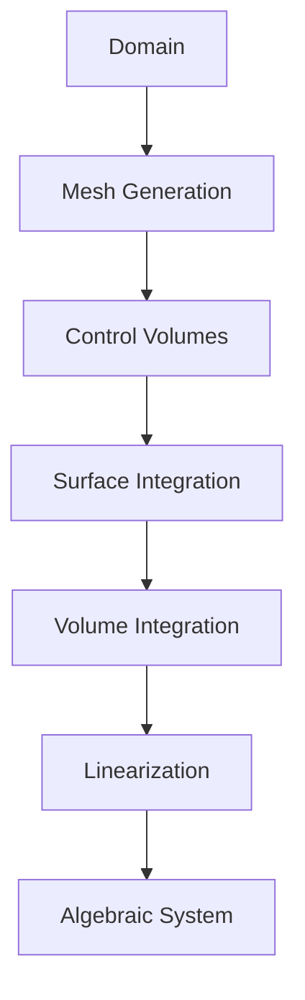
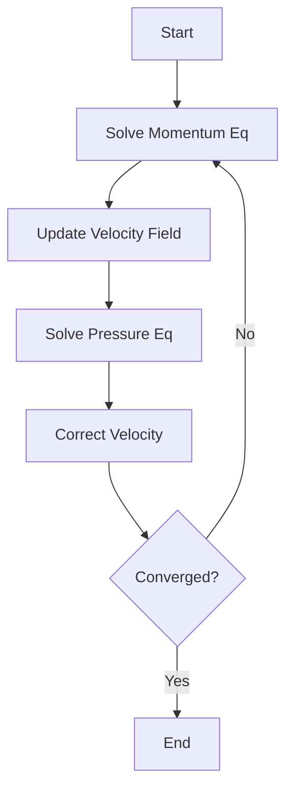
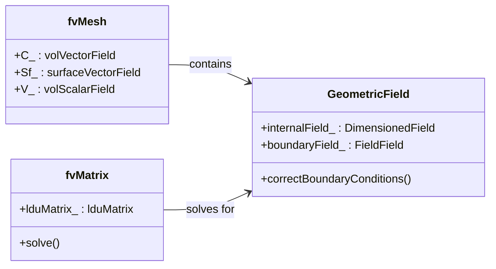

---
tags:
  - openfoam
  - cfd
  - hardcore
  - day-02
date: 2026-01-02
aliases:
  - Finite Volume Method & Discretization
difficulty: hardcore
topic: Finite Volume Method & Discretization
---

# ระเบียบวิธีปริมาตรจำกัดและการแปลงเป็นสมการเชิงตัวเลข (Finite Volume Method & Discretization)
## HARDCORE Level - 2026-01-02

---

## วัตถุประสงค์การเรียนรู้ (Learning Objectives)
- **Core Concept**: เข้าใจสมการควบคุมการไหล (Navier-Stokes) และรูปแบบอินทิกรัล
- **Discretization**: เข้าใจหลักการแปลงสมการเชิงอนุพันธ์เป็นสมการพีชคณิตด้วยวิธี Finite Volume (Space & Time)
- **Architecture**: เข้าใจโครงสร้างคลาสหลักของ OpenFOAM (`fvMesh`, `GeometricField`, `fvm`/`fvc`)
- **Configuration**: สามารถตั้งค่า `fvSchemes` และ `fvSolution` ได้อย่างถูกต้องและเหมาะสมกับปัญหา
- **Implementation**: เขียนโค้ดพื้นฐานสำหรับ Convection, Diffusion และ SIMPLE algorithm loop ได้

---

## สารบัญ (Table of Contents)
- [[#1. ทฤษฎี: สมการหลักและฟิสิกส์ (Theory: Core Equations & Physics)|1. ทฤษฎี: สมการหลักและฟิสิกส์]]
- [[#2. โครงสร้างคลาสและการนำไปใช้ (OpenFOAM Class Hierarchy & Implementation)|2. โครงสร้างคลาสและการนำไปใช้]]
- [[#3. การไล่โค้ด (Code Walkthrough)|3. การไล่โค้ด]]
- [[#4. การวิเคราะห์ Dictionary และการตั้งค่า (Dictionary Analysis & Configuration)|4. การวิเคราะห์ Dictionary และการตั้งค่า]]
- [[#5. ภาคปฏิบัติ: งานเขียนโค้ด (Hands-on: Practical Tasks & Coding)|5. ภาคปฏิบัติ: งานเขียนโค้ด]]
- [[#6. ทดสอบความเข้าใจ (Concept Checks)|6. ทดสอบความเข้าใจ]]

---

## 1. ทฤษฎี: สมการหลักและฟิสิกส์ (Theory: Core Equations & Physics)

### 1.1 สมการควบคุมการไหล (Governing Equations of Fluid Motion)

สมการพื้นฐานที่ควบคุมการไหลของของไหลได้มาจากหลักการอนุรักษ์ 3 ประการ:

> [!INFO] กฎการอนุรักษ์ (Conservation Laws)
> - **มวล (Mass)**: สมการความต่อเนื่อง (Continuity Equation)
> - **โมเมนตัม (Momentum)**: กฎข้อที่สองของนิวตัน (Newton's Second Law)
> - **พลังงาน (Energy)**: กฎข้อที่หนึ่งของอุณหพลศาสตร์ (First Law of Thermodynamics)

#### 1.1.1 สมการความต่อเนื่อง (Continuity Equation)

$$\frac{\partial \rho}{\partial t} + \nabla \cdot (\rho \mathbf{U}) = 0$$

**ความหมายของตัวแปร:**
- $\rho$: ความหนาแน่น (Density) [kg/m³]
- $\mathbf{U}$: เวกเตอร์ความเร็ว (Velocity vector) [m/s]
- $\nabla \cdot$: ตัวดำเนินการ Divergence
- $t$: เวลา (Time) [s]

สำหรับการไหลแบบอัดตัวไม่ได้ (Incompressible flow, $\rho = \text{const}$):
$$\nabla \cdot \mathbf{U} = 0$$

#### 1.1.2 สมการโมเมนตัม (Momentum Equation - Navier-Stokes)

$$\frac{\partial (\rho \mathbf{U})}{\partial t} + \nabla \cdot (\rho \mathbf{U} \mathbf{U}) = -\nabla p + \nabla \cdot \boldsymbol{\tau} + \rho \mathbf{g}$$

**ความหมายของตัวแปร:**
- $p$: ความดัน (Pressure) [Pa]
- $\boldsymbol{\tau}$: เทนเซอร์ความเค้น (Stress tensor) [Pa]
- $\mathbf{g}$: ความเร่งเนื่องจากแรงโน้มถ่วง (Gravitational acceleration) [m/s²]
- $\rho \mathbf{U} \mathbf{U}$: พจน์การพา (Convection Term) - เป็นเทอม Non-linear

> [!WARNING] ความไม่เป็นเชิงเส้น (Nonlinearity Warning)
> พจน์ Convection $\nabla \cdot (\rho \mathbf{U} \mathbf{U})$ ทำให้สมการ Navier-Stokes ยากต่อการหาผลเฉลยแม่นตรง (Analytical solution) อย่างมาก นี่คือเหตุผลที่เราต้องการระเบียบวิธีเชิงตัวเลขอย่าง FVM

สำหรับของไหล Newtonian ที่มีความหนืดคงที่:
$$\boldsymbol{\tau} = \mu \left[ \nabla \mathbf{U} + (\nabla \mathbf{U})^T - \frac{2}{3}(\nabla \cdot \mathbf{U})\mathbf{I} \right]$$

โดยที่ $\mu$ คือความหนืดพลวัต (Dynamic viscosity) [Pa·s]

#### 1.1.3 สมการการขนส่งทั่วไป (General Transport Equation)

กฎการอนุรักษ์ทั้งหมดสามารถเขียนให้อยู่ในรูปแบบทั่วไปได้ดังนี้:

$$\frac{\partial (\rho \phi)}{\partial t} + \nabla \cdot (\rho \mathbf{U} \phi) = \nabla \cdot (\Gamma_\phi \nabla \phi) + S_\phi$$

**ความหมายของตัวแปร:**
- $\phi$: คุณสมบัติที่ถูกถ่ายโอน (Transported property) - เช่น $1$, $\mathbf{U}$, $T$
- $\Gamma_\phi$: สัมประสิทธิ์การแพร่ (Diffusion coefficient)
- $S_\phi$: พจน์แหล่งกำเนิด (Source term)

### 1.2 พื้นฐานระเบียบวิธีปริมาตรจำกัด (Finite Volume Method Fundamentals)

#### 1.2.1 รูปแบบอินทิกรัล (Integral Form)

FVM เริ่มต้นจากรูปแบบอินทิกรัลของสมการการขนส่งทั่วไปเหนือปริมาตรควบคุม $V$:

$$\int_V \frac{\partial (\rho \phi)}{\partial t} dV + \oint_A \mathbf{n} \cdot (\rho \mathbf{U} \phi) dA = \oint_A \mathbf{n} \cdot (\Gamma_\phi \nabla \phi) dA + \int_V S_\phi dV$$

**แนวคิดหลัก (Key Concept):** แบ่งโดเมนออกเป็นปริมาตรควบคุม (Control Volumes - CVs) ย่อยๆ และประยุกต์ใช้กฎการอนุรักษ์กับแต่ละ CV

> [!TIP] ทำไมต้องใช้ FVM? (Why FVM?)
> - **Conservative by design**: ฟลักซ์ที่ออกจาก CV หนึ่งจะเข้าสู่ CV ข้างเคียงเสมอ
> - **Handles complex geometries**: รองรับ Unstructured mesh ได้ดี
> - **Physically intuitive**: อิงตามหลักการอนุรักษ์ทางฟิสิกส์

#### 1.2.2 กระบวนการแปลงเป็นสมการเชิงตัวเลข (Discretization Process)

การ Discretization คือการแปลงสมการอินทิกรัลให้เป็นสมการพีชคณิต:

$$a_P \phi_P = \sum_{f} a_f \phi_f + b_P$$

**ขั้นตอนการ Discretization:**



#### 1.2.3 การดิสครีไทซ์เวลา (Temporal Discretization)

สำหรับการจำลองสภาวะ Transient เราต้องดิสครีไทซ์อนุพันธ์เทียบเวลา:

$$\frac{\partial (\rho \phi)}{\partial t} \approx \frac{(\rho \phi)^{n+1} - (\rho \phi)^n}{\Delta t}$$

**รูปแบบทั่วไป (Common schemes):**
- **Euler Explicit**: $\phi^{n+1} = \phi^n + \Delta t \cdot R(\phi^n)$
- **Euler Implicit**: $\phi^{n+1} = \phi^n + \Delta t \cdot R(\phi^{n+1})$
- **Crank-Nicolson**: $\phi^{n+1} = \phi^n + \frac{\Delta t}{2}[R(\phi^n) + R(\phi^{n+1})]$

> [!INFO] เสถียรภาพ (Stability Considerations)
> - **Explicit schemes**: เสถียรแบบมีเงื่อนไข (Conditional stability - ขึ้นกับ CFL)
> - **Implicit schemes**: เสถียรแบบไม่มีเงื่อนไข (Unconditionally stable) แต่ต้องแก้สมการแบบ Iterative

#### 1.2.4 การดิสครีไทซ์เชิงพื้นที่: พจน์การพา (Spatial Discretization: Convection Terms)

Convective flux ที่หน้าสัมผัส $f$ ต้องการการจัดการเป็นพิเศษ:

$$F_f^C = (\rho \mathbf{U} \phi)_f \cdot \mathbf{A}_f$$

**รูปแบบ Upwind Schemes:**

| Scheme | สูตร (Formula) | เสถียรภาพ (Stability) | ความแม่นยำ (Accuracy) |
|--------|---------|-----------|----------|
| First-Order Upwind | $\phi_f = \phi_{upwind}$ | เสถียรมาก | อันดับ 1 (Diffusive) |
| Central Differencing | $\phi_f = 0.5(\phi_P + \phi_N)$ | เสถียรแบบมีเงื่อนไข | อันดับ 2 |
| QUICK | Quadratic interpolation | เสถียรแบบมีเงื่อนไข | อันดับ 3 |
| Linear Upwind | $\phi_f = \phi_{upwind} + \nabla \phi \cdot \mathbf{d}$ | เสถียร | อันดับ 2 |

> [!WARNING] การแพร่เทียม (Numerical Diffusion)
> First-order upwind schemes ทำให้เกิดการแพร่เทียม (False diffusion) ซึ่งทำให้ Gradient ที่คมชัดเบลอไป ควรใช้ Scheme อันดับสูงขึ้นเพื่อให้ได้ผลลัพธ์ที่แม่นยำ

#### 1.2.5 การดิสครีไทซ์เชิงพื้นที่: พจน์การแพร่ (Spatial Discretization: Diffusion Terms)

Diffusive flux ใช้ทฤษฎีบทของ Gauss:

$$F_f^D = (\Gamma_\phi \nabla \phi)_f \cdot \mathbf{A}_f$$

**การแก้ไขความไม่ตั้งฉาก (Non-orthogonal correction):**

สำหรับ Mesh ที่ไม่ตั้งฉาก เราจะแยกองค์ประกอบของ Gradient:

$$\nabla \phi = \underbrace{\frac{\phi_N - \phi_P}{|\mathbf{d}|} \mathbf{n}}_{\text{orthogonal}} + \underbrace{(\nabla \phi - (\nabla \phi \cdot \mathbf{n})\mathbf{n})}_{\text{correction}}$$

โดยที่ $\mathbf{d}$ คือเวกเตอร์ระยะทางระหว่างจุดศูนย์กลางเซลล์

![[fv_mesh_owner_neighbour_1767278470077.png]]
*รูปที่ 1.2.5: แสดงเวกเตอร์ระยะทาง (d) และเวกเตอร์พื้นที่หน้า (Sf) ในการเชื่อมต่อ Owner-Neighbour*

#### 1.2.6 การเชื่อมโยงความดัน-ความเร็ว (Pressure-Velocity Coupling)

การเชื่อมโยงระหว่างความดันและความเร็วเป็นสิ่งสำคัญในการไหลแบบ Incompressible



**SIMPLE Algorithm:**
1. สมมติสนามความดันเริ่มต้น $p^*$
2. แก้สมการโมเมนตัมหา $\mathbf{U}^*$
3. แก้สมการ Pressure correction หา $p'$
4. ปรับแก้ความดัน: $p = p^* + p'$
5. ปรับแก้ความเร็ว: $\mathbf{U} = \mathbf{U}^* + \mathbf{U}'$
6. ทำซ้ำจนกว่าจะลู่เข้า

### 1.3 รูปแบบการดิสครีไทซ์ใน OpenFOAM (Discretization Schemes in OpenFOAM)

#### 1.3.1 รูปแบบทางเวลา (Temporal Schemes - `ddtSchemes`)

```cpp
ddtSchemes
{
    default         Euler;          // First-order implicit
    // default         backward;       // Second-order implicit
}
```

#### 1.3.2 รูปแบบเกรเดียนต์ (Gradient Schemes - `gradSchemes`)

```cpp
gradSchemes
{
    default         Gauss linear;    // Central differencing
}
```

#### 1.3.3 รูปแบบไดเวอร์เจนซ์ (Divergence Schemes - `divSchemes`)

```cpp
divSchemes
{
    default         none;
    div(phi,U)      Gauss upwind;           // First-order
    // div(phi,U)      Gauss linearUpwind grad(U); // Second-order
}
```

#### 1.3.4 รูปแบบลาปลาเซียน (Laplacian Schemes - `laplacianSchemes`)

```cpp
laplacianSchemes
{
    default         Gauss linear corrected;
}
```

> [!INFO] Non-orthogonal Correction
> ตัวเลือก `corrected` จะเพิ่มพจน์แก้ไขความไม่ตั้งฉากเพื่อความแม่นยำที่ดีขึ้นบน Mesh ที่เบี้ยว

### 1.4 อัลกอริทึมการแก้และตัวแก้สมการเชิงเส้น (Solution Algorithms and Linear Solvers)

#### 1.4.1 ระบบสมการพีชคณิต

หลังจากการ Discretize เราจะได้ระบบสมการเชิงเส้นแบบ Sparse:

$$[A] {\phi} = {b}$$

#### 1.4.2 ตัวแก้สมการแบบวนซ้ำ (Iterative Solvers)

กำหนดใน `fvSolution`:

```cpp
solvers
{
    p
    {
        solver          GAMG;
        tolerance       1e-06;
        relTol          0.01;
        smoother        GaussSeidel;
    }
}
```

**Solvers ทั่วไป:**
- **GAMG**: เร็วมากสำหรับสมการความดัน (Poisson)
- **smoothSolver**: ทนทานสำหรับสมการโมเมนตัม
- **PCG/PBiCGStab**: Krylov subspace methods สำหรับเมทริกซ์สมมาตร/ไม่สมมาตร

### 1.5 สรุปสมการสำคัญ (Summary of Key Equations)

| Equation | Discretized Form |
|----------|-----------------|
| **Continuity** | $\sum_f \mathbf{U}_f \cdot \mathbf{A}_f = 0$ |
| **Momentum** | $a_P \mathbf{U}_P = \sum a_f \mathbf{U}_f - \nabla p + \mathbf{S}$ |
| **Pressure** | $a_P p_P = \sum a_f p_f + b_p$ |

> [!SUCCESS] สรุป (Summary)
> ส่วนนี้ได้ปูพื้นฐานทางคณิตศาสตร์ของ Finite Volume Method ตั้งแต่สมการ Navier-Stokes ไปจนถึงรูปแบบ Discretized ความเข้าใจเรื่อง Upwind schemes, Non-orthogonal correction และ Pressure-velocity coupling เป็นรากฐานสำคัญในการใช้งาน OpenFOAM

---

## 2. โครงสร้างคลาสและการนำไปใช้ (OpenFOAM Class Hierarchy & Implementation)

### 2.1 คลาสหลักของ Finite Volume (Core Finite Volume Classes)



### 2.2 คลาสเมช (Mesh Classes)

**`fvMesh`** (`$FOAM_SRC/finiteVolume/meshes/fvMesh/fvMesh.H`):
- Wrapper ของ `polyMesh`
- ให้การเข้าถึงข้อมูลทางเรขาคณิต: `V()` (ปริมาตร), `Sf()` (พื้นที่หน้า), `C()` (จุดศูนย์กลาง)

### 2.3 คลาสฟิลด์ (Field Classes)

**`GeometricField`** (`$FOAM_SRC/OpenFOAM/fields/GeometricField/GeometricField.H`):
- `volScalarField`: ความดัน ($p$), อุณหภูมิ ($T$)
- `volVectorField`: ความเร็ว ($\mathbf{U}$)
- `surfaceScalarField`: ฟลักซ์ ($\phi$)

### 2.4 fvc และ fvm

- **`fvc` (Finite Volume Calculus)**:
  - คำนวณแบบ Explicit (คืนค่าเป็น Field)
  - ตัวอย่าง: `fvc::grad(p)`, `fvc::div(phi)`
- **`fvm` (Finite Volume Method)**:
  - คำนวณแบบ Implicit (คืนค่าเป็น Matrix)
  - ตัวอย่าง: `fvm::laplacian(nu, U)`, `fvm::ddt(U)`

### 2.5 LduMatrix

OpenFOAM เก็บ Sparse Matrix ในรูปแบบ **LDU (Lower-Diagonal-Upper)** ซึ่งมีประสิทธิภาพสูงสำหรับ Unstructured Mesh:
- **Diagonal**: สัมประสิทธิ์ $a_P$
- **Lower/Upper**: สัมประสิทธิ์การเชื่อมต่อระหว่างเซลล์ ($a_N$)

> [!SUCCESS] สรุป (Summary)
> เราได้สำรวจโครงสร้างคลาสหลัก `fvMesh`, `GeometricField` และ `fvMatrix` รวมถึงความแตกต่างระหว่าง `fvc` (Explicit) และ `fvm` (Implicit) ซึ่งเป็นหัวใจของการเขียน Solver

---

## 3. การไล่โค้ด (Code Walkthrough)

### 3.1 fvMesh.H

คลาส `fvMesh` จัดการข้อมูลเรขาคณิตแบบ **Lazy Evaluation** (คำนวณเมื่อถูกเรียกใช้):

```cpp
// Geometric data access
const volScalarField::Internal& V() const;  // Cell volumes
const surfaceVectorField::Internal& Sf() const;  // Face area vectors
const volVectorField::Internal& C() const;  // Cell centers
```

### 3.2 fvSchemes.H

คลาส `fvSchemes` อ่านการตั้งค่าจาก `system/fvSchemes` และสร้างออบเจกต์ Scheme ที่เหมาะสมผ่าน `tmp` pointer (Smart pointer):

```cpp
// Get divergence scheme
tmp<divScheme<Type>> div(const word& name) const;
```

### 3.3 fvSolution.H

คลาส `fvSolution` จัดการการตั้งค่า Solver และ Relaxation factors:

```cpp
// Get solver dictionary
const solutionDict& solverDict(const word& fieldName) const;
```

---

## 4. การวิเคราะห์ Dictionary และการตั้งค่า (Dictionary Analysis & Configuration)

### 4.1 fvSchemes Analysis

การเลือก Scheme ส่งผลโดยตรงต่อความแม่นยำและเสถียรภาพ:

- **ddtSchemes**: `Euler` (Stable, 1st order) vs `backward` (Accurate, 2nd order)
- **gradSchemes**: `Gauss linear` (Standard) vs `leastSquares` (Better for bad mesh)
- **divSchemes**: `Gauss upwind` (Stable) vs `Gauss limitedLinear` (Accurate + Bounded)

> [!TIP] คำแนะนำ
> เริ่มต้นด้วย `upwind` สำหรับ Convection เพื่อให้รันผ่านก่อน แล้วจึงปรับเป็น `linearUpwind` หรือ `limitedLinear` เพื่อความแม่นยำ

### 4.2 fvSolution Analysis

การตั้งค่า Solver ที่ดีช่วยลดเวลาการคำนวณ:

- **Pressure (`p`)**: ใช้ `GAMG` (Geometric-Algebraic Multi-Grid) เสมอสำหรับเคสขนาดใหญ่
- **Velocity (`U`)**: ใช้ `smoothSolver` หรือ `PBiCGStab`
- **Tolerance**: `1e-6` สำหรับ Pressure, `1e-5` สำหรับ Velocity
- **RelTol**: `0.01` หรือ `0.1` ระหว่าง Iteration เพื่อประหยัดเวลา

---

## 5. ภาคปฏิบัติ: งานเขียนโค้ด (Hands-on: Practical Tasks & Coding)

### งานที่ 1: Implement Upwind Convection

เขียนฟังก์ชันคำนวณ Explicit Convection:

```cpp
volScalarField computeUpwindConvection(const volScalarField& phi, const surfaceScalarField& phiU)
{
    const fvMesh& mesh = phi.mesh();
    volScalarField divPhiUPhi(IOobject("divPhiUPhi", ...), mesh, dimensionedScalar("zero", ...));
    
    // Explicit calculation loop
    forAll(phiU, facei)
    {
        label own = mesh.owner()[facei];
        label nei = mesh.neighbour()[facei];
        
        // Upwind choice
        scalar phiFace = (phiU[facei] > 0) ? phi[own] : phi[nei];
        
        scalar flux = phiU[facei] * phiFace;
        divPhiUPhi[own] += flux;
        divPhiUPhi[nei] -= flux;
    }
    
    divPhiUPhi /= mesh.V();
    return divPhiUPhi;
}
```

### งานที่ 2: Implement Laplacian with Correction

เขียนฟังก์ชัน Laplacian พร้อม Non-orthogonal Correction:

```cpp
tmp<fvScalarMatrix> laplacianWithCorrection(const volScalarField& Gamma, const volScalarField& phi)
{
    // ... setup ...
    forAll(owner, facei)
    {
        // Orthogonal part (Implicit)
        scalar coeff = gammaMagSf * deltaCoeff;
        diag[own] += coeff;
        upper[facei] = -coeff;
        
        // Non-orthogonal correction (Explicit source)
        vector SfCorr = Sf[facei] - SfOrth;
        scalar gradCorr = Gammaf[facei] * (SfCorr & fvc::grad(phi)[facei]);
        source[own] -= gradCorr;
        source[nei] += gradCorr;
    }
    return tfvm;
}
```

### งานที่ 3: Implement SIMPLE Loop

```cpp
void simpleAlgorithmLoop(...)
{
    while (!converged && iter < maxIter)
    {
        // Momentum Predictor
        fvVectorMatrix UEqn(fvm::div(phi, U) - fvm::laplacian(nu, U));
        UEqn.relax(alphaU);
        UEqn.solve();
        
        // Pressure Correction
        fvScalarMatrix pEqn(fvm::laplacian(rAU, p) == fvc::div(phi));
        pEqn.setReference(pRefCell, pRefValue);
        pEqn.solve();
        
        // Correct Flux & Velocity
        phi -= pEqn.flux();
        U -= rAU * fvc::grad(p);
        U.correctBoundaryConditions();
        
        p.relax(alphaP);
    }
}
```

---

## 6. ทดสอบความเข้าใจ (Concept Checks)

### คำถามที่ 1: ข้อดีหลักของ FVM คืออะไร?
> [!SUCCESS] เฉลย
> ความเป็นอนุรักษ์โดยธรรมชาติ (Conservative by design) ฟลักซ์ที่ออกจากเซลล์หนึ่งจะเข้าสู่เซลล์ข้างเคียงเสมอ

### คำถามที่ 2: เปรียบเทียบ Upwind vs Central Differencing?
> [!SUCCESS] เฉลย
> Upwind เสถียรแต่มีความแม่นยำต่ำ (1st order, diffusive) ส่วน Central แม่นยำกว่า (2nd order) แต่อาจไม่เสถียร (Oscillatory)

### คำถามที่ 3: ทำไมต้องใช้ GAMG กับสมการความดัน?
> [!SUCCESS] เฉลย
> เพราะสมการความดันเป็นแบบ Elliptic (Poisson) ซึ่งมี Error mode แบบความถี่ต่ำที่กำจัดยากด้วย Solver ทั่วไป GAMG ใช้ Grid หลายระดับเพื่อกำจัด Error นี้อย่างรวดเร็ว ($O(N)$)

### คำถามที่ 4: หน้าที่ของ Non-orthogonal Correction คืออะไร?
> [!SUCCESS] เฉลย
> เพื่อชดเชยความผิดพลาดเมื่อเวกเตอร์พื้นที่หน้า ($\mathbf{S}_f$) ไม่ขนานกับเวกเตอร์ระยะทาง ($\mathbf{d}$) โดยเพิ่มพจน์ Explicit เข้าไปในสมการ

---

> [!SUCCESS] บทสรุปประจำวัน (Daily Summary)
> วันนี้คุณได้เรียนรู้รากฐานของ FVM และการแปลงสมการใน OpenFOAM การเข้าใจโครงสร้าง `fvMesh`, `fvm`/`fvc` และการตั้งค่า Dictionary จะช่วยให้คุณสามารถปรับแต่งและพัฒนา Solver ได้อย่างมีประสิทธิภาพ ในบทถัดไปเราจะเจาะลึกเรื่อง Pressure-Velocity Coupling แบบละเอียด
